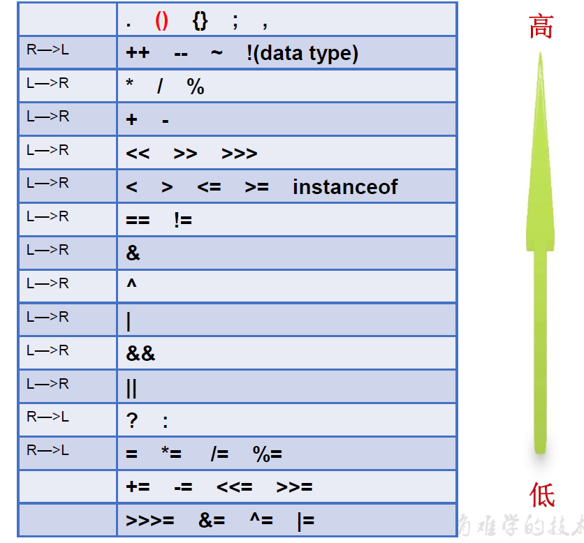

Java定义的数据类型

# 一、数据分类

bit: 计算机中的最小存储单位。byte:计算机中基本存储单元。

## 基本数据类型

	整型：byte(1字节=8bit,-2^8 ~2^8-1,-128 ~ 127) \ short(2字节，-2^15 ~2^15-1) \ int(4字节,-2^31 ~ 2^31-1,<约21亿>) \ long(8字节,-2^63 ~ 2^63-1)
	浮点型：float(4字节，-3.403E38 ~ 3.403E38) \ double(8字节，-1.798E308 ~ 1.798E308)
	字符型：char(1字符=2字节，是正数，0-2^15-1,0-65535)
	布尔型：boolean

## 引用数据类型


	类(class)
	接口(interface)
	数组(array)

## 数据注意事项

```
1、声明long型变量，如果在int返回类可以不用加L，超过int必须使用"l"或"L"结尾
2、通常，定义整型变量时，使用int型。整数常量默认是int，小数常量默认是double
3、定义float类型变量时，变量必须使用"f"或"F"结尾
   float表示数值的范围比long还大
4、 定义char型变量，通常使用一对'',内部只能写一个字符
    字符变量包含三种形式：一个字符、转义字符、直接使用 Unicode（\u开头的） 值来表示字符型常量
```

## 字符集

Java中的所有字符都使用Unicode编码，故一个字符可以存储一个字母，一个汉字，或其他书面语的一个字符。

**ASCII** **码** ：美国制定了一套字符编码，对英语字符与二进制位之间的

关系，做了统一规定。这被称为ASCII码。ASCII码一共规定了128个字符的编码，比如空格“SPACE”是32（二进制00100000），大写的字母A是65（二进制01000001）。这128个符号（包括32个不能打印出来的控制符号），只占用了一个字节的后面7位，最前面的1位统一规定为0

**Unicode 编码**：一种编码，将世界上所有的符号都纳入其中。每一个符号都给予一个独一无二的编码，使用Unicode 没有乱码的问题。Unicode 只规定了符号的二进制代码，却没有规定这个二进制代码应该如何存储：无法区别 Unicode 和 ASCII。

**UTF-8** ：是在互联网上使用最广的一种 Unicode 的实现方式。UTF-8 是一种变长的编码方式。它可以使用 1-6 个字节表示一个符号，根据不同的符号而变化字节长度。

**UTF-8的编码规则：**

- 对于单字节的UTF-8编码，该字节的最高位为0，其余7位用来对字符进行编码（等同于ASCII码）。
- 对于多字节的UTF-8编码，如果编码包含 n 个字节，那么第一个字节的前 n 位为1，第一个字节的第 n+1 位为0，该字节的剩余各位用来对字符进行编码。在第一个字节之后的所有的字节，都是最高两位为"10"，其余6位用来对字符进行编码。

# 二、基本数据类型转换

7中基本类型之间的运算，不包含boolean。

## 自动类型提升

byte-->short-->int-->long-->float-->double 容量从小到大排序

当容量小的数据类型的变量与容量大的数据类型的变量做运算时，结果自动提升为容量大的数据类型（**<font color='red'>不是占用的内存大小</font>**）。

注意事项：

- 当byte、char、short三种类型的变量做运算时，结果为int类型，如果不是大于int容量接收编译不通过。
- char虽然占用两个字节，但是不能与short相互接收，编译会不通过。
- byte、char、short三种类型定义初始化赋值时，如果超过他们容量会编译报错，在他们返回内则正常。
- 常量整形是int，小数是double。
- byte,short,char之间不会相互转换，他们三者在计算时首先转换为int类型
- boolean类型不能与其它数据类型运算

## 强制类型转换

- 需要使用强转符：()
- 注意点：强制类型转换，可能导致精度降低或溢出。
- boolean类型不可以转换为其它的数据类型。

## String

- String属于引用数据类型，字符串。
- 声明String变量时，使用一对""
- String与基本类型链接结果都是String。
- 字符串不能直接转换为基本类型，但通过基本类型对应的包装类则可以实现把字符串转换成基本类型。 

# 三、进制

## 常见进制

- 二进制：0，1，以0b或者0B开头表示。
- 十进制：日常使用
- 八进制：0-7，以数字0开头表示。
- 十六进制：0-9  A-F，以0x或0X开头。

## 进制转换

**二进制的整数有如下三种形式：**

- 原码 ：直接将一个数值换成二进制数。最高位是符号位
- 负数的反码 ：是对原码按位取反，只是最高位（符号位）确定为 1。
- 负数的补码 ：其反码加 1 。

**计算机以二进制 补码的形式保存所有的整数，引进补码的作用是为了让计算机更方便做减法。。**

- 正数的原码、反码、补码都相同
- 负数的补码是其反码 +1

**十进制转换二进制：除2取余的逆向。**

- 如：13 除2  余1  6除2 余0  3除2 余1  1除2 余1  后面都不够了就是0 ，按照顺序 1011 0000 取逆，就是  0000 1101

**二进制转十进制**：从右向左0幂次开始，查看是1的位数相加。

- 0000 1101=2^3+2^2+2^0=13

**八进制转二进制：**

- 将每个数拆成三个二进制拼接到一起

**二进制转八进制：**

- 三个二算值，拼接到一起

**十六进制转二进制：**

- 将每个数拆成四个二进制拼接到一起

**二进制转十六进制：**

- 四个二进算值，拼接到一起。

# 四、运算符

## 算术运算符

| 运算符 | 运算                                              | 范例                    | 结果                |
| ------ | ------------------------------------------------- | ----------------------- | ------------------- |
| +      | 正号                                              | +3                      | 3                   |
| -      | 负号                                              | b=4;-b                  | -4                  |
| +      | 加                                                | 5+5                     | 10                  |
| -      | 减                                                | 6-2                     | 4                   |
| *      | 乘                                                | 3*4                     | 12                  |
| /      | 除                                                | 5/5                     | 1                   |
| %      | 取模（取余）                                      | 7%5                     | 2                   |
| ++     | 自增(前)：先运算后取值<br/>自增(后)：先取值后运算 | a=2;b=++a<br/>a=2;b=a++ | a=3,b=3<br/>a=3,b=2 |
| --     | 自减(前)：先运算后取值<br/>自减(后)：先取值后运算 | a=2;b=--a<br/>a=2;b=a-- | a=1,b=1<br/>a=1,b=2 |
| +      | 字符串连接                                        | “He”+”llo”              | “Hello”             |

**<font color='red'>自增或者自减不会改变数据类型，能够编译通过，正常运行。如byte b1=127;b1++;结果是-128，但是不能b1 = b1+1,这样编译不通过。</font>**

## 赋值运算符

* 符号“=”

  当 “=”两侧数据类型不一致时 可以使用 自动类型转换或使用强制类型转换原则进行处理 。支持 连续赋值

* 扩展赋值运算符：+=, -=, *=, /=,%=

  **<font color='red'>这个不会改变数据类型，能够编译通过，正常运行。如byte b1=127;b1+=1;结果是-128，但是不能b1 = b1+1,这样编译不通过。</font>**

  此运算可以赋值所有基本类型，jdk会做自动转换为对应的类型。比如 byte b1=1;b1*=0.3;可以自动编译通过结果为0。

  int n=10;n+=(n++)+(++n)，n的结果为32，n=10+10(先赋值，再计算+1)+（先加1再赋值）12

## 比较运算符（关系运算符）

| 运算符     | 运算               | 范例                      | 结果  |
| ---------- | ------------------ | ------------------------- | ----- |
| ==         | 相等于             | 4==3                      | false |
| !=         | 不等于             | 4!=3                      | true  |
| <          | 小于               | 4<3                       | false |
| >          | 大于               | 4>3                       | true  |
| <=         | 大于等于           | 4<=3                      | false |
| >=         | 小于等于           | 4>=3                      | true  |
| instanceof | 检查是否是类的对象 | "Hello" instanceof String | true  |

## 逻辑运算符

&逻辑与      | 逻辑或    !逻辑非

&&短路与    || 短路或    ^ 逻辑异或(不一样才是true，一样的为fasle)

## 位运算符

操作的都是整形变量。位移有范围，大了超过存储位数，发生那个不必要的结果。

| 运算符 | 运算       | 范例                                                         |
| ------ | ---------- | ------------------------------------------------------------ |
| <<     | 左移       | 3 << 2 = 12 --> 3 *2 *2 =12  位移几位就乘以多少个2           |
| >>     | 右移       | 3>> 1 =1 --> 3/2=1 位移几位就除以多少个2，最高位按照之前的进行补位 |
| >>>    | 无符号右移 | 3>>>1=1 --> 3/2=1   最高位都是0补，就是会变成正数。          |
| &      | 与         | 6&3 =2  二进制同为1为1，否则为为0                            |
| \|     | 或         | 6\|3 = 7  二进制有1为1，否则为为0                            |
| ^      | 亦或       | 6^3 = 5  二进制相同为1，否则为为0                            |
| ~      | 取反       | ~6 = -7  二进制为1变为0，为0的变为1                          |

## 三元运算符

* 格式：条件表达式？表达式1：表达式2，表达式为true返回表达式1的值，反之返回表达式2的值

  代码：

  ```
  Object o1 = true ? new Integer(1) : new Double(2.0);
  System.out.println(o1);// 输出1.0
  ```

  

* 三元运算符可以嵌套

* 三元运算符都可以改为if else，反之不成立

* 也会自动类型提升

## 运算符优先级

运算符有不同的优先级，所谓优先级就是表达式运算中的运算序。如右表，上一行运算符总优先于下一行。

只有单目运算符、三元运算符、赋值运算符是从右向左运算的。



# 五、流程控制

## 顺序结构

程序 从上到下逐行地执行，中间没有任何判断和跳转。

## 分支结构

根据 条件，选择性地执行某段代码。有 if…else 和 switch case 两种 分支语句。

### if else

- if else 只有一行可以省略大括号，建议不要省略，不好查看。

- if else 省略大括号后，选择就近原则。

  比如下面：输出为省略大括号结果，if选择就近结果，为if(y>2)的else

  ```
  if(x>2)
      if(y>2)
          System.out.println("x,y大于2");
  else
      System.out.println("省略大括号结果");
  ```

- boolean赋值可以在if中使用，这里需要注意，尽量直接使用boolean值进行判断，不要用比较运算符。

  比如下面结果输入为：bool是true

  ```
  boolean bool = false;
  if(bool = true){
      System.out.println("bool是"+bool);
  }
  ```

### switch case

- 格式

```
switch(表达式){
case 常量1:
	执行语句1;
	//break;

case 常量2:
	执行语句2;
	//break;

...

default:
	执行语句n;
	//break;

}
```

- 根据switch表达式中的值，依次匹配各个case中的常量。一旦匹配成功，则进入相应case结构中，调用其执行语句。当调用完执行语句以后，则仍然继续向下执行其他case结构中的执行语句，直到遇到break关键字或此switch-case结构末尾结束为止。
- break,可以使用在switch-case结构中，表示一旦执行到此关键字，就跳出switch-case结构

- switch结构中的表达式，只能是如下的6种数据类型之一：
     byte 、short、char、int、枚举类型(JDK5.0新增)、String类型(JDK7.0新增)
- case 之后只能声明常量。不能声明范围。

- break关键字是可选的。
- default:相当于if-else结构中的else.  
  default结构是可选的，而且位置是灵活的。
- 是可以使用switch-case的结构，都可以转换为if-else。反之，不成立。
- 我们写分支结构时，当发现既可以使用switch-case,（同时，switch中表达式的取值情况不太多），
  又可以使用if-else时，我们优先选择使用switch-case。原因：switch-case执行效率稍高。

## 循环结构

根据 循环条件，重复性的执行某段代码。有 while 、 do…while 、 for 三种循环语句。注 JDK1.5 提供了 foreach 循环，方便的遍历集合、数组元素。

### for循环

For循环结构的使用
一、循环结构的4个要素
① 初始化条件
② 循环条件  --->是boolean类型
③ 循环体
④ 迭代条件

二、for循环的结构

for(①;②;④){
	③
}

执行过程：① - ② - ③ - ④ - ② - ③ - ④ - ... - ②

### while 循环

一、循环结构的4个要素
① 初始化条件
② 循环条件  --->是boolean类型
③ 循环体
④ 迭代条件

二、while循环的结构

①
while(②){
	③;
	④;
}

执行过程：① - ② - ③ - ④ - ② - ③ - ④ - ... - ②

说明：
1.写while循环千万小心不要丢了迭代条件。一旦丢了，就可能导致死循环！
2.我们写程序，要避免出现死循环。
3.for循环和while循环是可以相互转换的！ 
  区别：for循环和while循环的初始化条件部分的作用范围不同。


算法：有限性。

### do-while循环

一、循环结构的4个要素
① 初始化条件
② 循环条件  --->是boolean类型
③ 循环体
④ 迭代条件

二、do-while循环结构：

①
do{
	③;
	④;

}while(②);

执行过程：① - ③ - ④ - ② - ③ - ④ - ... - ②

说明：
1.do-while循环至少会执行一次循环体！
2.开发中，使用for和while更多一些。较少使用do-while

### break和continue关键字

break：switch-case、循环结构中，结束当前循环

continue：循环结构中，结束当次循环

break label;//结束指定标识的一层循环结构，需要结束的循环位置加上label:
continue label;//结束指定标识的一层循环结构当次循环需要结束的循环位置加上label:


