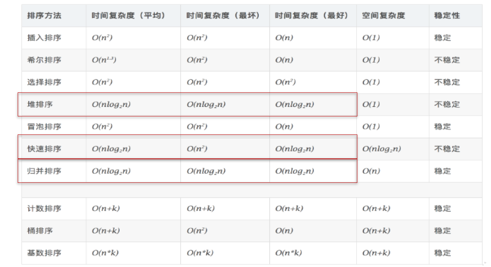

# 第3章 数组

## 3.1 数组的概述

数组的理解：数组(Array)，是多个相同类型数据按一定顺序排列的集合，并使用一个名字命名，并通过编号的方式对这些数据进行统一管理。

## 3.2 数组相关的概念

- 数组名
- 元素
- 角标、下标、索引
- 数组的长度：元素的个数

## 3.3 数组的特点

- 数组是有序排列的
- 数组属于引用数据类型的变量。数组的元素，既可以是基本数据类型，也可以是引用数据类型
- 创建数组对象会在内存中开辟一整块连续的空间
- 数组的长度一旦确定，就不能修改。

## 3.4 数组的分类

-  按照维数：一维数组、二维数组、。。。
-  按照数组元素的类型：基本数据类型元素的数组、引用数据类型元素的数组

## 3.5一维数组的使用

-  一维数组的声明和初始化
-  如何调用数组的指定位置的元素
-  如何获取数组的长度
-  如何遍历数组
-  数组元素的默认初始化值

- 数组的内存解析

```
   //1.1 静态初始化:数组的初始化和数组元素的赋值操作同时进行
    int[] ids = new int[]{1001,1002,1003,1004};
    //1.2动态初始化:数组的初始化和数组元素的赋值操作分开进行
    String[] names = new String[5];
    //1.1 静态初始化:类型推断
    int[] idss = {1001,1002,1003,1004};
    //方括号可以写到变量位置
    int idsss[] = {1001,1002,1003,1004};
```


## 3.6 二维数组的使用

理解：

 * 对于二维数组的理解，我们可以看成是一维数组array1又作为另一个一维数组array2的元素而存在。
 * 其实，从数组底层的运行机制来看，其实没有多维数组。

二维数组的使用:

二维数组的声明和初始化

如何调用数组的指定位置的元素

如何获取数组的长度

如何遍历数组 

数组元素的默认初始化值 

数组的内存解析 


```
//静态初始化
int[][] arr1 = new int[][]{{1,2,3},{4,5},{6,7,8}};
//动态初始化1
String[][] arr2 = new String[3][2];
//动态初始化2
String[][] arr3 = new String[3][];

/也是正确的写法：
int[] arr4[] = new int[][]{{1,2,3},{4,5,9,10},{6,7,8}};
int[] arr5[] = {{1,2,3},{4,5},{6,7,8}};

//错误的情况   静态赋值不能写数组容量，一维位置没有写容量，二维位置不能初始化容量。
//		String[][] arr4 = new String[][4];
//		String[4][3] arr5 = new String[][];
//		int[][] arr6 = new int[4][3]{{1,2,3},{4,5},{6,7,8}};
```
## 3.7数组中涉及的常见算法

- 数组元素的赋值 杨辉三角、回形数等
- 求数值型 数组中元素 的最大值、最小值、平均数、总和等
- 数组的复制、反转、查找线性查找、二分法查找（所要查找的数组有序 ）
- 数组元素的排序算法

## 3.8 排序算法

衡量排序算法的优劣：

- 时间复杂度 ：分析关键字的比较次数和记录的移动次数
- 空间复杂度： 分析排序算法中需要多少辅助内存
- 稳定性： 若两个记录 A 和 B 的关键字值相等，但排序后 A 、 B 的先后次序保
  持不变，则称这种排序算法是稳定的。

排序算法分类：

​	内部排序 和 外部排序 。

​	内部排序 ：整个排序过程不需要借助于外部存储器（如磁盘等），所有排序操作都在内存中完成。
​	外部排序 ：参与排序的数据非常多，数据量非常大，计算机无法把整个排序过程放在内存中完成，必须借助于外部存储器（如磁盘）。外部排序最常见的是多路归并排序。可以认为外部排序是由多次内部排序组成。

十大内部排序算法：

- 选择排序

  直接选择排序(每次取一个数与后面数比较)、 堆排序

- 交换排序

  冒泡排序 （比较相邻两个数）、 快速排序（定义一个中位数，分成两个数组，2个分四个，这样数组分的更多）

- 插入排序

  直接插入排序、 折半插入排序、 Shell 排序

- 归并排序

- 桶式排序

- 基数排序

### 3.8.1选择排序

#### 3.8.1.1直接排序

* 原理：每次取一个，与后面的比较，进行交换位置。到最后一个时，就不需要看了。
* 不稳定性：2 3 2 1 4 ，直接选择排序后，第一轮，2会换到1位置，这两个2顺序破坏了，不稳定。

```java
public class ChooseSort {
    //选择排序
    public static void main(String[] args) {
        DataWrap[] data = {
                new DataWrap(21, "*"),
                new DataWrap(23, ""),
                new DataWrap(30, "*"),
                new DataWrap(21, ""),
                new DataWrap(-49, ""),
                new DataWrap(30, "") };
        System.out.println(Arrays.toString(data));
        //[21*, 23, 30*, 21, -49, 30]
        System.out.println("========排序前======");
        //每次取一个，与后面的所有数比较，进行交换位置。arr[arr.length-1]的时候只有1个数了，不需要进第二个循环体，所以直接到倒数第二个。
        for(int i=0;i<data.length-1;i++){
            int minIndex = i;
            for(int j=i+1;j<data.length;j++){
                if(data[minIndex].compareTo(data[j])>0){
                    minIndex = j;
                }
            }
            if(minIndex != i){//这是改进方法，可以不用每次都交换，找到最小值再交换，或者不动
                DataWrap temp = data[i];
                data[i] = data[minIndex];
                data[minIndex] = temp;
            }
            System.out.println(Arrays.toString(data));
        }
        System.out.println("========排序后======");
        //[-49, 21, 21*, 23, 30*, 30]
        System.out.println(Arrays.toString(data));
    }
}
```

#### 3.8.1.2堆排序

* 和选择排序差不多，都是找到最大值，然后交换位置

* 什么是堆：堆是一种叫做完全二叉树的数据结构，可以分为大根堆，小根堆，而堆排序就是基于这种结构而产生的一种程序算法。
  * 大根(顶)堆:每个节点的值都大于或者等于他的左右孩子节点的值
  * 小根(顶)堆:每个结点的值都小于或等于其左孩子和右孩子节点的值

* 原理：利用大小根堆原理，升序排序，就创建大根堆，创建好后，顶端元素与末端元素交换。交换后剩余的n-1个数组再创建大根堆。
* 最难的是：创建大根堆或者小根堆。创建大根堆，保证是每个子节点的最大值。目标是把最大值或最小值提到最顶端。思路：从最后一个元素的父节点开始倒序查找，然后再查找父节点的兄弟节点的子节点所有最大值给兄弟节点。再查找父节点的所在节点的父节点的最大值。
* 不稳定行：不知道位置在哪

```java
    /**堆排序
     * * 什么是堆：堆是一种叫做完全二叉树的数据结构，可以分为大根堆，小根堆，而堆排序就是基于这种结构而产生的一种程序算法。
     *   * 大根(顶)堆:每个节点的值都大于或者等于他的左右孩子节点的值
     *   * 小根堆:每个结点的值都小于或等于其左孩子和右孩子节点的值
     * * 原理：利用大小根堆原理，升序排序，就创建大根堆，创建好后，顶端元素与末端元素交换。交换后剩余的n-1个数组再创建大根堆。
     */
public class Test {
    public static void main(String[] args) {
        DataWrap[] data = {
                new DataWrap(21, "*"),
                new DataWrap(23, ""),
                new DataWrap(30, "*"),
                new DataWrap(21, ""),
                new DataWrap(-49, ""),
                new DataWrap(30, "") ,
                new DataWrap(40, "")};
        System.out.println("========排序前======");
        System.out.println(Arrays.toString(data));
        for(int index=0;index<data.length-1;index++){
            //最有一个元素索引
            int lastIndex = data.length-1-index;

            //查找每一个父节点
            for(int prarentNode = (lastIndex-1)/2;prarentNode>=0;prarentNode--){
                //查找每个子节点的最大值
                int currentNodeIndex = prarentNode;

                //查看当前节点有没有子节点
                while((currentNodeIndex*2+1)<=lastIndex){
                    //先将左节点设置为节点最大值索引
                    int nodeMaxValueIndex = currentNodeIndex*2+1;

                    //判断有没有右节点，有右节点判断大小，取出最大节点索引
                    if (nodeMaxValueIndex < lastIndex) {
                        // 比较两个值
                        if (data[nodeMaxValueIndex].compareTo(data[nodeMaxValueIndex + 1]) < 0) {
                            //记录最大值
                            nodeMaxValueIndex++;
                        }
                    }

                    // 如果currentNodeIndex节点的值小于节点的值，交换数据。再查询子节点的最大值。
                    if (data[currentNodeIndex].compareTo(data[nodeMaxValueIndex]) < 0) {
                        DataWrap temp = data[currentNodeIndex];
                        data[currentNodeIndex] = data[nodeMaxValueIndex];
                        data[nodeMaxValueIndex] = temp;
                        // 将maxValueIndex赋给currentNodeIndex，开始while循环的下一次循环。把最大值提到最顶端。
                        // 重新保证currentNodeIndex节点的值大于其左、右节点的值
                        currentNodeIndex = nodeMaxValueIndex;
                    } else {
                        break;
                    }
                }
            }
            //交换顶端位置和最后位置
            DataWrap temp = data[0];
            data[0] = data[data.length-1-index];
            data[data.length-1-index] = temp;
        }
        System.out.println("========排序后======");
        System.out.println(Arrays.toString(data));
    }
}
    
```

### 3.8.2 交换排序

#### 3.8.2.1冒泡排序

* 原理：相邻两个位置交换，将最大值交换到第一位。然后从第n位继续操作
* 不稳定行：因为是相邻比较，所以是文档的

```
public class BubbleSort {
    //冒泡排序
    public static void main(String[] args) {
        DataWrap[] data = {
                new DataWrap(21, "*"),
                new DataWrap(23, ""),
                new DataWrap(30, "*"),
                new DataWrap(21, ""),
                new DataWrap(-49, ""),
                new DataWrap(30, "") ,
                new DataWrap(40, "")};
        //[21*, 23, 30*, 21, -49, 30, 40]
        System.out.println(Arrays.toString(data));
        System.out.println("========排序前======");
        //相邻两个数比较，交换位置。会将最大的移到最后。最后一个元素不用循环，最后一个元素也不用比较
        for(int i=1;i<data.length-1;i++){
            boolean isChange = false;
            for(int j=0;j<data.length-1-i;j++){
                if(data[j].compareTo(data[j+1])>0){
                    DataWrap temp = data[j];
                    data[j] = data[j+1];
                    data[j+1] = temp;
                    isChange = true;
                }
            }
            if(!isChange)
                break;
        }
        System.out.println(Arrays.toString(data));
        System.out.println("========排序后======");
        //[-49, 21*, 21, 23, 30*, 30, 40]
    }
}

```

算法的5 大特征：

- 输入（Input）：有0 个或多个输入数据，这些输入必须有清楚的描述和定义
- 输出（Output）： 至少有1 个或多个输出结果，不可以没有输出结果
- 有穷性（有限性，Finiteness）：算法在有限的步骤之后会自动结束而不会无限循环，并且每一个步骤可以在可受的时间内完成
- 确定性（明确性，Definiteness ）：算法中的每一步都有确定的含义，不会出现二义性
- 可行性（有效性，Effectiveness）：算法的每一步都是清楚且可行的，能让用户用纸笔计算而求出答案



各种内部排序方法性能比较：

- 从平均时间而言快速排序最佳。 但在最坏情况下时间性能不如堆排序和归并排序。
- 从算法简单性看 ：由于直接选择排序、直接插入排序和冒泡排序的算法比较简单，将其认为是简单算法。 对于Shell 排序、堆排序、快速排序和归并排序算法，其算法比较复杂，认为是复杂排序。
- 从稳定性看 ：直接插入排序、冒泡排序和归并排序是稳定的；而直接选择排序、快速排序、 Shell 排序和堆排是不稳定排序
- 从待排序的记录数 n 的大小看 n 较小时，宜采用简单排序；而 n 较大时宜采用改进排序。

排序算法的选择：

- 若 n 较小 如 n≤50) 50)，可采用 直接插入 或 直接选择排序 。当记录规模较小时，直接插入排序较好；否则因为直接选择移动的记录数少于直接插 入 ，应选直接选择排序 为宜 。
- 若文件初始状态基本有序 指正序 ))，则应选用 直接插 入 、 冒泡 或随机的 快速排序为宜
- 若 n 较大，则应采用时间复杂度为 O( nlgn 的排序方法： 快速排序 、 堆排序 或归并排序 。

## 3.9 Arrays数组工具类

- equals(int[] a,int[] b)：判断两个数组是否相等。
- toString(int[] a)：输出数组信息。
- fill(int[] a,int val)：将指定值填充到数组之中。
- sort(int[] a)：对数组进行排序。
- binarySearch(int[] a,int key)：对排序后的数组进行二分法检索指定的值。

## 3.10数组常见异常

编译时不报错，运行时报错。

数组脚标越界异常ArrayIndexOutOfBoundsException

空指针异常NullPointerException