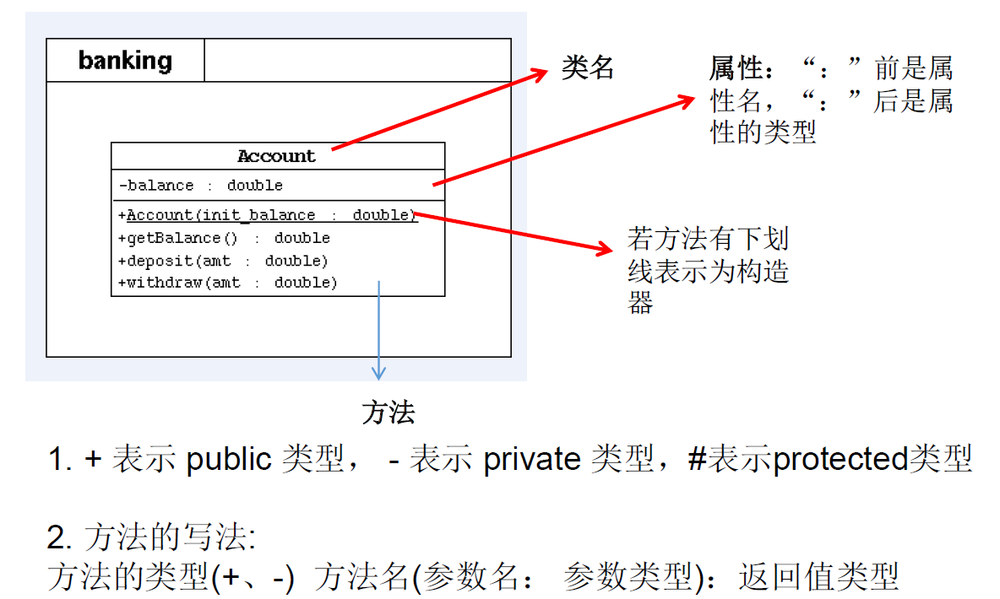

# 第4章 面向对象


## 4.1 概念

 * 类：对一类事物的描述，是抽象的、概念上的定义
 * 对象：是实际存在的该类事物的每个个体，因而也称为实例(instance)
 * 面向对象程序设计的重点是类的设计
 * Java类及类的成员：属性、方法、构造器、代码块、内部类
 * 面向对象的三大特征：封装性、继承性、多态性、(抽象性)
 * 其它关键字：this、super、static、final、abstract、interface、package、import等

## 4.2属性和局部变量

属性（成员变量）   vs  局部变量

**4.2.1相同点：**

 * 		定义变量的格式：数据类型  变量名 = 变量值
 * 		先声明，后使用
 * 		变量都有其对应的作用域 

**4.2.2不同点：**

 * 在类中声明的位置的不同

   ​	属性：直接定义在类的一对{}内

   ​	局部变量：声明在方法内、方法形参、代码块内、构造器形参、构造器内部的变量

 * 关于权限修饰符的不同

   ​	属性：可以在声明属性时，指明其权限，使用权限修饰符。

   ​	常用的权限修饰符：private、public、缺省、protected  --->封装性

   ​	局部变量：不可以使用权限修饰符。

 * 默认初始化值的情况：

   属性：类的属性，根据其类型，都有默认初始化值。

   ​	整型（byte、short、int、long）：0

   ​	浮点型（float、double）：0.0

   ​	字符型（char）：0  （或'\u0000'）

   ​	布尔型（boolean）：false

   ​	引用数据类型（类、数组、接口）：null

   局部变量：没有默认初始化值。

   ​	意味着，我们在调用局部变量之前，一定要显式赋值。

 * 特别地：形参在调用时，我们赋值即可。

 * 在内存中加载的位置：

   ​	属性：加载到堆空间中   （非static）

   ​	局部变量：加载到栈空间

## 4.3方法

### 4.3.1方法的声明

​	权限修饰符  返回值类型  方法名(形参列表){

​		方法体

​	}

​	修饰符包含：static、final、abstract

​	权限修饰符：private、public、缺省、protected

​	返回值类型：有返回值  vs 没有返回值   没返回的使用void，有返回的使用return返回具体的对象

​	方法名：属于标识符

​	形参列表： 方法可以声明0个，1个，或多个形参

### 4.3.2 return关键字的使用

​	使用范围：使用在方法体中

​	作用：结束方法、针对于有返回值类型的方法，使用"return 数据"方法返回所要的数据。

​	注意点：return关键字后面不可以声明执行语句。方法的使用中，可以调用当前类的属性或方法。方法中，不可以定义方法。

​	特殊的：方法A中又调用了方法A递归方法。

### 4.3.3可变个数形参的方法

jdk 5.0新增的内容

具体使用：

- 可变个数形参的格式：数据类型 ... 变量名
- 当调用可变个数形参的方法时，传入的参数个数可以是：0个，1个,2个，。。。
- 可变个数形参的方法与本类中方法名相同，形参不同的方法之间构成重载
- 可变个数形参的方法与本类中方法名相同，形参类型也相同的**<font color='red'>数组</font>**之间不构成重载。换句话说，二者不能共存。
- 可变个数形参在方法的形参中，必须声明在末尾
- 可变个数形参在方法的形参中,最多只能声明一个可变形参。

### 4.3.4方法的重载

定义：在同一个类中，允许存在一个以上的同名方法，只要它们的参数个数或者参数类型不同即可。

两同一不同：同一个类、相同方法名。参数列表不同：参数个数不同，参数类型不同

跟方法的权限修饰符、返回值类型、形参变量名、方法体都没有关系！

### 4.3.5形参传递机制

概念：形参：方法定义时，声明的小括号内的参数

​		    实参：方法调用时，实际传递给形参的数据	

方法的形参的传递机制：本质都是值传递，复制一份，但是基本类型时具体值，引用类型时地址值。（String类型是引用类型，通过方法修改，无法修改值）

 *  如果变量是基本数据类型，此时赋值的是变量所保存的数据值。
 *  如果变量是引用数据类型，此时赋值的是变量所保存的数据的地址值。

### 4.3.6递归

 递归方法：一个方法体内调用它自身。方法递归包含了一种隐式的循环，它会重复执行某段代码，但这种重复执行无须循环控制。递归一定要向已知方向递归，否则这种递归就变成了无穷递归，类似于死循环。

## 4.4封装和修饰符

面向对象的特征一：封装与隐藏

隐藏对象内部的复杂性，只对外公开简单的接口。便于外界调用，从而提高系统的可扩展性、可维护性 。通俗的说把该隐藏的隐藏起来，该暴露的暴露出来 。 这就是封装性的设计思想。

封装性的体现：
 * 我们将类的属性xxx私有化(private),同时，提供公共的(public)方法来获取(getXxx)和设置(setXxx)此属性的值
 *  拓展：封装性的体现：① 如上  ② 不对外暴露的私有的方法  ③ 单例模式   ...

封装性的体现，需要权限修饰符来配合

* Java规定的4种权限（从小到大排列）：private、缺省、protected 、public 
 * 4种权限可以用来修饰类及类的内部结构：属性、方法、构造器、内部类
 *        修饰类的话，只能使用：缺省、public

总结封装性：Java提供了4种权限修饰符来修饰类及类的内部结构，体现类及类的内部结构在被调用时的可见性的大小。

| 修饰符    | 类内部 | 同一个包 | 不同包的子类 | 同一个工程 |
| --------- | ------ | -------- | ------------ | ---------- |
| private   | Yes    |          |              |            |
| 缺省      | Yes    | Yes      |              |            |
| protected | Yes    | Yes      | Yes          |            |
| public    | Yes    | Yes      | Yes          | Yes        |


## 4.5构造器

### 4.5.1概念

构造器（或构造方法、constructor）， construct：建设、建造。 constructor:建设者

### 4.5.2格式

定义构造器的格式：权限修饰符  类名(形参列表){}

### 4.5.3作用

 * 创建对象
 * 初始化对象的信息

### 4.5.4注意事项

 * 如果没有显式的定义类的构造器的话，则系统默认提供一个空参的构造器
 * 一个类中定义的多个构造器，彼此构成重载
 * 一旦我们显式的定义了类的构造器之后，系统就不再提供默认的空参构造器
 * 一个类中，至少会有一个构造器。

### 4.5.5属性赋值的先后顺序

 * ① 默认初始化(定义属性时不赋值，会有摸一个默认值)
 * ② 显式初始化(定义属性时赋值)
 * ③ 构造器中初始化(构造器中对属性赋值)
 * ④ 通过"对象.方法" 或 "对象.属性"的方式，赋值

## 4.6 this

### 4.6.1作用

this可以用来修饰、调用：属性、方法、构造器

### 4.6.2 this修饰属性和方法时

- this理解为：当前对象  或 当前正在创建的对象
- 在类的方法中，我们可以使用"this.属性"或"this.方法"的方式，调用当前对象属性或方法。但是，通常情况下，我们都选择省略"this."。特殊情况下，如果方法的形参和类的属性同名时，我们必须显式的使用"this.变量"的方式（不用this指向，则表示形参，属性无法赋值），表明此变量是属性，而非形参。
- 在类的构造器中，我们可以使用"this.属性"或"this.方法"的方式，调用当前正在创建的对象属性或方法。但是，通常情况下，我们都选择省略"this."。特殊情况下，如果构造器的形参和类的属性同名时，我们必须显式的使用"this.变量"的方式（不用this指向，则表示形参，属性无法赋值），表明此变量是属性，而非形参。

### 4.6.3 this调用构造器时

 * 	  我们在类的构造器中，可以显式的使用"this(形参列表)"方式，调用本类中指定的其他构造器
 *    构造器中不能通过"this(形参列表)"方式调用自己（编译报错：递归构造器调用）
 *    如果一个类中有n个构造器，则最多有 n - 1构造器中使用了"this(形参列表)"
 *    规定："this(形参列表)"必须声明在当前构造器的首行
 *    构造器内部，最多只能声明一个"this(形参列表)"，用来调用其他的构造器
 *    构造器之间不能循环引用，如果循环引用，编译报错：递归构造器调用

## 4.7 JavaBean

JavaBean是一种Java语言写成的可重用组件。

所谓JavaBean，是指符合如下标准的Java类：
	>类是公共的
	>有一个无参的公共的构造器
	>有属性，且有对应的get、set方法

## 4.8 UML类图



## 4.9 MVC设计模式

MVC是常用的设计模式之一，将整个程序分为三个层次： 视图模型层，控制器层，与数据模型层。 这种将程序输入输出、数据处理，以及数据的展示分离开来的设计模式使程序结构变的灵活而且清晰，同时也描述了程序各个对象间的通信方式，降低了程序的耦合性。

模型层 model 主要处理数据

控制层 controller 处理业务逻辑

视图层 view 显示数据

## 4.10 package

package关键字的使用，为了更好的实现项目中类的管理，提供包的概念

 * 使用package声明类或接口所属的包，声明在源文件的首行

 * 包，属于标识符，遵循标识符的命名规则、规范(都是小写)、“见名知意”

 * 4.每"."一次，就代表一层文件目录。

   补充：同一个包下，不能命名同名的接口、类。

   不同的包下，可以命名同名的接口、类。

## 4.11 import

import:导入

 * 在源文件中显式的使用import结构导入指定包下的类、接口
 * 声明在包的声明和类的声明之间
 * 如果需要导入多个结构，则并列写出即可
 * 可以使用"xxx.*"的方式，表示可以导入xxx包下的所有结构
 * 如果使用的类或接口是java.lang包下定义的，则可以省略import结构
 * 如果使用的类或接口是本包下定义的，则可以省略import结构
 * 如果在源文件中，使用了不同包下的同名的类，则必须至少有一个类需要以全类名的方式（xxx.xxx.xxx.类名方式）显示。
 * 使用"xxx.*"方式表明可以调用xxx包下的所有结构。但是如果使用的是xxx子包下的结构，则仍需要显式导入
 * import static:导入指定类或接口中的静态结构:属性或方法。 

## 4.12 继承

面向对象的特征之二：继承性   

### 4.12.1 继承性的好处：

 * ① 减少了代码的冗余，提高了代码的复用性
 * ② 便于功能的扩展
 * ③ 为之后多态性的使用，提供了前提

### 4.12.2 继承性的格式： 

 *    class A extends B{}
 *    A:子类、派生类、subclass
 *    B:父类、超类、基类、superclass

**体现：**一旦子类A继承父类B以后，子类A中就获取了父类B中声明的所有的属性和方法。

- 特别的，父类中声明为private的属性或方法，子类继承父类以后，仍然认为获取了父类中私有的结构。

  只有因为封装性的影响，使得子类不能直接调用父类的结构而已。

- 类继承父类以后，还可以声明自己特有的属性或方法：实现功能的拓展。

- 子类和父类的关系，不同于子集和集合的关系。

- extends：延展、扩展

### 4.12.3 Java中关于继承性的规定：

 * 	  一个类可以被多个子类继承。
 *    Java中类的单继承性：一个类只能有一个父类
 *    子父类是相对的概念。
 *    子类直接继承的父类，称为：直接父类。间接继承的父类称为：间接父类
 *    子类继承父类以后，就获取了直接父类以及所有间接父类中声明的属性和方法
 * 如果我们没有显式的声明一个类的父类的话，则此类继承于java.lang.Object类
 * 所有的java类（除java.lang.Object类之外）都直接或间接的继承于java.lang.Object类
 * 意味着，所有的java类具有java.lang.Object类声明的功能。

## 4.13方法的重写

方法的重写(override / overwrite)

### 4.13.1 概念

重写：子类继承父类以后，可以对父类中同名同参数的方法，进行覆盖操作

### 4.13.2 应用

重写以后，当创建子类对象以后，通过子类对象调用子父类中的同名同参数的方法时，实际执行的是子类重写父类的方法。

### 4.13.3 格式

方法的声明： 权限修饰符  返回值类型  方法名(形参列表) throws 异常的类型{

//方法体

}

### 4.13.4重写的规定

约定俗称：子类中的叫重写的方法，父类中的叫被重写的方法

 * 子类重写的方法的方法名和形参列表与父类被重写的方法的方法名和形参列表相同

 * 子类重写的方法的权限修饰符不小于父类被重写的方法的权限修饰符

 * 特殊情况：子类不能重写父类中声明为private权限的方法

 * 返回值类型：

   1.父类被重写的方法的返回值类型是void，则子类重写的方法的返回值类型只能是void

   2.父类被重写的方法的返回值类型是A类型，则子类重写的方法的返回值类型可以是A类或A类的子类

   3.父类被重写的方法的返回值类型是基本数据类型(比如：double)，则子类重写的方法的返回值类型必须是相同的基本数据类型(必须也是double)

* 子类重写的方法抛出的异常类型不大于父类被重写的方法抛出的异常类型

 * 子类和父类中的同名同参数的方法要么都声明为非static的（考虑重写），要么都声明为static的（不是重写）。	

## 4.14区分方法的重载与重写

重载：同一个类中(包括子类、父类)，方法名相同，形参不同（类型、个数），与权限修饰符、返回值类型、形参变量名、方法体无关。

重写：子类重写父类，方法名、形参相同，子类重写方法的权限修饰符大于等于父类，子类不能重写父类私有的方法，返回值类型相同、或是返回值的子类，子类异常小于等于父类异常类型。父类时静态方法，子类也必须时静态方法。

## 4.15 super

super理解为：父类的

### 4.15.1 使用

调用属性和方法

* 我们可以在子类的方法或构造器中。通过使用"super.属性"或"super.方法"的方式，显式的调用父类中声明的属性或方法。但是，通常情况下，我们习惯省略"super."

 *   特殊情况：当子类和父类中定义了同名的属性时，我们要想在子类中调用父类中声明的属性，则必须显式的使用"super.属性"的方式，表明调用的是父类中声明的属性。
 *   特殊情况：当子类重写了父类中的方法以后，我们想在子类的方法中调用父类中被重写的方法时，则必须显式的使用"super.方法"的方式，表明调用的是父类中被重写的方法。

super调用构造器

 * 	 我们可以在子类的构造器中显式的使用"super(形参列表)"的方式，调用父类中声明的指定的构造器
 *   "super(形参列表)"的使用，必须声明在子类构造器的首行！
 *   我们在类的构造器中，针对于"this(形参列表)"或"super(形参列表)"只能二选一，不能同时出现
 *   在构造器的首行，没有显式的声明"this(形参列表)"或"super(形参列表)"，则默认调用的是父类中空参的构造器：super()
 *   在类的多个构造器中，至少有一个类的构造器中使用了"super(形参列表)"，调用父类中的构造器

## 4.16 子类对象实例化的全过程

从结果上来看：（继承性）

 * 		子类继承父类以后，就获取了父类中声明的属性或方法。
 *      创建子类的对象，在堆空间中，就会加载所有父类中声明的属性。

从过程上来看：

 * 		当我们通过子类的构造器创建子类对象时，我们一定会直接或间接的调用其父类的构造器，进而调用父类的父类的构造器，...直到调用了java.lang.Object类中空参的构造器为止。正因为加载过所有的父类的结构，所以才可以看到内存中有父类中的结构，子类对象才可以考虑进行调用。

明确：虽然创建子类对象时，调用了父类的构造器，但是自始至终就创建过一个对象，即为new的子类对象

## 4.17多态

理解多态性：可以理解为一个事物的多种形态。

对象的多态性：父类的引用指向子类的对象（或子类的对象赋给父类的引用）

多态性的使用前提：  ① 类的继承关系  ② 方法的重写

对象的多态性，只适用于方法，不适用于属性（属性编译和运行都看左边）

 多态的使用：虚拟方法调用，有了对象的多态性以后，我们在编译期，只能调用父类中声明的方法，但在运行期，我们实际执行的是子类重写父类的方法。

总结：编译，看左边；运行，看右边。

## 4.18 instanceof

### 4.18.1  instanceof关键字的使用

a instanceof A:判断对象a是否是类A的实例。如果是，返回true；如果不是，返回false。

使用情境：为了避免在向下转型时出现ClassCastException的异常，我们在向下转型之前，先

进行instanceof的判断，一旦返回true，就进行向下转型。如果返回false，不进行向下转型。

### 4.18.2 向下转型

使用强制类型转换符。

## 4.19  == 和 equals() 区别

== ：运算符

- 可以使用在基本数据类型变量和引用数据类型变量中
- 如果比较的是基本数据类型变量：比较两个变量保存的数据是否相等。（不一定类型要相同）
- 如果比较的是引用数据类型变量：比较两个对象的地址值是否相同.即两个引用是否指向同一个对象实体
-  == 符号使用时，必须保证符号左右两边的变量类型一致。

二、equals()方法的使用：

 * 是一个方法，而非运算符
 * 只能适用于引用数据类型
 * Object类中equals()的定义：
 *    public boolean equals(Object obj) {
	        return (this == obj);
	  }
 *    Object类中定义的equals()和==的作用是相同的：比较两个对象的地址值是否相同.即两个引用是否指向同一个对象实体
 * 像String、Date、File、包装类等都重写了Object类中的equals()方法。重写以后，比较的不是
 *    两个引用的地址是否相同，而是比较两个对象的"实体内容"是否相同。
 * 通常情况下，我们自定义的类如果使用equals()的话，也通常是比较两个对象的"实体内容"是否相同。那么，我们
 *    就需要对Object类中的equals()进行重写.
 *    重写的原则：比较两个对象的实体内容是否相同.

## 4.20  Object类

- Object类是所有Java类的根父类
- 如果在类的声明中未使用extends关键字指明其父类，则默认父类为java.lang.Object类 
- Object类中的功能(属性、方法)就具有通用性。
- 属性：无
- 方法：equals() / toString() / getClass() /hashCode() / clone() / finalize()/wait() 、 notify()、notifyAll()
- Object类只声明了一个空参的构造器

## 4.21 包装类

java提供了8种基本数据类型对应的包装类，使得基本数据类型的变量具有类的特征

JDK 5.0 新特性：自动装箱（基本数据类型 --->包装类）与自动拆箱（包装类 --->基本数据类型）

一些面试题


	@Test
	public void test1() {
		Object o1 = true ? new Integer(1) : new Double(2.0);
		System.out.println(o1);// 1.0
	}
	
	@Test
	public void test2() {
		Object o2;
		if (true)
			o2 = new Integer(1);
		else
			o2 = new Double(2.0);
		System.out.println(o2);// 1
	
	}
	
	@Test
	public void test3() {
		Integer i = new Integer(1);
		Integer j = new Integer(1);
		System.out.println(i == j);//false
		
		//Integer内部定义了IntegerCache结构，IntegerCache中定义了Integer[],
		//保存了从-128~127范围的整数。如果我们使用自动装箱的方式，给Integer赋值的范围在
		//-128~127范围内时，可以直接使用数组中的元素，不用再去new了。目的：提高效率
		
		Integer m = 1;
		Integer n = 1;
		System.out.println(m == n);//true
	
		Integer x = 128;//相当于new了一个Integer对象
		Integer y = 128;//相当于new了一个Integer对象
		System.out.println(x == y);//false
	}
## 4.22单元测试

Java中的JUnit单元测试

步骤：

1.选中当前工程 - 右键选择：build path - add libraries - JUnit 4 - 下一步

2.创建Java类，进行单元测试。

此时的Java类要求：① 此类是public的  ②此类提供公共的无参的构造器

3.此类中声明单元测试方法。此时的单元测试方法：方法的权限是public,没有返回值，没有形参

4.此单元测试方法上需要声明注解：@Test,并在单元测试类中导入：import org.junit.Test;

5.声明好单元测试方法以后，就可以在方法体内测试相关的代码。

6.写完代码以后，左键双击单元测试方法名，右键：run as - JUnit Test

说明：

1.如果执行结果没有任何异常：绿条

2.如果执行结果出现异常：红条

## 4.23 static关键字

### 4.23 .1 static作用

​	可以用来修饰：属性、方法、代码块、内部类

### 4.23 .2 修饰属性

使用static修饰的属性称为为静态变量（或类变量）

 属性：按是否使用static修饰，又分为：静态属性  vs 非静态属性(实例变量)

 * 		   实例变量：我们创建了类的多个对象，每个对象都独立的拥有一套类中的非静态属性。当修改其中一个对象中的
 *              非静态属性时，不会导致其他对象中同样的属性值的修改。
 *       静态变量：我们创建了类的多个对象，多个对象共享同一个静态变量。当通过某一个对象修改静态变量时，会导致
 *              其他对象调用此静态变量时，是修改过了的。

 static修饰属性的其他说明：

 * 			① 静态变量随着类的加载而加载。可以通过"类.静态变量"的方式进行调用
 *          ② 静态变量的加载要早于对象的创建。
 *          ③ 由于类只会加载一次，则静态变量在内存中也只会存在一份：存在方法区的静态域中。

静态属性举例：System.out; Math.PI;

### 4.23 .3  修饰方法

使用static修饰方法：静态方法

 * 		 随着类的加载而加载，可以通过"类.静态方法"的方式进行调用
 * 		 静态方法中，只能调用静态的方法或属性
 *        非静态方法中，既可以调用非静态的方法或属性，也可以调用静态的方法或属性

### 4.23 .4 static注意点：

 * 		在静态的方法内，不能使用this关键字、super关键字
 * 		关于静态属性和静态方法的使用，大家都从生命周期的角度去理解。

### 4.23 .5 开发中，如何确定一个属性是否要声明为static的？

 * 		属性是可以被多个对象所共享的，不会随着对象的不同而不同的。
 * 		类中的常量也常常声明为static
 * 		开发中，如何确定一个方法是否要声明为static的？
 * 		操作静态属性的方法，通常设置为static的

工具类中的方法，习惯上声明为static的。 比如：Math、Arrays、Collections

## 4.24设计模式

经典的：23种

- 创建型模式，共5种：工厂方法模式、抽象工厂模式、单例模式、建造者模式、原型模式。 
- 结构型模式，共7种：适配器模式、装饰器模式、代理模式、外观模式、桥接模式、组合模式、享元模式。 
- 行为型模式，共11种：策略模式、模板方法模式、观察者模式、迭代器模式、责任链模式、命令模式、备忘录模式、状态模式、访问者模式、中介者模式、解释器模式。 

单例设计模式：所谓类的单例设计模式，就是采取一定的方法保证在整个的软件系统中，对某个类只能存在一个对象实例。

饿汉式（类加载就创建实例）  vs 懒汉式（需要时才创建实例）

饿汉式：	

​	坏处：对象加载时间过长。

​	好处：饿汉式是线程安全的

懒汉式：

​	好处：延迟对象的创建。

​	坏处：线程不安全，需要修改成线程安全的

​	饿汉式

	class Bank{
	    //1.私有化类的构造器
	    private Bank(){
	
	    }
	
	    //2.内部创建类的对象
	    //4.要求此对象也必须声明为静态的
	    private static Bank instance = new Bank();
	
	    //3.提供公共的静态的方法，返回类的对象
	    public static Bank getInstance(){
	        return instance;
	    }
	}

​	懒汉式

	class Order{
	    //1.私有化类的构造器
	    private Order(){
	
	    }
	
	    //2.声明当前类对象，没有初始化
	    //4.此对象也必须声明为static的
	    private static Order instance = null;
	
	    //3.声明public、static的返回当前类对象的方法
	    public static synchronized Order getInstance(){
	
	        if(instance == null){
	
	            instance = new Order();
	
	        }
	        return instance;
	    }
	}

应用场景：

- 网站的计数器
- 应用程序的日志应用
- 数据库连接池
- 读取配置文件的类
- Application 也是单例的典型应用
- Windows的Task Manager (任务管理器)
- Windows的Recycle Bin (回收站)

## 4.25代码块

类的成员之四：代码块（或初始化块）

1. 代码块的作用：用来初始化类、对象
2. 代码块如果有修饰的话，只能使用static.
3. 分类：静态代码块  vs 非静态代码块
4. 静态代码块

- 内部可以有输出语句
- 随着类的加载而执行,而且只执行一次
- 作用：初始化类的信息
- 如果一个类中定义了多个静态代码块，则按照声明的先后顺序执行
- 静态代码块的执行要优先于非静态代码块的执行
- 静态代码块内只能调用静态的属性、静态的方法，不能调用非静态的结构


​	5.非静态代码块

- 内部可以有输出语句
- 随着对象的创建而执行
- 每创建一个对象，就执行一次非静态代码块
- 作用：可以在创建对象时，对对象的属性等进行初始化
- 如果一个类中定义了多个非静态代码块，则按照声明的先后顺序执行
- 非静态代码块内可以调用静态的属性、静态的方法，或非静态的属性、非静态的方法

## 4.26属性、代码块加载顺序

构造一个对象：父类 静态代码块-->子类静态代码块-->父类代码块-->父类构造器-->子类代码块-->子类构造器

属性加载：默认初始化-->显式初始化/在代码块中赋值（谁写在前面谁先加载）-->构造器中初始化-->有了对象以后，可以通过"对象.属性"或"对象.方法"的方式，进行赋值（静态属性也遵循）

由父及子，静态先行，并行结构按顺序

## 4.27 final

- final可以用来修饰的结构：类、方法、变量(局部变量，成员变量，形参)

- final 用来修饰一个类:此类不能被其他类所继承。

  比如：String类、System类、StringBuffer类

- final 用来修饰方法：表明此方法不可以被重写

  比如：Object类中getClass();

- final 用来修饰变量：此时的"变量"就称为是一个常量

-  final修饰属性：

  可以考虑赋值的位置有：显式初始化、代码块中初始化、构造器中初始化

- final修饰局部变量：

  尤其是使用final修饰形参时，表明此形参是一个常量。当我们调用此方法时，给常量形参赋一个实参。一旦赋值以后，就只能在方法体内使用此形参，但不能进行重新赋值。

- static final 用来修饰属性：全局常量

## 4.28 abstract

1.abstract:抽象的

2.abstract可以用来修饰的结构：类、方法

3.abstract修饰类：抽象类

- 此类不能实例化
- 抽象类中一定有构造器，便于子类实例化时调用（涉及：子类对象实例化的全过程）
- 开发中，都会提供抽象类的子类，让子类对象实例化，完成相关的操作

4.abstract修饰方法：抽象方法

- 抽象方法只有方法的声明，没有方法体
- 包含抽象方法的类，一定是一个抽象类。反之，抽象类中可以没有抽象方法的。
- 若子类重写了父类中的所有的抽象方法后，此子类方可实例化
- 若子类没有重写父类中的所有的抽象方法，则此子类也是一个抽象类，需要使用abstract修饰

5.abstract不能用来修饰：属性、构造器等结构

6.abstract不能用来修饰私有方法、静态方法、final的方法、final的类

7.抽象类的匿名子类，创建一个对象匿名抽象子类对象： new 抽象类(){实现抽象方法}

8.抽象类的应用：模板（Template）方法的设计模式（定义好抽象方法，具体类继承抽象类后实现这个方法，大家都会有同样的方法，这样就类似于一个模板）

## 4.29 接口

1.接口使用interface来定义

2.Java中，接口和类是并列的两个结构

3.如何定义接口：定义接口中的成员

3.1 JDK7及以前：只能定义全局常量和抽象方法

 * 			全局常量：public static final的.但是书写时，可以省略不写
 * 			抽象方法：public abstract的.但是书写时，可以省略不写

3.2 JDK8：除了定义全局常量和抽象方法之外，还可以定义静态方法、默认方法（略）

3. 3JDK9：还可以声明私有方法

4.接口中不能定义构造器的！意味着接口不可以实例化

5.Java开发中，接口通过让类去实现(implements)的方式来使用.

 *    如果实现类覆盖了接口中的所有抽象方法，则此实现类就可以实例化
 *    如果实现类没有覆盖接口中所有的抽象方法，则此实现类仍为一个抽象类

6.Java类可以实现多个接口   --->弥补了Java单继承性的局限性

 * 格式：class AA extends BB implements CC,DD,EE

7.接口与接口之间可以继承，而且可以多继承

8.接口的具体使用，体现多态性

9.接口，实际上可以看做是一种规范

10.面试题：抽象类与接口有哪些异同？

​	相同点：不能实例化；都可以包含抽象方法的。
​	不同点：
​	1）把抽象类和接口(java7,java8,java9)的定义、内部结构解释说明
​	2）类：单继承性    接口：多继承
  	 类与接口：多实现

11.接口的应用：代理模式(代理类和具体类都实现同一接口，代理类中传入具体类，然后通过代理类来调用具体类的方法，叫代理模式)

12.注意事项

- 同时继承了抽象类，实现了接口，如果抽象类和接口中有同样的属性，接口使用会报编译不通过，如需使用，则接口名.属性名使用（接口中的时全局常量），类中的则需要使用super.属性名调用。
- 如果实现了两个接口有相同的默认方法，则编译时会报错，必须要要重新这个方法才行。-->接口冲突。
- 通过实现类的对象，可以调用接口中的默认方法。如果实现类重写了接口中的默认方法，调用时，仍然调用的是重写以后的方法。
- 如果子类(或实现类)继承的父类和实现的接口中声明了同名同参数的默认方法，那么子类在没有重写此方法的情况下，默认调用的是父类中的同名同参数的方法。如果需要调用接口中的默认方法使用 接口名.super.方法名调用。-->类优先原则

## 4.30 内部类

### 4.30.1 概念

Java中允许将一个类A声明在另一个类B中，则类A就是内部类，类B称为外部类

### 4.30.2 分类

成员内部类（静态、非静态） 和 局部内部类(方法内、代码块内<静态、非静态>、构造器内)、匿名内部类

### 4.30.3 成员内部类

概念：定义在成员中，当做属性使用。  

* 可以调用外部类  
* 可以使用static修饰  
* 4个权限修饰符都可以使用  
* 生成的class名为，外部类$内部类.class

### 4.30.4 局部内部类

概念：定义方法内、代码块内、构造器内

* 可以调用外部类
* 只能使用final、abstract修饰,不能使用static修饰，所以不能定义static属性和方法(类似于定义了也没地方用)。
* 局部内部类和局部变量地位类似，只能使用缺省权限修饰(不谈修饰符)
* 局部内部类可以使用外部方法的局部变量，但是必须是final,由局部内部类和局部变量的声明周期不同所致。
* 生成的class名为，外部类$数字内部类.class

### 4.30.5 内部类当做类使用

* 类内可以定义属性、方法、构造器等
* 可以被final修饰，表示此类不能被继承。言外之意，不使用final，就可以被继承
* 可以被abstract修饰  

### 4.30.6 创建静态成员内部类

外部类.静态内部类 变量名 = new 外部类.静态内部类();

###  4.30.7 创建非静态成员内部类

外部类.静态内部类 变量名 = new 外部类().new 静态内部类();

###  4.30.8 非静态内部类(包括成员和局部)调用外部类属性和方法

* 直接调用属性或方法，会优先匹配原则，先查找自己类，查不到去外部类查。
* 需要显示调用则通过，this.属性名表示内部类属性，外部类.this.属性名表示外部内属性。
* 调用外部类的方法同属性。

###  4.30.9 静态内部类(只有成员静态)调用外部类属性和方法

只能调用外部类的静态属性和方法。  

###  4.30.10 应用

只需要自己内部使用的类，一般定义成内部类。一般都是定义局部内部类，用于返回一个接口的实例对象。

### 4.30.11 注意事项

* 非static的成员内部类中的成员不能声明为static的，只有在外部类或static的成员内部类中才可声明static成员。
* 外部类访问成员内部类的成员,需要"内部类.成员"或"内部类对象.成员"的方式
* 成员内部类可以直接使用外部类的所有成员,包括私有的数据
* 当想要在外部类的静态成员部分使用内部类时,可以考虑内部类声明为静态的
* jdk 7及之前版本：要求此局部变量显式的声明为final的
  jdk 8及之后的版本：可以省略final的声明

代码

```
public class InnerClassTest {
    public static void main(String[] args) {
            //创建Dog实例(静态的成员内部类):
            Person.Dog dog = new Person.Dog();
            //创建Bird实例(非静态的成员内部类):
    //		Person.Bird bird = new Person.Bird();//错误的
            Person p = new Person();
            Person.Bird bird = p.new Bird();
    }
}

class Person{
	String name = "小明";
	int age;
	public void eat(){
		System.out.println("人：吃饭");
	}
	//静态成员内部类
	static class Dog{
		String name;
		int age;
		public void show(){
			System.out.println("卡拉是条狗");
//			eat();不能调用非静态方法，参考静态调用
        }
	}
	//非静态成员内部类
	public class Bird{
		String name = "杜鹃";
		public Bird(){}
		public void sing(){
			System.out.println("我是一只小小鸟");
			Person.this.eat();//调用外部类的非静态属性
			eat();
			System.out.println(age);
		}
		public void display(String name){
			System.out.println(name);//方法的形参
			System.out.println(this.name);//内部类的属性
			System.out.println(Person.this.name);//外部类的属性
		}
	}
	public void method(){
		//局部内部类，方法内
		class AA{}
	}
	{
		//局部内部类，代码块内
		class BB{}
	}
	public Person(){
		//局部内部类构造器内
		class CC{}
	}
	static{
		//局部内部类，静态代码块内
		class DD{}
	}
}
```