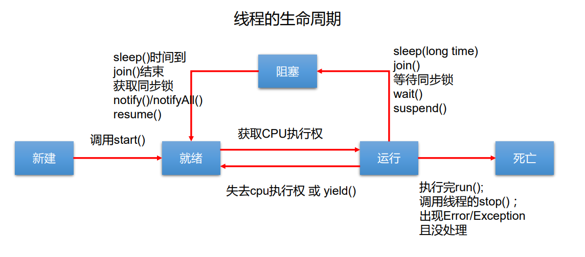

# 第6章 线程

## 6.1 概念

01. 程序(programm)
概念：是为完成特定任务、用某种语言编写的一组指令的集合。即指一段静态的代码。

02. 进程(process)
概念：程序的一次执行过程，或是正在运行的一个程序。
说明：进程作为资源分配的单位，系统在运行时会为每个进程分配不同的内存区域

3. 线程(thread)
   概念：进程可进一步细化为线程，是一个程序内部的一条执行路径。
   说明：线程作为调度和执行的单位，每个线程拥独立的运行栈和程序计数器(pc)，线程切换的开销小。

4. 补充：
   内存结构：

   进程可以细化为多个线程。
   每个线程，拥有自己独立的：栈、程序计数器
   多个线程，共享同一个进程中的结构：方法区、堆。

## 6.2 并行与并发

01. 单核CPU与多核CPU的理解
单核CPU，其实是一种假的多线程，因为在一个时间单元内，也只能执行一个线程的任务。例如：虽然有多车道，但是收费站只有一个工作人员在收费，只有收了费才能通过，那么CPU就好比收费人员。如果某个人不想交钱，那么收费人员可以把他“挂起”（晾着他，等他想通了，准备好了钱，再去收费。）但是因为CPU时间单元特别短，因此感觉不出来。
如果是多核的话，才能更好的发挥多线程的效率。（现在的服务器都是多核的）
一个Java应用程序java.exe，其实至少三个线程：main()主线程，gc()垃圾回收线程，异常处理线程。当然如果发生异常，会影响主线程。
02. 并行与并发的理解
并行：多个CPU同时执行多个任务。比如：多个人同时做不同的事。
并发：一个CPU(采用时间片)同时执行多个任务。比如：秒杀、多个人做同一件事

## 6.3 创建多线程

### 6.3.1 方式一：继承Thread类的方式（JDK1.5之前就有的版本）

* 创建一个继承于Thread类的子类
* 重写Thread类的run() --> 将此线程执行的操作声明在run()中
* 创建Thread类的子类的对象
* 通过此对象调用start()：①启动当前线程 ② 调用当前线程的run()

### 6.3.2 方式二：实现Runnable接口的方式（JDK1.5之前就有的版本）

* 创建一个实现了Runnable接口的类
* 实现类去实现Runnable中的抽象方法：run()
* 创建实现类的对象
* 将此对象作为参数传递到Thread类的构造器中，创建Thread类的对象
* 通过Thread类的对象调用start()

### 6.3.3 方式三：实现Callable接口。 --- JDK 5.0新增

实现Callable接口的方式创建多线程比实现Runnable接口创建多线程方式强大
- call()可以有返回值的。
- call()可以抛出异常，被外面的操作捕获，获取异常的信息
- Callable是支持泛型的
- 需要借助 FutureTask 类，比如获取返回结果

Future 接口

- 可以 对具体 Runnable 、 Callable 任务的执行结果进行取消、查询是否完成、获取结果等。
- FutureTask 是 Future 接口的唯一的实现类
- FutureTask 同时实现了 Runnable, Future 接口。它既可以作为Runnable 被线程执行，又可以 作为 Future 得到 Callable 的返回值

```java
//1.创建一个实现Callable的实现类
class NumThread implements Callable{
    //2.实现call方法，将此线程需要执行的操作声明在call()中
    @Override
    public Object call() throws Exception {
        int sum = 0;
        for (int i = 1; i <= 100; i++) {
            if(i % 2 == 0){
                System.out.println(i);
                sum += i;
            }
        }
        return sum;
    }
}
public class ThreadNew {
    public static void main(String[] args) {
        //3.创建Callable接口实现类的对象
        NumThread numThread = new NumThread();
        //4.将此Callable接口实现类的对象作为传递到FutureTask构造器中，创建FutureTask的对象
        FutureTask futureTask = new FutureTask(numThread);
        //5.将FutureTask的对象作为参数传递到Thread类的构造器中，创建Thread对象，并调用start()
        new Thread(futureTask).start();
        try {
            //6.获取Callable中call方法的返回值
            //get()返回值即为FutureTask构造器参数Callable实现类重写的call()的返回值。
            Object sum = futureTask.get();
            System.out.println("总和为：" + sum);
        } catch (InterruptedException e) {
            e.printStackTrace();
        } catch (ExecutionException e) {
            e.printStackTrace();
        }
    }
}
```

### 6.3.4方式四：使用线程池 --- JDK 5.0新增

好处：

- 提高响应速度（减少了创建新线程的时间）

- 降低资源消耗（重复利用线程池中线程，不需要每次都创建）

- 便于线程管理

  corePoolSize：核心池的大小

  maximumPoolSize：最大线程数

  keepAliveTime：线程没有任务时最多保持多长时间后会终止
  *
  *

JDK 5.0 起提供了线程池相关 API ExecutorService 和 Executors

**ExecutorService** ：真正的线程池 接口。常见子类 ThreadPoolExecutor

- void execute(Runnable command) ：执行任务 命令，没有返回值，一般用来执行Runnable
- <T> Future<T> submit(Callable<T> task) task)：执行任务，有返回值，一般又来执行Callable
- void shutdown() ：关闭连接池

**Executors** ：工具类、线程池的工厂类，用于创建并返回不同类型的线程池

- Executors.newCachedThreadPool ()：创建一个可根据需要创建新线程的线程池，返回的是ThreadPoolExecutor对象
- Executors.newFixedThreadPool(n); 创建一个可重用固定线程数的线程池，返回的是ThreadPoolExecutor对象
- Executors.newSingleThreadExecutor () ：创建一个只有一个线程的线程池，返回的是DelegatedExecutorService对象构造的ThreadPoolExecutor，执行还是ThreadPoolExecutor对象
- Executors.newScheduledThreadPool(n)：创建一个线程池，它可安排在给定延迟后运行命令或者定期地执行，返回的是ScheduledThreadPoolExecutor对象。

面试题：创建多线程有几种方式？四种！

### 6.3.5 问题

问题一：我们启动一个线程，必须调用start()，不能调用run()的方式启动线程，如果再调用会抛出IllegalThreadStateException异常。
问题二：如果再启动一个线程，必须重新创建一个Thread子类的对象，调用此对象的start()。

### 6.3.6 两种方式的优缺点

* 开发中：优先选择：实现Runnable接口的方式

* 原因：

     实现的方式没类的单继承性的局限性

     实现的方式更适合来处理多个线程共享数据的情况。

* 两种方式的联系：public class Thread implements Runnable

* 相同点：

     两种方式都需要重写run(),将线程要执行的逻辑声明在run()中。

     目前两种方式，要想启动线程，都是调用的Thread类中的start()。

## 6.4 Thread类线程的常用方法

* start():启动当前线程；调用当前线程的run()
* run(): 通常需要重写Thread类中的此方法，将创建的线程要执行的操作声明在此方法中
* currentThread():静态方法，返回执行当前代码的线程
* getName():获取当前线程的名字
* setName():设置当前线程的名字
* yield():释放当前cpu的执行权
* join():在线程a中调用线程b的join(),此时线程a就进入阻塞状态，直到线程b完全执行完以后，线程a才结束阻塞状态。
* stop():已过时。当执行此方法时，强制结束当前线程。
* sleep(long millitime):让当前线程“睡眠”指定的millitime毫秒。在指定的millitime毫秒时间内，当前线程是阻塞状态。
* isAlive():判断当前线程是否存活

## 6.5 线程优先级

线程的优先级：

1.MAX_PRIORITY：10

MIN_PRIORITY：1

NORM_PRIORITY：5  -->默认优先级

2.如何获取和设置当前线程的优先级：

getPriority():获取线程的优先级

setPriority(int p):设置线程的优先级

说明：高优先级的线程要抢占低优先级线程cpu的执行权。但是只是从概率上讲，高优先级的线程高概率的情况下被执行。并不意味着只当高优先级的线程执行完以后，低优先级的线程才执行。

## 6.6 线程的分类

一种是守护线程，一种是用户线程。

- 它们在几乎每个方面都是相同的，唯一的区别是判断 JVM 何时离开。
- 守护线程是用来服务用户线程的，通过在 start() 方法前调用thread.setDaemon (true) 可以把一个用户线程变成一个守护线程。
- Java 垃圾回收就是一个典型的守护线程。
- 若 JVM 中都是守护线程，当前 JVM 将 退出 。

## 6.7 多线程的优点

背景：以单核 CPU 为例， 只使用单个线程先后完成 多个任务（调用多个方法），肯定比用多个线程来完成用的时间更短，为何仍需多线程呢？

- 提高应用程序的响应。对图形化界面更有意义，可增强用户体验。
- 提高计算机系统 CPU 的利用率
- 改善程序结构。将既长又复杂的进程分为多个线程，独立运行，利于理解和修改

什么时候使用多线程：

- 程序 需要同时执行两个或多个任务。
- 程序 需要实现一些需要等待的任务时，如用户输入、文件读写操作、网络操作、搜索等。
- 需要 一些后台运行的程序时。

线程通信：wait() / notify() / notifyAll() :此三个方法定义在Object类中的。

## 6.8线程的生命周期

新建： 当一个Thread类或其子类的对象被声明并创建时，新生的线程对象处于新建状态

就绪：处于新建状态的线程被start()后，将进入线程队列等待CPU时间片，此时它已具备了运行的条件，只是没分配到CPU资源

运行：当就绪的线程被调度并获得CPU资源时,便进入运行状态， run()方法定义了线程的操作和功能

阻塞：在某种特殊情况下，被人为挂起或执行输入输出操作时，让出 CPU 并临时中止自己的执行，进入阻塞状态

死亡：线程完成了它的全部工作或线程被提前强制性地中止或出现异常导致结束



```
NEW,新建
RUNNABLE,运行
BLOCKED,阻塞
WAITING,等待
TIMED_WAITING,计时等待
TERMINATED;停止
```

## 6.9线程同步

```
方式一：
synchronized(同步监视器){
     //需要被同步的代码   
}
说明：1.操作共享数据的代码，即为需要被同步的代码。  -->不能包含代码多了，也不能包含代码少了。
     2.共享数据：多个线程共同操作的变量。比如：ticket就是共享数据。
     3.同步监视器，俗称：锁。任何一个类的对象，都可以充当锁。类的class对象也行，类.class。
     4.要求：多个线程必须要共用同一把锁。
     5.在实现Runnable接口创建多线程的方式中，我们可以考虑使用this充当同步监视器。
```

```
方式二：同步方法。
    如果操作共享数据的代码完整的声明在一个方法中，我们不妨将此方法声明同步的。使用synchronized进行修饰。
同步方法总结：
  1.同步方法仍然涉及到同步监视器，只是不需要我们显式的声明。
  2.非静态的同步方法，同步监视器是：this
  3.静态的同步方法，同步监视器是：当前类本身（类的class对象）
```

- 

```
方式三：Lock

从JDK 5.0开始，Java提供了更强大的线程同步机制——通过显式定义同 步锁对象来实现同步。同步锁使用Lock对象充当。
java.util.concurrent.locks.Lock接口是控制多个线程对共享资源进行访问的 工具。锁提供了对共享资源的独占访问，每次只能有一个线程对Lock对象 加锁，线程开始访问共享资源之前应先获得Lock对象。
ReentrantLock 类实现了 Lock ，它拥有与 synchronized 相同的并发性和 内存语义，在实现线程安全的控制中，比较常用的是ReentrantLock，可以 显式加锁、释放锁。

private ReentrantLock lock = new ReentrantLock();
 //2.调用锁定方法lock()锁定
 lock.lock();
 //3.调用解锁方法：unlock()解锁
 lock.unlock();
```

### 6.9.1synchronized 与 Lock 的对比

1. Lock是显式锁（手动开启和关闭锁，别忘记关闭锁），synchronized是 隐式锁，出了作用域自动释放 
2. Lock只有代码块锁，synchronized有代码块锁和方法锁 
3. 使用Lock锁，JVM将花费较少的时间来调度线程，性能更好。并且具有 更好的扩展性（提供更多的子类）

线程同步优先使用使用顺序：Lock>同步代码块（已经进入了方法体，分配了相应资源)>同步方法 （在方法体之外）


同步的方式，解决了线程的安全问题，同时操作同步代码时，只能有一个线程参与，其他线程等待。相当于是一个单线程的过程，效率低。

### 6.9.2**同步锁范围的注意点：**

- 范围太小：没锁住所有有安全问题的代码 
- 范围太大：没发挥多线程的功能。


### 6.9.3释放锁

- 当前线程的同步方法、同步代码块执行结束。 

-  当前线程在同步代码块、同步方法中遇到break、return终止了该代码块、 该方法的继续执行。 
- 当前线程在同步代码块、同步方法中出现了未处理的Error或Exception，导 致异常结束。 
- 当前线程在同步代码块、同步方法中执行了线程对象的wait()方法，当前线 程暂停，并释放锁。

### 6.9.4不会释放锁的操作

- 线程执行同步代码块或同步方法时，程序调用Thread.sleep()、 Thread.yield()方法暂停当前线程的执行
- 线程执行同步代码块时，其他线程调用了该线程的suspend()方法将该线程 挂起，该线程不会释放锁（同步监视器）。 
- 应尽量避免使用suspend()和resume()来控制线程

### 6.9.5 饿汉式单例模式

```
public class BankTest {

}
class Bank{
    private Bank(){}
    private static Bank instance = null;
    public static Bank getInstance(){
        //方式一：效率稍差
//        synchronized (Bank.class) {
//            if(instance == null){
//
//                instance = new Bank();
//            }
//            return instance;
//        }
        //方式二：效率更高
        if(instance == null){
            synchronized (Bank.class) {
                if(instance == null){
                    instance = new Bank();
                }
            }
        }
        return instance;
    }
}
```

## 6.10线程死锁

不同的线程分别占用对方需要的同步资源不放弃，都在等待对方放弃自己需要的同步资源，就形成了线程的死锁

1）出现死锁后，不会出现异常，不会出现提示，只是所有的线程都处于阻塞状态，无法继续

2）我们使用同步时，要避免出现死锁。

解决办法：

- 专门的算法、原则 
- 尽量减少同步资源的定义 
- 尽量避免嵌套同步

## 6.11多线程的通信

使用场景：使用两个线程打印 1-100。线程1, 线程2 交替打印

### 6.11.1线程通信涉及的方法

* wait():一旦执行此方法，当前线程就进入阻塞状态，并释放同步监视器。
* notify():一旦执行此方法，就会唤醒被wait的一个线程。如果有多个线程被wait，就唤醒优先级高的那个。
* notifyAll():一旦执行此方法，就会唤醒所有被wait的线程。

### 6.11.2线程通信的使用

* wait()，notify()，notifyAll()三个方法只有在 synchronized 方法或 synchronized 代码块中才能使用，否则，会出现IllegalMonitorStateException异常。

* wait()，notify()，notifyAll()三个方法必须有锁对象调用，而任意对象都可以作为 synchronized 的同步锁,因此这三个方法只能在 Object 类中声明。

* wait()，notify()，notifyAll()三个方法是定义在java.lang.Object类中。

  ```java
  class Number implements Runnable{
      private int number = 1;
      private Object obj = new Object();
      @Override
      public void run() {
          while(true){
  //            doSomeThing() //方法方式
              synchronized (obj) {
                  obj.notify();
                  if(number <= 100){
                      try {
                          Thread.sleep(10);
                      } catch (InterruptedException e) {
                          e.printStackTrace();
                      }
                      System.out.println(Thread.currentThread().getName() + ":" + number);
                      number++;
                      try {
                          //使得调用如下wait()方法的线程进入阻塞状态
                          obj.wait();
                      } catch (InterruptedException e) {
                          e.printStackTrace();
                      }
                  }else{
                      break;
                  }
              }
          }
      }
      private synchronized void doSomeThing(){
          notify();
          if(number <= 100){
              try {
                  Thread.sleep(10);
              } catch (InterruptedException e) {
                  e.printStackTrace();
              }
              System.out.println(Thread.currentThread().getName() + ":" + number);
              number++;
              try {
                  //使得调用如下wait()方法的线程进入阻塞状态
                  wait();
              } catch (InterruptedException e) {
                  e.printStackTrace();
              }
          }else{
              return;
          }
      }
  }
  
  public class CommunicationTest {
      public static void main(String[] args) {
          Number number = new Number();
          Thread t1 = new Thread(number);
          Thread t2 = new Thread(number);
          t1.setName("线程1");
          t2.setName("线程2");
          t1.start();
          t2.start();
      }
  }
  ```

### 6.11.3 sleep() 和 wait()的异同？

* 相同点：一旦执行方法，都可以使得当前的线程进入阻塞状态。

* 不同点：

  1）两个方法声明的位置不同：Thread类中声明sleep() , Object类中声明wait()

  2）调用的要求不同：sleep()可以在任何需要的场景下调用。 wait()必须使用在同步代码块或同步方法中

  3）关于是否释放同步监视器：如果两个方法都使用在同步代码块或同步方法中，sleep()不会释放锁，wait()会释放锁。

  4）sleep可以自己唤醒，wait需要等别人唤醒。

### 6.11.4经典生产者与消费者问题

```java
/**
 * 线程通信的应用：经典例题：生产者/消费者问题
 * 生产者(Productor)将产品交给店员(Clerk)，而消费者(Customer)从店员处取走产品，
 * 店员一次只能持有固定数量的产品(比如:20），如果生产者试图生产更多的产品，店员
 * 会叫生产者停一下，如果店中有空位放产品了再通知生产者继续生产；如果店中没有产品
 * 了，店员会告诉消费者等一下，如果店中有产品了再通知消费者来取走产品。
 * 分析：
 * 1. 是否是多线程问题？是，生产者线程，消费者线程
 * 2. 是否有共享数据？是，店员（或产品）
 * 3. 如何解决线程的安全问题？同步机制,有三种方法
 * 4. 是否涉及线程的通信？是
 */
class Clerk{
    private int productCount = 0;
    //生产产品
    public synchronized void produceProduct() {
        if(productCount < 20){
            productCount++;
            System.out.println(Thread.currentThread().getName() + ":开始生产第" + productCount + "个产品");
            notify();
        }else{
            //等待
            try {
                wait();
            } catch (InterruptedException e) {
                e.printStackTrace();
            }
        }
    }
    //消费产品
    public synchronized void consumeProduct() {
        if(productCount > 0){
            System.out.println(Thread.currentThread().getName() + ":开始消费第" + productCount + "个产品");
            productCount--;
            notify();
        }else{
            //等待
            try {
                wait();
            } catch (InterruptedException e) {
                e.printStackTrace();
            }
        }
    }
}
class Producer extends Thread{//生产者
    private Clerk clerk;
    public Producer(Clerk clerk) {
        this.clerk = clerk;
    }
    @Override
    public void run() {
        System.out.println(getName() + ":开始生产产品.....");
        while(true){
            try {
                Thread.sleep(10);
            } catch (InterruptedException e) {
                e.printStackTrace();
            }
            clerk.produceProduct();
        }
    }
}
class Consumer extends Thread{//消费者
    private Clerk clerk;
    public Consumer(Clerk clerk) {
        this.clerk = clerk;
    }
    @Override
    public void run() {
        System.out.println(getName() + ":开始消费产品.....");
        while(true){
            try {
                Thread.sleep(20);
            } catch (InterruptedException e) {
                e.printStackTrace();
            }
            clerk.consumeProduct();
        }
    }
}

public class ProductTest {
    public static void main(String[] args) {
        Clerk clerk = new Clerk();
        Producer p1 = new Producer(clerk);
        p1.setName("生产者1");
        Consumer c1 = new Consumer(clerk);
        c1.setName("消费者1");
        Consumer c2 = new Consumer(clerk);
        c2.setName("消费者2");
        p1.start();
        c1.start();
        c2.start();
    }
}
```