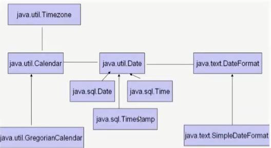
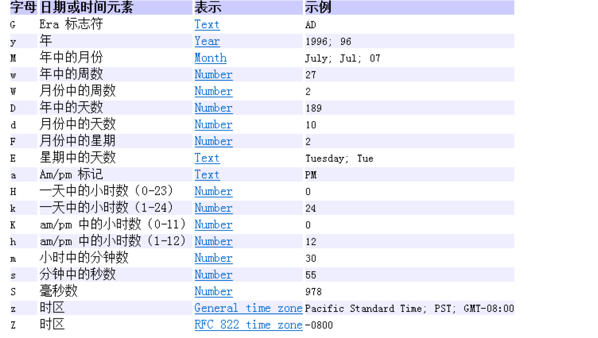
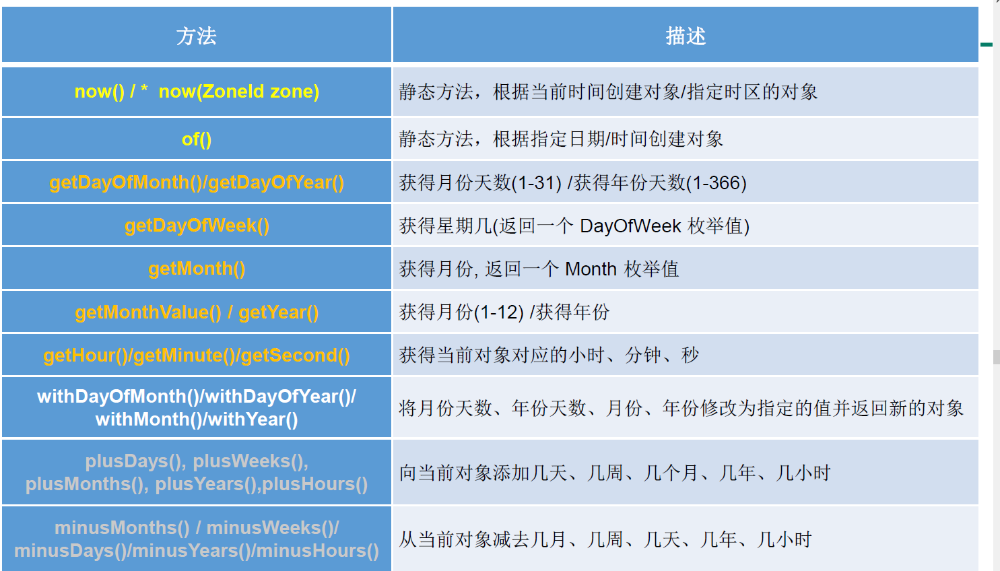

# 7章 常用类

## 7.1 String

## 7.1.1声明

1. String声明为final的，不可被继承

2. String实现了Serializable接口：表示字符串是支持序列化的。实现了Comparable接口：表示String可以比较大小

3. String内部定义了final char[] value用于存储字符串数据

4. String:代表不可变的字符序列。简称：不可变性。

   体现：

- 当对字符串重新赋值时，需要重写指定内存区域赋值，不能使用原有的value进行赋值。
- 当对现有的字符串进行连接操作时，也需要重新指定内存区域赋值，不能使用原有的value进行赋值。
- 当调用String的replace()方法修改指定字符或字符串时，也需要重新指定内存区域赋值，不能使用原有的value进行赋值。

5.通过字面量的方式（区别于new）给一个字符串赋值，此时的字符串值声明在字符串常量池中。
6.字符串常量池中是不会存储相同内容的字符串的。

## 7.1.2 String对象创建

```
String的实例化方式：
方式一：通过字面量定义的方式
方式二：通过new + 构造器的方式
面试题：String s = new String("abc");方式创建对象，在内存中创建了几个对象？
两个:一个是堆空间中new结构，另一个是char[]对应的常量池中的数据："abc"
```

- 直接声明的字符串，是在方法区的常量池中直接创建来了一个数据。
- 通过new String是在堆空间中创建了一个对象，对象的引用地址值执行方法区的常量池的字符串值。
- 所以两个字符串通过直接赋值方式，使用==比较，是相等的。
- 如果是通过new String对象然后赋值的，则==比较，不是相等的。（地址值不一样，数据是一样的。）

结论：

- 常量与常量的拼接结果在常量池 ，且常量池中不会存在相同内容的常量 。
- 只要其中有一个是变量（如果变量是final修饰，就是常量，使用上面结论）结果就在堆中
- 如果拼接的结果调用 intern() 方法 返回值 就 在常量池中

注意：形参都是值传递，对象通过地址值传递，常量通过常量值传递。不是引用数据类型通过形参在方法内修改就能修改，常量值就不能修改。引用数据类型是引用的地址值拷贝，所以修改的地址值引用是不变的。

```
String s1 = "javaEEhadoop";
String s2 = "javaEE";
String s3 = s2 + "hadoop";
System.out.println(s1 == s3);//false

final String s4 = "javaEE";//s4:常量，注意这个位置<====
String s5 = s4 + "hadoop";
System.out.println(s1 == s5);//true
```

```
String s1 = "javaEE";
String s2 = "hadoop";

String s3 = "javaEEhadoop";
String s4 = "javaEE" + "hadoop";
String s5 = s1 + "hadoop";
String s6 = "javaEE" + s2;
String s7 = s1 + s2;

System.out.println(s3 == s4);//true
System.out.println(s3 == s5);//false
System.out.println(s3 == s6);//false
System.out.println(s3 == s7);//false
System.out.println(s5 == s6);//false
System.out.println(s5 == s7);//false
System.out.println(s6 == s7);//false

String s8 = s6.intern();//返回值得到的s8使用的常量值中已经存在的“javaEEhadoop”
System.out.println(s3 == s8);//true
```

```
//通过字面量定义的方式：此时的s1和s2的数据javaEE声明在方法区中的字符串常量池中。
String s1 = "javaEE";
String s2 = "javaEE";
//通过new + 构造器的方式:此时的s3和s4保存的地址值，是数据在堆空间中开辟空间以后对应的地址值。
String s3 = new String("javaEE");
String s4 = new String("javaEE");

System.out.println(s1 == s2);//true
System.out.println(s1 == s3);//false
System.out.println(s1 == s4);//false
System.out.println(s3 == s4);//false

System.out.println("***********************");
Person p1 = new Person("Tom",12);
Person p2 = new Person("Tom",12);

System.out.println(p1.name.equals(p2.name));//true
System.out.println(p1.name == p2.name);//true

p1.name = "Jerry";
System.out.println(p2.name);//Tom
```

### 7.1.3 String的常用方法

```
int length()：返回字符串的长度： return value.length
char charAt(int index)： 返回某索引处的字符return value[index]
boolean isEmpty()：判断是否是空字符串：return value.length == 0
String toLowerCase()：使用默认语言环境，将 String 中的所有字符转换为小写
String toUpperCase()：使用默认语言环境，将 String 中的所有字符转换为大写
String trim()：返回字符串的副本，忽略前导空白和尾部空白
boolean equals(Object obj)：比较字符串的内容是否相同
boolean equalsIgnoreCase(String anotherString)：与equals方法类似，忽略大小写
String concat(String str)：将指定字符串连接到此字符串的结尾。 等价于用“+”
int compareTo(String anotherString)：比较两个字符串的大小
String substring(int beginIndex)：返回一个新的字符串，它是此字符串的从beginIndex开始截取到最后的一个子字符串。
String substring(int beginIndex, int endIndex) ：返回一个新字符串，它是此字符串从beginIndex开始截取到endIndex(不包含)的一个子字符串。

boolean endsWith(String suffix)：测试此字符串是否以指定的后缀结束
boolean startsWith(String prefix)：测试此字符串是否以指定的前缀开始
boolean startsWith(String prefix, int toffset)：测试此字符串从指定索引开始的子字符串是否以指定前缀开始

boolean contains(CharSequence s)：当且仅当此字符串包含指定的 char 值序列时，返回 true
int indexOf(String str)：返回指定子字符串在此字符串中第一次出现处的索引
int indexOf(String str, int fromIndex)：返回指定子字符串在此字符串中第一次出现处的索引，从指定的索引开始(正数索引位置开始，查到最后索引)
int lastIndexOf(String str)：返回指定子字符串在此字符串中最右边出现处的索引
int lastIndexOf(String str, int fromIndex)：返回指定子字符串在此字符串中最后一次出现处的索引，从指定的索引开始反向搜索(正数索引位置开始，倒着查到0索引)

注：indexOf和lastIndexOf方法如果未找到都是返回-1

替换：
String replace(char oldChar, char newChar)：返回一个新的字符串，它是通过用 newChar 替换此字符串中出现的所有 oldChar 得到的。
String replace(CharSequence target, CharSequence replacement)：使用指定的字面值替换序列替换此字符串所有匹配字面值目标序列的子字符串。
String replaceAll(String regex, String replacement)：使用给定的 replacement 替换此字符串所有匹配给定的正则表达式的子字符串。
String replaceFirst(String regex, String replacement)：使用给定的 replacement 替换此字符串匹配给定的正则表达式的第一个子字符串。
匹配:
boolean matches(String regex)：告知此字符串是否匹配给定的正则表达式。
切片：
String[] split(String regex)：根据给定正则表达式的匹配拆分此字符串。
String[] split(String regex, int limit)：根据匹配给定的正则表达式来拆分此字符串，最多不超过limit个，如果超过了，剩下的全部都放到最后一个元素中。

```

### 7.1.4 String类与其他结构之间的转换

1.String 与基本数据类型、包装类之间的转换。

- String --> 基本数据类型、包装类：调用包装类的静态方法：parseXxx(str)
- 基本数据类型、包装类 --> String:调用String重载的valueOf(xxx)

2.String 与 char[]之间的转换

- String --> char[]:调用String的toCharArray()
- char[] --> String:调用String的构造器

3.String 与 byte[]之间的转换

- 编码：String --> byte[]:调用String的getBytes()

- 解码：byte[] --> String:调用String的构造器

- 编码：字符串 -->字节  (看得懂 --->看不懂的二进制数据)

- 解码：编码的逆过程，字节 --> 字符串 （看不懂的二进制数据 ---> 看得懂）

- 说明：解码时，要求解码使用的字符集必须与编码时使用的字符集一致，否则会出现乱码。

  GBK使用两个byte表示中文字符，UTF-8使用三个byte表示中文字符。

## 7.2 StringBuffer和StringBuilder

### 7.2.1 String、StringBuffer、StringBuilder三者的异同

- String:不可变的字符序列；底层使用char[]存储
- StringBuffer:可变的字符序列；线程安全的，效率低；底层使用char[]存储
- StringBuilder:可变的字符序列；jdk5.0新增的，线程不安全的，效率高；底层使用char[]存储

源码分析：

String

```
String str = new String();//char[] value = new char[0];

String str1 = new String("abc");//char[] value = new char[]{'a','b','c'};
```

StringBuffer 

```
StringBuffer sb1 = new StringBuffer();//char[] value = new char[16];底层创建了一个长度是16的数组。
System.out.println(sb1.length());//
sb1.append('a');//value[0] = 'a';
sb1.append('b');//value[1] = 'b';

StringBuffer sb2 = new StringBuffer("abc");//char[] value = new char["abc".length() + 16];
System.out.println(sb2.length());//结果是3
```

扩容问题:

- 如果要添加的数据底层数组盛不下了，那就需要扩容底层的数组。
- 默认情况下，扩容为原来容量的2倍 + 2，同时将原有数组中的元素复制到新的数组中。如果总容量超出int最大后翻转，抛出异常。

指导意义：

- 开发中建议大家使用：StringBuffer(int capacity) 或 StringBuilder(int capacity)

### 7.2.2常用方法

```
StringBuffer的常用方法：
StringBuffer append(xxx)：提供了很多的append()方法，用于进行字符串拼接
StringBuffer delete(int start,int end)：删除指定位置的内容
StringBuffer replace(int start, int end, String str)：把[start,end)位置替换为str
StringBuffer insert(int offset, xxx)：在指定位置插入xxx
StringBuffer reverse() ：把当前字符序列逆转
public int indexOf(String str)
public String substring(int start,int end):返回一个从start开始到end索引结束的左闭右开区间的子字符串
public int length()
public char charAt(int n )
public void setCharAt(int n ,char ch)

        总结：
        增：append(xxx)
        删：delete(int start,int end)
        改：setCharAt(int n ,char ch) / replace(int start, int end, String str)
        查：charAt(int n )
        插：insert(int offset, xxx)
        长度：length();
        *遍历：for() + charAt() / toString()
```

### 7.2.3执行效率

```
对比String、StringBuffer、StringBuilder三者的效率：
从高到低排列：StringBuilder > StringBuffer > String
```

## 7.3 时间类



计算世界时间的主要标准有：

- UTC(Coordinated Universal Time)
- GMT(Greenwich Mean Time)
- CST(Central Standard Time)

### 7.3.1  JDK8之前的时间类

#### 7.3.1.1 System

- System类中的currentTimeMillis()

  返回当前时间与1970年1月1日0时0分0秒之间以毫秒为单位的时间差。

  称为时间戳

#### 7.3.1.2 Date

java.util.Date类
       |---java.sql.Date类是Date的子类

1.两个构造器的使用

> 构造器一：Date()：创建一个对应当前时间的Date对象

> 构造器二：创建指定毫秒数的Date对象

2.两个方法的使用

> toString():显示当前的年、月、日、时、分、秒

> getTime():获取当前Date对象对应的毫秒数。（时间戳）

3. java.sql.Date对应着数据库中的日期类型的变量

> 如何实例化  与java.util.Date类相同

> 如何将java.util.Date对象转换为java.sql.Date对象   java.sql.Date datesql = new java.sql.Date(date.getTime())

#### 7.3.1.3 SimpleDateFormat

1.两个操作：
1.1 格式化：日期 --->字符串
1.2 解析：格式化的逆过程，字符串 ---> 日期



2.SimpleDateFormat的实例化

```
  //实例化SimpleDateFormat:使用默认的构造器
        SimpleDateFormat sdf = new SimpleDateFormat();

        //格式化：日期 --->字符串
        Date date = new Date();
        System.out.println(date);

        String format = sdf.format(date);
        System.out.println(format);

        //解析：格式化的逆过程，字符串 ---> 日期
        String str = "19-12-18 上午11:43";
        Date date1 = sdf.parse(str);
        System.out.println(date1);

        //*************按照指定的方式格式化和解析：调用带参的构造器*****************
//        SimpleDateFormat sdf1 = new SimpleDateFormat("yyyyy.MMMMM.dd GGG hh:mm aaa");
        SimpleDateFormat sdf1 = new SimpleDateFormat("yyyy-MM-dd hh:mm:ss");
        //格式化
        String format1 = sdf1.format(date);
        System.out.println(format1);//2019-02-18 11:48:27
        //解析:要求字符串必须是符合SimpleDateFormat识别的格式(通过构造器参数体现),
        //否则，抛异常
        Date date2 = sdf1.parse("2020-02-18 11:48:27");
        System.out.println(date2);
```

3、Date 中的年份是从 1900 开始的，而月份都从 0 开始。

```
//偏移量
Date date1 = new Date(2020 - 1900,9 - 1,8); 这个才是2020年9月8日
```

#### 7.3.1.4 Calendar

1.实例化
方式一：创建其子类（GregorianCalendar）的对象
方式二：调用其静态方法getInstance()

2.常用方法

```
//get()
int days = calendar.get(Calendar.DAY_OF_MONTH);
System.out.println(days);
System.out.println(calendar.get(Calendar.DAY_OF_YEAR));

//set()
//calendar可变性
calendar.set(Calendar.DAY_OF_MONTH,22);
days = calendar.get(Calendar.DAY_OF_MONTH);
System.out.println(days);

//add()
calendar.add(Calendar.DAY_OF_MONTH,-3);
days = calendar.get(Calendar.DAY_OF_MONTH);
System.out.println(days);

//getTime():日历类---> Date
Date date = calendar.getTime();
System.out.println(date);

//setTime():Date ---> 日历类
Date date1 = new Date();
calendar.setTime(date1);
days = calendar.get(Calendar.DAY_OF_MONTH);
System.out.println(days);
```

3.注意事项

- 获取月份 时： 一月 是 0 ，二月是 1 ，以此类推 12 月是 11
- 获取星期时： 周日是 1 ，周二是 2 。 。。。周六是 7

### 7.3.2 JDK8中的时间类

为什么JDK8中要重新创建时间类

- 可变性：像日期和时间这样的类应该是不可变的。
- 偏移性：Date 中的年份是从 1900 开始的，而月份都从 0 开始。
- 格式化：格式化只对Date 有用， Calendar 则不行。
- 此外，它们也不是线程安全的；不能处理闰秒等。

#### 7.3.2.1 LocalDate、LocalTime、LocalDateTime

LocalDate：代表 IOS 格式（ yyyy MM dd ）的日期 可以存储 生日、纪念日等日期。

LocalTime ：表示一个时间，而不是 日期 。

LocalDateTime： 是用来表示日期和时间的， 这是一个最常用的类之一 。

1.LocalDateTime（年月日时分秒）相较于LocalDate（日期，年月日）、LocalTime（时间，时分秒），使用频率要高
2.类似于Calendar，但是Calendar是可变对象，上面三个都是不可变对象。

常用方法



```
//now():获取当前的日期、时间、日期+时间
LocalDate localDate = LocalDate.now();
LocalTime localTime = LocalTime.now();
LocalDateTime localDateTime = LocalDateTime.now();

System.out.println(localDate);//2022-12-08
System.out.println(localTime);//23:12:54.480
System.out.println(localDateTime);//2022-12-08T23:12:54.480

//of():设置指定的年、月、日、时、分、秒。没有偏移量
LocalDateTime localDateTime1 = LocalDateTime.of(2020, 10, 6, 13, 23, 43);
System.out.println(localDateTime1);//2020-10-06T13:23:43


//getXxx()：获取相关的属性
System.out.println(localDateTime.getDayOfMonth());//8
System.out.println(localDateTime.getDayOfWeek());//THURSDAY
System.out.println(localDateTime.getMonth());//DECEMBER
System.out.println(localDateTime.getMonthValue());//12
System.out.println(localDateTime.getMinute());//12

//体现不可变性
//withXxx():设置相关的属性
LocalDate localDate1 = localDate.withDayOfMonth(22);
System.out.println(localDate);//2022-12-08
System.out.println(localDate1);//2022-12-22


LocalDateTime localDateTime2 = localDateTime.withHour(4);
System.out.println(localDateTime);//2022-12-08T23:12:54.480
System.out.println(localDateTime2);//2022-12-08T04:12:54.480

//不可变性
LocalDateTime localDateTime3 = localDateTime.plusMonths(3);
System.out.println(localDateTime);//2022-12-08T23:12:54.480
System.out.println(localDateTime3);//2023-03-08T23:12:54.480

LocalDateTime localDateTime4 = localDateTime.minusDays(6);
System.out.println(localDateTime);//2022-12-08T23:12:54.480
System.out.println(localDateTime4);//2022-12-02T23:12:54.480
```

#### 7.3.2.2 Instant(瞬时)

类似于 java.util.Date类  
(1 ns = 10^-9 s) 1 秒 = 1000 毫秒 =10^6 微秒 =10^9 纳秒

```
    //now():获取本初子午线对应的标准时间
    Instant instant = Instant.now();
    System.out.println(instant);//2019-02-18T07:29:41.719Z

    //添加时间的偏移量,东八区
    OffsetDateTime offsetDateTime = instant.atOffset(ZoneOffset.ofHours(8));
    System.out.println(offsetDateTime);//2019-02-18T15:32:50.611+08:00

    //toEpochMilli():获取自1970年1月1日0时0分0秒（UTC）开始的毫秒数  ---> Date类的getTime()
    long milli = instant.toEpochMilli();
    System.out.println(milli);

    //ofEpochMilli():通过给定的毫秒数，获取Instant实例  -->Date(long millis)
    Instant instant1 = Instant.ofEpochMilli(1550475314878L);
    System.out.println(instant1);
```

| 方法                        | 描述                                                         |
| --------------------------- | ------------------------------------------------------------ |
| now()                       | 静态方法,返回默认 UTC 时区的 Instant 类的对象                |
| ofEpochMilli(long)          | 静态方法,返回在1970-01-01 00:00:00基础上加上指定毫秒数之后的Instant类的对象 |
| atOffset(ZoneOffset offset) | 结合即时的偏移来创建一个OffsetDateTime                       |
| toEpochMilli()              | 返回1970-01-01 00:00:00 到当前时间的毫秒数 即为时间戳        |

时间戳是指格林威治时间1970年01月01日00时00分00秒北京时间1970年01月01日08时00分00秒起至现在的总秒数。

#### 7.3.2.3 格式化与解析日期或时间

java.time.format.DateTimeFormatter类，该类提供了三种格式化方法：

* 预定义的标准格式。如：
  ISO_LOCAL_DATE_TIME(年月日时分秒);ISO_LOCAL_DATE(年月日);ISO_LOCAL_TIME(时分秒)
* 本地化相关的格式。如： ofLocalizedDateTime(FormatStyle.LONG)
* 自定义的格式。如： ofPattern(“yyyy MM dd hh:mm:ss”)

```
//        方式一：预定义的标准格式。如：ISO_LOCAL_DATE_TIME;ISO_LOCAL_DATE;ISO_LOCAL_TIME
        DateTimeFormatter formatter = DateTimeFormatter.ISO_LOCAL_DATE_TIME;
        //格式化:日期-->字符串
        LocalDateTime localDateTime = LocalDateTime.now();
        String str1 = formatter.format(localDateTime);
        System.out.println(localDateTime);
        System.out.println(str1);//2019-02-18T15:42:18.797

        //解析：字符串 -->日期
        TemporalAccessor parse = formatter.parse("2019-02-18T15:42:18.797");
        System.out.println(parse);

//        方式二：
//        本地化相关的格式。如：ofLocalizedDateTime()
//        FormatStyle.LONG / FormatStyle.MEDIUM / FormatStyle.SHORT :适用于LocalDateTime
        DateTimeFormatter formatter1 = DateTimeFormatter.ofLocalizedDateTime(FormatStyle.LONG);
        //格式化
        String str2 = formatter1.format(localDateTime);
        System.out.println(str2);//2019年2月18日 下午03时47分16秒


//      本地化相关的格式。如：ofLocalizedDate()
//      FormatStyle.FULL / FormatStyle.LONG / FormatStyle.MEDIUM / FormatStyle.SHORT : 适用于LocalDate
        DateTimeFormatter formatter2 = DateTimeFormatter.ofLocalizedDate(FormatStyle.MEDIUM);
        //格式化
        String str3 = formatter2.format(LocalDate.now());
        System.out.println(str3);//2019-2-18


//       重点： 方式三：自定义的格式。如：ofPattern(“yyyy-MM-dd hh:mm:ss”)
        DateTimeFormatter formatter3 = DateTimeFormatter.ofPattern("yyyy-MM-dd hh:mm:ss");
        //格式化
        String str4 = formatter3.format(LocalDateTime.now());
        System.out.println(str4);//2019-02-18 03:52:09

        //解析
        TemporalAccessor accessor = formatter3.parse("2019-02-18 03:52:09");
        System.out.println(accessor);
```

| 方法                      | 描述                                               |
| ------------------------- | -------------------------------------------------- |
| ofPattern(String pattern) | 静态方法返回一个指定字符串格式的 DateTimeFormatter |
| format(TemporalAccessort) | 格式化一个日期、时间 返回字符串                    |
| parse(CharSequencetext)   | 将指定格式的字符序列解析为一个日期、 时间          |

#### 7.3.2.4 其它 API

* ZoneId 该类中包含了所有的时区信息 一个时区的 ID 如 Europe/Paris
* ZonedDateTime 一个在 ISO-8601 日历系统时区的日期时间,如 2007-12-03T10:15+30:01 00 Europe/Paris 。
  *  其中每个时区都对应着ID地区ID 都为{区域}/{城市}的格式 例如： Asia/Shanghai 等
* Clock 使用时区提供对当前即时、日期和时间的访问的时钟。
  * 持续时间： Duration用于计算两个时间间隔
  * 日期间隔： Period用于计算两个日期间隔
* TemporalAdjuster : 时间校正器。有时我们可能需要获取例如：将日期调整 到“下一个工作日”等操作。
* TemporalAdjusters : 该类通过静态方法(firstDayOfXxx()/lastDayOfXxx()/ 提供了大量的常用TemporalAdjuster的实现。

* 

```java
//ZoneId: 类中包含了所有的时区信息
// ZoneId的 getAvailableZoneIds(): 获取所有的 ZoneId
Set<String> zoneIds = ZoneId.getAvailableZoneIds();
for(String s : zoneIds){
    System.out.println(s);
}
LocalDateTime localDateTime = LocalDateTime.now(ZoneId.of("Asia/Tokyo"));
System.out.println(localDateTime);//2023-01-03T21:46:07.207

//ZonedDateTime: 带时区的日期时间
//ZonedDateTime的 now(): 获取本时区的 ZonedDateTime 对象
ZonedDateTime zonedDateTime = ZonedDateTime.now();
System.out.println(zonedDateTime);//2023-01-03T20:46:07.254+08:00[Asia/Shanghai]

//ZonedDateTime的 now(ZoneId id): 获取指定时区的 ZonedDateTime 对象
ZonedDateTime onedDateTime1 = ZonedDateTime.now(ZoneId.of("Asia/Tokyo"));
System.out.println(onedDateTime1);//2023-01-03T21:46:07.254+09:00[Asia/Tokyo]
```

```java
//Duration: 用于计算两个“时间”间隔，以秒和纳秒为基准
LocalTime localTime = LocalTime.now();
LocalTime localTime1 = LocalTime.of(15, 23,32);
//between():静态方法，返回 Duration 对象，表示两个时间的间隔
Duration duration = Duration.between(localTime1 , localTime);
System.out.println(duration);//PT5H31M33.656S
System.out.println(duration.getSeconds());//19893
System.out.println(duration.getNano());//656000000
LocalDateTime localDateTime = LocalDateTime.of(2016, 6, 12, 15, 23,32);
LocalDateTime localDateTime1 = LocalDateTime.of(2017, 6, 12, 15, 23,32);
Duration duration1 = Duration.between(localDateTime1,localDateTime);
System.out.println(duration1.toDays());//-365
```

```java
//Period: 用于计算两个“时间”间隔，以年月日为衡量都
LocalDate localDate = LocalDate.now();
LocalDate localDate1 = LocalDate.of(2028,3,18);
//between():静态方法，返回 Period 对象，表示两个时间的间隔
Period period = Period.between(localDate , localDate1);
System.out.println(period);//P5Y2M15D
System.out.println(period.getYears());//5
System.out.println(period.getMonths());//2
System.out.println(period.getDays());//15
Period period1 = period.withYears(2);
System.out.println(period1);//P2Y2M15D
```

```java
//TemporalAdjuster: 时间校正器
//获取当前日期的下一个周日是哪天？
TemporalAdjuster temporalAdjuster = TemporalAdjusters.next(DayOfWeek.SUNDAY);
LocalDateTime localDateTime = LocalDateTime.now().with(temporalAdjuster);
System.out.println(localDateTime);//2023-01-08T21:09:30.436
LocalDate localDate = LocalDate.now().with(new TemporalAdjuster() {
    @Override
    public Temporal adjustInto(Temporal temporal) {
        LocalDate localDate1 = (LocalDate) temporal;
        if(localDate1.getDayOfWeek().equals(DayOfWeek.FRIDAY)){
            return  localDate1.plusDays(3);
        }else if(localDate1.getDayOfWeek().equals(DayOfWeek.SATURDAY)){
            return  localDate1.plusDays(2);
        }else {
            return  localDate1.plusDays(1);
        }
    }
});
System.out.println(localDate);//2023-01-04
```

#### 7.3.2.5  与传统日期处理的转换

| 类                                                       | To遗留类                              | From 遗留类                 |
| -------------------------------------------------------- | ------------------------------------- | --------------------------- |
| java.time.Instant与 java.util.Date                       | Date.from(instant)                    | date.toInstant()            |
| java.time.Instant与 java.sql.Timestamp                   | Timestamp.from(instant)               | timestamp.toInstant()       |
| java.time.ZonedDateTime与java.util.GregorianCalendar     | GregorianCalendar.from(zonedDateTime) | cal.toZonedDateTime()       |
| java.time.LocalDate与 java.sql.Time                      | Date.valueOf(localDate)               | date.toLocalDate()          |
| java.time.LocalTime与 java.sql.Time                      | Date.valueOf(localDate)               | date.toLocalTime()          |
| java.time.LocalDateTime与java.sql.Timestamp              | Timestamp.valueOf(localDateTime)      | timestamp.toLocalDateTime() |
| java.time.ZoneId与 java.util.TimeZone                    | Timezone.getTimeZone(id)              | timeZone.toZoneId()         |
| java.time.format.DateTimeFormatter与java.text.DateFormat | formatter.toFormat()                  | 无                          |

## 7.4比较器

### 7.4.1说明

Java中的对象，正常情况下，只能进行比较：==  或  != 。不能使用 > 或 < 的，但是在开发场景中，我们需要对多个对象进行排序，言外之意，就需要比较对象的大小。如何实现？使用两个接口中的任何一个：Comparable 或 Comparator

### 7.4.2Comparable接口与Comparator的使用的对比

- Comparable接口的方式一旦一定，保证Comparable接口实现类的对象在任何位置都可以比较大小。（自然排序）
- Comparator接口属于临时性的比较。（定制排序）

### 7.4.3Comparable接口

Comparable接口的使用举例：  自然排序

- 像String、包装类等实现了Comparable接口，重写了compareTo(obj)方法，给出了比较两个对象大小的方式。
- 像String、包装类重写compareTo()方法以后，进行了从小到大的排列

- 重写compareTo(obj)的规则：

    如果当前对象this大于形参对象obj，则返回正整数，

    如果当前对象this小于形参对象obj，则返回负整数，

    如果当前对象this等于形参对象obj，则返回零。

- 对于自定义类来说，如果需要排序，我们可以让自定义类实现Comparable接口，重写compareTo(obj)方法。
   在compareTo(obj)方法中指明如何排序

```java
String[] arr = new String[]{"AA","CC","KK","MM","GG","JJ","DD"};
//
Arrays.sort(arr);

System.out.println(Arrays.toString(arr));//[AA, CC, DD, GG, JJ, KK, MM]
```

### 7.4.4Comparator接口

Comparator接口的使用：定制排序

- 背景

当元素的类型没有实现java.lang.Comparable接口而又不方便修改代码，或者实现了java.lang.Comparable接口的排序规则不适合当前的操作，那么可以考虑使用 Comparator 的对象来排序

- 重写compare(Object o1,Object o2)方法，比较o1和o2的大小：

​	如果方法返回正整数，则表示o1大于o2；

​	如果返回0，表示相等；

​	返回负整数，表示o1小于o2。

```java
String[] arr = new String[]{"AA","CC","KK","MM","GG","JJ","DD"};
        Arrays.sort(arr,new Comparator(){

            //按照字符串从大到小的顺序排列
            @Override
            public int compare(Object o1, Object o2) {
                if(o1 instanceof String && o2 instanceof  String){
                    String s1 = (String) o1;
                    String s2 = (String) o2;
                    return -s1.compareTo(s2);
                }
//                return 0;
                throw new RuntimeException("输入的数据类型不一致");
            }
        });
        System.out.println(Arrays.toString(arr));
```

## 7.5 System类

- System 类代表系统，系统级的很多属性和控制方法都放置在该类的内部。该类位于 java.lang 包。

- 由于 该类的 构造 器 是 private 的，所以无法创建该类的对象，也就是无法实例化该类。其内部的 成员变量和成员方法都是 static 的， 所以也可以很方便的进行调用

- 成员变量
  System 类内部包含 in 、 out 和 err 三个成员变量，分别代表标准输入流
  键盘输入 ))，标准输出流 显示器 和标准错误输出流 显示器

- 成员方法

  - native long currentTimeMillis()

    该方法的作用是返回当前的计算机时间，时间的表达格式为当前计算机时间和 GMT 时间 格林威治时间 )1970 年 1 月 1 号 0 时 0 分 0 秒所差的毫秒数

  - void exit(int status)

    该方法的作用是退出程序。其中 status 的值为 0 代表正常退出，非零代表异常退出。 使用该方法可以在图形界面编程中实现程序的退出功能 等 。

  - void gc()

    该方法的作用是请求系统进行垃圾回收。至于系统是否立刻回收，则取决于系统中垃圾回收算法的实现以及系统执行时的情况。

  - String getProperty(String key)

    该方法的作用是获得系统中属性名为 key 的属性对应的值。系统中常见的属性名以及属性的作用如下表所 示：

    ```
    String javaVersion = System.getProperty("java.version");
    System.out.println("java的version:" + javaVersion);//java运行的版本号
    
    String javaHome = System.getProperty("java.home");
    System.out.println("java的home:" + javaHome);//java安装目录
    
    String osName = System.getProperty("os.name");
    System.out.println("os的name:" + osName);//操作系统名称
    
    String osVersion = System.getProperty("os.version");
    System.out.println("os的version:" + osVersion);//操作系统版本号
    
    String userName = System.getProperty("user.name");
    System.out.println("user的name:" + userName);//用户的账户名称
    
    String userHome = System.getProperty("user.home");
    System.out.println("user的home:" + userHome);//用户的主目录
    
    String userDir = System.getProperty("user.dir");
    System.out.println("user的dir:" + userDir);//用户的当前工作目录
    ```

## 7.6 Math类

java.lang.Math提供了一系列静态方法用于 科学 计算。其 方法的参数和返回值类型一般为 double 型。
abs 绝对值
acos,asin,atan,cos,sin,tan 三角函数
sqrt 平方根
pow(double a,doble b) a 的 b 次幂
log 自然对数
exp e为底指数
max(double a,double b)
min(double a,double b)
random() 返回 0.0 到 1.0 的随机数
long round(double a) double型数据 a 转换为 long 型（四舍五入）
toDegrees(double angrad)弧度->角度
toRadians(double angdeg)角度->弧度

## 7.7BigInteger 与 BigDecimal

BigInteger

- Integer 类作为 int 的包装类，能存储的最大整型值为 2^31-1 Long 类也是有限的，最大为 2^63-1 。 如果 要表示再大的整数，不管是基本数据类型还是他们的包装类都无能为力，更不用说进行运算了。
- java.math 包的 BigInteger 可以表示不可变的任意精度的整数 。 BigInteger 提供所有 Java 的基本整数操作符的对应物，并提供 java.lang.Math 的所有相关方法。另外， BigInteger 还提供以下运算：模算术、 GCD 计算、质数测试、素数生成、位操作以及一些其他操作。
- 构造器：BigInteger (String val 根据字符串构建 BigInteger 对象

- 常用方法
  - public BigInteger abs ()：返回此 BigInteger 的绝对值的 BigInteger 。
  - BigInteger add (BigInteger val) ：返回其值为 (this + val) 的 BigInteger
  - BigInteger subtract (BigInteger val) ：返回其值为 (this val) 的 BigInteger
  - BigInteger multiply (BigInteger val) ：返回其值为 (this * val) 的 BigInteger
  - BigInteger divide (BigInteger val) ：返回其值为 (this / val) 的 BigInteger 。整数相除只保留整数部分 。
  - BigInteger remainder (BigInteger val) ：返回其值为 (this % val) 的 BigInteger 。
  - BigInteger [] divideAndRemainder (BigInteger val)：返回包含 (this / val) 后跟(this % val) 的两个 BigInteger 的数组 。
  - BigInteger pow (int exponent) ：返回其值为 (this^exponent ) 的 BigInteger 。

BigDecimal

- 一般的 Float 类和 Double 类可以用来做科学计算或工程计算，但在 商业计算中，要求数字精度比较高，故用到 java.math.BigDecimal 类

- BigDecimal 类支持不可变的、任意精度的有符号十进制定点数 。

- 构造器
  - public BigDecimal(double val)
  - public BigDecimal (String val)
- 常用方法
  - BigDecimal add (BigDecimal val) ：返回其值为 (this + val) 的 BigInteger
  - BigDecimal subtract (BigDecimal val) ：返回其值为 (this val) 的 BigInteger
  - BigDecimal multiply (BigDecimal val) ：返回其值为 (this * val) 的 BigInteger
  - BigDecimal divide (BigDecimal val) ：返回其值为 (this / val) 的 BigInteger 。整数相除只保留整数部分 。

```
      BigInteger bi = new BigInteger("1243324112234324324325235245346567657653");
        BigDecimal bd = new BigDecimal("12435.351");
        BigDecimal bd2 = new BigDecimal("11");
        System.out.println(bi);//1243324112234324324325235245346567657653
//         System.out.println(bd.divide(bd2));
        System.out.println(bd.divide(bd2, BigDecimal.ROUND_HALF_UP));//1130.486
        System.out.println(bd.divide(bd2, 25, BigDecimal.ROUND_HALF_UP));//1130.4864545454545454545454545保留25位小数
```