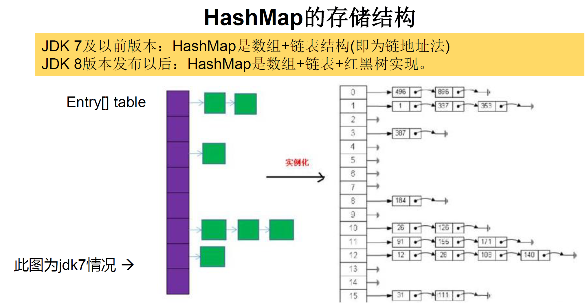
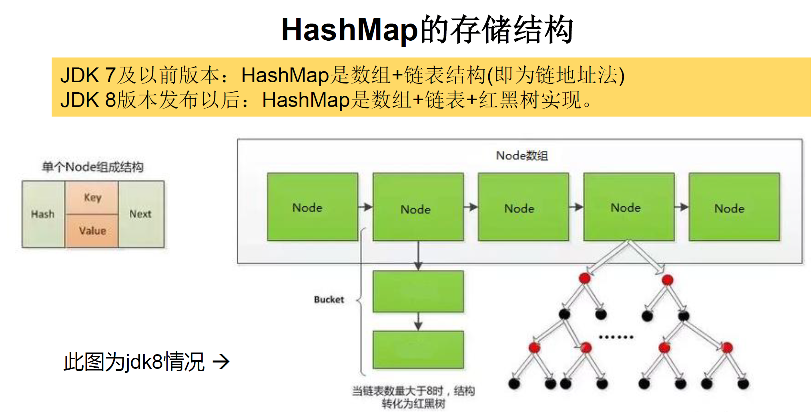
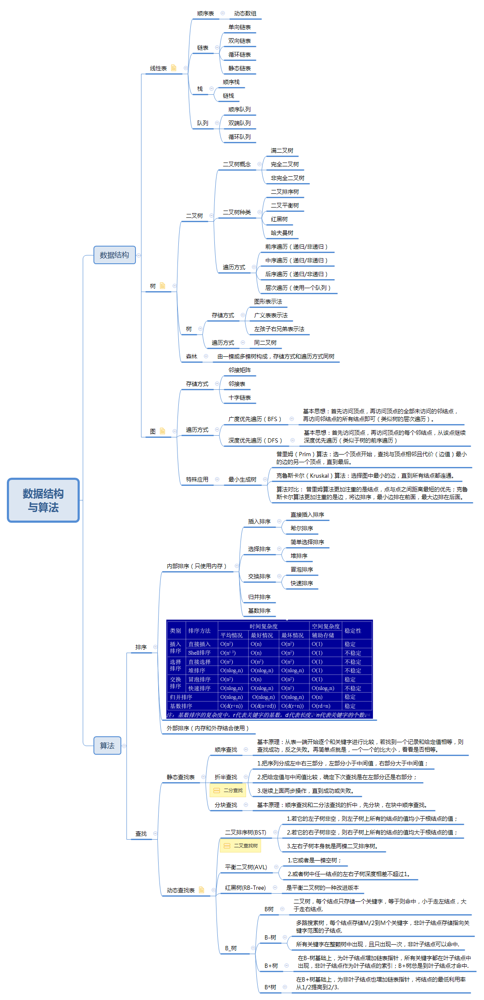

# 9章 集合
## 9.1 集合框架的概述
集合、数组都是对多个数据进行存储操作的结构，简称Java容器。  
说明：此时的存储，主要指的是内存层面的存储，不涉及到持久化的存储（.txt,.jpg,.avi，数据库中）
### 9.1.1 数组在存储多个数据方面的特点
* 一旦初始化以后，其长度就确定了。
* 数组一旦定义好，其元素的类型也就确定了。我们也就只能操作指定类型的数据了。
* 比如：String[] arr;int[] arr1;Object[] arr2;
### 9.1.2 数组在存储多个数据方面的缺点
* 一旦初始化以后，其长度就不可修改。
* 数组中提供的方法非常有限，对于添加、删除、插入数据等操作，非常不便，同时效率不高。
* 获取数组中实际元素的个数的需求，数组没有现成的属性或方法可用
* 数组存储数据的特点：有序、可重复。对于无序、不可重复的需求，不能满足。
## 9.2 集合框架
```
|----Collection接口：单列集合，用来存储一个一个的对象  
    |----List接口：存储有序的、可重复的数据。  -->“动态”数组  
        |----ArrayList、LinkedList、Vector  
    |----Set接口：存储无序的、不可重复的数据   -->高中讲的“集合”  
        |----HashSet、LinkedHashSet、TreeSet  
|----Map接口：双列集合，用来存储一对(key - value)一对的数据   -->高中函数：y = f(x)  
    |----HashMap->LinkedHashMap、TreeMap、Hashtable->Properties  
```
## 9.3 Collection接口中的方法的使用
* add(Object e):将元素e添加到集合coll中
* addAll(Collection coll1):将coll1集合中的元素添加到当前的集合中
* size():获取添加的元素的个数
* clear():清空集合元素
* isEmpty():判断当前集合是否为空
* boolean contains(Object obj)是通过元素的equals方法来判断是否是同一个对象
* containsAll(Collection coll1):判断形参coll1中的所有元素是否都存在于当前集合中。
* remove(Object obj):从当前集合中移除obj元素。只会删除找到的第一个元素
* removeAll(Collection coll1):差集：从当前集合中移除coll1中所有的元素。
* retainAll(Collection coll1):交集：获取当前集合和coll1集合的交集，并返回给当前集合
* equals(Object obj):要想返回true，需要当前集合和形参集合的元素都相同。
* hashCode():返回当前对象的哈希值
* iterator()返回迭代器对象，用于集合遍历  
注意事项：Arrays.asList()是基础类型数组时(泛型可变参数识别类型将int[]识别为一个类型了)，返回的List里面是基础类型数组一个对象。
```
    //Arrays.asList()源码
    public static <T> List<T> asList(T... a) {
        return new ArrayList<>(a);
    }
    List arr1 = Arrays.asList(new int[]{123, 456});
    System.out.println(arr1.size());//结果是1，List里面是int[]数组
    List arr2 = Arrays.asList(new Integer[]{123, 456});
    System.out.println(arr2.size());//结果是2，List里面是Integer元素
```
## 9.4 迭代器
* Iterator对象称为迭代器(设计模式的一种)，主要用于遍历Collection集合中的元素。
* 内部的方法：hasNext() 和  next()
* 集合对象每次调用iterator()方法都得到一个全新的迭代器对象，
* Iterator仅用于遍历集合,Iterator本身并不提供承装对象的能力。如果需要创建Iterator对象，则必须有一个被迭代的集合。
* 默认游标都在集合的第一个元素之前。
* 内部定义了remove(),可以在遍历的时候，删除集合中的元素。此方法不同于集合直接调用remove()
* 下一条记录无效，直接调用it.next()会抛出NoSuchElementException异常。
* 如果还未调用next()或在上一次调用next()方法之后已经调用了remove方法再调用remove()都会报IllegalStateException。
```
    Collection coll = new ArrayList();
    coll.add(123);
    coll.add(456);
    coll.add(new Person("Jerry",20));
    coll.add(new String("Tom"));
    coll.add(false);

    Iterator iterator = coll.iterator();
    
    while(iterator.hasNext()){
        //next():①指针下移 ②将下移以后集合位置上的元素返回
        System.out.println(iterator.next());
    }
```
## 9.5 使用foreach循环遍历集合元素
* Java 5.0提供了foreach循环迭代访问Collection和数组。
* 遍历操作不需获取Collection或数组的长度，无需使用索引访问元素。
* 遍历集合的底层调用Iterator完成操作。
* foreach还可以用来遍历数组。
```
        String[] arr = new String[]{"MM","MM","MM"};

//        //方式一：普通for赋值
//        for(int i = 0;i < arr.length;i++){
//            arr[i] = "GG";//修改的是String数组的元素
//        }

        //方式二：增强for循环
        for(String s : arr){
            s = "GG";//修改的是String数组的元素复制的值
        }

        for(int i = 0;i < arr.length;i++){
            System.out.println(arr[i]);//结果还是"MM","MM","MM"
        }
```
## 9.6 List接口
* 鉴于Java中数组用来存储数据的局限性，我们通常使用List替代数组
* List 集合类中元素有序、且可重复集合中的每个元素都有其对应的顺序索引。
* List 容器中的元素都对应一个整数型的序号记载其在容器中的位置，可以根据序号存取容器中的元素。
* JDK API中List 接口的实现类常用的有：ArrayList、LinkedList和Vector
### 9.6.1 List接口框架 
```
|----Collection接口：单列集合，用来存储一个一个的对象
          |----List接口：存储有序的、可重复的数据。  -->“动态”数组,替换原有的数组
              |----ArrayList：作为List接口的主要实现类；线程不安全的，效率高；可以放null;底层使用Object[] elementData存储
              |----LinkedList：对于频繁的插入、删除操作，使用此类效率比ArrayList高；可以放null;底层使用双向链表存储
*             |----Vector：作为List接口的古老实现类；线程安全的，效率低；可以放null;底层使用Object[] elementData存储
```
### 9.6.2 ArrayList的源码分析
* jdk 7情况下,像饿汉式，直接创建一个初始容量为10的数组
```
    ArrayList list = new ArrayList();//底层创建了长度是10的Object[]数组elementData
    list.add(123);//elementData[0] = new Integer(123);
    ...
    list.add(11);//如果此次的添加导致底层elementData数组容量不够，则扩容。
    默认情况下，扩容为原来的容量的1.5倍，同时需要将原有数组中的数据复制到新的数组中。
    
    结论：建议开发中使用带参的构造器：ArrayList list = new ArrayList(int capacity)
```
* jdk 8中ArrayList的变化，像懒汉式，一开始创建一个长度为0的数组，当添加第一个元素时再创建一个始容量为10的数组
``` 
    ArrayList list = new ArrayList();//底层Object[] elementData初始化为{}.并没有创建长度为10的数组
    list.add(123);//第一次调用add()时，底层才创建了长度10的数组，并将数据123添加到elementData[0]
    ...
    后续的添加和扩容操作与jdk 7 无异。
```
* List面试题
```
 /*
    区分List中remove(int index)和remove(Object obj)
     */
    @Test
    public void testListRemove() {
        List list = new ArrayList();//基础类型会转化为封装类型
        list.add(1);
        list.add(2);
        list.add(3);
        updateList(list);
        System.out.println(list);//
    }

    private void updateList(List list) {
        list.remove(2);//移除的是下标为2的元素，结果为1,3
//        list.remove(new Integer(2));//这才是移除为2的元素，结果为1,3
    }
```
### 9.6.3 LinkedList的源码分析
双向链表是元素同时指向上一个、下一个。单向链表元素只有下一个指向。
```
       LinkedList list = new LinkedList(); 内部声明了Node类型的first和last属性，默认值为null
       list.add(123);//将123封装到Node中，创建了Node对象。
 
       其中，Node定义为：体现了LinkedList的双向链表的说法
       private static class Node<E> {
             E item;
             Node<E> next;
             Node<E> prev;

             Node(Node<E> prev, E element, Node<E> next) {
             this.item = element;
             this.next = next;
             this.prev = prev;
             }
         }
```
### 9.6.4 Vector的源码分析
jdk7和jdk8中通过Vector()构造器创建对象时，底层都创建了长度为10的数组。  
在扩容方面，默认扩容为原来的数组长度的2倍。  
* 面试题：ArrayList、LinkedList、Vector三者的异同？
* 同：三个类都是实现了List接口，存储数据的特点相同：存储有序的、可重复的数据。不同点ArrayList数组存储线程不安全适合数据查询、LinkedList链表存储线程不安全适合数据插入删除、Vector数组存储线程安全。
```
ArrayList 和 LinkedList 的 异同
二者都线程不安全，相对线程安全的Vector ，执行效率高。此外，ArrayList 是实现了基于动态数组的数据结构， 
LinkedList 基于链表的数据结构。对于随机访问 get 和 set ArrayList 觉得优于 LinkedList ，
因为 LinkedList 要移动指针。对于新增和删除 操作 add( 特指 插入 和 remove LinkedList 比较占优势，因为 ArrayList 要移动数据。

ArrayList 和 Vector 的区别
Vector和 ArrayList 几乎是完全相同的 唯一的区别在于 Vector 是同步类 ( synchronized)，属于
强同步类。因此开销就比 ArrayList 要大，访问要慢。正常情况下 大多数的 Java 程序员使用
ArrayList 而不是 Vector, 因为同步完全可以由程序员自己来控制。 Vector 每次扩容请求其大
小的 2 倍空间，而 ArrayList 是 1.5 倍。 Vector 还有一个子 类 Stack 。
```
### 9.6.5 List接口中的常用方法
* void add(int index, Object ele):在index位置插入ele元素
* boolean addAll(int index, Collection eles):从index位置开始将eles中的所有元素添加进来
* Object get(int index):获取指定index位置的元素
* int indexOf(Object obj):返回obj在集合中首次出现的位置
* int lastIndexOf(Object obj):返回obj在当前集合中末次出现的位置
* Object remove(int index):移除指定index位置的元素，并返回此元素
* Object remove(Object ele):移除ele元素，并返回此元素
* Object set(int index, Object ele):设置指定index位置的元素为ele
* List subList(int fromIndex, int toIndex):返回从fromIndex到toIndex位置的子集合

#### 总结：常用方法
* 增：add(Object obj)
* 删：remove(int index) / remove(Object obj)
* 改：set(int index, Object ele)
* 查：get(int index)
* 插：add(int index, Object ele)
* 长度：size()
* 遍历：  
① Iterator迭代器方式  
② 增强for循环  
③ 普通的循环
## 9.7 Set接口
* Set接口是Collection的子接口，set接口中没有额外定义新的方法，使用的都是Collection中声明过的方法。
* 无序性：不等于随机性。存储的数据在底层数组中并非按照数组索引的顺序添加，而是根据数据的哈希值决定的。
* 不可重复性：保证添加的元素按照equals()判断时，不能返回true.即：相同的元素只能添加一个。
### 9.7.1 Set接口框架
```
  |----Collection接口：单列集合，用来存储一个一个的对象
           |----Set接口：存储无序的、不可重复的数据   -->高中讲的“集合”
               |----HashSet：作为Set接口的主要实现类；不能保证元素的排列顺序；线程不安全的；可以存储null值
                   |----LinkedHashSet：作为HashSet的子类；遍历其内部数据时，可以按照添加的顺序遍历
                                       对于频繁的遍历操作，LinkedHashSet效率高于HashSet.可以存储null值
               |----TreeSet：可以按照添加对象的指定属性，进行排序,不可以存储null值。
```
### 9.7.2 HashSet、LinkedHashSet
* 向Set(主要指：HashSet、LinkedHashSet)中添加的数据，其所在的类一定要重写hashCode()和equals()
* 重写的hashCode()和equals()尽可能保持一致性：相等的对象必须具有相等的散列码
* 重写两个方法的小技巧：对象中用作 equals() 方法比较的 Field，都应该用来计算 hashCode 值。
### 9.7.3 重写hashCode()和equals()
* 重写hashCode()原则
  * 在程序运行时，同一个对象多次调用 hashCode()方法应该返回相同的值。
  * 当两个对象的equals()方法比较返回true时，这两个对象的hashCode()方法的返回值也应相等。
  * 对象中用作equals()方法比较的Field，都应该用来计算hashCode
* 重写equals()原则
    * 相等的对象必须具有相等的散列码，相同的散列码的对象可能是不同的。
* 为什么用Eclipse/IDEA复写hashCode方法，有31这个数字？
  * 选择系数的时候要选择尽量大的系数。因为如果计算出来的 hash 地址越大，所谓的 “冲突”就越少，查找起来效率也会提高。（减少冲突）
  * 31只占用5bits, 相乘造成数据溢出的概率较小。
  * 31可以由i*31==(i<<5)-1来表示现在很多虚拟机里面都有做相关优化。（提高算法效率）
  * 31是一个素数，素数作用就是如果我用一个数字来乘以这个素数，那么最终出来的结果只能被素数本身和被乘数还有1来整除！（减少冲突）


### 9.7.4 HashSet添加元素过程
```
我们向HashSet中添加元素a,首先调用元素a所在类的hashCode()方法，计算元素a的哈希值，
此哈希值接着通过某种算法计算出在HashSet底层数组中的存放位置（即为：索引位置），判断
数组此位置上是否已经有元素：
    如果此位置上没有其他元素，则元素a添加成功。 --->情况1
    如果此位置上有其他元素b(或以链表形式存在的多个元素），则比较元素a与元素b的hash值：
        如果hash值不相同，则元素a添加成功。--->情况2
        如果hash值相同，进而需要调用元素a所在类的equals()方法：
               equals()返回true,元素a添加失败
               equals()返回false,则元素a添加成功。--->情况2

对于添加成功的情况2和情况3而言：元素a 与已经存在指定索引位置上数据以链表的方式存储。
jdk 7 :元素a放到数组中，指向原来的元素。
jdk 8 :原来的元素在数组中，指向元素a
总结：七上八下

HashSet底层：数组+链表的结构。
底层也是数组初始容量为16当如果使用率超过0.75，16*0.75=12就会扩大容量为原来的2倍。16扩容为32依次为64 128等
```
### 9.7.5 LinkedHashSet的使用
* LinkedHashSet作为HashSet的子类，在添加数据的同时，每个数据还维护了两个引用（双向链表），记录此数据前一个数据和后一个数据。
* 优点：对于频繁的遍历操作，LinkedHashSet效率高于HashSet
* LinkedHashSet插入性能略低于HashSet。
* LinkedHashSet 不允许集合元素重复。

### 9.7.7 TreeSet
* TreeSet是SortedSet接口的实现类，TreeSet可以确保集合元素处于排序状态。
* 向TreeSet中添加的数据，要求是相同类的对象
* TreeSet底层使用红黑树结构存储数据,特点：有序，查询速度比List快。
* TreeSet两种排序方式：自然排序（添加的元素实现Comparable接口）和定制排序（构造TreeSet时传入Comparator）
* 比较两个元素是否相同，是通过compareTo()返回0.不再是equals()。
* 新增方法
  * Comparator comparator()
  * Object first()
  * Object last()
  * Object lower(Object e)
  * Object higher(Object e)
  * SortedSet subSet(fromElement,toElement)
  * SortedSet headSet(toElement)
  * SortedSet tailSet(fromElement)
##### 自然排序
```
        TreeSet set = new TreeSet();

        //失败：不能添加不同类的对象
//        set.add(123);
//        set.add(456);
//        set.add("AA");
//        set.add(new User("Tom",12));

            //举例一：
//        set.add(34);
//        set.add(-34);
//        set.add(43);
//        set.add(11);
//        set.add(8);

        //举例二：
        set.add(new User("Tom",12));
        set.add(new User("Jerry",32));
        set.add(new User("Jim",2));
        set.add(new User("Mike",65));
        set.add(new User("Jack",33));
        set.add(new User("Jack",56));


        Iterator iterator = set.iterator();
        while(iterator.hasNext()){
            System.out.println(iterator.next());
        }

```

##### 定制排序
```
 Comparator com = new Comparator() {
            //按照年龄从小到大排列
            @Override
            public int compare(Object o1, Object o2) {
                if(o1 instanceof User && o2 instanceof User){
                    User u1 = (User)o1;
                    User u2 = (User)o2;
                    return Integer.compare(u1.getAge(),u2.getAge());
                }else{
                    throw new RuntimeException("输入的数据类型不匹配");
                }
            }
        };
        //传入Comparator后，以Comparator为准，不在使用User的compareTo()
        TreeSet set = new TreeSet(com);
        set.add(new User("Tom",12));
        set.add(new User("Jerry",32));
        set.add(new User("Jim",2));
        set.add(new User("Mike",65));
        set.add(new User("Mary",33));
        set.add(new User("Jack",33));
        set.add(new User("Jack",56));


        Iterator iterator = set.iterator();
        while(iterator.hasNext()){
            System.out.println(iterator.next());
        }
```
TreeSet面试题
```
    @Test
    public void test3(){
        HashSet set = new HashSet();
        Person p1 = new Person(1001,"AA");
        Person p2 = new Person(1002,"BB");

        set.add(p1);
        set.add(p2);
        System.out.println(set);//[Person{id=1002, name='BB'}, Person{id=1001, name='AA'}]

        p1.name = "CC";
        set.remove(p1);//根据hashcode去查找，发现存储的位置没有了，所以不移除（如果hashcode与原来的相同则会移除）
        System.out.println(set);//[Person{id=1002, name='BB'}, Person{id=1001, name='CC'}]
        set.add(new Person(1001,"CC"));//根据hashcode去查找，发现存储的位置没有，所以继续添加，原来引用的p1还在
        System.out.println(set);//[Person{id=1002, name='BB'}, Person{id=1001, name='CC'}, Person{id=1001, name='CC'}]
        set.add(new Person(1001,"AA"));//根据hashcode去查找，发现存储的位置有，但是是p1，再用equls比对发现不重复，继续添加一个。
        System.out.println(set);//[Person{id=1002, name='BB'}, Person{id=1001, name='CC'}, Person{id=1001, name='CC'}, Person{id=1001, name='AA'}]

    }
    class Person {

        int id;
        String name;

        public Person(int id, String name) {
            this.id = id;
            this.name = name;
        }

        public Person() {

        }

        @Override
        public String toString() {
            return "Person{" +
                    "id=" + id +
                    ", name='" + name + '\'' +
                    '}';
        }

        @Override
        public boolean equals(Object o) {
            if (this == o) return true;
            if (o == null || getClass() != o.getClass()) return false;

            com.atguigu.exer.Person person = (com.atguigu.exer.Person) o;

            if (id != person.id) return false;
            return name != null ? name.equals(person.name) : person.name == null;
        }

        @Override
        public int hashCode() {
            int result = id;
            result = 31 * result + (name != null ? name.hashCode() : 0);
            return result;
        }
    }
```
## 9.8 Map接口
* Map中的key:无序的、不可重复的，key相当于Set（但是存储不是Set）  ---> key所在的类要重写equals()和hashCode() （以HashMap为例）
* Map中的value:无序的、可重复的，value 相当于Collection（但是存储不是Collection）--->value所在的类要重写equals()
* 实际存储是一个键值对：key-value构成了一个Entry对象。
* Map中的entry:无序的、不可重复的
```
   |----Map:双列数据，存储key-value对的数据   ---类似于高中的函数：y = f(x)
          |----HashMap:作为Map的主要实现类；线程不安全的，效率高；可以存储null的key和value
               |----LinkedHashMap:保证在遍历map元素时，可以按照添加的顺序实现遍历。
                       原因：在原有的HashMap底层结构基础上，添加了一对指针，指向前一个和后一个元素。
                       对于频繁的遍历操作，此类执行效率高于HashMap。
          |----TreeMap:保证按照添加的key-value对进行排序，实现排序遍历。此时考虑key的自然排序或定制排序
                       底层使用红黑树
          |----Hashtable:作为古老的实现类；线程安全的，效率低；不能存储null的key和value
               |----Properties:常用来处理配置文件。key和value都是String类型
```
### 9.8.1 HashMap的底层实现原理
* HashMap的底层：数组+链表  （jdk7及之前），数组+链表+红黑树 （jdk 8）
#### 以jdk7实现原理



```
 HashMap map = new HashMap():
 在实例化以后，底层创建了长度是16的一维数组Entry[] table。
 ...可能已经执行过多次put...
 map.put(key1,value1):
 首先，调用key1所在类的hashCode()计算key1哈希值，此哈希值经过某种算法计算以后，得到在Entry数组中的存放位置。
 如果此位置上的数据为空，此时的key1-value1添加成功。 ----情况1
 如果此位置上的数据不为空，(意味着此位置上存在一个或多个数据(以链表形式存在)),比较key1和已经存在的一个或多个数据
 的哈希值：
         如果key1的哈希值与已经存在的数据的哈希值都不相同，此时key1-value1添加成功。----情况2
         如果key1的哈希值和已经存在的某一个数据(key2-value2)的哈希值相同，继续比较：调用key1所在类的equals(key2)方法，比较：
                 如果equals()返回false:此时key1-value1添加成功。----情况3
                 如果equals()返回true:使用value1替换value2。

  补充：关于情况2和情况3：此时key1-value1和原来的数据以链表的方式存储。

 在不断的添加过程中，会涉及到扩容问题，当超出临界值(且要存放的位置非空)时，扩容。默认的扩容方式：扩容为原来容量的2倍，并将原有的数据复制过来。
```
#### jdk8实现原理



```
jdk8 相较于jdk7在底层实现方面的不同：
1. new HashMap():底层没有创建一个长度为16的数组
2. jdk 8底层的数组是：Node[],而非Entry[]
3. 首次调用put()方法时，底层创建长度为16的数组
4. jdk7底层结构只有：数组+链表。jdk8中底层结构：数组+链表+红黑树。
   4.1 形成链表时，七上八下（jdk7:新的元素指向旧的元素。jdk8：旧的元素指向新的元素）
     4.2 当数组的某一个索引位置上的元素以链表形式存在的数据个数 > 8 且当前数组的长度 > 64时，此时此索引位置上的所数据改为使用红黑树存储。
     4.3 当然，如果当映射关系被移除后，下次resize方法时判断树的结点个数低于6个，也会把树再转为链表。

DEFAULT_INITIAL_CAPACITY : HashMap的默认容量，16
DEFAULT_LOAD_FACTOR：HashMap的默认加载因子：0.75
threshold：扩容的临界值，=容量*填充因子：16 * 0.75 => 12 ,数据的个数大于12，同时新增的元素的hashcode有值时，才进行扩容。为什么是0.75，因为数组可能不会放满，但是链表太长。
TREEIFY_THRESHOLD：Bucket中链表长度大于该默认值，转化为红黑树:8 
MIN_TREEIFY_CAPACITY：桶中的Node被树化时最小的hash表容量:64
MAXIMUM_CAPACITY：的最大支持容量， 2^30
table：存储元素的数组，总是2的n次幂(所以new HashMap(15) 创建的容量还是16)
entrySet：存储具体元素的集
size：HashMap 中存储的键值对的数量
modCount：HashMap 扩容和结构改变的次数。
loadFactor：填充因子
```
### 9.8.2 LinkedHashMap的底层实现原理（了解）
LinkedHashMap继承HashMap，只是再添加元素时，重写了newNode()方法。蒋数据连接起来。
```
       static class Entry<K,V> extends HashMap.Node<K,V> {
             Entry<K,V> before, after;//能够记录添加的元素的先后顺序
             Entry(int hash, K key, V value, Node<K,V> next) {
                super(hash, key, value, next);
             }
         }

    /**
     * HashMap.Node subclass for normal LinkedHashMap entries.
     */
    static class Entry<K,V> extends HashMap.Node<K,V> {
        Entry<K,V> before, after;
        Entry(int hash, K key, V value, Node<K,V> next) {
            super(hash, key, value, next);
        }
    }
```
### 9.8.3 Map中定义的方法
#### 添加、删除、修改操作：
* Object put(Object key,Object value)：将指定key-value添加到(或修改)当前map对象中
* void putAll(Map m):将m中的所有key-value对存放到当前map中
* Object remove(Object key)：移除指定key的key-value对，并返回value
* void clear()：清空当前map中的所有数据
#### 元素查询的操作：
* Object get(Object key)：获取指定key对应的value
* boolean containsKey(Object key)：是否包含指定的key
* boolean containsValue(Object value)：是否包含指定的value
* int size()：返回map中key-value对的个数
* boolean isEmpty()：判断当前map是否为空
* boolean equals(Object obj)：判断当前map和参数对象obj是否相等
#### 元视图操作的方法：
* Set keySet()：返回所有key构成的Set集合
* Collection values()：返回所有value构成的Collection集合
* Set entrySet()：返回所有key-value对构成的Set集合
#### 总结：常用方法：
* 添加：put(Object key,Object value)
* 删除：remove(Object key)
* 修改：put(Object key,Object value)
* 查询：get(Object key)
* 长度：size()
* 遍历：keySet() / values() / entrySet()
### 9.8.4 TreeMap
* 向TreeMap中添加key-value，要求key必须是由同一个类创建的对象，否则将会抛出 ClasssCastException，按照key进行排序
* 因为要按照key进行排序：自然排序 （key必须实现 Comparable 接口）、定制排序（创建 TreeMap 时，传入一个 Comparator）
* 底层使用红黑树结构存储数据
* TreeMap 判断两个key相等的标准：两个 key 通过 compareTo() 方法或者 compare() 方法返回 0 。

### 9.8.5 Hashtable

* Hashtable 是个古老的Map实现类，JDK1.0 就提供了。不同于 HashMapHashtable 是线程安全的。

- Hashtable 实现原理和 HashMap 相同功能相同。底层都使用哈希表结构，查询速度快，很多情况下可以互用 。
- 与 HashMap 不同， Hashtable 不允许使用 null 作为 key 和 value
- 与 HashMap 一样， Hashtable 也不能保证其中 Key-Value 对的顺序
- Hashtable 判断两个 key 相等、两个 value 相等的标准 与 HashMap 一致。

### 9.8.6 Properties
* 继承Hashtable，是Hashtable的子类，该对象用于处理属性文件。
* 常用来处理配置文件。key和value都是String类型
* 存取数据时，建议使用 setProperty (String key,String value) 方法和getProperty (String key)方法

## 9.9 Collections 工具类

* 操作Collection（List、Set）、Map的工具类

* Collections 中提供了一系列静态的方法对集合元素进行排序、查询和修改等操作，还提供了对集合对象设置不可变、对集合对象实现同步控制等方法

* 常用方法

  * reverse(List)：反转 List 中元素的顺序

  * shuffle(List)：对 List 集合元素进行随机排序

  * sort(List)：根据元素的自然顺序对指定 List 集合元素按升序排序

  * sort(List，Comparator)：根据指定的 Comparator 产生的顺序对 List 集合元素进行排序

  * swap(List，int， int)：将指定 list 集合中的 i 处元素和 j 处元素进行交换

  * Object max(Collection)：根据元素的自然顺序，返回给定集合中的最大元素

  * Object max(Collection，Comparator)：根据 Comparator 指定的顺序，返回给定集合中的最大元素

  * Object min(Collection)

  * Object min(Collection，Comparator)

  * int frequency(Collection，Object)：返回指定集合中指定元素的出现次数

  * void copy(List dest,List src)：将src中的内容复制到dest中，desc中的元素大小(size，不是数组长度)必须大于等于src的大小。

  * boolean replaceAll(List list，Object oldVal，Object newVal)：使用新值替换 List 对象的所有旧值

  * Collections 类中提供了多个 synchronizedXxx() 方法，该方法可使将指定集合包装成线程同步的集合，从而可以解决多线程并发访问集合时的线程安全问题

```
  List list = new ArrayList();
  list.add(123);
  list.add(43);
  list.add(765);
  list.add(-97);
  list.add(0);

  //报异常：IndexOutOfBoundsException("Source does not fit in dest")
//        List dest = new ArrayList();//直接new copy报错
//        dest.add(123);//添加的元素个数超过list个数可以copy
//        dest.add(43);
//        dest.add(765);
//        dest.add(-97);
//        dest.add(null);
//        dest.add(null);
//        dest.add(null);
//        dest.add(null);
//        dest.add(null);

//        Collections.copy(dest,list);
  //正确的：
  List dest = Arrays.asList(new Object[10]);
  System.out.println(dest.size());//list.size();
  Collections.copy(dest,list);
```

### 9.9.1 Enumeration

Enumeration 接口是 Iterator 迭代器的 古老版本

```
Enumeration stringEnum = new StringTokenizer ("a-b*c-d-e-g", "-");
while(stringEnum.hasMoreElements()){
    Object obj = stringEnum.nextElement();
    System.out.println(obj);
}
```

9.10 数据结构

