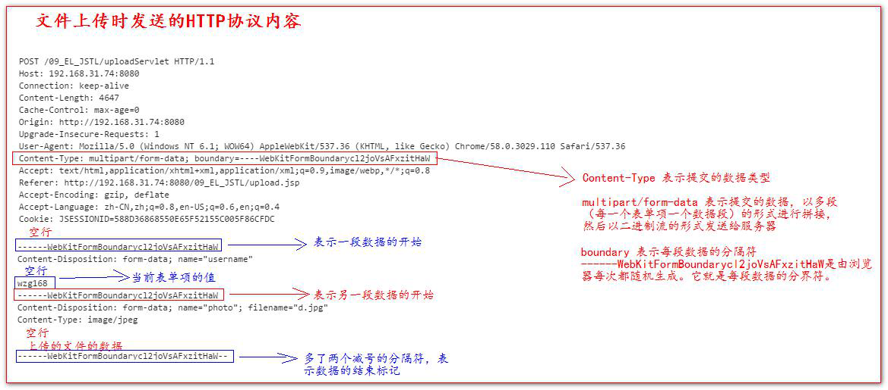

# 第12章-文件上传下载

## 12.1 文件的上传介绍

- 1、要有一个form 标签，method=post 请求

- 2、form 标签的encType 属性值必须为multipart/form-data 值

  - encType=multipart/form-data 表示提交的数据，以多段（每一个表单项一个数据段）的形式进行拼接，然后以二进制流的形式发送给服务器

- 3、在form 标签中使用input type=file 添加上传的文件

- 4、编写服务器代码（Servlet 程序）接收，处理上传的数据。

  



## 12.2 commons-fileupload.jar工具包

* commons-fileupload.jar 需要依赖commons-io.jar 这个包，所以两个包我们都要引入。
  * commons-fileupload-1.2.1.jar
  * commons-io-1.4.jar

### 12.2.1 ServletFileUpload 常用方法

* boolean ServletFileUpload.isMultipartContent(HttpServletRequest request);判断当前上传的数据格式是否是多段的格式。
* public List<FileItem> parseRequest(HttpServletRequest request)解析上传的数据
* boolean FileItem.isFormField()判断当前这个表单项，是否是普通的表单项。还是上传的文件类型。
  * true 表示普通类型的表单项
  * false 表示上传的文件类型
* String FileItem.getFieldName()获取表单项的name 属性值

* String FileItem.getString() 获取当前表单项的值。
* String FileItem.getName();获取上传的文件名。
* void FileItem.write( file );将上传的文件写到参数file 所指向抽硬盘位置。

### 12.2.2 fileupload 类库的使用

UploadServletTest

```java
package com.example.java_web;

import org.apache.commons.fileupload.FileItem;
import org.apache.commons.fileupload.FileItemFactory;
import org.apache.commons.fileupload.disk.DiskFileItemFactory;
import org.apache.commons.fileupload.servlet.ServletFileUpload;

import javax.servlet.ServletException;
import javax.servlet.http.HttpServlet;
import javax.servlet.http.HttpServletRequest;
import javax.servlet.http.HttpServletResponse;
import java.io.File;
import java.io.IOException;
import java.util.List;

public class UploadServletTest extends HttpServlet {
    @Override
    protected void doPost(HttpServletRequest req, HttpServletResponse resp) throws ServletException,
            IOException {
        //1 先判断上传的数据是否多段数据（只有是多段的数据，才是文件上传的）
        if (ServletFileUpload.isMultipartContent(req)) {
// 创建FileItemFactory 工厂实现类
            FileItemFactory fileItemFactory = new DiskFileItemFactory();
// 创建用于解析上传数据的工具类ServletFileUpload 类
            ServletFileUpload servletFileUpload = new ServletFileUpload(fileItemFactory);
            try {
// 解析上传的数据，得到每一个表单项FileItem
                List<FileItem> list = servletFileUpload.parseRequest(req);
// 循环判断，每一个表单项，是普通类型，还是上传的文件
                for (FileItem fileItem : list) {
                    if (fileItem.isFormField()) {
// 普通表单项
                        System.out.println("表单项的name 属性值：" + fileItem.getFieldName());
// 参数UTF-8.解决乱码问题
                        System.out.println("表单项的value 属性值：" + fileItem.getString("UTF-8"));
                    } else {
// 上传的文件
                        System.out.println("表单项的name 属性值：" + fileItem.getFieldName());
                        System.out.println("上传的文件名：" + fileItem.getName());
                        fileItem.write(new File(fileItem.getName()));
                    }
                }
            } catch (Exception e) {
                e.printStackTrace();
            }
        }
    }
}

```

web.xml

```xml
    <servlet>
        <servlet-name>UploadServletTest</servlet-name>
        <servlet-class>com.example.java_web.UploadServletTest</servlet-class>
    </servlet>
    <servlet-mapping>
        <servlet-name>UploadServletTest</servlet-name>
        <url-pattern>/uploadServlet</url-pattern>
    </servlet-mapping>
```

JSP

```jsp
<%@ page contentType="text/html;charset=UTF-8" language="java" %>
<html>
<head>
    <title>文件上传</title>
</head>
<body>
    <form action="/java_web/uploadServlet" method="post"
          enctype="multipart/form-data">
        用户名：<input type="text" name="username" /> <br>
        头像：<input type="file" name="photo" > <br>
        <input type="submit" value="上传">
    </form>
</body>
</html>
```

## 12.3 文件下载

* 下载的常用API 说明：
  * response.getOutputStream();//获取输出流
  * servletContext.getResourceAsStream();//获取当前位置相对路径（IDEA获取的是工程的路径，比如java_web工程，获取的路径就是java_web路径，不是在src下）
  * servletContext.getMimeType();//获取文件类型，传入文件名可以获取到对应的类型。
  * response.setContentType();//设置类型
  * response.setHeader("Content-Disposition", "attachment; fileName=1.jpg");//设置文件变成浏览器下载

请求地址：http://localhost:8080/java_web/downloadServlet

DownloadServlet

```java
package com.example.java_web;

import org.apache.commons.io.IOUtils;

import javax.servlet.http.HttpServlet;
import javax.servlet.http.HttpServletRequest;
import javax.servlet.http.HttpServletResponse;
import java.io.IOException;
import java.io.InputStream;
import java.net.URLEncoder;

public class DownloadServlet  extends HttpServlet {

    @Override
    protected void doGet(HttpServletRequest req, HttpServletResponse resp) throws IOException {
        //获取的路径是src
        InputStream resourceAsStream = getServletContext().getResourceAsStream("1.jpg");
        resp.setContentType(getServletContext().getMimeType("1.jpg"));

        // 把中文名进行UTF-8 编码操作。
        String str = "attachment; fileName=" + URLEncoder.encode("中文.jpg", "UTF-8");
// 然后把编码后的字符串设置到响应头中
        resp.setHeader("Content-Disposition", str);
        IOUtils.copy(resourceAsStream,resp.getOutputStream());
    }

}
```

web.xml

```xml
<servlet>
    <servlet-name>DownloadServlet</servlet-name>
    <servlet-class>com.example.java_web.DownloadServlet</servlet-class>
</servlet>
<servlet-mapping>
    <servlet-name>DownloadServlet</servlet-name>
    <url-pattern>/downloadServlet</url-pattern>
</servlet-mapping>
```

* 附件中文名乱码问题解决方案
  * 如果客户端浏览器是IE 浏览器或者是谷歌浏览器。我们需要使用URLEncoder 类先对中文名进行UTF-8 的编码操作。
  * 因为IE 浏览器和谷歌浏览器收到含有编码后的字符串后会以UTF-8 字符集进行解码显示。
* 如果客户端浏览器是火狐浏览器。那么我们需要对中文名进行BASE64 的编码操作。

```java
String ua = request.getHeader("User-Agent");
// 判断是否是火狐浏览器
if (ua.contains("Firefox")) {
// 使用下面的格式进行BASE64 编码后
String str = "attachment; fileName=" + "=?utf-8?B?"
+ new BASE64Encoder().encode("中文.jpg".getBytes("utf-8")) + "?=";
// 设置到响应头中
response.setHeader("Content-Disposition", str);
} else {
// 把中文名进行UTF-8 编码操作。
String str = "attachment; fileName=" + URLEncoder.encode("中文.jpg", "UTF-8");
// 然后把编码后的字符串设置到响应头中
response.setHeader("Content-Disposition", str);
}
```

