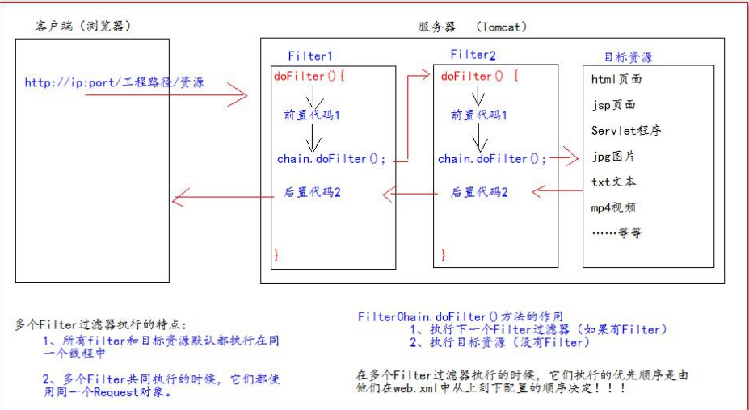

# 第15章-Filter过滤器

## 15.1 什么是过滤器

1、Filter 过滤器它是 JavaWeb 的三大组件之一。三大组件分别是：Servlet 程序、Listener 监听器、Filter 过滤器 

2、Filter 过滤器它是 JavaEE 的规范。也就是接口 

3、Filter 过滤器它的作用是：拦截请求，过滤响应。

* 拦截请求常见的应用场景有： 
  * 1、权限检查 
  * 2、日记操作 
  * 3、事务管理 ……等等

## 15.2 Filter创建

* 通过实现javax.servlet.Filter的init、doFilter、destroy创建一个Filter
* web.xml中配置filtermapping filter

```java
package com.example.java_web;

import javax.servlet.*;
import java.io.IOException;

public class FilterTest implements Filter {
    @Override
    public void init(FilterConfig filterConfig) throws ServletException {
        //Filter.super.init(filterConfig);不能写这个方法，写了启动不了
    }

    @Override
    public void doFilter(ServletRequest servletRequest, ServletResponse servletResponse, FilterChain filterChain) throws IOException, ServletException {
        System.out.println("进入filter了");
        filterChain.doFilter(servletRequest,servletResponse);
        System.out.println("filter执行结束");
    }

    @Override
    public void destroy() {
        //Filter.super.destroy();不能写这个方法，写了启动不了
    }
}
```

web.xml

```xml
    <filter>
        <filter-name>TestFilter</filter-name>
        <filter-class>com.example.java_web.FilterTest</filter-class>
    </filter>
    <filter-mapping>
        <filter-name>TestFilter</filter-name>
        <url-pattern>/</url-pattern>
    </filter-mapping>
```

## 15.3 Filter的生命周

* Filter 的生命周期包含几个方法 
* 1、构造器方法 
* 2、init 初始化方法
  * 第 1，2 步，在 web 工程启动的时候执行（Filter 已经创建） 
* 3、doFilter 过滤方法
  * 第 3 步，每次拦截到请求，就会执行 
* 4、destroy 销毁
  * 第 4 步，停止 web 工程的时候，就会执行（停止 web 工程，也会销毁 Filter 过滤器）

## 15.4 FilterConfig类

* FilterConfig 类见名知义，它是 Filter 过滤器的配置文件类。 
* Tomcat 每次创建 Filter 的时候，也会同时创建一个 FilterConfig 类，这里包含了 Filter 配置文件的配置信息。 
* FilterConfig 类的作用是获取 filter 过滤器的配置内容 
  * 1、获取 Filter 的名称 filter-name 的内容 
  * 2、获取在 Filter 中配置的 init-param 初始化参数 
  * 3、获取 ServletContext 对象

java代码

```java
@Override
public void init(FilterConfig filterConfig) throws ServletException {
    System.out.println("2.Filter 的 init(FilterConfig filterConfig)初始化");
    // 1、获取 Filter 的名称 filter-name 的内容
    System.out.println("filter-name 的值是：" + filterConfig.getFilterName());
    // 2、获取在 web.xml 中配置的 init-param 初始化参数
    System.out.println("初始化参数 username 的值是：" + filterConfig.getInitParameter("username"));
    System.out.println("初始化参数 url 的值是：" + filterConfig.getInitParameter("url"));
    // 3、获取 ServletContext 对象
    System.out.println(filterConfig.getServletContext());
}
```

web.xml 配置：

```xml
<!--filter 标签用于配置一个 Filter 过滤器-->
<filter>
<!--给 filter 起一个别名-->
<filter-name>AdminFilter</filter-name>
<!--配置 filter 的全类名-->
<filter-class>com.atguigu.filter.AdminFilter</filter-class>
<init-param>
<param-name>username</param-name>
<param-value>root</param-value>
</init-param>
<init-param>
<param-name>url</param-name>
<param-value>jdbc:mysql://localhost3306/test</param-value>
</init-param>
</filter>
```

## 15.5 FilterChain 过滤器链

- Filter 过滤器
- Chain 链，链条 
- FilterChain 就是过滤器链（多个过滤器如何一起工作)
- filterChain.doFilter(servletRequest,servletResponse);往下一个filter执行，如果没有filter就找对于的资源进行请求，
- filter顺序按照web.xml的filter顺序进行匹配执行。
- 如果是注解配置，按照Filter的类目进行排序匹配。
```java
//Filter注解方式配置，直接在类上添加WebFilter注解，WebFilter注解还可以添加初始化参数（WebInitParam类型的注解）
@WebFilter(value = {"*.do"},initParams = {@WebInitParam(name="key",value = "value"),@WebInitParam(name="key2",value = "value2")})
public class Filter01 implements Filter {

```


FilterTest.java

```java
    @Override
    public void doFilter(ServletRequest servletRequest, ServletResponse servletResponse, FilterChain filterChain) throws IOException, ServletException {
        System.out.println("进入filter1了");
        filterChain.doFilter(servletRequest,servletResponse);
        System.out.println("filter1执行结束");
    }
```

Filter2Test.java

```java
    @Override
    public void doFilter(ServletRequest servletRequest, ServletResponse servletResponse, FilterChain filterChain) throws IOException, ServletException {
        System.out.println("进入filter2了");
        filterChain.doFilter(servletRequest,servletResponse);
        System.out.println("filter2执行结束");
    }
```

web.xml

```xml
<filter>
        <filter-name>TestFilter</filter-name>
        <filter-class>com.example.java_web.FilterTest</filter-class>
    </filter>
    <filter-mapping>
        <filter-name>TestFilter</filter-name>
        <url-pattern>/*</url-pattern>
    </filter-mapping>
    <filter>
        <filter-name>Test2Filter</filter-name>
        <filter-class>com.example.java_web.Filter2Test</filter-class>
    </filter>
    <filter-mapping>
        <filter-name>Test2Filter</filter-name>
        <url-pattern>/*</url-pattern>
    </filter-mapping>
```

访问http://localhost:8080/java_web/

结果：

```
进入filter1了
进入filter2了
filter2执行结束
filter1执行结束
```


## 15.6 Filter的拦截路径

* 精确匹配

```
<url-pattern>/target.jsp</url-pattern>
以上配置的路径，表示请求地址必须为：http://ip:port/工程路径/target.js
```

* 目录匹配

```
<url-pattern>/admin/*</url-pattern>
以上配置的路径，表示请求地址必须为：http://ip:port/工程路径/admin/*
```

* 后缀名匹配

```
<url-pattern>*.html</url-pattern>
以上配置的路径，表示请求地址必须以.html 结尾才会拦截到
<url-pattern>*.do</url-pattern>
以上配置的路径，表示请求地址必须以.do 结尾才会拦截到
<url-pattern>*.action</url-pattern>
以上配置的路径，表示请求地址必须以.action 结尾才会拦截到
```

* Filter 过滤器它只关心请求的地址是否匹配，不关心请求的资源是否存在
* 三种拦截路径不能混用。如果只配置/，任何Filter都进不去

```xml
 	<filter-mapping>
        <filter-name>Test2Filter</filter-name>
        <url-pattern>/test/</url-pattern>
    </filter-mapping>
    只能通过http://localhost:8080/java_web/test/进入，多了或少了/都不行
   
   
    <filter-mapping>
        <filter-name>Test2Filter</filter-name>
        <url-pattern>/</url-pattern>
    </filter-mapping>
    这个不能进入
```


## 15.7 错误页面处理

* tomcat抛出异常时才会跳转得到错误页面

web.xml文件中配置

```xml
<!--error-page 标签配置，服务器出错之后，自动跳转的页面-->
<error-page>
<!--error-code 是错误类型-->
<error-code>500</error-code>
<!--location 标签表示。要跳转去的页面路径-->
<location>/pages/error/error500.jsp</location>
</error-page>
<!--error-page 标签配置，服务器出错之后，自动跳转的页面-->
<error-page>
<!--error-code 是错误类型-->
<error-code>404</error-code>
<!--location 标签表示。要跳转去的页面路径-->
<location>/pages/error/error404.jsp</location>
</error-page>
```

## 15.8 拦截器+ThreadLocal应用

* 可以使用拦截器+ThreadLocal控制事务处理。将开启和关闭、回滚事务放在拦截器中处理。