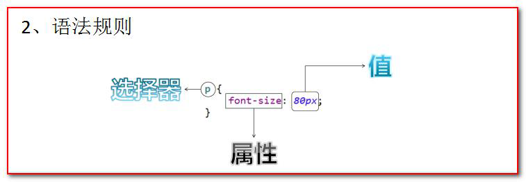

# 第2章-CSS

技术文档:CSS2.0.chm

## 2.1 CSS 技术介绍

* CSS 是「层叠样式表单」。是用于(增强)控制网页样式并允许将样式信息与网页内容分离的一种标记性语言。

## 2.2 CSS 语法规则



* 选择器：浏览器根据“选择器”决定受CSS 样式影响的HTML 元素（标签）。
* 属性(property) ：是你要改变的样式名，并且每个属性都有一个值。属性和值被冒号分开，并由花括号包围，这样就组成了一个完整的样式声明（declaration），例如：p {color: blue}
* 多个声明：如果要定义不止一个声明，则需要用分号将每个声明分开。虽然最后一条声明的最后可以不加分号(但尽量在每条声明的末尾都加上分号)
* 例如

```
p{
color:red;
font-size:30px;
}
```

* CSS 注释：

  ```
  /*注释内容*/
  ```

* 一般每行只描述一个属性

## 2.3 CSS 和HTML 的结合方式

### 2.3.1 方式一：在标签的style 属性上设置

* 通过 ”key:value value;”，修改标签样式。

```html
<!DOCTYPE html>
<html lang="en">
<head>
<meta charset="UTF-8">
<title>Title</title>
</head>
<body>
<!--需求1：分别定义两个div、span 标签，分别修改每个div 标签的样式为：边框1 个像素，实线，红色。-->
<div style="border: 1px solid red;">div 标签1</div>
<div style="border: 1px solid red;">div 标签2</div>
<span style="border: 1px solid red;">span 标签1</span>
<span style="border: 1px solid red;">span 标签2</span>
</body>
</html>
```

### 2.3.2 方式二：在head 标签中，使用style 标签来定义各种自己需要的css 样式。

* head中加入style标签，标签内写样式

  ```
  <style type="text/css"></style>
  ```

* 格式

```
xxx {
Key : value value;
}
```

* 举例

```html
<!DOCTYPE html>
<html lang="en">
<head>
<meta charset="UTF-8">
<title>Title</title>
<!--style 标签专门用来定义css 样式代码-->
<style type="text/css">
/* 需求1：分别定义两个div、span 标签，分别修改每个div 标签的样式为：边框1 个像素，实线，红色。*/
div{
border: 1px solid red;
}
span{
border: 1px solid red;
}
</style>
</head>
<body>
<div>div 标签1</div>
<div>div 标签2</div>
<span>span 标签1</span>
<span>span 标签2</span>
</body>
</html>
```

### 2.3.3 方式三：引入css文件

* 把css 样式写成一个单独的css 文件，再通过link 标签引入即可复用。
* 使用html 的`<link rel="stylesheet" type="text/css" href="./styles.css" />` 标签导入css 样式文件。

* css 文件内容：

```css
div{
border: 1px solid yellow;
}
span{
border: 1px solid red;
}
```

* html 文件代码

```html
<!DOCTYPE html>
<html lang="en">
<head>
<meta charset="UTF-8">
<title>Title</title>
<!--link 标签专门用来引入css 样式代码-->
<link rel="stylesheet" type="text/css" href="1.css"/>
</head>
<body>
<div>div 标签1</div>
<div>div 标签2</div>
<span>span 标签1</span>
<span>span 标签2</span>
</body>
</html>
```

## 2.4 CSS 选择器

### 2.4.1 标签名选择器

* 标签名选择器，可以决定哪些标签被动的使用这个样式。
* 标签名选择器的格式

```
标签名{
属性：值;
}
```

```html
<!DOCTYPE html>
<html>
<head>
<meta charset="UTF-8">
<title>CSS 选择器</title>
<style type="text/css">
div{
border: 1px solid yellow;
color: blue;
font-size: 30px;
}
span{
border: 5px dashed blue;
color: yellow;
font-size: 20px;
}
</style>
</head>
<body>
<!--
需求1：在所有div 标签上修改字体颜色为蓝色，字体大小30 个像素。边框为1 像素黄色实线。
并且修改所有span 标签的字体颜色为黄色，字体大小20 个像素。边框为5 像素蓝色虚线。
-->
<div>div 标签1</div>
<div>div 标签2</div>
<span>span 标签1</span>
<span>span 标签2</span>
</body>
</html>
```

### 2.4.2 id 选择器

* id 选择器，可以让我们通过id 属性选择性的去使用这个样式。
* 标签可以只有一个id值
* 格式

```
#id 属性值{
属性：值;
}
```

```html
<!DOCTYPE html>
<html>
<head>
<meta charset="UTF-8">
<title>ID 选择器</title>
<style type="text/css">
#id001{
color: blue;
font-size: 30px;
border: 1px yellow solid;
}
#id002{
color: red;
font-size: 20px;
border: 5px blue dotted ;
}
</style>
</head>
<body>
<!--
需求1：分别定义两个div 标签，
第一个div 标签定义id 为id001 ，然后根据id 属性定义css 样式修改字体颜色为蓝色，
字体大小30 个像素。边框为1 像素黄色实线。
第二个div 标签定义id 为id002 ，然后根据id 属性定义css 样式修改的字体颜色为红色，字体大小20 个像素。
边框为5 像素蓝色点线。
-->
<div id="id002">div 标签1</div>
<div id="id001">div 标签2</div>
</body>
</html>
```

### 2.4.3 class 选择器（类选择器）

* class 类型选择器，可以通过class 属性有效的选择性地去使用这个样式。
* 标签可以有多个class值，用空格隔开

* 格式

```
.class 属性值{
属性：值;
}
```

```html
<!DOCTYPE html>
<html>
<head>
<meta charset="UTF-8">
<title>class 类型选择器</title>
<style type="text/css">
.class01{
color: blue;
font-size: 30px;
border: 1px solid yellow;
}
.class02{
color: grey;
font-size: 26px;
border: 1px solid red;
}
</style>
</head>
<body>
<!--
需求1：修改class 属性值为class01 的span 或div 标签，字体颜色为蓝色，字体大小30 个像素。边框为1 像素黄色实线。
需求2：修改class 属性值为class02 的div 标签，字体颜色为灰色，字体大小26 个像素。边框为1 像素红色实线。
-->
<div class="class02">div 标签class01</div>
<div class="class02">div 标签</div>
<span class="class02">span 标签class01</span>
<span>span 标签2</span>
</body>
</html>
9.4.4、组合选择器
组合
```

### 2.4.4 组合选择器

* 组合选择器可以让多个选择器共用同一个css 样式代码。
* 使用逗号隔开

* 格式

```
选择器1，选择器2，选择器n{
属性：值;
}
```

```html
<!DOCTYPE html>
<html>
<head>
<meta charset="UTF-8">
<title>class 类型选择器</title>
<style type="text/css">
.class01 , #id01{
    color: blue;
    font-size: 20px;
    border: 1px yellow solid;
}
</style>
</head>
<body>
<!--
需求1：修改class="class01" 的div 标签和id="id01" 所有的span 标签，
字体颜色为蓝色，字体大小20 个像素。边框为1 像素黄色实线。
-->
<div id="id01">div 标签class01</div> <br />
<span >span 标签</span> <br />
<div>div 标签</div> <br />
<div>div 标签id01</div> <br />
</body>
</html>
```

## 2.5 常用样式

* 字体颜色：color：red；
  * 颜色可以写颜色名如：black, blue, red, green 等
  * 颜色也可以写rgb 值和十六进制表示值：如rgb(255,0,0)，#00F6DE，如果写十六进制值必须加#
* 宽度width:19px;
  * 宽度可以写像素值：19px；
  * 也可以写百分比值：20%；
* 高度height:20px;
  * 高度可以写像素值：19px；
  * 也可以写百分比值：20%；
* 背景颜色
  * background-color:#0F2D4C
* 字体样式：
  * color：#FF0000；字体颜色红色
  * font-size：20px; 字体大小
* 红色1 像素实线边框
  * border：1px solid red;
* DIV 居中
  * margin-left: auto;
  * margin-right: auto;
* 文本居中：
  * text-align: center;
* 超连接去下划线
  * text-decoration: none;
* 表格细线
* table {
  border: 1px solid black; /*设置边框*/
  border-collapse: collapse; /*将边框合并*/
  }
  td,th {
  border: 1px solid black; /*设置边框*/
  }
* 列表去除修饰
  * ul {
    list-style: none;
    }

