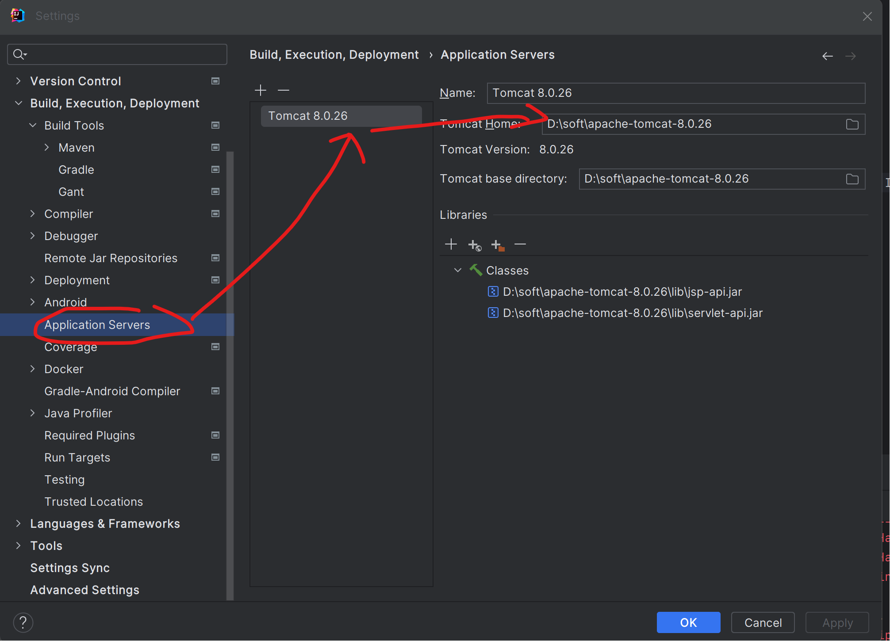
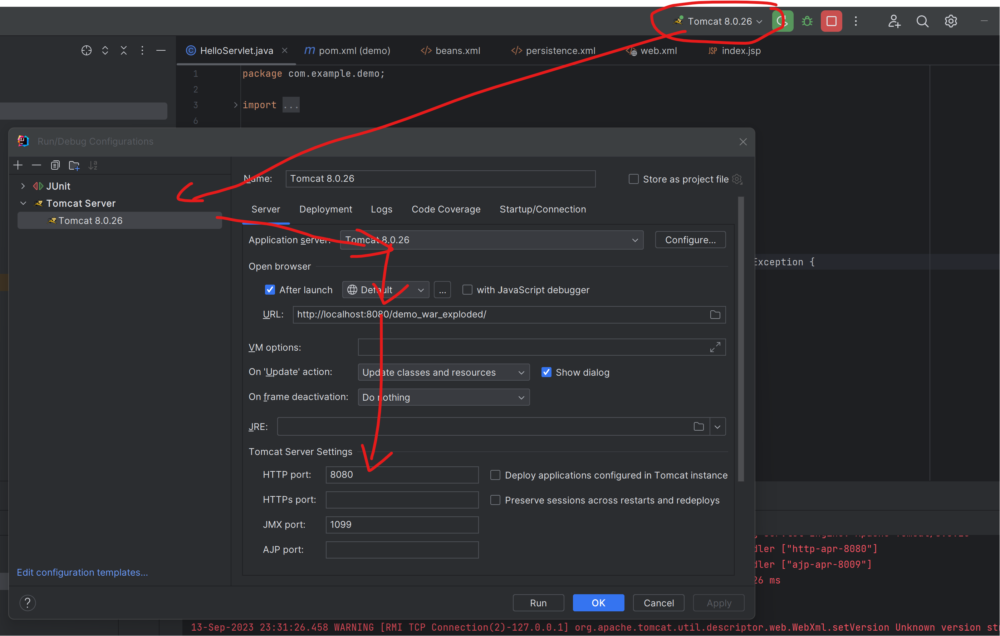

# 第6章-Tomcat

## 6.1 JavaWeb 的概念

* JavaWeb 是指，所有通过 Java 语言编写可以通过浏览器访问的程序的总称，叫 JavaWeb。JavaWeb 是基于请求和响应来开发的。 
* 请求是指客户端给服务器发送数据，叫请求 Request。
* 响应是指服务器给客户端回传数据，叫响应Response
* 请求和响应是成对出现的，有请求就有响应

## 6.2 Web 资源的分类

* web 资源按实现的技术和呈现的效果的不同，又分为静态资源和动态资源两种。
  * 静态资源： html、css、js、txt、mp4 视频 , jpg 图片
  * 动态资源： jsp 页面、Servlet 程序

## 6.3 常用的 Web 服务器

* Tomcat：由 Apache 组织提供的一种 Web 服务器，提供对 jsp 和 Servlet 的支持。它是一种轻量级的 javaWeb 容器（服务器），也是当前应用最广的 JavaWeb 服务器（免费）。

* Jboss：是一个遵从 JavaEE 规范的、开放源代码的、纯 Java 的 EJB 服务器，它支持所有的 JavaEE 规范（免费）。
* GlassFish： 由 Oracle 公司开发的一款 JavaWeb 服务器，是一款强健的商业服务器，达到产品级质量（应用很少）。
* Resin：是 CAUCHO 公司的产品，是一个非常流行的服务器，对 servlet 和 JSP 提供了良好的支持，性能也比较优良，resin 自身采用 JAVA 语言开发（收费，应用比较多）。
* WebLogic：是 Oracle 公司的产品，是目前应用最广泛的 Web 服务器，支持 JavaEE 规范，而且不断的完善以适应新的开发要求，适合大型项目（收费，用的不多，适合大公司）。

## 6.4 Tomcat 服务器和 Servlet 版本的对应关系

* Servlet 程序从 2.5 版本是现在世面使用最多的版本（xml 配置）到了 Servlet3.0 之后。就是注解版本的 Servlet 使用。

| Tomcat版本 | Servlet/JSP版本 | JavaEE版本 | 运行环境 |
| ---------- | --------------- | ---------- | -------- |
| 4.1        | 2.3/1.2         | 1.3        | JDK1.3   |
| 5.0        | 2.4/2.0         | 1.4        | JDK1.4   |
| 5.5/6.0    | 2.5/2.1         | 5.0        | JDK5.0   |
| 7.0        | 3.0/2.2         | 6.0        | JDK6.0   |
| 8.0        | 3.1/2.3         | 7.0        | JDK7.0   |

## 6.5 Tomcat 的使用

### 6.5.1安装

找到你需要用的 Tomcat 版本对应的 zip 压缩包，解压到需要安装的目录即可。

### 6.5.2目录介绍

bin 专门用来存放 Tomcat 服务器的可执行程序

conf 专门用来存放 Tocmat 服务器的配置文件

lib 专门用来存放 Tomcat 服务器的 jar 包

logs 专门用来存放 Tomcat 服务器运行时输出的日记信息

temp 专门用来存放 Tomcdat 运行时产生的临时数据

webapps 专门用来存放部署的 Web 工程。

work 是 Tomcat 工作时的目录，用来存放 Tomcat 运行时 jsp 翻译为 Servlet 的源码，和 Session 钝化(持久化)的目录。

### 6.5.3 启动 Tomcat 服务器

**方式一：**

* 找到 Tomcat 目录下的 bin 目录下的 startup.bat 文件，双击，就可以启动 Tomcat 服务器。

* 打开浏览器，在浏览器地址栏中输入以下地址测试，有一个能访问表示启动成功：

  1、http://localhost:8080

  2、http://127.0.0.1:8080

  3、http://真实 ip:8080

* 常见的启动失败的情况有，双击 startup.bat 文件，就会出现一个小黑窗口一闪而来。失败的原因基本上都是因为没有配置好 JAVA_HOME 环境变量
  * 常见的 JAVA_HOME 配置错误有以下几种情况：
    * JAVA_HOME 必须全大写。
    * JAVA_HOME 中间必须是下划线，不是减号- 
    * JAVA_HOME 配置的路径只需要配置到 jdk 的安装目录即可。不需要带上 bin 目录。

**方式二：**

* cd 到 你的 Tomcat 的 bin 目录下，输入catalina run命令

### 6.5.4 Tomcat 的停止

* 点击 tomcat 服务器窗口的 x 关闭按钮
* 把 Tomcat 服务器窗口置为当前窗口，然后按快捷键 Ctrl+C
* 找到 Tomcat 的 bin 目录下的 shutdown.bat 双击，就可以停止 Tomcat 服务器

### 6.5.5 修改 Tomcat 的端口号

* Mysql 默认的端口号是：3306

* Tomcat 默认的端口号是：8080

* 找到 Tomcat 目录下的 conf 目录，找到 server.xml 配置文件下面配置protocol是http的Connector修改端口号

```xml
<Connector port="8080" protocol="HTTP/1.1"
               connectionTimeout="20000"
               redirectPort="8443" />
```

### 6.5.6 部暑 web 工程到 Tomcat 中

**方式一：**

* 只需要把 web 工程的目录拷贝到 Tomcat 的 webapps 目录下即可。

* 访问 Tomcat 下的 web 工程
  * 只需要在浏览器中输入访问地址格式如下：http://ip:port/工程名/目录下/文件名

方式二：

* 找到 Tomcat 下的 conf 目录\Catalina\localhost\ 下,创建的xml配置文件,内容如下：

```
<!-- Context 表示一个工程上下文
path 表示工程的访问路径:/abc
docBase 表示你的工程目录在哪里
-->
<Context path="/abc" docBase="E:\book" />
```

* 访问这个工程的路径如下:http://ip:port/abc/就表示访问 E:\book 目录

### 6.5.7 直接从磁盘（手拖，手动）打开 html 页面到浏览器和在浏览器中输入 http://ip:端口号/工程名/访问的区别

* 直接从磁盘（手拖，手动） 打开html 页面是file://协议，直接读取本地磁盘
* 浏览器中输入http://ip:端口号/工程名/访问是通过http协议，访问对于服务器获取的。

### 6.5.8 ROOT 的工程的访问，以及 默认 index.html 页面的访问

* 当我们在浏览器地址栏中输入访问地址如下：http://ip:port/ ====>>>> 没有工程名的时候，默认访问的是 ROOT 工程
* 当我们在浏览器地址栏中输入的访问地址如下：http://ip:port/工程名/ ====>>>> 没有资源名，默认访问 index.html 页面

6.6 IDEA配置TOMCAT和web

* 网上搜索一下



