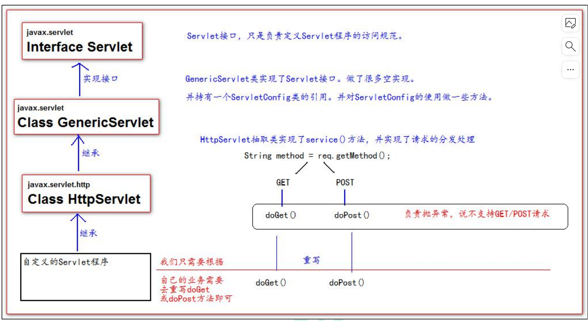

# 第7章-Servlet

## 7.1 Servlet 技术

### 7.7.1 什么是 Servlet

- Servlet 是 JavaEE 规范之一。规范就是接口
- Servlet 就 JavaWeb 三大组件之一。三大组件分别是：Servlet 程序、Filter 过滤器、Listener 监听器。
- Servlet 是运行在服务器上的一个 java 小程序，它可以接收客户端发送过来的请求，并响应数据给客户端

### 7.7.2 手动实现 Servlet 程序（实现Servlet 方式一）

- 编写一个类去实现 Servlet 接口
- 实现 service 方法，处理请求，并响应数据
- 到 web.xml 中去配置 servlet 程序的访问地址

```java
package com.example.demo;

import javax.servlet.*;
import java.io.IOException;

public class HelloServlet2 implements Servlet {
    @Override
    public void init(ServletConfig servletConfig) throws ServletException {

    }

    @Override
    public ServletConfig getServletConfig() {
        return null;
    }

    /**
     * service 方法是专门用来处理请求和响应的
     * @param servletRequest
     * @param servletResponse
     * @throws ServletException
     * @throws IOException
     */
    @Override
    public void service(ServletRequest servletRequest, ServletResponse servletResponse) throws
            ServletException, IOException {
        System.out.println("Hello Servlet 被访问了");
    }

    @Override
    public String getServletInfo() {
        return null;
    }

    @Override
    public void destroy() {

    }
}
```

web.xml配置

```xml
<?xml version="1.0" encoding="UTF-8"?>
<web-app xmlns="https://jakarta.ee/xml/ns/jakartaee"
         xmlns:xsi="http://www.w3.org/2001/XMLSchema-instance"
         xsi:schemaLocation="https://jakarta.ee/xml/ns/jakartaee https://jakarta.ee/xml/ns/jakartaee/web-app_5_0.xsd"
         version="5.0">
    <!-- servlet 标签给 Tomcat 配置 Servlet 程序 -->
    <servlet>
        <!--servlet-name 标签 Servlet 程序起一个别名（一般是类名） -->
        <servlet-name>HelloServlet2</servlet-name>
        <!--servlet-class 是 Servlet 程序的全类名-->
        <servlet-class>com.example.demo.HelloServlet2</servlet-class>
    </servlet>
    <!--servlet-mapping 标签给 servlet 程序配置访问地址-->
    <servlet-mapping>
        <!--servlet-name 标签的作用是告诉服务器，我当前配置的地址给哪个 Servlet 程序使用-->
        <servlet-name>HelloServlet2</servlet-name>
        <!--url-pattern 标签配置访问地址 <br/>
        / 斜杠在服务器解析的时候，表示地址为：http://ip:port/工程路径 <br/>
        /hello 表示地址为：http://ip:port/工程路径/hello <br/>
        -->
        <url-pattern>/hello2</url-pattern>
    </servlet-mapping>

</web-app>
```

* 常见的错误 1：url-pattern 中配置的路径没有以斜杠打头
* 常见错误 2：servlet-name 配置的值不存在
* 常见错误 3：servlet-class 标签的全类名配置错误：

### 7.7.3 Servlet 的生命周期

- 1、执行 Servlet 构造器方法
- 2、执行 init 初始化方法
  - 第1、2步，是在第一次访问的时候创建 Servlet 程序会调用，也就是创建Servlet 实例时调用。
- 3、执行 service 方法
  * ​	第三步，每次访问都会调用。
- 4、执行 destroy 销毁方法
  * 第四步，在 web 工程停止的时候调用。

每个Servlet在Tomcat容器中只有一个实例，它是线程不安全的

* Servlet的启动时机：web.xml中配置<load-on-startup>，值越小表示启动时越快创建servlet（不用等待请求时才创建）。
* Servlet3.0开始支持注解: @WebServlet

### 7.7.4 GET 和 POST 请求的分发处理

* 将ServletRequest转化为HttpServletRequest
* 通过HttpServletRequest.getMethod();获取到请求的方法进行处理。

```java
package com.example.demo;

import javax.servlet.*;
import javax.servlet.http.HttpServletRequest;
import java.io.IOException;

public class HelloServlet2 implements Servlet {
    @Override
    public void init(ServletConfig servletConfig) throws ServletException {

    }

    @Override
    public ServletConfig getServletConfig() {
        return null;
    }

    /**
     * service 方法是专门用来处理请求和响应的
     * @param servletRequest
     * @param servletResponse
     * @throws ServletException
     * @throws IOException
     */
    @Override
    public void service(ServletRequest servletRequest, ServletResponse servletResponse) throws
            ServletException, IOException {
        System.out.println("3 service === Hello Servlet 被访问了");
// 类型转换（因为它有 getMethod()方法）
        HttpServletRequest httpServletRequest = (HttpServletRequest) servletRequest;
// 获取请求的方式
        String method = httpServletRequest.getMethod();
        if ("GET".equals(method)) {
            doGet();
        } else if ("POST".equals(method)) {
            doPost();
        }
    }
    /**
     * 做 get 请求的操作
     */
    public void doGet(){
        System.out.println("get 请求");
        System.out.println("get 请求");
    }
    /**
     * 做 post 请求的操作
     */
    public void doPost(){
        System.out.println("post 请求");
        System.out.println("post 请求");
    }

    @Override
    public String getServletInfo() {
        return null;
    }

    @Override
    public void destroy() {

    }
}
```

### 7.7.3 通过继承 HttpServlet 实现 Servlet 程序（实现Servlet 方式二）

一般在实际项目开发中，都是使用继承 HttpServlet 类的方式去实现 Servlet 程序。

- 编写一个类去继承 HttpServlet 类
- 根据业务需要重写 doGet 或 doPost 方法
- 到 web.xml 中的配置 Servlet 程序的访问地址

```java
package com.example.demo;

import javax.servlet.*;
import javax.servlet.http.HttpServlet;
import javax.servlet.http.HttpServletRequest;
import javax.servlet.http.HttpServletResponse;
import java.io.IOException;

public class HelloServlet3 extends HttpServlet {
    /**
     * doGet（）在 get 请求的时候调用
     * @param req
     * @param resp
     * @throws ServletException
     * @throws IOException
     */
    @Override
    protected void doGet(HttpServletRequest req, HttpServletResponse resp) throws ServletException,
            IOException {
        System.out.println("HelloServlet2 的 doGet 方法");
    }
    /**
     * doPost（）在 post 请求的时候调用
     * @param req
     * @param resp
     * @throws ServletException
     * @throws IOException
     */
    @Override
    protected void doPost(HttpServletRequest req, HttpServletResponse resp) throws ServletException,
            IOException {
        System.out.println("HelloServlet2 的 doPost 方法");
    }
}

```

web.xml添加配置

```xml
    <servlet>
        <servlet-name>HelloServlet3</servlet-name>
        <servlet-class>com.example.demo.HelloServlet3</servlet-class>
    </servlet>
    <servlet-mapping>
        <servlet-name>HelloServlet3</servlet-name>
        <url-pattern>/hello3</url-pattern>
    </servlet-mapping>
```

### 7.7.4 Servlet 类的继承体系



贴上HttpServlet的service()方法部分源码

```java
 protected void service(HttpServletRequest req, HttpServletResponse resp) throws ServletException, IOException {
        String method = req.getMethod();
        long lastModified;
        if (method.equals("GET")) {
            lastModified = this.getLastModified(req);
            if (lastModified == -1L) {
                this.doGet(req, resp);
            } else {
                long ifModifiedSince = req.getDateHeader("If-Modified-Since");
                if (ifModifiedSince < lastModified) {
                    this.maybeSetLastModified(resp, lastModified);
                    this.doGet(req, resp);
                } else {
                    resp.setStatus(304);
                }
            }
        } else if (method.equals("HEAD")) {
            lastModified = this.getLastModified(req);
            this.maybeSetLastModified(resp, lastModified);
            this.doHead(req, resp);
        } else if (method.equals("POST")) {
            this.doPost(req, resp);
        } else if (method.equals("PUT")) {
            this.doPut(req, resp);
        } else if (method.equals("DELETE")) {
            this.doDelete(req, resp);
        } else if (method.equals("OPTIONS")) {
            this.doOptions(req, resp);
        } else if (method.equals("TRACE")) {
            this.doTrace(req, resp);
        } else {
            String errMsg = lStrings.getString("http.method_not_implemented");
            Object[] errArgs = new Object[]{method};
            errMsg = MessageFormat.format(errMsg, errArgs);
            resp.sendError(501, errMsg);
        }

    }
```

## 7.2 ServletConfig 类

- ServletConfig 类从类名上来看，就知道是 Servlet 程序的配置信息类。
- Servlet 程序和 ServletConfig 对象都是由 Tomcat 负责创建，我们负责使用。
- Servlet 程序默认是第一次访问的时候创建，ServletConfig 是每个 Servlet 程序创建时，就创建一个对应的 ServletConfig 对象。

### 7.2.1 ServletConfig 类的三大作用

- 1、可以获取 Servlet 程序的别名 servlet-name 的值
- 2、获取servlet初始化参数 init-param
- 3、获取 ServletContext 对象
- 每个Servlet是独立的，不是整个web唯一，只初始化一次。

* web.xml配置

```xml
<!-- servlet 标签给 Tomcat 配置 Servlet 程序 -->
<servlet>
    <!--servlet-name 标签 Servlet 程序起一个别名（一般是类名） -->
    <servlet-name>HelloServlet</servlet-name>
    <!--servlet-class 是 Servlet 程序的全类名-->
    <servlet-class>com.atguigu.servlet.HelloServlet</servlet-class>
    <!--init-param 是初始化参数-->
    <init-param>
        <!--是参数名-->
        <param-name>username</param-name>
        <!--是参数值-->
        <param-value>root</param-value>
    </init-param>
    <!--init-param 是初始化参数-->
    <init-param>
        <!--是参数名-->
        <param-name>url</param-name>
        <!--是参数值-->
        <param-value>jdbc:mysql://localhost:3306/test</param-value>
    </init-param>
</servlet>
<!--servlet-mapping 标签给 servlet 程序配置访问地址-->
<servlet-mapping>
    <!--servlet-name 标签的作用是告诉服务器，我当前配置的地址给哪个 Servlet 程序使用-->
    <servlet-name>HelloServlet</servlet-name>
    <!--
    url-pattern 标签配置访问地址 
    / 斜杠在服务器解析的时候，表示地址为：http://ip:port/工程路径 
    /hello 表示地址为：http://ip:port/工程路径/hello <br/>
    -->
    <url-pattern>/hello</url-pattern>
</servlet-mapping>
```

* Servlet 中的代码：

```java
@Override
public void init(ServletConfig servletConfig) throws ServletException {
System.out.println("2 init 初始化方法");
// 1、可以获取 Servlet 程序的别名 servlet-name 的值
System.out.println("HelloServlet 程序的别名是:" + servletConfig.getServletName());
// 2、获取初始化参数 init-param
System.out.println("初始化参数 username 的值是;" + servletConfig.getInitParameter("username"));
System.out.println("初始化参数 url 的值是;" + servletConfig.getInitParameter("url"));
// 3、获取 ServletContext 对象
System.out.println(servletConfig.getServletContext());
}
```

```
执行结果
2 init 初始化方法
HelloServlet 程序的别名是:HelloServlet2
初始化参数 username 的值是;root
初始化参数 url 的值是;jdbc:mysql://localhost:3306/test
org.apache.catalina.core.ApplicationContextFacade@2463ed28
```

**继承方式获取ServletConfig注意事项**

* 如果是继承方式重写了init方法，获取ServletConfig时需要调用父类方法初始化，否则ServletConfig为空。
* 可以调用getServletConfig()方法获取到ServletConfig

```
public class HelloServlet3 extends HttpServlet {
    @Override
    public void init(ServletConfig servletConfig) throws ServletException {
    //调用父类方法初始化，否则ServletConfig为空
        super.init(servletConfig);
        System.out.println("2 init 初始化方法");
// 1、可以获取 Servlet 程序的别名 servlet-name 的值
        System.out.println("HelloServlet 程序的别名是:" + servletConfig.getServletName());
// 2、获取初始化参数 init-param
        System.out.println("初始化参数 username 的值是;" + servletConfig.getInitParameter("username"));
        System.out.println("初始化参数 url 的值是;" + servletConfig.getInitParameter("url"));
// 3、获取 ServletContext 对象
        System.out.println(servletConfig.getServletContext());
    }
}
```

## 7.3 .ServletContext 类

### 7.3.1 什么是 ServletContext?

1、ServletContext 是一个接口，它表示 Servlet 上下文对象

2、一个 web 工程，只有一个 ServletContext 对象实例。

3、ServletContext 对象是一个域对象。

4、ServletContext 是在 web 工程部署启动的时候创建。在 web 工程停止的时候销毁。

* 什么是域对象?
  * 域对象，是可以像 Map 一样存取数据的对象，叫域对象。
  * 这里的域指的是存取数据的操作范围，整个 web 工程。

|                | 存数据         | 取数据         | 删除数据           |
| -------------- | -------------- | -------------- | ------------------ |
| Map            | put()          | get()          | remove()           |
| ServletContext | setAttribute() | getAttribute() | removeAttribute(); |

### 7.3.2 ServletContext 类的作用

1、获取 web.xml 中配置的上下文参数 context-param

2、获取当前的工程路径，格式: /工程路径

3、获取工程部署后在服务器硬盘上的绝对路径

4、像 Map 一样存取数据

```java
package com.example.demo;

import javax.servlet.ServletContext;
import javax.servlet.ServletException;
import javax.servlet.http.HttpServlet;
import javax.servlet.http.HttpServletRequest;
import javax.servlet.http.HttpServletResponse;
import java.io.IOException;

public class ServletContextServlet extends HttpServlet {
    protected void doGet(HttpServletRequest request, HttpServletResponse response) throws
            ServletException, IOException {
// 1、获取 web.xml 中配置的上下文参数 context-param
        ServletContext context = getServletConfig().getServletContext();
        String username = context.getInitParameter("username");
        System.out.println("context-param 参数 username 的值是:" + username);
        System.out.println("context-param 参数 password 的值是:" +
                context.getInitParameter("password"));
// 2、获取当前的工程路径，格式: /工程路径
        System.out.println( "当前工程路径:" + context.getContextPath() );
// 3、获取工程部署后在服务器硬盘上的绝对路径
/**
 * / 斜杠被服务器解析地址为:http://ip:port/工程名/ 映射到 IDEA 代码的 web 目录<br/>
 */
        System.out.println("工程部署的路径是:" + context.getRealPath("/"));
        System.out.println("工程下 css 目录的绝对路径是:" + context.getRealPath("/css"));
        System.out.println("工程下 imgs 目录 1.jpg 的绝对路径是:" + context.getRealPath("/imgs/1.jpg"));
        //ServletContext 像 Map 一样存取数据：
        context.setAttribute("key1", "value1");
        System.out.println("Context1 中获取域数据 key1 的值是:"+ context.getAttribute("key1"));
    }
}

```

web.xml配置

```xml
  <servlet>
        <servlet-name>ServletContextServlet</servlet-name>
        <servlet-class>com.example.demo.ServletContextServlet</servlet-class>
    </servlet>
    <servlet-mapping>
        <servlet-name>ServletContextServlet</servlet-name>
        <url-pattern>/servletContextServlet</url-pattern>
    </servlet-mapping>

    <!--context-param 是上下文参数(它属于整个 web 工程)-->
    <context-param>
        <param-name>username</param-name>
        <param-value>context</param-value>
    </context-param>
    <!--context-param 是上下文参数(它属于整个 web 工程)-->
    <context-param>
        <param-name>password</param-name>
        <param-value>root</param-value>
    </context-param>
```

```
context-param 参数 username 的值是:context
context-param 参数 password 的值是:root
当前工程路径:/demo_war_exploded
工程部署的路径是:D:\ideaprojects\learn_code\demo\target\demo-1.0-SNAPSHOT\
工程下 css 目录的绝对路径是:D:\ideaprojects\learn_code\demo\target\demo-1.0-SNAPSHOT\css
工程下 imgs 目录 1.jpg 的绝对路径是:D:\ideaprojects\learn_code\demo\target\demo-1.0-SNAPSHOT\imgs\1.jpg
Context1 中获取域数据 key1 的值是:value1

```

## 7.4 HTTP 协议

### 7.4.1 什么是 HTTP 协议

* 什么是协议?协议是指双方，或多方，相互约定好，大家都需要遵守的规则，叫协议。

* 所谓 HTTP 协议，就是指，客户端和服务器之间通信时，发送的数据，需要遵守的规则，叫 HTTP 协议。

* HTTP 协议中的数据又叫报文

### 7.4.2 请求的 HTTP 协议格式

* 客户端给服务器发送数据叫请求。

* 服务器给客户端回传数据叫响应。

* 请求又分为 GET 请求，和 POST 请求两种

**GET** **请求格式**

1、请求行

​	(1) 请求的方式 GET  (2) 请求的资源路径[+?+请求参数]  (3) 请求的协议的版本号 HTTP/1.1

2、请求头

​	key : value 组成    不同的键值对，表示不同的含义。

**POST** **请求格式**

1、请求行

​	(1) 请求的方式 POST (2) 请求的资源路径[+?+请求参数]  (3) 请求的协议的版本号 HTTP/1.1

2、请求头

​	key : value 不同的请求头，有不同的含义

空行

3、请求体 ===>>> 就是发送给服务器的数据

**常用请求头的说明**

- Accept: 表示客户端可以接收的数据类型
- Accpet-Languege: 表示客户端可以接收的语言类型
- User-Agent: 表示客户端浏览器的信息
- Host： 表示请求时的服务器 ip 和端口号

### 7.4.3 响应的 HTTP 协议格式

1、响应行

​	(1) 响应的协议和版本号  (2) 响应状态码  (3) 响应状态描述符

2、响应头

​	key : value 不同的响应头，有其不同含义

空行

3、响应体 ---->>> 就是回传给客户端的数据

**常用的响应码说明**

200 表示请求成功

302 表示请求重定向（明天讲）

404 表示请求服务器已经收到了，但是你要的数据不存在（请求地址错误）

500 表示服务器已经收到请求，但是服务器内部错误（代码错误）

**MIME** **类型说明**

* MIME 是 HTTP 协议中数据类型。

* MIME 的英文全称是"Multipurpose Internet Mail Extensions" 多功能 Internet 邮件扩充服务。MIME 类型的格式是“大类型/小类型”，并与某一种文件的扩展名相对应

| 文件               | MIME类型                                |
| ------------------ | --------------------------------------- |
| 超文本标记语言文本 | .html,.htm  text/html                   |
| 普通文本           | .txt    text/plain                      |
| RTF文本            | .rtf    application/rtf                 |
| GIF图形            | .gif     image/gif                      |
| JPEG图形           | .jpeg,.jpg      image/jpeg              |
| au声音文件         | .au    audio/basic                      |
| MIDI音乐文件       | mid,.midi     audio/x-midi,audio/x-midi |
| MPEG文件           | .mpg,.mpeg   video/mpeg                 |
| AVI文件            | .avi   video/x-msvideo                  |
| GZIP文件           | .gz  application/x-gzip                 |
| TAR文件            | .tar  application/x-tar                 |

## 7.5 HttpServletRequest

### 7.5.1 HttpServletRequest 类有什么作用

* 每次只要有请求进入 Tomcat 服务器，Tomcat 服务器就会把请求过来的 HTTP 协议信息解析好封装到 Request 对象中。然后传递到 service 方法（doGet 和 doPost）中给我们使用。我们可以通过 HttpServletRequest 对象，获取到所有请求的信息。

### 7.5.2 HttpServletRequest 类的常用方法

- getRequestURI()  获取请求的资源路径
- getRequestURL() 获取请求的统一资源定位符（绝对路径）
- getRemoteHost()  获取客户端的 ip 地址
- getHeader()  获取请求头
- getParameter()  获取请求的参数
- getParameterValues() 获取请求的参数（多个值的时候使用）
- getMethod()  获取请求的方式 GET 或 POST
- setAttribute(key, value); 设置域数据
- getAttribute(key); 获取域数据
- getRequestDispatcher() 获取请求转发对象

```java
package com.example.demo;

import javax.servlet.ServletException;
import javax.servlet.http.HttpServlet;
import javax.servlet.http.HttpServletRequest;
import javax.servlet.http.HttpServletResponse;
import java.io.IOException;

public class HttpServletRequestServlet extends HttpServlet {
    @Override
    protected void doGet(HttpServletRequest req, HttpServletResponse resp) throws ServletException,
            IOException {
// i.getRequestURI() 获取请求的资源路径
        System.out.println("URI => " + req.getRequestURI());
// ii.getRequestURL() 获取请求的统一资源定位符（绝对路径）
        System.out.println("URL => " + req.getRequestURL());
// iii.getRemoteHost() 获取客户端的 ip 地址
/**
 * 在 IDEA 中，使用 localhost 访问时，得到的客户端 ip 地址是 ===>>> 127.0.0.1<br/>
 * 在 IDEA 中，使用 127.0.0.1 访问时，得到的客户端 ip 地址是 ===>>> 127.0.0.1<br/>
 * 在 IDEA 中，使用 真实 ip 访问时，得到的客户端 ip 地址是 ===>>> 真实的客户端 ip 地址<br/>
 */
        System.out.println("客户端 ip 地址 => " + req.getRemoteHost());
// iv.getHeader() 获取请求头
        System.out.println("请求头 User-Agent ==>> " + req.getHeader("User-Agent"));
// vii.getMethod() 获取请求的方式 GET 或 POST
        System.out.println( "请求的方式 ==>> " + req.getMethod() );
    }
}

```

web.xml

```xml
    <servlet>
        <servlet-name>HttpServletRequestServlet</servlet-name>
        <servlet-class>com.example.demo.HttpServletRequestServlet</servlet-class>
    </servlet>
    <servlet-mapping>
        <servlet-name>HttpServletRequestServlet</servlet-name>
        <url-pattern>/httpServletRequestServlet</url-pattern>
    </servlet-mapping>
```


```
结果

URI => /demo_war_exploded/httpServletRequestServlet
URL => http://localhost:8080/demo_war_exploded/httpServletRequestServlet
客户端 ip 地址 => 127.0.0.1
请求头 User-Agent ==>> Mozilla/5.0 (Windows NT 10.0; Win64; x64) AppleWebKit/537.36 (KHTML, like Gecko) Chrome/116.0.0.0 Safari/537.36 Edg/116.0.1938.69
请求的方式 ==>> GET
```

### 7.5.3 获取请求参数

表单

```html
<body>
<form action="http://localhost:8080/07_servlet/parameterServlet" method="get">
用户名：<input type="text" name="username"><br/>
密码：<input type="password" name="password"><br/>
兴趣爱好：<input type="checkbox" name="hobby" value="cpp">C++
<input type="checkbox" name="hobby" value="java">Java
<input type="checkbox" name="hobby" value="js">JavaScript<br/>
<input type="submit">
</form>
</body>
```

Java 代码：

```
public class ParameterServlet extends HttpServlet {
@Override
protected void doGet(HttpServletRequest req, HttpServletResponse resp) throws ServletException,
IOException {
// 获取请求参数
String username = req.getParameter("username");
String password = req.getParameter("password");
String[] hobby = req.getParameterValues("hobby");
System.out.println("用户名：" + username);
System.out.println("密码：" + password);
System.out.println("兴趣爱好：" + Arrays.asList(hobby));
}
}
```

* **doGet** **请求的中文乱码解决：**

```java
// 获取请求参数
String username = req.getParameter("username");
//1 先以 iso8859-1 进行编码
//2 再以 utf-8 进行解码
username = new String(username.getBytes("iso-8859-1"), "UTF-8");
```

* **POST** **请求的中文乱码解决**

```java
@Override
protected void doPost(HttpServletRequest req, HttpServletResponse resp) throws ServletException,
IOException {
// 设置请求体的字符集为 UTF-8，从而解决 post 请求的中文乱码问题
req.setCharacterEncoding("UTF-8");
System.out.println("-------------doPost------------");
// 获取请求参数
String username = req.getParameter("username");
String password = req.getParameter("password");
String[] hobby = req.getParameterValues("hobby");
System.out.println("用户名：" + username);
System.out.println("密码：" + password);
System.out.println("兴趣爱好：" + Arrays.asList(hobby));
}
```

### 7.5.4 请求转发

* 请求转发是指，服务器收到请求后，从一次资源跳转到另一个资源的操作叫请求转发。
* 通过HttpServletRequest的getRequestDispatcher()获取到RequestDispatcher
* RequestDispatcher.forward(req,resp)转发请求。
* 请求的参数通过HttpServletRequest.setAttribute()携带过去。
* 通过RequestDispatcher.forward(req,resp)转发的请求浏览器不会跳转。
* 整个请求是一次请求
* 可以转发到WEB-INFO目录下（正常WEB-INFO目录是受保护的，不能直接访问）
* 不可以访问工程以外的资源


Servlet1 代码：

```java
public class Servlet1 extends HttpServlet {
@Override
protected void doGet(HttpServletRequest req, HttpServletResponse resp) throws ServletException,
IOException {
        // 获取请求的参数（办事的材料）查看
        String username = req.getParameter("username");
        System.out.println("在 Servlet1（柜台 1）中查看参数（材料）：" + username);
        // 给材料 盖一个章，并传递到 Servlet2（柜台 2）去查看
        req.setAttribute("key1","柜台 1 的章");
        // 问路：Servlet2（柜台 2）怎么走
        /**
        * 请求转发必须要以斜杠打头，/ 斜杠表示地址为：http://ip:port/工程名/ , 映射到 IDEA 代码的 web 目录
        <br/>
        *
        */
        RequestDispatcher requestDispatcher = req.getRequestDispatcher("/servlet2");
    //可以访问WEB-INFO下的资源
    //RequestDispatcher requestDispatcher = req.getRequestDispatcher("/WEB-INF/index.html");
    //不访问外部资源
        // RequestDispatcher requestDispatcher = req.getRequestDispatcher("http://www.baidu.com");
        // 走向 Sevlet2（柜台 2）
        requestDispatcher.forward(req,resp);
    }
}
```

Servlet2 代码：

```java
public class Servlet2 extends HttpServlet {
@Override
    protected void doGet(HttpServletRequest req, HttpServletResponse resp) throws ServletException,
    IOException {
        // 获取请求的参数（办事的材料）查看
        String username = req.getParameter("username");
        System.out.println("在 Servlet2（柜台 2）中查看参数（材料）：" + username);
        // 查看 柜台 1 是否有盖章
        Object key1 = req.getAttribute("key1");
        System.out.println("柜台 1 是否有章：" + key1);
        // 处理自己的业务
        System.out.println("Servlet2 处理自己的业务 ");
    }
}
```

## 7.6 html base 标签的作用

* base标签添加到html的head标签中
* base标签以/结尾
* 表示当前页面的路径为base路径，不会以浏览器地址为准，从而保证跳转时不会出现路径问题。

```html
<!DOCTYPE html>
<html lang="zh_CN">
<head>
<meta charset="UTF-8">
<title>Title</title>
<!--base 标签设置页面相对路径工作时参照的地址
href 属性就是参数的地址值
-->
<base href="http://localhost:8080/servlet_test/a/b/">
</head>
<body>
这是 a 下的 b 下的 c.html 页面<br/>
<a href="../../index.html">跳回首页</a><br/>
</body>
</html>
```

**Web 中的相对路径和绝对路径**

* 在 javaWeb 中，路径分为相对路径和绝对路径两种：
  * 相对路径是：
    * .  表示当前目录
    * ..   表示上一级目录
    * 资源名  表示当前目录/资源名

  * 绝对路径：
    * http://ip:port/工程路径/资源路径

* 在实际开发中，路径都使用绝对路径，而不简单的使用相对路径。

  * 绝对路径
  * base+相对

**web** **中** **/** **斜杠的不同意义**

* 在 web 中 / 斜杠 是一种绝对路径
* / 斜杠 如果被浏览器解析，得到的地址是：http://ip:port/
  
* `<a href="/">斜杠</a>`
  
* / 斜杠 如果被服务器解析，得到的地址是：http://ip:port/工程路径

  ```
  1、<url-pattern>/servlet1</url-pattern>
  2、servletContext.getRealPath(“/”);
  3、request.getRequestDispatcher(“/”);
  ```

* 特殊情况：response.sendRediect(“/”); 把斜杠发送给浏览器解析。得到 http://ip:port/

## 7.7 HttpServletResponse

### 7.7.1 HttpServletResponse 类的作用

* HttpServletResponse 类和 HttpServletRequest 类一样。每次请求进来，Tomcat 服务器都会创建一个 Response 对象传递给 Servlet 程序去使用。HttpServletRequest 表示请求过来的信息，HttpServletResponse 表示所有响应的信息，

* 我们如果需要设置返回给客户端的信息，都可以通过 HttpServletResponse 对象来进行设置

### 7.7.2 HttpServletResponse 输出流

* 字节流：getOutputStream(); 常用于下载（传递二进制数据）

* 字符流 ：getWriter(); 常用于回传字符串（常用）
* 两个流同时只能使用一个。使用了字节流，就不能再使用字符流，反之亦然，否则就会报错

### 7.7.3 往客户端回传数据

* 通过HttpServletResponse获取到流，然后写回数据。

```java
public class ResponseIOServlet extends HttpServlet {
@Override
protected void doGet(HttpServletRequest req, HttpServletResponse resp) throws ServletException,
IOException {
        // 要求 ： 往客户端回传 字符串 数据。
        PrintWriter writer = resp.getWriter();
        writer.write("response's content!!!");
    }
}
```

### 7.7.4 响应的乱码解决

* 都需要在获取输出流之前设置字符集

* 解决响应中文乱码方案一（不推荐使用）：
  * 通过设置字符集和响应头

```java
// 设置服务器字符集为 UTF-8
resp.setCharacterEncoding("UTF-8");
// 通过响应头，设置浏览器也使用 UTF-8 字符集
resp.setHeader("Content-Type", "text/html; charset=UTF-8");
```

* 解决响应中文乱码方案二（推荐）：
  * 设置Content-Type

```java
// 它会同时设置服务器和客户端都使用 UTF-8 字符集，还设置了响应头
// 此方法一定要在获取流对象之前调用才有效
resp.setContentType("text/html; charset=UTF-8");
```

### 7.7.5 请求重定向

* 请求重定向，是指客户端给服务器发请求，然后服务器告诉客户端说。我给你一些地址。你去新地址访问。叫请求重定向（因为之前的地址可能已经被废弃）。
* 重定向浏览器地址会发生变法，是两次请求。
* 不能共享Request域中数据
* 不能访问WEB-INF下的资源
* 可以访问工程外的资源
* 请求重定向的第一种方案（不推荐）：
  * 通过设置状态码为302
  * 返回Location的Header

```java
// 设置响应状态码 302 ，表示重定向，（已搬迁）
resp.setStatus(302);
// 设置响应头，说明 新的地址在哪里
resp.setHeader("Location", "http://localhost:8080");
```

* 请求重定向的第二种方案（推荐使用）：
  * 直接通过HttpServletResponse。sendRedirect()方式重定向
  * response.sendRediect(“/”); 把斜杠发送给浏览器解析。得到 http://ip:port/

```java
resp.sendRedirect("http://localhost:8080");
```

## 7.8 .JavaEE 项目的三层架构

* MVC架构
  * M：model 模型层
  * V：view视图层
  * C：controller控制层

* 客户端：浏览器
  * html页面
  * css样式
  * js脚本
  * JQuery
* JavaEE 三次架构
  * WEB层/视图层，涉及的框架
    * Servlet程序
    * Webwork
    * Struts1.x
    * Struts2.x
    * SpringMVC
  * Service业务层
    * Spring框架
  * Dao持久层，CRUD操作（CREATE,READ,UPDATE,DELETE）涉及的框架
    * Jdbc
    * Dbutils
    * JdbcTemplate
    * Mybatis
    * Hibernate
    * JPA

​	