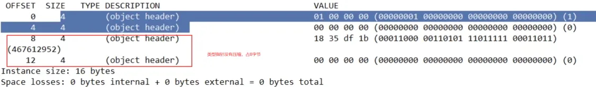

# 第10章-Java对象内存布局和对象头

##  10.1 面试题 

* 说下JUC，AQS的大致流程
* CAS自旋锁，是获取不到锁就一直自旋吗？CAS和synchronized区别在哪里，为什么CAS好，具体优势在哪里？
* sychronized底层是如何实现的，实现同步的时候用到了CAS 了吗？具体哪里用到了？
* 对象头存储那些信息？长度是多少位存储？

##  10.2 Object object = new Object()谈谈你对这句话的理解？ 

* 位置所在-------->JVM堆->新生区->伊甸园区

* 构成布局-------->对象头+实例数据+对齐填充

##  10.3 对象在堆内存中布局 

###  10.3.1 权威定义----周志明老师JVM 

在HotSpot虚拟机里，对象在堆内存的存储布局可以划分为三个部分：对象头（Header）、实例数据（Instance Data） 和对齐填充（Padding，保证是8字节的倍数）。


###  10.3.2 对象在堆内存中的存储布局 

#### 10.3.2.1 对象头

* 对象标记（Mark Word）
  * 默认存储对象的HashCode、分代年龄和锁标志等信息
  * 这些信息都是与对象自身定义无关的数据，所以Mark Word被设计成一个非固定的数据结构以便在极小的空间内存存储尽量多的数据
  * 它会根据对象的状态复用自己的存储空间，也就是说在运行期间MarkWord里存储的数据会随着锁标志位的变化而变化


* 类元信息（类型指针）
  * 对象指向它的类元数据的指针，虚拟机通过这个指针来确定这个对象哪个类的实例

  

* 对象头多大
  
  * 在64位系统中，Mark Word占了8个字节，类型指针占了8个字节，一共是16个字节

#### 10.3.2.2 实例数据

* 存放类的属性（Field）数据信息，包括父类的属性信息

#### 10.3.2.3 对齐填充（保证8个字节的倍数）

* 虚拟机要求对象起始地址必须是8字节的整数倍，填充数据不是必须存在的，仅仅是为了字节对齐，这部分内存按8字节补充对齐。

### 10.3.3 官方理论

* Hotspot术语表官网

  http://openjdk.java.net/groups/hostpot/docs/HotSpotGlossary.html

* 底层源码理论证明

  

##  10.4 再说对象头的MarkWord 

###  10.4.1 32为看一下即可


### 10.4.2 64位重要


* oop.hpp->markOop.hpp

  

  

* markword(64位)分布图，对象布局、GC回收和后面的锁升级就是对象标记MarkWord里面标志位的变化

  

##  10.5 聊聊Object obj = new Object() 

### 10.5.1 JOL证明

* JOL官网

  * http://openjdk.java.net/projects/code-tools/jol

    

  * pom

    ```xml
    <!--
            官网：https://openjdk.org/projects/code-tools/jol/
            定位：分析对象在JVM中的大小和分布
            -->
            <dependency>
                <groupId>org.openjdk.jol</groupId>
                <artifactId>jol-core</artifactId>
                <version>0.9</version>
            </dependency>
    ```

### 10.5.2 代码

```java
package chapter10;

import org.openjdk.jol.info.ClassLayout;
import org.openjdk.jol.vm.VM;
class Customer{

}
public class JOLDemo {
    public static void main(String[] args) {
        //打印jvm信息
        System.out.println(VM.current().details());
        //打印jvm对象对其字节数
        System.out.println(VM.current().objectAlignment());

        Customer customer = new Customer();
        System.out.println(ClassLayout.parseInstance(customer).toPrintable());

    }
}
```

```
结果：
# Running 64-bit HotSpot VM.
# Using compressed oop with 3-bit shift.
# Using compressed klass with 3-bit shift.
# Objects are 8 bytes aligned.
# Field sizes by type: 4, 1, 1, 2, 2, 4, 4, 8, 8 [bytes]
# Array element sizes: 4, 1, 1, 2, 2, 4, 4, 8, 8 [bytes]

8
chapter10.Customer object internals:
 OFFSET  SIZE   TYPE DESCRIPTION                               VALUE
      0     4        (object header)                           01 00 00 00 (00000001 00000000 00000000 00000000) (1)
      4     4        (object header)                           00 00 00 00 (00000000 00000000 00000000 00000000) (0)
      8     4        (object header)                           80 22 01 f8 (10000000 00100010 00000001 11111000) (-134143360)
     12     4        (loss due to the next object alignment)
Instance size: 16 bytes
Space losses: 0 bytes internal + 4 bytes external = 4 bytes total
```

* 结果呈现说明

  

  

### 10.5.3 GC年龄采用4位bit存储，最大位15，例如MaxTenuringThreshold参数默认值就是15

* -XX:MaxTenuringThreshold=16

* 设置后报错

  

### 10.5.4 尾巴参数说明

* 压缩指针相关说明命令
  * Java -XX:+PrintCommandLineFlags -version 查看当前虚拟机信息
  * 默认开启压缩指针，开启后将上述类型指针压缩为4字节，以节约空间
  * 关闭后，类型指针重新变成9字节
  * 手动关闭压缩指针： -XX: -UseCompressedClassPointers

##  10.6 换成其他对象试试 

