# 第11章-Synchronized与锁升级

## 11.1 面试题

- 谈谈你对Synchronized的理解
- Sychronized的锁升级你聊聊
- Synchronized实现原理，monitor对象什么时候生成的？知道monitor的monitorenter和monitorexit这两个是怎么保证同步的嘛？或者说这两个操作计算机底层是如何执行的
- 偏向锁和轻量级锁有什么区别
- Synchronized优化的背景
  - 用所能够实现数据的安全性，但是会带来性能西江
  - 无所能够基于线程并行提升程序性能，但是会带来安全性能下降
- 锁的升过程：无锁->偏向锁->轻量级锁->重量级锁
- synchronized有对象头中的mark word根据锁标志位的不同而被复用及锁升级策略

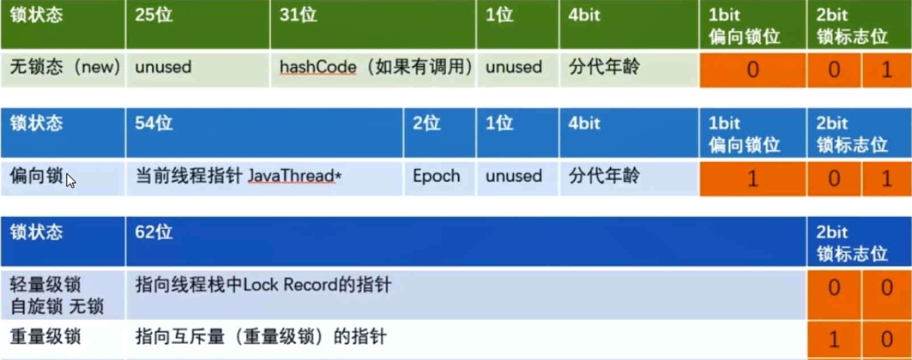

## 11.2 Synchronized的性能变化

- Java5以前，只有Synchronized，这个是操作系统级别的重量级操作

  - 重量级锁，假如锁的竞争比较激烈的话，性能下降

  - Java 5之前 用户态和内核态之间的转换

    - java的线程是映射到系统原生线程之上的，如果要阻塞或唤醒一个线程就需要操作系统接入，需要再用户态与核心态之间切换，这种切换会消耗大量的系统资源，因为用户态与内核态都有各自专用的内存空间，专用的寄存器等，用户态切换至内核态需要传递许多变量、参数给内核，内核也需要保护好用户态在切换时的一些寄存器值、变量等，以便内核态调用结束后切换回用户态继续工作。
    - 在Java早期版本中，synchronized属于重量级锁，效率低下，因为监视器锁(monitor)是依赖底层的操作系统的Mutex Lock（系统互斥量）来实现的，挂起线程和恢复线程都需要转入内核态去完成，阻塞或唤醒一个Java线程需要操作系统切换CPU状态来完成，这种状态切换需要耗费处理器时间，如果同步代码块中内容过于简单，这种切换的时间可能比用户代码执行的时间还长，时间成本相对较高，这也是为什么早期的synchronized效率低的原因，Java6 之后为了减少获得锁和释放锁所带来的性能消耗，引入了轻量级锁和偏向锁

    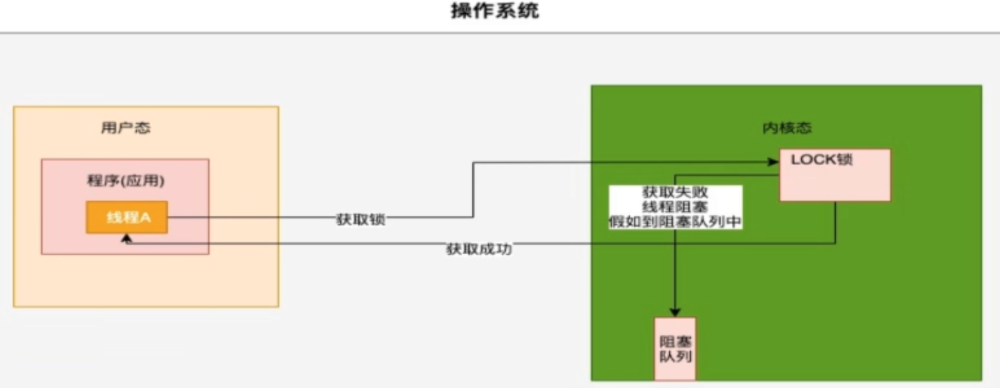

- 为什么任意一个对象都可以成为一个锁？

  - markOop.hpp

    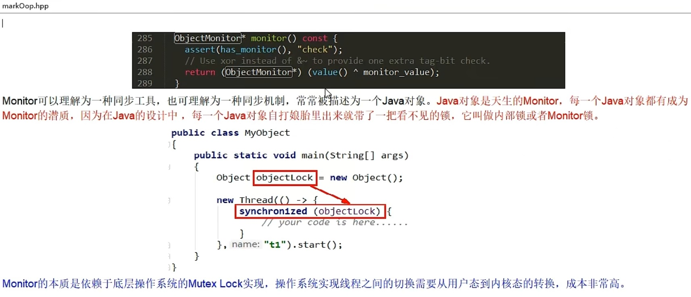

  - Monitor(监视器锁)

    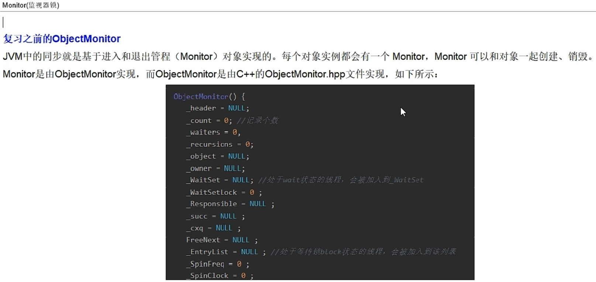

    * Mutex Lock
      * Monitor是在jvm底层实现的，底层代码是C++，本质是依赖于底层操作系统的Mutex Lock实现，操作系统实现线程之间的切换需要从用户态到内核态的转换，状态转化需要耗费很多的处理器时间成本非常高，所以synchronized是Java语言中的一个重量级操作。
    * Monitor与Java对象以及线程是如何关联？
      * 如果一个Java对象被某个线程锁住，则改java对象的Mark Word字段中的LockWord指向monitor的起始地址
      * Monitor的Owner字段会存放拥有相关联对象锁的线程id

  - 结合之前的synchronized和对象头说明

    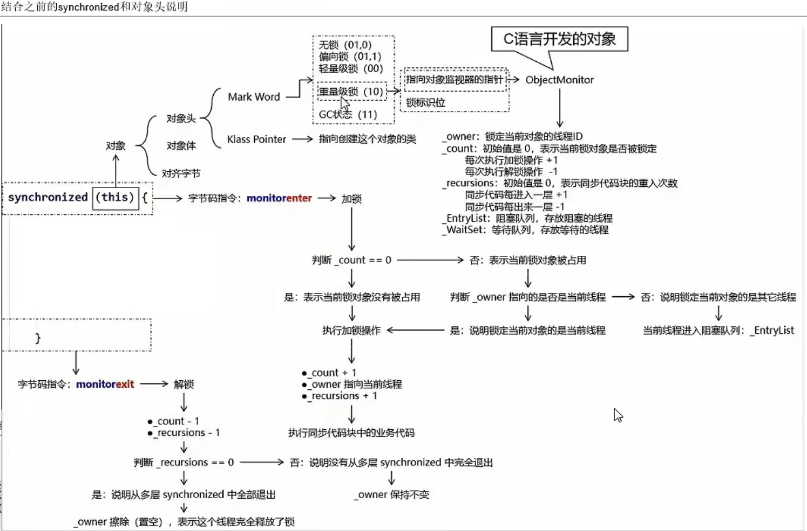

    - Java6 之后为了减少获得锁和释放锁所带来的性能消耗，引入了轻量级锁和偏向锁
    - 需要有个逐步升级的过程，别一开始就捅到重量级锁

## 11.3 Synchronized锁种类及升级步骤

### 11.3.1 多线程访问情况

- 只有一个线程来访问，有且唯一Only One
- 有两个线程（2个线程交替访问）
- 竞争激烈，更多线程来访问

### 11.3.2 升级流程

- Synchronized用的锁是存在Java对象头里的MarkWord中，锁升级功能主要依赖MarkWord中锁标志位和释放偏向锁标志位
- 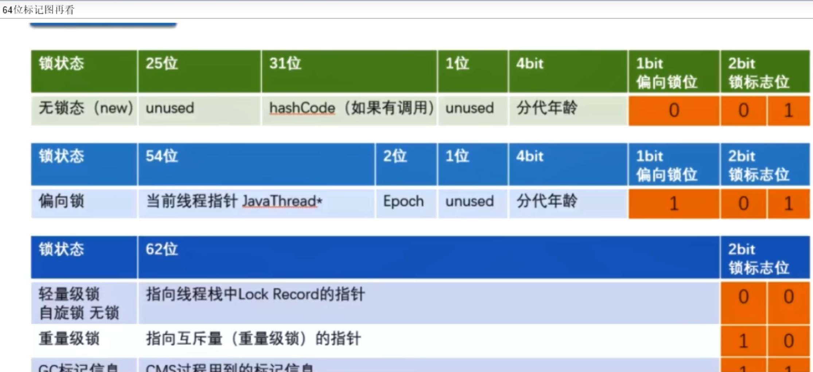
- 锁指向，请牢记

  - 偏向锁：MarkWord存储的是偏向的线程ID
  - 轻量锁：MarkWord存储的是指向线程栈中Lock Record的指针
  - 重量锁：MarkWord存储的是指向堆中的monitor对象（系统互斥量指针）

### 11.3.3 无锁

* 复习C源码的MarkWord标记

  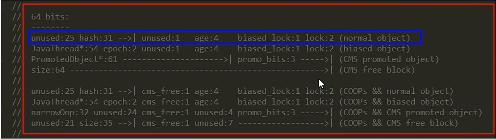

* Code演示

  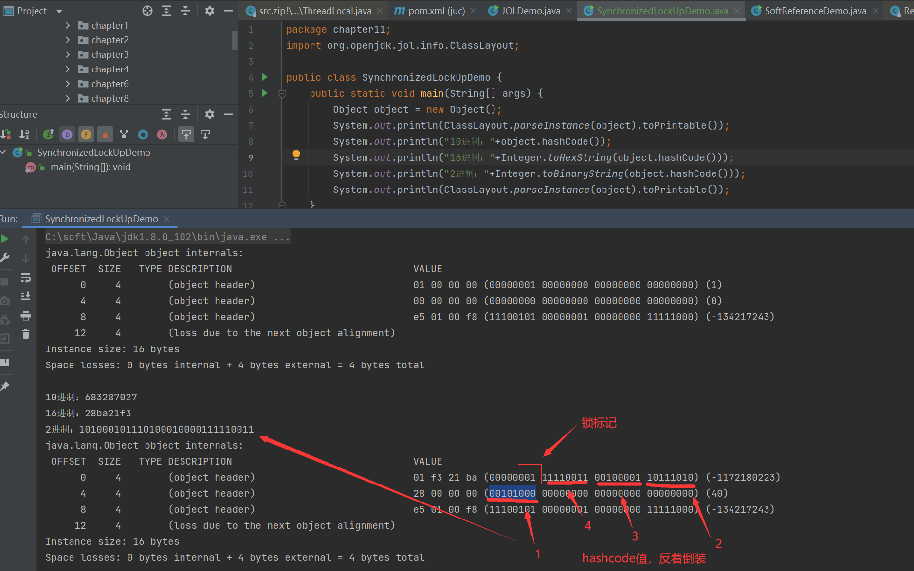

* 程序不会有锁的竞争
  
  * 无锁：初始状态，一个对象被实例化后，如果还没被任何线程竞争锁，那么它就为无锁状态(001)

### 11.3.4 偏锁

* 是什么
  * 偏向锁：单线程竞争。
  * 当线程A第一次竞争到锁时，通过修改MarkWord中的偏向线程ID、偏向模式。如果不存在其他线程竞争，那么持有偏向锁的线程将永远不需要进行同步。

* 主要作用
  * 当一段同步代码一直被同一个线程多次访问，由于只有一个线程那么该线程在后续访问时便会自动获得锁
  * 同一个老顾客来访，直接老规矩行方便

  * 结论：
    * HotSpot的作者经过研究发现，大多数情况下：在多线程情况下，锁不仅不存在多线程竞争，还存在由同一个线程多次获得的情况，偏向锁就是在这种情况下出现的，它的出现是为了解决只有一个线程执行同步时提高性能
    * 偏向锁会偏向于第一个访问锁的线程，如果在接下来的运行过程中，该锁没有被其他线程访问，则持有偏向锁的线程将永远不需要出发同步。也即偏向锁在资源在没有竞争情况下消除了同步语句，懒得连CAS操作都不做了，直接提高程序性能

* 64位标记图再看看

  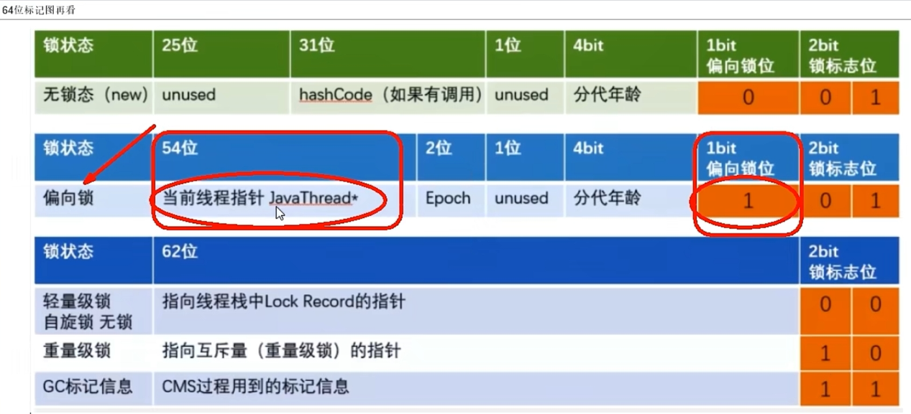

* 偏向锁的持有

  * 说明

    * 理论落地：
      * 在实际应用运行过程中发现，“锁总是同一个线程持有，很少发生竞争”，也就是说锁总是被第一个占用他的线程拥有，这个线程就是锁的偏向线程。
      * 那么只需要在锁第一次被拥有的时候，记录下偏向线程ID.这样偏向线程就一直持有着锁（后续这个线程进入和退出这段加了同步锁的代码块时，不需要再次加锁和释放锁。而是直接会去检查锁的MarkWord里面是不是放的自己的线程ID)。
      * 如果相等，表示偏向锁是偏向于当前线程的，就不需要再尝试获得锁了，直到竞争发生才释放锁。以后每次同步，检查锁的偏向线程ID与当前线程ID是否一致，如果一致直接进入同步。无需每次加锁解锁都去CAS更新对象头。如果自始至终使用锁的线程只有一个，很明显偏向锁几乎没有额外开销，性能极高。
      * 如果不等，表示发生了竞争，锁已经不是总是偏向于同一个线程了，这个时候会尝试使用CAS来替换MarkWord里面的线程ID为新线程的ID。
      * 竞争成功，表示之前的线程不存在了，MarkWord里面的线程ID为新线程的ID,锁不会升级，仍然为偏向锁；
      * 竞争失败，这时候可能需要升级变为轻量级锁，才能保证线程间公平竞争锁。
      * 注意，偏向锁只有遇到其他线程尝试竞争偏向锁时，持有偏向锁的线程才会释放锁，线程是不会主动释放偏向锁的。
    * 技术实现：
      * 一个synchronized方法被一个线程抢到了锁时，那这个方法所在的对象就会在其所在的Mark Word中将偏向锁修改状态位，同时还会占用前54位来存储线程指针作为标识。
      * 若该线程再次访问同一个synchronized方法时，该线程只需去对象头的Mark Word中去判断一下是否有偏向锁指向本身的ID，无需再进入Monitor去竞争对象了。

  * 细化案例Account对象举例说明

    * 偏向锁的操作不用直接捅到操作系统，不涉及用户到内核转换，不必要直接升级为最高级，我们以一个account对象的对象头为例

      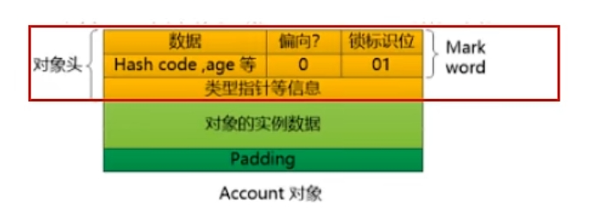

    * 假如有一个线程执行到synchronized代码块的时候，JVM使用CAS操作把线程指针ID记录到Mark Word当中，并修改标偏向标示，标示当前线程就获得该锁。锁对象变成偏向锁（通过CAS修改对象头里的锁标志位），字面意思就是“偏向于第一个获得它的线程”的锁。执行完同步代码块后，线程并不会主动释放偏向锁。

      

    * 这时线程获得了锁，可以执行同步代码块。当该线程第二次到达同步代码块时会判断此时持有锁的线程是否还是自己（持有锁的线程ID也在对象头里），JVM通过account对象的Mark Word判断：当前线程ID还在，说明还持有这个对象的锁，就可以继续进入临界区工作。由于之前没有释放锁，这里也就不需要重新加锁。如果自始至终使用锁的线程只有一个，很明显偏向锁几乎没有额外开销，性能极高。结论：JVM不用和操作系统协商设置Mutex(争取内核)，它只需要记录下线程ID就标示自己获得了当前锁，不用操作系统接入。

    * 上述就是偏向锁：在没有其他线程竞争的时候，一直偏向偏心当前线程，当前线程可以一直执行

* 偏向锁JVM命令：

  * Linux下命令：java -XX:+PrintFlagsInitial |grep BiasedLock*
  * windows下命令：java -XX:+PrintFlagsInitial |findStr BiasedLock*

  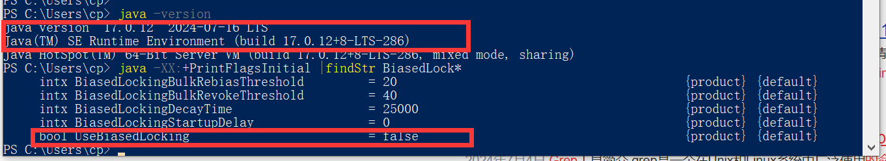

  * 重要参数说明

    

    ```
    实际上偏向锁在JDK1.6之后是默认开启的，但是启动时间有延迟，
    所以需要添加参数-XX:BiasedLockingStartupDelay=0,让其在程序启动时立刻启动。
    开启偏向锁：-XX:+UseBiasedLocking -XX:BiasedLockingStartupDelay=0
    关闭偏向锁：关闭之后程序默认会直接进入轻量级锁状态。
    －XX: -UseBiasedLocking
    ```

* Code案例演示：
  
  * 偏向锁默认情况演示---只有一个线程

```java
import org.openjdk.jol.info.ClassLayout;

//实际上偏向锁在JDK1.6之后是默认开启的，但是启动时间有延迟，
//        所以需要添加参数-XX:BiasedLockingStartupDelay=0,让其在程序启动时立刻启动。
//        开启偏向锁：-XX:+UseBiasedLocking -XX:BiasedLockingStartupDelay=0
//        关闭偏向锁：关闭之后程序默认会直接进入轻量级锁状态。
//        －XX: -UseBiasedLocking
public class BiaseLockingDemo {
    public static void main(String[] args) {
        //延迟5秒后，对象默认的就是偏向锁状态
        try {
            Thread.sleep(5000);
        } catch (InterruptedException e) {
            e.printStackTrace();
        }

        Object object = new Object();
        System.out.println(ClassLayout.parseInstance(object).toPrintable());
    }
}

```

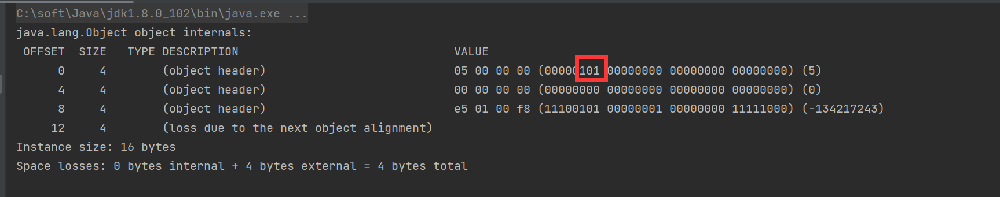

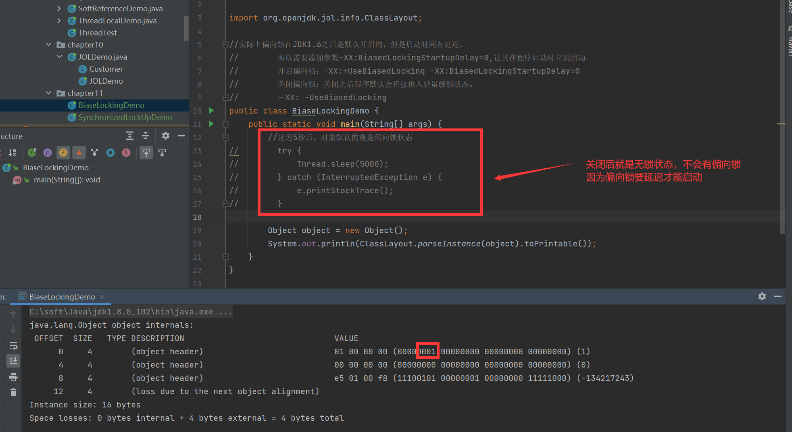

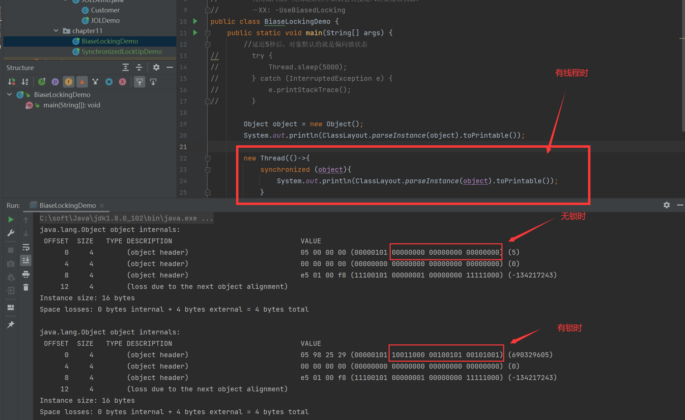

* 第二个线程来抢夺了

  ```java
  //开启偏向锁：-XX:+UseBiasedLocking -XX:BiasedLockingStartupDelay=0
  public static void twoThreadMarkWordStat(){
          Object object = new Object();
          System.out.println(Thread.currentThread().getName()+ClassLayout.parseInstance(object).toPrintable());
          CountDownLatch countDownLatch = new CountDownLatch(1);
          new Thread(()->{
              try {
                  countDownLatch.await();
              } catch (InterruptedException e) {
                  e.printStackTrace();
              }
              for (int i=0;i<2;i++){
                  synchronized (object){
                       int b = 1+3;
                      System.out.println(Thread.currentThread().getName()+ClassLayout.parseInstance(object).toPrintable());
                  }
              }
          }).start();
  
          new Thread(()->{
              try {
                  countDownLatch.await();
              } catch (InterruptedException e) {
                  e.printStackTrace();
              }
              for (int i=0;i<2;i++){
                  synchronized (object){
                      int b = 1+3;
                  }
              }
          }).start();
          countDownLatch.countDown();
      }
  ```

  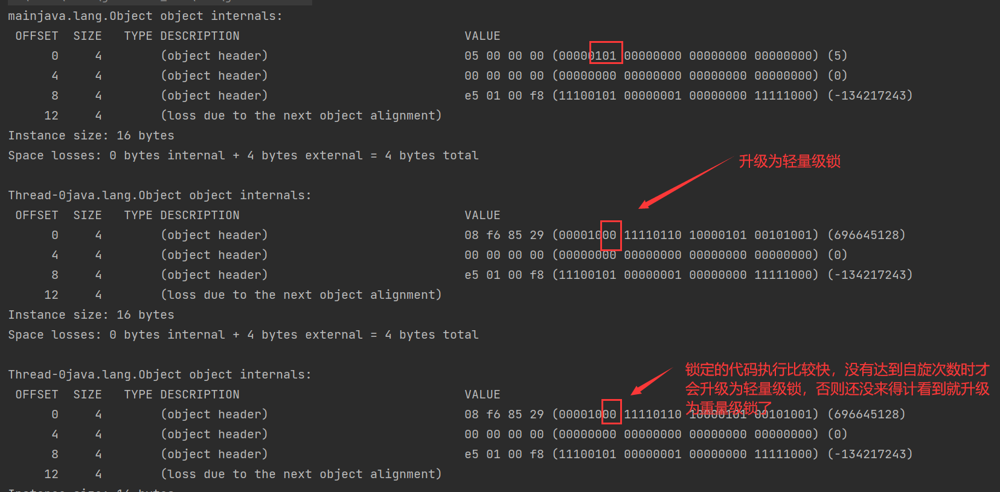

* 偏向锁的撤销：

  * 当有另外一个线程逐步来竞争锁的时候，就不能再使用偏向锁了，要升级为轻量级锁，使用的是等到竞争出现才释放锁的机制
  * 竞争线程尝试CAS更新对象头失败，会等到全局安全点（此时不会执行任何代码）撤销偏向锁，同时检查持有偏向锁的线程是否还在执行
  * 偏向锁使用一种等到竞争出现才释放锁的机制，只有当其他线程竞争锁时，只有偏向锁的原来线程才会被撤销，撤销需要等待全局安全点（该时间点上没有字节码正在执行），同时检查持有偏向锁的线程是否还在执行
    * 第一个线程正在执行Synchronized方法（处于同步块），它还没有执行完，其他线程来抢夺，该偏向锁会被取消掉并出现锁升级，此时轻量级锁由原来持有偏向锁的线程持有，继续执行同步代码块，而正在竞争的线程会自动进入自旋等待获得该轻量级锁
    * 第一个线程执行完Synchronized（退出同步块），则将对象头设置为无所状态并撤销偏向锁，重新偏向。

* 总体步骤流程图示

  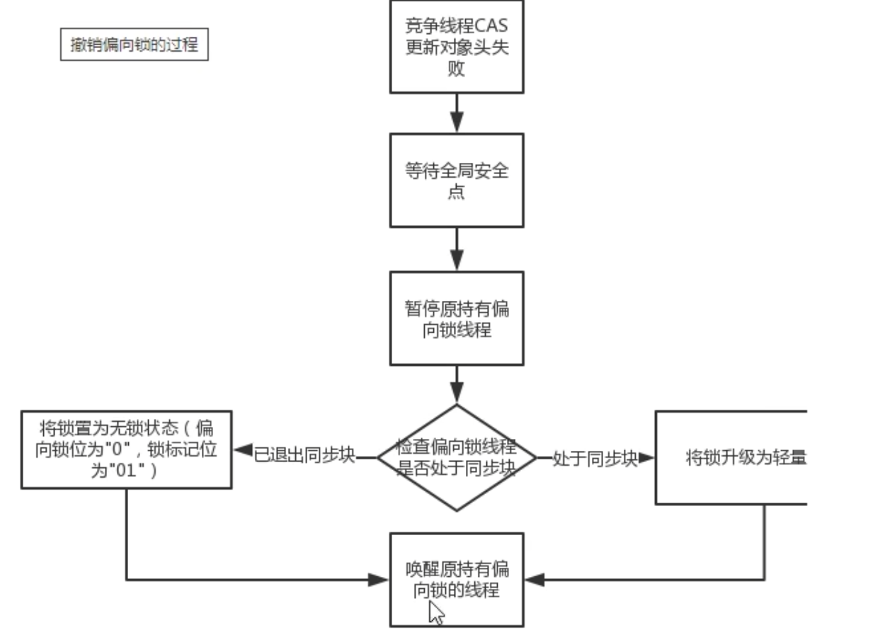

* 题外话
  
  * Java15以后逐步废弃偏向锁，需要手动开启------->维护成本高

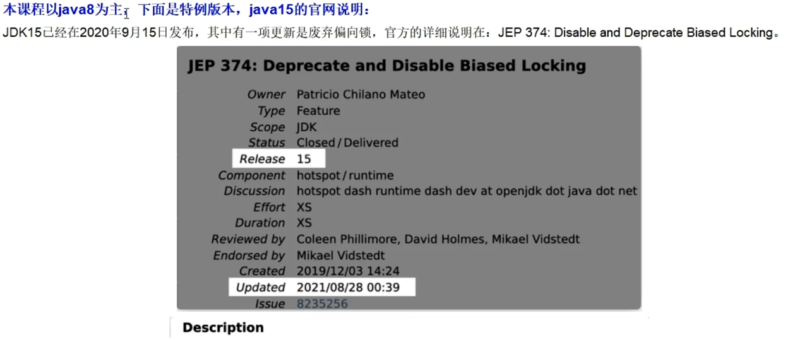

### 11.3.5 轻锁

* 是什么

  * 轻量级锁：多线程竞争，但是任意时候最多只有一个线程竞争，即不存在锁竞争太激烈的情况，也就没有线程阻塞。

* 主要作用

  * 主要作用：有线程来参与锁的竞争，但是获取锁的冲突时间极短
  * 本质是自旋锁CAS

* 64位标记图再看

  

* 轻量级锁的获取

  * 轻量级锁是为了在线程近乎交替执行同步块时提高性能

  * 主要目的：在没有多线程竞争的前提下，通过CAS减少重量级锁使用操作系统互斥量产生的性能消耗，说白了先自旋，不行才升级阻塞。

  * 升级时机：当关闭偏向锁功能或多线程竞争偏向锁会导致偏向锁升级为轻量级锁

  * 假如线程A已经拿到锁，这时线程B又来抢该对象的锁，由于该对象的锁已经被线程A拿到，当前该锁已是偏向锁了。

  * 线程B在争抢时发现对象头Mark Word中的线程ID不是线程B自己的线程ID(而是线程A),那线程B就会进行CAS操作希望能获得锁。

  * 此时线程B操作中有两种情况：

    * 如果锁获取成功，直接替换Mark Word中的线程ID为B自己的ID(A→B),重新偏向于其他线程（即将偏向锁交给其他线程，相当于当前线程＂被＂释放了锁），该锁会保持偏向锁状态，A线程Over，B线程上位；

      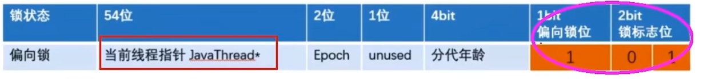

    * 如果锁获取失败，则偏向锁升级为轻量级锁（设置偏向锁标识为0并设置锁标志位为00),此时轻量级锁由原持有偏向锁的线程持有，继续执行其同步代码，而正在竞争的线程B会进入自旋等待获得该轻量级锁。

  * 补充

    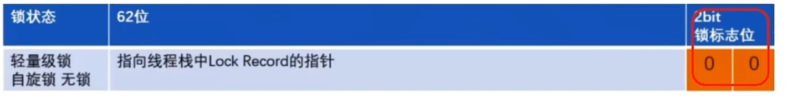

    * 轻量级锁的加锁
      * JVM会为每个线程在当前线程的栈帧中创建用于存储锁记录的空间，官方称为Displaced Mark Word。若一个线程获得锁时发现是轻量级锁，会把锁的MarkWord复制到自己的Displaced Mark Word里面。然后线程尝试用CAS将锁的MarkWord替换为指向锁记录的指针。如果成功，当前线程获得锁，如果失败，表示Mark Word已经被替换成了其他线程的锁记录，说明在与其它线程竞争锁，当前线程就尝试使用自旋来获取锁。
    * 自旋CAS:不断尝试去获取锁，能不升级就不往上捅，尽量不要阻塞
    * 轻量级锁的释放
      * 在释放锁时，当前线程会使用CAS操作将Displaced Mark Word的内容复制回锁的Mark Word里面。如果没有发生竞争，那么这个复制的操作会成功。如果有其他线程因为自旋多次导致轻量级锁升级成了重量级锁，那么CAS操作会失败，此时会释放锁并唤醒被阻塞的线程

* Code演示

  * 如果关闭偏向锁，就可以直接进入轻量级锁

  * -XX:-UseBiasedLocking 

    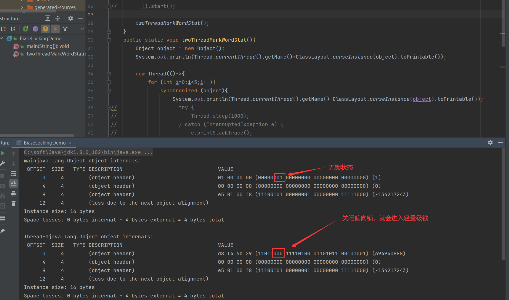

* 步骤流程图

  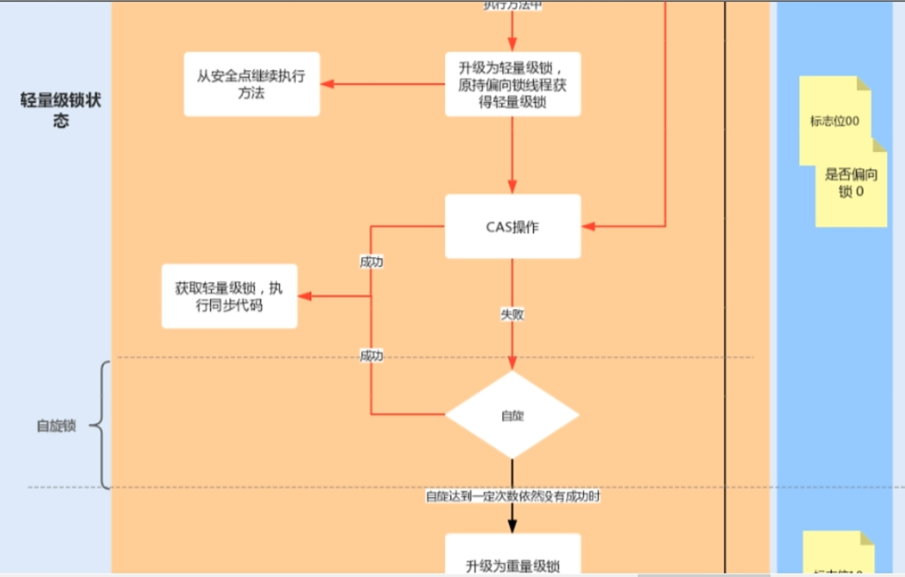

  

* 自选达到一定次数和程度

  * java6之前
    * 默认启用，默认情况下自旋次数是10次
      * -XX:PreBlockSpin=10来修改
    * 或者自旋线程数超过cpu核数一般
  * java6之后
    * 自适应自旋锁的大致原理
      * 线程如果自旋成功了，那下次自旋的最大次数会增加，因为JVM认为既然上次成功了，那么这一次也大概率会成功
      * 如果很少会自旋成功，那么下次会减少自旋的次数甚至不自旋，避免CPU空转
      * 自适应意味着自旋的次数不是固定不变的，而是根据同一个锁上一次自旋的时间、拥有锁线程的状态来决定

* 轻量锁与偏向锁的区别和不同

  * 争夺轻量锁失败时，自旋尝试抢占锁
  * 轻量级锁每次退出同步块都需要释放锁，而偏向锁是在竞争发生时才释放锁

### 11.3.6 重锁

* 有大量线程参与锁的竞争，冲突性很高

* 锁标志位

  

  * 重量级锁原理
    * Java中synchronized的重量级锁，是基于进入和退出Monitor对象实现的。在编译时会将同步块的开始位置插入monitor enter指令，在结束位置插入monitor exit指令。
    * 当线程执行到monitor enter指令时，会尝试获取对象所对应的Monitor所有权，如果获取到了，即获取到了锁，会在Monitor的owner中存放当前线程的id，这样它将处于锁定状态，除非退出同步块，否则其他线程无法获取到这个Monitor.

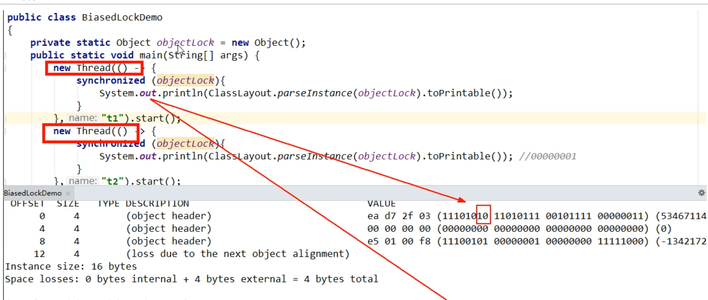

### 11.3.7 小总结

- 锁升级的过程

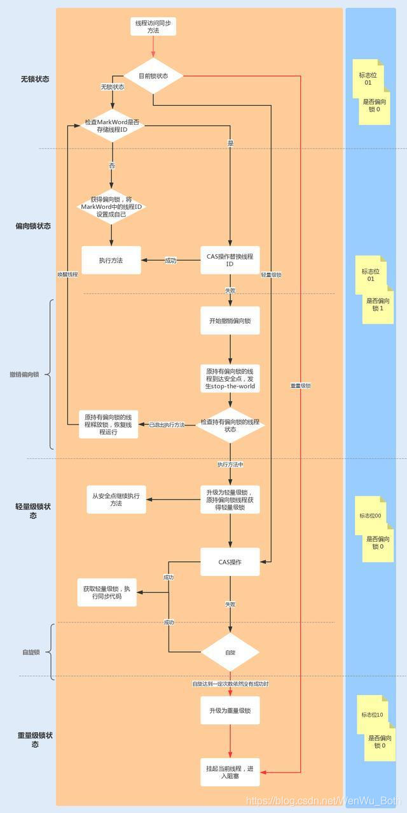

- 锁升级后，hashcode去哪儿了?

  - 锁升级为轻量级或重量级锁后，Mark Word中保存的分别是线程栈帧里的锁记录指针和重量级锁指针，已经没有位置再保存哈希码，GC年龄了，那么这些信息被移动到哪里去了呢？

    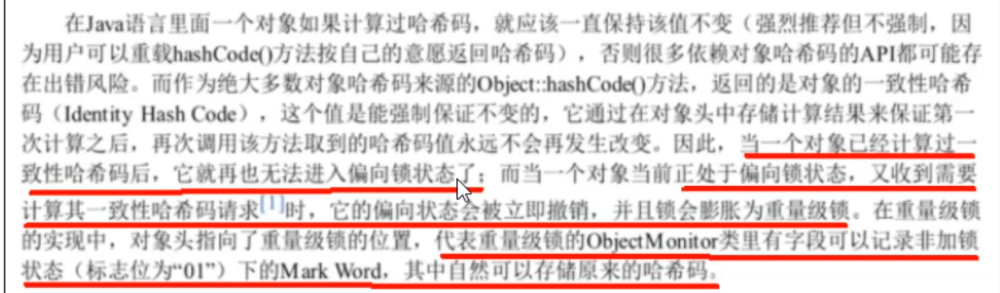

  - 在无锁状态下，Mark Word中可以存储对象的identity hash code值。当对象的hashCode()方法第一次被调用时，JVM会生成对应的identity hash code值并将该值存储到Mark Word中。

  - 对于偏向锁，在线程获取偏向锁时，会用Thread ID和epoch值覆盖identity hash code所在的位置。如果一个对象的hashCode()方法已经被调用过一次之后，这个对象不能被设置偏向锁。因为如果可以的话，那Mark Word中的identity hash code必然会被偏向线程ld给覆盖，这就会造成同一个对象前后两次调用hashCode()方法得到的结果不一致。

  - 升级为轻量级锁时，JVM会在当前线程的栈帧中创建一个锁记录（Lock Record)空间，用于存储锁对象的Mark Word拷贝，该拷贝中可以包含identity hash code,所以轻量级锁可以和identity hash code共存，哈希码和GC年龄自然保存在此，释放锁后会将这些信息写回到对象头。

  - 升级为重量级锁后，Mark Word保存的重量级锁指针，代表重量级锁的ObjectMonitor类里有字段记录非加锁状态下的Mark Word，锁释放后会将信息写回到对象头。

  - code：对象已经计算过identity hash code，它无法进入偏向做状态，直接升级为轻量级锁

    ```java
    //开启偏向锁：-XX:+UseBiasedLocking -XX:BiasedLockingStartupDelay=0
        public static void thenCallHasCodeMethodCannotInBiaseLock(){
            Object object = new Object();
            System.out.println(Thread.currentThread().getName()+ClassLayout.parseInstance(object).toPrintable());
            object.hashCode();
            System.out.println(Thread.currentThread().getName()+ClassLayout.parseInstance(object).toPrintable());
            new Thread(()->{
                    synchronized (object){
                        System.out.println(Thread.currentThread().getName()+ClassLayout.parseInstance(object).toPrintable());
                    }
            }).start();
        }
    ```

    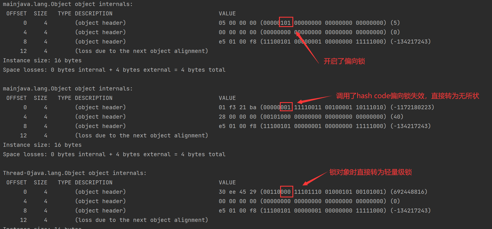

  - code：偏向锁升级过程中遇到一致性哈希计算请求，立马撤销偏向模式，膨胀为重量级锁

    ```java
    //开启偏向锁：-XX:+UseBiasedLocking -XX:BiasedLockingStartupDelay=0
        public static void biaseLockPrd(){
            Object object = new Object();
            System.out.println(Thread.currentThread().getName()+ClassLayout.parseInstance(object).toPrintable());
            new Thread(()->{
                synchronized (object){
                    System.out.println(Thread.currentThread().getName()+ClassLayout.parseInstance(object).toPrintable());
                    object.hashCode();
                    System.out.println(Thread.currentThread().getName()+ClassLayout.parseInstance(object).toPrintable());
                }
            }).start();
        }
    ```

    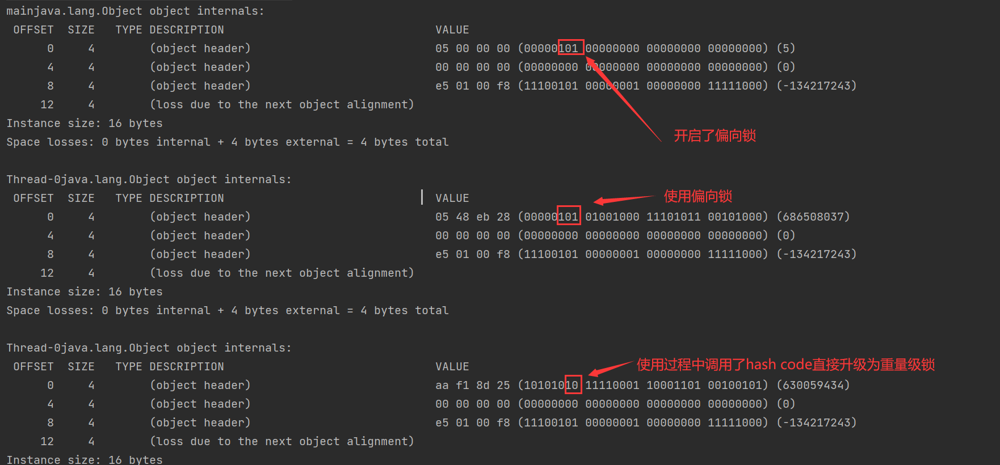

  

- 各种锁优缺点、synchronized锁升级和实现原理

  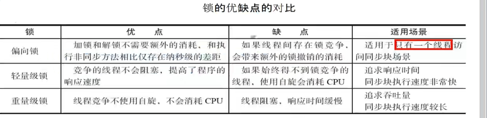

  * synchronized锁升级过程总结：一句话，就是先自旋，不行再阻塞。
  * 实际上是把之前的悲观锁（重量级锁）变成在一定条件下使用偏向锁以及使用轻量级（自旋锁CAS)的形式
  * synchronized在修饰方法和代码块在字节码上实现方式有很大差异，但是内部实现还是基于对象头的MarkWord来实现的。
  * JDK1.6之前synchronized使用的是重量级锁，JDK1.6之后进行了优化，拥有了无锁－＞偏向锁－＞轻量级锁－＞重量级锁的升级过程，而不是无论什么情况都使用重量级锁。
  * 偏向锁：适用于单线程适用的情况，在不存在锁竞争的时候进入同步方法／代码块则使用偏向锁。
  * 轻量级锁：适用于竞争较不激烈的情况（这和乐观锁的使用范围类似），存在竞争时升级为轻量级锁，轻量级锁采用的是自旋锁，如果同步方法／代码块执行时间很短的话，采用轻量级锁虽然会占用cpu资源但是相对比使用重量级锁还是更高效。
  * 重量级锁：适用于竞争激烈的情况，如果同步方法／代码块执行时间很长，那么使用轻量级锁自旋带来的性能消耗就比使用重量级锁更严重，这时候就需要升级为重量级锁。

## 11.4 JIT编译器对锁的优化

### 11.4.1 JIT

Just In Time Compiler 即时编译器

### 11.4.2 锁消除

```java
/**
 * 锁消除
 * 从JIT角度看想相当于无视他，synchronized(o)不存在了
 * 这个锁对象并没有被共用扩散到其他线程使用
 * 极端的说就是根本没有加锁对象的底层机器码，消除了锁的使用
 */

public class LockClearUpDemo {
    static Object object = new Object();

    public void m1() {
        //锁消除问题，JIT会无视它，synchronized(o)每次new出来的，都不存在了，非正常的
        Object o = new Object();
        synchronized (o) {
            System.out.println("-----------hello LockClearUpDemo" + "\t" + o.hashCode() + "\t" + object.hashCode());
        }
    }

    public static void main(String[] args) {
        LockClearUpDemo lockClearUpDemo = new LockClearUpDemo();
        for (int i = 0; i < 10; i++) {
            new Thread(() -> {
                lockClearUpDemo.m1();
            }, String.valueOf(i)).start();
        }
    }
}
/**
 * -----------hello LockClearUpDemo	229465744	57319765
 * -----------hello LockClearUpDemo	219013680	57319765
 * -----------hello LockClearUpDemo	1109337020	57319765
 * -----------hello LockClearUpDemo	94808467	57319765
 * -----------hello LockClearUpDemo	973369600	57319765
 * -----------hello LockClearUpDemo	64667370	57319765
 * -----------hello LockClearUpDemo	1201983305	57319765
 * -----------hello LockClearUpDemo	573110659	57319765
 * -----------hello LockClearUpDemo	1863380256	57319765
 * -----------hello LockClearUpDemo	1119787251	57319765
 */
```

### 11.4.3 锁粗化

```java
/**
 * 锁粗化
 * 假如方法中首尾相接，前后相邻的都是同一个锁对象，那JIT编译器会把这几个synchronized块合并为一个大块
 * 加粗加大范围，一次申请锁使用即可，避免次次的申请和释放锁，提高了性能
 */
public class LockBigDemo {
    static Object objectLock = new Object();

    public static void main(String[] args) {
        new Thread(() -> {
            synchronized (objectLock) {
                System.out.println("111111111111");
            }
            synchronized (objectLock) {
                System.out.println("222222222222");
            }
            synchronized (objectLock) {
                System.out.println("333333333333");
            }
            synchronized (objectLock) {
                System.out.println("444444444444");
            }
            //底层JIT的锁粗化优化
            synchronized (objectLock) {
                System.out.println("111111111111");
                System.out.println("222222222222");
                System.out.println("333333333333");
                System.out.println("444444444444");
            }
        }, "t1").start();
    }
}
```

## 11.5 小总结

- 没有锁：自由自在
- 偏向锁：唯我独尊
- 轻量锁：楚汉争霸
- 重量锁：群雄逐鹿