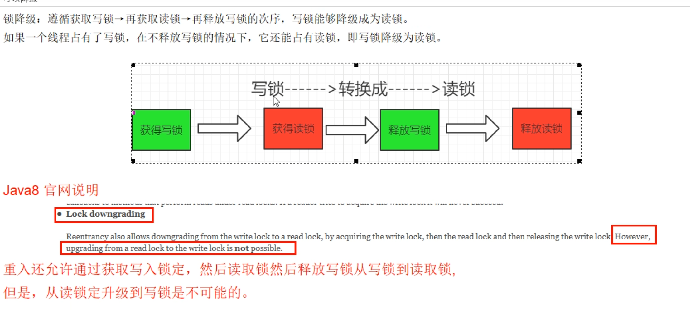
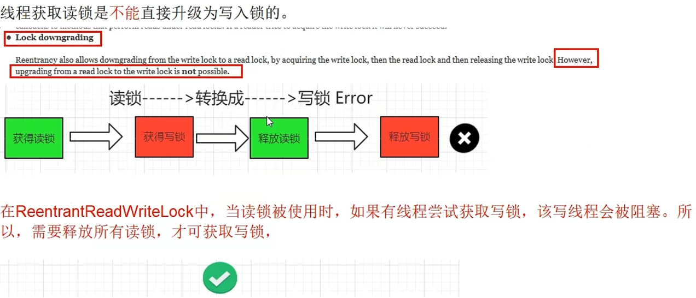
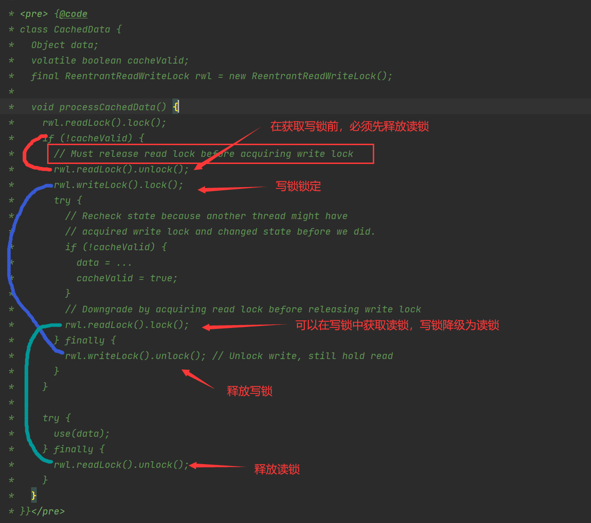
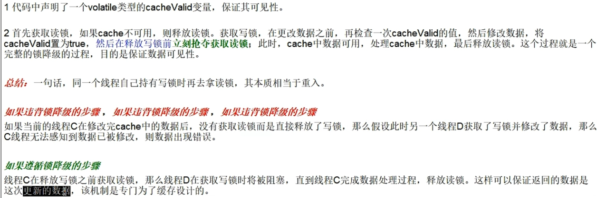
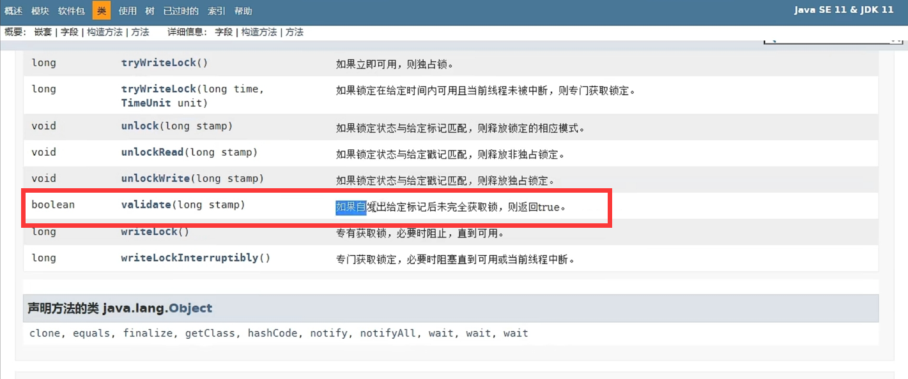
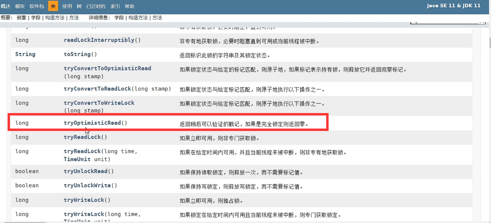

# 第13章-ReentrantLock、ReentrantReadWriteLock、StampedLock讲解

本章路线总纲：无锁->独占锁->读写锁->邮戳锁

## 13.1 关于锁的面试题

- 你知道Java里面有那些锁
- 你说说你用过的锁，锁饥饿问题是什么？
- 有没有比读写锁更快的锁
- StampedLock知道吗？（邮戳锁/票据锁）
- ReentrantReadWriteLock有锁降级机制，你知道吗？

## 13.2 简单聊聊ReentrantReadWriteLock

### 13.2.1 是什么？

- 读写锁说明

  - 一个资源能够被多个读线程访问，或者被一个写线程访问，但是不能同时存在读写线程

- 再说说演变

  - 无锁无序->加锁->读写锁->邮戳锁

- 读写锁意义和特点

  - 它只允许读读共存，而读写和写写依然是互斥的，大多实际场景是”读/读“线程间不存在互斥关系，只有”读/写“线程或者”写/写“线程间的操作是需要互斥的，因此引入了 ReentrantReadWriteLock
  - 一个ReentrantReadWriteLock同时只能存在一个写锁但是可以存在多个读锁，但是不能同时存在写锁和读锁，也即资源可以被多个读操作访问，或一个写操作访问，但两者不能同时进行。
  - 只有在读多写少情景之下，读写锁才具有较高的性能体现。

### 13.2.2 特点

- 可重入

- 读写兼顾

- code演示ReentrantReadWriteLockDemo

  ```java
  package chapter13;
  
  import java.util.HashMap;
  import java.util.Map;
  import java.util.concurrent.TimeUnit;
  import java.util.concurrent.locks.Lock;
  import java.util.concurrent.locks.ReadWriteLock;
  import java.util.concurrent.locks.ReentrantLock;
  import java.util.concurrent.locks.ReentrantReadWriteLock;
  
  class MyResource{
      //资源类，模拟一个简单的缓存
      Map<String,String> map  = new HashMap<>();
  
      //ReentrantLock 等价于synchronized
      Lock lock = new ReentrantLock();
  
      //ReentrantReadWriteLock 读写互斥，读读共享
      ReadWriteLock readWriteLock = new ReentrantReadWriteLock();
  
      public  void  write(String key,String value){
          readWriteLock.writeLock().lock();
          try {
              System.out.println(Thread.currentThread().getName()+"\t正在写入");
              map.put(key,value);
              try {
                  TimeUnit.SECONDS.sleep(1);
              } catch (InterruptedException e) {
                  e.printStackTrace();
              }
              System.out.println(Thread.currentThread().getName()+"\t完成写入");
          }finally {
              readWriteLock.writeLock().unlock();
          }
  
      }
      public  void  read(String key){
          readWriteLock.readLock().lock();
          try {
              System.out.println(Thread.currentThread().getName()+"\t正在读取");
              String s = map.get(key);
              try {
                  TimeUnit.SECONDS.sleep(1);
              } catch (InterruptedException e) {
                  e.printStackTrace();
              }
              System.out.println(Thread.currentThread().getName()+"\t完成读取\t"+s);
          }finally {
              readWriteLock.readLock().unlock();
          }
  
      }
  }
  public class ReentrantReadWriteLockDemo {
      public static void main(String[] args)
      {
          MyResource myResource = new MyResource();
  
          for (int i = 1; i <=10; i++) {
              int finalI = i;
              new Thread(() -> {
                  myResource.write(finalI +"", finalI +"");
              },String.valueOf(i)).start();
          }
  
          for (int i = 1; i <=10; i++) {
              int finalI = i;
              new Thread(() -> {
                  myResource.read(finalI +"");
              },String.valueOf(i)).start();
          }
  
          //暂停几秒钟线程
          try { TimeUnit.SECONDS.sleep(1); } catch (InterruptedException e) { e.printStackTrace(); }
  
          for (int i = 1; i <=3; i++) {
              int finalI = i;
              new Thread(() -> {
                  myResource.write(finalI +"", finalI +"");
              },"新写锁线程->"+String.valueOf(i)).start();
          }
      }
  }
  
  ```

  ```
  结果：
  1	正在写入
  1	完成写入
  2	正在写入
  2	完成写入
  4	正在写入
  4	完成写入
  3	正在写入
  3	完成写入
  6	正在写入
  6	完成写入
  5	正在写入
  5	完成写入
  7	正在写入
  7	完成写入
  8	正在写入
  8	完成写入
  9	正在写入
  9	完成写入
  10	正在写入
  10	完成写入
  1	正在读取
  2	正在读取
  3	正在读取
  5	正在读取
  4	正在读取
  7	正在读取
  6	正在读取
  10	正在读取
  9	正在读取
  8	正在读取
  3	完成读取	3
  5	完成读取	5
  8	完成读取	8
  6	完成读取	6
  7	完成读取	7
  9	完成读取	9
  2	完成读取	2
  10	完成读取	10
  4	完成读取	4
  1	完成读取	1
  新写锁线程->1	正在写入
  新写锁线程->1	完成写入
  新写锁线程->3	正在写入
  新写锁线程->3	完成写入
  新写锁线程->2	正在写入
  新写锁线程->2	完成写入
  
  Process finished with exit code 0
  
  ```

  

- 结论：一体两面，读写互斥，读读共享，读没有完成的时候其他线程写锁无法获得

- 从写锁->读锁，ReentrantReadWriteLock可以降级：

  - 将写锁降级为读锁（类似Linux文件读写权限理解，就像写权限要高于读权限一样），锁的严苛成都变强叫做升级，反之叫做降级------>遵循获取写锁、获取读锁再释放写锁的次序，写锁能够降级为读锁

  - 写锁的降级，降级成为读锁

    - 如果一个线程持有了写锁，在没有释放写锁的情况下，它还可以继续获得读锁。这就是写锁的降级，降级成为了读锁。
    - 规则惯例，先获取写锁，然后获取读锁，再释放写锁的次序
    - 如果释放了写锁，那么就完全转换为读锁
    - 如果有线程在读，那么写线程是无法获取写锁的，是悲观锁的策略

  - 可以降级：锁降级时为了让当前线程感知到数据的变化，目的时保证数据可见性

    - 

  - code演示LockDownGradingDemo

    - ```java
      package chapter13;
      
      import java.util.concurrent.locks.ReentrantReadWriteLock;
      
      /**
       * 锁降级：遵循获取写锁→再获取读锁→再释放写锁的次序，写锁能够降级成为读锁。
       *
       * 如果一个线程占有了写锁，在不释放写锁的情况下，它还能占有读锁，即写锁降级为读锁。
       *
       * 读没有完成时候写锁无法获得锁，必须要等着读锁读完后才有机会写
       */
      public class LockDownGradingDemo
      {
          public static void main(String[] args)
          {
              ReentrantReadWriteLock readWriteLock = new ReentrantReadWriteLock();
      
              ReentrantReadWriteLock.ReadLock readLock = readWriteLock.readLock();
              ReentrantReadWriteLock.WriteLock writeLock = readWriteLock.writeLock();
      
              //先写锁，再读锁，可以正常运行
      //        writeLock.lock();
      //        System.out.println("----写入");
      //
      //        readLock.lock();
      //        System.out.println("----读取");
      //        writeLock.unlock();
      //        readLock.unlock();
      
              //先读锁，再写锁，卡主，等待释放读锁
              readLock.lock();
              writeLock.lock();
              System.out.println("----写入");
              System.out.println("----读取");
              readLock.unlock();
              writeLock.unlock();
          }
      }
      ```

  - 不可升级为写锁

    * 
    * 

  - 写锁和读锁是互斥的

    - 写锁和读锁是互斥的（这里的互斥是指线程间的互斥，当前线程可以获取到写锁有获取到读锁，但是获取到读锁不能继续获取写锁），这是因为读写锁保持写操作的可见性。因为，如果允许读锁在被获取的情况下对写锁的获取，那么正在运行的其他读线程无法感知到当前写线程的操作。
    - 因此，分析读写锁ReentrantReadWriteLock，会发现它有个潜在的问题：读锁结束，写锁有望，写锁独占，读写全堵。
    - 如果有线程正在读，写线程需要等待读线程释放锁后才能获取写锁，见前面Case《code演示LockDownGradingDemo》
    - 即ReentrantReadWriteLock读的过程中不允许写，只能等待线程都释放了读锁，当前线程才能获取写锁，也就是写必须等待，这是一种悲观的读锁，就是别人还在读，你先别去写，省的数据乱。

- 读写锁之读写规矩，解释为什么要锁降级？（自己写完自己先读，避免再次去抢夺写锁）

  - 为什么有这么个特性，设计思想见《Oracle公司ReentrantReadWriteLock源码总结》

    

    

## 13.3 面试题：有没有比读写锁更快的锁？

有，邮戳锁StampedLock

## 13.4 邮戳锁StampedLock

无锁->独占锁->读写锁->邮戳锁

### 13.4.1 是什么？

* StampedLock是JDK1.8中新增的一个读写锁，也是对JDK1.5中的读写锁ReentrantReadWriteLock的优化
* 邮戳锁也叫票据锁

* stamp （戳记，long类型）代表了锁的状态。当stamp返回零时，表示线程获取锁失败，并且当释放锁或者转换锁的时候，都要传入最初获取的stamp值。

### 13.4.2 它是由饥饿问题引出

- 锁饥饿问题：

  - ReentrantReadWriteLock实现了读写分离，但是一旦读操作比较多的时候，想要获取写锁就变得比较困难了，因此当前有可能会一直存在读锁，而无法获得写锁。
- 如何解决锁饥饿问题：

  - 使用”公平“策略可以一定程度上缓解这个问题，new  ReentrantReadWriteLock(true)
  - 使用”公平“策略是以牺牲系统吞吐量为代价的
  - StampedLock类的乐观读锁方式--->采取乐观获取锁，其他线程尝试获取写锁时不会被阻塞，在获取乐观读锁后，还需要对结果进行校验
- StampedLock类的乐观读锁闪亮登场
  - 为什么闪亮
    - ReentrantReadWriteLock允许多线程同时读，但是只允许一个线程写，在线程获取到写锁的时候，其他写操作和读操作都会处于阻塞状态，读锁和写锁也是互斥的，所以再读的时候是不允许写的，读写锁比传统的synchronized速度要快很多，原因就是在于ReentrantReadWriteLock支持读并发，读读可以共享
    - StampedLock横空出世，ReentrantReadWriteLock的读锁被占用的时候，其他线程尝试获取写锁的时候会被阻塞。但是StampedLock采取乐观获取锁后，其他线程尝试获取写锁时不会被阻塞，这其实是对读锁的优化。所以在获取乐观读锁后，还需要对结果进行校验。
  - 一句话
    - 对短的只读代码短，使用乐观模式通常可以减少争用冰提高吞吐量

### 13.4.3 StampedLock的特点

- 所有获取锁的方法，都返回一个邮戳，stamp为零表示失败，其余都表示成功
- 所有释放锁的方法，都需要一个邮戳，这个stamp必须是和成功获取锁时得到的stamp一致
- StampedLock是不可重入的，危险（如果一个线程已经持有了写锁，再去获取写锁的话会造成死锁）
- StampedLock有三种访问模式：

  - Reading（读模式悲观）：功能和ReentrantReadWriteLock的读锁类似
  - Writing（写模式）：功能和ReentrantReadWriteLock的写锁类似
  - Optimistic reading（乐观读模式）：无锁机制，类似与数据库中的乐观锁，支持读写并发，很乐观认为读时没人修改，假如被修改在实现升级为悲观读模式

- 一句话：读的过程中也允许写锁介入

### 13.4.5 乐观读模式Code演示

- 传统的读写锁模式----读的时候写锁不能获取

```java

public class StampedLockDemo {
    static int number = 37;
    static StampedLock stampedLock = new StampedLock();

    public void write() {
        long stamp = stampedLock.writeLock();
        System.out.println(Thread.currentThread().getName() + "\t" + "写线程准备修改");
        try {
            number = number + 13;
        } finally {
            stampedLock.unlockWrite(stamp);
        }
        System.out.println(Thread.currentThread().getName() + "\t" + "写线程结束修改");
    }

    public void read() {
        long stamp = stampedLock.readLock();
        System.out.println(Thread.currentThread().getName() + "\t" + " come in readLock codeBlock");
        for (int i = 0; i < 4; i++) {
            try {
                TimeUnit.SECONDS.sleep(1);
            } catch (InterruptedException e) {
                e.printStackTrace();
            }
            System.out.println(Thread.currentThread().getName() + "\t" + " 正在读取中");
        }
        try {
            int result = number;
            System.out.println(Thread.currentThread().getName() + "\t" + "获得成员变量值result: " + result);
            System.out.println("写线程没有修改成功，读锁时候写锁无法介入，传统的读写互斥");
        } finally {
            stampedLock.unlockRead(stamp);
        }

    }

    public static void main(String[] args) {
        StampedLockDemo resource = new StampedLockDemo();
        new Thread(() -> {
            resource.read();
        }, "readThread").start();

        try {
            TimeUnit.SECONDS.sleep(1);
        } catch (InterruptedException e) {
            e.printStackTrace();
        }

        new Thread(() -> {
            System.out.println(Thread.currentThread().getName()+"\t"+" come in");
            resource.write();
        }, "writeThread").start();
    }
}
/**
 * readThread	 come in readLock codeBlock
 * readThread	 正在读取中
 * writeThread	 come in
 * readThread	 正在读取中
 * readThread	 正在读取中
 * readThread	 正在读取中
 * readThread	获得成员变量值result: 37
 * 写线程没有修改成功，读锁时候写锁无法介入，传统的读写互斥
 * writeThread	写线程准备修改
 * writeThread	写线程结束修改
 */
```

- 乐观读模式----读的过程中也允许写锁介入

  

  

```java

public class StampedLockDemo {
    static int number = 37;
    static StampedLock stampedLock = new StampedLock();

    public void write() {
        long stamp = stampedLock.writeLock();
        System.out.println(Thread.currentThread().getName() + "\t" + "写线程准备修改");
        try {
            number = number + 13;
        } finally {
            stampedLock.unlockWrite(stamp);
        }
        System.out.println(Thread.currentThread().getName() + "\t" + "写线程结束修改");
    }

    public void read() {
        long stamp = stampedLock.tryOptimisticRead();

        int result = number;

        System.out.println("4秒前 stampedLock.validate方法值（true 无修改 false有修改）" + "\t" + stampedLock.validate(stamp));
        for (int i = 0; i < 4; i++) {
            try {
                TimeUnit.SECONDS.sleep(1);
            } catch (InterruptedException e) {
                e.printStackTrace();
            }
            System.out.println(Thread.currentThread().getName() + "\t" + " 正在读取...." + i + "秒后" + "stampedLock.validate方法值（true 无修改 false有修改）" + "\t" + stampedLock.validate(stamp));
        }
        if (!stampedLock.validate(stamp)) {
            System.out.println("有人修改----------有写操作");
            stamp = stampedLock.readLock();
            try {
                System.out.println("从乐观读升级为悲观读");
                result = number;
                System.out.println("重新悲观读后result：" + result);
            } finally {
                stampedLock.unlockRead(stamp);
            }
        }
        System.out.println(Thread.currentThread().getName() + "\t" + "finally value: " + result);

    }


    public static void main(String[] args) {
        StampedLockDemo resource = new StampedLockDemo();
        new Thread(() -> {
            resource.read();
        }, "readThread").start();

        try {
            TimeUnit.SECONDS.sleep(2);
        } catch (InterruptedException e) {
            e.printStackTrace();
        }

        new Thread(() -> {
            System.out.println(Thread.currentThread().getName() + "\t" + " come in");
            resource.write();
        }, "writeThread").start();
    }
}
/**
 * 4秒前 stampedLock.validate方法值（true 无修改 false有修改）	true
 * readThread	 正在读取....0秒后stampedLock.validate方法值（true 无修改 false有修改）	true
 * readThread	 正在读取....1秒后stampedLock.validate方法值（true 无修改 false有修改）	true
 * writeThread	 come in
 * writeThread	写线程准备修改
 * writeThread	写线程结束修改
 * readThread	 正在读取....2秒后stampedLock.validate方法值（true 无修改 false有修改）	false
 * readThread	 正在读取....3秒后stampedLock.validate方法值（true 无修改 false有修改）	false
 * 有人修改----------有写操作
 * 从乐观读升级为悲观读
 * 重新悲观读后result：50
 * readThread	finally value: 50
 */
```

### 13.4.6 StampedLock的缺点

- StampedLock不支持重入，没有Re开头
- StampedLock的悲观读锁和写锁都不支持条件变量，这个也需要主要
- 使用StampedLock一定不要调用中断操作，即不要调用interrupt()方法