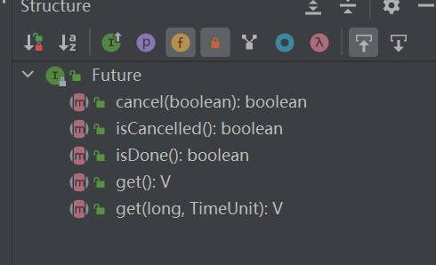
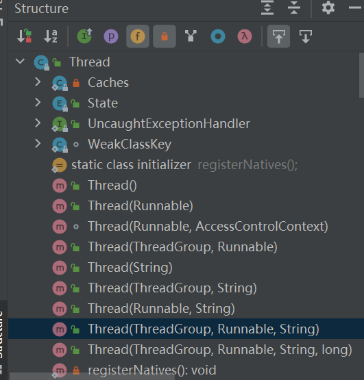
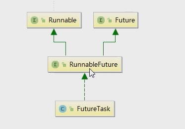
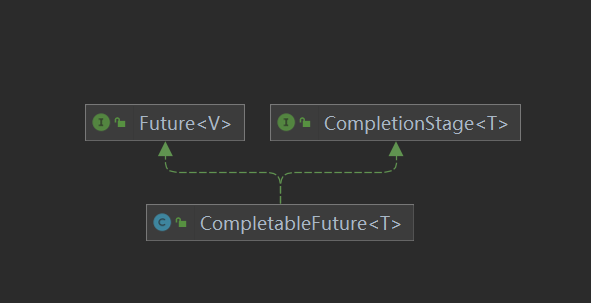

# 第2章-CompletableFuture(Completable可完成的)

## 2.1 Future接口理论知识复习

* Future(英文翻译将要发生的)接口(FutureTask实现类)定义了操作***异步任务执行一些方法***，比如获取异步任务的执行结果、取消任务的执行、判断任务是否被取消、判断任务执行是否完毕等。
* 比如主线程让一个子线程去执行热为奴，子线程可能比较耗时，启动子线程开始执行任务后，主线程就去做其他事情了，忙其他事情或者先执行完，过了一会采取获取子任务的执行结果或变更的任务状态。
* 定义了5个方法



* 一句话Future接口可以为主线程开一个分支任务，专门为主线程处理耗时和费力的复杂业务。

## 2.2 Future接口常用实现类FutureTask异步任务

### 2.2.1 Future接口能干什么

* Future是Java5新加的一个接口，它提供了一种异步并行计算的功能。

* 如果主线程需要执行一个很耗时的计算任务，我们就可以通过Future把这个任务放到异步线程中执行。

* 主线程继续处理其他任务或者先行结束，再通过Future获取计算结果。

* 异步线程任务执行有返回有结果，特点：多线程/有返回/异步任务

* 实现异步线程的接口

  * Runnable接口
    * 需要重写run方法
  * Callable接口
    * 与实现Runnable不同，需要重写call()方法，有返回值，有异常
  * Future接口和FutureTask实现类

  ```java
  class MyThread2 implements Runnable
  {
  
      @Override
      public void run() {
          
      }
  class MyThread implements Callable<String>
  {
      @Override
      public String call() throws Exception
      {
          System.out.println("-----come in call() " );
          return "hello Callable";
      }
  }
  
  ```

### 2.2.2 FutureTask

* FutureTask提供了对Future的基本实现，可以调用方法去开始和取消一个计算，可以查询计算是否完成并且获取计算结果。只有当计算完成时才能获取到计算结果，一旦计算完成，计算将不能被重启或者被取消，除非调用runAndReset方法

* API

  * FutureTask(Callable<V> callable) 构造器传入一个Callable接口实现类

  * FutureTask(Runnable runnable, V result) 构造器传入一个runnable接口实现类和返回数据类型

  * boolean isCancelled() 线程是否被取消

  * boolean isDone() 线程任务是否完成，源码显示，只要不是新建状态都返回的ture

    ```
    public boolean isDone() {
            return state != NEW;
        }
    ```

  * boolean cancel(boolean mayInterruptIfRunning) 尝试取消当前任务的执行。如果任务已经取消、已经完成或者其他原因不能取消，尝试将失败。如果任务还没有启动就调用了cancel(true)，任务将永远不会被执行。如果任务已经启动，参数mayInterruptIfRunning将决定任务是否应该中断执行该任务的线程，以尝试中断该任务。**运行中的线程还是无法被中断，只是通知线程是否可以中断了。cancel（true）调用了Thread的Interrupt方法，Interrupt只能停掉线程中sleep、wait、join的线程。因为Future中的awaitDone方法唤醒线程时，会判断Thread.interrupted()状态。**调用cancel后，state修改了，isDone就是ture。

  * V get() throws InterruptedException, ExecutionException 阻塞获取线程返回值，如果线程被中断或取消会抛出异常

  * V get(long timeout, TimeUnit unit) throws InterruptedException, ExecutionException, TimeoutException 阻塞获取线程返回值，如果线程被中断或取消或获取超时会抛出异常

* FutureTask可以处于以下三种执行状态：
  1、未启动：在FutureTask.run()还没执行之前，FutureTask处于未启动状态。当创建一个FutureTask对象，并且run()方法未执行之前，FutureTask处于未启动状态。
  2、已启动：FutureTask对象的run方法启动并执行的过程中，FutureTask处于已启动状态。
  3、已完成：FutureTask正常执行结束，或者FutureTask执行被取消(FutureTask对象cancel方法)，或者FutureTask对象run方法执行抛出异常而导致中断而结束，FutureTask都处于已完成状态。

* 当FutureTask处于未启动或者已启动的状态时，调用FutureTask对象的get方法会将导致调用线程阻塞。

* 当FutureTask处于已完成的状态时，调用FutureTask的get方法会立即返回调用结果或者抛出异常。

* 当FutureTask处于未启动状态时，调用FutureTask对象的cancel方法将导致线程永远不会被执行；

* 当FutureTask处于已启动状态时，调用FutureTask对象cancel(true)方法将以中断标志位执行此任务的线程的方式来试图停止此任务;

* 当FutureTask处于已启动状态时，调用FutureTask对象cancel(false)方法将不会对正在进行的任务产生任何影响；

* 当FutureTask处于已完成状态时，调用FutureTask对象cancel方法将返回false；

### 2.2.3 Future接口相关框架

* 需要同时满足：多线程/有返回/异步任务三个特点，
* 






* 创建一个线程通过new Thread，但是Thread的构造器，只能传Runnable，如何传Callable具有返回值的呢。
* RunnableFuture<v>，同时继承了Runnable, Future<V>。
* FutureTask则是RunnableFuture<V>的实现。
* FutureTask通过构造器传入Callable，实现具有返回值的线程。

```java
 public FutureTask(Callable<V> callable) {
        if (callable == null)
            throw new NullPointerException();
        this.callable = callable;
        this.state = NEW;       // ensure visibility of callable
    }

    /**
     * Creates a {@code FutureTask} that will, upon running, execute the
     * given {@code Runnable}, and arrange that {@code get} will return the
     * given result on successful completion.
     *
     * @param runnable the runnable task
     * @param result the result to return on successful completion. If
     * you don't need a particular result, consider using
     * constructions of the form:
     * {@code Future<?> f = new FutureTask<Void>(runnable, null)}
     * @throws NullPointerException if the runnable is null
     */
    public FutureTask(Runnable runnable, V result) {
        this.callable = Executors.callable(runnable, result);
        this.state = NEW;       // ensure visibility of callable
    }
```

### 2.2.4 Future编码实战和优缺点分析

* 优点

  * future+线程池一部多线程任务配合，能显著提高程序的执行效率

    ```java
    public class FutureAPIDemo
    {
        public static void main(String[] args) throws ExecutionException, InterruptedException, TimeoutException
        {
            FutureTask<String> futureTask = new FutureTask<String>( () -> {
                System.out.println(Thread.currentThread().getName()+"\t -----come in");
                try { TimeUnit.SECONDS.sleep(5); } catch (InterruptedException e) { e.printStackTrace(); }
                return "task over";
            });
            Thread t1 = new Thread(futureTask, "t1");
            t1.start();
    
            System.out.println(Thread.currentThread().getName()+"\t ----忙其它任务了");
    
           //get()阻塞 //System.out.println(futureTask.get());
            //System.out.println(futureTask.get(3,TimeUnit.SECONDS));
    
            while(true)
            {
                //isDone需要一直轮询
                if(futureTask.isDone())
                {
                    System.out.println(futureTask.get());
                    break;
                }else{
                    //暂停毫秒
                    try { TimeUnit.MILLISECONDS.sleep(500); } catch (InterruptedException e) { e.printStackTrace(); }
                    System.out.println("正在处理中，不要再催了，越催越慢 ，再催熄火");
                }
            }
        }
    }
    ```

* 缺点
  * get()阻塞：一旦调用get()方法求结果，如果计算没有完成容易导致程序阻塞。
  * isDone()轮询：轮询的方式会耗费无谓的CPU资源，而且不见得能及时地得到计算结果。如果想要一部获取结果，通常都会以轮询的方式去获取结果，尽量不要阻塞。
* 结论
  
  * Future对于结果的获取不是很友好，只能通过阻塞或轮询的方式得到任务的结果。

### 2.2.5 想完成一些复杂的任务

对于简单的业务场景使用Future完全OK，但如果要处理下面的复杂任务就力不从心了。

* 回调通知
  * Future完成后告诉我，这就是回调通知。
  * 通过轮询的方式获取结果CPU占用高，代码也不优雅
* 创建异步任务
  * Future+线程池配合
* 多个任务前后以来可以组合处理
  * 想要将多个一部任务的计算结果组合起来，后一个任务的计算结果依赖前一个异步任务的值的场景
  * 两个或多个一部计算合成一个一部计算，这几个一部计算相互独立，同时后面这个又以来前一个处理的结果场景。
* 对计算速度选最快
  * Future集合中某个任务最快结束时，返回结果，返回第一名处理结果。
* 其他
  * Future之前提供的API不足以支持其他复杂场景，处理起来不够优雅，这时就诞生了CompletableFuture
  * Future能做的，CompletableFuture也能做。

## 2.3 CompletableFuture对Future的改进

### 2.3.1 CompletableFuture为什么出现

* get()方法在Future计算完成之前会一直处于阻塞状态
* isDone()方法容易耗费CPU资源
* 希望异步任务通过传入回调函数，在Future结束时自动调用该回调函数，不用等待结果。
* 阻塞和异步编程的设计理念违背，轮询方式耗费无谓的CPU资源，因此JDK8设计出CompletableFuture
* CompletableFuture提供了一种观察者模式类似的机制，可以让任务执行完成后通知监听的一方。

### 2.3.2 CompletableFuture和CompletionStage源码分别介绍

* 类框架说明



```java
public class CompletableFuture<T> implements Future<T>, CompletionStage<T> {}
```

* 接口CompletionStage
  * CompletionStage代表异步计算过程中的某一个阶段，一个阶段完成后可能会出发另一个阶段。
  * 一个阶段的计算执行可能是一个Function，Consumer或者Ruanable。比如：stage.thenApply(x->square(x)).thenAccept(X->System.out.print(x)).thenRun(()->System.out.printlin())
  * 一个阶段的执行可能是被单个阶段的完出发，也可能是由多个阶段一起触发。
  * 代表异步计算过程中的某一个阶段，一个阶段完成后可能会触发另外一个阶段，有些类似Linux系统的管道分隔符传参数。
  * 通过CompletionStage接口定义了更多的方法供CompletableFuture操作实现。

* 类CompletableFuture
  * 在Java8中，CompletableFuture提供了非常强大的Future的扩展功能，看可以帮助我们简化异步编程的复杂性，并且提供了函数式编程的能力，可以通过回调的方式处理计算结果，也提供了转换和组合CompletableFuture的方法。
  * 它可能代表一个明确完成的Future，也有可能代表一个完成阶段（CompletionStage），它支持在计算完成后触发一些函数或执行某些动作。
  * 它实现了Future和CompletionStage接口。

### 2.3.3 核心的四个静态方法，来创建一个异步任务

#### 2.3.3.1 四个静态方法

* runAsync无返回值
  * public static CompletableFuture<Void> runAsync(Runnable runnable)
  * public static CompletableFuture<Void> runAsync(Runnable runnable,Executor executor)
* supplyAsync有返回值
  * public static <U> CompletableFuture<U> supplyAsync(Supplier<U> supplier)
  * public static <U> CompletableFuture<U> supplyAsync(Supplier<U> supplier,Executor executor)

2.3.3.2 静态方法参数说明

* 上述Executor executor参数说明

  * 没有指定Executor的方法，直接使用默认的ForkJoinPool.commonPool()作为它的线程池执行异步代码
  * 如果指定线程池，则使用我们自定义的或者特别指定的线程池执行异步代码

* Code（代码）

  ```java
  public class CompletableFutureBuildDemo
  {
      public static void main(String[] args) throws ExecutionException, InterruptedException
      {
  //        ExecutorService threadPool = Executors.newFixedThreadPool(3);
  
          //没有返回值,没有传入线程池，默认线程池时ForkJoinPool.commonPool，通过线程名字可以看出
          CompletableFuture<Void> completableFuture = CompletableFuture.runAsync(() -> {
              System.out.println(Thread.currentThread().getName());
              //暂停几秒钟线程
              try { TimeUnit.SECONDS.sleep(1); } catch (InterruptedException e) { e.printStackTrace(); }
          });
  
  //        传入自定义线程池
  //        CompletableFuture<Void> completableFuture = CompletableFuture.runAsync(() -> {
  //            System.out.println(Thread.currentThread().getName());
  //            //暂停几秒钟线程
  //            try { TimeUnit.SECONDS.sleep(1); } catch (InterruptedException e) { e.printStackTrace(); }
  //        },threadPool);
  
          System.out.println(completableFuture.get());
  //
          //有返回值
          CompletableFuture<String> completableFuture2 = CompletableFuture.supplyAsync(() -> {
              System.out.println(Thread.currentThread().getName());
              //暂停几秒钟线程
              try { TimeUnit.SECONDS.sleep(1); } catch (InterruptedException e) { e.printStackTrace(); }
              return "hello supplyAsync";
          });
  
          //传入自定义线程池
  /*        CompletableFuture<String> completableFuture2 = CompletableFuture.supplyAsync(() -> {
              System.out.println(Thread.currentThread().getName());
              //暂停几秒钟线程
              try { TimeUnit.SECONDS.sleep(1); } catch (InterruptedException e) { e.printStackTrace(); }
              return "hello supplyAsync";
          },threadPool);*/
  
          System.out.println(completableFuture2.get());
  
  //        threadPool.shutdown();
      }
  }
  ```

* Code(代码)之通用演示，减少阻塞和轮询

  * 从Java8开始引入了CompletableFuture，它时Future的功能增强版，减少阻塞和轮询。可以传入回调对象，当异步任务完成或者发生异常时，自动调用回调对象的回调方法。
  * 为什么默认线程池关闭，自定义线程池需要自己关闭。
    * CompletableFuture默认的线程池是守护线程，一但主程序退出，它就结束
    * 自定义线程是用户线程，不会主动结束，需要我们手动结束。

  ```java
   public static void main(String[] args) throws ExecutionException, InterruptedException
      {
  
          ExecutorService threadPool = Executors.newFixedThreadPool(3);
  
          try
          {
              CompletableFuture.supplyAsync(() -> {
                  System.out.println(Thread.currentThread().getName() + "----come in");
                  int result = ThreadLocalRandom.current().nextInt(10);
                  try { TimeUnit.SECONDS.sleep(1); } catch (InterruptedException e) { e.printStackTrace(); }
                  System.out.println("-----1秒钟后出结果：" + result);
                  if(result > 2)
                  {
                      int i=10/0;
                  }
                  return result;
              }).whenComplete((v,e) -> {
                  if (e == null) {
                      System.out.println("-----计算完成，更新系统UpdateValue："+v);
                  }
              }).exceptionally(e -> {
                  e.printStackTrace();
                  System.out.println("异常情况："+e.getCause()+"\t"+e.getMessage());
                  return null;
              });
  
              System.out.println(Thread.currentThread().getName()+"线程先去忙其它任务");
          }catch (Exception e){
              e.printStackTrace();
          }finally {
  //            threadPool.shutdown();
          }
  
  
          //主线程不要立刻结束，否则CompletableFuture默认使用的线程池会立刻关闭:暂停3秒钟线程
          //try { TimeUnit.SECONDS.sleep(3); } catch (InterruptedException e) { e.printStackTrace(); }
  
      }
  ```

* CompletableFuture特点

  * 异步任务结束时，会自动回调某个对象的方法
  * 主线程设置好回调后，不再关心异步任务的执行，异步任务之间可以顺序执行
  * 异步任务出错时，会自动回调某个对象的方法

## 2.4 案例分析(从电商网站的比价需求说开)

* 函数式编程已经主流

  * 大厂面试题

    * 你怎么理解Java多线程的？怎么处理并发？线程池有哪几个核心参数？
    * Java加锁有哪几种锁？
    * 简单说说lock？
    * hashmap的实现原理？hash冲突怎么解决？为什么使用红黑树？
    * spring里面都使用了哪些设计模式？循环依赖怎么解决？
    * 项目中哪个地方用了countdownlanch，怎么使用的？
    * JVM项目了解过吗？说说都有什么？栈里面都放什么东西？
    * 都用redis来做什么？aof和rab都什么做持久化缓存的？
    * mysql的锁机制？mysql的索引是怎么实现的？
    * spring实现事务的几种方式？
    * zookeeper怎么实现分布式锁？
    * java函数式编程用过吗？
    * 算法：求链表倒数第K个元素？

  * Lambda表达式+Stream流式调用+Chain链式调用+Java8函数式编程

    * Runnable

      * 无参数，无返回值

      ```java
      @FunctionalInterface
      public interface Runnable {
          public abstract void run();
      }
      ```

    * Function

      * 接受一个参数，并且有返回值

      ```java
      public interface Function<T, R> {
          R apply(T t);
      }
      ```

    * Consumer

      * 接受一个参数，没有返回值

      ```java
      @FunctionalInterface
      public interface Consumer<T> {
          void accept(T t);
      }
      ```

    * BiConsumer

      * 接受两个参数，没有返回值，Bi英文单词词根，代表两个的意思

      ```java
      @FunctionalInterface
      public interface BiConsumer<T, U> {
          void accept(T t, U u);
      }
      ```

    * Supplier

      * 没有参数，但是有返回值

      ```java
      @FunctionalInterface
      public interface Supplier<T> {
          T get();
      }
      ```

    * 小总结

      | 函数式接口名 | 方法名称 | 参数 | 返回值 |
      | ------------ | -------- | ---- | ------ |
      | Runnable     | run      | 0    | 无     |
      | Function     | apply    | 1    | 有     |
      | Consumer     | accept   | 1    | 无     |
      | Supplier     | get      | 0    | 有     |
      | BiConsumer   | accept   | 2    | 无     |

* 先说说join和get对比

  * 基本上没区别，get获取时会抛出检查型异常，jion不会。

  ```java
  public class CompletableFutureJionAndGetDemo {
  //    public static void main(String[] args) {
  //        CompletableFuture<String> completableFuture = CompletableFuture.supplyAsync(()->{
  //            return "Hello Word";
  //        });
  //        System.out.println(completableFuture.join());
  //    }
      public static void main(String[] args) throws ExecutionException, InterruptedException {
          CompletableFuture<String> completableFuture = CompletableFuture.supplyAsync(()->{
              return "Hello Word";
          });
          System.out.println(completableFuture.get());
      }
  }
  ```

* 说说你过去工作中的项目亮点

* 大厂业务需求说明

  ```
   * 案例说明：电商比价需求，模拟如下情况：
   *
   * 1需求：
   *  1.1 同一款产品，同时搜索出同款产品在各大电商平台的售价;
   *  1.2 同一款产品，同时搜索出本产品在同一个电商平台下，各个入驻卖家售价是多少
   *
   * 2输出：出来结果希望是同款产品的在不同地方的价格清单列表，返回一个List<String>
   * 《mysql》 in jd price is 88.05
   * 《mysql》 in dangdang price is 86.11
   * 《mysql》 in taobao price is 90.43
   
   * 3 解决方案，比对同一个商品在各个平台上的架构，要求获得一个清单列表
   * 1 step by step ，按部就班，查看京东查淘宝，查看淘宝查天猫
   * 2 all in ,万箭齐发，一口气多线程异步任务同时查询。
   
   * 4 技术要求
   *   4.1 函数式编程
   *   4.2 链式编程
   *   4.3 Stream流式计算
  ```

* 一波流Java8函数式编程带走-比价案例实战Case

  ```java
  package chapter2;
  import lombok.Getter;
  import java.util.Arrays;
  import java.util.List;
  import java.util.concurrent.CompletableFuture;
  import java.util.concurrent.ThreadLocalRandom;
  import java.util.concurrent.TimeUnit;
  import java.util.stream.Collectors;
  
  public class CompletableFutureMallDemo
  {
      static List<NetMall> list = Arrays.asList(
              new NetMall("jd"),
              new NetMall("dangdang"),
              new NetMall("taobao"),
              new NetMall("pdd"),
              new NetMall("tmall")
      );
      /**
       * step by step 一家家搜查
       * List<NetMall> ----->map------> List<String>
       * @param list
       * @param productName
       * @return
       */
      public static List<String> getPrice(List<NetMall> list,String productName)
      {
          //《mysql》 in taobao price is 90.43
          return list
                  .stream()//list 转化为流
                  .map(netMall ->
                          String.format(productName + " in %s price is %.2f",
                                  netMall.getNetMallName(),
                                  netMall.calcPrice(productName)))//map映射,传入netMall，返回String.format字符串
                  .collect(Collectors.toList());//最后手机为List
      }
  
      /**
       * List<NetMall> ----->List<CompletableFuture<String>>------> List<String>
       * @param list
       * @param productName
       * @return
       */
      public static List<String> getPriceByCompletableFuture(List<NetMall> list,String productName)
      {
          //先将netMall映射为异步任务CompletableFuture<String>
          //收集为List<CompletableFuture<String>>
          //再将List<CompletableFuture<String>>映射为String
          //再收集为List<String>
          return list.stream().map(netMall ->
                  CompletableFuture.supplyAsync(() -> String.format(productName + " in %s price is %.2f",
                  netMall.getNetMallName(),
                  netMall.calcPrice(productName))))
                  .collect(Collectors.toList())
                  .stream()
                  .map(s -> s.join())
                  .collect(Collectors.toList());
      }
  
  
      public static void main(String[] args)
      {
          long startTime = System.currentTimeMillis();
          List<String> list1 = getPrice(list, "mysql");
          for (String element : list1) {
              System.out.println(element);
          }
          long endTime = System.currentTimeMillis();
          System.out.println("----costTime: "+(endTime - startTime) +" 毫秒");
  
          System.out.println("--------------------");
  
          long startTime2 = System.currentTimeMillis();
          List<String> list2 = getPriceByCompletableFuture(list, "mysql");
          for (String element : list2) {
              System.out.println(element);
          }
          long endTime2 = System.currentTimeMillis();
          System.out.println("----costTime: "+(endTime2 - startTime2) +" 毫秒");
      }
  }
  
  class NetMall
  {
      @Getter
      private String netMallName;
  
      public NetMall(String netMallName)
      {
          this.netMallName = netMallName;
      }
  
      public double calcPrice(String productName)
      {
          try { TimeUnit.SECONDS.sleep(1); } catch (InterruptedException e) { e.printStackTrace(); }
  
          return ThreadLocalRandom.current().nextDouble() * 2 + productName.charAt(0);
      }
  }
  ```

  ```
  输出结果
  mysql in jd price is 109.98
  mysql in dangdang price is 109.62
  mysql in taobao price is 110.08
  mysql in pdd price is 109.02
  mysql in tmall price is 110.87
  ----costTime: 5092 毫秒
  --------------------
  mysql in jd price is 109.83
  mysql in dangdang price is 109.35
  mysql in taobao price is 110.51
  mysql in pdd price is 110.06
  mysql in tmall price is 109.83
  ----costTime: 1013 毫秒
  ```

  

## 2.5 CompletableFuture常用方法

### 2.5.1 获取结果和触发计算

* 获取结果

  * public T get() 
    * 一直等待获取，阻塞
  * public T get(long timeout,TimeUnit unit) 超
    * 超过时间没获取到，就报错了
  * public T join()
    * 与get()一致，知识爆出异常的问题
  * public T getNow(T valueIfAbsent)
    * 没有计算完成的情况下，给我一个替代
    * 立即获取结果不阻塞，计算完，返回计算值，没计算完，返回valueIfAbsent值

* 主动触发计算

  * public boolean complete(T value) 
    * 打断get或join方法并将返回值设置为value值，通过get或jion方法获取的值为value。

  ```java
  package chapter2;
  
  import java.util.concurrent.CompletableFuture;
  import java.util.concurrent.ExecutionException;
  import java.util.concurrent.TimeUnit;
  import java.util.concurrent.TimeoutException;
  
  public class CompletableFutureAPIDemo
  {
      public static void main(String[] args) throws ExecutionException, InterruptedException
      {
          group1();
      }
  
      /**
       * 获得结果和触发计算
       * @throws InterruptedException
       * @throws ExecutionException
       */
      private static void group1() throws InterruptedException, ExecutionException
      {
          CompletableFuture<String> completableFuture = CompletableFuture.supplyAsync(() -> {
              //暂停几秒钟线程
              try {
                  TimeUnit.SECONDS.sleep(1);
              } catch (InterruptedException e) {
                  e.printStackTrace();
              }
              return "abc";
          });
  
          //System.out.println(completableFuture.get());
          //System.out.println(completableFuture.get(2L,TimeUnit.SECONDS));
          //System.out.println(completableFuture.join());
  
  
          //System.out.println(completableFuture.getNow("xxx"));
  
          //暂停几秒钟线程
          //try { TimeUnit.SECONDS.sleep(2); } catch (InterruptedException e) { e.printStackTrace(); }
          System.out.println(completableFuture.complete("completeValue")+"\t"+completableFuture.join());//单一拿结果为ture  completeValue
      }
  }
  
  ```

### 2.5.2 对计算结果进行处理

* thenApply

  * 计算结果存在依赖关系，这两个线程串行化

  * 参数时Function，传递一个参数

  * 异常相关

    * 由于存在依赖关系(当前步错，不走下一步)，当前步骤有异常的话就叫停

  * code

    ```java
    package chapter2;
    import java.util.concurrent.CompletableFuture;
    import java.util.concurrent.ExecutorService;
    import java.util.concurrent.Executors;
    import java.util.concurrent.TimeUnit;
    
    public class CompletableFutureAPI2Demo
    {
        public static void main(String[] args)
        {
            ExecutorService threadPool = Executors.newFixedThreadPool(3);
    
            CompletableFuture.supplyAsync(() ->{
                //暂停几秒钟线程
                try { TimeUnit.SECONDS.sleep(1); } catch (InterruptedException e) { e.printStackTrace(); }
                System.out.println("111");
                return 1;
            },threadPool).thenApply((f) -> {
                int i=10/0;
                System.out.println("222");
                return f + 2;
            }).thenApply((f) -> {
                System.out.println("333");
                return f + 3;
            }).whenComplete((v,e) -> {
                if (e == null) {
                    System.out.println("----计算结果： "+v);
                }
            }).exceptionally(e -> {
                e.printStackTrace();
                System.out.println(e.getMessage());
                return null;
            });
            System.out.println(Thread.currentThread().getName()+"----主线程先去忙其它任务");
            threadPool.shutdown();
        }
    }
    ```

    ```java
    输出结果，到达第二步时，已经结束。
    
    main----主线程先去忙其它任务
    111
    java.lang.ArithmeticException: / by zero
    java.util.concurrent.CompletionException: java.lang.ArithmeticException: / by zero
    	at java.util.concurrent.CompletableFuture.encodeThrowable(CompletableFuture.java:273)
    	at java.util.concurrent.CompletableFuture.completeThrowable(CompletableFuture.java:280)
    	at java.util.concurrent.CompletableFuture.uniApply(CompletableFuture.java:604)
    	at java.util.concurrent.CompletableFuture$UniApply.tryFire(CompletableFuture.java:577)
    	at java.util.concurrent.CompletableFuture.postComplete(CompletableFuture.java:474)
    	at java.util.concurrent.CompletableFuture$AsyncSupply.run(CompletableFuture.java:1595)
    	at java.util.concurrent.ThreadPoolExecutor.runWorker(ThreadPoolExecutor.java:1142)
    	at java.util.concurrent.ThreadPoolExecutor$Worker.run(ThreadPoolExecutor.java:617)
    	at java.lang.Thread.run(Thread.java:745)
    Caused by: java.lang.ArithmeticException: / by zero
    	at chapter2.CompletableFutureAPI2Demo.lambda$main$1(CompletableFutureAPI2Demo.java:55)
    	at java.util.concurrent.CompletableFuture.uniApply(CompletableFuture.java:602)
    	... 6 more
    ```

    

* handle

  * 计算结果存在依赖关系，这两个线程串行化

  * 参数时BiFunction，传递两个的参数

  * 异常相关

    * 有异常也可以往下一步走，根据带的异常参数可以进行处理。

  * code

    ```java
    package chapter2;
    import java.util.concurrent.CompletableFuture;
    import java.util.concurrent.ExecutorService;
    import java.util.concurrent.Executors;
    import java.util.concurrent.TimeUnit;
    public class CompletableFutureAPI2Demo
    {
        public static void main(String[] args)
        {
            ExecutorService threadPool = Executors.newFixedThreadPool(3);
    
            CompletableFuture.supplyAsync(() ->{
                //暂停几秒钟线程
                try { TimeUnit.SECONDS.sleep(1); } catch (InterruptedException e) { e.printStackTrace(); }
                System.out.println("111");
                return 1;
            },threadPool).handle((f,e) -> {
                int i=10/0;
                System.out.println("222");
                return f + 2;
            }).handle((f,e) -> {
                System.out.println("333");
                return f + 3;
            }).whenComplete((v,e) -> {
                if (e == null) {
                    System.out.println("----计算结果： "+v);
                }
            }).exceptionally(e -> {
                e.printStackTrace();
                System.out.println(e.getMessage());
                return null;
            });
    
            System.out.println(Thread.currentThread().getName()+"----主线程先去忙其它任务");
    
            threadPool.shutdown();
        }
    }
    ```

    ```
    输出结果，可以完全执行
    
    main----主线程先去忙其它任务
    111
    333
    java.lang.NullPointerException
    java.util.concurrent.CompletionException: java.lang.NullPointerException
    	at java.util.concurrent.CompletableFuture.encodeThrowable(CompletableFuture.java:273)
    	at java.util.concurrent.CompletableFuture.completeThrowable(CompletableFuture.java:280)
    	at java.util.concurrent.CompletableFuture.uniHandle(CompletableFuture.java:824)
    	at java.util.concurrent.CompletableFuture$UniHandle.tryFire(CompletableFuture.java:797)
    	at java.util.concurrent.CompletableFuture.postComplete(CompletableFuture.java:474)
    	at java.util.concurrent.CompletableFuture$AsyncSupply.run(CompletableFuture.java:1595)
    	at java.util.concurrent.ThreadPoolExecutor.runWorker(ThreadPoolExecutor.java:1142)
    	at java.util.concurrent.ThreadPoolExecutor$Worker.run(ThreadPoolExecutor.java:617)
    	at java.lang.Thread.run(Thread.java:745)
    Caused by: java.lang.NullPointerException
    	at chapter2.CompletableFutureAPI2Demo.lambda$main$2(CompletableFutureAPI2Demo.java:25)
    	at java.util.concurrent.CompletableFuture.uniHandle(CompletableFuture.java:822)
    	... 6 more
    ```

* 总结

  * exceptionally相当于try/catch
  * whenComplete和handle相当于try/finally

### 2.5.3 对计算结果进行消费

* 接受任务的处理结果，并消费处理，无返回结果。

* thenAccept

* 对比补充

  * Code之任务之间的顺序执行

    * thenRun
      * thenRun(Runnable runnable) 
      * 任务A执行完执行B，并且B不需要A的结果
    * thenAccept
      * thenAccept(Consumer consumer ) 
      * 任务A执行完执行B，B需要A的结果，但是B无返回值
    * thenApply
      * thenApply(Function function) 
      * 任务A执行完执行B，B需要A的结果，同时任务B有返回值
    * code

    ```java
    public class CompletableFutureAPI3Demo
    {
        public static void main(String[] args)
        {
            System.out.println(CompletableFuture.supplyAsync(() -> "resultA").thenRun(() -> {}).join());
            System.out.println(CompletableFuture.supplyAsync(() -> "resultA").thenAccept(r -> System.out.println(r)).join());
            System.out.println(CompletableFuture.supplyAsync(() -> "resultA").thenApply(r -> r + "resultB").join());
    
        }
    }
    ```

    ```
    输出结果
    
    null
    resultA
    null
    resultAresultB
    ```

    

* CompletableFuture和线程池说明

  * 以thenRun和thenRunAsync为例，有什么区别？

    * thenRun和thenRunAsync执行的线程池不一样，thenRunAsync使用的默认的ForkJoinPool，而thenRun根据情况不同使用不同的线程池。

  * code

    ```java
    package chapter2;
    
    import java.util.concurrent.*;
    
    public class CompletableFutureWithThreadPoolDemo
    {
        public static void main(String[] args)
        {
            ExecutorService threadPool = Executors.newFixedThreadPool(5);
    
            try
            {
                CompletableFuture<Void> completableFuture = CompletableFuture.supplyAsync(() -> {
                    try { TimeUnit.MILLISECONDS.sleep(20); } catch (InterruptedException e) { e.printStackTrace(); }
                    System.out.println("1号任务" + "\t" + Thread.currentThread().getName());
                    return "abcd";
                },threadPool).thenRunAsync(() -> {
                    try { TimeUnit.MILLISECONDS.sleep(20); } catch (InterruptedException e) { e.printStackTrace(); }
                    System.out.println("2号任务" + "\t" + Thread.currentThread().getName());
                }).thenRun(() -> {
                    try { TimeUnit.MILLISECONDS.sleep(10); } catch (InterruptedException e) { e.printStackTrace(); }
                    System.out.println("3号任务" + "\t" + Thread.currentThread().getName());
                }).thenRun(() -> {
                    try { TimeUnit.MILLISECONDS.sleep(10); } catch (InterruptedException e) { e.printStackTrace(); }
                    System.out.println("4号任务" + "\t" + Thread.currentThread().getName());
                });
                System.out.println(completableFuture.get(2L, TimeUnit.SECONDS));
            }catch (Exception e){
                e.printStackTrace();
            }finally {
                threadPool.shutdown();
            }
        }
    }
    
    ```

    ```
    输出结果
    
    1号任务	pool-1-thread-1
    2号任务	pool-1-thread-1
    3号任务	pool-1-thread-1
    4号任务	pool-1-thread-1
    null
    ```

  * 小总结

    * 没传入自定义线程池，都用默认线程池ForkJoinPool;
    * 传入了自定义线程池，如果你执行第一个任务的时候，传入了一个自定义线程池，调用thenRun方法执行第二个任务时，与第一个任务时共用一个线程池。只要调用了thenRunAsync执行，第一个任务使用的是你自己传入的线程，第二个任务使用的是ForkJoinPool线程池。
    * 也有可能处理太快，系统优化切换原则，直接使用main线程处理。
    * thenAccept和thenAcceptAsync，thenApply和thenApplyAsync等，它们之间的区别也是一样的。

  * 源码分析

    ```java
    //系统的cpu的核数   
    private static final boolean useCommonPool =
            (ForkJoinPool.getCommonPoolParallelism() > 1);
    
        /**
         * Default executor -- ForkJoinPool.commonPool() unless it cannot
         * support parallelism.
         */
    //正常核数都是大于1的，所以默认是ForkJoinPool.commonPool()
        private static final Executor asyncPool = useCommonPool ?
            ForkJoinPool.commonPool() : new ThreadPerTaskExecutor();
    
        public CompletableFuture<Void> thenRun(Runnable action) {
            return uniRunStage(null, action);
        }
    
    //调用thenRunAsync会重新赋值线程池。正常核数都是大于1的，所以默认线程池是ForkJoinPool.commonPool()
        public CompletableFuture<Void> thenRunAsync(Runnable action) {
            return uniRunStage(asyncPool, action);
        }
    ```

### 2.5.4 对计算速度进行选用

* 谁快用谁

* applyToEither

* code

  ```java
  package chapter2;
  
  import java.util.concurrent.CompletableFuture;
  import java.util.concurrent.TimeUnit;
  public class CompletableFutureFastDemo
  {
      public static void main(String[] args)
      {
          CompletableFuture<String> playA = CompletableFuture.supplyAsync(() -> {
              System.out.println("A come in");
              try { TimeUnit.SECONDS.sleep(3); } catch (InterruptedException e) { e.printStackTrace(); }
              return "playA";
          });
  
          CompletableFuture<String> playB = CompletableFuture.supplyAsync(() -> {
              System.out.println("B come in");
              try { TimeUnit.SECONDS.sleep(1); } catch (InterruptedException e) { e.printStackTrace(); }
              return "playB";
          });
          CompletableFuture<String> result = playA.applyToEither(playB, f -> {
              return f + " is winer";
          });
  
          System.out.println(Thread.currentThread().getName()+"\t"+"-----: "+result.join());
      }
  }
  ```

  ```
  输出结果
  
  A come in
  B come in
  main	-----: playB is winer
  ```

### 2.5.5 对计算结果进行合并

* 两个CompletionStage任务都完成后，最终能把两个任务的结果一起交给thenCombine来处理

* 先完成的先等着，等待其他分支任务

* thenCombine

  * code标准版，好理解先拆分

    ```java
    package chapter2;
    import java.util.concurrent.CompletableFuture;
    import java.util.concurrent.TimeUnit;
    public class CompletableFutureCombineDemo
    {
        public static void main(String[] args)
        {
            CompletableFuture<Integer> completableFuture1 = CompletableFuture.supplyAsync(() -> {
                System.out.println(Thread.currentThread().getName() + "\t ---启动");
                //暂停几秒钟线程
                try {
                    TimeUnit.SECONDS.sleep(1);
                } catch (InterruptedException e) {
                    e.printStackTrace();
                }
                return 10;
            });
            CompletableFuture<Integer> completableFuture2 = CompletableFuture.supplyAsync(() -> {
                System.out.println(Thread.currentThread().getName() + "\t ---启动");
                //暂停几秒钟线程
                try {
                    TimeUnit.SECONDS.sleep(2);
                } catch (InterruptedException e) {
                    e.printStackTrace();
                }
                return 20;
            });
            CompletableFuture<Integer> result = completableFuture1.thenCombine(completableFuture2, (x, y) -> {
                System.out.println("-----开始两个结果合并");
                System.out.println("x="+x);
                System.out.println("y="+y);
                return x + y;
            });
            System.out.println(result.join());
        }
    }
    
    ```

    ```
    输出结果
    
    ForkJoinPool.commonPool-worker-1	 ---启动
    ForkJoinPool.commonPool-worker-2	 ---启动
    -----开始两个结果合并
    x=10
    y=20
    30
    ```

  * code表达式

    ```java
    public static void biaodashiban()
        {
            CompletableFuture<Integer> completableFuture1 = CompletableFuture.supplyAsync(() -> {
                System.out.println(Thread.currentThread().getName() + "\t ---启动");
                //暂停几秒钟线程
                try {
                    TimeUnit.SECONDS.sleep(1);
                } catch (InterruptedException e) {
                    e.printStackTrace();
                }
                return 10;
            }).thenCombine( CompletableFuture.supplyAsync(() -> {
                System.out.println(Thread.currentThread().getName() + "\t ---启动");
                //暂停几秒钟线程
                try {
                    TimeUnit.SECONDS.sleep(2);
                } catch (InterruptedException e) {
                    e.printStackTrace();
                }
                return 20;
            }), (x, y) -> {
                System.out.println("-----开始两个结果合并");
                System.out.println("x="+x);
                System.out.println("y="+y);
                return x + y;
            });
    
            System.out.println(completableFuture1.join());
        }
    ```

    ```
    输出结果
    
    ForkJoinPool.commonPool-worker-1	 ---启动
    ForkJoinPool.commonPool-worker-2	 ---启动
    -----开始两个结果合并
    x=10
    y=20
    30
    ```

    