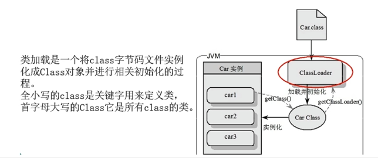
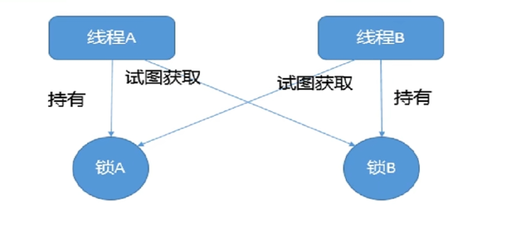

# 第3章-锁


## 3.1 大场面试题复盘

* 你怎么理解Java多线程的？怎么处理并发？线程池有哪几个核心参数？

* Java加锁有哪几种锁？
* 简单说说lock？
* HashMap的实现原理？hash冲突怎么解决？为什么使用红黑树？
* 项目中那个地方用了countdownlanch，怎么使用的？

## 3.2 乐观锁和悲观锁

* 悲观锁

  * 认为自己在使用数据时一定会有别的线程来修改数据，因此在获取数据的时候会先加锁，确保数据不会被别的线程修改。
  * synchronized关键字和Lock的实现类都是悲观锁。
  * 适合写操作多的场景，先加索可以保证写操作时数据正确。
  * 显式的锁定之后再操作同步资源

* 乐观锁

  * 认为自己在是应用数据时不会有别的线程修改数据或资源，所以不会添加锁。
  * 在Java中是通过使用无锁编程来实现，只有在更新数据的时候去判断，之前有没有别的线程更新了这个数据。
  * 如果这个数据没有被更新，当前线程将自己修改的数据成功写入。
  * 如果这个数据已经被其他线程更新，则根据不同的实现方式执行不同的操作，比如放弃修改、重试抢锁等等。
  * 判断规则：版本号机制Version或最常采用的是CAS（Compare-and-Swap，即比较并替代）算法，Java原子类中的递归操作就是通过CAS自旋实现的。
  * 适合读操作多的场景，不加锁的特点能够使其读操作的性能大幅提升。

* 伪代码说明

  ```java
  //悲观锁的调用方式
  public synchronized void m1(){
  //加锁后的业务逻辑
  }
  //保证多个线程使用的是同一个Lock对象的前提下
  ReentrantLock lock = new ReentrantLock();
  public void m2(){
  	lock.lock();
  	tyr{
  		//操作同步资源
  	}finally{
  		lock.unlock();
  	}
  }
  
  //乐观锁的调用方式
  //保证多个线程使用的是同一个AtomicInteger
  private AtomicInteger atomicInteger = new AtomicInteger();
  atomicInteger.incrementAndGet();
  ```

## 3.3 8中情况演示锁运行

* 锁相关的8中案例演示code

  ```
  /**
   * 题目：谈谈你对多线程锁的理解,8锁案例说明
   * 口诀：线程   操作  资源类
   * 8锁案例说明：
   * 1 一个对象都是有多个非静态synchronized方法，多个线程去访问不同的方法。
   * 2 在1的基础上，第一个线程睡眠3秒钟
   * 3 在2的基础上添加一个普通方法
   * 4 在1的基础上，创造两个对象
   * 5 有两个静态同步方法
   * 6 有两个静态同步方法，两个对象
   * 7 有1个静态同步方法，1个非静态同步方法
   * 8 有1个静态同步方法，1个非静态同步方法，两个对象
   *
   * 笔记总结：
   * 1-2
   *  *  *  一个对象里面如果有多个synchronized方法，某一个时刻内，只要一个线程去调用其中的一个synchronized方法了，
   *  *  *  其它的线程都只能等待，换句话说，某一个时刻内，只能有唯一的一个线程去访问这些synchronized方法
   *  *  *  锁的是当前对象this，被锁定后，其它的线程都不能进入到当前对象的其它的synchronized方法
   *  3-4
   *  *  加个普通方法后发现和同步锁无关
   *  *  换成两个对象后，不是同一把锁了，情况立刻变化。
   *
   *  5-6 都换成静态同步方法后，情况又变化
   *  三种 synchronized 锁的内容有一些差别:
   * 对于普通同步方法，锁的是当前实例对象，通常指this,具体的一部部手机,所有的普通同步方法用的都是同一把锁——>实例对象本身，
   * 对于静态同步方法，锁的是当前类的Class对象，如Phone.class唯一的一个模板
   * 对于同步方法块，锁的是 synchronized 括号内的对象
   *
   * *  7-8
   *  *    当一个线程试图访问同步代码时它首先必须得到锁，正常退出或抛出异常时必须释放锁。
   *  *  *
   *  *  *  所有的普通同步方法用的都是同一把锁——实例对象本身，就是new出来的具体实例对象本身,本类this
   *  *  *  也就是说如果一个实例对象的普通同步方法获取锁后，该实例对象的其他普通同步方法必须等待获取锁的方法释放锁后才能获取锁。
   *  *  *
   *  *  *  所有的静态同步方法用的也是同一把锁——类对象本身，就是我们说过的唯一模板Class
   *  *  *  具体实例对象this和唯一模板Class，这两把锁是两个不同的对象，所以静态同步方法与普通同步方法之间是不会有竞态条件的
   *  *  *  但是一旦一个静态同步方法获取锁后，其他的静态同步方法都必须等待该方法释放锁后才能获取锁。
   */
  ```

  * 小结

    * 阿里开发手册，【强制】高并发时，同步调用应该去考量锁的性能损耗。能用无所数据结构，就不要用锁；能锁区块，就不要锁整个方法体，能用对象锁，就不要用类锁。尽可能使加锁的代码块工作量尽可能的小，避免在锁代码块中调用RPC方法。

    

* synchronized有三种应用方式

  * JDK源码（notify方法）说明举例

  

  * 8中锁的案例实际体现在3个地方
    * 作用于实例方法，当前实例加锁，进入同步代码前要获得当前实例的锁。
    * 作用于代码块，对括号里配置的对象加锁。
    * 作用域静态方法，当前类加锁，进去同步代码前要获得当前类对象的锁。

* 从字节码角度分析synchronized实现

  * javap -c ***.class文件反编译，javap -v或verbose 输出附加信息（包括行号，本地变量表，反汇编等详细信息）
  * synchronized同步代码块
    * 使用的monitorenter和monitorexit指令实现
    * 一般情况1个enter对应两个exit，是因为异常时也能释放锁
    * 极端情况只有1个enter和1个exit（只有抛出异常时释放锁的代码）

  

  

  * synchronized普通同步方法
    * 调用指令将会检查方法的ACC_SYNCHRONIZED访问标志是否被设设置。如果设置了，执行线程会将先持有monitor锁，然后再在执行方法，最后再方法完成时（无论正常还是异常完成）释放monitor。
  * synchronized静态同步方法
    * ACC_STATIC,ACC_SYNCHRONIZED访问标志区分该方法是否静态同步方法。

  

* 反编译synchronized锁的是什么

  * HotSpot虚拟机追踪，monitor采用ObjectMonitor实现
  * 每个对象天生都带一个对象监视器
  * 每一个被锁住的对象都会和Monitor关联起来

  

  

* 对于synchronized关键字，synchronized与锁升级章节还会深度讲解

  

  

## 3.4 公平锁和非公平锁

* 何为公平锁/非公平锁
  * 公平锁
    * 指多个线程按照申请锁的顺序来获取锁，Lock lock = new ReetrantLock(true)，表示公平锁，先来先得
  * 非公平锁
    * 指多个线程获取锁的顺序并不是按照申请锁的顺序，有可能后申请的线程比先申请的线程优先获取锁，在高并发环境下，有可能造成优先级翻转或则饥饿的状态（某一个线程一直得不到锁）
    * Lock lock = new ReetrantLock(false)；表示非公平锁，后俩的也可能先获得锁
    * Lock lock = new ReetrantLock()；//默认非公平锁
* 为什么会有公平锁／非公平锁的设计？为什么默认非公平？
  * 恢复挂起的线程到真正锁的获取还是有时间差的，从开发人员来看这个时间微乎其微，但是从CPU的角度来看，这个时间差存在的还是很明显的。所以非公平锁能更充分的利用CPU的时间片，尽量减少CPU空闲状态时间。
  * 使用多线程很重要的考量点是线程切换的开销，当采用非公平锁时，当1个线程请求锁获取同步状态，然后释放同步状态，所以刚释放锁的线程在此刻再次获取同步状态的概率就变得非常大，所以就减少了线程的开销。
* 什么时候用公平/非公平
  * 提高吞吐量，使用非公平锁，节省线程切换时间。
  * 否则使用公平锁，公平使用
* 公平锁也非绝对公平，线程初期也是非公平的，之后往后运行时间长了，才公平。

### 3.5.3 AQS


## 3.5 可重入锁（递归锁）

### 3.5.1 说明

* 可重入锁又名递归锁，是指在同一个线程在外层方法获取锁的时候，再进入该线程的内层方法会自动获取锁（前提，锁对象得是同一个对象），不会因为之前已经获取过还没释放而阻塞。
* 如果1个synchronized修饰的递归方法调用，程序第2此不能进行，被自己阻塞，那不就造成死锁了。
* Java中ReetrantLock和synchronized都是可重入锁，可重入锁的一个优点就是可一定程度避免死锁。

### 3.5.2 可重入锁这四个字分开来解释

* 可：可以
* 重：再次
* 入：进入
* 锁：同步锁
* 进入什么：进入同步域（即同步代码块/方法或显示锁锁定的代码）
* 一句话：一个线程中的多个流程可以获取同一把锁，持有这把同步锁可以再次进入。自己可以获取自己的内部锁。

### 3.5.3 可重入锁种类

* 隐式锁

  * 即synchronized关键字使用的锁，默认是可重入锁
  * 指的是可重复可递归调用的锁，在外层使用锁之后，在内层仍然可以使用，并且不发生死锁，这样的锁就叫可重入锁
  * 简单来说就是：在一个synchronized修饰的方法或代码块的内部调用本类的其他synchrozied修饰的方法或代码块时，是永远可以得到锁的

  同步块

  ```java
  
  private static void reEntryM1()
      {
          final Object object = new Object();
  
          new Thread(() -> {
              synchronized (object){
                  System.out.println(Thread.currentThread().getName()+"\t ----外层调用");
                  synchronized (object){
                      System.out.println(Thread.currentThread().getName()+"\t ----中层调用");
                      synchronized (object){
                          System.out.println(Thread.currentThread().getName()+"\t ----内层调用");
                      }
                  }
              }
          },"t1").start();
      }
  ```

  ```
  t1	 ----外层调用
  t1	 ----中层调用
  t1	 ----内层调用
  ```

  同步方法

  ```java
      public synchronized void m1()
      {
          //指的是可重复可递归调用的锁，在外层使用锁之后，在内层仍然可以使用，并且不发生死锁，这样的锁就叫做可重入锁。
          System.out.println(Thread.currentThread().getName()+"\t ----come in");
          m2();
          System.out.println(Thread.currentThread().getName()+"\t ----end m1");
      }
      public synchronized void m2()
      {
          System.out.println(Thread.currentThread().getName()+"\t ----come in");
          m3();
      }
      public synchronized void m3()
      {
          System.out.println(Thread.currentThread().getName()+"\t ----come in");
      }
  ```

  ```
  main	 ----come in
  main	 ----come in
  main	 ----come in
  main	 ----end m1
  ```

* 显示锁

  * 即Lock，也有ReentrantLock这样的可重入锁。

* synchronized的重入的实现原理

  * 为什么任何一个对象都可以成为一个锁
    * 每个锁对象拥有一个锁计数器和一个指向持有该锁的线程指针。
    * 当执行monitorenter时，如果目标锁对象的计数器为零，那么说明它没有被其他线程所持有，Java虚拟机会将该锁对象的持有线程设置为当前线程，并且将其计数器加1。
    * 在目标锁对象的计数器不为零的情况下，如果锁对象的持有线程是当前线程，那么Java虚拟机可以将其计数器加1，否则需要等待，直至持有线程释放该锁。
    * 当执行monitorexit时，Java虚拟机则需将锁对象的计数器减1。计数器为零代表锁已被释放。
  * objectMonitor.hpp

  

  

如果锁的次数与释放的次数不匹配，也会导致死锁。加锁几次就要解锁几次

```java
 new Thread(() -> {
            lock.lock();
            try
            {
                System.out.println(Thread.currentThread().getName()+"\t ----come in外层调用");
                lock.lock();
                try
                {
                    System.out.println(Thread.currentThread().getName()+"\t ----come in内层调用");
                }finally {
                    lock.unlock();
                }

            }finally {
                // 由于加锁次数和释放次数不一样，第二个线程始终无法获取到锁，导致一直在等待。
                //lock.unlock();// 正常情况，加锁几次就要解锁几次
            }
        },"t1").start();

        new Thread(() -> {
            lock.lock();
            try
            {
                System.out.println(Thread.currentThread().getName()+"\t ----come in外层调用");
            }finally {
                lock.unlock();
            }
        },"t2").start();
```

```
t1	 ----come in外层调用
t1	 ----come in内层调用
```

## 3.6 死锁排查

### 3.6.1 什么是死锁

* **概念：**死锁是指两个或两个以上的线程在执行过程中，因为争夺资源而造成的一种互相等待的现象，若无外力干涉那他们将无法推进下去，如果系统资源充足，进程的资源请求能够得到满足，死锁出现的可能性就很低，否则就会因为争夺有限的资源而陷入死锁。



* 产生死锁的主要原因
  * 系统资源不足
  * 进程运行推进的顺序不合适
  * 资源分配不当

### 3.6.2 死锁code

```java
public static void main(String[] args)
    {
        final Object objectA = new Object();
        final Object objectB = new Object();

        new Thread(() -> {
            synchronized (objectA){
                System.out.println(Thread.currentThread().getName()+"\t 自己持有A锁，希望获得B锁");
                try { TimeUnit.SECONDS.sleep(1); } catch (InterruptedException e) { e.printStackTrace(); }
                synchronized (objectB){
                    System.out.println(Thread.currentThread().getName()+"\t 成功获得B锁");
                }
            }
        },"A").start();

        new Thread(() -> {
            synchronized (objectB){
                System.out.println(Thread.currentThread().getName()+"\t 自己持有B锁，希望获得A锁");
                try { TimeUnit.SECONDS.sleep(1); } catch (InterruptedException e) { e.printStackTrace(); }
                synchronized (objectA){
                    System.out.println(Thread.currentThread().getName()+"\t 成功获得A锁");
                }
            }
        },"B").start();
    }
```

### 3.6.3 如何排查死锁

* 纯命令
  * jps -l 查看当前java运行的程序
  * jstack 进程编号    通过上面一行命令获取到进程编号，打印线程栈信息，然后分析
* 图形化
  * 使用jconsole查看死锁情况

## 3.7 写锁（独占锁）/读锁（共享锁）

跳转到13章

## 3.8 自旋锁SpinLock

跳转到第7章

## 3.9 无锁-->独占锁-->读写锁-->邮戳锁

跳转到13章，StampedLock邮戳锁

## 3.10 无锁-->偏向锁-->轻量锁-->重量锁

跳转到11章

## 3.11 小结

* 8中案例运行，锁是什么：对象锁、类锁
* 公平锁与非公平锁
* 可重入锁（递归锁）
* 死锁及排查
* 为什么任何一个对象都可以成为一个锁
  * 每个锁对象拥有一个锁计数器和一个指向持有该锁的线程指针。
  * 当执行monitorenter时，如果目标锁对象的计数器为零，那么说明它没有被其他线程所持有，Java虚拟机会将该锁对象的持有线程设置为当前线程，并且将其计数器加1。
  * 在目标锁对象的计数器不为零的情况下，如果锁对象的持有线程是当前线程，那么Java虚拟机可以将其计数器加1，否则需要等待，直至持有线程释放该锁。
  * 当执行monitorexit时，Java虚拟机则需将锁对象的计数器减1。计数器为零代表锁已被释放。