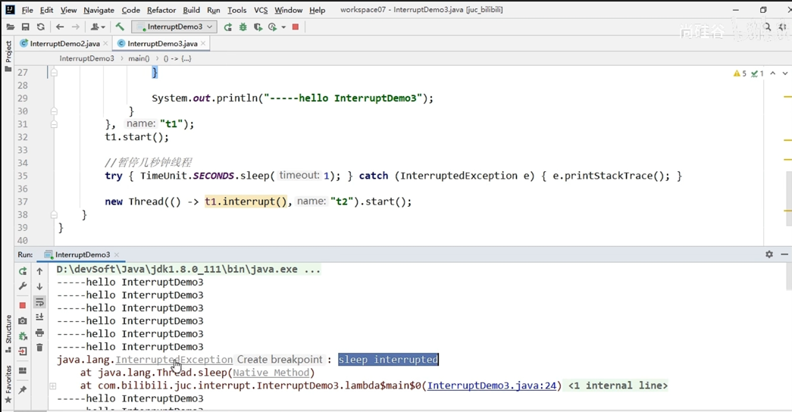
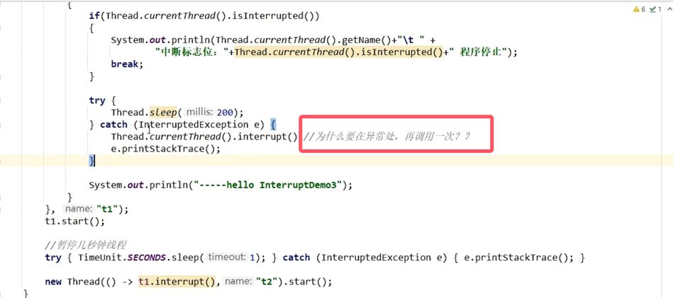
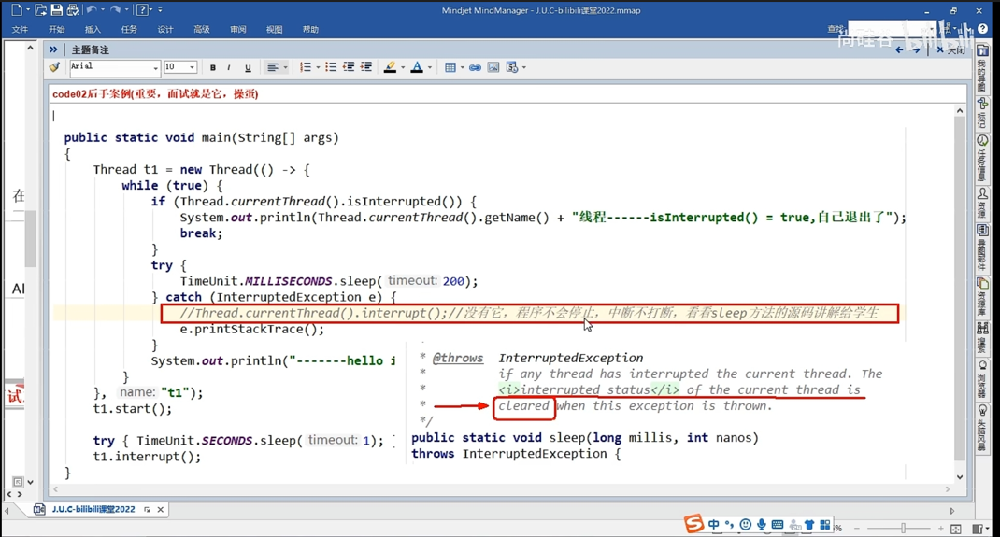

# 第4章-LockSupport与线程中断

## 4.1 内容简介

* LockSupport
  * 是一个实现类，位于java.util.concurrent.locks下面
* 线程中断机制
  * void interrupt()
  * static boolean interrupted()
  * boolean isInterrupted()

## 4.2 线程中断机制

* 从阿里蚂蚁金服面试题讲起

  * 如何中断一个运行中的线程？
  * 如何停止一个运行中的线程？

* 什么是中断机制

  * 首先一个线程不应该由其他线程来强制中断或停止，而是应该由线程自己自行停止，自己来决定自己的命运。所以，Thread.stop,Thread.suspend,Thread.resume 都已经被废弃了。
  * 其次在Java中没有办法立即停止一条线程，然而停止线程却显得尤为重要，如取消一个耗时操作。因此，Java提供了一种用于停止线程的协商机制－－中断，也即中断标识协商机制。
  * 中断只是一种协作协商机制，Java没有给中断增加任何语法，中断的过程完全需要程序员自己实现。
  * 若要中断一个线程，你需要手动调用该线程的interrupt方法，该方法也仅仅是将线程对象的中断标识设成true;
  * 接着你需要自己写代码不断地检测当前线程的标识位，如果为true,表示别的线程请求这条线程中断，
  * 此时究竟该做什么需要你自己写代码实现。
  * 每个线程对象中都有一个中断标识位，用于表示线程是否被中断；该标识位为true表示中断，为false表示未中断；
  * 通过调用线程对象的interrupt方法将该线程的标识位设为true;可以在别的线程中调用，也可以在自己的线程中调用。

* 中断的相关API方法之三大方法说明

  * public void interrupt()
    * 实例方法，仅仅设置线程的中断状态为true，发起一个协商而不会立刻停止线程。
    
    * 如果线程处于正常活动状态，调用interrupt()会将该线程的中断标志设置为ture，仅此而已。
    
    * 如果线程处于被阻塞状态比如（sleep、wait、join等状态），在别的线程中调用当前线程对象的interrupt()方法，那么线程将立即退出被阻塞状态，并抛出一个interruptedException异常。所以在调用sleep会抛出interruptedException异常，异常时需要重新调用interrupt()方法，来确保中断标志位是正常的。
    
      
    
    
    
      
  * public static boolean interrupted()
    * 静态方法，Thread.interrupted()判断线程是否被中断并清除当前中断状态。次方法做两件事。1、返回当前线程的中断状态，测试当前线程是否已被中断。2、将当前线程的中断状态清零并重新设置为false，清楚线程的中断状态。
    * 此方法有点不好理解，如果连续两次调用此方法，则第二次调用将返回false，因为连续调用两次的结果可能不一样。
  * boolean isInterrupted()
    
    * 实例方法，判断当前线程是否被中断（通过检查中断标志位）
  
  ```java
  public void interrupt() {
          if (this != Thread.currentThread())
              checkAccess();
  
          synchronized (blockerLock) {
              Interruptible b = blocker;
              if (b != null) {
                  interrupt0();           // Just to set the interrupt flag,最后还是调用的本地方法
                  b.interrupt(this);
                  return;
              }
          }
          interrupt0();
      }
  ```


* 大厂面试题中断机制考点

  * 如何停止中断运行中的线程？
    * 通过一个volatile变量实现
    * 通过AtomicBoolean
    * 通过Thread类自带的中断API实例方法实现
      * 需要不断监视Thread.currentThread().isInterrupted()状态
      * 如果线程处于正常活动状态，调用interrupt()会将该线程的中断标志设置为ture，仅此而已。
      * 如果线程处于被阻塞状态比如（sleep、wait、join等状态），在被的线程中调用当前线程对象的interrupt()方法，那么线程将立即退出被阻塞状态，并抛出一个interruptedException异常

  ```java
  public class InterruptDemo
  {
      static volatile boolean isStop = false;
      static AtomicBoolean atomicBoolean = new AtomicBoolean(false);
  
      public static void main(String[] args)
      {
          //通过Thread类自带的中断API实例方法实现
          Thread t1 = new Thread(() -> {
              while (true)
              {
                  if(Thread.currentThread().isInterrupted())
                  {
                      System.out.println(Thread.currentThread().getName()+"\t isInterrupted()被修改为true，程序停止");
                      break;
                  }
                  System.out.println("t1 -----hello interrupt api");
              }
          }, "t1");
          t1.start();
  
          System.out.println("-----t1的默认中断标志位："+t1.isInterrupted());
  
          //暂停毫秒
          try { TimeUnit.MILLISECONDS.sleep(20); } catch (InterruptedException e) { e.printStackTrace(); }
  
          //t2向t1发出协商，将t1的中断标志位设为true希望t1停下来
          new Thread(() -> {
              t1.interrupt();
          },"t2").start();
          //t1.interrupt();
  
      }
  
      //通过AtomicBoolean
      private static void m2_atomicBoolean()
      {
          new Thread(() -> {
              while (true)//不能将atomicBoolean放在这个位置
              {
                  if(atomicBoolean.get())
                  {
                      System.out.println(Thread.currentThread().getName()+"\t atomicBoolean被修改为true，程序停止");
                      break;
                  }
                  System.out.println("t1 -----hello atomicBoolean");
              }
          },"t1").start();
  
          //暂停毫秒
          try { TimeUnit.MILLISECONDS.sleep(20); } catch (InterruptedException e) { e.printStackTrace(); }
  
          new Thread(() -> {
              atomicBoolean.set(true);
          },"t2").start();
      }
  
      //通过一个volatile变量实现
      private static void m1_volatile()
      {
          new Thread(() -> {
              while (true)//不能将isStop放在这个位置
              {
                  if(isStop)
                  {
                      System.out.println(Thread.currentThread().getName()+"\t isStop被修改为true，程序停止");
                      break;
                  }
                  System.out.println("t1 -----hello volatile");
              }
          },"t1").start();
  
          //暂停毫秒
          try { TimeUnit.MILLISECONDS.sleep(20); } catch (InterruptedException e) { e.printStackTrace(); }
  
          new Thread(() -> {
              isStop = true;
          },"t2").start();
      }
  }
  ```

  运行中的线程调用interrupt()或停止后的线程，没有任何影响

  ```java
  public class InterruptDemo2
  {
      public static void main(String[] args)
      {
          //实例方法interrupt()仅仅是设置线程的中断状态位设置为true，不会停止线程
          Thread t1 = new Thread(() -> {
              for (int i = 1; i <=300; i++)
              {
                  System.out.println("-----: "+i);
              }
              System.out.println("t1线程调用interrupt()后的的中断标识02："+Thread.currentThread().isInterrupted());
          }, "t1");
          t1.start();
  
          System.out.println("t1线程默认的中断标识："+t1.isInterrupted());//false
  
          //暂停毫秒
          try { TimeUnit.MILLISECONDS.sleep(2); } catch (InterruptedException e) { e.printStackTrace(); }
          t1.interrupt();//true
          System.out.println("t1线程调用interrupt()后的的中断标识01："+t1.isInterrupted());//true
  
          try { TimeUnit.MILLISECONDS.sleep(2000); } catch (InterruptedException e) { e.printStackTrace(); }
          System.out.println("t1线程调用interrupt()后的的中断标识03："+t1.isInterrupted());//????---false中断不活动的线程不会产生任何影响。
      }
  }
  ```

  ```
  -----: 297
  -----: 298
  -----: 299
  -----: 300
  t1线程调用interrupt()后的的中断标识02：true
  t1线程调用interrupt()后的的中断标识03：false
  ```

  阻塞中的线程调用inpterrunpt()会抛异常，需要在异常中再次调用interrunpt()确保程序确实可以正常结束。

  ```java
  public class InterruptDemo3
  {
      public static void main(String[] args)
      {
          /**
           * 1 中断标志位，默认false
           * 2 t2 ----> t1发出了中断协商，t2调用t1.interrupt()，中断标志位true
           * 3 中断标志位true，正常情况，程序停止，^_^
           * 4 中断标志位true，异常情况，InterruptedException，将会把中断状态将被清除，并且将收到InterruptedException 。中断标志位false
           *    导致无限循环
           *
           * 5 在catch块中，需要再次给中断标志位设置为true，2次调用停止程序才OK
           */
          Thread t1 = new Thread(() -> {
              while (true)
              {
                  if(Thread.currentThread().isInterrupted())
                  {
                      System.out.println(Thread.currentThread().getName()+"\t " +
                              "中断标志位："+Thread.currentThread().isInterrupted()+" 程序停止");
                      break;
                  }
  
                  try {
                      Thread.sleep(200);
                  } catch (InterruptedException e) {
                      Thread.currentThread().interrupt();//为什么要在异常处，再调用一次？？
                      //没有它，程序不会停止，中断不打断，可以查看sleep方法的源码
                      e.printStackTrace();
                  }
  
                  System.out.println("-----hello InterruptDemo3");
              }
          }, "t1");
          t1.start();
  
          //暂停几秒钟线程
          try { TimeUnit.SECONDS.sleep(1); } catch (InterruptedException e) { e.printStackTrace(); }
  
          new Thread(() -> t1.interrupt(),"t2").start();
      }
  }
  ```

  ```
  -----hello InterruptDemo3
  -----hello InterruptDemo3
  -----hello InterruptDemo3
  -----hello InterruptDemo3
  java.lang.InterruptedException: sleep interrupted
  	at java.lang.Thread.sleep(Native Method)
  	at chapter4.InterruptDemo3.lambda$main$0(InterruptDemo3.java:20)
  	at java.lang.Thread.run(Thread.java:748)
  -----hello InterruptDemo3
  t1	 中断标志位：true 程序停止
  ```


* 当前线程的中断标识为true，是不是线程立刻停止？

  * 不会，只是标记了中断标识为true。

  * sleep方法抛出InterruptedException异常后，中断标识被清空置为false，所以我们需要在异常中再调用一次interrupt()方法。

    ```java
    * @throws  InterruptedException
         *          if any thread has interrupted the current thread. The
         *          <i>interrupted status</i> of the current thread is
         *          cleared when this exception is thrown.
         */
        public static native void sleep(long millis) throws InterruptedException;
    ```

* 静态方法Thread.interrupted()和实例isInterrupted()，谈谈你的理解

  * 静态方法Thread.interrupted()
    * 判断当前线程是否被中断，并清除当前中断状态。做两件事。
    * 连续两次调用结果可能不一样
  * 都会返回中断状态，两者对比
    * 两个底层调用都是同一个方法，isInterrupted（boolean ClearInterrupted），并且放回当前结果
    * interrupted()传入的是true，会清除中断状态
    * isInterrupted传入的是false，不会清除中断状态

* 总结

  * public void interrupt() 是一个实例方法，它通知目标线程中断，也仅仅是设置目标线程的中断标志位为true
  * public boolean isInterrupted() 是一个实例方法，它判断当前线程是否被中断（通过检查中断标志位）并获取中断标志
  * public static boolean interrupted() 是一个静态方法，返回当前线程的中断真实状态（boolean类型）后会将当前线程的中断状态设为false，此方法调用之后会清楚当前线程的中断标志位的状态（将中断标志置为false了），返回当前值并清零置为false。

## 4.3 LockSupport是什么

LockSupport是用来创建锁和其他同步类的基本线程阻塞原语，其中park()和unpack()而作用分别是阻塞线程和解除阻塞线程

## 4.4 线程等待唤醒机制

### 4.3.1 三种让线程等待和唤醒的方法

- 方式一：使用Object中的wait()方法让线程等待，使用Object中的notify()方法唤醒线程
- 方式二：使用JUC包中的Condition的await()方法让线程等待，使用signal()方法唤醒线程
- 方式三：LockSupport类可以阻塞当前线程以及唤醒指定被阻塞的线程

### 4.3.2 Object类中的wait和notify方法实现线程等待和唤醒

- wait和notify方法必须要在同步代码块或者方法里面，且成对出现使用
  * wait方法和notify方法，两个都去掉同步代码块会报异常，IllegalMonitorStateException
- 先wait再notify才ok
  - 将notify放在wait方法前面，程序无法执行，无法唤醒。

Object类中的wait和notify方法实现线程等待和唤醒演示:

```java
public class LockSupportDemo {

    public static void main(String[] args) {
        Object objectLock = new Object();
        /**
         * t1	 -----------come in
         * t2	 -----------发出通知
         * t1	 -------被唤醒
         */
        new Thread(() -> {
            synchronized (objectLock) {
                System.out.println(Thread.currentThread().getName() + "\t -----------come in");
                try {
                    objectLock.wait();
                } catch (InterruptedException e) {
                    e.printStackTrace();
                }
                System.out.println(Thread.currentThread().getName() + "\t -------被唤醒");
            }
        }, "t1").start();

        try {
            TimeUnit.SECONDS.sleep(1);
        } catch (InterruptedException e) {
            e.printStackTrace();
        }

        new Thread(() -> {
            synchronized (objectLock) {
                objectLock.notify();
                System.out.println(Thread.currentThread().getName() + "\t -----------发出通知");
            }

        }, "t2").start();
    }
}
```

### 4.3.3 Condition接口中的await和signal方法实现线程的等待和唤醒

- Condition中的线程等待和唤醒方法，需要先获取锁
- 一定要先await后signal，不要反了

Condition接口中的await和signal方法实现线程的等待和唤醒演示:

```java
/**
 * @author Guanghao Wei
 * @create 2023-04-11 12:13
 */
public class LockSupportDemo {

    public static void main(String[] args) {
        Lock lock = new ReentrantLock();
        Condition condition = lock.newCondition();
        /**
         * t1	 -----------come in
         * t2	 -----------发出通知
         * t1	 -----------被唤醒
         */
        new Thread(() -> {
            lock.lock();
            try {
                System.out.println(Thread.currentThread().getName() + "\t -----------come in");
                condition.await();
                System.out.println(Thread.currentThread().getName() + "\t -----------被唤醒");
            } catch (InterruptedException e) {
                e.printStackTrace();
            } finally {
                lock.unlock();
            }
        }, "t1").start();

        try {
            TimeUnit.SECONDS.sleep(1);
        } catch (InterruptedException e) {
            e.printStackTrace();
        }

        new Thread(() -> {
            lock.lock();
            try {
                condition.signal();
                System.out.println(Thread.currentThread().getName() + "\t -----------发出通知");
            } finally {
                lock.unlock();
            }
        }, "t2").start();

    }
}
```

### 4.3.4 上述两个对象Object和Condition使用的限制条件

- 线程需要先获得并持有锁，必须在锁块（synchronized或lock）中
- 必须要先等待后唤醒，线程才能够被唤醒

### 4.3.5 LockSupport类中的park等待和unpark唤醒

- 是什么

  - LockSupport 是用于创建锁和其他同步类的基本线程阻塞原语
  - LockSupport类使用了一种名为Permit（许可）的概念来做到阻塞和唤醒线程的功能，每个线程都有一个许可（Permit），许可证只能有一个，累加上限是1。
  - 但与Semaphore不同的是，许可的累加上限是1。

- 主要方法

  - 阻塞: Peimit许可证默认没有不能放行，所以一开始调用park()方法当前线程会阻塞，直到别的线程给当前线程发放peimit，park方法才会被唤醒。
  - park/park(Object blocker)-------阻塞当前线程/阻塞传入的具体线程
  - 唤醒: 调用unpack(thread)方法后 就会将thread线程的许可证peimit发放，会自动唤醒park线程，即之前阻塞中的LockSupport.park()方法会立即返回。

    - unpark(Thread thread)------唤醒处于阻塞状态的指定线程

LockSupport类中的park等待和unpark唤醒演示:

```java
/**
 * @author Guanghao Wei
 * @create 2023-04-11 12:13
 */
public class LockSupportDemo {

    public static void main(String[] args) {
        /**
         * t1	 -----------come in
         * t2	 ----------发出通知
         * t1	 ----------被唤醒
         */
        Thread t1 = new Thread(() -> {
            System.out.println(Thread.currentThread().getName() + "\t -----------come in");
            LockSupport.park();
            System.out.println(Thread.currentThread().getName() + "\t ----------被唤醒");
        }, "t1");
        t1.start();

        try {
            TimeUnit.SECONDS.sleep(1);
        } catch (InterruptedException e) {
            e.printStackTrace();
        }

        new Thread(() -> {
            LockSupport.unpark(t1);
            System.out.println(Thread.currentThread().getName() + "\t ----------发出通知");
        }, "t2").start();

    }
}
```

- 重点说明（重要）

  - LockSupport是用来创建锁和其他同步类的基本线程阻塞原语，所有的方法都是静态方法，可以让线程在任意位置阻塞，阻塞后也有对应的唤醒方法。归根结底，LockSupport时调用Unsafe中的native代码
  - LockSupport提供park()和unpark()方法实现阻塞线程和解除线程阻塞的过程，LockSupport和每个使用它的线程都有一个许可（Peimit）关联，每个线程都有一个相关的permit，peimit最多只有一个，重复调用unpark也不会积累凭证。
  - 形象理解：线程阻塞需要消耗凭证（Permit），这个凭证最多只有一个

    - 当调用park时，如果有凭证，则会直接消耗掉这个凭证然后正常退出。如果没有凭证，则必须阻塞等待凭证可用；
    - 而unpark则相反，当调用unpark时，它会增加一个凭证，但凭证最多只能有1个，累加无效。
  - park相当于消费一次凭证，如果有凭证直接消费，不会阻塞，调用几次就消费几次凭证，如果没有凭证就阻塞。unpark相当于发放凭证，但是连续调用也发放一次凭证。这个操作时间没有关系，不管是哪个先执行，它只看凭证。

- 面试题

  - 为什么LockSupport可以突破wait/notify的原有调用顺序？

    - 因为unpark获得了一个凭证，之后再调用park方法，就可以名正言顺的凭证消费，故不会阻塞，先发放了凭证后续可以畅通无阻。

  * 为什么唤醒两次后阻塞两次，但最终结果还会阻塞线程？
    * 因为凭证的数量最多为1，连续调用两次unpark和调用一次unpark效果一样，只会增加一个凭证，而调用两次park却需要消费两个凭证，证不够，不能放行。