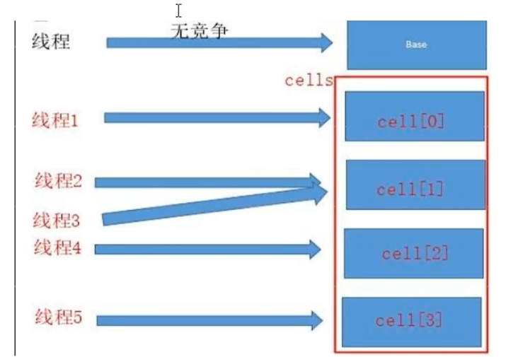

# 第8章-原子操作之18罗汉增强


Atomic 翻译成中文是原子的意思。在化学上，我们知道原子是构成一般物质的最小单位，在化学反应中是不可分割的。在我们这里 Atomic 是指一个操作是不可中断的。即使是在多个线程一起执行的时候，一个操作一旦开始，就不会被其他线程干扰。

* JDK8，土建使用LongAdder对象，比ActomicLong性能更好（减少乐观锁的重试次数）

## 8.1 基本类型原子类

- `AtomicInteger`：整型原子类
- `AtomicBoolean`：布尔型原子类
- `AtomicLong`：长整型原子类

### 8.1.1 常用API简介

基本类型原子类常用API简介

```java
public final int get() //获取当前的值
public final int getAndSet(int newValue)//获取当前的值，并设置新的值
public final int getAndIncrement()//获取当前的值，并自增
public final int getAndDecrement() //获取当前的值，并自减
public final int getAndAdd(int delta) //获取当前的值，并加上预期的值
boolean compareAndSet(int expect, int update) //如果输入的数值等于预期值，则以原子方式将该值设置为输入值（update）
public final void lazySet(int newValue)//最终设置为newValue,使用 lazySet 设置之后可能导致其他线程在之后的一小段时间内还是可以读到旧的值。
```

### 8.1.2 Case

AtomicInteger案例演示

```java
import java.util.concurrent.TimeUnit;
import java.util.concurrent.atomic.AtomicInteger;
class MyNumber{
    AtomicInteger atomicInteger = new AtomicInteger();
    public void addPlusPlus(){
        atomicInteger.getAndIncrement();
    }
}
public class AtomicIntegerDemo {
    public static int size = 50;
    public static void main(String[] args) {
        MyNumber myNumber = new MyNumber();
        for (int i=0;i<size;i++){
            new Thread(()->{
                    myNumber.addPlusPlus();
            }).start();
        }
        //等待线程执行完成
        try {
            TimeUnit.SECONDS.sleep(2);
        } catch (InterruptedException e) {
            Thread.currentThread().interrupt();
        }
        System.out.println(Thread.currentThread().getName()+"\t result:"+myNumber.atomicInteger.get());
    }
}
//main	 result:50
```

* sleep不太方便，可以使用CountDownLatch技术。

* CountDownLatch执行计数器。
  * 能够使一个线程在等待另外一些线程完成各自工作之后，再继续执行。使用一个计数器进行实现。计数器初始值为线程的数量。当每一个线程完成自己任务后，计数器的值就会减一。当计数器的值为0时，表示所有的线程都已经完成一些任务，然后在CountDownLatch上等待的线程就可以恢复执行接下来的任务。
  * CountDownLatch典型用法：1、某一线程在开始运行前等待n个线程执行完毕。将CountDownLatch的计数器初始化为new CountDownLatch(n)，每当一个任务线程执行完毕，就将计数器减1 countdownLatch.countDown()，当计数器的值变为0时，在CountDownLatch上await()的线程就会被唤醒。一个典型应用场景就是启动一个服务时，主线程需要等待多个组件加载完毕，之后再继续执行。
  * CountDownLatch典型用法：2、实现多个线程开始执行任务的最大并行性。注意是并行性，不是并发，强调的是多个线程在某一时刻同时开始执行。类似于赛跑，将多个线程放到起点，等待发令枪响，然后同时开跑。做法是初始化一个共享的CountDownLatch(1)，将其计算器初始化为1，多个线程在开始执行任务前首先countdownlatch.await()，当主线程调用countDown()时，计数器变为0，多个线程同时被唤醒。
  * CountDownLatch是一次性的，计算器的值只能在构造方法中初始化一次，之后没有任何机制再次对其设置值，当CountDownLatch使用完毕后，它不能再次被使用。

```java
package juc.chapter8;

import java.util.concurrent.CountDownLatch;
public class CountDownLatchDemo {
    public static int size = 50;
    public static void main(String[] args) {
        CountDownLatch countDownLatch = new CountDownLatch(size);
        MyNumber myNumber = new MyNumber();
        for (int i=0;i<size;i++){
            new Thread(()->{
                try {
                    for (int j=0;j<10;j++){
                        myNumber.addPlusPlus();
                    }
                }finally {
                    countDownLatch.countDown();
                }
            }).start();
        }
        try {
            countDownLatch.await();
        } catch (InterruptedException e) {
            Thread.currentThread().interrupt();
        }
        System.out.println(Thread.currentThread().getName()+"\t result:"+myNumber.atomicInteger.get());
    }
}
//main	 result:500
```

## 8.2 数组类型原子类

- `AtomicIntegerArray`：整型数组原子类
- `AtomicLongrArray`：长整型数组原子类
- `AtomicReferenceArray`：用类型数组原子类

### 8.2.1 常用API简介

数组类型原子类常用API简介

```java
public final int get(int i) //获取 index=i 位置元素的值
public final int getAndSet(int i, int newValue)//返回 index=i 位置的当前的值，并将其设置为新值：newValue
public final int getAndIncrement(int i)//获取 index=i 位置元素的值，并让该位置的元素自增
public final int getAndDecrement(int i) //获取 index=i 位置元素的值，并让该位置的元素自减
public final int getAndAdd(int i, int delta) //获取 index=i 位置元素的值，并加上预期的值
boolean compareAndSet(int i, int expect, int update) //如果输入的数值等于预期值，则以原子方式将 index=i 位置的元素值设置为输入值（update）
public final void lazySet(int i, int newValue)//最终 将index=i 位置的元素设置为newValue,使用 lazySet 设置之后可能导致其他线程在之后的一小段时间内还是可以读到旧的值。
```

### 8.2.2 Case

AtomicIntegerArray案例演示

```java
/**
 * @author Guanghao Wei
 * @create 2023-04-12 16:49
 */
public class AtomicIntegerArrayDemo {
    public static void main(String[] args) {
//        AtomicIntegerArray atomicIntegerArray = new AtomicIntegerArray(new int[]{1, 2, 3, 4, 5});
         AtomicIntegerArray atomicIntegerArray = new AtomicIntegerArray(new int[5]);
        for (int i=0;i<atomicIntegerArray.length();i++){
            System.out.println(atomicIntegerArray.get(i));
        }
        System.out.println(atomicIntegerArray.getAndSet(0,8));
        System.out.println(atomicIntegerArray.get(0));
        System.out.println(atomicIntegerArray.incrementAndGet(0));
        System.out.println(atomicIntegerArray.get(0));
    }
}
```

```
结果
0
0
0
0
0
0
8
9
9
```

## 8.3 引用类型原子类

- `AtomicReference` :引用类型原子类。用这个实现自选锁
- `AtomicStampedReference`：原子更新带有版本号的引用类型。该类将整数值与引用关联起来，可用于解决原子的更新数据和数据的版本号，可以解决使用 CAS 进行原子更新时可能出现的 ABA 问题。
  * ABA就是修改过但最终结果还是原来值，`AtomicStampedReference`用于解决修改过几次

- `AtomicMarkableReference`：原子更新带有标记的引用类型。该类将 boolean 标记与引用关联起来
  * 解决是否修改过，它的定义就是将标记戳简化为true/false，类似于一次性筷子

- AtomicMarkableReference案例演示

```java
public class AtomicMarkableReferenceDemo {
    static AtomicMarkableReference markableReference = new AtomicMarkableReference(100, false);

    public static void main(String[] args) {
        new Thread(() -> {
            boolean marked = markableReference.isMarked();
            System.out.println(Thread.currentThread().getName() + "\t" + "默认标识: " + marked);//t1	默认标识: false
            try {
                TimeUnit.SECONDS.sleep(1);
            } catch (InterruptedException e) {
                e.printStackTrace();
            }
            markableReference.compareAndSet(100, 1000, marked, !marked);//t2	默认标识: false

        }, "t1").start();

        new Thread(() -> {
            boolean marked = markableReference.isMarked();
            System.out.println(Thread.currentThread().getName() + "\t" + "默认标识: " + marked);//t2	t2线程CASResult：false
            try {
                TimeUnit.SECONDS.sleep(2);
            } catch (InterruptedException e) {
                e.printStackTrace();
            }
            boolean b = markableReference.compareAndSet(100, 2000, marked, !marked);
            System.out.println(Thread.currentThread().getName() + "\t" + "t2线程CASResult：" + b);
            System.out.println(Thread.currentThread().getName() + "\t" + markableReference.isMarked());//t2	true
            System.out.println(Thread.currentThread().getName() + "\t" + markableReference.getReference());//t2	1000

        }, "t2").start();
    }
}
```

```
结果
t1	默认标识: false
t2	默认标识: false
t2	t2线程CASResult：false
t2	true
t2	1000
```


## 8.4 对象的属性修改原子类

- `AtomicIntegerFieldUpdater`：原子更新对象中int类型字段的值
- `AtomicLongFieldUpdater`：原子更新对象中Long类型字段的值
- `AtomicReferenceFieldUpdater`：原子更新对象中引用类型字段的值

### 8.4.1 使用目的

以一种线程安全的方式操作非线程安全对象内的某些字段


### 8.4.2 使用要求

- 更新的对象属性必须使用public volatile修饰符，不用volatile修饰会直接报错。
- 因为对象的属性修改类型原子类都是抽象类，所以每次使用都必须使用静态方法newUpdater()创建一个更新器，并且需要设置想要更新的类和属性

### 8.4.3 Case

AtomicIntegerFieldUpdater使用案例

```java
class BankAccount {
    public volatile int money = 0;


    AtomicIntegerFieldUpdater<BankAccount> atomicIntegerFieldUpdater = AtomicIntegerFieldUpdater.newUpdater(BankAccount.class, "money");

    public void transferMoney(BankAccount bankAccount) {
        atomicIntegerFieldUpdater.getAndIncrement(bankAccount);

    }
}

public class AtomicIntegerFieldUpdaterDemo {
    public static void main(String[] args) throws InterruptedException {
        BankAccount bankAccount = new BankAccount();
        CountDownLatch countDownLatch = new CountDownLatch(10);
        for (int i = 1; i <= 10; i++) {
            new Thread(() -> {
                try {
                    for (int j = 1; j <= 1000; j++) {
                        bankAccount.transferMoney(bankAccount);
                    }
                } finally {
                    countDownLatch.countDown();
                }
            }, String.valueOf(i)).start();

        }
        countDownLatch.await();
        System.out.println(Thread.currentThread().getName() + '\t' + "result: " + bankAccount.money); //main	result: 10000
    }
}
```

AtomicReferenceFieldUpdater案例演示

```java
/**
 * 需求：多线程并发调用一个类的初始化方法，如果未被初始化过，将执行初始化工作
 * 要求只能被初始化一次，只有一个线程操作成功
 */
class MyVar {
    public volatile Boolean isInit = Boolean.FALSE;
    AtomicReferenceFieldUpdater<MyVar, Boolean> referenceFieldUpdater = AtomicReferenceFieldUpdater.newUpdater(MyVar.class, Boolean.class, "isInit");

    public void init(MyVar myVar) {
        if (referenceFieldUpdater.compareAndSet(myVar, Boolean.FALSE, Boolean.TRUE)) {
            System.out.println(Thread.currentThread().getName() + "\t" + "--------------start init ,need 2 secondes");
            try {
                TimeUnit.SECONDS.sleep(2);
            } catch (InterruptedException e) {
                e.printStackTrace();
            }
            System.out.println(Thread.currentThread().getName() + "\t" + "--------------over init");
        } else {
            System.out.println(Thread.currentThread().getName() + "\t" + "--------------已经有线程进行初始化工作了。。。。。");
        }
    }
}

public class AtomicReferenceFieldUpdaterDemo {

    public static void main(String[] args) {
        MyVar myVar = new MyVar();
        for (int i = 1; i <= 5; i++) {
            new Thread(() -> {
                myVar.init(myVar);
            }, String.valueOf(i)).start();
        }
    }
}
/**
 * 1	--------------start init ,need 2 secondes
 * 5	--------------已经有线程进行初始化工作了。。。。。
 * 2	--------------已经有线程进行初始化工作了。。。。。
 * 4	--------------已经有线程进行初始化工作了。。。。。
 * 3	--------------已经有线程进行初始化工作了。。。。。
 * 1	--------------over init
 */
```

## 8.5 原子操作增强类原理深度解析

### 8.5.1 常用类

- `DoubleAccumulator`：一个或多个变量，它们一起保持运行double使用所提供的功能更新值
- `DoubleAdder`：一个或多个变量一起保持初始为零double总和
- `LongAccumulator`：一个或多个变量，一起保持使用提供的功能更新运行的值long ，提供了自定义的函数操作
- `LongAdder`：一个或多个变量一起维持初始为零long总和（重点），只能用来计算加法，且从0开始计算

### 8.5.2 面试题

1. 热点商品点赞计算器，点赞数加加统计，不要求实时精确
2. 一个很大的list，里面都是int类型，如何实现加加，思路？

### 8.5.3 点赞计数器

#### 8.5.3.1 常用API


#### 8.5.3.2 入门讲解

* LongAdder只能用来计算加法，且从零开始计算

* LongAccumulator提供了自定义的函数操作

  * LongAccumulator(LongBinaryOperator accumulatorFunction,long identity)  使用给定的累加函数和标识元素创建实例。

* LongAdderAPIDemo

  ```java
  public class LongAccumulatorDemo {
      public static void main(String[] args) {
          LongAccumulator longAccumulator = new LongAccumulator((x,y)->x+y,0);
          longAccumulator.accumulate(5);
          System.out.println(longAccumulator.get());
          longAccumulator.accumulate(6);
          System.out.println(longAccumulator.get());
          longAccumulator.accumulate(7);
          System.out.println(longAccumulator.get());
      }
  }
  ```

  ```
  结果
  5
  11
  18
  ```

#### 8.5.3.3 LongAdder高性能对比Code演示

多种方式实现点赞计数器案例演示结果

```java
/**
 * 需求：50个线程，每个线程100w次，总点赞数出来
 */
class ClickNumber {
    int number = 0;

    public synchronized void clickBySynchronized() {
        number++;
    }

    AtomicLong atomicLong = new AtomicLong(0);

    public void clickByAtomicLong() {
        atomicLong.getAndIncrement();
    }

    LongAdder longAdder = new LongAdder();

    public void clickByLongAdder() {
        longAdder.increment();
    }

    LongAccumulator longAccumulator = new LongAccumulator((x, y) -> x + y, 0);

    public void clickByLongAccumulator() {
        longAccumulator.accumulate(1);
    }
}

public class AccumulatorCompareDemo {
    public static final int _1W = 10000;
    public static final int THREAD_NUMBER = 50;

    public static void main(String[] args) throws InterruptedException {
        ClickNumber clickNumber = new ClickNumber();
        long StartTime;
        long endTime;
        CountDownLatch countDownLatch1 = new CountDownLatch(THREAD_NUMBER);
        CountDownLatch countDownLatch2 = new CountDownLatch(THREAD_NUMBER);
        CountDownLatch countDownLatch3 = new CountDownLatch(THREAD_NUMBER);
        CountDownLatch countDownLatch4 = new CountDownLatch(THREAD_NUMBER);

        StartTime = System.currentTimeMillis();
        for (int i = 1; i <= 50; i++) {
            new Thread(() -> {
                try {
                    for (int j = 1; j <= 100 * _1W; j++) {
                        clickNumber.clickBySynchronized();
                    }
                } finally {
                    countDownLatch1.countDown();
                }
            }, String.valueOf(i)).start();
        }
        countDownLatch1.await();
        endTime = System.currentTimeMillis();
        System.out.println("------costTime: " + (endTime - StartTime) + " 毫秒" + "\t clickBySynchronized: " + clickNumber.number);

        StartTime = System.currentTimeMillis();
        for (int i = 1; i <= 50; i++) {
            new Thread(() -> {
                try {
                    for (int j = 1; j <= 100 * _1W; j++) {
                        clickNumber.clickByAtomicLong();
                    }
                } finally {
                    countDownLatch2.countDown();
                }
            }, String.valueOf(i)).start();
        }
        countDownLatch2.await();
        endTime = System.currentTimeMillis();
        System.out.println("------costTime: " + (endTime - StartTime) + " 毫秒" + "\t clickByAtomicLong: " + clickNumber.atomicLong.get());

        StartTime = System.currentTimeMillis();
        for (int i = 1; i <= 50; i++) {
            new Thread(() -> {
                try {
                    for (int j = 1; j <= 100 * _1W; j++) {
                        clickNumber.clickByLongAdder();
                    }
                } finally {
                    countDownLatch3.countDown();
                }
            }, String.valueOf(i)).start();
        }
        countDownLatch3.await();
        endTime = System.currentTimeMillis();
        System.out.println("------costTime: " + (endTime - StartTime) + " 毫秒" + "\t clickByLongAdder: " + clickNumber.longAdder.sum());

        StartTime = System.currentTimeMillis();
        for (int i = 1; i <= 50; i++) {
            new Thread(() -> {
                try {
                    for (int j = 1; j <= 100 * _1W; j++) {
                        clickNumber.clickByLongAccumulator();
                    }
                } finally {
                    countDownLatch4.countDown();
                }
            }, String.valueOf(i)).start();
        }
        countDownLatch4.await();
        endTime = System.currentTimeMillis();
        System.out.println("------costTime: " + (endTime - StartTime) + " 毫秒" + "\t clickByLongAccumulator: " + clickNumber.longAccumulator.get());

    }
}
/**
 * ------costTime: 1313 毫秒	 clickBySynchronized: 50000000
 * ------costTime: 825 毫秒	 clickByAtomicLong: 50000000
 * ------costTime: 92 毫秒	 clickByLongAdder: 50000000
 * ------costTime: 61 毫秒	 clickByLongAccumulator: 50000000
 */
```


### 8.5.4 源码、原理分析

#### 8.5.4.1 架构


LongAdder是Striped64的子类，Striped64有继承Number

#### 8.5.4.2 原理（LongAdder为什么这么快）

- 官网说明和阿里要求：如果是JDK8，推荐使用LongAdder对象，比AtomicLong性能更好（减少乐观锁的重试次数）。LongAdder吞吐量增加，但是空间小高更高，在低并发下与AtomicLong性能相当。

- LongAdder是Striped64的子类

  - Striped64有继承Number

- Striped64

  - Striped64有几个比较重要的成员函数

    - 最重要的有两个cells和base

    

  - Striped64中一些变量或者方法定义

    

- cell

  - 是java.util.concurrent.atomic下Striped64的一个内部类

    ```java
     @sun.misc.Contended static final class Cell {
            volatile long value;
            Cell(long x) { value = x; }
            final boolean cas(long cmp, long val) {
                return UNSAFE.compareAndSwapLong(this, valueOffset, cmp, val);
            }
    
            // Unsafe mechanics
            private static final sun.misc.Unsafe UNSAFE;
            private static final long valueOffset;
            static {
                try {
                    UNSAFE = sun.misc.Unsafe.getUnsafe();
                    Class<?> ak = Cell.class;
                    valueOffset = UNSAFE.objectFieldOffset
                        (ak.getDeclaredField("value"));
                } catch (Exception e) {
                    throw new Error(e);
                }
            }
        }
    ```

- LongAdder为什么这么快

  - 一句话

    - LongAdder的基本思路就是分散热点，将value值分散到一个Cell数组中，不同线程会命中到数组的不同槽中，各个线程只对自己槽中的那个值进行CAS操作，这样热点就被分散了，冲突的概率就小很多，如果要获取真正的long值，只要将各个槽中的变量值累加返回
    - sum()会将所有的Cell数组中的value和base累加作为返回值，核心的思想就是将之前AtomicLong一个value的更新压力分散到多个value中去，从而降级更新热点。

  - 数据表达

    - 内部有一个base变量，一个Cell[]数组
      - base变量：低并发，直接累加到该变量上
      - Cell[]数组：高并发，累加进各个线程自己的槽Cell[i]中

    

#### 8.5.4.3 源码解读深度分析

* 小总结

  * LongAdder在无竞争的情况下，跟AtomicLong一样，对同一个base进行操作，当出现竞争关系时则是采用化整为零分散热点的做法，用空间换时间，用一个数组cells，将一个value值拆分进这个数组cells。多个线程需要同时对value进行操作的时候，可以对线程id进行hash得到hash值，再根据hash值映射到这个数组cells的某个下标，再对该下标所对应的值进行自增操作。当所有线程操作完毕，将数组cells的所有值和base都加起来作为最终结果

    

* longAdder.increment()
  * add(1L)
    * as 标识cells引用
    * b标识获取的base值
    * v标识期望值
    * m标识cells数组长度
    * a表示当前线程命中的cell单元格
    * 
    * 1 如果Cells表为空，尝试用CAS更新base字段，成功则退出
    * 2 如果Cells表为空，CAS更新base字段失败，出现竞争，uncontended为true，调用 （新建数组）
    * 3 如果Cells表非空，但当前线程映射的槽为空，uncontended为true，调用longAccumulate（初始化）
    * 4 如果Cells表非空，且当前线程映射的槽非空，CAS更新Cell的值，成功则返回，否则，uncontended设为false，调用longAccumulate（扩容）

- longAccumulate

  - longAccumulate入参说明

    - long x需要增加的值，一般默认都是1
    - LongBinaryOperator fn 默认传递的是null
    - boolean wasUncontended 竞争标识，如果是false则代表有竞争，只有cells初始化之后，并且当前线程CAS竞争修改失败，才会是false。

  - Striped64中一些变量或者方法定义

    

  - 步骤

    - 线程hash值：probe

      Striped64初始化时就加载了线程的PROBE属性值偏移量

    

    ​	执行longAccumulate方法时，回去获取当前线程的hash值

    

    ​	实际调用是UNSAFE直接获取偏移量的内存值，就是hash值

    

    - 总纲

    

    ​	上述代码首先给当前线程分配一个hash值，然后进入一个for(;;)自旋，这个自旋分为三个分支。

    ​	CASE1：Cell[]数组已经初始化

    ​	CASE2：Cell[]数组未初始化（首次新建），尝试占有锁并首次初始化cells数组

    ​	CASE3：Cell[]数组未初始化，直接在base上进行累加操作

    - 计算

      * 初始化cell值

      ```java
      //cell没有初始化，没有被锁定，且cells没有被改变，尝试锁定cellsBusy值为锁定状态
                  else if (cellsBusy == 0 && cells == as && casCellsBusy()) {
                      boolean init = false;
                      try {                           // Initialize table
                          if (cells == as) {//不二次校验，就会再new一个cell数组，上一个线程的值可能被串改
                              Cell[] rs = new Cell[2];//创建2个cell
                              rs[h & 1] = new Cell(x);//线程hash值找到对于的位置，把初始值放进去
                              cells = rs;//复制出去
                              init = true;
                          }
                      } finally {
                          cellsBusy = 0;
                      }
                      if (init)
                          break;
                  }
      ```

    - 兜底措施，其他线程正在初始化等修改失败，都会走这个分支，直接尝试修改base值。

      ```java
      //cell没有初始化，被锁定了，直接更新base值。
                  else if (casBase(v = base, ((fn == null) ? v + x :
                          fn.applyAsLong(v, x))))
                      break;                          // Fall back on using base
      ```

    - cell数组不再为空且可能存在Cell数组扩容

      - 多个线程同时命中一个cell的竞争

      - 总体代码

        ```java
                    //cell已经初始化，并且不为空。
                    if ((as = cells) != null && (n = as.length) > 0) {
                        if ((a = as[(n - 1) & h]) == null) {//线程hash值映射的cell为空，表示cell没有被使用
                            if (cellsBusy == 0) {       // Try to attach new Cell
                                Cell r = new Cell(x);   // Optimistically create
                                if (cellsBusy == 0 && casCellsBusy()) {
                                    boolean created = false;
                                    try {               // Recheck under lock
                                        Cell[] rs; int m, j;
                                        if ((rs = cells) != null &&
                                                (m = rs.length) > 0 &&
                                                rs[j = (m - 1) & h] == null) {
                                            rs[j] = r;
                                            created = true;
                                        }
                                    } finally {
                                        cellsBusy = 0;
                                    }
                                    if (created)
                                        break;
                                    continue;           // Slot is now non-empty
                                }
                            }
                            collide = false;
                        }
                        else if (!wasUncontended)       //wasUncontended表示前一次cas更新Cell单元是否成功
                            wasUncontended = true;      // 重置为ture,后面会重新计算线程的hash值
                        else if (a.cas(v = a.value, ((fn == null) ? v + x :
                                fn.applyAsLong(v, x))))//尝试更新Cell值，成功结束循环，不成功，再继续循环
                            break;
                        else if (n >= NCPU || cells != as)//当数组大小超过CPU值或当前cells和局部变量不相同时(可能其他线程在操作)，不再进行扩容，
                            collide = false;            // At max size or stale
                        else if (!collide)
                            collide = true;
                        else if (cellsBusy == 0 && casCellsBusy()) {//Cell没有锁定，进行尝试锁定
                            try {
                                if (cells == as) {      //数据没有修改过，进行扩容
                                    Cell[] rs = new Cell[n << 1];//扩展两倍
                                    for (int i = 0; i < n; ++i)//数据进行复制
                                        rs[i] = as[i];
                                    cells = rs;//重新复制
                                }
                            } finally {
                                cellsBusy = 0;//重新把操作cells标识改为0
                            }
                            collide = false;//扩容标记改为false
                            continue;//重试
                        }
                        h = advanceProbe(h);//重新生成线程hash值
                    }
        ```

      - 1

        

        如果为空则将Cell数据放入数组中，跳出循环

        如果不空则继续循环

      - 2

        

      - 3

        

      - 4

        

      - 5

        

      - 6

        

      - 上6步骤总结

      

- sum

  

  - sum()会将所有Cell数组中的value和base累加作为返回值。核心思想就是将之前AtomicLong一个value的更新压力分散到多个value中去，从而降级更新热点。所以sum的值不精确。
  - sum执行时，并没有限制对base和cells的更新，所以LongAdder不是强一致性的，它是最终一致性的，对cell的读取无法保证是最后一次写入的值，所以在没有并发的场景下，可以获得正确的结果。

#### 8.5.4.4 使用总结

- AtomicLong线程安全，可允许一些性能损耗，要求高精度时可使用，保证精度，多个线程对单个热点值value进行了原子操作-----保证精度，性能代码
- LongAdder当需要在高并发场景下有较好的性能表现，且对值得精确度要求不高时，可以使用，LongAdder时每个线程拥有自己得槽，各个线程一般只对自己槽中得那个值进行CAS操作---保证性能，精度代价

### 8.5.5 总结

- AtomicLong

  - 原理：CAS+自旋。incrementAndGet
  - 场景：低并发下的全局计算，AtomicLong能保证并发情况下计数的准确性，其内部通过CAS来解决并发安全性问题
  - 缺陷：高并发后性能急剧下降----AtomicLong的自旋会成为瓶颈（N个线程CAS操作修改线程的值，每次只有一个成功过，其他N-1失败，失败的不停自旋直至成功，这样大量失败自旋的情况，一下子cpu就打高了）

- LongAdder

  - 原理：CAS+Base+Cell数组分散-----空间换时间并分散了热点数据
  - 场景：高并发下的全局计算
  - 缺陷：sum求和后还有计算线程修改结果的话，最后结果不够准确