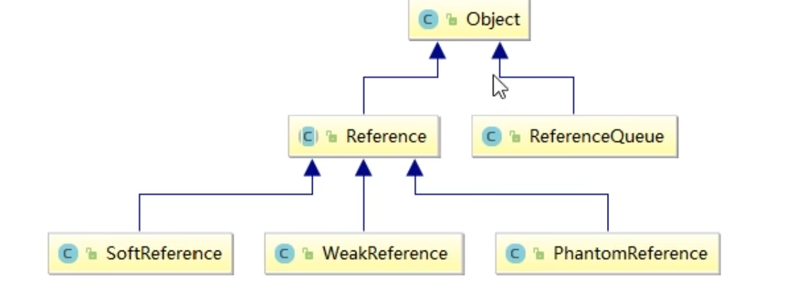
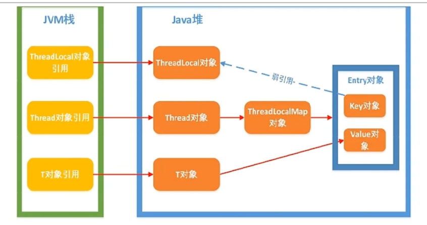

# 第9章-聊聊ThreadLocal

## 9.1 ThreadLocal简介

### 9.1.1 面试题

- ThreadLocal中ThreadLocalMap的数据结构和关系
- ThreadLocal的key是弱引用，这是为什么？
- ThreadLocal内存泄漏问题你知道吗？
- ThreadLocal中最后为什么要加remove方法？

### 9.1.2 是什么？

ThreadLocal提供线程局部变量。这些变量与正常的变量不同，因为每一个线程在访问ThreadLocal实例的时候（通过其get或set方法）都有自己的、独立初始化的变量副本。ThreadLocal实例通常是类中的私有静态字段，使用它的目的是希望将状态（例如，用户ID或事物ID）与线程关联起来。

### 9.1.3 能干吗？

实现每一个线程都有自己专属的本地变量副本（自己用自己的变量不用麻烦别人，不和其他人共享，人人有份，人各一份）。主要解决了让每个线程绑定自己的值，通过使用get()和set()方法，获取默认值或将其改为当前线程所存的副本的值从而避免了线程安全问题。比如8锁案例中，资源类是使用同一部手机，多个线程抢夺同一部手机，假如人手一份不是天下太平？

### 9.1.4 API介绍


### 9.1.5 永远的helloworld讲起

* 阿里开发手册：必须回收自定义的ThreadLocal变量，尤其再线程池场景下，线程经常会被服用，如果不清理自定义的ThreadLocal变量，可能会影响后续业务逻辑和造成内存泄漏等问题。尽量在代理中使用try-finally块进行回收。

- 问题描述：5个销售买房子，集团只关心销售总量的准确统计数，按照总销售额统计，方便集团公司给部分发送奖金--------群雄逐鹿起纷争------为了数据安全只能加锁

```java
/**
 * 需求：5个销售卖房子，集团只关心销售总量的精确统计数
 */
class House {
    int saleCount = 0;

    public synchronized void saleHouse() {
        saleCount++;
    }

}

public class ThreadLocalDemo {
    public static void main(String[] args) {
        House house = new House();
        for (int i = 1; i <= 5; i++) {
            new Thread(() -> {
                int size = new Random().nextInt(5) + 1;
                System.out.println(size);
                for (int j = 1; j <= size; j++) {
                    house.saleHouse();
                }
            }, String.valueOf(i)).start();

        }
        try {
            TimeUnit.MILLISECONDS.sleep(300);
        } catch (InterruptedException e) {
            e.printStackTrace();
        }
        System.out.println(Thread.currentThread().getName() + "\t" + "共计卖出多少套： " + house.saleCount);
    }
}
/**
 * 3
 * 4
 * 2
 * 4
 * 2
 * main	共计卖出多少套： 15
 */
```

- 需求变更：希望各自分灶吃饭，各凭销售本事提成，按照出单数各自统计-------比如房产中介销售都有自己的销售额指标，自己专属自己的，不和别人参和。----人手一份天下安

```java
/**
 * 需求：需求变更：希望各自分灶吃饭，各凭销售本事提成，按照出单数各自统计-------比如房产中介销售都有自己的销售额指标，自己专属自己的，不和别人参和。
 */
class House {
    int saleCount = 0;

    public synchronized void saleHouse() {
        saleCount++;
    }

    ThreadLocal<Integer> saleVolume = ThreadLocal.withInitial(() -> 0);

    public void saleVolumeByThreadLocal() {
        saleVolume.set(1 + saleVolume.get());
    }


}

public class ThreadLocalDemo {
    public static void main(String[] args) {
        House house = new House();
        for (int i = 1; i <= 5; i++) {
            new Thread(() -> {
                int size = new Random().nextInt(5) + 1;
                try {
                    for (int j = 1; j <= size; j++) {
                        house.saleHouse();
                        house.saleVolumeByThreadLocal();
                    }
                    System.out.println(Thread.currentThread().getName() + "\t" + "号销售卖出：" + house.saleVolume.get());
                } finally {
                    house.saleVolume.remove();
                }
            }, String.valueOf(i)).start();

        }
        try {
            TimeUnit.MILLISECONDS.sleep(300);
        } catch (InterruptedException e) {
            e.printStackTrace();
        }
        System.out.println(Thread.currentThread().getName() + "\t" + "共计卖出多少套： " + house.saleCount);
    }
}
/**
 * 3	号销售卖出：1
 * 4	号销售卖出：3
 * 5	号销售卖出：4
 * 2	号销售卖出：3
 * 1	号销售卖出：5
 * main	共计卖出多少套： 16
 */
```

### 9.1.6 总结

- 因为每个Thread内有自己的实例副本且该副本只有当前线程自己使用
- 既然其他ThreadLocal不可访问，那就不存在多线程间共享问题
- 统一设置初始值，但是每个线程对这个值得修改都是各自线程互相独立得
- 如何才能不争抢

  - 加入synchronized或者Lock控制资源的访问顺序
  - 人手一份，大家各自安好，没有必要争抢

## 9.2 ThreadLocal源码分析

### 9.2.1 源码解读

* ThreadLocal源码中通过ThreadLocalMap实现线程变量


### 9.2.2 Thread、ThreadLocal、ThreadLocalMap关系

- Thread和ThreadLocal，各自线程人手一份，Thread中有ThreadLocal.ThreadLocalMap


- ThreadLocal和ThreadLocalMap，ThreadLocalMap是ThreadLocal的静态内部类


- 三者总概括


- ThreadLocalMap实际上就是一个以ThreadLocal实例为Key，任意对象为value的Entry对象

  ```java
  
      /**
       * Create the map associated with a ThreadLocal. Overridden in
       * InheritableThreadLocal.
       *
       * @param t the current thread
       * @param firstValue value for the initial entry of the map
       */
      void createMap(Thread t, T firstValue) {
          t.threadLocals = new ThreadLocalMap(this, firstValue);
      }
  ```

- 当我们为ThreadLocal变量赋值，实际上就是以当前ThreadLocal实例为Key，值为value的Entry往这个ThreadLocalMap中存放

- 

### 9.2.3 总结

- ThreadLocalMap从字面上就可以看出这是一个保存ThreadLocal对象的map（其实是以ThreadLocal为Key），不过是经过了两层包装的ThreadLocal对象：


- JVM内部维护了一个线程版的Map<ThreadLocal, Value>（通过ThreadLocal对象的set方法，结果把ThreadLocal对象自己当作Key，放进了ThreadLocalMap中），每个线程要用到这个T的时候，用当前的线程去Map里面获取，通过这样让每个线程都拥有了自己独立的变量，人手一份，竞争条件被彻底消除，在并发模式下是绝对安全的变量。

## 9.3 ThreadLocal内存泄漏问题

### 9.3.1 从阿里面试题开始讲起

为什么ThreadLocal中的ThreadLocalMap是弱引用，不用会如何？

```java
  static class ThreadLocalMap {

        /**
         * The entries in this hash map extend WeakReference, using
         * its main ref field as the key (which is always a
         * ThreadLocal object).  Note that null keys (i.e. entry.get()
         * == null) mean that the key is no longer referenced, so the
         * entry can be expunged from table.  Such entries are referred to
         * as "stale entries" in the code that follows.
         */
        static class Entry extends WeakReference<ThreadLocal<?>> {
            /** The value associated with this ThreadLocal. */
            Object value;

            Entry(ThreadLocal<?> k, Object v) {
                super(k);
                value = v;
            }
        }
```

### 9.3.2 什么是内存泄漏

不再会被使用的对象或者变量占用的内存不能被回收，就是内存泄漏

### 9.3.3 谁惹的祸？

- 再回首ThreadLocalMap


- 整体架构
  - java技术允许使用finalize()方法在垃圾回收器将对象从内存中清除出去之前必要的清理工作。
  - finalize()已过时，最终确认机制本质上存在问题。




- 强引用：
  - 当内存不足，JVM开始回收，对于强引用的对象，就算是出现了OOM也不会对该对象进行回收，死都不收。
  - 强引用是我们最常见的普通对象引用，只要还有强引用指向一个对象，就表明对象还“活着”，垃圾回收器不会碰这种对象。
  - 在Java中最常见的就是强引用，把一个对象赋值给一个引用变量，这个引用变量就是一个强引用。
  - 当一个对象被强引用变量引用时，它处于可达状态，是不可能被垃圾回收机制回收的。
  - 即使该对象以后永远都不会被用到，JVM也不会回收，因此强引用是造成Java内存泄露的主要原因之一。
  - 对于一个普通的对象，如果没有其它的引用关系，只要超过了引用的作用域或者显示的将相应（强）引用赋值为null，一般认为就是可以被垃圾回收的了（当然具体回收时机还是要看垃圾收集策略）。

- 软引用：

  - 是一种相对强引用弱化了一些的引用，需要使用java.lang.ref.SoftReference类来实现，可以让对象豁免一些垃圾收集。
  - 对于只有软引用的对象而言，当系统内存充足时，不会被回收，当系统内存不足时，他会被回收
  - 软引用通常用在对内存敏感的程序中，比如高速缓存，内存够用就保留，不够用就回收。

  ```java
  package chapter9;
  
  import java.lang.ref.SoftReference;
  class MyObject{
      byte[] bytes = new byte[20 * 1024 * 1024];//20MB对象
  }
  //-Xmx60m
  public class SoftReferenceDemo {
      public static void main(String[] args) {
          SoftReference softReference = new SoftReference(new MyObject());
          System.gc();
          try {
              Thread.sleep(5000);
          } catch (InterruptedException e) {
              e.printStackTrace();
          }
  
          System.out.println("内存充足时：对象"+softReference.get());
          try {
              MyObject myObject = new MyObject();
          }catch (Throwable e){
              e.printStackTrace();
          }finally {
              System.out.println("内存不充足时：对象"+softReference.get());
          }
  
      }
  }
  
  ```

  ```
  结果
  内存充足时：对象chapter9.MyObject@14ae5a5
  内存不充足时：对象null
  ```

- 弱引用：

  - 需要使用java.lang.ref.WeakReference类来实现

  - 比软引用的生命周期更短，对于只有弱引用的对象而言，只要垃圾回收机制一运行，不管JVM的内存空间是否足够，都会回收该对象占用的内存。

  - 软引用和弱引用的使用场景----->假如有一个应用需要读取大量的本地图片：

  - 如果每次读取图片都从硬盘读取则会严重影响性能

    - 如果一次性全部加载到内存中又可能会造成内存溢出
    - 此时使用软引用来解决，设计思路时：用一个HashMap来保存图片的路径和与相应图片对象关联的软引用之间的映射关系，在内存不足时，JVM会自动回收这些缓存图片对象所占用的空间，有效避免了OOM的问题

    

  ```java
  import java.lang.ref.WeakReference;
  
  class MyObject{
      byte[] bytes = new byte[20 * 1024 * 1024];//20MB对象
  }
  //-Xmx60m
  public class SoftReferenceDemo {
      public static void main(String[] args) {
  
          WeakReference<MyObject> weakReference = new WeakReference(new MyObject());
          System.gc();
          try {
              Thread.sleep(5000);
          } catch (InterruptedException e) {
              e.printStackTrace();
          }
  
          System.out.println("内存充足时：对象"+weakReference.get());
          try {
              MyObject myObject = new MyObject();
          }catch (Throwable e){
              e.printStackTrace();
          }finally {
              System.out.println("内存不充足时：对象"+weakReference.get());
          } 
      }
  }     
  ```

  ```
  结果
  内存充足时：对象null
  内存不充足时：对象null
  ```

- 虚引用：

  - 虚引用必须和引用队列联合ReferenceQueue使用：虚引用需要ava.lang.ref.PhantomReference类来实现，顾名思义，就是形同虚设，与其他几种引用都不同，虚引用并不会决定对象的生命周期。如果一个对象仅持有虚引用，那么它就和没有任何引用一样，在任何时候都有可能被垃圾回收器回收，它不能单独使用也不能通过它访问对象，虚引用必须和引用队列联合ReferenceQueue使用。
  - PhantomReference的get方法总是返回null：虚引用的主要作用是跟踪对象被垃圾回收的状态。仅仅是提供了一种确保对象被finalize后，做某些事情的通知机制。被回收前需要被引用队列保存下。
  - 处理监控通知使用（使用场景）：换句话说就是在对象被GC的时候会收到一个系统通知或者后续添加进一步的处理，用来实现比finalize机制更灵活的回收操作。

  ```java
  import java.lang.ref.*;
  import java.util.ArrayList;
  import java.util.List;
  import java.util.concurrent.TimeUnit;
  
  class MyObject{
      byte[] bytes = new byte[20 * 1024 * 1024];//20MB对象
  }
  //-Xmx60m
  public class SoftReferenceDemo {
      public static void main(String[] args) {
          MyObject myObject = new MyObject();
          ReferenceQueue<MyObject> referenceQueue = new ReferenceQueue<>();
          PhantomReference<MyObject> phantomReference = new PhantomReference<>(myObject,referenceQueue);
          System.out.println(phantomReference.get());
  
          List<byte[]> list = new ArrayList<>();
  
          new Thread(() -> {
              while (true){
                  list.add(new byte[1 * 1024 * 1024]);
                  try { TimeUnit.MILLISECONDS.sleep(500); } catch (InterruptedException e) { e.printStackTrace(); }
                  System.out.println(phantomReference.get()+"\t"+"list add ok");
              }
          },"t1").start();
  
          new Thread(() -> {
              while (true){
                  Reference<? extends MyObject> reference = referenceQueue.poll();
                  if(reference != null){
                      System.out.println("-----有虚对象回收加入了队列"+reference);
                      break;
                  }
              }
          },"t2").start();
     }
  }
  ```

  ```
  结果
  null
  null	list add ok
  null	list add ok
  null	list add ok
  null	list add ok
  null	list add ok
  null	list add ok
  null	list add ok
  null	list add ok
  null	list add ok
  -----有虚对象回收加入了队列java.lang.ref.PhantomReference@793190d2
  null	list add ok
  null	list add ok
  null	list add ok
  null	list add ok
  null	list add ok
  null	list add ok
  null	list add ok
  null	list add ok
  null	list add ok
  null	list add ok
  null	list add ok
  null	list add ok
  null	list add ok
  null	list add ok
  null	list add ok
  null	list add ok
  null	list add ok
  null	list add ok
  null	list add ok
  null	list add ok
  null	list add ok
  null	list add ok
  null	list add ok
  null	list add ok
  Exception in thread "t1" java.lang.OutOfMemoryError: Java heap space
  	at chapter9.SoftReferenceDemo.lambda$main$0(SoftReferenceDemo.java:23)
  	at chapter9.SoftReferenceDemo$$Lambda$1/1078694789.run(Unknown Source)
  	at java.lang.Thread.run(Thread.java:745)
  
  Process finished with exit code 0
  ```

- GCRoots和四大引用小总结


### 9.3.4 为什么要用弱引用？不用如何？


- 为什么要用弱引用：

  - 当function01方法执行完毕后，栈帧销毁，强引用t1也就没有了，但此时线程的ThreadLocalMap里某个entry的Key引用还指向这个对象，若这个Key是强引用，就会导致Key指向的ThreadLocal对象即V指向的对象不能被gc回收，造成内存泄露
  - 若这个引用时弱引用就大概率会减少内存泄漏的问题（当然，还得考虑key为null这个坑），使用弱引用就可以使ThreadLocal对象在方法执行完毕后顺利被回收且entry的key引用指向为null
  - 调用get、set或remove方法是，就会尝试删除key为null的entry，可以释放value对象所占的内存。

- 弱引用就完事大吉了吗？

  - 当我们为ThreadLocal变量赋值，实际上是当前的Entry(threadLocal实例为key，值为value)往这个threadLocalMap中存放。Entry中的key是弱引用，当threadLocal外部强引用被置为null(tl=null)，那么系统GC的时候，根据可达性分析，这个threadLocal实例就没有任何一条链路能够引用到它，这个ThreadLocal势必会被回收。这样一来，ThreadLocalMap中就会出现key为null的Entry，就没办法访问这些key为null的Entry的Value，如果当前线程再迟迟不结束的话，这些key为null的Entry的value就会一直存在一条强引用链：Thread Ref->Thread->ThreadLocalMap->Entry->value永远无法回收，造成内存泄漏。
  - 当然，如果当前thread运行结束，ThreadLocal,ThreadLocalMap,Entry没有引用链可达，在垃圾回收的时候都会被系统进行回收。
  - 但在实际使用中我们有时候会用线程池维护我们的线程，比如在Executors.newFixedThreadPool()时创建线程的时候，为了复用线程是不会结束的，所以ThreadLocal内存泄漏就值得我们小心

- key为null的entry，原理解析：

  

  - ThreadLocalMap使用ThreadLocal的弱引用作为Key，如果一个ThreadLocal没有外部强引用引用他，那么系统gc时，这个ThreadLocal势必会被回收，这样一来，ThreadLocalMap中就会出现Key为null的Entry，就没有办法访问这些Key为null的Entry的value，如果当前线程迟迟不结束的话（好比正在使用线程池），这些key为null的Entry的value就会一直存在一条强引用链
  - 虽然弱引用，保证了Key指向的ThreadLocal对象能够被及时回收，但是v指向的value对象是需要ThreadLocalMap调用get、set时发现key为null时才会去回收整个entry、value，因此弱引用不能100%保证内存不泄露，我们要在不使用某个ThreadLocal对象后，手动调用remove方法来删除它，尤其是在线程池中，不仅仅是内存泄漏的问题，因为线程池中的线程是重复使用的，意味着这个线程的ThreadLocalMap对象也是重复使用的，如果我们不手动调用remove方法，那么后面的线程就有可能获取到上个线程遗留下来的value值，造成bug。

- 排查所有键为null的Entry对象

  - set()方法

    

  - get()方法

    

  - remove()

    - 清除脏Entry----key为null的entry，然后进行删除

    

* 结论
  * 从前面的set,getEntry,remove方法看出，在threadLocal的生命周期里，针对threadLocal存在内存泄漏的问题，都会通过expungeStaleEntry,cleanSomeSlots,replaceStaleEntry这三个方法清理掉key为null的脏entry。

### 9.3.5 最佳实践

- ThreadLocal一定要初始化ThreadLocal.withInitial(()->初始化值)，避免空指针异常。
- 建议把ThreadLocal修饰为static，保证类第一次使用时装载，是分配一块存储空间，所有此类的对象都可以操作这个变量。
  - ThreadLocal能实现线程的数据隔离，不在于它自己本身，而在于Thread的ThreadLocalMap，所以ThreadLocal可以只初始化一次，只分配一块存储空间就足以，没必要作为成员变量被多次初始化。
- 用完记得手动remove

## 9.4 小总结

- ThreadLocal并不解决线程间共享数据的问题
- ThreadLocal适用于变量在线程间隔离且在方法间共享的场景
- ThreadLocal通过隐式的在不同线程内创建独立实例副本避免了实例线程安全的问题
- 每个线程持有一个只属于它自己的专属map并维护了ThreadLocal对象与具体实例的映射，该Map由于只被持有他的线程访问，故不存在线程安全以及锁的问题
- ThreadLocalMap的Entry对ThreadLocal的引用为弱引用。避免了ThreadLocal对象无法被回收的问题
- 都会通过expungeStaleEntry，cleanSomeSlots，replaceStaleEntry这三个方法回收键为null的Entry对象的值（即为具体实例）以及entry对象本身从而防止内存泄漏，属于安全加固的方法
- 群雄逐鹿起纷争，人各一份天下安