# 第17章-字节码指令集与解析举例

## 17.1 概述

- Java字节码对于虚拟机，就好像汇编语言对于计算机，属于基本执行指令。
- Java虚拟机的指令由 **一个字节长度的**、代表着某种特定操作含义的数字（称为操作码，Opcode）以及跟随其后的零至多个代表此操作所需参数（称为操作数，Operands）而构成。由于Java虚拟机采用面向操作数栈而不是面向寄存器的结构，所以大多数的指令都不包含操作数，只有一个操作码
- 由于限制了Java虚拟机操作码的长度为一个字节（即0~255），这意味着指令集的操作码总数不可能超过256条
- 官方文档： https://docs.oracle.com/javase/specs/jvms/se8/html/jvms-6.html 
- 熟悉虚拟机的指令对于动态字节码生成、反编译 Class 文件、 Class 文件修补都有着非常重要的价值。因此，阅读字节码作为了解 Java 虚拟机的基础技能，需要熟练掌握常见指令 

### 17.1.1执行模型

- 如果不考虑异常处理的话，那么 Java 虚拟机的解释器可以使用下面这个伪代码当做最基本的执行模型来理解

```java
do {
    自动计算PC寄存器的值加1;
    根据PC寄存器的指示位置，从字节码流中取出操作码;
    if(字节码存在操作数) 从字节码流中取出操作数;
    执行操作码所定义的操作;
}while(字节码长度>0)
```

### 17.1.2 字节码与数据类型

- 在 Java 虚拟机的指令集中，大多数的指令都包含了其操作所对应的数据类型信息。例如，iload 指令用于从局部变量表中加载 int 类型的数据到操作数栈中，而 fload 指令加载的则是 float 类型的数据

- 对于大部分与数据类型相关的字节码指令，**它们的操作码助记符中都有特殊的字符来表明专门为哪种数据类型服务：**
  
  - i 代表对 int 类型的数据操作
  - l 代表 long
  - s 代表 short
  - b 代表 byte
  - c 代表 char
  - f 代表 float
  - d 代表 double

- 也有一些指令的助记符中**没有明确地指明操作类型的字母**，如 arraylength 指令，它没有代表数据类型的特殊字符，但操作数永远只能是一个数组类型的对象

- 还有另一些指令，如无条件跳转指令 goto 则是与**数据类型无关的**

- 大部分的指令都没有支持整数类型 byte、char 和 short，甚至没有任何指令支持 boolean 类型。编译器会在编译器或运行期将 byte 和short 类型的数据带符号扩展(Sign-Extend)为相应的 int 类型数据，将 boolean 和 char 类型数据零位扩展(Zero-Extend)为相应的 int 类型数据。与之类似，在处理 boolean、byte、short 和 char 类型的数组时，也会转换为使用对应的 init类型的字节码指令来处理。因此，大多数对于 boolean、byte、short 和 char 类型数据的操作，实际上都是使用相应的 int 类型作为运算类型

### 17.1.3 指令分类

- 由于完全介绍和学习这些指令需要花费大量时间，为了让能够更快地熟悉和了解这些基本指令，这里将 JVM 中的字节码指令集按用途大致分成9类：
  
  - 加载与存储指令
  - 算术指令
  - 类型转换指令
  - 对象的创建与访问指令
  - 方法调用与返回指令
  - 操作数栈管理指令
  - 比较控制指令
  - 异常处理指令
  - 同步控制指令

- 在做值相关操作时：
  
  - 一个指令，可以从局部变量表、常量池、堆中对象、方法调用、系统调用等中取得数据，这些数据(可能是值，可能是对象的引用)被压入操作数栈
  - 一个指令，也可以从操作数栈中取出一到多个值(pop 多次)，完成赋值、加减乘除、方法传参、系统调用等操作

## 17.2 加载与存储指令

- 作用：加载和存储指令用于将数据从栈帧的局部变量表和操作数栈之间来回传递

- 常用指令
  
  * 「局部变量压栈指令」将一个局部变量加载到操作数栈：
    
    * `xload、xload_<n>`(`其中 x 为 i、l、f、d、a，n 为 0 到 3`)；`
    
    * aload、aload_<n>(n 为 0 到 3`)
  - 「常量入栈指令」将一个常量加载到操作数栈：
    
    - `bipush、sipush、ldc、ldc_w、ldc2_w、aconst_null、iconst_m1、iconst_<i>、lconst_<l>、fconst_<f>、dconst_<d>`
  
  - 「出栈装入局部变量表指令」将一个数值从操作数栈存储到局部变量表：
    
    - `xstore、xstore_<n>`(`其中 x 为 i、l、f、d、a，n 为 0 到 3`); `
    - xastore`(`其中 x 为 i、l、f、d、a、b、c、s`)
  
  - 扩充局部变量表的访问索引的指令：`wide`

- 上面所列举的指令助记符中，有一部分是以尖括号结尾的(例如`iload_<n>`)。这些指令助记符实际上代表了一组指令(例如`iload_`代表了`iload_0、iload_1、iload_2和iload_3`这几个指令)。这几组指令都是某个带有一个操作数的通用指令(例如 `iload`)的特殊形式，**对于这若干组特殊指令来说，它们表面上没有操作数，不需要进行取操作数的动作，但操作数都隐含在指令中**

- 除此之外，它们的语义与原生的通用指令完全一致(例如 `iload_0`的语义与操作数为0时的`iload`指令语义完全一致)。在尖括号之间的字母指定了指令隐含操作数的数据类型，`<n>`代表非负的整数，`<i>`代表是 int 类型数据，`<l>`代表 long 类型，`<f>`代表 float 类型，`<d>`代表 double 类型

- 操作 byte、char、short 和 boolean 类型数据时，经常用 int 类型的指令来表示

- 举例
  
  - iload_0:将局部变量表中索引为0位置的数据压入操作数栈中
  
  - iload 0:将局部变量表中索引为0位置的数据压入操作数栈中
  
  - iload 4:将局部变量表中索引为4位置的数据压入操作数栈中

### 17.2.1 再谈操作数栈和局部变量表

#### 17.2.1.1 操作数栈(Operand Stacks)

- 我们知道，Java 字节码是 Java 虚拟机所使用的指令集。因此，它与 Java 虚拟机基于栈的计算模型是密不可分的

- 在解释执行过程中，每当为 Java 方法分配栈帧时，Java 虚拟机往往需要开辟一块额外的空间作为操作数栈，来存放计算的操作数以及返回结果

- 具体来说便是：执行每一条指令之前，Java 虚拟机要求该指令的操作数已被压入操作数栈中。在执行指令时，Java 虚拟机会将该指令所需的操作数弹出，并且将指令的结果重新压入栈中


- 以加法指令 iadd 为例。假设在执行该指令之前，栈顶的两个元素分别为 int 值 1 和 int 值 2，那么 iadd 指令将弹出这两个 int，并将求得的和 int 值为 3 压入栈中 


- 由于 iadd 指令只消耗栈顶的两个元素，因此，对于离栈顶距离为 2 的元素，即图中的问号，iadd 指令并不关心它是否存在，更加不会对其进行修改 

#### 17.2.1.2 局部变量表(Local Variables)

- Java 方法栈帧的另外一个重要组成部分则是局部变量区，**字节码程序可以将计算的结果缓存在局部变量区之中**

- 实际上，Java 虚拟机将局部变量区**当成一个数组**，依次存放 this 指针(仅非静态方法)，所传入的参数，以及字节码中的局部变量。

- 和操作数栈一样，long 类型以及 double 类型的值将占据两个单元，其余类型仅占据一个单元

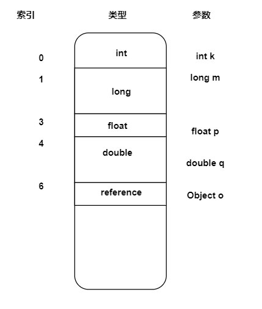

- **举例：**

```java
public void foo(long l, float f) {
    {
        int i = 0;
    }
    {
        String s = "Hello, World"
    }
}
```

- 字节码
  
  ```
  0 iconst_0
  1 istore 4
  3 ldc #3 <Hello, World>
  5 astore 4
  7 return
  ```
- **局部变量对应得图示：**


foo不是静态方法，第一位放this，第二位放long，占两个字节，所以第四位是float，第5位开始时方法内的参数，都是代码块，可以复用所以int和String可以共用局部变量表第5位。

且因为局部变量最后一个是复用的，属于代码块，所以局部变量表不显示序号为4的局部变量表，可以从局部变量最大槽数看到有序号为4的局部变量。

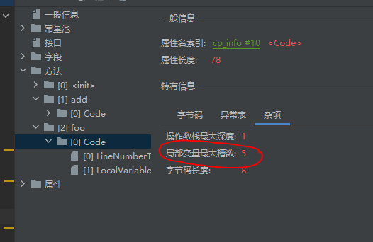

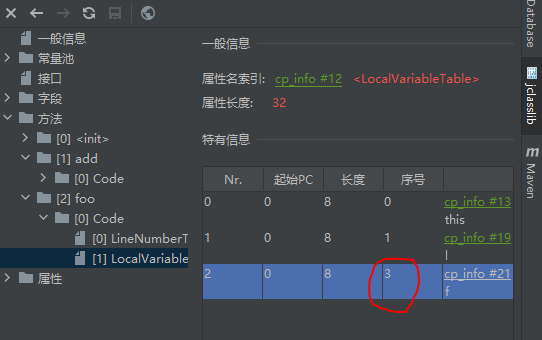

- 在栈帧中，与性能调优关系最为密切的部分就是局部变量表。局部变量表中的变量也是重要的垃圾回收根节点，只要被局部变量表中直接或间接引用的对象都不会被回收
- 在方法执行时，虚拟机使用局部变量表完成方法的传递
- i 和 s 代表的是槽的复用

### 17.2.2 局部变量压栈指令

- 局部变量压栈指令将给定的局部变量表中的数据压入操作数栈
- 这类指令大体可以分为：
  - `xload_`(`x`为`i、l、f、d、a，n为 0 到 3`)
  - `xload`(`x`为`i、l、f、d、a`)
- 说明：在这里，`x`的取值表示数据类型
- 指令`xload_n`表示将第`n`个局部变量压入操作数栈，比如`iload_1、fload_0、aload_0`等指令。其中`aload_n`表示将一个对象引用压栈
- 指令`xload`通过指定参数的形式，把局部变量压入操作数栈，当使用这个命令时，表示局部变量的数量可能超过了4个，比如指令`iload、fload`等

```java
public class LoadAndStoreTest {

    // 局部变量压栈指令
    public void load(int num, Object obj, long count, boolean flag, short[] arr) {
        System.out.println(num);
        System.out.println(obj);
        System.out.println(count);
        System.out.println(flag);
        System.out.println(arr);
    }
}
```

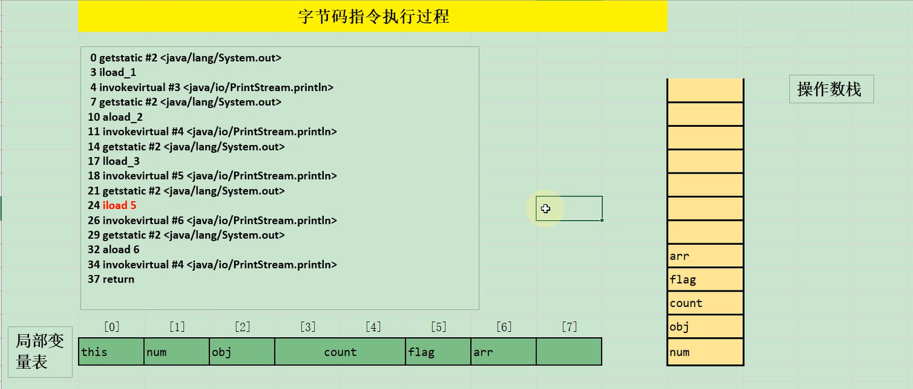

### 17.2.3 常量入栈指令

- 常量入栈指令的功能是将常数压入操作数栈，根据数据类型和入栈内容的不同，又可以分为 const 系列、push 系列和 ldc 指令
  - 指令 const 系列：用于对特定的常量入栈，入栈的常量隐含在指令本身里。指令有：`iconst_(i从-1到5)、lconst_(l从0到1)、fconst_(f从0到2)、dconst_(d从0到1)、aconst_null`
  - **比如：**
    - iconst_m1将-1压入操作数栈
    - iconst_x(x为0到5)将 x 压入栈
    - lconst_0、lconst_1 分别将长整数0和1压入栈
    - fconst_0、fconst_1、fconst_2 分别将浮点数0、1、2压入栈
    - dconst_0 和 dconst_1 分别将 double 型0和1压入栈
    - aconst_null 将 null 压入操作数栈
  - 从指令的命名上不难找出规律，指令助记符的第一个字符总是喜欢表示数据类型，i 表示整数，l 表示长整型，f 表示浮点数，d 表示双精度浮点，习惯上用 a 表示对象引用。如果指令隐含操作的参数，会以下划线形式给出
- 指令 push 系列：主要包括 bipush 和 sipush，它们的区别在于接受数据类型的不同，bipush 接收8位整数作为参数，sipush 接收16位整数，它们都将参数压入栈
- 指令 ldc 系列：如果以上指令都不能满足需求，那么可以使用万能的 ldc 指令，它可以接收一个8位的参数，该参数指向常量池中的 int、float 或者 String 的索引，将指定的内容压入堆栈
- 类似的还有 ldc_w，它接收两个8位参数，能支持的索引范围大于 ldc
- 如果要压入的元素是 long 或者 double 类型的，则使用 ldc2_w 指令，使用方式都是类似的
- 总结如下：

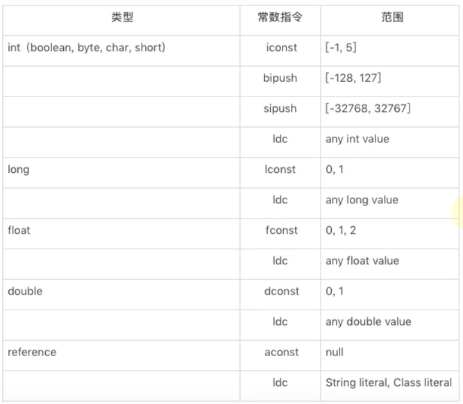

### 17.2.4 出栈装入局部变量表

- 出栈装入局部变量表指令用于将操作数栈中栈顶元素弹出后，装入局部变量表的指定位置，用于给局部变量赋值
- 这类指令主要以 store 的形式存在，比如 xstore (x 为 i、l、f、d、a)、xstore_n(x 为 i、l、f、d、a，n 为0至3)和 pasture(x 为 i、l、f、d、a、b、c、s)
  - 其中，指令 istore_n 将从操作数栈中弹出一个整数，并把它赋值给局部变量 n
  - 指令 xstore 由于没有隐含参数信息，故需要提供一个 byte 类型的参数类指定目标局部变量表的位置
  - xastore 则专门针对数组操作，以 iastore 为例，它用于给一个 int 数组的给定索引赋值。在 iastore 执行前，操作数栈顶需要以此准备3个元素：值、索引、数组引用，iastore 会弹出这3个值，并将值赋给数组中指定索引的位置
- 一般说来，类似像 store 这样的命令需要带一个参数，用来指明将弹出的元素放在局部变量表的第几个位置。但是，为了尽可能压缩指令大小，使用专门的 istore_1 指令表示将弹出的元素放置在局部变量表第1个位置。类似的还有 istore_0、istore_2、istore_3，它们分别表示从操作数栈顶弹出一个元素，存放在局部变量表第0、2、3个位置
- 由于局部变量表前几个位置总是非常常用，因此这种做法虽然增加了指令数量，但是可以大大压缩生成的字节码的体积。如果局部变量表很大，需要存储的槽位大于3，那么可以使用 istore 指令，外加一个参数，用来表示需要存放的槽位位置

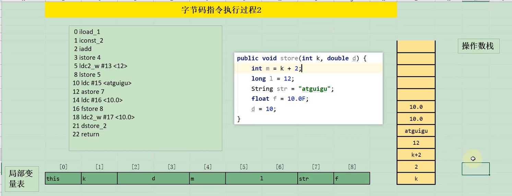

```java
// 演示代码
public class LoadAndStoreTest {

    // 局部变量压栈指令
    public void load(int num, Object obj, long count, boolean flag, short[] arr) {
        System.out.println(num);
        System.out.println(obj);
        System.out.println(count);
        System.out.println(flag);
        System.out.println(arr);
    }

    // 常量入栈指令
    public void pushConstLdc() {
        int a = 5;
        int b = 6;
        int c = 127;
        int d = 128;
        int e = 1234567;
    }

    public void constLdc() {
        long a1 = 1;
        long a2 = 2;
        float b1 = 2;
        float b2 = 3;
        double c1 = 1;
        double c2 = 2;
        Date d = null;
    }

    // 出栈装入局部变量表指令
    public void store(int k, double d) {
        int m = k + 2;
        int l = 12;
        String str = "atguigu";
        float f = 10.0F;
        d = 10;
    }

    public void foo(long l, float f) {
        {
            int i = 0;
        }
        {
            String s = "hello world";
        }
    }
}
```

## 17.3 算术运算符指令以及举例

- **作用**：算术指令用于对两个操作数栈上的值进行某种特定的运算，并把结果重新压入操作数栈

- **分类**：大体上算术指令可以分为两种：对 **整型数据** 进行运算的指令与对 **浮点类型数据** 进行运算的指令

- **byte、short、char和boolean类型说明**
  
  - 在每一大类中，都有针对Java虚拟机具体数据类型的专用算术指令。但是没有直接支持byte、short、char和boolean类型的算术指令，对于这些数据的运算，都是用int类型的指令来处理。此外，在处理boolean、byte、short和char类型的数组的时候，也会转换成对应的int类型的字节码指令进行处理。
  
  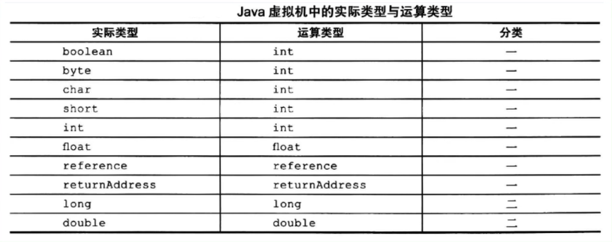

- **运算时的溢出**
  
  - 数据运算可能会导致溢出，例如两个很大的正整数相加，结果可能只是一个负数。其实Java虚拟机规范并没有明确规定整型数据溢出的结果，仅仅规定了在处理整型数据的时候，只有除法指令以及求余指令中出现除数为0的情况下，会导致虚拟机抛出 ArithmetciException 异常

- **运算模式**
  
  - 向最接近数舍入模式：JVM 要求在进行浮点数计算时，所有的运算结果都必须舍入到适当的精度，非精确结果必须舍入为可被表示的最接近的精确值，如果有两种可表示的形式与该值一样接近，将优先选择最低有效位为零的。
  - 向零舍入模式：将浮点数转换为整数时，采用该模式，该模式将在目标数值类型中选择一个最接近但是不大于原值的数字作为最精确的舍入结果。

- **NaN的使用**
  
  - 当一个操作产生溢出时，将会使用有符号的无穷大表示，如果某个操作结果没有明确的数学定义的话，将会使用 NaN 值来表示。而且所有使用 NaN 值作为操作数的算术操作，结果都会返回 NaN 。

### 17.3.1 所有的运算符指令

- 所有的运算符指令包括

- 加法指令：iadd、ladd、fadd、dadd

- 减法指令：isub、lsub、fsub、dsub

- 乘法指令：imul、lmul、fmul、dmul

- 除法指令：idiv、ldiv、fdiv、ddiv

- 求余指令：irem、lrem、frem、drem(remainder：余数)

- 取反指令：ineg、lneg、fneg、dneg(negation：取反)

- 自增指令：iinc

- 位运算指令，又可分为：

- - 位移指令：ishl、ishr、iushr、lshl、lshr、lushr
  - 按位或指令：ior、lor
  - 按位与指令：iand、land
  - 按位异或指令：ixor、lxor

- 比较指令：dcmpg、dcmlp、fcmpg、fcmpl、lcmp

- **关于++操作的理解**

```java
public class IAdd {
    public void m1() {
        int i = 10;
        i++;
    }

    public void m2() {
        int i = 10;
        ++i;
    }

    public void m3() {
        int i = 10;
        int a = i++;

        int j = 20;
        int b = ++j;
    }

    public void m4() {
        int i = 10;
        i = i++;
        System.out.println(i);
    }
}
```

- 对于不参与运算的情况下，i++ 和 ++i 的字节码操作是一样的


- 参与运算的情况下


- i = 1++ 的情况下


### 17.3.2 比较指令的说明

- 比较指令的作用是比较栈顶两个元素的大小，并将比较结果入栈

- 比较指令有：dcmpg、dcmpl、fcmpg、fcmpl、lcmp

- - 与前面讲解的指令类似，首字符 d 表示 double 类型，f 表示 float，l 表示 long

- 对于 double 和 float 类型的数字，由于 NaN 的存在，各有两个版本的比较指令，以 float 为例，有 fcmpg 和 fcmpl 两个指令，它们的区别在于在数字比较时，若遇到 NaN 值，处理结果不同

- 指令 dcmpl 和 dcmpg 也是类似的，根据其命名可以推测其含义，在此不再赘述

- 指令 lcmp 针对 long 型整数，由于 long 型整数没有 NaN 值，故无需准备两套指令

- 举例：
  
  - 指令 fcmpg 和 fcmpl 都从栈中弹出两个操作数，并将它们做比较，设栈顶的元素为 v2， 栈顶顺位第2位元素为 v1，若 v1 = v2，则压入0；若 v1 > v2 则压入1；若 v1 < v2 则压入-1
  
  - 两个指令的不同之处在于，如果遇到 NaN 值，fcmpg 会压入1，而 fcmpl 会压入-1
  
  - 数值类型的数据才可以谈大小，boolean、引用数据类型不能比较大小

## 17.4 类型转换指令

- **类型转换指令说明**
  - 类型转换指令可以将两种不同的数值类型进行相互转换
  - 这些转换操作一般用于实现用户代码中的 **显式类型转换操作，** 或者用来处理**字节码指令集中数据类型相关指令**无法与**数据类型**一一对应的问题

### 17.4.1 宽化类型转换(Widening Numeric Conversions)

- **转换规则**
- Java 虚拟机直接支持以下数值的宽化类型转换(Widening Numeric Conversion，小范围类型向大范围类型的安全转换)。也就是说，并不需要指令执行，包括：
  - 从 int 类型到 long、float 或者 double 类型，对应的指令为：i2l、i2f、i2d
  - 从 long 类型到 float、double 类型。对应的指令为：l2f、l2d
  - 从 flaot 类型到 double 类型。对应的指令为：f2d
  - 简化为：int --> long --> float --> double
- **精度损失问题**
  - 宽化类型转换是不会因为超过目标类型最大值而丢失信息的，例如，从 int 转换到 long，或者从 int 转换到 double，都不会丢失任何信息，转换前后的值是精确相等的 
  - 从 int、long 类型数值转换到 float，或者 long 类型数值转换到 double 时，将可能发生丢失精度——可能丢失掉几个最低有效位上的值，转换后的浮点数值是根据 IEEE754 最接近舍入模式所得到的正确整数数值。尽管宽化类型转换实际上是可能发生精度丢失的，但是这种转换永远不会导致 Java 虚拟机抛出运行时异常 
  - **从 byte、char 和 short 类型到 int 类型的宽化类型转换实际上是不存在的**，对于 byte 类型转换为 int，虚拟机并没有做实质性的转化处理，只是简单地通过操作数栈交换了两个数据。而 byte 转为 long 时，使用的是 i2l，可以看到在内部 byte 在这里已经等同于 int 类型处理，类似的还有 short 类型，这种处理方式有两个特点 ：
    - 一方面可以减少实际的数据类型，如果为 short 和 byte 都准备一套指令，那么指令的数量就会大增，而**虚拟机目前的设计上，只愿意使用一个字节表示指令，因此指令总数不能超过256个，为了节省指令资源，将 short 和 byte 当作 int 处理也是情理之中** 
    - 另一方面，由于局部变量表中的槽位固定为32位，无论是 byte 或者 short 存入局部变量表，都会占用32位空间。从这个角度来说，也没有必要特意区分这几种数据类型 

### 17.4.2 窄化类型转换(Narrowing Numeric Conversion)

- 转换规则
  
  - Java 虚拟机也直接支持以下窄化类型转换：
    - 从 int 类型至 byte、short 或者 char 类型。对应的指令有：i2b、i2c、i2s
    - 从 long 类型到 int 类型。对应的指令有：l2i
    - 从 float 类型到 int 或者 long 类型。对应的指令有：f2i、f2l
    - 从 double 类型到 int、long 或者 float 类型。对应的指令有：d2i、d2l、d2f

- 精度损失问题
  
  - 窄化类型转换可能会导致转换结果具备不同的正负号、不同的数量级，因此，转换过程很可能会导致数值丢失精度
  - 尽管数据类型窄化转换可能会发生上限溢出、下限溢出和精度丢失等情况，但是 Java 虚拟机规范中明确规定数值类型的窄化转换指令永远不可能导致虚拟机抛出运行时异常

- 补充说明
  
  - 当将一个浮点值窄化转换为整数类型T（T限于int类型或者long类型之一）的时候，将遵循以下转换原则
    
    - 如果浮点为NaN，那么转换结果就是int 或者long类型的0
    - 如果浮点值不是无穷大的话，浮点值使用 IEEE 754 的向零舍入模式取整，获得整数值v，如果v在目标类型T（int 或者 long）的表示范围之内，那转换的结果就是v。否则，将根据v的符号，转换T所能表示的最大或者最小正数。
  
  - 当将一个double类型窄化转换为float类型的时候，将遵循以下转换规则，通过向最接近数舍入模式舍入一个可以使用float类型表示的数字。最后结果根据下面这3条规则判断。
    
    - 如果转换结果的绝对值太小而无法使用float表示，将返回float类型的正负0
    
    - 如果转换结果的绝对值太大而无法使用float表示，将返回float类型的正负无穷大
    
    - 对于double类型的NaN值将按规定转换为float类型的NaN值

## 17.5 对象的创建和访问指令

- Java是面向对象的程序设计语言，虚拟机平台从字节码层面就对面向对象做了深层次的支持。有一系列指令专门用于对象操作，可进一步细分为创建指令、字段访问指令、数组操作指令、类型检查指令

### 17.5.1 创建指令

- 虽然类实例和数组都是对象。但是Java虚拟机对类实例和数组的创建与操作使用了不同的字节码指令
- **类创建实例的指令**
  - new
  - 它接收一个操作数，为指向常量池的索引，表示要创建的类型，执行完成之后，将对象的引用压入栈
- **创建数组的指令**
  - newarray、anewarray、multiannewarray
    - newarray：创建基本数据类型数组
    - anewarray：创建引用数据类型数组
    - multiannewarray：创建多维数组
- 上述指令可以用于创建对象或者数组，由于对象和数组再Java中的广泛使用，这些指令的使用频率也非常高。

### 17.5.2 字段访问指令

- 对象创建之后，就可以通过对象访问指令获取对象实例或者数组实例中的字段或者数组元素
  
  - 访问类字段（static字段，或者称为类变量）的指令：getstatic、putstatic
  - 访问类实例字段（费static字段，或者称为实例变量）的指令：getfield、putfield

- **举例：**
  
  - 以getstatic指令为例，它含有一个操作数，为指向常量池的 Fielref 的索引，它的作用就是获取 Fieldref 指定的对象的值，并将其压入操作数栈
  
  ```java
  public void sayHello(){
      System.out.println("hello");
  }
  ```
  
  - 对应的字节码指令
  
  ```java
  0 getstatic #8 <java/lang/System.out>
  3 ldc #9 <Hello>
  5 invokevirtual #10 <java/io/PrintStream.println>
  8 return
  ```
  
  - 图示
  
  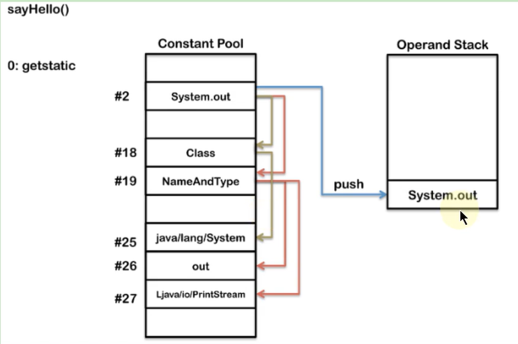
  
  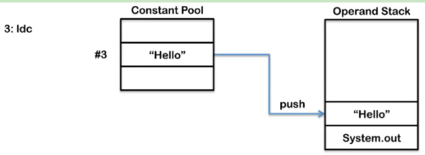
  
  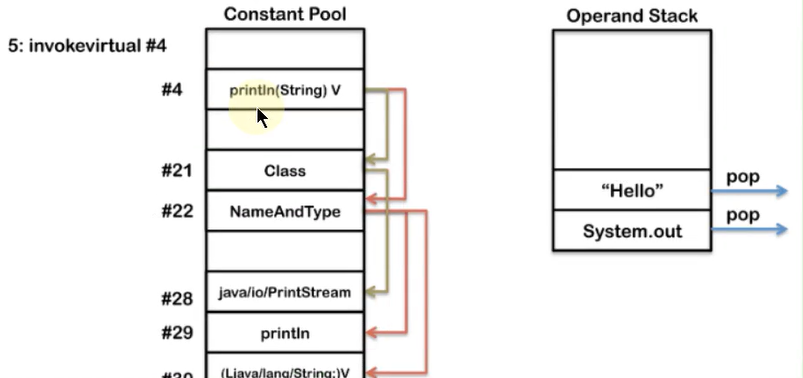

### 17.5.3 数组操作指令

- 数组操作指令主要有：xastore和xaload指令。具体为：
  
  - 把一个数组元素加载到操作数栈的指令：baload、caload、saload、iaload、laload、faload、daload、aaload
  - 将一个操作数栈的值存储在数组元素中的指令：bastore、castore、sastore、iastore、lastore、fastore、dastore、aastore
  
  
  
  - 取数组长度的指令：arraylength
    - 该指令弹出栈顶的数组元素，获取数组的长度，将长度压入栈

- 说明
  
  - 指令xaload表示将数组的元素压栈，比如saload、caload分别表示压入short数组和char数组。指令xoload在执行的时候，要求操作数中的栈顶元素为数组索引i，栈顶顺位第2个元素为数组引用a，该指令会弹出栈顶这两个元素，并将a[i]重新压入堆栈
  - xastore则专门针对数组操作，以iastore为例，它用于给一个int数组的给定索引赋值。在iastore执行前，操作数栈顶需要以此准备3个元素：值、索引、数组引用，iastore会弹出这3个值，并且将值赋予给数组中指定索引位置。

### 17.5.4 类型检查指令

- 检查类实例或数组类型的指令：instanceof、checkcast
  - 指令 checkcast 用于检查类型强制转换是否可以进行。如果可以进行，那么 checkcast 指令不会改变操作数栈，否则它会抛出 ClassCastException 异常
  - 指令 instanceof 用来判断给定对象是否是某一个类的实例，它会将判断结果压入操作数栈

## 17.6 方法调用与返回值

### 17.6.1 方法调用指令

- invokevirtual、invokeinterface、invokespecial、invokestatic、invokedynamic
- 以下5条指令用于方法调用
  - invokevirtual指令用于调用对象的实例方法，根据对象的实际类型进行分派（虚方法分派），支持多态。这也是Java语言中 **最常见的方法分派方式**
  - invokeinterface 指令用于 **调用接口方法**，它会在运行时候搜索由特定对象所实现的这个接口的方法，并找出适合的方法进行调用
  - invokespecial 指令用于调用一些需要特殊处理的实例方法，包括 **实例初始化方法（构造器）、私有方法和父类方法**。这些方法都是 **静态类型绑定的**，不会在调用的时候进行动态分发。
  - invokestatic指令用于调用命名中 **类中的类方法（static方法）**。这是静态绑定的
  - invokedynamic：调用动态绑定的方法，这个是动态绑定的方法，是JDK1.7后新加入的指令。用于在运行的时候解析调用点限定符的方法，并执行该方法。前面4条调用指令的分派逻辑都固化在Java虚拟机内部，而invokedynamic指令的分派逻辑是由用户所设定的引导方法决定的。

### 17.6.2 方法返回指令

- 方法结束调用之前，需要进行返回。方法返回指令是 **根据返回值的类型区分的**
  
  - 包括 ireturn（当返回值是 boolean、byte、char、short和int类型的时候使用）、lreturn、freturn、dreturn、和areturn
  - 另外还有一条 return 指令声明为void的方法、实例初始化方法以及类和接口的类初始化方法使用
  
  
  
  * 举例：
    
    * 通过 ireturn 指令，将当前函数操作数栈的顶层元素弹出，并将这个元素压入调用者函数的操作数栈中(因为调用者非常关心函数的返回值)，所有在当前函数操作数栈中的其他元素都会被丢弃
    
    * 如果当前返回的是 synchronized 方法，那么还会执行一个隐含的 monitorexit 指令，退出临界区
    
    * 最后，会丢弃当前方法的整个帧，恢复调用者的帧，并将控制权转交给调用者

## 17.7 操作数栈管理指令

- 如同操作一个普通数据结构中的堆栈那样，JVM提供的操作数栈管理指令，可以用于直接操作操作数栈的指令

- 这类指令包括以下内容：
  
  - 将一个或两个元素从栈顶弹出，并且直接废弃：pop、pop2
  
  - 复制栈顶一个或两个数值并将复制值或双份的复制值重新压入栈顶：dup、dup2、dup_x1、dup2_x1、dup_x2、dup2_x2
  
  - 将栈最顶端的两个Solt数值的位置交换：swap。Java虚拟机没有提供交换2个64位数据类型（long、double）数值的指令
  
  - 指令nop，是一个非常特殊的指令，它的字节码为0x00。和汇编语言中的nop一样，它表示什么都不做。这条指令一般可用于调试、占位等。
  
  - 这些指令属于通用型，堆栈的压入或者弹出无需指明数据类型

- 说明
  
  - 不带 _x 的指令是复制栈顶数据并压入栈顶。包括两个指令，dup 和 dup2，dup 的系数代表要复制的 Slot 个数
  
  - - dup 开头的指令用于复制1个 Slot 的数据。例如1个 int 或1个 reference 类型数据
    - dup2 开头的指令用于复制2个 Slot 的数据。例如1个 long，或2个 int，或1个 int 加1个 float 类型数据
  
  - 带 _x 的指令是复制栈顶数据并插入栈顶以下的某个位置。共有4个指令，dup_x1、dup2_x1、dup_x2、dup2_x2。对于带 _x 的复制插入指令，只要将指令的 dup 和 x 的系数相加，结果即为需要插入的位置。因此
  
  - - dup_x1 插入位置：1+1=2，即栈顶2个 Slot 下面
    - dup_x2 插入位置：1+2=3，即栈顶3个 Slot 下面
    - dup2_x1 插入位置：2+1=3，即栈顶3个 Slot 下面
    - dup2_x2 插入位置：2+2=4，即栈顶4个 Slot 下面
  
  - pop：将栈顶的1个 Slot 数值出栈。例如1个 short 类型数值
  
  - pop2：将栈顶的2个 Slot 数值出栈。例如1个 double 类型数值，或者2个 int 类型数值

## 17.8 控制转移指令

- 程序流程离不开条件控制，为了支持条件跳转，虚拟机提供了大量字节码指令，大体上可以分为比较指令（在之前的算术指令）、条件跳转指令、比较条件跳转指令、多条件分支跳转指令、无条件跳转指令等

### 17.8.1 条件跳转指令

- 条件跳转指令通常和比较指令结合使用。在条件跳转指令执行前，一般可以先用比较指令进行栈顶元素的准备，然后进行条件跳转

- 条件跳转指令有：ifeq、iflt、ifle、ifne、ifgt、ifge、ifnull、ifnonnull。这些指令都接收两个字节的操作数，用于计算跳转的位置(16位符号整数作为当前位置的 offset)

- 它们的统一含义为：**弹出栈顶元素，测试它是否满足某一条件，如果满足条件，则跳转到给定位置**

- **具体说明**


- **注意**
  - 与前面运算规则一致
  - 对于 boolean、byte、char、short 类型的条件分支比较操作，都是使用 int 类型的比较指令完成
  - 对于 long、float、double 类型的条件分支比较操作，则会先执行相应类型的比较运算指令，运算指令会返回一个整型值到操作数栈中，随后再执行 int 类型的条件分支比较操作来完成整个分支跳转
  - 由于各类型的比较最终都会转为 int 类型的比较操作，所以 Java 虚拟机提供的 int 类型的条件分支指令是最为丰富和强大的

### 17.8.2 比较条件跳转指令

- 比较条件跳转指令类似于比较指令和条件跳转指令的结合体，它将比较和跳转两个步骤合二为一
- 这类指令有：if_icmped、if_icmpne、if_icmplt、if_icmpgt、if_icmple、if_icmpge、if_acmped 和 if_acmpne
- 其中指令助记符加上 "if_" 后，以字符 "i" 开头的指令针对 int 型整数操作(也包括 short 和 byte 类型)，以字符 "a" 开头的指令表示对象引用的比较
- **具体说明**

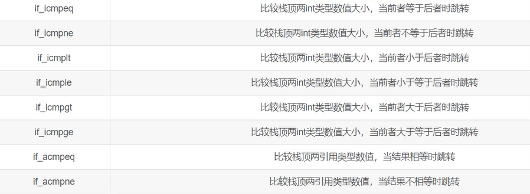

- 这些指令都接收两个字节的操作数作为参数，用于计算跳转的位置。同时在执行指令时，栈顶需要准备两个元素进行比较。指令执行完成后，栈顶的这两个元素被清空，且没有任何数据入栈。**如果预设条件成立，则执行跳转，否则，继续执行下一条语句** 

### 17.8.3 多条件分支跳转

- 多条件分支跳转指令是专为 switch-case 语句设计的，主要有 tableswitch 和 lookupswitch 


- 从助记符上看，两者都是 switch 语句的实现，它们的区别：
  
  - tableswitch 要求**多个条件分支值是连续的**，它内部只存放起始值和终止值，以及若干个跳转偏移量，通过给定的操作数 index，可以立即定位到跳转偏移量位置，**因此效率比较高**
  - lookupswitch 内部**存放着各个离散的 case-offset 对**，每次执行都要搜索全部的 case-offset 对，找到匹配的 case 值，并根据对应的 offset 计算跳转地址，**因此效率较低**

- 指令 tableswitch 的示意图如下图所示。由于 tableswitch 的 case 值是连续的，因此只需要记录最低值和最高值，以及每一项对应的 offset 偏移量，根据给定的 index 值通过简单的计算即可直接定位到 offset

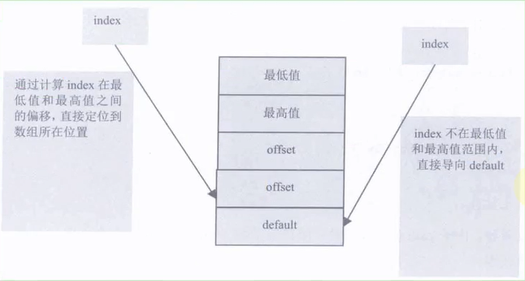

- 指令 lookupswitch 处理的是离散的 case 值，但是出于效率考虑，将 case-offset 对按照 case 值大小排序，给定 index 时，需要查找与 index 相等的 case，获得其 offset，如果找不到则跳转到 default。指令 lookupswitch 如下图所示 

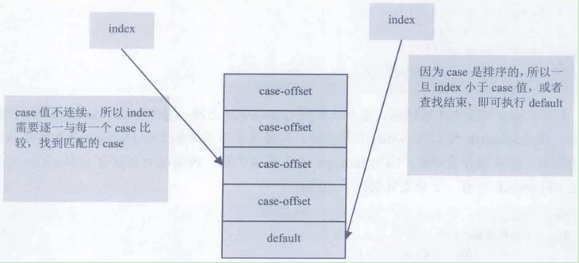

### 17.8.4 无条件跳转

- 目前主要的无条件跳转指令为 goto，指令 goto 接收两个字节的操作数，共同组成一个带符号的整数，**用于指定指令的偏移量，指令执行的目的就是跳转到偏移量给定的位置处**
- 如果指令偏移量太大，超过双字节的带符号整数的范围，则可以使用指令 goto_w，它和 goto 有相同的作用，但是它接收4个字节的操作数，可以表示更大的地址范围
- 指令 jsr、jsr_w、ret 虽然也是无条件跳转的，但主要用于 try-finally 语句，且已经被虚拟机逐渐废弃，故不在这里介绍这两个指令


## 17.9 异常处理指令

### 17.9.1 抛出异常指令

- **athrow 指令**
  - 在 Java 程序中显式抛出异常的操作(throw 语句)都是由 athrow 指令来实现的
  - 除了使用 throw 语句显式抛出异常情况之外，**JVM 规范还规定了许多运行时一场会在其它 Java 虚拟机指令检测到异常状况时自动抛出**。例如，在之前介绍的整数运算时，当除数为零时，虚拟机会在 idiv 或 ldiv 指令中抛出 ArithmeticException 异常
- **注意**
  - 正常情况下，操作数栈的压入弹出都是一条条指令完成的。唯一的例外情况是**在抛异常时，Java 虚拟机会清除操作数栈上的所有内容，而后将异常实例压入调用者操作数栈上**
- **异常及异常的处理：**
  - 过程一：异常对象的生成过程 ---> throw(手动/自动) ---> 指令：athrow
    - 自动抛异常不会显示在代码中
  - 过程二：异常的处理：抓抛模型 try-catch-finally ---> 使用异常表
- 举例
- 方法内手动抛出异常

```java
    public void throwZero(int i){
        if(i == 0){
            throw new RuntimeException("参数值为0");
        }
    }
```

```java
 0 iload_1//常量 i 加载到 本地变量表1的位置
 1 ifne 14 (+13)//比较如果等于0，直接跳转到14位置，不等于0，往下执行。+13表示，当前步骤加13个步骤，就是14
 4 new #2 <java/lang/RuntimeException>//创建一个RuntimeException对象
 7 dup//复制RuntimeException对象
 8 ldc #3 <参数值为0>//加载常量 “参数值为0”
10 invokespecial #4 <java/lang/RuntimeException.<init> : (Ljava/lang/String;)V>//调用构造方法
13 athrow//抛出异常
14 return//返回
```


* 方法抛出异常

```java
public void throwOne(int i) throws RuntimeException,IOException{
        if(i == 1){
            throw new RuntimeException("参数值为1");
        }
    }
```

```java
 0 iload_1
 1 iconst_1
 2 if_icmpne 15 (+13)
 5 new #2 <java/lang/RuntimeException>
 8 dup
 9 ldc #5 <参数值为1>
11 invokespecial #4 <java/lang/RuntimeException.<init> : (Ljava/lang/String;)V>
14 athrow
15 return
```

code都差不多，方法上多了异常信息属性，不同于异常表。

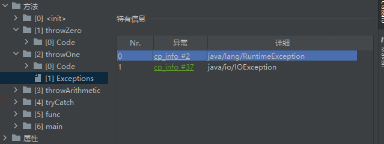


* 方法不抛出异常，代码也不抛出异常。

  这种是jvm定义好的异常，不会在代码和异常表及方法异常信息中体现。

```java
    public void throwArithmetic() {
        int i = 10;
        int j = i / 0;
        System.out.println(j);
    }
```

```java
 0 bipush 10//10压到栈中
 2 istore_1//栈顶元素弹出，加载到局部变量表1的位置，0的位置是this
 3 iload_1//把局部变量表1的位置加载到栈中
 4 iconst_0//加载常量到占中
 5 idiv//除法计算，弹出栈顶两个元素
 6 istore_2//将栈顶元素加载局部变量表为2的位置
 7 getstatic #6 <java/lang/System.out : Ljava/io/PrintStream;>//调用静态方法
10 iload_2//加载局部变量表为2的位置到栈中
11 invokevirtual #7 <java/io/PrintStream.println : (I)V>//调用println方法
14 return//结束
```

### 17.9.2 异常处理与异常表

- **处理异常**
  - 在Java虚拟机中 ，处理异常(catch 语句)不是由字节码指令来实现的(早期使用 jsr、ret 指令)，而是**采用异常表来完成的** 
- **异常表**
  - 如果一个方法定义了一个 try-catch 或者 try-finally 的异常处理，就会创建一个异常表。它包含了每个异常处理或者 finally 块的信息。异常表保存了每个异常处理信息。比如：
    - 起始位置
    - 结束位置
    - 程序计数器记录的代码处理的偏移地址
    - 被捕获的异常类在常量池中的索引
- 当一个异常被抛出时，JVM 会在当前的方法里寻找一个匹配的处理，如果没有找到，这个方法会强制结束并弹出当前栈帧，并且异常会重新抛给上层调用的方法(在调用方法栈帧)。如果在所有栈帧弹出前仍然没有找到合适的异常处理，这个线程将终止。如果这个异常在最后一个非守护线程里抛出，将会导致 JVM 自己终止，比如这个线程是个 main 线程
- 不管什么时候抛出异常，如果异常处理最终匹配了所有异常类型，代码就会继续执行在这种情况下， 如果方法结束后没有抛出异常，仍然执行 finally 块，在 return 前，它直接跳到 finally 块来完成目标
- 举例

```java
    public void tryCatch(){
        try{
            File file = new File("d:/hello.txt");
            FileInputStream fis = new FileInputStream(file);

            String info = "hello!";
        }catch (FileNotFoundException e) {
            e.printStackTrace();
        }
        catch(RuntimeException e){
            e.printStackTrace();
        }
    }
```

```java
 0 new #8 <java/io/File> //创建file对象
 3 dup //复制file对象
 4 ldc #9 <d:/hello.txt>//加载字符串常量
 6 invokespecial #10 <java/io/File.<init> : (Ljava/lang/String;)V>//调用构造方法
 9 astore_1//将栈顶file对象加载到局部变量表1的位置
10 new #11 <java/io/FileInputStream>//创建FileInputStream对象
13 dup  //复制FileInputStream对象
14 aload_1//局部变量表为1的加载到栈中
15 invokespecial #12 <java/io/FileInputStream.<init> : (Ljava/io/File;)V>//调用构造方法
18 astore_2//将栈顶FileInputStream对象加载到局部变量表2的位置
19 ldc #13 <hello!>//加载常量 hello!
21 astore_3//将栈顶常量 hello! 加载到局部变量表3的位置
22 goto 38 (+16) //跳转到38行执行    到38之间的都是异常表执行代码
25 astore_1 //将栈顶元素FileNotFoundException对象e，存储到局部变量表1的位置
26 aload_1 //将局部变量表1的位置加载到栈中
27 invokevirtual #15 <java/io/FileNotFoundException.printStackTrace : ()V>//调用printStackTrace方法
30 goto 38 (+8)//跳转到38行执行
33 astore_1//将栈顶元素RuntimeException对象e，存储到局部变量表1的位置
34 aload_1//将局部变量表1的位置加载到栈中
35 invokevirtual #16 <java/lang/RuntimeException.printStackTrace : ()V>//调用printStackTrace方法
38 return
```


发生异常时，匹配异常表，匹配上了，就执行异常表的代码。


* 思考题

```java
   //思考：如下方法返回结果为多少？
    public static String func() {
        String str = "hello";
        try{
            return str;
        }
        finally{
            str = "dddteew";
        }
    }

    public static void main(String[] args) {

        System.out.println(func());//hello
    }
```

```java
 0 ldc #17 <hello> //加载 hello常量到栈
 2 astore_0//存储栈顶数据到本地变量表0的位置
 3 aload_0//加载局部变量表0的位置到栈顶
 4 astore_1//存储栈顶数据到本地变量表1的位置
 5 ldc #18 <dddteew>//加载常量 dddteew
 7 astore_0//存储栈顶数据到本地变量表0的位置，此时局部变量表0的位置为 dddteew
 8 aload_1//加载局部变量表1的位置到栈顶
 9 areturn//返回数据，返回的栈顶数据，hello
     
10 astore_2//这是异常表执行代码，把异常信息加载到本地变量表2的位置
11 ldc #18 <dddteew>//加载常量 dddteew到栈顶
13 astore_0//存储栈顶数据到本地变量表0的位置，此时局部变量表0的位置为 dddteew
14 aload_2//加载局部变量表2的位置到栈顶，此时局部变量表2的位置为异常对象
15 athrow//抛出异常对象
```

* 验证

```java
  private static String str = "hello";
    //思考：如下方法返回结果为多少？
    public static String func() {
         str = "hello";
        try{
            return str;
        }
        finally{
            str = "dddteew";
        }
    }

    public static void main(String[] args) {
        System.out.println(func());//hello
        System.out.println(str);//dddteew
    }
```

* 结论：先执行返回，再执行finally代码。return时，返回给上层栈帧时会复制一份，然后弹出给上层栈帧。下面的继续执行

## 17.8 同步控制指令

- Java 虚拟机支持两种同步结构：**方法级同步** 和 **方法内部一段指令序列的同步**，这两种同步都是使用 monitor 来支持的 

### 17.8.2 方法级的同步

- 方法级的同步：是隐式的，即无需通过字节码指令来控制，它实现在方法调用和返回操作之中。虚拟机可以从方法常量池的方法表结构中的 ACC_SYNCHRONIZED 访问标志得知一个方法是否声明为同步方法

- 当调用方法时，调用指令将会检查方法的 ACC_SYNCHRONIZED 访问标志是否设置
  
  - 如果设置了，执行线程将先持有同步锁，然后执行方法，最后在方法完成(无论是正常完成还是非正常完成)时释放同步锁
  - 在方法执行期间，执行线程持有了同步锁，其它任何线程都无法再获得同一个锁
  - 如果一个同步方法执行期间抛出了异常，并且在方法内部无法处理此异常，那么这个同步方法所持有的锁将在异常抛到同步方法之外时自动释放

- 举例： 

```java
private int i = 0;
public synchronized void add() {
    i++;
}
```

- 对应字节码

  字节码并没有synchronized，而在add方法的访问标识上添加了synchronized。

```java
0 aload_0
1 dup
2 getdield #2 <com/atguigu/java1/SynchronizedTest.i>
5 iconst_1
6 iadd
7 putfield #2 <com/atguigu/java1/SynchronizedTest.i>
10 return
```

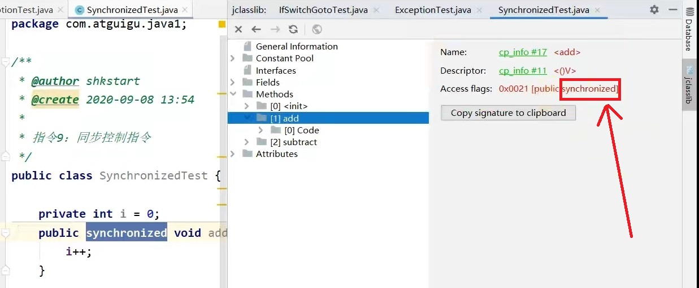

- **说明：**

  这段代码和普通的无同步操作的代码没有什么不同，没有使用 monitorenter 和 monitorexit 进行同步区控制。这是因为，对于同步方法而言，当虚拟机通过方法的访问标识符判断是一个同步方法时，会自动在方法调用前进行加锁，当同步方法执行完毕后，不管方法是正常结束还是有异常抛出，均会由虚拟机释放这个锁。因此，对于同步方法而言，monitorenter 和 monitorexit 指令是隐式存在的，并未直接出现在字节码中

### 17.8.3 方法内指定指令序列的同步

- 同步一段指令集序列：通常是由 Java 中的 synchronized 语句块来表示的。JVM 的指令集有 monitorenter 和 monitorexit 两条指令来支持 synchronized 关键字的语义

- 当一个线程进入同步代码块时，它使用 monitorenter 指令请求进入。如果当前对象的监视器计数器为0，则它会被准许进入，若为1，则判断持有当前监视器的线程是否为自己，如果是，则进入，否则进行等待，知道对象的监视器计数器为0，才会被允许进入同步块

- 当线程退出同步块时，需要使用 monitorexit 声明退出。在 Java 虚拟机中，任何对象都有一个监视器与之相关联，用来判断对象是否被锁定，当监视器被持有后，对象处于锁定状态

- 指令 monitorenter 和 monitorexit 在执行时，都需要在操作数栈顶压入对象，之后 monitorenter 和 monitorexit 的锁定和释放都是针对这个对象的监视器进行的

- 编译器必须确保无论方法通过何种方式完成，方法中调用过的每条 monitorenter 指令都必须执行其对应的 monitorexit 指令，而无论这个方法是正常结束还是异常结束

- 为了保证在方法异常完成时 monitorenter 和 monitorexit 指令依然可以正确配对执行，**编译器会自动产生一个异常处理器，这个异常处理器声明可处理所有的异常**，它的目的就是用来执行 monitorexit 指令

* 举例

```java
    private Object obj = new Object();
    public void subtract(){

        synchronized (obj){
            i--;
        }
    }
```

```java
 0 aload_0 //加载局部变量表0的位置 this
 1 getfield #4 <chapter17/SynchronizedTest.obj : Ljava/lang/Object;>//获取this属性obj，压入栈
 4 dup //复制obj
 5 astore_1 //存入局部变量表1的位置
 6 monitorenter//线程进入
 7 aload_0//加载局部变量表0的位置  this
 8 dup//复制
 9 getfield #2 <chapter17/SynchronizedTest.i : I>//获取属性i，压入栈
12 iconst_1//压入常量1
13 isub//栈顶两个元素做减法
14 putfield #2 <chapter17/SynchronizedTest.i : I>//弹出栈，设置属性
17 aload_1//加载局部变量表1的位置 obj
18 monitorexit//线程退出
19 goto 27 (+8)//跳转到27，结束
22 astore_2//将异常对象存入局部变量表为2的位置。方法中有异常时处理代码，局部变量表见下图。
23 aload_1//加载局部变量表1的位置 obj
24 monitorexit//线程退出
25 aload_2//加载局部变量表2的位置 异常对象
26 athrow//抛出
27 return
```


异常表+异常执行代码块，为了保证异常时，也能释放线程锁。上图的22-25执行也有可能抛异常，为了保证能释放线程锁，所以需要跳转到22。至于为什么会反复执行，不太明白。

锁在对象的对象头的元数据中，包括锁状态标志、哪个线程持有的锁。

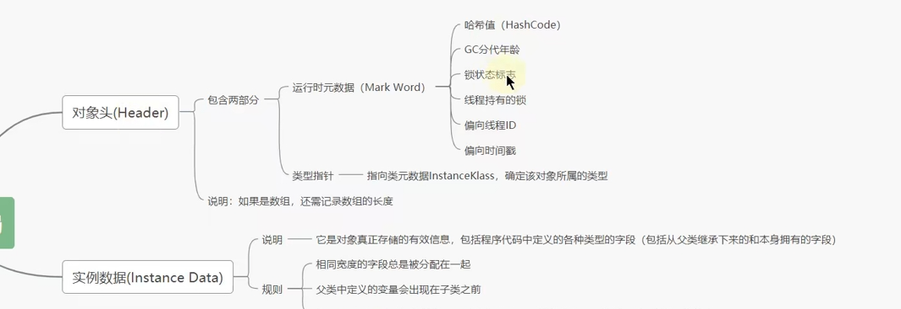