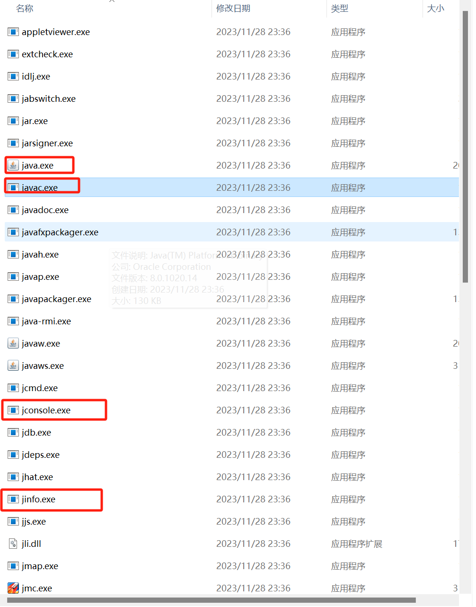
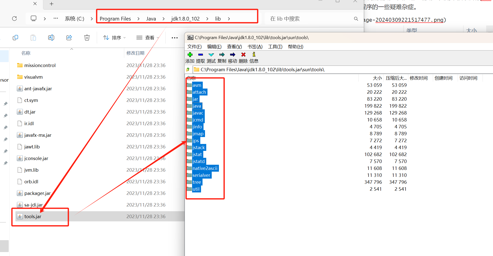
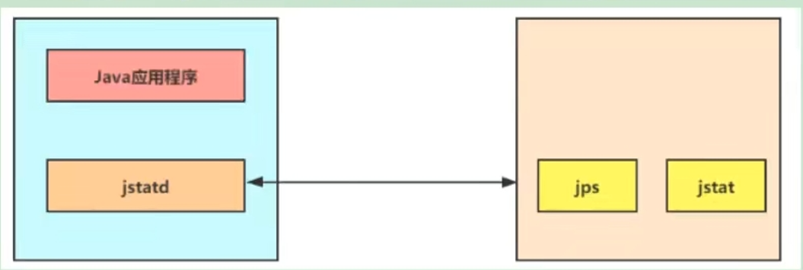

# 第21章-性能监控与调优-命令行

## 21.1 概述

​	性能诊断是软件工程师在日常工作中需要经常面对和解决的问题，在用户体验至上的今天，解决好应用的性能问题能带来非常大的收益。

​	Java作为最流行的编程语言之一，其应用性能诊断一直受到业界广泛关注。可能造成Java应用出现性能问题的因素非常多，例如线程控制、磁盘读写、数据库访问、网络I/O、垃圾收集等。想要定位这些问题，一款优秀的性能工具必不可少。（使用数据说明问题，使用知识分析问题，使用工具处理问题。无监控、不调优）。

### 21.1.1 简单命令行工具

​	在我们刚接触Java学习的时候，大家肯定最先了解的两个命令就是Javac、java，那么除此之外，还有没有其他命令可供我们使用呢？我们进入到JDK的bin目录，发现还有一系列的辅助工具。这些辅助工具用来获取目标JVM不同方面、不同层次的信息，帮忙开发人员很好的解决Java应用程序的一些疑难杂症。



这些命令对于的源码位置都在lib目录的tools.jar下面的sun/tools



源码链接：https://hg.openjdk.org/jdk/jdk11/file/1ddf9a99e4ad/src/jdk.jcmd/share/classes/run/tools

## 21.2 jps：查看正在运行的Java进程

### 21.2.1 基本情况

​	jps(Java process status)java进程状态

​	显示顶顶系统内所有HotSpot虚拟机进程（查看虚拟机进程信息），可用于查询正在运行的虚拟机进程。

​	说明：对于本地虚拟机进程来说，进程的本地虚拟机ID与操作系统的进程ID是一致的，是唯一的。

### 21.2.2 测试

```shell
C:\Users\Administrator>jps
13680 RemoteMavenServer36
2916 Jps
2136
#查看进程2136 是IDEA的线程ID，jps查询来的id与系统显示的进程id是一样的
```

### 21.2.3 基本语法

​	语法：jps [options] [hostid]    还可以追加参数，来打印额外的信息

#### 21.2.3.1 options参数

-q:仅仅显示LVMID（local virtual machine id），即本地虚拟机唯一id，不显示主类的名称等。

-l:输出应用程序主类的全类名或则如果进程执行的是jar包，则输出jar完整路径。

-m:输出虚拟机进程启动时传递给主类main()函数的参数。

-v:列出虚拟机进程启动时的JVM参数。比如：-Xms20m -Xmx50m是启动程序指定的jvm参数。

以上参数可以综合使用。

如果某Java进程关闭了UsePerfData(默认开启的，可以用-XX:-UsePerfData进行关闭)参数，那么jps命令以及jstat将无法探知该Java进程。

```shell
C:\Users\Administrator>jps -q
13680
2384
2136

C:\Users\Administrator>jps -l
13680 org.jetbrains.idea.maven.server.RemoteMavenServer36
6672 jdk.jcmd/sun.tools.jps.Jps
2136

C:\Users\Administrator>jps -m
13680 RemoteMavenServer36
14648 Jps -m
2136

C:\Users\Administrator>jps -l -m
13680 org.jetbrains.idea.maven.server.RemoteMavenServer36
2136
6136 jdk.jcmd/sun.tools.jps.Jps -l -m

C:\Users\Administrator>jps -l -q
13680
15432
2136

C:\Users\Administrator>jps -q -l
13680
2136
7964

C:\Users\Administrator>jps -lq
illegal argument: -lq
usage: jps [--help]
       jps [-q] [-mlvV] [<hostid>]

Definitions:
    <hostid>:      <hostname>[:<port>]
    -? -h --help -help: Print this help message and exit.

C:\Users\Administrator>jps -lm
13680 org.jetbrains.idea.maven.server.RemoteMavenServer36
10712 jdk.jcmd/sun.tools.jps.Jps -lm
2136

C:\Users\Administrator>jps -lmv
13680 org.jetbrains.idea.maven.server.RemoteMavenServer36 -Djava.awt.headless=true -Dmaven.defaultProjectBuilder.disableGlobalModelCache=true -Didea.version=2021.2.1 -Didea.maven.embedder.version=3.6.3 -Xmx768m -Dmaven.ext.class.path=C:\Program Files\JetBrains\IntelliJ IDEA 2021.2.1\plugins\maven\lib\maven-event-listener.jar -Dfile.encoding=GBK
13812 jdk.jcmd/sun.tools.jps.Jps -lmv -Dapplication.home=C:\Program Files\Java\jdk-21 -Xms8m -Djdk.module.main=jdk.jcmd
2136  exit -Xmx2048m -Xms128m -XX:ReservedCodeCacheSize=512m -XX:+UseG1GC -XX:SoftRefLRUPolicyMSPerMB=50 -XX:CICompilerCount=2 -XX:+HeapDumpOnOutOfMemoryError -XX:-OmitStackTraceInFastThrow -ea -Dsun.io.useCanonCaches=false -Djdk.http.auth.tunneling.disabledSchemes="" -Djdk.attach.allowAttachSelf=true -Djdk.module.illegalAccess.silent=true -Dkotlinx.coroutines.debug=off -Djb.vmOptionsFile=C:\Users\Administrator\AppData\Roaming\JetBrains\IntelliJIdea2021.2\idea64.exe.vmoptions -Djava.system.class.loader=com.intellij.util.lang.PathClassLoader -Didea.vendor.name=JetBrains -Didea.paths.selector=IntelliJIdea2021.2 -Didea.jre.check=true -Dsplash=true -Dide.native.launcher=true -XX:ErrorFile=C:\Users\Administrator\java_error_in_idea64_%p.log -XX:HeapDumpPath=C:\Users\Administrator\java_error_in_idea64.hprof
```

#### 21.2.3.2 hostid参数

​	RMI注册表中注册的主机名。

​	如果想要远程监控主机上的java程序，需要安装jstatd。

​	对于具有更严格的安全时间的网络场所而言，可能使用一个自定义的策略文件来显示对特定的可信主机或网络的访问，尽管这种技术容易受到IP地址欺诈攻击。

​	如果安全问题无法使用一个定制的策略文件来处理，那么最安全的操作是不运行jstatd服务器，而是在本地使用jstat和jps工具。

## 21.3 jstat：查看JVM统计信息

### 21.3.1 基本情况

​	jstat(JVM Statistics Monitoring tool)：用于监视虚拟机各种运行状态信息的命令行工具。它可以显示本地或远程虚拟机进程中的类装载、内存、垃圾收集、JIT编译等运行数据。

​	在没有GUI图形界面，只提供了纯文本控制台环境的服务器上，它将是运行期间定位虚拟机性能问题的首选工具。常用于检测垃圾回收问题以及内存泄漏问题。

​	官方文档：https://docs.oracle.com/javase/8/docs/technotes/tools/unix/jstat.html

### 21.3.2 基本语法

​	语法：jstat -<option> [-t] [-h<lines>] <vmid> [<interval> [<count>]]

​	查看命令：jstat -h 或jstat -help

​	vmid就是jps查出来的进程id

#### 21.3.2.1 option参数

* 类装载相关
  * -class:显示ClassLoader的相关信息：类的装载、卸载数量、总空间、类装载所消耗的时间等。

```shell
C:\Users\Administrator>jstat -class 13680
Loaded  Bytes  Unloaded  Bytes     Time
  4132  7527.5      210   216.0       2.16
```

* 垃圾回收相关
  * -gc:显示与GC相关的堆信息。包括Eden去、两个Survivor区、老年代、永久代等的容量、已用空间、GC时间合计等信息。
  * -gccapacity:显示内容与-gc基本相同，但输出主要关注Java堆各个区域使用到的最大、最小空间。
  * -gcutil：显示内容与-gc基本相同，但输出主要关注已使用空间占总空间的百分比。
  * gccause：与gcutil功能一样，但是会额外输出导致最后一次或当前正在发生GC产生的原因。
  * -gcnew:显示新生代GC状况
  * -gcnewcapacity:显示内容与-gcnew基本相同，输出主要关注使用到的最大、最小空间
  * -gcold:显示老年代GC状况
  * -gcoldcapacity:显示内容与-gcold基本相同，输出主要关注使用到的最大、最小空间
  * -gcpermcapacity:显示永久代使用到的最大、最小空间。
  * 输出参数解析：
    * 新生代相关
      * S0C是第一个幸存者区的大小，单位字节
      * S1C是第二个幸存者区的大小，单位字节
      * S0U是第一个幸存者区已使用的大小，单位字节
      * S1U是第二个幸存者区已使用的大小，单位字节
      * EC是Eden空间的大小，单位字节
      * EU是Eden空间已使用的的大小，单位字节
    * 老年代相关
      * OC是老年代的大小，单位字节
      * OU是老年代已使用的大小，单位字节
    * 方法区（元空间）相关
      * MC是方法区的大小，单位字节
      * MU是方法区已使用的大小，单位字节
      * CCSC是压缩类空间的大小，单位字节
      * CCSU是压缩类空间已使用的大小，单位字节
    * 其他
      * YGC从应用程序启动到采集时young gc次数
      * YGCT从应用程序启动到采集时young gc消耗的时间，单位秒
      * FGC从应用程序启动到采集时Full gc次数
      * FGCT从应用程序启动到采集时young gc消耗的时间，单位秒
      * CGC从应用程序启动到采集时并发GC次数
      * CGCT从应用程序启动到采集时并发GC消耗的时间，单位秒
      * GCT从应用程序启动到采集时总gc消耗的时间，单位秒
* JIT相关的：
  * -compiler：显示JIT编译器编译过的方法、耗时等信息
  * -printcompilation：输出已经被JIT编译的方法。

```
C:\Users\Administrator>jstat -compiler 13680
Compiled Failed Invalid   Time   FailedType FailedMethod
    2804      1       0     2.84          1 java/util/jar/JarFile checkForSpecialAttributes
    
C:\Users\Administrator>jstat -printcompilation 13680
Compiled  Size  Type Method
    2804     46    1 java/util/HashMap remove
```


#### 21.3.2.2 interval参数

​	用于指定输出统计数据的周期，单位为毫秒。即：每隔多少时间查询然后输出一次。

```shell
C:\Users\Administrator>jstat -class 13680 1000
Loaded  Bytes  Unloaded  Bytes     Time
  4132  7527.5      210   216.0       2.16
  4132  7527.5      210   216.0       2.16
  4132  7527.5      210   216.0       2.16
  ...
#每1000ms打印一次数据
```

#### 21.3.2.3 count参数

​	用于指定查询的总次数，与interval搭配，查询多少条数据后结束。

```shell
C:\Users\Administrator>jstat -class 13680 1000 10
Loaded  Bytes  Unloaded  Bytes     Time
  4132  7527.5      210   216.0       2.16
  4132  7527.5      210   216.0       2.16
  4132  7527.5      210   216.0       2.16
  4132  7527.5      210   216.0       2.16
  4132  7527.5      210   216.0       2.16
  4132  7527.5      210   216.0       2.16
  4132  7527.5      210   216.0       2.16
  4132  7527.5      210   216.0       2.16
  4132  7527.5      210   216.0       2.16
  4132  7527.5      210   216.0       2.16
 #每1000ms打印一次数据，打印10次后退出
```

#### 21.3.2.4 -t参数

可以在输出信息签名加上一个Timestamp列，显示程序的运行时间.

```shell
C:\Users\Administrator>jstat -class -t 13680 1000 10
Timestamp       Loaded  Bytes  Unloaded  Bytes     Time
        43267.5   4132  7527.5      210   216.0       2.16
        43268.6   4132  7527.5      210   216.0       2.16
        43269.6   4132  7527.5      210   216.0       2.16
        43270.6   4132  7527.5      210   216.0       2.16
        43271.6   4132  7527.5      210   216.0       2.16
        43272.6   4132  7527.5      210   216.0       2.16
        43273.6   4132  7527.5      210   216.0       2.16
        43274.6   4132  7527.5      210   216.0       2.16
        43275.6   4132  7527.5      210   216.0       2.16
        43276.6   4132  7527.5      210   216.0       2.16
 #每1000ms打印一次数据，打印10次后退出,并打印Timestamp程序运行了多少时间
```

经验：我们可以比较Java进程的启动时间以及总GC时间，或则两次测量的间隔时间以及总GC时间的增量，来得出GC时间占运行时间的比例，如果超过20%，则说明目前堆的压力较大，如果超过90%，说明堆里几乎没有可用空间，随时都有可能抛出OOM异常。

#### 21.3.2.4 -h参数

可以在周期性数据输出时，输出多少行数据后输出一个表头信息。

```shell
C:\Users\Administrator>jstat -class -t -h3 13680 1000 10
Timestamp       Loaded  Bytes  Unloaded  Bytes     Time
        43358.0   4132  7527.5      210   216.0       2.16
        43359.0   4132  7527.5      210   216.0       2.16
        43360.0   4132  7527.5      210   216.0       2.16
Timestamp       Loaded  Bytes  Unloaded  Bytes     Time
        43361.0   4132  7527.5      210   216.0       2.16
        43362.0   4132  7527.5      210   216.0       2.16
        43363.0   4132  7527.5      210   216.0       2.16
Timestamp       Loaded  Bytes  Unloaded  Bytes     Time
        43364.0   4132  7527.5      210   216.0       2.16
        43365.0   4132  7527.5      210   216.0       2.16
        43366.0   4132  7527.5      210   216.0       2.16
Timestamp       Loaded  Bytes  Unloaded  Bytes     Time
        43367.0   4132  7527.5      210   216.0       2.16
 #每1000ms打印一次数据，打印10次后退出,并打印Timestamp程序运行了多少时间,且每3行增加一个表头
```

### 21.3.3 补充

​	jstat还可以用来判断是否出现内存泄漏

​	第一步：在长时间运行的Java程序中，我们可以运行jstat命令连续获取多行性能数据，并取这几行数据中OU例（已占用的老年代内存）的最小值。

​	第二步：我们每个一段较长的时间重复一次上述操作，来获得多组OU最小值。如果这些值呈上涨趋势，则说明该Java程序的老年代内存已使用量在不断上涨，无法回收的对象在不断增加，很可能存在内存泄漏。

## 21.4 jinfo：查看JVM配置参数

### 21.4.1 基本情况

​	jinfo(Configuration info fro Java)查看虚拟机配置参数，也可以用于调整虚拟机的配置参数。

​	在很多情况下，Java应用程序不会指定所有的Java虚拟机参数。而此时，开发人员可能不知道某一个具体的Java虚拟机参数的默认值。这种情况下，可能需要通过查找文档获取某个参数的默认值。这个查找过程非常艰难的。但有个jinfo工具，开发人员可以很方便的找到JAVA虚拟机的参数的当前值。

​	官方帮助文档：https://docs.oracle.com/en/java/javase/11/tools/jinfo.html

### 21.4.2 基本语法

​	基本语法：jinfo [option] pid

​	说明：java进程ID必须加沙昂

#### 24.4.2.1 option参数

* no option 输出全程的参数和系统属性
* -flag name 输出对应名称的参数
* -flag [+-]name 开启或关闭对应名称的参数，只有标记为manageable参数才可以被动态修改
* -flag name=value 设置对应名称的参数，只有标记为manageable参数才可以被动态修改
  * 使用java -XX:+PrintFlagsFinal -version | grep Manageable查看标记为manageable的参数
* -flags 输出全部的参数(被赋过的值)
* -sysprops 输出系统属性（查看有System.getProperties（）取得的参数）

```shell
C:\Users\Administrator>jinfo  13680
Java System Properties:
#Sun Mar 10 00:07:00 CST 2024
sun.desktop=windows
awt.toolkit=sun.awt.windows.WToolkit
java.specification.version=11
sun.cpu.isalist=amd64
sun.jnu.encoding=GBK
java.class.path=C\:\\Program Files\\JetBrains\\IntelliJ IDEA 2021.2.1\\lib\\util.jar;C\:\\Program Files\\JetBrains\\IntelliJ IDEA 2021.2.1\\lib\\annotations.jar;C\:\\Program Files\\JetBrains\\IntelliJ IDEA 2021.2.1\\plugins\\maven\\lib\\lucene-core-2.4.1.jar;C\:\\Program Files\\JetBrains\\IntelliJ IDEA 2021.2.1\\plugins\\maven-model\\lib\\maven-model.jar;C\:\\Program Files\\JetBrains\\IntelliJ IDEA 2021.2.1\\plugins\\maven\\lib\\maven-server-api.jar;C\:\\Program Files\\JetBrains\\IntelliJ IDEA 2021.2.1\\plugins\\maven\\lib\\maven3-server-common.jar;C\:\\Program Files\\JetBrains\\IntelliJ IDEA 2021.2.1\\plugins\\maven\\lib\\maven3-server-lib\\archetype-catalog-2.2.jar;C\:\\Program Files\\JetBrains\\IntelliJ IDEA 2021.2.1\\plugins\\maven\\lib\\maven3-server-lib\\archetype-common-2.2.jar;C\:\\Program Files\\JetBrains\\IntelliJ IDEA 2021.2.1\\plugins\\maven\\lib\\maven3-server-lib\\maven-dependency-tree-1.2.jar;C\:\\Program Files\\JetBrains\\IntelliJ IDEA 2021.2.1\\plugins\\maven\\lib\\maven3-server-lib\\nexus-indexer-3.0.4.jar;C\:\\Program Files\\JetBrains\\IntelliJ IDEA 2021.2.1\\plugins\\maven\\lib\\maven3-server-lib\\nexus-indexer-artifact-1.0.1.jar;C\:\\Program Files\\JetBrains\\IntelliJ IDEA 2021.2.1\\plugins\\maven\\lib\\maven3-server.jar;C\:\\Program Files\\JetBrains\\IntelliJ IDEA 2021.2.1\\plugins\\maven\\lib\\maven36-server.jar;C\:\\soft\\apache-maven-3.6.3\\lib\\cdi-api-1.0.jar;C\:\\soft\\apache-maven-3.6.3\\lib\\commons-cli-1.4.jar;C\:\\soft\\apache-maven-3.6.3\\lib\\commons-io-2.5.jar;C\:\\soft\\apache-maven-3.6.3\\lib\\commons-lang3-3.8.1.jar;C\:\\soft\\apache-maven-3.6.3\\lib\\guava-25.1-android.jar;C\:\\soft\\apache-maven-3.6.3\\lib\\guice-4.2.1-no_aop.jar;C\:\\soft\\apache-maven-3.6.3\\lib\\jansi-1.17.1.jar;C\:\\soft\\apache-maven-3.6.3\\lib\\javax.inject-1.jar;C\:\\soft\\apache-maven-3.6.3\\lib\\jcl-over-slf4j-1.7.29.jar;C\:\\soft\\apache-maven-3.6.3\\lib\\jsoup-1.12.1.jar;C\:\\soft\\apache-maven-3.6.3\\lib\\jsr250-api-1.0.jar;C\:\\soft\\apache-maven-3.6.3\\lib\\maven-artifact-3.6.3.jar;C\:\\soft\\apache-maven-3.6.3\\lib\\maven-builder-support-3.6.3.jar;C\:\\soft\\apache-maven-3.6.3\\lib\\maven-compat-3.6.3.jar;C\:\\soft\\apache-maven-3.6.3\\lib\\maven-core-3.6.3.jar;C\:\\soft\\apache-maven-3.6.3\\lib\\maven-embedder-3.6.3.jar;C\:\\soft\\apache-maven-3.6.3\\lib\\maven-model-3.6.3.jar;C\:\\soft\\apache-maven-3.6.3\\lib\\maven-model-builder-3.6.3.jar;C\:\\soft\\apache-maven-3.6.3\\lib\\maven-plugin-api-3.6.3.jar;C\:\\soft\\apache-maven-3.6.3\\lib\\maven-repository-metadata-3.6.3.jar;C\:\\soft\\apache-maven-3.6.3\\lib\\maven-resolver-api-1.4.1.jar;C\:\\soft\\apache-maven-3.6.3\\lib\\maven-resolver-connector-basic-1.4.1.jar;C\:\\soft\\apache-maven-3.6.3\\lib\\maven-resolver-impl-1.4.1.jar;C\:\\soft\\apache-maven-3.6.3\\lib\\maven-resolver-provider-3.6.3.jar;C\:\\soft\\apache-maven-3.6.3\\lib\\maven-resolver-spi-1.4.1.jar;C\:\\soft\\apache-maven-3.6.3\\lib\\maven-resolver-transport-wagon-1.4.1.jar;C\:\\soft\\apache-maven-3.6.3\\lib\\maven-resolver-util-1.4.1.jar;C\:\\soft\\apache-maven-3.6.3\\lib\\maven-settings-3.6.3.jar;C\:\\soft\\apache-maven-3.6.3\\lib\\maven-settings-builder-3.6.3.jar;C\:\\soft\\apache-maven-3.6.3\\lib\\maven-shared-utils-3.2.1.jar;C\:\\soft\\apache-maven-3.6.3\\lib\\org.eclipse.sisu.inject-0.3.4.jar;C\:\\soft\\apache-maven-3.6.3\\lib\\org.eclipse.sisu.plexus-0.3.4.jar;C\:\\soft\\apache-maven-3.6.3\\lib\\plexus-cipher-1.7.jar;C\:\\soft\\apache-maven-3.6.3\\lib\\plexus-component-annotations-2.1.0.jar;C\:\\soft\\apache-maven-3.6.3\\lib\\plexus-interpolation-1.25.jar;C\:\\soft\\apache-maven-3.6.3\\lib\\plexus-sec-dispatcher-1.4.jar;C\:\\soft\\apache-maven-3.6.3\\lib\\plexus-utils-3.2.1.jar;C\:\\soft\\apache-maven-3.6.3\\lib\\slf4j-api-1.7.29.jar;C\:\\soft\\apache-maven-3.6.3\\lib\\wagon-file-3.3.4.jar;C\:\\soft\\apache-maven-3.6.3\\lib\\wagon-http-3.3.4-shaded.jar;C\:\\soft\\apache-maven-3.6.3\\lib\\wagon-provider-api-3.3.4.jar;C\:\\soft\\apache-maven-3.6.3\\boot\\plexus-classworlds-2.6.0.jar;C\:\\soft\\apache-maven-3.6.3\\boot\\plexus-classworlds.license
java.vm.vendor=JetBrains s.r.o.
sun.arch.data.model=64
user.variant=
java.vendor.url=https\://openjdk.java.net/
idea.maven.embedder.version=3.6.3
user.timezone=Asia/Shanghai
java.vm.specification.version=11
os.name=Windows 10
user.country=CN
sun.java.launcher=SUN_STANDARD
sun.boot.library.path=C\:\\Program Files\\JetBrains\\IntelliJ IDEA 2021.2.1\\jbr\\bin
sun.java.command=org.jetbrains.idea.maven.server.RemoteMavenServer36
jdk.debug=release
sun.cpu.endian=little
user.home=C\:\\Users\\Administrator
user.language=zh
java.specification.vendor=Oracle Corporation
maven.defaultProjectBuilder.disableGlobalModelCache=true
java.version.date=2021-04-20
java.home=C\:\\Program Files\\JetBrains\\IntelliJ IDEA 2021.2.1\\jbr
file.separator=\\
java.vm.compressedOopsMode=32-bit
line.separator=\r\n
java.specification.name=Java Platform API Specification
java.vm.specification.vendor=Oracle Corporation
java.awt.graphicsenv=sun.awt.Win32GraphicsEnvironment
java.awt.headless=true
user.script=
sun.management.compiler=HotSpot 64-Bit Tiered Compilers
java.runtime.version=11.0.11+9-b1504.16
java.naming.factory.initial=com.intellij.execution.rmi.RemoteServer$Jndi
user.name=Administrator
path.separator=;
os.version=10.0
java.runtime.name=OpenJDK Runtime Environment
file.encoding=GBK
guice.disable.misplaced.annotation.check=true
java.vm.name=OpenJDK 64-Bit Server VM
java.vendor.version=JBR-11.0.11.9-1504.16-jcef
maven.ext.class.path=C\:\\Program Files\\JetBrains\\IntelliJ IDEA 2021.2.1\\plugins\\maven\\lib\\maven-event-listener.jar
java.vendor.url.bug=https\://bugreport.java.com/bugreport/
java.io.tmpdir=C\:\\Users\\ADMINI~1\\AppData\\Local\\Temp\\
idea.version=2021.2.1
java.version=11.0.11
user.dir=C\:\\Program Files\\JetBrains\\IntelliJ IDEA 2021.2.1\\bin
os.arch=amd64
maven.multiModuleProjectDirectory=
java.vm.specification.name=Java Virtual Machine Specification
java.awt.printerjob=sun.awt.windows.WPrinterJob
sun.os.patch.level=
java.library.path=C\:\\Program Files\\JetBrains\\IntelliJ IDEA 2021.2.1\\jbr\\bin;C\:\\WINDOWS\\Sun\\Java\\bin;C\:\\WINDOWS\\system32;C\:\\WINDOWS;C\:\\Program Files\\Common Files\\Oracle\\Java\\javapath;C\:\\ProgramData\\Oracle\\Java\\javapath;C\:\\WINDOWS\\system32;C\:\\WINDOWS;C\:\\WINDOWS\\System32\\Wbem;C\:\\WINDOWS\\System32\\WindowsPowerShell\\v1.0\\;C\:\\WINDOWS\\System32\\OpenSSH\\;C\:\\Program Files\\Git\\cmd;C\:\\soft\\apache-maven-3.6.3\\bin;C\:\\Program Files\\Java\\jdk-21\\bin;C\:\\Program Files\\nodejs\\;C\:\\Program Files\\MySQL\\MySQL Shell 8.0\\bin\\;C\:\\Users\\Administrator\\AppData\\Local\\Microsoft\\WindowsApps;C\:\\Users\\Administrator\\AppData\\Roaming\\npm;.
java.vm.info=mixed mode
java.vendor=JetBrains s.r.o.
java.vm.version=11.0.11+9-b1504.16
java.rmi.server.hostname=127.0.0.1
sun.io.unicode.encoding=UnicodeLittle
java.rmi.server.disableHttp=true
apple.awt.UIElement=true
java.class.version=55.0

VM Flags:
-XX:CICompilerCount=4 -XX:ConcGCThreads=3 -XX:G1ConcRefinementThreads=10 -XX:G1HeapRegionSize=1048576 -XX:GCDrainStackTargetSize=64 -XX:InitialHeapSize=528482304 -XX:MarkStackSize=4194304 -XX:MaxHeapSize=805306368 -XX:MaxNewSize=482344960 -XX:MinHeapDeltaBytes=1048576 -XX:NonNMethodCodeHeapSize=5836300 -XX:NonProfiledCodeHeapSize=122910970 -XX:ProfiledCodeHeapSize=122910970 -XX:ReservedCodeCacheSize=251658240 -XX:+SegmentedCodeCache -XX:+UseCompressedClassPointers -XX:+UseCompressedOops -XX:+UseG1GC -XX:-UseLargePagesIndividualAllocation

VM Arguments:
jvm_args: -Djava.awt.headless=true -Dmaven.defaultProjectBuilder.disableGlobalModelCache=true -Didea.version=2021.2.1 -Didea.maven.embedder.version=3.6.3 -Xmx768m -Dmaven.ext.class.path=C:\Program Files\JetBrains\IntelliJ IDEA 2021.2.1\plugins\maven\lib\maven-event-listener.jar -Dfile.encoding=GBK
java_command: org.jetbrains.idea.maven.server.RemoteMavenServer36
java_class_path (initial): C:\Program Files\JetBrains\IntelliJ IDEA 2021.2.1\lib\util.jar;C:\Program Files\JetBrains\IntelliJ IDEA 2021.2.1\lib\annotations.jar;C:\Program Files\JetBrains\IntelliJ IDEA 2021.2.1\plugins\maven\lib\lucene-core-2.4.1.jar;C:\Program Files\JetBrains\IntelliJ IDEA 2021.2.1\plugins\maven-model\lib\maven-model.jar;C:\Program Files\JetBrains\IntelliJ IDEA 2021.2.1\plugins\maven\lib\maven-server-api.jar;C:\Program Files\JetBrains\IntelliJ IDEA 2021.2.1\plugins\maven\lib\maven3-server-common.jar;C:\Program Files\JetBrains\IntelliJ IDEA 2021.2.1\plugins\maven\lib\maven3-server-lib\archetype-catalog-2.2.jar;C:\Program Files\JetBrains\IntelliJ IDEA 2021.2.1\plugins\maven\lib\maven3-server-lib\archetype-common-2.2.jar;C:\Program Files\JetBrains\IntelliJ IDEA 2021.2.1\plugins\maven\lib\maven3-server-lib\maven-dependency-tree-1.2.jar;C:\Program Files\JetBrains\IntelliJ IDEA 2021.2.1\plugins\maven\lib\maven3-server-lib\nexus-indexer-3.0.4.jar;C:\Program Files\JetBrains\IntelliJ IDEA 2021.2.1\plugins\maven\lib\maven3-server-lib\nexus-indexer-artifact-1.0.1.jar;C:\Program Files\JetBrains\IntelliJ IDEA 2021.2.1\plugins\maven\lib\maven3-server.jar;C:\Program Files\JetBrains\IntelliJ IDEA 2021.2.1\plugins\maven\lib\maven36-server.jar;C:\soft\apache-maven-3.6.3\lib\cdi-api-1.0.jar;C:\soft\apache-maven-3.6.3\lib\commons-cli-1.4.jar;C:\soft\apache-maven-3.6.3\lib\commons-io-2.5.jar;C:\soft\apache-maven-3.6.3\lib\commons-lang3-3.8.1.jar;C:\soft\apache-maven-3.6.3\lib\guava-25.1-android.jar;C:\soft\apache-maven-3.6.3\lib\guice-4.2.1-no_aop.jar;C:\soft\apache-maven-3.6.3\lib\jansi-1.17.1.jar;C:\soft\apache-maven-3.6.3\lib\javax.inject-1.jar;C:\soft\apache-maven-3.6.3\lib\jcl-over-slf4j-1.7.29.jar;C:\soft\apache-maven-3.6.3\lib\jsoup-1.12.1.jar;C:\soft\apache-maven-3.6.3\lib\jsr250-api-1.0.jar;C:\soft\apache-maven-3.6.3\lib\maven-artifact-3.6.3.jar;C:\soft\apache-maven-3.6.3\lib\maven-builder-support-3.6.3.jar;C:\soft\apache-maven-3.6.3\lib\maven-compat-3.6.3.ja
Launcher Type: SUN_STANDARD


C:\Users\Administrator>jinfo -flags 13680
VM Flags:
-XX:CICompilerCount=4 -XX:ConcGCThreads=3 -XX:G1ConcRefinementThreads=10 -XX:G1HeapRegionSize=1048576 -XX:GCDrainStackTargetSize=64 -XX:InitialHeapSize=528482304 -XX:MarkStackSize=4194304 -XX:MaxHeapSize=805306368 -XX:MaxNewSize=482344960 -XX:MinHeapDeltaBytes=1048576 -XX:NonNMethodCodeHeapSize=5836300 -XX:NonProfiledCodeHeapSize=122910970 -XX:ProfiledCodeHeapSize=122910970 -XX:ReservedCodeCacheSize=251658240 -XX:+SegmentedCodeCache -XX:+UseCompressedClassPointers -XX:+UseCompressedOops -XX:+UseG1GC -XX:-UseLargePagesIndividualAllocation

C:\Users\Administrator>jinfo -flag UseParallelGC 13680
-XX:-UseParallelGC

C:\Users\Administrator>jinfo -flag +UseParallelGC 13680
Exception in thread "main" com.sun.tools.attach.AttachOperationFailedException: flag 'UseParallelGC' cannot be changed
        at jdk.attach/sun.tools.attach.HotSpotVirtualMachine.processCompletionStatus(HotSpotVirtualMachine.java:414)
        at jdk.attach/sun.tools.attach.VirtualMachineImpl.execute(VirtualMachineImpl.java:112)
        at jdk.attach/sun.tools.attach.HotSpotVirtualMachine.executeCommand(HotSpotVirtualMachine.java:316)
        at jdk.attach/sun.tools.attach.HotSpotVirtualMachine.setFlag(HotSpotVirtualMachine.java:289)
        at jdk.jcmd/sun.tools.jinfo.JInfo.flag(JInfo.java:152)
        at jdk.jcmd/sun.tools.jinfo.JInfo.main(JInfo.java:127)

```


### 21.4.3 拓展

* java -XX:+PrintFlagsInitial查看所有JVM参数启动的初始值
* java -XX:+PrintFlagsFinal查看所有JVM的最终值
* java -XX:+PrintCommandLineFlags查看那些已经被用户或则JVM设置过的详细的XX参数的名称和值。

## 21.5 jmap:导出内存映射文件和内存使用情况

### 21.5.1 基本情况

​	jmap(JVM Memory Map)：作用一方面是获取dump文件（堆转储快照文件，二进制文件），它还可以获取目标Java进程的内存相关信息，包括Java堆各区域的使用情况、堆中对象的统计信息、类加载信息等。

​	开发人员可以在控制台输入命令“jmap -help”查阅jmap工具的具体使用方式和一些标准选配。

​	官方帮助文档：https://docs.oracle.com/en/java/javase/11/tools/jmap.html

```shell
C:\Users\cp>jmap -help
Usage:
    jmap [option] <pid>
        (to connect to running process)
    jmap [option] <executable <core>
        (to connect to a core file)
    jmap [option] [server_id@]<remote server IP or hostname>
        (to connect to remote debug server)

where <option> is one of:
    <none>               to print same info as Solaris pmap
    -heap                to print java heap summary
    -histo[:live]        to print histogram of java object heap; if the "live"
                         suboption is specified, only count live objects
    -clstats             to print class loader statistics
    -finalizerinfo       to print information on objects awaiting finalization
    -dump:<dump-options> to dump java heap in hprof binary format
                         dump-options:
                           live         dump only live objects; if not specified,
                                        all objects in the heap are dumped.
                           format=b     binary format
                           file=<file>  dump heap to <file>
                         Example: jmap -dump:live,format=b,file=heap.bin <pid>
    -F                   force. Use with -dump:<dump-options> <pid> or -histo
                         to force a heap dump or histogram when <pid> does not
                         respond. The "live" suboption is not supported
                         in this mode.
    -h | -help           to print this help message
    -J<flag>             to pass <flag> directly to the runtime system
```


### 21.5.2 基本语法

​	它的基本使用语法为

* jmap [option] <pid>

* jmap [option] <executable <core>

* jmap [option] [server_id@]<remote server IP or hostname>

  其中option包括

  | 选项           | 作用                                                         |
  | -------------- | ------------------------------------------------------------ |
  | -dump          | 生成dump文件                                                 |
  | -finalizerinfo | 显示在F-Queue中等待Finalizer线程执行finalize方法的对象。仅linux/solaris平台有效 |
  | -heap          | 输出整个堆空间的详细信息，包括GC使用、堆配置信息，以及内存的使用信息等 |
  | -histo         | 输出堆空间的对象统计信息，包括类、实例数量和合计容量。别别的：-histo:live只统计队中的存活对象 |
  | -permstat      | 以ClassLoader为统计口径输出永久代的内存状态信息。仅linux/solaris平台有效 |
  | -F             | 当虚拟机进程对-dump选项没有任何响应时，强制执行生成dump文件。仅linux/solaris平台有效 |
  | -h/-help       | jmap工具使用的帮助命令                                       |
  | -J<flag>       | 传递参数给jmap启动jvm                                        |

  ​	说明：这些参数和linux输入显示的命名会有不同，包括也受JDK版本的影响

### 21.5.3 使用1：导出内存映射文件

​	使用jmap指令生成dump文件算时jamp最常用的命令之一，将堆中所有存活对象导出到一个文件中。

​	Heap Dump又叫做堆存储文件，指一个Java进程某个时间点的内存快照。Heap Dump在触发内存快照的时候会保存此刻的信息如下：

* All Objects

* All Classes

* Garbage Collection Roots(GC Roots)

* Thread Stacks and Local Variables

  说明：通常写Heap Dump文件前会触发一次Full GC，所以Heap dump文件里保存的都是Full GC后留下的对象信息。由于生成dump文件比较耗时，因此大家需要耐心等待，尤其是大内存镜像生成dump文件则需要耗费更长的时间来完成

#### 21.5.1.1 手动方式

​	手动方式可以打印正在运行的jvm进程程序的堆栈信息。参数live表示只打印存活的对象。

* jmap -dump:format=b,file=<filename.hprof> <pid>
* jmap -dump:live,format=b,file=<filename.hprof> <pid>

```shell
C:\Users\Administrator>jmap -dump:format=b,file=d:\1.hprof 1904
Heap dump file created

C:\Users\Administrator>
C:\Users\Administrator>jmap -dump:format=b,file=d:\2.hprof 1904
Heap dump file created

C:\Users\Administrator>jps
9888 RemoteMavenServer36
12436
14996 Jps
8200 Launcher
4412 GCTest

C:\Users\Administrator>jmap -dump:live,format=b,file=d:\3.hprof 4412
Heap dump file created
```


#### 21.5.1.2 自动方式

​	当程序发生OOM退出系统时，一些瞬时信息都随着程序的终止而消失，而重现OOM问题往往比较困难或耗时，此时若能在OOM时，自动导出dump文件就显得非常迫切。

​	自动方式在启动命令中添加如下两个参数，可以在发生OOM时打印hprof文件。

* -XX:+HeapDumpOnOutOfMemoryError：在程序发生OOM时，到处应用程序的当前堆快照。
* -XX:HeapDumpPath=<filename.hprof>：可以指定堆快照的保存位置。

比如：启动时添加虚拟机参数 -Xmx100m -XX:+HeapDumpOnOutOfMemoryError -XX:HeapDumpPath=D:\m.hprof

```shell
java.lang.OutOfMemoryError: Java heap space
Dumping heap to D:\m.hprof ...
Heap dump file created [97286521 bytes in 0.036 secs]
```

### 21.5.4 使用2：显示堆内存相关信息

* jmap -heap pid：输出整个堆空间的详细信息
* jmap -histo pid：输出堆空间的对象统计信息

```shell
C:\Program Files\Java\jdk1.8.0_102\bin>jmap -heap 12300
Attaching to process ID 12300, please wait...
Debugger attached successfully.
Server compiler detected.
JVM version is 25.102-b14

using thread-local object allocation.
Parallel GC with 10 thread(s)

Heap Configuration:
   MinHeapFreeRatio         = 0
   MaxHeapFreeRatio         = 100
   MaxHeapSize              = 104857600 (100.0MB)
   NewSize                  = 34603008 (33.0MB)
   MaxNewSize               = 34603008 (33.0MB)
   OldSize                  = 70254592 (67.0MB)
   NewRatio                 = 2
   SurvivorRatio            = 8
   MetaspaceSize            = 21807104 (20.796875MB)
   CompressedClassSpaceSize = 1073741824 (1024.0MB)
   MaxMetaspaceSize         = 17592186044415 MB
   G1HeapRegionSize         = 0 (0.0MB)


C:\Users\Administrator>jmap -histo 12300

 num     #instances         #bytes  class name
----------------------------------------------
   1:          1456       14791832  [B
   2:          8051         965552  [C
   3:           675         930152  [I
   4:          6075         145800  java.lang.String
   5:           704          80360  java.lang.Class
   6:          1315          63704  [Ljava.lang.Object;
   7:           836          33440  java.util.TreeMap$Entry
   8:           644          25760  java.util.LinkedHashMap$Entry
```

jmap显示堆某一刻的信息不如jstat显示时间段的好，jstat不如图形实时显示的好。

### 21.5.5 使用3：其他作用

* jmap -permstat pid：查看系统的ClassLoader信息（只在linux下生效）
* jmap -finalizerinfo：查看堆积在finalize队列中的对象（只在linux下生效）

### 21.5.6 小结

​	由于jamp将访问堆中的所有对象，为了保证在次过程中不被应用线程干扰，jmap需要借助安全点机制，让所有线程停留在不改变堆中数据的状态。也就是说，由jmap导出的堆快照必定是安全点位置的。这可能导致基于该堆快照的分析结果存在偏差。

​	举个例子，假设在编译生成的机器码中，某些对象的生命周期在两个安全点之间，那么:live选项将无法探知到这些对象。

​	另外，如果某个线程长时间无法跑到安全点，jmap将一直等下去。与前面讲的jstat则不同，垃圾回收器会主动将jstat所需要的摘要数据保存至固定位置之中，而jstat只需要直接读取即可。

## 21.6 jhat:JDK自带堆分析工具

### 21.6.1基本情况

​	jhat(JVM Heap Analysis Tool)

​	Sun JDK提供的jhat命令与jmap命令搭配使用，用于分析jmap生成的heap dump文件（堆转储快照）。jhat内置了一个微型的HTTP/HTML服务器，生成dump文件的分析结果后，用户可以在浏览器中查看分析结果（分析虚拟机转储快照信息）

​	使用jhat命令，就启动了一个http服务，端口是7000，即http://localhost:7000，就可以在浏览器分析。

​	说明：jhat命令在JDK9、JDK10中已经被删除，官方建议使用VisualVM代替

### 21.6.2基本语法

​	它的基本使用语法为：jhat [option] [dumpfile]

​	option参数：

* -stack false|true 关闭|打开对象分配调用栈跟踪
* -refs false|true 关闭|打开对象引用跟踪
* -port port-number 设置jhat HTTP Server的端口号，默认为7000
* -exclude exclude-file 执行对象查询时需要排除的数据成员
* -baseline exclude-file 指定一个基准堆转储
* -debug int 设置debug级别
* -version 显示版本信息
* -J<flag> 传入启动参数，比如 -J -Xmx512m

```shell
C:\Program Files\Java\jdk1.8.0_102\bin>jhat d:\3.hprof
Reading from d:\3.hprof...
Dump file created Sat Mar 16 07:29:13 CST 2024
Snapshot read, resolving...
Resolving 14884 objects...
Chasing references, expect 2 dots..
Eliminating duplicate references..
Snapshot resolved.
Started HTTP server on port 7000
Server is ready.
```

然后浏览器访问http://localhost:7000/，可以查找到堆信息，里面可以使用[(OQL) query查询堆对象

```shell
C:\Program Files\Java\jdk1.8.0_102\bin>jhat -stack false d:\3.hprof
Reading from d:\3.hprof...
Dump file created Sat Mar 16 07:29:13 CST 2024
Snapshot read, resolving...
Resolving 14884 objects...
Chasing references, expect 2 dots..
Eliminating duplicate references..
Snapshot resolved.
Started HTTP server on port 7000
Server is ready.

C:\Program Files\Java\jdk1.8.0_102\bin>jhat -stack false -port 6565 d:\3.hprof
Reading from d:\3.hprof...
Dump file created Sat Mar 16 07:29:13 CST 2024
Snapshot read, resolving...
Resolving 14884 objects...
Chasing references, expect 2 dots..
Eliminating duplicate references..
Snapshot resolved.
Started HTTP server on port 6565
Server is ready.

C:\Program Files\Java\jdk1.8.0_102\bin>jhat -version
jhat version 2.0 (java version 1.8.0_102)
```

## 21.7 jstack:打印JVM中线程快照

### 21.7.1 基本情况

​	jstack(JVM Stack Trace):用于生成虚拟机指定进程当前时刻的线程快照（虚拟机堆栈跟踪）。线程快照就是当前虚拟机内指定进程的每一条线程正在执行的方法堆栈的集合。

​	生成线程快照的作用：可用于定位线程出现长时间停顿的原因，如线程间死锁、死循环、请求外部资源导致的长时间等待问题。这些都是导致线程长时间停顿的常见原因。当线程出现停顿时，就可以用jstack显示各个线程调用的堆栈情况。

​	官方文档：https://docs.oracle.com/en/java/javase/11/tools/jstack.html

​	在thread dump中，要留意下面几种状态：

* 死锁：Deadlock(重点关注)
* 等待资源：Waiting on condition(重点关注)
* 等待获取监视器：Waiting on monitor entry(重点关注)
* 阻塞：Blocked(重点关注)
* 执行中：Runnable
* 暂停：Suspened

### 21.7.2 基本语法

​	基本语法：jstack option pid

​	jstack管理远程进行的话，需要在远程程序的启动参数中增加：

​	-Djava.rmi.server.hostname=...

​	-Dcom.sun.management.jmxremote

​	-Dcom.sun.management.jmxremote.port=8888

​	-Dcom.sun.management.jmxremote.ssl=false

* option参数
  * -F：当正常输出的请求不被响应式，强制输出线程堆栈
  * -l：除堆栈外，显示关于锁的附加信息
  * -m：如果调用本地方法的话，可以显示C/C++的堆栈
  * -h：帮助操作
* 可以使用代码追踪线程堆栈信息

```java
public class AllStackTrace {
    public static void main(String[] args) {
        Map<Thread, StackTraceElement[]> all = Thread.getAllStackTraces();
        Set<Map.Entry<Thread, StackTraceElement[]>> entries = all.entrySet();
        for(Map.Entry<Thread, StackTraceElement[]> en : entries){
            Thread t = en.getKey();
            StackTraceElement[] v = en.getValue();
            System.out.println("【Thread name is :" + t.getName() + "】");
            for(StackTraceElement s : v){
                System.out.println("\t" + s.toString());
            }
        }
    }
}
```

**演示死锁**

```shell
C:\Program Files\Java\jdk1.8.0_102\bin>jstack 10928
2024-03-17 08:23:50
Full thread dump Java HotSpot(TM) 64-Bit Server VM (25.102-b14 mixed mode):

"DestroyJavaVM" #15 prio=5 os_prio=0 tid=0x00000000031c2800 nid=0x368c waiting on condition [0x0000000000000000]
   java.lang.Thread.State: RUNNABLE

"Thread-1" #13 prio=5 os_prio=0 tid=0x0000000027892800 nid=0x3978 waiting for monitor entry [0x00000000294df000]
   java.lang.Thread.State: BLOCKED (on object monitor)
        at chapter21.jstack.ThreadDeadLock$2.run(ThreadDeadLock.java:60)
        - waiting to lock <0x0000000718a850f8> (a java.lang.StringBuilder)
        - locked <0x0000000718a85140> (a java.lang.StringBuilder)
        at java.lang.Thread.run(Thread.java:745)

"Thread-0" #12 prio=5 os_prio=0 tid=0x0000000027874000 nid=0x950 waiting for monitor entry [0x00000000293df000]
   java.lang.Thread.State: BLOCKED (on object monitor)
        at chapter21.jstack.ThreadDeadLock$1.run(ThreadDeadLock.java:32)
        - waiting to lock <0x0000000718a85140> (a java.lang.StringBuilder)
        - locked <0x0000000718a850f8> (a java.lang.StringBuilder)
```

**演示TIMED_WATING**

```shell
C:\Program Files\Java\jdk1.8.0_102\bin>jstack 7484
2024-03-17 08:26:08
Full thread dump Java HotSpot(TM) 64-Bit Server VM (25.102-b14 mixed mode):

"main" #1 prio=5 os_prio=0 tid=0x0000000003262800 nid=0x530 waiting on condition [0x000000000305f000]
   java.lang.Thread.State: TIMED_WAITING (sleeping)
        at java.lang.Thread.sleep(Native Method)
        at chapter21.jstack.TreadSleepTest.main(TreadSleepTest.java:10)
```

**演示线程同步**

```shell
C:\Program Files\Java\jdk1.8.0_102\bin>jstack 8364
2024-03-17 08:28:49
Full thread dump Java HotSpot(TM) 64-Bit Server VM (25.102-b14 mixed mode):

"DestroyJavaVM" #14 prio=5 os_prio=0 tid=0x0000000002dd2800 nid=0x660 waiting on condition [0x0000000000000000]
   java.lang.Thread.State: RUNNABLE

"线程2" #13 prio=5 os_prio=0 tid=0x0000000027520800 nid=0x349c waiting for monitor entry [0x000000002916f000]
   java.lang.Thread.State: BLOCKED (on object monitor)
        at chapter21.jstack.Number.run(ThreadSyncTest.java:28)
        - waiting to lock <0x0000000718a87290> (a chapter21.jstack.Number)
        at java.lang.Thread.run(Thread.java:745)

"线程1" #12 prio=5 os_prio=0 tid=0x000000002751f800 nid=0x3794 waiting on condition [0x000000002906f000]
   java.lang.Thread.State: TIMED_WAITING (sleeping)
        at java.lang.Thread.sleep(Native Method)
        at chapter21.jstack.Number.run(ThreadSyncTest.java:31)
        - locked <0x0000000718a87290> (a chapter21.jstack.Number)
        at java.lang.Thread.run(Thread.java:745)
```

**演示-l命令线程同步,多了Locked信息**

```shell
C:\Program Files\Java\jdk1.8.0_102\bin>jstack -l 7204
2024-03-17 08:35:10
Full thread dump Java HotSpot(TM) 64-Bit Server VM (25.102-b14 mixed mode):

"DestroyJavaVM" #14 prio=5 os_prio=0 tid=0x0000000002ad2800 nid=0x2608 waiting on condition [0x0000000000000000]
   java.lang.Thread.State: RUNNABLE

   Locked ownable synchronizers:
        - None

"线程1" #12 prio=5 os_prio=0 tid=0x0000000027223000 nid=0x2f8c waiting for monitor entry [0x0000000028efe000]
   java.lang.Thread.State: BLOCKED (on object monitor)
        at chapter21.jstack.Number.run(ThreadSyncTest.java:28)
        - waiting to lock <0x0000000718a87290> (a chapter21.jstack.Number)
        at java.lang.Thread.run(Thread.java:745)

   Locked ownable synchronizers:
        - None
```

## 21.8 jcmd:多功能命令行

### 21.8.1 基本情况

​	在JDK 1.7以后，新增了一个命令行工具jcmd。

​	它是一个多功能的工具，可以用来实现前面除了jstat之外的所有命令的功能，比如：用它来导出堆、内存使用、查看Java进程、导出线程信息、执行GC、JVM运行时间等。

​	官方帮助文档：https://docs.oracle.com/en/java/javase/11/tools/jcmd.html

​	jcmd拥有jmap的大部分功能，并且在oracle的官方网站上也推荐使用jcmd命令代替jmap命令

### 21.8.2 基本语法

* jcmd -l：列出所有的JVM进程，不加-l也是一样的，效果与jps命令一样
* jcmd pid help：针对指定的进程，列出支持的所有命令
* jcmd pid 具体命令：显示指定进程的指令命令的数据

**jcmd -l 命令**

```shell
C:\Program Files\Java\jdk1.8.0_102\bin>jcmd
9888 org.jetbrains.idea.maven.server.RemoteMavenServer36
12436
14788 org.jetbrains.jps.cmdline.Launcher C:/Program Files/JetBrains/IntelliJ IDEA 2021.2.1/plugins/java/lib/jps-javac-extension-1.jar;C:/Program Files/JetBrains/IntelliJ IDEA 2021.2.1/lib/kotlin-stdlib-jdk8.jar;C:/Program Files/JetBrains/IntelliJ IDEA 2021.2.1/lib/platform-api.jar;C:/Program Files/JetBrains/IntelliJ IDEA 2021.2.1/plugins/java/lib/maven-resolver-transport-file-1.3.3.jar;C:/Program Files/JetBrains/IntelliJ IDEA 2021.2.1/lib/annotations.jar;C:/Program Files/JetBrains/IntelliJ IDEA 2021.2.1/plugins/java/lib/aether-dependency-resolver.jar;C:/Program Files/JetBrains/IntelliJ IDEA 2021.2.1/plugins/java/lib/maven-resolver-connector-basic-1.3.3.jar;C:/Program Files/JetBrains/IntelliJ IDEA 2021.2.1/lib/idea_rt.jar;C:/Program Files/JetBrains/IntelliJ IDEA 2021.2.1/plugins/java/lib/jps-builders.jar;C:/Program Files/JetBrains/IntelliJ IDEA 2021.2.1/lib/jps-model.jar;C:/Program Files/JetBrains/IntelliJ IDEA 2021.2.1/plugins/java/lib/javac2.jar;C:/Program Files/JetBrains/IntelliJ IDEA 2021.2.1/plugins/java/lib/ma
5044 sun.tools.jcmd.JCmd

C:\Program Files\Java\jdk1.8.0_102\bin>jps -l
9888 org.jetbrains.idea.maven.server.RemoteMavenServer36
12436
14788 org.jetbrains.jps.cmdline.Launcher
6280 sun.tools.jps.Jps
```

**jcmd pid -help 命令**

```shell
C:\Program Files\Java\jdk1.8.0_102\bin>jcmd 14788 help
14788:
The following commands are available:
JFR.stop
JFR.start
JFR.dump
JFR.check
VM.native_memory
VM.check_commercial_features
VM.unlock_commercial_features
ManagementAgent.stop
ManagementAgent.start_local
ManagementAgent.start
GC.rotate_log
Thread.print
GC.class_stats
GC.class_histogram
GC.heap_dump
GC.run_finalization
GC.run
VM.uptime
VM.flags
VM.system_properties
VM.command_line
VM.version
help
```

**jcmd pid 具体命令**

```shell
C:\Program Files\Java\jdk1.8.0_102\bin>jcmd 14788 Thread.print
14788:
2024-03-17 08:51:12
Full thread dump Java HotSpot(TM) 64-Bit Server VM (25.102-b14 mixed mode):

"DestroyJavaVM" #13 prio=5 os_prio=0 tid=0x00000000190a4000 nid=0x358 waiting on condition [0x0000000000000000]
   java.lang.Thread.State: RUNNABLE

"JPS event loop" #11 prio=5 os_prio=0 tid=0x00000000190a2800 nid=0x31ec runnable [0x00000000189ee000]
   java.lang.Thread.State: RUNNABLE
        at sun.nio.ch.WindowsSelectorImpl$SubSelector.poll0(Native Method)
        at sun.nio.ch.WindowsSelectorImpl$SubSelector.poll(WindowsSelectorImpl.java:296)
        at sun.nio.ch.WindowsSelectorImpl$SubSelector.access$400(WindowsSelectorImpl.java:278)
        at sun.nio.ch.WindowsSelectorImpl.doSelect(WindowsSelectorImpl.java:159)
        
C:\Program Files\Java\jdk1.8.0_102\bin>jcmd 14788 GC.heap_dump D:/jcmdgcheap.hprof
14788:
Heap dump file created
```

## 21.9 jstatd:远程主机信息收集

​	之前的指令只涉及到监控本机的Java应用程序，而在这些工具中，一些监控工具也支持对远程计算机的监控（如jps、jstat）。为了启用远程监控，则需要配合使用jstatd工具。

​	命令jstatd是一个RMI服务程序，它的作用相当于代理服务器，建立本地计算机与远程监控工具的通信。jstatd服务将本机的Java应用程序信息传递到远程服务器。



