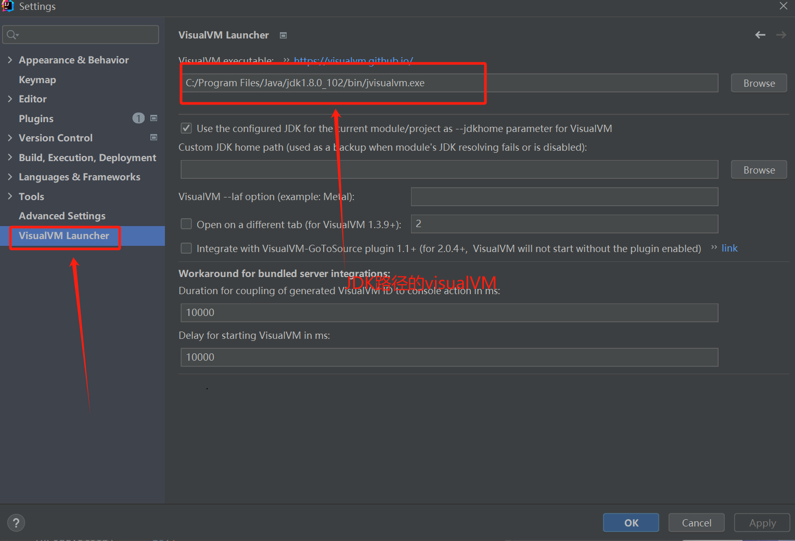

# 第22章-性能监控与调优-GUI

## 22.1 工具概述

​	使用命令行工具能获取到Java应用的基础信息，但存在一下局限性

* 无法获取方法级别的数据，如方法间的调用关系、各方法的调用次数和调用时间等（这对定位应用性能瓶颈至关重要）

* 要求用户登录到目标Java应用所在的宿主上，使用起来不是很方便。

* 分析数据通过终端输出，结果展示不够直观。

  为此，JDK提供了一些内存泄漏的分析工具，如jconsole，jvisualvm等，用于辅助开发人员定位问题，但是这些工具很多时候并不足以满足快速定位的需求。所以这里我们介绍的工具相对多一些、丰富一些。

  **图形化综合诊断工具**

* JDK自带的工具
  * jconsole：JDK自带的可视化监控工具。查看Java应用程序的运行概况、监控堆信息、永久区(或元空间)使用情况、类加载情况等。位置：jdk\bin\jsconsole.exe
  * Visual VM:Visual VM是一个工具，它提供了一个可视化界面，用于查看Java虚拟机上运行的基于Java技术的应用程序的详细信息。位置：jdk\bin\jvisualvm.exe
  * JMC：Java Mission Control，内置Java Flight Recorder。能够以极低的性能开销收集Java虚拟机的性能数据。JMC是Jrocket VM的，因为被oracle收购了，所以它的分析工具JMC也被集成到Hotspot虚拟机中了，一部分转化了了jcmd。
* 第三方工具
  * MAT：MAT（Memory Analyzer Tool）是基于Eclipse的内存分析工具，是一个快速、功能丰富的Java Heap分析工具，它可以帮助我们查找内存泄漏和减少内存消耗。eclipse的插件形式，也可以自行下载后打开，不需要eclipse程序
  * JProfiler：商业软件，需要付费，功能强大。与Visual VM类似
  * Arthas：Alibaba开源的Java诊断工具。深受开发者喜爱。
  * Btrace：Java运行时追踪工具。可以在不停机的情况下，跟踪指定的方法调用、构造函数调用和系统内存等信息

## 22.2 jConsole

### 22.2.1 基本概述

* 从Java5开始，在JDK中自带的java监控和管理控制台。
* 用于对JVM中内存、线程和类等的监控，是一个继续JMX（java management extensions）的GUI性能监控工具
* 官方教程：https://doc.oracle.com/javase/7/docs/technotes/guides/management/jsonsole.html

### 22.2.2 启动

* jdk/bin目录下，启动jconsole.exe命令
* 不需要使用jps命令来查询

### 22.2.3 三种链接方式

* Local：使用Jconsole链接一个正在本地系统运行的JVM，并且执行程序的和运行JConsole的需要是同一各用户。JConsole使用文件系统 的授权通过RMI连接器连接到平台的MBean服务器上。这种从本地连接的监控能力只有Sun的JDK具有
* Remote：使用下面的URL通过RMI连接器连接到一个JMX代理，service:jmx:rmi:///jndi/rmi://hostName:portNum/jmxrmi。JConsole 为建立连接，需要在环境变量中设置mx.remote.credentials来指定用户名和密码，从而进行授权。
* Advance：使用一个特殊的URL连接JMX代理。一般情况使用自己定制的连接器而不是RMI提供的连接器来连接JMX代理，或者是一个使用JDK1.4的实现了JMX和JMX Rmote的应用。

### 22.2.4 主要作用


## 22.3 Visual VM

### 22.3.1 基本概述

* Visual VM 是一个功能强大多合一故障诊断和性能监控的可视化工具。
* 它集成了多个JDK命令行工具，使用Visual VM可用于显示虚拟机进程和进程的配置和环境信息（jps,jinfo），监视应用程序的CPU、GC、堆、方法区及线程信息（jstat、jstack）等，甚至代替JConsole。
* 在JDK 6 update 7以后，Visual VM便作为JDK的一部分发布（Visual VM 在JDK/bin目录下），即它完全免费
* 此外，Visual VM也可以作为独立的软件进行安装：首页https://visualvm.github.io/index.html


### 22.3.2 插件的安装

* Visual VM 的一大特点是支持插件扩展，并且插件安装非常方便，我们即可以通过离线下载插件文件*.nbm，然后再Plugin对话框的已下载页面下，添加已下载的插件。也可以再可用插件页面下，在线安装插件。（建议安装上：VisualGC）
* 插件地址：https://visualvm.github.io/pluginscenters.html


设置插件地址，然后选择可用插件，即可安装需要的插件了

### 

* IDEA 中也可以安装插件Visual VM插件





### 22.3.3 链接方式

* 本地连接：监控本地Java进程的CPU、类、线程等
* 远程连接
  * 确定远程服务器的ip地址
  * 添加JMX（通过JMX技术具体监控远程服务器哪个Java进程）
  * 修改bin/catalina.sh文件，连接远程的tomcat
  * 在../conf中添加jmxremote.access和jmxremote.password文件
  * 将服务器地址改为公网ip地址
  * 设置阿里云安全策略和防火墙策略
  * 启动tomcat，查看tomcat启动日志和端口监听
  * JMX中输入端口号、用户名、密码登录

### 22.3.4 主要功能

* 生成/读取堆内存快照
* 查看JVM参数和系统属性
* 查看运行中的虚拟机进程
* 生成/读取线程快照
* 程序资源的实时监控
* 其他功能：JMX代理连接、远程环境监控、CPU分析和内存分析


## 22.4 eclipse MAT

### 22.4.1 基本概述

​	MAT（Memory Analyzer Tool）工具是一款功能强大的Java堆内存分析器，可以用于查找内存泄漏以及查看内存消耗情况。

​	MAT是基于Eclipse开发的，不仅可以单独使用，还可以作为插件的形式嵌入在Eclipse中使用。是一款免费的性能分析工具，使用起来非常方便。

​	只要确定机器上装有JDK并配置好相关的环境变量，MAT可正常启动，还可以在Eclipse中以插件的形式安装。

​	下载地址：https://eclipse.dev/mat/downloads.php


### 22.4.2 获取dump文件

​	MAT看可以分析heap dump文件，在进行内存分析时，只要获得了反映当前设备内存映像的hprof文件，通过MAT打开就可以直观的看到当前的内存信息。

​	一般来说，这些内存信息包含：

* 所有的对象信息，包括对象实例、成员变量、存储于栈中的基本类型值和存储于堆中的其他对象的引用值。

* 所有的类信息，包括classloader、类名称、父类、静态变量等

* GCRoot到所有的这些对象的引用路径

* 线程信息，包括线程的调用栈及此线程的线程局部变量(TLS)

  说明1：缺点

* MAT不是一个万能工具，它并不能处理所有类型的堆存储文件。但是比较主流的厂家和格式，例如Sun、HP、SAP所采用的HPROF二进程堆存储文件，以及IBM的PHD堆存储文件等都能被很好的解析。

  说明2

* 最吸引人的还是能够快速为开发人员生成内存泄漏报表，方便定位问题和分析问题。虽然MAT有如此强大的功能，但是内存分析也没有简单到一键完成的程序，很多内存问题还是需要我们从MAT展现给我们的信息当中通过经验和直觉来判断才能发现。

  获取dump文件

* 方法一：通过jmap命令工具生成
* 方法二：通过JVM参数生成
  * -XX:+HeapDumpOnOutOfMemoryError或-XX:+HeapDumpBeforeFullGC
  * -XX:+HeapDumpOnPath
* 方式三：通过Visual VM可以到i出堆dump文件
* 方式四：MAT可以从活动的Java程序中导出堆快照（借助jps列出Java进程获取的堆快照）。

### 22.4.3 分析堆dump文件


#### 22.4.3.1 histogram（直方图）

​	展示各个类的实例数目以及这些实例Shallowheap或Retainedheap的总和


#### 22.4.3.2 thread overview

* 可以查看系统中的Java线程

* 可以查看局部变量的信息


#### 22.4.3.3 获得对象相互引用的关系

* with outgoing reference（引用了哪些对象，外部引用）

* with incoming reference（哪些引用了这个，引用进来的）


#### 22.4.3.4 浅堆与深堆

##### 22.4.3.4.1 shallow heap

​	浅堆是指一个对象所消耗的内存。在32位系统中，一个对象引用会占据4个字节，一个int类型会占据4个字节，long类型会占据8个字节，每个对象头需要占据8个字节。根据堆快照格式不同，对象的大小可能会向8个字节对齐.

​	数组浅堆大小=12文件头+4数组长度+数组元素*4（引用）

​	以String为例：2个int值共占8个字节，对象引用占4字节，对象头8字节，合计20字节，向8字节对齐，故占24字节。（JDK7中)

| int  | hash32 | 0                      |
| ---- | ------ | ---------------------- |
| int  | hash   | 0                      |
| ref  | value  | C:/Users/Administrator |

​	这24字节为String对象的浅堆大小。它与String的Value实际取值无关，无论字符串长度如何，浅堆大小始终是24字节。	

##### 22.4.3.4.2 retained heap

* 保留集（Retained Set）
  * 对象A的保留集指当对象A被垃圾回收后，可以被释放的所有的对象集合（包括对象A本身），即对象A的保留集可以被认为是只能通过对象A被直接或间接访问到的所有对象的集合。通俗的说，就是指仅被对象A所持有的对象的集合。
* 深堆（Retained  Heap）
  * 深堆是指对象的保留集中所有的对象的浅堆大小之和。
  * 注意：浅堆指对象本身占用的内存，不包括其内部引用对象的大小。一个对象的深堆指只能通过该对象访问到（直接或间接）所有对象的浅堆之和，即对象被回收后，可以释放的真是空间。
* 举例
  * S1-->hash32，S1-->hash，S1-->hash32，S1-->value->hello三个引用
  * S2-->hash32，S2-->hash，S2-->hash32，S2-->value->hello三个引用
  * 如果s1和s2都引用了hello字符串，则它们的深堆不包含hello字符串的大小。

##### 22.4.3.4.3 补充：对象实际大小

​	另外一个常用的概念是对象的实际大小。这里，对象的实际大小定义为一个对象所能触及的所有对象的浅堆大小之和，也就是通常意义上我们说的对象大小。与深堆相比，似乎这个在日常开发中更为直观和被人接受，但实际上，这个概念和垃圾回收无关。

​	下图显示了一个简单的对象引用关系图，对象A引用了C和D，对象B引用了C和E。那么对象A的浅堆大小只是A本身，不包含C和D，而A的实际大小为ACD三者之和。而A的深堆大小为A与D之和，由于对象C还可以通过对象B访问到，因此不再对象A的深堆范围内。


##### 22.4.3.4.4 练习


​	上图中，GC Roots直接引用了A和B两个对象。

​	A对象的Retained  Heap=A对象的Shallow Size

​	B对象的Retained  Heap=B对象的Shallow Size + C对象的Shallow Size

​	这里不包括D对象，因为D对象被GC Roots直接引用。

##### 22.4.3.4.5 案例分析：StudentTrace

​	浅堆的Student对象都占24个字节，深堆大小不一样


考虑Lily同学：15个webpage，每个对应152字节，13X152+144X2=2264字节，即为实际的elementData的实际大小。

elementData的深堆1288如何计算，除了自己引用webpage还有其他引用的webpage，通过计算得知（能被7整除，且能被3整除的）一个7个，6X152+1X44=1056字节。

2264-1056-1288=80节，15个webpage对象头4个字节，15*4=60，再加自己的对象头12个字节，数组长度4个字节，一共60+16=76字节，76每对齐，加上对齐，就是80字节。


#### 22.4.3.5 支配树

​	支配树（Dominator Tree）概念源自图论

​	MAT提供了一个成为支配树的对象图。支配树体现了对象实例间的支配关系。在对象引用图中，所有指向对象B的路径都经过对象A，则认为对象A支配对象B。如果对象A是离对象B最近的一个支配对象，则认为对象A为对象B的直接支配者。支配树是基于对象间的引用图所建立的，它有以下基本性质：

* 对象A的子树（所有被对象A支配的对象集合）表示对象A的保留集(retained  set)，即深堆。

* 如果对象A支配对象B，那么对象A的直接支配着也支配对象B。

* 支配树的边与对象引用图的边不直接对应。

  如下图所示：作图表示对象引用图，右图表示左图所对应的支配树。对象A和B由根对象直接支配，由于在到对象C的路径中，可以经过A，也可以经过B，因此对象C的直接支配者是根对象。对象F与对象D相互引用，因为到对象F的所有路径必须经过对象D，因此，对象D是对象F的直接支配者。而到对象D的所有路径中，必然经过对象C，即使是从对象F到对象D的引用，从根节点出发，也是经过对象C的，所以对象D的直接支配者为对象C。同理，对象E支配对象G。到达对象H的可以通过对象D，也可以通过对象E，因此对象D和E都不能支配对象H，而经过对象C即可以到达D也可以到达E，因此对象C为对象H的直接支配者。

  

  没有多个对象直接引用的，就是支配者，C有两个对象引用，根节点就是支配者，H有F和G引用，那么C通过线路可以到达H，只有C引用，那么C就是H的直接支配着。

### 22.4.4 案例：Tomcat堆溢出分析

#### 22.4.4.1 说明

​	Tomcat是最常用的Java Servlet容器之一，同时也可以当作单独的web服务器用。Tomcat本身使用Java实现，并运行与Java虚拟机之上。在大规模请求时，Tomcat有可能会因为无法承受压力而发生内存溢出错误。这里根据一个被压垮的Tomcat的堆快照文件，来分析Tomcat在崩溃时的内部情况。

22.4.4.2 分析过程


## 补充1：在谈内存泄漏

### 内存泄漏的理解和分类

​	何为内存泄漏(memory leak)


​	可达性分析算算法来判断对象是否是不再使用的对象，本质时判断一个对象是否还被引用。那么对于这种情况下，由于代码的实现不同就会出现很多中内存泄漏问题（上JVM误以为此对象还在引用中，无法回收，造成内存泄漏）

​	内存泄漏的理解：严格来说，只有对象不会再被程序用到了，但是GC又不能回收他们的情况，才叫内存泄漏。但实际情况很多时候一些不太好的实践（或疏忽）会导致对象的生命周期变得很长甚至导致OOM，也可以叫做宽泛意义上的内存泄漏

​	内存泄漏与内存溢出的关系

* 内存泄漏(memory leak)

  * 申请了内存用完了不是放

* 内存溢出(out of memory )

  * 申请了内存，没有足够的内存使用

* 关系：内存泄漏的增多，最终会导致内存溢出

  泄漏的分类

* 经常发生：发生内存泄漏的代码会被多次执行，每次执行，泄漏一块内存。
* 偶尔发生：在某些特定情况看下才会发生
* 一次性：发成内存泄漏的方法只会执行一次
* 隐式泄漏：一直站着内存不是放，直到执行结束；严格的说这个不算内存泄漏，因为最终释放了。

### Java内存泄漏的8中情况

#### 1、静态集合类

​	静态类集合，比如HashMap、LinkedList等等。如果这些容器为静态的，那么它们的生命周期与JVM程序一致，则容器中的对象在程序结束前不能被释放，从而造成内存泄漏。简单而言，长生命周期的对象持有短生命周期对象的引用，尽管短生命周期的对象不再使用，但是因为长生命周期对象持有它的引用而导致不能被回收。

```java
public class MemoryLeak {
    static List list = new ArrayList();
    public void oomTests() {
        Object obj = new Object();
        list.add(obj);
    }
}
```

#### 2、单例模式

​	单例模式，和静态集合导致内存泄漏的原因类似，因为单例的静态特性，它的生命周期和JVM生命周期一样长，所以如果单例对象持有外部对象的引用，那么这个外部对象也不会被回收，那么就会造成内存泄漏。

#### 3、内部类持有外部类

​	内部类持有外部类，如果一个外部类的实例方法返回了一个内部类的实例对象。这个内部类对象被长期引用了，即使那个外部类实例对象不再被使用，但由于内部类持有外部类的实例对象，这个外部类对象将不会被垃圾回收器回收，这也会造成内存泄漏。

#### 4、各种连接，比如数据库连接、网络连接和IO连接等

​	在对数据库操作过程中，首先需要建立与数据库的连接，当不再使用时，需要调用close方法来释放与数据库的连接。只有连接被关闭后，垃圾回收器才会回收对应的对象。否则，如果在访问数据库的过程中，对Conncetion、Statement或ResultSet不显性的关闭，将会造成大量的对象无法回收，从而引起内存泄漏。

#### 5、变量不合理的作用域

​	变量不合理的作用域，一般而言，一个变量定义的作用范围大于其使用范围，很有可能造成内存泄漏。另一方面，如果没有即使把对象设置为null，很有肯能导致内存泄漏的发生。

```java
public class UsingRandom {
    private String msg;
    public void receiveMse(){
        readFromNet();//从网络中接受数据保存到msg中
        saveDB();//把msg保存到数据库库中
    }

    private void saveDB() {
    }

    private void readFromNet() {
    }
}
```

​	如上面这个伪代码，通过readFromNet方法把接受大消息保存在变量msg中，然后调用saveDB方法把msg的内容保存到数据库中，此时msg已经没用了，由于msg的生命周期与对象的生命周期相同，此时msg还不能回收，因此造成内存泄漏。把msg设置为null，垃圾回收器就能回收msg的内存空间。

#### 6、改变哈希值

​	当一个对象被存储进HashSet集合以后，就不能修改这个对象中的那些参与计算哈希值的字段了。否则对象秀嘎后的哈希值与最初存储进HashSet集合中时的哈希值就不同了，在这种情况下，即使contains方法使用该对象的当前引用作为的参数去HashSet集合中检索对象，也将返回找不到对象的结果，这会导致无法从HashSet集合中单独删除当前对象，造成内存泄漏。

​	这也是String为什么被设置成了不可变类型，我们可以放心的把String存入HashSet，或者把String当作HashMap的Key值。

```java
public class ChangeHashCode {
    public static void main(String[] args) {
        HashSet set = new HashSet();
        Person p1 = new Person(1001, "AA");
        Person p2 = new Person(1002, "BB");
        set.add(p1);
        set.add(p2);
        p1.name = "CC";//导致了内存的泄漏
        set.remove(p1); //删除失败
        System.out.println(set);
        set.add(new Person(1001, "CC"));
        System.out.println(set);
        set.add(new Person(1001, "AA"));
        System.out.println(set);

    }
}
class Person {
    int id;
    String name;
    public Person(int id, String name) {
        this.id = id;
        this.name = name;
    }
    @Override
    public boolean equals(Object o) {
        if (this == o) return true;
        if (!(o instanceof Person)) return false;

        Person person = (Person) o;

        if (id != person.id) return false;
        return name != null ? name.equals(person.name) : person.name == null;
    }
    @Override
    public int hashCode() {
        int result = id;
        result = 31 * result + (name != null ? name.hashCode() : 0);
        return result;
    }
    @Override
    public String toString() {
        return "Person{" +
                "id=" + id +
                ", name='" + name + '\'' +
                '}';
    }
}
```

#### 7、缓存泄漏

​	一旦对象引用放入缓存中，它就很容易遗忘。比如：测试只加载几百条数据，生产有几百万数据加入到缓存中。

​	对于这个问题，可以用使用WeakHashMap代表缓存，此Map的特点是，当除了自身有对key的引用外，此Key没有其他引用那么此map会自动丢弃此值。

```java
ublic class MapTest {
    static Map wMap = new WeakHashMap();
    static Map map = new HashMap();

    public static void main(String[] args) {
        init();
        testWeakHashMap();
        testHashMap();
    }

    public static void init() {
        String ref1 = new String("obejct1");
        String ref2 = new String("obejct2");
        String ref3 = new String("obejct3");
        String ref4 = new String("obejct4");
        wMap.put(ref1, "cacheObject1");
        wMap.put(ref2, "cacheObject2");
        map.put(ref3, "cacheObject3");
        map.put(ref4, "cacheObject4");
        System.out.println("String引用ref1，ref2，ref3，ref4 消失");

    }

    public static void testWeakHashMap() {

        System.out.println("WeakHashMap GC之前");
        for (Object o : wMap.entrySet()) {
            System.out.println(o);
        }
        try {
            System.gc();
            TimeUnit.SECONDS.sleep(5);
        } catch (InterruptedException e) {
            e.printStackTrace();
        }
        System.out.println("WeakHashMap GC之后");
        for (Object o : wMap.entrySet()) {
            System.out.println(o);
        }
    }

    public static void testHashMap() {
        System.out.println("HashMap GC之前");
        for (Object o : map.entrySet()) {
            System.out.println(o);
        }
        try {
            System.gc();
            TimeUnit.SECONDS.sleep(5);
        } catch (InterruptedException e) {
            e.printStackTrace();
        }
        System.out.println("HashMap GC之后");
        for (Object o : map.entrySet()) {
            System.out.println(o);
        }
    }

}
/**
 * 结果
 * String引用ref1，ref2，ref3，ref4 消失
 * WeakHashMap GC之前
 * obejct2=cacheObject2
 * obejct1=cacheObject1
 * WeakHashMap GC之后
 * HashMap GC之前
 * obejct4=cacheObject4
 * obejct3=cacheObject3
 * Disconnected from the target VM, address: '127.0.0.1:51628', transport: 'socket'
 * HashMap GC之后
 * obejct4=cacheObject4
 * obejct3=cacheObject3
 **/
```


​	上图代码和图示主要演示WeakHahMap如何自动释放对象，当init函数执行完成后，局部变量字符串引用weakd1,weakd2,d1,d2都会消失，此时只有静态ma中保存对字符串对象的引用，可以看到，调用GC之后，HashMap的没有被回收，而WeakHashMap里面的缓存被回收了。

#### 8、监听器和回调

​	如果客户端在实现的API中注册回调，却没有显示的取消，那么就会积聚。

​	需要确保回调立即被当作垃圾回收的最佳方法是只保存它的弱引用，例如将他们保存成为WeakHahMap的键。

### 内存泄漏案例分析

#### 案例代码

```java
public class Stack {
    private Object[] elements;
    private int size = 0;
    private static final int DEFAULT_INITIAL_CAPACITY = 16;

    public Stack() {
        elements = new Object[DEFAULT_INITIAL_CAPACITY];
    }

    public void push(Object e) { //入栈
        ensureCapacity();
        elements[size++] = e;
    }
    //存在内存泄漏,因为没有溢出数据中的元素引用。
//    public Object pop() { //出栈
//        if (size == 0)
//            throw new EmptyStackException();
//        return elements[--size];
//    }

    public Object pop() {
        if (size == 0)
            throw new EmptyStackException();
        Object result = elements[--size];
        elements[size] = null;
        return result;
    }

    private void ensureCapacity() {
        if (elements.length == size)
            elements = Arrays.copyOf(elements, 2 * size + 1);
    }
}

```

#### 分析


​	从上图中可以看出，如果栈先增长，再收缩，那么从栈中弹出的对象将不会被当作垃圾回收，即使程序不再使用栈中的这些对象，他们也不会回收，因为栈中仍然保存这个对象的引用，俗称过期引用，这个内存泄漏很隐蔽。

#### 解决办法

过期后，清空引用，将引用置空

```java
    public Object pop() {
        if (size == 0)
            throw new EmptyStackException();
        Object result = elements[--size];
        elements[size] = null;//将引用置空
        return result;
    }
```


## 补充2：支持使用OQL语言查询对象信息

​	MAT支持一种类似与SQL的查询语言OQL（Object Query Language），OQL使用类似SQL语法，可以在队中进行对象的查找和筛选。用F5刷新查询

#### SELECT子句

```sql
SELECT * FROM java.util.Vector v
#objects关键字，将返回结果集中的项以对象的形式显示
SELECT objects v.elmentData FROM java.util.Vector v
#AS RETAINED SET关键字，可以得到所有对象的保留集
SELECT AS RETAINED SET * FROM java.util.Vector v
#objects关键字，将返回结果集中的项以对象的形式显示
SELECT DISTINCT objects classof(s) FROM java.lang.String s
```

#### FROM子句

```sql
执行查询范围，可以是正则表达式或对象或对象地址
SELECT * FROM java.lang.String s
SELECT * FROM "java\.util\..*"
SELECT * FROM 0x37a0b4d
```

#### WHERE子句

```sql
#格式与传统sql相似
#返回长度大于10的char数组
select * from char[] s where s.@length>10
#返回包含java子字符串的所有字符串，使用LIKE操作符，操作符参数为正则表达式
select * from java.lang.String s WHERE toString(s) LIKE ".*java"
#返回value域不为null的字符串
select * from java.lang.String s where s.value!=null
#支持多个条件的AND、OR运算。返回数组长度大于15.且深堆大于1000字节的所有Vector对象
select * from java.util.Vector v where v.elementData.@length>15 and v.@retainedHeapSize>1000
```

#### 内置对象与方法

​	OQL中可以访问堆内对象属性，也可以访问堆内代理对象的属性。访问堆内对象的属性时，格式如下：

​	[<alias>.]<field>.<field>.<field>

​	其中alias为对象名称

​	访问java.io.File对象的path属性，并进一步访问path的value属性：

```sql
SELECT toString(f.path.value) FROM java.io.File f
```

​	显示String对象的内容、objectid和objectAddress.

```sql
SELECT S.toString(),s.@objectId,s.@objectAddress From java.lang.String s
```

​	显示java.util.Vector内部数组的长度

```sql
SELECT v.elementData.@length FROM java.util.Vecotr v
```

​	显示java.util.Vector内对象及其子类型

```sql
SELECT * FROM INSTANCEOF java.util.Vecotr 
```

## 22.5 JProfiler

### 22.2.1 基本概述

* 介绍
  * 在运行Java的时候有时候想测试运行时占用内存情况，这时候需要使用测试工具查看了。在eclipse里面又Eclipse Memory Analyzer tool(MAT)插件可以测试，而在IEAD中也有这么一个插件，就是JProfiler。
  * JProfiler时又ej-technologies公司开发的一款Java应用性能诊断工具。功能强大，但是收费。
  * 官网加载地址：https://www.ej-technologies.com/products/jprofiler/overview.html
* 特点
  * 使用方便、界面操作友好（简单且强大）
  * 对被分析的应用影响小（提供模板）
  * CPU，Thread，Memory分析功能尤其强大
  * 支持对jdbc,nosql,jsp,servlet,socket等进行分析
  * 支持多种模式（离线、在线）的分析
  * 支持监控本地、远程JVM
  * 跨平台，拥有多种操作系统的安装版本


* 主要功能
  * 方法调用：对方法调用的分析可以帮助您了解应用程序正在做什么，并找到提高其性能的方法。
  * 内存分配：用过分析堆上对象、引用链和垃圾收集能帮助您修复内存泄漏问题，优化内存使用。
  * 线程和锁：JProfiler提供多种针对线程和锁的分析视图助您发现多线程问题。
  * 高级子系统：许多性能问题都发生在更高的语义级别上。例如，对于JDBC调用，您可能希望找出执行最慢的SQL语句。JProfiler支持对这些子系统进行集成分析

### 22.2.2 安装与配置

* 下载并安装
  * 下载地址：https://www.ej-technologies.com/download/jprofiler/files


* Jprofiler中配置IDEA

  

  

  

* IDEA集成Jprofiler


### 22.2.3 具体使用


#### 22.2.3.1 数据采样方式

​	JProfiler数据采集方式分为两种：Sampling(样本采集)和Instrumentation(重构模式)

* Instrumentation：这是JProfiler全功能模式，在class加载之前，JProfiler把相关功能代码写入到需要分析的class的bytecode中，对正在运行的jvm又一定影响。

  * 优点：功能强大。在此设置中，调用堆栈信息时准确的。
  * 缺点：若要分析的class较多，则对应用的性能影响较大，CPU开销可能很高（取决于Filter的控制）。因此使用此模式一般配合Filter使用，只对特定的类和包进行分析。

* Sampling：类似于样本统计，每个一定时间（5ms）将每个线程栈中的信息统计出来。

  * 优点：对CPU的开销非常低，对应用影响小（即使你不配置任何Filter）
  * 缺点：一些数据/特性不能提供（例如方法的调用次数、执行时间）

  注：JProfiler本身没有指出数据的采集类型，这里的采集类型是针对方法调用的采集类型。因为JProfiler的绝大多数核心功能都以来方法调用采集的数据，所以可以直接认为是JProfiler的数据采集类型。


#### 22.2.3.2 遥感监测Telementries

​	查看JVM的运行信息

* 整体视图Overview：显示堆内存、CPU、线程以及GC等活动视图
* 内存Memory：显示一张关于内存变化的活动时间表
* 记录的对象Recorded objects：显示一张关于活动对象与数组的图表的活动时间表。
* 记录吞吐量Recorded Throughput：显示一段时间累计的JVM生产和释放的活动时间表。
* 垃圾回收活动GC Activity：显示一张关于垃圾回收活动的活动时间表。
* 类 Classes：显示一个与已装载类的图表的活动时间表。
* 线程Threads：显示一个与动态线程图表的活动时间表。
* CPU负载CPU Load：显示一段时间中CPU的负载图表。


#### 22.2.3.3 内存视图Live Memory

内存剖析：class/class instance的相关西悉尼。例如对象的个数、大小、对象创建的方法执行栈，对象创建的热点。

* 所有的对象All Objects
  * 显示所有加载的类列表和在堆上分配的实例数。只有Java 1.5（JVMTI）才会显示此视图
  * 
* 记录对象Record Objects
  * 查看特定时间段对象的分配，并记录分配的调用堆栈。
* 分配访问树 Allocation Call Tree
  * 显示一棵请求树或者方法、类、包或对已选择类有带注释的分配信息的J2EE组件。
* 分配热点 Allocation Hot Spots
  * 显示一个列表，包括方法、类、包或则和分配已选类的J2EE组件。你可以标注当前值并且显示差异值。对于每个热点都可以显示它的跟踪记录数。
* 类追踪器 Class Tracker
  * 类跟踪视图可以包含任意数量的图表，显示选定的类和包的实例与时间。


#### 22.2.3.4 堆遍历 heap walker

* 类 Classes

  * 显示所有类和他们的实例，可以右击具体的类“Used Selected Instance”实现进一步跟踪

* 分配 Allocations

  * 为所有记录对象显示分配树和分配热点

* 索引 References

  * 为单个对象和“显示到垃圾回收根目录的路径”提供索引图的显示功能。还能提供合并输入视图和输出视图的功能

* 时间 Time

  * 显示一个对已记录对象的解决时间和柱状图

* 检查 Inspections

  * 显示一个数量的操作，将分析当前对象集在某种条件下的子集，实质是一个筛选的过程。

* 图表 Graph

  * 你需要在references视图和biggest视图手动添加对象到图表，它可以显示对象的传入和传出引用，能方便的找到垃圾收集器根源。

  在工具栏点“Go To Start”可以使用堆内存重新计数，也就是回到初始状态。


#### 22.2.3.5 CPU视图 cpu views


#### 22.2.3.6 线程视图 threads

​	JProfiler通过对线程历史的监控判断其运行状态，并监控是否有线程阻塞产生，还能将一个线程所管理的方法以树状形式呈现，对线程剖析。

* 线程历史 Thread History

  * 显示一个与线程活动和线程状态在一起的活动时间表。

* 线程监控 Thread Monitor

  * 显示一个列表，包含所有的活动线程以及它们目前的活动状况。

* 线程转储 Thread Dumps

  * 显示所有线程的堆栈跟踪

  线程分析主要关注三个方便

  * web容器的线程最大数
  * 线程阻塞
  * 线程死锁


#### 22.2.3.7 监视器&锁 Monitors&locks

​	所有线程持有锁的情况以及锁的信息

​	观察JVM的内部线程并查看状态：

* 死锁探测图表 Current Loking Graph：显示JVM中的当前死锁图表。
* 目前使用的检测器 Current Monitors：显示目前使用的检测器并且包括它们的关联线程。
* 锁定历史图表 Locking Hostory Graph：显示记录在JVM中的锁定历史。
* 历史检测记录 Monitor History：显示重大的等待时间和阻塞事件的历史记录。
* 监控器使用统计 Monitor Usage Statistics：显示分组检测，显示和检测类的统计监测数据。


### 22.2.4 案例分析

```java
public class JProfilerTest {
    public static void main(String[] args) {
        while (true){
            ArrayList list = new ArrayList();
            for (int i = 0; i < 500; i++) {
                Data data = new Data();
                list.add(data);
            }
            try {
                TimeUnit.MILLISECONDS.sleep(500);
            } catch (InterruptedException e) {
                e.printStackTrace();
            }
        }
    }
}
class Data{
    private int size = 10;
    private byte[] buffer = new byte[1024 * 1024];//1mb
    private String info = "hello,atguigu";
}
```


案例2

```java
public class MemoryLeak {

    public static void main(String[] args) {
        while (true) {
            ArrayList beanList = new ArrayList();
            for (int i = 0; i < 500; i++) {
                Bean data = new Bean();
                data.list.add(new byte[1024 * 10]);//10kb
                beanList.add(data);
            }
            try {
                TimeUnit.MILLISECONDS.sleep(500);
            } catch (InterruptedException e) {
                e.printStackTrace();
            }
        }
    }

}

class Bean {
    int size = 10;
    String info = "hello,atguigu";
//     ArrayList list = new ArrayList();
    static ArrayList list = new ArrayList();
}
```

内存一直在往上增加


类一直在往上增加


## 22.6 Arthas

### 22.2.1 基本概述

​	jvisualvm和JProfiler都是图形化界面，知名度较高，但是必须在服务端项目进程中配置相关的监控参数。然后工具通过远程连接到目录进程，服务器往往有网络隔离，可能连不上。

​	Arthas可以直接在服务器上运行。

* 概述
  * Arthas是Alibaba开源的Java诊断工具，深受开发者喜爱。在线排查问题，无需重启，动态跟踪Java代码，实施监控JVM状态。
  * Arthas支持JDK 6+，支持Linux/Mac/Windows，采用命令行交互模式，同时提供丰富的Tab自动补全功能，进一步方便进行问题的定位和诊断。
  * 当你遇到一下类似问题而束手无策时，Arthas可以帮助你解决
    * 这个类从哪个jar包加载的？为什么会报各种类相关的Exception？
    * 我改的代码为什么没有执行到？难道到我没commit？分支搞错了？
    * 遇到问题无法在线debug，难道只能通过加日志再重新发布吗？
    * 线上遇到某个用户的数据处理有问题，但线上同样无法debug，线下无法重现！
    * 是否有一个全局视角来查看系统的运行状况？
    * 有什么办法可以监控到JVM的实时运行状态？
    * 怎么快速定位应用的热点，生成火焰图？
* 基于那些工具开发而来
  * greys-anatomy：Arthas代码基于Greys二次开发而来，非常感谢Greys之前所有的工作，以及Greys原作者对Arthas提出的建议和意见！
  * termd：Arthas的命令行实现基于termd开发，是一款优秀的命令行程序开发框架，感谢termd提供了优秀的框架。
  * crash：Arthas的文本渲染功能基于crash中的文本渲染功能开发，可以从这里看到源码，感谢crash在这方面所作的优秀工作。
  * cli：Arthas的命令行界面基于vert.x提供的cli库进行开发，感谢vert.x在这方面做出的优秀工作。
  * compiler：Arthas里的内存编译器代码来源
  * Apache Commons Net ：Arthas里的Telnet Client代码来源
  * JavaAgent：运行在main方法之前的拦截器，它内定的方法名叫premain，也就是说先执行premain方法然后再执行main方法。
  * ASM：一个通用的Java字节码操作和分析框架。它可以用于修改现有的类或直接以二进制形式动态生成类。ASM提供了一些常见的字节码转换和分析算法。可以用它们构建定制的复杂转换和代码分析工具。ASM提供了与其他JAVA字节码框架类似的功能，但时主要关注性能，因为它被设计和实现得尽可能小和快，所以非常适合在动态系统中使用（当然也可以以静态方式使用，例如在编译器中）
* 官方使用文档
  * https://arthas.aliyun.com/zh-cn/


### 22.2.2 安装与使用

#### 22.2.2.1 安装

* 方式一：直接在Linxu上通过命令下载
  * github下载：wget https://alibaba.github.io/arthas/arthas-boot.jar
  * gitee下载：wget https://arthas.gitee.io/arthas-boot.jar
* 方式二：浏览器下载后，将arthas-boot.jar上传到服务器。
* 卸载：删除下面文件 
  * rm -rf ~/.arthas 
  * rm -rf  ~/logs/arthas
* windows平台直接删除user home 下面的.arthas和logs/arthas目录

获取到arthas-boot.jar后，需要启动jar -jar arthas-boot.jar，选择进程，进行下载依赖，然后就可以启动了

#### 22.2.2.2 工程目录

* arthas-agent：基于JavaAgent技术的代理
* bin：一些启动脚本
* arthas-boot：Java版本的意见安装启动脚本
* arthas-client：telnet client代码
* arthas-common：一些共用的工具类和枚举类
* arthas-core：核心库，各种arthas命令的交互和实现
* arthas-demo：示例代码
* arthas-memorycompiler：内存编译代码，Frok from https://github.com/skalogs/SkaETL/master/compiler
* arthas-packaging：maven打包相关的
* arthas-site：arthas站点
* arthas-spy：编织到目录类中的各个切面
* static：静态资源
* arthas-testcase：测试

#### 22.2.2.3 启动

​	Arthas 只是一个java程序，所以可以直接用java -jar运行。

​	执行成功后，arthas提供了一种命令方式的交互方式，arthas会检测当前服务器上运行的Java进程，并将进程列表展示出来，用户输入对应的编号（1、2、3、4...）进行选择，然后回车。

​	比如方式1：java -jar arthas-boot.jar 

```shell
# 选择进程（输入[]内编号（不是PID）回车）
C:\Users\cp\Downloads>java -jar arthas-boot.jar
[INFO] JAVA_HOME: D:\Program Files\Java\jdk1.8.0_51\jre
[INFO] arthas-boot version: 3.7.2
[INFO] Found existing java process, please choose one and input the serial number of the process, eg : 1. Then hit ENTER.
* [1]: 17540 org.jetbrains.idea.maven.server.RemoteMavenServer36
  [2]: 25496
#输入1或2选择
```

​	方式2：运行时选择Java进程PID   java -jar arthas-boot.jar [PID]

#### 22.2.2.4 查看进程

java -jar arthas-boot.jar

#### 22.2.2.5 查看日志

cat ~/logs/arthas/arthas.log

#### 22.2.2.6 参考帮助

java -jar arthas-boot.jar -h

#### 22.2.2.7 web console

​	除了在命令行查看外，Arthas目前还支持Web Console。在成功启动连接进程之后就已经自动启动，可以直接访问http://127.0.0.1:8563/访问，页面上的操作模式和控制台完全一样。

#### 22.2.2.8 退出

最后一行[arthas@7457]$. 说明打开进入了监控客户端，在这里就可以执行相关命令进行查看了。

* 使用quit\exit：退出当前客户端
* 使用stop\shutdown：关闭arthas服务端，并退出所有客户端。

### 22.2.3 相关诊断指令

#### 22.2.3.1 基础指令

* help：查看命令帮助信息
* cat：打印文件内容，和linux里的cat命令类似
* echo：打印参数，和linux里的echo命令类似
* grep：匹配查找，和linux里的grep命令类似
* tee：赋值标准输入到标准输出和指定的文件，和linux里的tee命令类似
* pwd：返回当前的工作目录，和linux里的pwd命令类似
* cls：清空当前屏幕区域
* session：查看当前会话的信息
* reset：重置增强类，将被Arthas增强过的类全部还原，Arthas服务端关闭时会重置所有增强过的类
* version：输出当前目标Java进程所加载的Arthas版本号
* history：打印命令历史
* quit：退出当前Arthas客户端，其他Arthas客户端不受影响
* stop：关闭Arthas服务端，所有Arthas客户端全部退出
* keymap：Arthas快捷键列表及自定义快捷键

#### 22.2.3.2 jvm相关

* dashboard
  * 当前系统实施数据面板

```shell
[arthas@6068]$ dashboard
ID   NAME                          GROUP          PRIORITY  STATE    %CPU      DELTA_TIM TIME      INTERRUPT DAEMON
-1   C1 CompilerThread2            -              -1        -        0.0       0.000     0:0.390   false     true
-1   C2 CompilerThread1            -              -1        -        0.0       0.000     0:0.234   false     true
1    main                          main           5         TIMED_WA 0.0       0.000     0:0.187   false     false
-1   C2 CompilerThread0            -              -1        -        0.0       0.000     0:0.187   false     true
21   arthas-NettyHttpTelnetBootstr system         5         RUNNABLE 0.0       0.000     0:0.062   false     true
-1   VM Thread                     -              -1        -        0.0       0.000     0:0.031   false     true
5    Attach Listener               system         5         RUNNABLE 0.0       0.000     0:0.015   false     true
12   arthas-timer                  system         5         WAITING  0.0       0.000     0:0.015   false     true
15   arthas-NettyHttpTelnetBootstr system         5         RUNNABLE 0.0       0.000     0:0.015   false     true
17   arthas-NettyWebsocketTtyBoots system         5         RUNNABLE 0.0       0.000     0:0.015   false     true
6    Monitor Ctrl-Break            main           5         RUNNABLE 0.0       0.000     0:0.015   false     true
Memory                    used    total    max     usage    GC
heap                      30M     319M     5435M   0.56%    gc.ps_scavenge.count          32
ps_eden_space             2M      53M      2017M   0.14%    gc.ps_scavenge.time(ms)       87
ps_survivor_space         4M      10M      10M     49.06%   gc.ps_marksweep.count         0
ps_old_gen                22M     256M     4076M   0.56%    gc.ps_marksweep.time(ms)      0
nonheap                   25M     25M      -1      97.71%
code_cache                4M      4M       240M    1.91%
metaspace                 18M     18M      -1      97.59%
compressed_class_space    2M      2M       1024M   0.22%
Runtime
os.name                                                     Windows 8.1
os.version                                                  6.3
java.version                                                1.8.0_51
java.home                                                   D:\Program Files\Java\jdk1.8.0_51\jre
systemload.average                                          -1.00
processors                                                  4
timestamp/uptime                                            Fri Apr 12 08:15:23 CST 2024/237s
```

* thread
  * 查看当前JVM的线程堆栈信息（可以定时，打印多少条thread相关信息数量）

```shell
[arthas@6068]$ thread
Threads Total: 24, NEW: 0, RUNNABLE: 8, BLOCKED: 0, WAITING: 3, TIMED_WAITING: 3, TERMINATED: 0, Internal threads: 10
ID   NAME                          GROUP          PRIORITY  STATE    %CPU      DELTA_TIM TIME      INTERRUPT DAEMON
2    Reference Handler             system         10        WAITING  0.0       0.000     0:0.000   false     true
3    Finalizer                     system         8         WAITING  0.0       0.000     0:0.000   false     true
4    Signal Dispatcher             system         9         RUNNABLE 0.0       0.000     0:0.000   false     true
5    Attach Listener               system         5         RUNNABLE 0.0       0.000     0:0.015   false     true
12   arthas-timer                  system         5         WAITING  0.0       0.000     0:0.015   false     true
15   arthas-NettyHttpTelnetBootstr system         5         RUNNABLE 0.0       0.000     0:0.015   false     true
16   arthas-NettyWebsocketTtyBoots system         5         RUNNABLE 0.0       0.000     0:0.000   false     true
17   arthas-NettyWebsocketTtyBoots system         5         RUNNABLE 0.0       0.000     0:0.015   false     true
18   arthas-shell-server           system         5         TIMED_WA 0.0       0.000     0:0.000   false     true
19   arthas-session-manager        system         5         TIMED_WA 0.0       0.000     0:0.000   false     true
21   arthas-NettyHttpTelnetBootstr system         5         RUNNABLE 0.0       0.000     0:0.109   false     true
22   arthas-command-execute        system         5         RUNNABLE 0.0       0.000     0:0.000   false     true
1    main                          main           5         TIMED_WA 0.0       0.000     0:0.187   false     false
6    Monitor Ctrl-Break            main           5         RUNNABLE 0.0       0.000     0:0.015   false     true
-1   GC task thread#1 (ParallelGC) -              -1        -        0.0       0.000     0:0.000   false     true
-1   VM Thread                     -              -1        -        0.0       0.000     0:0.031   false     true
-1   GC task thread#2 (ParallelGC) -              -1        -        0.0       0.000     0:0.000   false     true
-1   GC task thread#3 (ParallelGC) -              -1        -        0.0       0.000     0:0.000   false     true
-1   C1 CompilerThread2            -              -1        -        0.0       0.000     0:0.468   false     true
-1   VM Periodic Task Thread       -              -1        -        0.0       0.000     0:0.000   false     true
-1   GC task thread#0 (ParallelGC) -              -1        -        0.0       0.000     0:0.000   false     true
-1   C2 CompilerThread0            -              -1        -        0.0       0.000     0:0.218   false     true
-1   Service Thread                -              -1        -        0.0       0.000     0:0.000   false     true
-1   C2 CompilerThread1            -              -1        -        0.0       0.000     0:0.281   false     true
```

* jvm
  * 查看当前jvm的信息

```shell
[arthas@6068]$ jvm
 RUNTIME
-----------------------------------------------------------------------------------------------------------------------
 MACHINE-NAME                      6068@DESKTOP-0ELPV16
 JVM-START-TIME                    2024-04-12 08:11:26
 MANAGEMENT-SPEC-VERSION           1.2
 SPEC-NAME                         Java Virtual Machine Specification
 SPEC-VENDOR                       Oracle Corporation
 SPEC-VERSION                      1.8
 VM-NAME                           Java HotSpot(TM) 64-Bit Server VM
 VM-VENDOR                         Oracle Corporation
 VM-VERSION                        25.51-b03
 INPUT-ARGUMENTS                   -javaagent:D:\Program Files\JetBrains\IntelliJ IDEA 2021.2.1\lib\idea_rt.jar=6173:D
                                   :\Program Files\JetBrains\IntelliJ IDEA 2021.2.1\bin
                                   -Dfile.encoding=UTF-8
 CLASS-PATH                        D:\Program Files\Java\jdk1.8.0_51\jre\lib\charsets.jar;D:\Program Files\Java\jdk1.8
                                   .0_51\jre\lib\deploy.jar;D:\Program Files\Java\jdk1.8.0_51\jre\lib\ext\access-bridg
                                   e-64.jar;D:\Program Files\Java\jdk1.8.0_51\jre\lib\ext\cldrdata.jar;D:\Program File
                                   s\Java\jdk1.8.0_51\jre\lib\ext\dnsns.jar;D:\Program Files\Java\jdk1.8.0_51\jre\lib\
                                   ext\jaccess.jar;D:\Program Files\Java\jdk1.8.0_51\jre\lib\ext\jfxrt.jar;D:\Program
                                   Files\Java\jdk1.8.0_51\jre\lib\ext\localedata.jar;D:\Program Files\Java\jdk1.8.0_51
                                   \jre\lib\ext\nashorn.jar;D:\Program Files\Java\jdk1.8.0_51\jre\lib\ext\sunec.jar;D:
                                   \Program Files\Java\jdk1.8.0_51\jre\lib\ext\sunjce_provider.jar;D:\Program Files\Ja
                                   va\jdk1.8.0_51\jre\lib\ext\sunmscapi.jar;D:\Program Files\Java\jdk1.8.0_51\jre\lib\
                                   ext\sunpkcs11.jar;D:\Program Files\Java\jdk1.8.0_51\jre\lib\ext\zipfs.jar;D:\Progra
                                   m Files\Java\jdk1.8.0_51\jre\lib\javaws.jar;D:\Program Files\Java\jdk1.8.0_51\jre\l
                                   ib\jce.jar;D:\Program Files\Java\jdk1.8.0_51\jre\lib\jfr.jar;D:\Program Files\Java\
                                   jdk1.8.0_51\jre\lib\jfxswt.jar;D:\Program Files\Java\jdk1.8.0_51\jre\lib\jsse.jar;D
                                   :\Program Files\Java\jdk1.8.0_51\jre\lib\management-agent.jar;D:\Program Files\Java
                                   \jdk1.8.0_51\jre\lib\plugin.jar;D:\Program Files\Java\jdk1.8.0_51\jre\lib
                                   esources.jar;D:\Program Files\Java\jdk1.8.0_51\jre\lib
```


* 其他

  * sysprop：查看和修改JVM的系统属性
  * sysenv：查看JVM的环境变量
  * vmoption：查看和修改JVM里诊断相关的option
  * perfcounter：查看当前JVM的Perf Counter信息
  * logger：查看和修改logger
  * getstatic：查看类的静态属性
  * ognl：执行ognl表达式
  * mbean：查看Mbean的信息
  * headdump：dump java heap，类似jmap命令的heap dump功能

  ```
  heapdump d:/oomtest.hprof
  heapdum -h 帮助命令
  ```

  

#### 22.2.3.3 class/classloader相关

* sc

  * “Search-Class” 的简写，这个命令能搜索出所有已经加载到 JVM 中的 Class 信息，这个命令支持的参数有 `[d]`、`[E]`、`[f]` 和 `[x:]`。

  * 查看JVM一加载的类信息：https://arthas.aliyun.com/doc/sc

  * 常用参数

    |              参数名称 | 参数说明                                                     |
    | --------------------: | :----------------------------------------------------------- |
    |       *class-pattern* | 类名表达式匹配                                               |
    |      *method-pattern* | 方法名表达式匹配                                             |
    |                   [d] | 输出当前类的详细信息，包括这个类所加载的原始文件来源、类的声明、加载的 ClassLoader 等详细信息。 如果一个类被多个 ClassLoader 所加载，则会出现多次 |
    |                   [E] | 开启正则表达式匹配，默认为通配符匹配                         |
    |                   [f] | 输出当前类的成员变量信息（需要配合参数-d 一起使用）          |
    |                  [x:] | 指定输出静态变量时属性的遍历深度，默认为 0，即直接使用 `toString` 输出 |
    |                `[c:]` | 指定 class 的 ClassLoader 的 hashcode                        |
    | `[classLoaderClass:]` | 指定执行表达式的 ClassLoader 的 class name                   |
    |                `[n:]` | 具有详细信息的匹配类的最大数量（默认为 100）                 |
    |          `[cs <arg>]` | 指定 class 的 ClassLoader#toString() 返回值。长格式`[classLoaderStr <arg>]` |

  * class-pattern 支持全限定名，如 com.taobao.test.AAA，也支持 com/taobao/test/AAA 这样的格式，这样，我们从异常堆栈里面把类名拷贝过来的时候，不需要在手动把`/`替换为`.`啦。

  * sc 默认开启了子类匹配功能，也就是说所有当前类的子类也会被搜索出来，想要精确的匹配，请打开`options disable-sub-class true`开关

  * ```shell
    [arthas@6068]$ sc  chapter22.jprofiler.*
    chapter22.jprofiler.Bean
    chapter22.jprofiler.MemoryLeak
    Affect(row-cnt:2) cost in 3 ms.
    
    [arthas@6068]$ sc -d chapter22.jprofiler.Bean
     class-info        chapter22.jprofiler.Bean
     code-source       /D:/IdeaProjects/learn/jvm/project/target/classes/
     name              chapter22.jprofiler.Bean
     isInterface       false
     isAnnotation      false
     isEnum            false
     isAnonymousClass  false
     isArray           false
     isLocalClass      false
     isMemberClass     false
     isPrimitive       false
     isSynthetic       false
     simple-name       Bean
     modifier
     annotation
     interfaces
     super-class       +-java.lang.Object
     class-loader      +-sun.misc.Launcher$AppClassLoader@14dad5dc
                         +-sun.misc.Launcher$ExtClassLoader@6fc4f6d4
     classLoaderHash   14dad5dc
    
    ```

    

* sm

  * “Search-Method” 的简写，这个命令能搜索出所有已经加载了 Class 信息的方法信息。

  |              参数名称 | 参数说明                                     |
  | --------------------: | :------------------------------------------- |
  |       *class-pattern* | 类名表达式匹配                               |
  |      *method-pattern* | 方法名表达式匹配                             |
  |                   [d] | 展示每个方法的详细信息                       |
  |                   [E] | 开启正则表达式匹配，默认为通配符匹配         |
  |                `[c:]` | 指定 class 的 ClassLoader 的 hashcode        |
  | `[classLoaderClass:]` | 指定执行表达式的 ClassLoader 的 class name   |
  |                `[n:]` | 具有详细信息的匹配类的最大数量（默认为 100） |

  ```shell
  [arthas@6068]$ sm chapter22.jprofiler.MemoryLeak
  chapter22.jprofiler.MemoryLeak <init>()V
  chapter22.jprofiler.MemoryLeak main([Ljava/lang/String;)V
  Affect(row-cnt:2) cost in 2 ms.
  ```

* jad

  * `jad` 命令将 JVM 中实际运行的 class 的 byte code 反编译成 java 代码，便于你理解业务逻辑；如需批量下载指定包的目录的 class 字节码可以参考 [dump](https://arthas.aliyun.com/doc/dump.html)。

  * 在 Arthas Console 上，反编译出来的源码是带语法高亮的，阅读更方便

  * 当然，反编译出来的 java 代码可能会存在语法错误，但不影响你进行阅读理解

  * 参数

    |              参数名称 | 参数说明                                   |
    | --------------------: | :----------------------------------------- |
    |       *class-pattern* | 类名表达式匹配                             |
    |                `[c:]` | 类所属 ClassLoader 的 hashcode             |
    | `[classLoaderClass:]` | 指定执行表达式的 ClassLoader 的 class name |
    |                   [E] | 开启正则表达式匹配，默认为通配符匹配       |

  ```java
  [arthas@6068]$ jad chapter22.jprofiler.MemoryLeak
  
  ClassLoader:
  +-sun.misc.Launcher$AppClassLoader@14dad5dc
    +-sun.misc.Launcher$ExtClassLoader@6fc4f6d4
  
  Location:
  /D:/IdeaProjects/learn/jvm/project/target/classes/
  
         /*
          * Decompiled with CFR.
          *
          * Could not load the following classes:
          *  chapter22.jprofiler.Bean
          */
         package chapter22.jprofiler;
  
         import chapter22.jprofiler.Bean;
         import java.util.ArrayList;
         import java.util.concurrent.TimeUnit;
  
         public class MemoryLeak {
             public static void main(String[] args) {
                 while (true) {
                     ArrayList<Bean> beanList = new ArrayList<Bean>();
  /*17*/             for (int i = 0; i < 500; ++i) {
                         Bean data = new Bean();
  /*19*/                 data.list.add(new byte[10240]);
  /*20*/                 beanList.add(data);
                     }
                     try {
  /*23*/                 TimeUnit.MILLISECONDS.sleep(500L);
  /*26*/                 continue;
                     }
                     catch (InterruptedException e) {
  /*25*/                 e.printStackTrace();
                         continue;
                     }
                     break;
                 }
             }
         }
  ```

* mc、redefine

  * mc：Memory Compiler/内存编译器，编译`.java`文件生成`.class`。

    ```
    mc /tmp/Test.java
    ```

  * redefine：加载外部的`.class`文件，redefine jvm 已加载的类。推荐使用 [retransform](https://arthas.aliyun.com/doc/retransform.html) 命令

    ```
     redefine /tmp/Test.class
     redefine -c 327a647b /tmp/Test.class /tmp/Test\$Inner.class
     redefine --classLoaderClass sun.misc.Launcher$AppClassLoader /tmp/Test.class /tmp/Test\$Inner.class
    ```

* classloader

  * `classloader` 命令将 JVM 中所有的 classloader 的信息统计出来，并可以展示继承树，urls 等。

  * 可以让指定的 classloader 去 getResources，打印出所有查找到的 resources 的 url。对于`ResourceNotFoundException`比较有用。

  * 参数说明

    |              参数名称 | 参数说明                                   |
    | --------------------: | :----------------------------------------- |
    |                   [l] | 按类加载实例进行统计                       |
    |                   [t] | 打印所有 ClassLoader 的继承树              |
    |                   [a] | 列出所有 ClassLoader 加载的类，请谨慎使用  |
    |                `[c:]` | ClassLoader 的 hashcode                    |
    | `[classLoaderClass:]` | 指定执行表达式的 ClassLoader 的 class name |
    |             `[c: r:]` | 用 ClassLoader 去查找 resource             |
    |          `[c: load:]` | 用 ClassLoader 去加载指定的类              |

    ```shell
    $ classloader -t
    +-BootstrapClassLoader
    +-sun.misc.Launcher$ExtClassLoader@66350f69
      +-com.taobao.arthas.agent.ArthasClassloader@68b31f0a
      +-sun.misc.Launcher$AppClassLoader@3d4eac69
    Affect(row-cnt:4) cost in 3 ms.
    ```

#### 22.2.3.4 monitor/watch/trace相关

* monitor

  * 方法执行监控
  * 对匹配 `class-pattern`／`method-pattern`／`condition-express`的类、方法的调用进行监控。
  * `monitor` 命令是一个非实时返回命令。
  * 参数

  |            参数名称 | 参数说明                                                     |
  | ------------------: | :----------------------------------------------------------- |
  |     *class-pattern* | 类名表达式匹配                                               |
  |    *method-pattern* | 方法名表达式匹配                                             |
  | *condition-express* | 条件表达式                                                   |
  |                 [E] | 开启正则表达式匹配，默认为通配符匹配                         |
  |              `[c:]` | 统计周期，默认值为 120 秒                                    |
  |                 [b] | 在**方法调用之前**计算 condition-express                     |
  |         `[m <arg>]` | 指定 Class 最大匹配数量，默认值为 50。长格式为`[maxMatch <arg>]` |
  * 监控的维度说明

|    监控项 | 说明                       |
| --------: | :------------------------- |
| timestamp | 时间戳                     |
|     class | Java 类                    |
|    method | 方法（构造方法、普通方法） |
|     total | 调用次数                   |
|   success | 成功次数                   |
|      fail | 失败次数                   |
|        rt | 平均 RT                    |
| fail-rate | 失败率                     |

```shell
[arthas@6068]$ monitor chapter22.jprofiler.MemoryLeak main
Press Q or Ctrl+C to abort.
Affect(class count: 1 , method count: 1) cost in 89 ms, listenerId: 1
```

* watch

  * 方法执行数据观测

  * 让你能方便的观察到指定函数的调用情况。能观察到的范围为：`返回值`、`抛出异常`、`入参`，通过编写 OGNL 表达式进行对应变量的查看。

  * 参数说明

    |            参数名称 | 参数说明                                                     |
    | ------------------: | :----------------------------------------------------------- |
    |     *class-pattern* | 类名表达式匹配                                               |
    |    *method-pattern* | 函数名表达式匹配                                             |
    |           *express* | 观察表达式，默认值：`{params, target, returnObj}`            |
    | *condition-express* | 条件表达式                                                   |
    |                 [b] | 在**函数调用之前**观察                                       |
    |                 [e] | 在**函数异常之后**观察                                       |
    |                 [s] | 在**函数返回之后**观察                                       |
    |                 [f] | 在**函数结束之后**(正常返回和异常返回)观察                   |
    |                 [E] | 开启正则表达式匹配，默认为通配符匹配                         |
    |                [x:] | 指定输出结果的属性遍历深度，默认为 1，最大值是 4             |
    |         `[m <arg>]` | 指定 Class 最大匹配数量，默认值为 50。长格式为`[maxMatch <arg>]`。 |

    ```shell
    [arthas@26360]$ watch chapter22.jprofiler.Bean <init>
    Press Q or Ctrl+C to abort.
    Affect(class count: 1 , method count: 1) cost in 24 ms, listenerId: 6
    method=chapter22.jprofiler.Bean.<init> location=AtExit
    ts=2024-04-12 12:21:28; [cost=0.1426ms] result=@ArrayList[
        @Object[][isEmpty=true;size=0],
        @Bean[chapter22.jprofiler.Bean@246b179d],
        null,
    ]
    method=chapter22.jprofiler.Bean.<init> location=AtExit
    ts=2024-04-12 12:21:28; [cost=0.0066ms] result=@ArrayList[
        @Object[][isEmpty=true;size=0],
        @Bean[chapter22.jprofiler.Bean@7a07c5b4],
        null,
    ]
    ```

    

* trace

  * 方法内部调用路径，并输出方法路径上每个节点耗时

  * `trace` 命令能主动搜索 `class-pattern`／`method-pattern` 对应的方法调用路径，渲染和统计整个调用链路上的所有性能开销和追踪调用链路。

  * ## 参数说明

    |            参数名称 | 参数说明                                                     |
    | ------------------: | :----------------------------------------------------------- |
    |     *class-pattern* | 类名表达式匹配                                               |
    |    *method-pattern* | 方法名表达式匹配                                             |
    | *condition-express* | 条件表达式                                                   |
    |                 [E] | 开启正则表达式匹配，默认为通配符匹配                         |
    |              `[n:]` | 命令执行次数                                                 |
    |             `#cost` | 方法执行耗时                                                 |
    |         `[m <arg>]` | 指定 Class 最大匹配数量，默认值为 50。长格式为`[maxMatch <arg>]`。 |

    ```shell
    [arthas@26360]$ trace -n 5 chapter22.jprofiler.Bean <init>
    Press Q or Ctrl+C to abort.
    Affect(class count: 1 , method count: 1) cost in 14 ms, listenerId: 5
    `---ts=2024-04-12 12:20:38;thread_name=main;id=1;is_daemon=false;priority=5;TCCL=sun.misc.Launcher$AppClassLoader@14dad5dc
        `---[0.600001ms] chapter22.jprofiler.Bean:<init>()
    
    `---ts=2024-04-12 12:20:38;thread_name=main;id=1;is_daemon=false;priority=5;TCCL=sun.misc.Launcher$AppClassLoader@14dad5dc
        `---[0.0079ms] chapter22.jprofiler.Bean:<init>()
    
    `---ts=2024-04-12 12:20:38;thread_name=main;id=1;is_daemon=false;priority=5;TCCL=sun.misc.Launcher$AppClassLoader@14dad5dc
        `---[0.009701ms] chapter22.jprofiler.Bean:<init>()
    
    `---ts=2024-04-12 12:20:38;thread_name=main;id=1;is_daemon=false;priority=5;TCCL=sun.misc.Launcher$AppClassLoader@14dad5dc
        `---[0.009099ms] chapter22.jprofiler.Bean:<init>()
    
    `---ts=2024-04-12 12:20:38;thread_name=main;id=1;is_daemon=false;priority=5;TCCL=sun.misc.Launcher$AppClassLoader@14dad5dc
        `---[0.035801ms] chapter22.jprofiler.Bean:<init>()
    
    ```

    

* stack

  * 输出当前方法被调用的调用路径

  * 很多时候我们都知道一个方法被执行，但这个方法被执行的路径非常多，或者你根本就不知道这个方法是从那里被执行了，此时你需要的是 stack 命令。

  * 参数

    |            参数名称 | 参数说明                                                     |
    | ------------------: | :----------------------------------------------------------- |
    |     *class-pattern* | 类名表达式匹配                                               |
    |    *method-pattern* | 方法名表达式匹配                                             |
    | *condition-express* | 条件表达式                                                   |
    |                 [E] | 开启正则表达式匹配，默认为通配符匹配                         |
    |              `[n:]` | 执行次数限制                                                 |
    |         `[m <arg>]` | 指定 Class 最大匹配数量，默认值为 50。长格式为`[maxMatch <arg>]`。 |

    ```
    [arthas@26360]$ stack -n 1 chapter22.jprofiler.Bean <init>
    ts=2024-04-12 12:24:14;thread_name=main;id=1;is_daemon=false;priority=5;TCCL=sun.misc.Launcher$AppClassLoader@14dad5dc
        @chapter22.jprofiler.Bean.<init>()
            at chapter22.jprofiler.MemoryLeak.main(null:-1)
    ```

* tt

  * 方法执行数据的时空隧道，记录指定方法每次调用的入参和返回信息，并能对这些不同的时间下调用进行观测

  * `watch` 虽然很方便和灵活，但需要提前想清楚观察表达式的拼写，这对排查问题而言要求太高，因为很多时候我们并不清楚问题出自于何方，只能靠蛛丝马迹进行猜测。

  * 这个时候如果能记录下当时方法调用的所有入参和返回值、抛出的异常会对整个问题的思考与判断非常有帮助。

  * 于是乎，TimeTunnel 命令就诞生了。

  * tt 命令的实现是：把函数的入参/返回值等，保存到一个`Map<Integer, TimeFragment>`里，默认的大小是 100。

  * tt 相关功能在使用完之后，需要手动释放内存，否则长时间可能导致OOM。退出 arthas 不会自动清除 tt 的缓存 map

  * 命令参数解析

    - `-t`

      tt 命令有很多个主参数，`-t` 就是其中之一。这个参数的表明希望记录下类 `*Test` 的 `print` 方法的每次执行情况。

    - `-n 3`

      当你执行一个调用量不高的方法时可能你还能有足够的时间用 `CTRL+C` 中断 tt 命令记录的过程，但如果遇到调用量非常大的方法，瞬间就能将你的 JVM 内存撑爆。

      此时你可以通过 `-n` 参数指定你需要记录的次数，当达到记录次数时 Arthas 会主动中断 tt 命令的记录过程，避免人工操作无法停止的情况。

    - `-m 1`

      通过 `-m` 参数指定 Class 匹配的最大数量，防止匹配到的 Class 数量太多导致 JVM 挂起，默认值是 50。

    ```shell
    [arthas@26360]$ tt -t -n 3 chapter22.jprofiler.Bean <init>
    Press Q or Ctrl+C to abort.
    Affect(class count: 1 , method count: 1) cost in 13 ms, listenerId: 10
     INDEX  TIMESTAMP          COST(ms  IS-RE  IS-EXP  OBJECT        CLASS                      METHOD
                               )        T
    -----------------------------------------------------------------------------------------------------------------------
     1100   2024-04-12 12:27:  0.188    true   false   0x3fb4f649    Bean                       <init>
            50
     1101   2024-04-12 12:27:  0.0134   true   false   0x33833882    Bean                       <init>
            50
     1102   2024-04-12 12:27:  0.0143   true   false   0x200a570f    Bean                       <init>
            50
    Command execution times exceed limit: 3, so command will exit. You can set it with -n option.
    ```

    

#### 22.2.3.5 其他

* profiler/火焰图

  * `profiler` 命令支持生成应用热点的火焰图。本质上是通过不断的采样，然后把收集到的采样结果生成火焰图。

  * ```shell
    #启动
    profiler start
    ```

  * 

  * 

* options

  * 全局开关

## 22.7 Java Mission Control

### 22.7.1 历史

​	在oracle收购Sun之前，Oracle的JRockit虚拟机提供了一款叫做JRockit Mission Control的虚拟机诊断工具。

​	在Oracle收购Sun之后，Oracle公司同时拥有了Sun Hotspot和JRockit的优秀特性移植到Hotspot上。其中一个重要的改进就是在Sun的JDK中加入了JRockit的支持。

​	在Oracle JDK 7u40之后，Mission Control这段工具已经绑定在Oracle JDK中发布。

​	自Java 11开始，本节介绍的JFR已经开源。但在之前的Java版本，JFR属于Commercial Freature，需要通过Java虚拟机参数-XX:UnlockCommercialFeatures开启。

​	可以查看JDK的Mission Control项目：https://github.com/JDKMissionControl/jmc

### 22.7.2 启动

​	Mission Control 语句JAVA_HOME/bin/jmc.exe，直接双击打开。


### 22.7.3 概述

​	Java Mission Control（简称JMC），JAVA官方提供的性能强劲的工具。是一个用于对Java应用程序进行管理、监视、概要分析和故障排除的工具套件。

​	它包含一个GUI客户端，以及众多用来收集Java虚拟机性能的插件，如JMX Console(能够访问用来存放虚拟机各个子系统运行数据的MXBeans)，以及虚拟机内置的高效profilling工具Java Flight Recorder(JFR)

​	JMC的另一个优点就是：采用取样，而不是传统的代码植入技术，对应用性能的影响非常非常小，完全可以开着JMC来做压测（唯一影响可能就是Full gc多了）

### 22.7.4 功能：实时监控JVM运行时的状态

​	如果时远程服务，使用前要开JMX。

-Dcom.sun.management.jmxremote.port=${YOUR PORT}

-Dcom.sun.management.jmxremote

-Dcom.sun.management.jmxremote.authenticate=false

-Djava.rmi.server.hostname=${YOUR HOST/IP}

文件-->连接-->创建新连接，填入上面JMX参数的host和port。


可以设置告警


### 22.7.5 Java Flight Recorder


* 事件
  * 当启动时，JFR将记录运行过程中发生一系列事件。其中包括Java层面的时间，如线程事件、锁事件，以及Java虚拟机内部的事件，如新建对象、垃圾回收和即时编译事件。
  * 按照发生时机以及持续时间来划分，JFR的事件共有四种类型，它们分别为以下四种。
    * 瞬时事件（Instant Event），用于关心的是它们发生与否，例如异常、线程启动事件。
    * 持续事件（Duration Event），用户关心的是它们的持续事件，例如垃圾回收事件。
    * 计时事件（Timed Event），是时长超出指定阈值的持续事件。
    * 取样事件（Sample Event），是周期性取样的事件。
  * 取样事件的其中一个常见例子便是方法取样（Method Sampling），即每隔一段时间统计各个线程的栈轨迹。如果在这些抽样取得的栈轨迹中存在一个反复出现的方法，那么我们可以推测该方法是热点方法。
* 启动方式
  * 方式一：使用-XX:StartFlightRecoding=参数
  * 方式二：使用jcmd的JFR.*子命令
  * 方式三：JMC的JFR插件
* Java Flight Recoder取样分析
  * 要采用取样，必须先添加参数，否则启动飞行记录仪会报错。
    * -XX:+UnlockCommercialFeatures
    * -XX:+FlightRecorder
  * 取样时间默认1分钟，可自行按需调整，时间设置选profiling，然后设置取样profile那些信息，比如：
    * 加上对象数量的统计：Java Virtual Machone->GC->Detailed->ObjectCount/Object Count after GC
    * 方法调用采样的间隔从10ms改为1ms：Java Virtual Machone->Profiling->Method Profiling Sample/Method Sampling Information

## 22.8 trace

22.2.1 基本概述l

22.2.2 启动

22.2.3 三种链接方式

22.2.4 主要作用

## 22.9 Flame Graphs(火焰图)

22.2.1 基本概述

22.2.2 启动

22.2.3 三种链接方式

22.2.4 主要作用