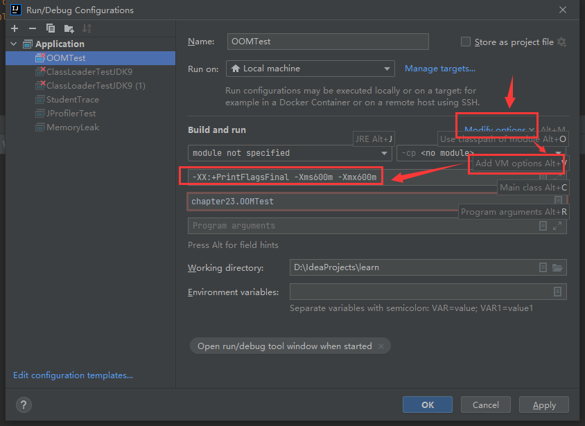
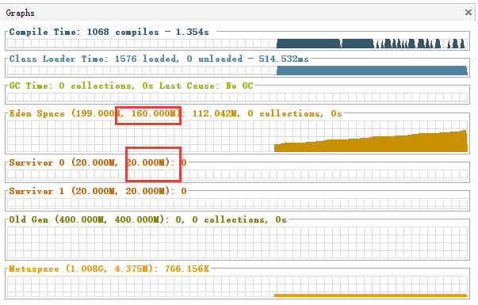
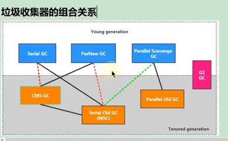

# 第23章-JVM运行时参数

## 23.1 jvm参数选项类型

### 23.1.1 标准参数选项

* 特点：比较稳定，后续版本基本不会变化，以-开头
* 各种选项：运行java或者java -help可以看到所有的标准选项
* 补充内容：-server与-client
  * Hotspot JVM有两种模式，分别为server和client，分别通过-server与-client模式设置
    * 在32位Windows系统上，默认使用Client类型的JVM，要想使用Server模式，则机器配置至少有2个以上的CPU和2G以上的物理内存。client模式适用于对内存要求较小的桌面应用程序，默认使用Serial串行垃圾回收器
    * 64位机器上只支持server模式的JVM，适用于需要大内存的应用程序，默认使用并行垃圾回收期。
    * 官网介绍：https://docs.oracle.com/javase/8/docs/technotes/guides/vm/server-class.html

```shell
C:\Users\cp>java -help
用法: java [-options] class [args...]
           (执行类)
   或  java [-options] -jar jarfile [args...]
           (执行 jar 文件)
其中选项包括:
    -d32          使用 32 位数据模型 (如果可用)
    -d64          使用 64 位数据模型 (如果可用)
    -server       选择 "server" VM
                  默认 VM 是 server.

    -cp <目录和 zip/jar 文件的类搜索路径>
    -classpath <目录和 zip/jar 文件的类搜索路径>
                  用 ; 分隔的目录, JAR 档案
                  和 ZIP 档案列表, 用于搜索类文件。
    -D<名称>=<值>
                  设置系统属性
    -verbose:[class|gc|jni]
                  启用详细输出
    -version      输出产品版本并退出
    -version:<值>
                  需要指定的版本才能运行
    -showversion  输出产品版本并继续
    -jre-restrict-search | -no-jre-restrict-search
                  在版本搜索中包括/排除用户专用 JRE
    -? -help      输出此帮助消息
    -X            输出非标准选项的帮助
    -ea[:<packagename>...|:<classname>]
    -enableassertions[:<packagename>...|:<classname>]
                  按指定的粒度启用断言
    -da[:<packagename>...|:<classname>]
    -disableassertions[:<packagename>...|:<classname>]
                  禁用具有指定粒度的断言
    -esa | -enablesystemassertions
                  启用系统断言
    -dsa | -disablesystemassertions
                  禁用系统断言
    -agentlib:<libname>[=<选项>]
                  加载本机代理库 <libname>, 例如 -agentlib:hprof
                  另请参阅 -agentlib:jdwp=help 和 -agentlib:hprof=help
    -agentpath:<pathname>[=<选项>]
                  按完整路径名加载本机代理库
    -javaagent:<jarpath>[=<选项>]
                  加载 Java 编程语言代理, 请参阅 java.lang.instrument
    -splash:<imagepath>
                  使用指定的图像显示启动屏幕
有关详细信息, 请参阅 http://www.oracle.com/technetwork/java/javase/documentation/index.html。
```

### 23.1.2 -X参数选项

* 特点：非标准化参数，功能还是比较稳定的，但官方说后续版本可能会变更，以-X开头。
* 各种选项：通过运行java -X命令可以看到所有的X选项
* JVM的JIT编译模式相关的选项
  * -Xmixed 混合模式,默认模式，让JIT根据程序运行的情况，有选择的将某些代码
  * -Xint 禁用JIT，所有字节码都被解释执行，这个模式的速度最慢的。
  * -Xcomp 所有字节码第一次使用就被编译成本地代码，然后再执行。
* 特别地
  * -Xms<size>        设置初始 Java 堆大小，等价于-XX:InitalHeapSize
  * -Xmx<size>        设置最大 Java 堆大小，等价于-XX:MaxHeapSize
  * -Xss<size>        设置 Java 线程堆栈大小，等价于-XX:ThreadStackSize

```shell
C:\Users\cp>java -X
    -Xmixed           混合模式执行 (默认)
    -Xint             仅解释模式执行
    -Xbootclasspath:<用 ; 分隔的目录和 zip/jar 文件>
                      设置搜索路径以引导类和资源
    -Xbootclasspath/a:<用 ; 分隔的目录和 zip/jar 文件>
                      附加在引导类路径末尾
    -Xbootclasspath/p:<用 ; 分隔的目录和 zip/jar 文件>
                      置于引导类路径之前
    -Xdiag            显示附加诊断消息
    -Xnoclassgc       禁用类垃圾收集
    -Xincgc           启用增量垃圾收集
    -Xloggc:<file>    将 GC 状态记录在文件中 (带时间戳)
    -Xbatch           禁用后台编译
    -Xms<size>        设置初始 Java 堆大小
    -Xmx<size>        设置最大 Java 堆大小
    -Xss<size>        设置 Java 线程堆栈大小
    -Xprof            输出 cpu 配置文件数据
    -Xfuture          启用最严格的检查, 预期将来的默认值
    -Xrs              减少 Java/VM 对操作系统信号的使用 (请参阅文档)
    -Xcheck:jni       对 JNI 函数执行其他检查
    -Xshare:off       不尝试使用共享类数据
    -Xshare:auto      在可能的情况下使用共享类数据 (默认)
    -Xshare:on        要求使用共享类数据, 否则将失败。
    -XshowSettings    显示所有设置并继续
    -XshowSettings:all
                      显示所有设置并继续
    -XshowSettings:vm 显示所有与 vm 相关的设置并继续
    -XshowSettings:properties
                      显示所有属性设置并继续
    -XshowSettings:locale
                      显示所有与区域设置相关的设置并继续

-X 选项是非标准选项, 如有更改, 恕不另行通知。
```

### 23.1.3 -XX参数选项

* 特点：非标准化参数，使用的最多的参数类型，这类选项属于实验性，不稳定，以-XX开头
* 作用：用于开发和调试JVM
* 分类：
  * Boolean类型格式
    * -XX:+<option> 表示启用option属性
    * -XX:-<option> 表示禁用option属性
    * 说明：因为有的指令默认是开启的，所以可以使用-关闭
    * 举例
      * -XX:+UseParalleGC选择垃圾收集器为并行收集器
      * -XX:+UseG1GC 表示启用G1收集器
      * -XX:+UseAdaptiveSizePolicy 自动选择年轻代区大小和相应的Servivor区比例
  * 非Boolean类型格式（key-value类型）
    * 子类型1：数值格式-XX:<option>=<number>
      * number表示数值，number可以带上单位，比如：m、M表示兆；k、K表示KB；g、G表示G
      * 例如：
        * -XX:NewSize=1024m 表示设置新生代初始大小为1024兆
        * -XX:MaxGCPauseMillis=500 表示设置GC停顿时间：500毫秒
        * -XX:GCTimeRatio=19 表示设置吞吐量
        * -XX:NewRatio=2 表示新生代与老年代的比例
    * 子类型2：非数值格式-XX:<option>=<string>
      * 例如：-XX:HeapDumpPath=/usr/local/heapdump.hprof用来指定heap转存文件的存储路径。
* 特别地
  * -XX:+PrintFlagsFinal
    * 输出所有参数的名称和默认值
    * 默认不包括Diagnostic和Experimental的参数
    * 可以配合-XX:+UnlockDiagnosticVMOptions和-XX:UnlockExperimentalVMOptions使用

## 23.2 添加JVM参数选项

### 23.2.1 Eclipse

### 23.2.2 IDEA



### 23.2.3 运行jar包

* java -Xms50m -Xmx50m -XX:+PrintGCDatails -XX:+PrintGCTimeStamps -jar demo.jar

### 23.2.4 通过Tomcat运行war包

* Linux系统下可以在tomcat/bin/catalina.sh中添加类似如下配置
  * JAVA_OPTS="-Xms512M -Xmx1024M"
* Windows系统下在tomcat/bin/catalina.bat中添加类似如下配置
  * set "JAVA_OPTS=-Xms512M -Xmx1024M"

### 23.2.5 程序运行过程中

​	jinfo 能设置的参数有限，可以使用一个命令查看哪些参数可以在运行中设置。

* 使用jinfo -flag <name>=<value> <pid> 设置非Boolean类型参数
* 使用jinfo -flag [+|-]<name> <pid> 设置Boolean类型参数

```shell
#查看java进程
C:\Users\cp>jps
3520
31396 Launcher
9412 RemoteMavenServer36
27528 OOMTest
33740 Jps

#使用G1垃圾回收器报错
C:\Users\cp>jinfo -flag +UseG1GC 27528
Exception in thread "main" com.sun.tools.attach.AttachOperationFailedException: flag 'UseG1GC' cannot be changed

        at sun.tools.attach.WindowsVirtualMachine.execute(WindowsVirtualMachine.java:117)
        at sun.tools.attach.HotSpotVirtualMachine.executeCommand(HotSpotVirtualMachine.java:261)
        at sun.tools.attach.HotSpotVirtualMachine.setFlag(HotSpotVirtualMachine.java:234)
        at sun.tools.jinfo.JInfo.flag(JInfo.java:140)
        at sun.tools.jinfo.JInfo.main(JInfo.java:81)
#查看G1垃圾回收器是否被使用
C:\Users\cp>jinfo -flag UseG1GC 27528
-XX:-UseG1GC
#查看HeapDumpAfterFullGC是否被使用
C:\Users\cp>jinfo -flag HeapDumpAfterFullGC 27528
-XX:-HeapDumpAfterFullGC
#设置使用HeapDumpAfterFullG
C:\Users\cp>jinfo -flag +HeapDumpAfterFullGC 27528
#查看HeapDumpAfterFullGC是否被使用
C:\Users\cp>jinfo -flag HeapDumpAfterFullGC 27528
-XX:+HeapDumpAfterFullGC
```

## 23.3 常用的JVM参数选项

### 23.3.1 打印设置的XX选项及值

* -XX:+PrintCommandLineFlags 可以让在程序运行前打印出用户手动设置或者JVM自动设置的XX选项
* -XX:+PrintFlagsInitial 表示打印出所有XX选项的默认值
* -XX:+PrintFlagsFianl 表示打印出XX选项在运行程序时生效的值
* -XX:+PrintVMOptions 打印JVM的参数

### 23.3.2 堆、栈、方法区等内存大小设置

* 栈
  * -Xss128k 设置每个线程的栈大小为128k，等价于：-XX:ThreadStackSize=128k
* 堆
  * -Xms50m 等价于-XX:InitialHeapSize，设置JVM初始堆内存为50M
  * -Xmx50m 等价于-XX:MaxHeapSize，设置JVM最大堆内存为50M
  * -Xmn2g 设置年轻代大小为2G，官方推荐配置为整个堆大小的3/8
  * -XX:NewSize=1024m 设置年轻代初始值为1024M
  * -XX:MaxNewSize=1024m 设置年轻代最大值为1024M
  * -XX:SurvivorRatio=8 设置年轻代中Eden区与一个Survivor区的比值，默认为8
  * -XX:+UseAdaptiveSizePolicy 自动选择各区大小比例，默认是开启的
  * -XX:NewRatio=4 设置老年代与年轻代（包括1个Eden区和2个Survivor区）的比值
  * -XX:PretenureSizeThreadshold=1024 设置让大于此阈值的对象直接分配在老年代，单位为字节，只对Serial、ParNew收集器有效
  * -XX:MaxTenuringThreshold=15 默认为15，新生代每次MinorGC后，还存活的对象年龄+1，当对象的年龄大于设置的这个值时就进入老年代。
  * -XX:+PrintTenuringDistribution 让JVM在每次MinorGC后打印出当前使用的Survivor中对象的年龄分布
  * -XX:TargetSurvivorRatio 表示MinorGC结束后Survivor区域中占用空间的期望比例
* 方法区
  * 永久代：-XX:PermSize=256m 设置永久代初始值为256M
  * 永久代：-XX:MaxPermSize=256m 设置永久代最大值为256M
  * 元空间：-XX:MetaspaceSize=256m 初始空间大小
  * 元空间：-XX:MaxMetaspaceSize=256m 最大空间，默认没限制
  * 元空间：-XX:+UseCompressedOops 压缩对象指针
  * 元空间：-XX:+UseCompressedClassPointers 压缩类指针 
  * 元空间：-XX:CompressedClassSpaceSize=1g 设置Class Metaspace的大小，默认是1G
* 直接内存
  * -XX:MaxDirectMemorySize=1G 指定DirectMemory容量，若未指定，则默认与Java堆最大值一样。

```
 * -XX:+PrintFlagsFinal -Xms600m -Xmx600m
 *  -XX:SurvivorRatio=8，默认是自动配置，600M的是6:1,使用-XX:-UseAdaptiveSizePolicy 去掉后，可以控制各个区域的大小
 * 默认情况下，新生代占 1/3 ： 200m，老年代占2/3 : 400m
 *   其中，Eden默认占新生代的8/10 : 160m ,Survivor0，Survivor1各占新生代的1/10 ： 20m
```



### 23.3.3 OutofMemory相关的选项

* -XX:+HeapDumpOnOutOfMemoryError 表示内存出现OOM的时候，把Heap转存（Dump）到文件以便后续分析

* -XX:+HeapDumpBeforeFullGC 表示在出现FullGc之前，生成Heap转储文件

* -XX:HeapDumpPath=<path> 指定Heap转储文件的存储路径

* -XX:OnOutOfMemoryError 指定一个可行性程序或者脚本的路径，当发生OOM的时候，去执行这个脚本。

  * 对于OnOutOfMemoryError的运维处理，以部署在Linux系统/opt/Server目录下的Server.jar为例

    * 在run.sh启动脚本中添加jvm参数：-XX:OnOutOfMemoryError=/opt/Server/restart.sh

    * restart.sh 脚本

      * linux环境

      ```shell
      #!/bin/bash
      pid=$(ps -ef|grep Server.jar|awk '{if($8=="java"){print $2}}')
      kill -9 $pid
      cd /opt/Server/;sh run.sh
      ```

      * Windows环境

      ```shell
      echo off
      wmic process where Name='java.exe' delete
      cd D:\Server
      start run.bat
      ```

```shell
 * -XX:+HeapDumpOnOutOfMemoryError
 * -XX:+HeapDumpBeforeFullGC
 * -XX:HeapDumpPath=d:\heapdumpinstance.hprof
```

### 23.3.4 垃圾回收器相关选项




* 查看默认垃圾回收器：
  * -XX:+PrintCommandLineFlags 查看命令行相关参数（包含使用的垃圾收集器）
  * 使用命令行指令：jinfo -flag 相关垃圾回收期参数 进程ID
  
* Serial回收器
  * Serial回收器作为HotSpot中Client模式下的默认新生代垃圾回收器。Serial Old是运行在Client模式下默认的老年代的垃圾回收器。
  * -XX:+UseSerialGC
  * 指定年轻代和老年代都使用串行收集器，等价于新生代用Serial GC，老年代用Serial Old GC。可以获得最高的单线程收集效率
  
* ParNew回收器
  * -XX:+UseParNewGC 手动指定使用ParNew收集器执行内存回收任务。它表示年轻代使用并行收集器，不影响老年代。
  * -XX:ParallelGCThreads=N 限制线程数量，默认开启和CPU数据相同的线程数。
  
* Parallel回收器
  * -XX:+UseParallelGC 手动指定年轻代使用Parallel并行收集器执行内存回收任务
  * -XX:+UseParallelOldGC 手动指定老年代都是使用并行回收收集器
    * 分别适用于新生代和老年代。默认JDK8是开启的。
    * 上面两个参数，默认开启一个，另一个也会被开启。互相激活。
  * -XX:ParallelGCThreads 设置年轻代并行收集器的线程数。一般地，最好与CPU数量相等，以免过多的线程数影响垃圾收集性能。
    * 默认情况下，当CPU数量小于8个，ParallelGCThreads的值等于CPU数量
    * 当CPU数量大于8个，ParallelGCThreads的值等于3+[5*CPU_Count/8]
  * -XX:MaxGCPauseMillis 设置垃圾收集器最大停顿时间（STW的时间）。单位是毫秒
    * 为了尽可能地把停顿时间控制在MaxGCPauseMillis以内，收集器在工作时会调整Java堆大小或者其他一些参数。
    * 对于用户来将，停顿时间越短体验越好。但是在服务器端，我们注重高并发，整体的吞吐量。所以服务器适合Parallel，进行控制。
    * 该参数使用需谨慎。
  * -XX:GCTimeRatio 垃圾收集时间占总时间比例（=1/(N+1)），用于衡量吞吐量的大小。
    * 取值范围（0，100），默认值99，也就是垃圾回收时间不超过1%。
    * 与前一个-XX:MaxGCPauseMillis参数有一定矛盾性。暂停时间越长，Radio参数就容易超过设定的比例。
  * -XX:+UseAdaptiveSizePolicy 设置Parallel Scavenge收集器具有自适应调节策略。
    * 在这种模式下，年轻代的大小、Eden和Surivor的比例、晋升老年代的对象年龄等参数被自动调整，已达到在堆大小、吞吐量和停顿时间的平衡点。
    * 在手动调优比较困难的场合，可以直接使用这种自适应的方式，仅指定虚拟机的最大堆、目标的吞吐量（GCTimeRatio）和停顿时间（MaxGCPauseMills），让虚拟机自己完成调优工作。
  
* CMS回收器
  * -XX:+UseConcMarkSweepGC 手动指定使用CMS收集器执行内存回收任务
    * 开启该参数后会自动将-XX:+UseParNewGC打开。即：ParNew(Young区用)+CMS(Old区用)+Serial Old的组合。
  * -XX:CMSInitiatingOccupanyFraction 设置堆内存使用率的阈值，一旦达到该阈值，便开始进行回收
    * JDK5及以前版本的默认值为68，即当老年代的空间使用率达到68%时，会执行一次CMS回收，JDK6及以上版本默认值为92%
    * 如果内存增长缓慢，则可以设置一个稍大的值，大的阈值可以有效降低CMS的触发频率，减少老年代回收的次数可以较为明显地改善应用程序性能。反之，如果应用程序内存使用率增长很快，则应该降低这个阈值，以避免频繁触发老年代串行收集器。因此通过该选项便可以有效降低Full GC的执行次数。
  * -XX:+UseCMSCompactAtFullCollection 用于指定执行完Full GC后对内存空间进行压缩整理，以此避免内存碎片的产生。不过由于内存压缩整理过程无法并发执行，所带来的问题就是停顿时间变得更长了。
  * -XX:CMSFullGCsBeforeCompaction 设置在执行多少次Full GC后对内存空间进行压缩整理
  * -XX:ParallelCMSThreads 设置CMS的线程数量
    * CMS 默认启动的线程数时（ParallelGCThreads+3）/4，ParallelGCThreads是年轻代并行收集器的线程数。当CPU资源比较紧张时，受到CMS收集器线程的影响，应用程序的性能在垃圾回收阶段可能会非常糟糕。
  
  补充参数：另外，CMS收集器还有如下常用参数：
  
  * -XX:ConcGCThreads 设置并发垃圾收集的线程数，默认该值是基于ParallelGCThreads计算出来的；
  * -XX:+UseCMSInitiatingOccupancyOnly 是否动态可调，用这个参数可以使CMS一直按CMSInitiatingOccupancyFraction设定的值启动
  * -XX:+CMSScavengeBeforeRemark 强制hotspot虚拟机在cms remark阶段之前做一次minor gc,用于提高remark阶段的速度；
  * -XX:+CMSClassUnloadingEnable 如果有的话，启用回收Perm区（JDK8之前）
  * -XX:+CMSParallelInitialEnabled 用于开启CMS initial-mark阶段采用多线程的方式进行标记，用于提高标记速度，在Java8开始已经默认开启；
  * -XX:+CMSParal1elRemarkEnabled 用户开启CMS remark阶段采用多线程的方式进行重新标记，默认开启；
  * -XX:+ExplicitGCInvokesConcurrent、-XX:+ExplicitGCInvokesConcurrentAndUnloadsClasses 这两个参数用户指定hotspot虚拟在执行System.gc()时使用CMS周期；
  * -XX:+CMSPrecleaningEnabled 指定CMS是否需要进行Pre cleaning这个阶段
  
  特别说明
  
  * JDK9新特性：CMS被标记为Deprecate了（JEP291)
    * 如果对JDK 9及以上版本的HotSpot虚拟机使用参数-XX:+UseConcMarkSweepGC来开启CMS收集器的话，用户会收到一个警告信息，提示CMS未来将会被废弃。
  * JDK14新特性：删除CMS垃圾回收器（JEP363)
    * 移除了CMS垃圾收集器，如果在JDK14中使用-XX:+UseConcMarkSweepGC的话，JVM不会报错，只是给出一个warning信息，但是不会exit。JVM会自动回退以默认GC方式启动JVM
  * OpenJDK 54-Bit Server VM warning: Ignoring option UseConcMarkSweepGC;
    support was removed in 14.0 and the VM will continue execution using the default collector.
  
* G1回收器

  * -XX:MaxGCPauseMillis 设置期望达到的最大GC停顿时间指标（JVM会尽力实现，但不保证达到）。默认值是200ms
  * -XX:ParallelGCThread 设置STW时GC线程数的值。最多设置为8
  * -XX:ConcGCThreads 设置并发标记的线程数。将n设置为并行垃圾回收线程数（ParallelGCThreads)的1/4左右。
  * -XX:InitiatingHeapOccupancyPercent 设置触发并发GC周期的Java堆占用率阈值。超过此值，就触发GC。默认值是45。
  * -XX:G1NewSizePercent、-XX:G1MaxNewSizePercent 新生代占用整个堆内存的最小百分比（默认5%)、最大百分比（默认60%)
  * -XX:G1ReservePercent=10 保留内存区域，防止 to space(Survivor中的to区）溢出

  Mixed GC调优参数

  注意：G1收集器主要涉及到Mixed GC，Mixed GC会回收young 区和部分old区。

  G1关于Mixed GC调优常用参数：

  * -XX:InitiatingHeapOccupancyPercent 设置堆占用率的百分比（0到100)达到这个数值的时候触发global concurrent marking(全局并发标记），默认为45%。值为0表示间断进行全局并发标记。
  * -XX:G1MixedGCLiveThresholdPercent 设置Old区的region被回收时候的对象占比，默认占用率为85%。只有Old区的region中存活的对象占用达到了这个百分比，才会Mixed GC中被回收。
  * -XX:G1HeapWastePercent 在global concurrent marking(全局并发标记）结束之后，可以知道所有的区有多少空空间要被回收，在每次young GC之后和再次发生Mixed GC之前，会检查垃圾占比是否达到此参数，只有达到了，下次才会发生Mixed GC。
  * -XX:G1MixedGCCountTarget 一次global concurrent marking(全局并发标记）之后，最多执行Mixed GC的次数，默认是8。
  * -XX:G1OldCSetRegionThresholdPercent 设置Mixed GC收集周期中要收集的Old region数的上限。默认值是Java堆的10%

* 怎么选择垃圾回收器

  * 优先调整堆的大小让JVM自适应完成。

  * 如果内存小于100M,使用串行收集器

  * 如果是单核、单机程序，并且没有停顿时间的要求，串行收集器

  * 如果是多CPU、需要高吞吐量、允许停顿时间超过1秒，选择并行或者JVM自己选择

  * 如果是多CPU、追求低停顿时间，需快速响应（比如延迟不能超过1秒，如互联网应用），使用并发收集器。官方推荐G1,性能高。现在互联网的项目，基本都是使用G1

  * 特别说明：

    1.没有最好的收集器，更没有万能的收集；

    2.调优永远是针对特定场景、特定需求，不存在一劳永逸的收集器

### 23.3.5 GC日志相关选项

* 常用参数
  * -verbose:gc 输出gc日志信息，默认输出到标准输出。可以独立使用
  * -XX:+PrintGC 等同于-verbose:gc，表示打开简化的GC日志。可以独立使用
  * -XX:+PrintGCDetails 在发生垃圾回收时打印内存回收详细的日志，并在进程退出时输出当前内存各区域分配情况。可以独立使用
  * -XX:+PrintGCTimeStamps 输出GC发生时的时间戳。不可以独立使用，需要配合-XX:+PrintGCDetails
  * -XX:+PrintGCDateStamps 输出GC发生时的时间戳（以日期的形式，如2013-05-04T21:53:59.234+0800)。不可以独立使用，需要配合-XX:+PrintGCDetails
  * -XX:+PrintHeapAtGC 每一次GC前和GC后，都打印堆信息。可以独立使用
  * -Xloggc:<file> 把GC日志写入到一个文件中去，而不是打印到标准输出中
* 其他参数

### 23.3.6 其他参数

* -XX:+DisableExplicitGC 禁止hotspot执行System.gc()，默认禁用
* -XX:ReservedCodeCacheSize=<n>[g|m|k]、-XX:InitialCodeCacheSize=<n>[g|m|k]指定代码缓存的大小
* -XX:+UseCodeCacheFlushing 使用该参数让jvm放弃一些被编译的代码，避免代码缓存被占满时JVM切换到interpreted-only的情况
* -XX:+DoEscapeAnalysis 开启逃逸分析
* -XX:+UseBiasedLocking 开启偏向锁
* -XX:+UseLargePages 开启使用大页面
* -XX:+UseTLAB 使用TLAB,默认打开
* -XX:+PrintTLAB 打印TLAB的使用情况
* -XX:TLABSize 设置TLAB大小

## 23.4 通过Java代码获取JVM参数

​	Java提供了java.lang.management包用于监视和管理Java虚拟机和Java运行时中的其他组件，它允许本地和远程监控和管理运行的Java虚拟机。其中ManagementFactory这个类还是挺常用的。另外还有Runtime类也可以获取一些内存、CPU核数等相关的数据。

​	通过这些api可以监控我们的应用服务器的堆内存使用情况，设置一些阈值进行报警等处理。

```java
package chapter23;

import java.lang.management.ManagementFactory;
import java.lang.management.MemoryMXBean;
import java.lang.management.MemoryUsage;

/**
 *
 * 监控我们的应用服务器的堆内存使用情况，设置一些阈值进行报警等处理
 */
public class MemoryMonitor {
    public static void main(String[] args) {
        MemoryMXBean memorymbean = ManagementFactory.getMemoryMXBean();
        MemoryUsage usage = memorymbean.getHeapMemoryUsage();
        System.out.println("INIT HEAP: " + usage.getInit() / 1024 / 1024 + "m");
        System.out.println("MAX HEAP: " + usage.getMax() / 1024 / 1024 + "m");
        System.out.println("USE HEAP: " + usage.getUsed() / 1024 / 1024 + "m");
        System.out.println("\nFull Information:");
        System.out.println("Heap Memory Usage: " + memorymbean.getHeapMemoryUsage());
        System.out.println("Non-Heap Memory Usage: " + memorymbean.getNonHeapMemoryUsage());

        System.out.println("=======================通过java来获取相关系统状态============================ ");
        System.out.println("当前堆内存大小totalMemory " + (int) Runtime.getRuntime().totalMemory() / 1024 / 1024 + "m");// 当前堆内存大小
        System.out.println("空闲堆内存大小freeMemory " + (int) Runtime.getRuntime().freeMemory() / 1024 / 1024 + "m");// 空闲堆内存大小
        System.out.println("最大可用总堆内存maxMemory " + Runtime.getRuntime().maxMemory() / 1024 / 1024 + "m");// 最大可用总堆内存大小

    }
}
```

