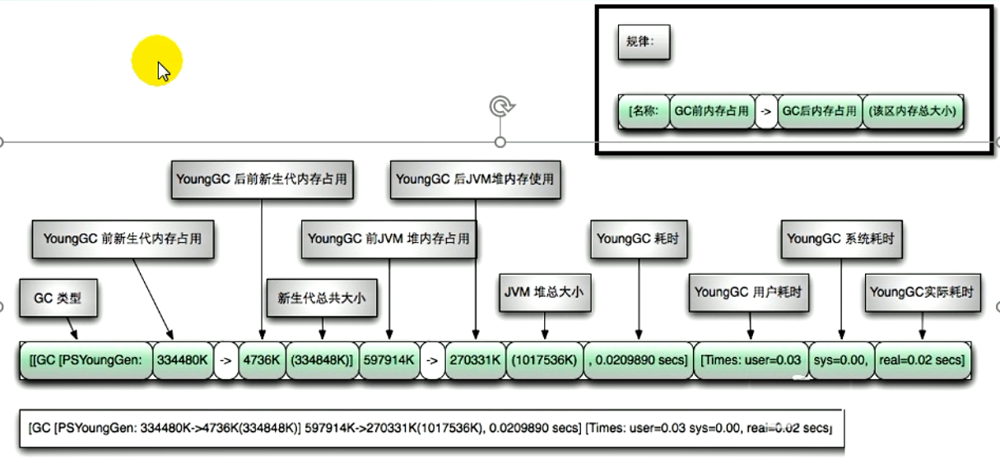

# 第24章-分析GC日志

## 24.1 GC日志参数

* -verbose:gc 输出gc日志信息，默认输出到标准输出。可以独立使用
* -XX:+PrintGC 等同于-verbose:gc，表示打开简化的GC日志。可以独立使用
* -XX:+PrintGCDetails 在发生垃圾回收时打印内存回收详细的日志，并在进程退出时输出当前内存各区域分配情况。可以独立使用
* -XX:+PrintGCTimeStamps 输出GC发生时的时间戳。不可以独立使用，需要配合-XX:+PrintGCDetails
* -XX:+PrintGCDateStamps 输出GC发生时的时间戳（以日期的形式，如2013-05-04T21:53:59.234+0800)。不可以独立使用，需要配合-XX:+PrintGCDetails
* -XX:+PrintHeapAtGC 每一次GC前和GC后，都打印堆信息。可以独立使用
* -Xloggc:<file> 把GC日志写入到一个文件中去，而不是打印到标准输出中

## 24.2 GC日志格式

### 24.2.1 复习GC分类

​	针对HotSpot VM的实现，它里面的GC按照回收区域又分为两大种类型：一种是部分收集（Partial GC)，一种是整堆收（Full GC)

* 部分收集：不是完整收集整个Java堆的垃圾收集。其中又分为：
  * 新生代收集（Minor GC/Young GC）：只是新生代（Eden\\S0,S1)的垃圾收集
  * 老年代收集（Major GC/Old GC)：只是老年代的垃圾收集。
    * 目前，只有CMS GC会有单独收集老年代的行为。
    * 注意，很多时候Major GC会和Full GC混淆使用，需要具体分辨是老年代回收还是整堆回收。
  * 混合收集（Mixed GC)：收集整个新生代以及部分老年代的垃圾收集。
    * 目前，只有G1 GC会有这种行为
* 整堆收集（Full GC)：收集整个java堆和方法区的垃圾收集。
* 那些情况会触发Full GC
  * 老年代空间不足
  * 方法区空间不足
  * 显示调用System.gc()
  * Minor GC进入老年代的数据的平均大小大于老年代的可用内存
  * 大对象直接进入老年代，而老年代的可用空间不足

### 24.2.2 GC日志分类

* Minor GC/Young GC




### 24.2.3 GC日志结构剖析

#### 24.2.3.1 垃圾收集器

* 使用Serial收集器在新生代的名字是Default New Generation,因此显示的是"[DefNew
* 使用ParNew收集器在新生代的名字会变成"[ParNew"，意思是"Para1lel New Generation"
* 使用Parallel Scavenge收集器在新生代的名字是"[PSYoungGen”，这里的JDK1.7使用的就是PSYoungGen
* 使用Parallel O1d Generation收集器在老年代的名字是"[ParoldGen"
* 使用G1收集器的话，会显示为"garbage-first heap"

Allocation Failure
表明本次引起GC的原因是因为在年轻代中没有足够的空间能够存储新的数据了。

#### 24.2.3.2 GC前后情况

​	通过图示，我们可以发现GC日志格式的规律一般都是：GC前内存占用-->GC后内存占用（该区域内存总大小）

​	[PSYoungGen:5986K->696K(8704K)] 5986K->704K(9216K)

​	中括号内：GC回收前年轻代堆大小，回收后大小，（年轻代堆总大小）
​	括号外：GC回收前年轻代和老年代大小，回收后大小，（年轻代和老年代总大小）

#### 24.2.3.3 GC时间

GC日志中有三个时间：user,sys和real

* user - 进程执行用户态代码（核心之外）所使用的时间。这是执行此进程所使用的实际CPU 时间，其他进程和此进程阻塞的时间并不包括在内。在垃圾收集的情况下，表示GC线程执行所使用的 CPU 总时间。
* sys - 进程在内核态消耗的CPU时间，即在内核执行系统调用或等待系统事件所使用的CPU 时间
* real - 程序从开始到结束所用的时钟时间。这个时间包括其他进程使用的时间片和进程阻塞的时间（比如等待 I/O 完成）。对于并行gc，这个数字应该接近（用户时间＋系统时间）除
  以垃圾收集器使用的线程数。

由于多核的原因，一般的GC事件中，real time是小于sys + user time的，因为一般是多个线程并发的去做GC，所以real time是要小于sys+ user time的。如果real>sys+user的话，则你的应用可能存在下列问题：IO负载非常重或者是CPU不够用。

### 24.2.4 Minor GC日志分析

```
2024-04-24T19:31:26.906+0800: 10.370: [GC (Allocation Failure) [PSYoungGen: 16333K->2022K(18432K)] 16333K->13982K(59392K), 0.0109649 secs] [Times: user=0.02 sys=0.05, real=0.01 secs] 
```


* 2024-04-24T19:31:26.906+0800 日志打印时间
* 10.370 GC发生时，JAVA虚拟机启动以来经过的秒数
* GC (Allocation Failure) 发生了一次垃圾回收，这是一次Minor GC。它不区分新生代GC还是老年代GC，括号里的内容是GC发生的原因，这里的Allocation Failure的原因是新生代中没有足够区域能够存放需要分配的数据而失败。
* PSYoungGen: 16333K->2022K(18432K)] 16333K->13982K(59392K)
  * PSYoungGen 表示GC发生的区域，区域名称与使用的GC收集器密切相关
    * Serial收集器：Default New Generation 显示DefNew
    * ParNew收集器：ParNew
    * Parallel Scanvenge收集器：PSYoung
    * 老年代和新生代同理，也是和收集器名称相关
  * 16333K->2022K(18432K) GC前该区域已使用容量->GC后该区域容量（该区域总容量）
    * 如果是新生代，总容量则会显示整个新生代内存的9/10，及eden+from/to区
    * 如果是老年代，总容量则是全部内存大小，无变化。
  * 16333K->13982K(59392K) 在显示完区域容量GC的情况之后，会接着显示整个堆内存区域的GC情况：GC前堆内存已使用容量->GC堆内存容量（堆内存总容量）
* 0.0109649 secs 整个GC所花费的时间，单位是秒
* [Times: user=0.02 sys=0.05, real=0.01 secs]  
  * user 指的是CPU工作在用户态所花费的时间
  * sys：指的是CPU工作内核状态所花费的时间
  * real：指的是此次GC时间所花费的总时间

### 24.2.5 Full GC日志分析

```
2024-04-24T19:42:56.511+0800: 23.555: [Full GC (Ergonomics) [PSYoungGen: 2040K->0K(18432K)] [ParOldGen: 28238K->30120K(40960K)] 30279K->30120K(59392K), [Metaspace: 3673K->3673K(1056768K)], 0.0087683 secs] [Times: user=0.00 sys=0.00, real=0.01 secs] 

```


* 2024-04-24T19:42:56.511+0800  日志打印时间
* 23.555 GC 发生时，JAVA虚拟机启动以来经过的秒数
* [Full GC (Ergonomics) 发生了一次垃圾回收，这是一次FULL GC。它不区分新生代GC还是老年代GC。括号里面的内容是GC发生的原因。
  * Ergonomics` 表示JVM内部环境认为此时可以进行一次垃圾收集，自适应调整导致的GC。
  * Full GC(System)：调用了System.gc()方法
  * Metadata GC Threshold表示Metaspace区不够用了
* PSYoungGen: 2040K->0K(18432K)
  * PSYoungGen 表示GC发生的区域，区域名称与使用的GC收集器密切相关
    * Serial收集器：Default New Generation 显示DefNew
    * ParNew收集器：ParNew
    * Parallel Scanvenge收集器：PSYoung
    * 老年代和新生代同理，也是和收集器名称相关
  * 2040K->0K(18432K) GC前该区域已使用容量->GC后该区域容量（该区域总容量）
    * 如果是新生代，总容量则会显示整个新生代内存的9/10，及eden+from/to区
    * 如果是老年代，总容量则是全部内存大小，无变化。
* ParOldGen: 28238K->30120K(40960K) 老年代区域没有发生GC，因为本次是Ergonomics引起的。
* 30279K->30120K(59392K) 在显示完区域容量GC的情况之后，会接着显示整个堆内存区域的GC情况：GC前堆内存已使用容量->GC堆内存容量（堆内存总容量）
  * 堆内存容量=9/10新生代+老年代<初始化的内存大小
* [Metaspace: 3673K->3673K(1056768K)] metaspace G回收0空间
* 0.0087683 secs 整个GC所花费的时间，单位是秒
* [Times: user=0.02 sys=0.05, real=0.01 secs]  
  * user 指的是CPU工作在用户态所花费的时间
  * sys：指的是CPU工作内核状态所花费的时间
  * real：指的是此次GC时间所花费的总时间

## 24.3 GC日志分析工具

​	上节介绍了GC日志的打印及含义，但是GC日志看起来比较麻烦，本节将会介绍一下GC日志可视化分析工具GCeasy和GCviewer等。通过GC日志可视化分析工具，我们可以很方便的看到JVM各个分代的内存使用情况、垃圾回收次数、垃圾回收的原因、垃圾回收占用的时间、吞吐量等，这些指标在我们进行JVM调优的时候是很有用的。

​	如果想把GC日志存到文件的话，是下面这个参数：

​	-Xloggc:/path/to/gc.log

​	然后就可以用一些工具去分析这些gc日志。

### 24.3.1 GCeasy

​	GCeasy是一款好用的在线分析GC日志的网站。

​	官网地址：https://gceasy.io/，GCeasy是一段在线的GC日志分析器，可以通过GC日志分析进行内存泄漏检测、GC暂停原因分析、JVM配置建议优化等功能，而且是可以免费使用的（有一些服务是收费的）。


### 24.3.2 GCViewer

​	GCViewer是一个免费的、开源的分析小工具，可用于可视化查看由SUN/Oracle，IBM，HP和BEA Java虚拟机产生的垃圾收集器的日志。

​	GCViewer用于可视化Java VM选项-verbose:gc和.NET生成的数据-Xloggc:<file>。它还计算与垃圾回收相关的性能指标（吞吐量，累计的暂停，最长的暂停等）。当通过更改世代大小或设置初始堆大小来调整特定应用程序的垃圾回收时，此功能非常有用。

​	源码下载：https://github.com/chewiebug/GCViewer

​	运行版本：https://github.com/chewiebug/GCViewer/wiki/Changelog

​	运行：只需要双击gcviewer-1.3x.jar或运行java -jar gcviewer-1.3x.jar（它需要运行java 1.8 vm），即可启动GCViewer(GUI)


### 24.3.3 其他工具

* GChisto
  * GChisto是一款专业分析gc日志的工具，可以通过gc日志来分析：MinorGC、Full GC的次数、频率、持续时间等，通过列表、报表、图表等不同形式来反映gc的情况。
  * 虽然界面略显粗糙，但是功能还是不错的
  * 官网上没有下载的地方，需要自己从SVN上拉下来编译
  * 不过这个工具似乎没怎么维护了，存在不少bug

* HPjmeter
  * 工具很强大，但只能打开由一下参数生成的GC log
    * -verbose:gc或-Xloggc:gc.log 添加其他参数生成的gc.log无法打开
  * HPjmeter集成了以前的HPjtune功能，可以分析在HP机器上产生的垃圾回收日志文件

后续还有两章，但是没视频了

* OOM常见各种场景及解决方案


* 性能优化案例

