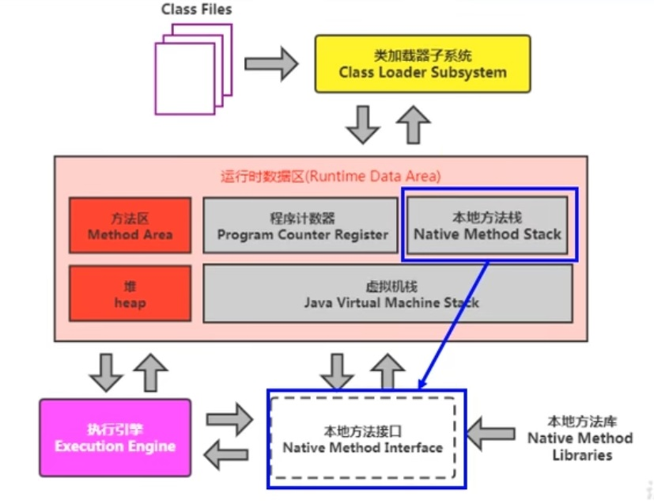

# 第6章-本地方法和本地方法栈

## 6.1 本地方法

### 6.1.1 什么是本地方法

* Native Method就是一个Java调用非Java代码的接口。

* 定义Native Method时，不提供实现体，因为实现体是由非Java语言在外面实现的。

* 本地方法（本地接口）的作用是融合不同的编程语言为Java所用，它的初衷是融合C、C++程序

### 6.1.2 本地方法举例

* 使用native标识符标识本地方法。

* 标识符native可以与所有其他的Java标识符连用，但是abstract除外

* 举例

```java
public class IHaveNatives {
//    public abstract   native void Native0(int x);
    public  native void Native1(int x);
    public native static long Native2();
    private native synchronized float Native3(Object o);
    native void Native4(int[] ary) throws Exception;
}
```

### 6.1.3 为什么要使用Native Method

* Java使用起来非常方便，然而有些层次的任务Java实现起来不容易，或则我们对程序的效率很在意时，问题就来了。
  
  * 与Java环境外交互：
    
    有时Java应用需要与Java外面的环境交互，这是本地方法存在的主要原因。如与一些底层系统，操作系统或某些硬件交换信息时的情况。本地方法提供交流机制，无需了解Java应用之外的繁琐的细节。
  
  * 与操作系统交互
    
    JVM支持着Java语言本身和运行时库，它是Java程序赖以生存的平台，它由一个解释器（解析字节码）和一些连接到本地代码的库组成。但是它不是完整的系统，它经常依赖于一些底层系统的支持。这些底层系统常常是强大的操作系统。通过使用本地方法，我们得以用Java实现实现了jre的与底层系统的交互，甚至JVM的一些部分就是用C写的。还有，如果我们要使用一些Java语言本身没有提供封装的操作系统的特性时，我们也需要使用本地方法。
  
  * Sun's Java
    
    sun的解释器是用C实现的，这使得它能像一些普通的C一样与外部交互。jre大部分是用Java实现，它也通过一些本地方法与外界交互。例如：类java.lang.Thread的setPriority()方法是用Java实现，但是它实现调用的是该类里的本地方法setPriority0()。这个本地方法是用C实现的，并被植入JVM内部，在Windows 95的平台上，这个本地方法最终调用Win32 SetPriority() API。这是一个本地方法的具体由JVM直接提供，更多的情况是本地方法由外部的动态连接库（external dynamic link library）提供，然后被JVM调用。

### 6.1.4 现状

* 目前使用本地方法的越来越少，除非是与硬件有关的应用，比如通过Java程序驱动打印器或者Java系统管理生产设备，在企业级应用中已经比较少见了。因为现在的异构领域间的通信很发达，比如可以使用Socket通信，也可以使用Web Service等等。

## 6.2 本地方法栈

* Java虚拟机栈用于管理Java方法的调用，而本地方法栈用于管理本地方法调用。

* 本地方法栈也是线程私有的。

* 允许被实现成固定或者是可动态扩展的内存大小。（在内存溢出方面与虚拟机栈是相同的）
  
  * 如果线程请求分配的栈容量超过本地方法栈允许的最大容量，Java虚拟机将会抛出一个StackOverflowError异常。
  
  * 如果本地方法栈可以动态扩展，并在尝试扩展的时候无法申请到足够的内存，或则在创建新的线程时没有足够的内存去创建对应的本地方法栈，那么Java虚拟机将会抛出一个OutOfMemoryError异常。

* 本地方法是使用C语言实现的。

* 它的具体做法是Native Method Stack中登记native 方法，在Execution Engine 执行时加载本地方法库。

* 当某个线程调用本地方法时，它就进入了一个全新的并且不受虚拟机限制的世界。它和虚拟机拥有同样的权限。
  
  * 本地方法可以通过本地方法接口来访问虚拟机内部的运行时数据区。
  
  * 它甚至可以直接使用本地处理器中的寄存器。
  
  * 直接从本地内存中分配任意数据的内存。

* <mark>并不是所有的JVM都支持本地方法。</mark>因为Java虚拟机规范并没有明确要求本地方法栈的使用语言、具体实现方法、数据结构等。如果JVM产品不打算支持native方法，也可以无需实现本地方法栈。

* <mark>在Hotspot JVM中，直接将本地方法栈和虚拟机栈合二为一。</mark>


