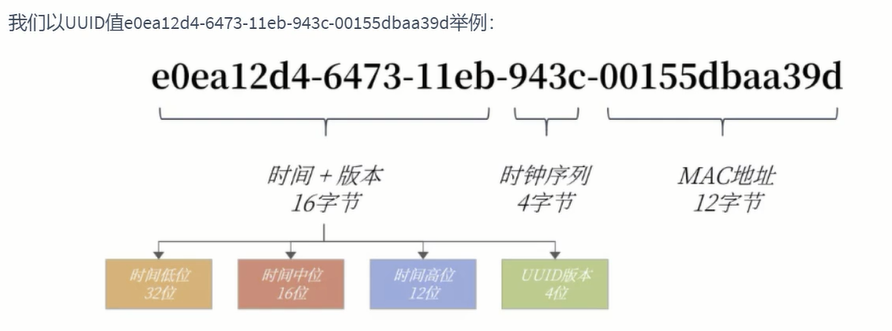

# 第10章-索引优化与查询优化

* 索引优化技术有很多，大致分为物理查询优化和逻辑后查询优化
* 物理优化：通过索引和表连接方式等技术进行优化，重点掌握索引的使用。
* 逻辑优化：通过SQL 等价变换提升查询效率。

## 10.1数据准备

```sql
#步骤1：建表

CREATE TABLE `class` (
	`id` INT(11) NOT NULL AUTO_INCREMENT,
	`className` VARCHAR(30) DEFAULT NULL,
	`address` VARCHAR(40) DEFAULT NULL,
	`monitor` INT NULL ,
	PRIMARY KEY (`id`)
) ENGINE=INNODB AUTO_INCREMENT=1 DEFAULT CHARSET=utf8;
CREATE TABLE `student` (
	`id` INT(11) NOT NULL AUTO_INCREMENT,
	`stuno` INT NOT NULL ,
	`name` VARCHAR(20) DEFAULT NULL,
	`age` INT(3) DEFAULT NULL,
	`classId` INT(11) DEFAULT NULL,
PRIMARY KEY (`id`)
#CONSTRAINT `fk_class_id` FOREIGN KEY (`classId`) REFERENCES `t_class` (`id`)
) ENGINE=INNODB AUTO_INCREMENT=1 DEFAULT CHARSET=utf8;

#步骤2：设置参数
##命令开启：允许创建函数设置：
set global log_bin_trust_function_creators=1; # 不加global只是当前窗口有效。

#步骤3：创建函数
#随机产生字符串
#保证每条数据都不同。
DELIMITER //
CREATE FUNCTION rand_string(n INT) RETURNS VARCHAR(255)
BEGIN
    DECLARE chars_str VARCHAR(100) DEFAULT
    'abcdefghijklmnopqrstuvwxyzABCDEFJHIJKLMNOPQRSTUVWXYZ';
    DECLARE return_str VARCHAR(255) DEFAULT '';
    DECLARE i INT DEFAULT 0;
    WHILE i < n DO
    SET return_str =CONCAT(return_str,SUBSTRING(chars_str,FLOOR(1+RAND()*52),1));
    SET i = i + 1;
    END WHILE;
    RETURN return_str;
END //
DELIMITER ;
#假如要删除
#drop function rand_string;

#随机产生班级编号
#用于随机产生多少到多少的编号
DELIMITER //
CREATE FUNCTION rand_num (from_num INT ,to_num INT) RETURNS INT(11)
BEGIN
    DECLARE i INT DEFAULT 0;
    SET i = FLOOR(from_num +RAND()*(to_num - from_num+1)) ;
    RETURN i;
END //
DELIMITER ;
#假如要删除
#drop function rand_num;

#步骤4：创建存储过程
#创建往stu表中插入数据的存储过程
DELIMITER //
CREATE PROCEDURE insert_stu( START INT , max_num INT )
BEGIN
    DECLARE i INT DEFAULT 0;
    SET autocommit = 0; #设置手动提交事务
    REPEAT #循环
    SET i = i + 1; #赋值
    INSERT INTO student (stuno, name ,age ,classId ) VALUES
    ((START+i),rand_string(6),rand_num(1,50),rand_num(1,1000));
    UNTIL i = max_num
    END REPEAT;
    COMMIT; #提交事务
END //
DELIMITER ;
#假如要删除
#drop PROCEDURE insert_stu;

#创建往class表中插入数据的存储过程
#执行存储过程，往class表添加随机数据
DELIMITER //
CREATE PROCEDURE `insert_class`( max_num INT )
BEGIN
    DECLARE i INT DEFAULT 0;
    SET autocommit = 0;
    REPEAT
    SET i = i + 1;
    INSERT INTO class ( classname,address,monitor ) VALUES
    (rand_string(8),rand_string(10),rand_num(1,100000));
    UNTIL i = max_num
    END REPEAT;
    COMMIT;
END //
DELIMITER ;
#假如要删除
#drop PROCEDURE insert_class;

#步骤5：调用存储过程
#执行存储过程，往class表添加1万条数据
CALL insert_class(10000);
#执行存储过程，往stu表添加50万条数据
CALL insert_stu(100000,500000);

#步骤6：删除某表上的索引
DELIMITER //
CREATE PROCEDURE `proc_drop_index`(dbname VARCHAR(200),tablename VARCHAR(200))
    BEGIN
    DECLARE done INT DEFAULT 0;
    DECLARE ct INT DEFAULT 0;
    DECLARE _index VARCHAR(200) DEFAULT '';
    DECLARE _cur CURSOR FOR SELECT index_name FROM
    information_schema.STATISTICS WHERE table_schema=dbname AND table_name=tablename AND
    seq_in_index=1 AND index_name <>'PRIMARY' ;
    #每个游标必须使用不同的declare continue handler for not found set done=1来控制游标的结束
    DECLARE CONTINUE HANDLER FOR NOT FOUND set done=2 ;
    #若没有数据返回,程序继续,并将变量done设为2
    OPEN _cur;
    FETCH _cur INTO _index;
    WHILE _index<>'' DO
    SET @str = CONCAT("drop index " , _index , " on " , tablename );
    PREPARE sql_str FROM @str ;
    EXECUTE sql_str;
    DEALLOCATE PREPARE sql_str;
    SET _index='';
    FETCH _cur INTO _index;
    END WHILE;
    CLOSE _cur;
END //
DELIMITER ;

#执行存储过程
CALL proc_drop_index("dbname","tablename");
```

## 10.2 索引失效案例

* SQL语句是否使用索引，跟数据库版本、数据量、数据选择读有限系。都是优化器说了算。

### 10.2.1 全值匹配索引都能选择到

* 非范围查找的，全值匹配，索引都能用到，不管字段顺序，优化器会自动选择，自动优化索引。但是必须是最左法则，如果**跳过某个字段，索引后面的字段都无法被使用**，和顺序无关。

```sql
#创建索引后，选择idx_age索引
EXPLAIN SELECT SQL_NO_CACHE * FROM student WHERE age=30;
#创建索引后，选择idx_age_classid索引
EXPLAIN SELECT SQL_NO_CACHE * FROM student WHERE age=30 AND classId=4;

#创建索引后，idx_age_classid_name
EXPLAIN SELECT SQL_NO_CACHE * FROM student WHERE age=30 AND classId=4 AND NAME = 'abcd';

#创建索引后，idx_age_classid_name
EXPLAIN SELECT SQL_NO_CACHE * FROM student WHERE age=30 AND NAME = 'abcd' AND classId=4;

#只有idx_age_classid_name索引，字段顺序对走索引没有影响，但是必须有最左的索引字段才能走索引
EXPLAIN SELECT SQL_NO_CACHE * FROM student WHERE classId = 4 AND age=30;

#这个不走索引，因为无法匹配最左法则
EXPLAIN SELECT SQL_NO_CACHE * FROM student WHERE classId = 4 AND name='abcd';

SELECT SQL_NO_CACHE * FROM student WHERE age=30 AND classId=4 AND NAME = 'abcd';

CREATE INDEX idx_age ON student(age);

CREATE INDEX idx_age_classid ON student(age,classId);

CREATE INDEX idx_age_classid_name ON student(age,classId,NAME);
```

### 10.2.2 最佳左前缀法则

* 索引文件具有 B-Tree 的最左前缀匹配特性，如果左边的值未确定，那么无法使用此索引。
* 建立的联合索引遵守最佳左前缀匹配原则，即最左有限，检索数据从联合索引的最左边开始匹配。
* 多列索引可以包括16个字段，要使用索引过滤条件要按照索引建立时字段的顺序，依次满足，一旦**跳过某个字段，索引后面的字段都无法被使用**，走索引时的字段不管条件顺序，优化器会自动选择。

```sql
DROP INDEX idx_age ON student;
DROP INDEX idx_age_classid ON student;

#用上索引了，因为联合索引是age,classid,name
EXPLAIN SELECT SQL_NO_CACHE * FROM student WHERE student.age=30 AND student.name = 'abcd' ;
#未用上索引了，因为联合索引是age,classid,name，没有age进行匹配
EXPLAIN SELECT SQL_NO_CACHE * FROM student WHERE student.classid=1 AND student.name = 'abcd';

#用上索引了，因为联合索引是age,classid,name
EXPLAIN SELECT SQL_NO_CACHE * FROM student 
WHERE classid=4 AND student.age=30 AND student.name = 'abcd'; 
```

### 10.2.3 主键插入顺序

* 主键是顺序的聚簇索引，如果插入的主键值是随机大小，插入时可能会导致叶子节点移动，造成性能损耗。所以主键在插入时，最好选择自增主键。

### 10.2.4 计算、函数、类型转换(自动或手动)导致索引失效

* 计算、函数、类型转换(自动或手动)导致索引失效

```sql
#创建索引
CREATE INDEX idx_name ON student(NAME);
#前缀匹配索引生效
EXPLAIN SELECT SQL_NO_CACHE * FROM student WHERE student.name LIKE 'abc%';

#函数转换索引失效
EXPLAIN SELECT SQL_NO_CACHE * FROM student WHERE LEFT(student.name,3) = 'abc';

#创建索引
CREATE INDEX idx_sno ON student(stuno);
#数据计算导致索引失效
EXPLAIN SELECT SQL_NO_CACHE id, stuno, NAME FROM student WHERE stuno+1 = 900001;
#优化为等值比较，索引生效
EXPLAIN SELECT SQL_NO_CACHE id, stuno, NAME FROM student WHERE stuno = 900000;

#创建索引
CREATE INDEX idx_name ON student(NAME);
#字符串截取索引失效
EXPLAIN SELECT id, stuno, name FROM student WHERE SUBSTRING(name, 1,3)='abc';
#优化为前缀查询，索引生效
EXPLAIN SELECT SQL_NO_CACHE * FROM student WHERE student.name LIKE 'abc%';
```

### 10.2.5 类型转换导致索引失效

```sql
#类型转换导致索引失效
EXPLAIN SELECT SQL_NO_CACHE * FROM student WHERE NAME = 123; 
#正确的类型可以使用到索引
EXPLAIN SELECT SQL_NO_CACHE * FROM student WHERE NAME = '123'; 
```

### 10.2.6范围条件右边的列索引失效

* 左右指的是索引列的的位置，不是sql条件位置。

```sql

#删除索引
ALTER TABLE student DROP INDEX idx_name;
ALTER TABLE student DROP INDEX idx_age;
ALTER TABLE student DROP INDEX idx_age_classid;
ALTER TABLE student DROP INDEX idx_sno;
ALTER TABLE student DROP INDEX idx_age_classId_name;
#创建索引
CREATE INDEX idx_age_classId_name ON student(age,classId,NAME);

#联合索引是age,classId,NAME，，但是classId是范围查询，索引只会用到age,classId，这个叫范围条件右边的列索引失效
EXPLAIN SELECT SQL_NO_CACHE * FROM student WHERE student.age=30 AND student.classId>20 AND student.name = 'abc' ; 
#与上面结果一样，因为创建索引的的顺序是age,classId,NAME，优化器会自己选择顺序，与你写的sql顺序无关。
EXPLAIN SELECT SQL_NO_CACHE * FROM student WHERE student.age=30 AND student.name ='abc' AND student.classId>20 ;

#优化
#联合索引创建索引age,NAME,classId,创建索引时把范围索引列放在最后。创建后能使用全索引。
CREATE INDEX idx_age_name_cid ON student(age,NAME,classId);

```

### 10.2.7不等于(!= 或者<>)索引失效

* 这里不确定的，需要回表的索引才失效，不需要回表的不失效，具体看情况，不是绝对的。

```sql
#不等于(!= 或者<>)索引失效
#创建索引
CREATE INDEX idx_name ON student(NAME);
#需要回表索引失效，查询完索引后还需要回表，性能消耗上，不如直接回表操作。
EXPLAIN SELECT SQL_NO_CACHE * FROM student WHERE student.name <> 'abc' ;
#需要回表索引失效，查询完索引后还需要回表，性能消耗上，不如直接回表操作。
EXPLAIN SELECT SQL_NO_CACHE * FROM student WHERE student.name != 'abc' ;
#查询的字段本身就是索引列，不需要回表，就可以走索引
EXPLAIN SELECT SQL_NO_CACHE student.name  FROM student WHERE student.name <> 'abc' ;
#查询的字段本身就是索引列、主键列，不需要回表，就可以走索引
EXPLAIN SELECT SQL_NO_CACHE student.name,student.id  FROM student WHERE student.name != 'abc' ;
```

### 10.2.8 is null可以使用索引，is not null无法使用索引

* 这里不确定的，需要回表的索引才失效，不需要回表的不失效，具体看情况，不是绝对的。所以设计表时最好设置为NOT NULL，int类型使用0表示，字符串使用空的字符串表示。

```sql
#is null可以使用索引，is not null无法使用索引
#is null 相当于等值查询，所以可以使用索引
EXPLAIN SELECT SQL_NO_CACHE * FROM student WHERE age IS NULL; 
#is not null 相当于不等值查询，范围查询
EXPLAIN SELECT SQL_NO_CACHE * FROM student WHERE age IS NOT NULL; 

#IS NOT NULL不需要回表是可以所用索引
EXPLAIN SELECT SQL_NO_CACHE age FROM student WHERE age IS NOT NULL; 
```

### 10.2.9 like以通配符%开头索引失效。

* 页面搜索严禁左模糊或者全模糊，如果需要请走搜索引擎来解决。

```sql
#like以通配符%开头索引失效
#前缀可以匹配索引
EXPLAIN SELECT SQL_NO_CACHE * FROM student WHERE NAME LIKE 'ab%'; 
#前缀模糊相当于范围查找
EXPLAIN SELECT SQL_NO_CACHE * FROM student WHERE NAME LIKE '%ab%';
```

### 10.2.10 OR 前后存在非索引的列，索引失效

```sql

#OR 前后存在非索引的列，索引失效
#先清空所有的索引，单独创建age索引
CREATE INDEX idx_age ON student(age);
#OR条件添加了非索引字段，导致索引失效。优化器认为有一个字段反正都是全表扫描，不如直接全部走全表扫描
EXPLAIN SELECT SQL_NO_CACHE * FROM student WHERE age = 10 OR classid = 100;
#为classid添加索引后，上面的语句可以合并扫描索引了。
CREATE INDEX idx_cid ON student(classid);
```

### 10.2.11 数据库和表的字符集统一使用utf8mb4

* 不同字符集比较需要进行转换，导致索引失效。
* 统一使用utf8mb4( 5.5.3版本以上支持)兼容性更好，统一字符集可以避免由于字符集转换产生的乱码

### 10.2.12 建议

* 单列索引，选择query过滤性更好的索引
* 组合索引，query过滤性更好的字段放在前面。
* 组合索引，尽量选择包含where子句中条件更多的字段。
* 组合索引，某个字段是范围查询，尽量放在最后面。

## 10.3 关联查询优化

### 10.3.1 数据准备

```sql
# 情况1：左外连接
#分类
CREATE TABLE IF NOT EXISTS `type` (
`id` INT(10) UNSIGNED NOT NULL AUTO_INCREMENT,
`card` INT(10) UNSIGNED NOT NULL,
PRIMARY KEY (`id`)
);
#图书
CREATE TABLE IF NOT EXISTS `book` (
`bookid` INT(10) UNSIGNED NOT NULL AUTO_INCREMENT,
`card` INT(10) UNSIGNED NOT NULL,
PRIMARY KEY (`bookid`)
);

#向分类表中添加20条记录
INSERT INTO `type`(card) VALUES(FLOOR(1 + (RAND() * 20)));
INSERT INTO `type`(card) VALUES(FLOOR(1 + (RAND() * 20)));
INSERT INTO `type`(card) VALUES(FLOOR(1 + (RAND() * 20)));
INSERT INTO `type`(card) VALUES(FLOOR(1 + (RAND() * 20)));
INSERT INTO `type`(card) VALUES(FLOOR(1 + (RAND() * 20)));
INSERT INTO `type`(card) VALUES(FLOOR(1 + (RAND() * 20)));
INSERT INTO `type`(card) VALUES(FLOOR(1 + (RAND() * 20)));
INSERT INTO `type`(card) VALUES(FLOOR(1 + (RAND() * 20)));
INSERT INTO `type`(card) VALUES(FLOOR(1 + (RAND() * 20)));
INSERT INTO `type`(card) VALUES(FLOOR(1 + (RAND() * 20)));
INSERT INTO `type`(card) VALUES(FLOOR(1 + (RAND() * 20)));
INSERT INTO `type`(card) VALUES(FLOOR(1 + (RAND() * 20)));
INSERT INTO `type`(card) VALUES(FLOOR(1 + (RAND() * 20)));
INSERT INTO `type`(card) VALUES(FLOOR(1 + (RAND() * 20)));
INSERT INTO `type`(card) VALUES(FLOOR(1 + (RAND() * 20)));
INSERT INTO `type`(card) VALUES(FLOOR(1 + (RAND() * 20)));
INSERT INTO `type`(card) VALUES(FLOOR(1 + (RAND() * 20)));
INSERT INTO `type`(card) VALUES(FLOOR(1 + (RAND() * 20)));
INSERT INTO `type`(card) VALUES(FLOOR(1 + (RAND() * 20)));
INSERT INTO `type`(card) VALUES(FLOOR(1 + (RAND() * 20)));

#向图书表中添加20条记录
INSERT INTO book(card) VALUES(FLOOR(1 + (RAND() * 20)));
INSERT INTO book(card) VALUES(FLOOR(1 + (RAND() * 20)));
INSERT INTO book(card) VALUES(FLOOR(1 + (RAND() * 20)));
INSERT INTO book(card) VALUES(FLOOR(1 + (RAND() * 20)));
INSERT INTO book(card) VALUES(FLOOR(1 + (RAND() * 20)));
INSERT INTO book(card) VALUES(FLOOR(1 + (RAND() * 20)));
INSERT INTO book(card) VALUES(FLOOR(1 + (RAND() * 20)));
INSERT INTO book(card) VALUES(FLOOR(1 + (RAND() * 20)));
INSERT INTO book(card) VALUES(FLOOR(1 + (RAND() * 20)));
INSERT INTO book(card) VALUES(FLOOR(1 + (RAND() * 20)));
INSERT INTO book(card) VALUES(FLOOR(1 + (RAND() * 20)));
INSERT INTO book(card) VALUES(FLOOR(1 + (RAND() * 20)));
INSERT INTO book(card) VALUES(FLOOR(1 + (RAND() * 20)));
INSERT INTO book(card) VALUES(FLOOR(1 + (RAND() * 20)));
INSERT INTO book(card) VALUES(FLOOR(1 + (RAND() * 20)));
INSERT INTO book(card) VALUES(FLOOR(1 + (RAND() * 20)));
INSERT INTO book(card) VALUES(FLOOR(1 + (RAND() * 20)));
INSERT INTO book(card) VALUES(FLOOR(1 + (RAND() * 20)));
INSERT INTO book(card) VALUES(FLOOR(1 + (RAND() * 20)));
INSERT INTO book(card) VALUES(FLOOR(1 + (RAND() * 20)));
```

### 10.3.2 左外连接

* 左外连接类似于嵌套循环。
* 选择上使用小表驱动大表，减少IO次数。
* 外连接，只有一个字段能添加索引，添加被驱动表的索引，可以提高查询效率。
* 外连接连接条件类型必须一样，如果不一样会进行隐式转化，导致索引时效。

```sql

#没有走索引
EXPLAIN SELECT SQL_NO_CACHE * FROM `type` LEFT JOIN book ON type.card = book.card;

#添加索引
CREATE INDEX Y ON book(card);

#book走了索引
EXPLAIN SELECT SQL_NO_CACHE * FROM `type` LEFT JOIN book ON type.card = book.card;

#添加索引
CREATE INDEX X ON `type`(card);

#book走了索引和type都走了索引
EXPLAIN SELECT SQL_NO_CACHE * FROM `type` LEFT JOIN book ON type.card = book.card;

#删除索引
DROP INDEX Y ON book;
#type走了索引
EXPLAIN SELECT SQL_NO_CACHE * FROM `type` LEFT JOIN book ON type.card = book.card;
```

### 10.3.3 内连接

* 对于内连接来说，查询优化器可以决定谁作为驱动表，谁作为被驱动表出现的
* 对于内连接来讲，如果表的连接条件中只能有一个字段有索引，则有索引的字段所在的表会被作为被驱动表出现。
* 对于内连接来说，在两个表的连接条件都存在索引的情况下，会选择小表作为驱动表。“小表驱动大表”

```sql
DROP INDEX X ON `type`;
#没走索引
EXPLAIN SELECT SQL_NO_CACHE * FROM `type` INNER JOIN book ON type.card = book.card;

#添加索引
CREATE INDEX Y ON book(card);

#book走索引
EXPLAIN SELECT SQL_NO_CACHE * FROM `type` INNER JOIN book ON type.card = book.card;

CREATE INDEX X ON `type`(card);

#结论：对于内连接来说，查询优化器可以决定谁作为驱动表，谁作为被驱动表出现的
#都走索引
EXPLAIN SELECT SQL_NO_CACHE * FROM `type` INNER JOIN book ON type.card = book.card;

#删除索引
DROP INDEX Y ON book;
#结论：对于内连接来讲，如果表的连接条件中只能有一个字段有索引，则有索引的字段所在的表会被作为被驱动表出现。
EXPLAIN SELECT SQL_NO_CACHE * FROM `type` INNER JOIN book ON type.card = book.card;

CREATE INDEX Y ON book(card);
EXPLAIN SELECT SQL_NO_CACHE * FROM `type` INNER JOIN book ON type.card = book.card;

#向type表中添加数据（20条数据）
INSERT INTO `type`(card) VALUES(FLOOR(1 + (RAND() * 20)));
INSERT INTO `type`(card) VALUES(FLOOR(1 + (RAND() * 20)));
INSERT INTO `type`(card) VALUES(FLOOR(1 + (RAND() * 20)));
INSERT INTO `type`(card) VALUES(FLOOR(1 + (RAND() * 20)));
INSERT INTO `type`(card) VALUES(FLOOR(1 + (RAND() * 20)));
INSERT INTO `type`(card) VALUES(FLOOR(1 + (RAND() * 20)));
INSERT INTO `type`(card) VALUES(FLOOR(1 + (RAND() * 20)));
INSERT INTO `type`(card) VALUES(FLOOR(1 + (RAND() * 20)));
INSERT INTO `type`(card) VALUES(FLOOR(1 + (RAND() * 20)));
INSERT INTO `type`(card) VALUES(FLOOR(1 + (RAND() * 20)));
INSERT INTO `type`(card) VALUES(FLOOR(1 + (RAND() * 20)));
INSERT INTO `type`(card) VALUES(FLOOR(1 + (RAND() * 20)));
INSERT INTO `type`(card) VALUES(FLOOR(1 + (RAND() * 20)));
INSERT INTO `type`(card) VALUES(FLOOR(1 + (RAND() * 20)));
INSERT INTO `type`(card) VALUES(FLOOR(1 + (RAND() * 20)));
INSERT INTO `type`(card) VALUES(FLOOR(1 + (RAND() * 20)));
INSERT INTO `type`(card) VALUES(FLOOR(1 + (RAND() * 20)));
INSERT INTO `type`(card) VALUES(FLOOR(1 + (RAND() * 20)));
INSERT INTO `type`(card) VALUES(FLOOR(1 + (RAND() * 20)));
INSERT INTO `type`(card) VALUES(FLOOR(1 + (RAND() * 20)));

#结论：对于内连接来说，在两个表的连接条件都存在索引的情况下，会选择小表作为驱动表。“小表驱动大表”
EXPLAIN SELECT SQL_NO_CACHE * FROM `type` INNER JOIN book ON type.card = book.card;
```

### 10.3.4 JOIN语句原理

* join方式连接多表，本质是各表之间数据的循环匹配。
* Mysql5.5版本之前，只支持一种表关联方式，就是嵌套循环（Nested Loop Join），数据量大，关联执行时间非常长。
* Mysql5.5版本之后，引入BNLJ算法优化嵌套执行。
* 为了方便可以使用straight_join 让MySQL使用固定的连接方式执行查询，可以看到优化器对于join的优化。

#### 10.3.4.1 驱动表和被驱动表

* 驱动表是主表，被驱动表是从表。
* 对于内连接，优化器会根据查询语句做优化，先查询的那张表就是驱动表，反之是被驱动表。
* 对于外连接，优化器也会根据查询语句做优化，不一定哪一张表是驱动表。

#### 10.3.4.2 简单嵌套循环连接（Simple Nested-Loop Join）

* 算法就是：从驱动表A中取一条数据，遍历被驱动表B，将匹配的数据放到result中。以此类推进行循环判断。
* 开销=循环A表记录+循环A*B记录

#### 10.3.4.3 索引嵌套循环连接(Index Nested-Loop Join)

* 索引嵌套循环连接，主要为了减少内层表数据的匹配次数，所以要求索引加在被驱动表上。避免了每条记录去匹配。
* 开销=循环A表记录+循环A*B索引匹配记录+B索引回表次数

#### 10.3.4.4 块嵌套循环连接(Block Nested-Loop Join)

* 每次从驱动表A从取多条记录到Buffer中，与B表比较时，减少B表从磁盘中加在的次数。每次Buffer只需要加在一次B表。
* 开销=循环A表记录+A表加在到buffer的次数*B表数。
* 设置Block buffer大小。32为系统可申请4G，64位可以申请大于4G的空间（Windows除外）。

```sql
#查看block_nested_loop是否开启，默认是开启的。
show variables like '%optimizer_switch%';
#Block join_buffer大小，默认256K
show variables like '%join_buffer%';
```

#### 10.3.4.5 Join小结

* 整体效率比较：INLJ>BNLJ>SNLJ
* 永远是小结果集驱动大结果集，本质是减少外层循环的数据量。
* 被驱动表增加索引，减少内层表循环匹配次数。
* 增大join_buffer_size，缓存数据多，内层扫描次数减少。
* 减少驱动表不必要的字段查询，字段越少，join buffer缓存的数据越多，内层扫描次数越少。

#### 10.3.4.6 Hash Join

* MySQL 8.0.20版本开始废弃BNLJ，因为8.0.18版本引入了hash join，默认会使用hash join
* Nested-Loop Join对于数据子集较小的情况，可以很好的支持。
* hash join是大数据集连接时的常用方式。优化器使用相对较小的表，利用Join Key在内层中建立散列表，然后扫描较大的表时，找出与hash表匹配的行进行扫描。
  * 数据量小的时候，可以全部放入内存中，总成本就是访问两个表的成本之和。
  * 数据量大的时候，优化器分割成若干不同的分区，不能放入内存的就写入磁盘的临时段，需要较大的临时段提高I/O的性能。
  * 能够很好的工作于没有索引的大表和并行查询。Hash Join只能应用于等值连接，是因为Hash的特点决定的。

## 10.4 子查询优化

* MySQL从4.1版本开始支持子查询，使用子查询可以进行SELECT语句的嵌套查询，即一个SELECT查询的结果作为另一个SELECT语句的条件。子查询可以一次性完成很多逻辑上需要多个步骤才能完成的SQL操作。
* 子查询是 MySQL 的一项重要的功能，可以帮助我们通过一个 SQL 语句实现比较复杂的查询。但是，子查询的执行效率不高。
  * 执行子查询时，MySQL需要为内层查询语句的查询结果建立一个临时表，然后外层查询语句从临时表中查询记录。查询完毕后，再撤销这些临时表。这样会消耗过多的CPU和IO资源，产生大量的慢查询。
  * 子查询的结果集存储的临时表，不论是内存临时表还是磁盘临时表都不会存在索引，所以查询性能会受到一定的影响。
  * 对于返回结果集比较大的子查询，其对查询性能的影响也就越大。
* 在MySQL中，可以使用连接（JOIN）查询来替代子查询。连接查询不需要建立临时表，其速度比子查询要快，如果查询中使用索引的话，性能就会更好。
* 尽量不要使用NOT IN 或者 NOT EXISTS，用LEFT JOIN xxx ON xx WHERE xx IS NULL替代


## 10.5 排序优化

### 10.5.1 排序优化

* MsSQL中，支持两种排序方式，分别是FileSort和Index排序
  * Index排序中，索引可以保证数据的有序性，不需要再进行排序，效率高。
  * FileSort在内层中进行排序，占用CPU较多，排序结果大，会产生临时文件I/O到磁盘进行排序，效率低。
* WHERE 子句和 ORDER BY 子句中使用索引，目的是在 WHERE 子句中避免全表扫描，在 ORDER BY 子句避免使用 FileSort 排序。
* 进来使用Index进行排序。
* 无法使用Index时，需要对FileSort方式进行调优。

```sql
INDEX a_b_c(a,b,c)
order by 能使用索引最左前缀
- ORDER BY a
- ORDER BY a,b
- ORDER BY a,b,c
- ORDER BY a DESC,b DESC,c DESC
如果WHERE使用索引的最左前缀定义为常量，则order by 能使用索引
- WHERE a = const ORDER BY b,c
- WHERE a = const AND b = const ORDER BY c
- WHERE a = const ORDER BY b,c
- WHERE a = const AND b > const ORDER BY b,c
不能使用索引进行排序
- ORDER BY a ASC,b DESC,c DESC /* 排序不一致 */
- WHERE g = const ORDER BY b,c /*丢失a索引*/
- WHERE a = const ORDER BY c /*丢失b索引*/
- WHERE a = const ORDER BY a,d /*d不是索引的一部分*/
- WHERE a in (...) ORDER BY b,c /*对于排序来说，多个相等条件也是范围查询*/
```

```sql
#删除student和class表中的非主键索引
show index from student;
show index from class;
drop index idx_monitor on class;

SHOW INDEX FROM student;
SHOW INDEX FROM class;
#过程一：
EXPLAIN SELECT SQL_NO_CACHE * FROM student ORDER BY age,classid; 

EXPLAIN SELECT SQL_NO_CACHE * FROM student ORDER BY age,classid LIMIT 10; 

#过程二：order by时不limit，索引失效
#创建索引  
CREATE  INDEX idx_age_classid_name ON student (age,classid,NAME);


#不限制,索引失效，因为要回表，不如直接查表
EXPLAIN  SELECT SQL_NO_CACHE * FROM student ORDER BY age,classid; 

#索引有效，因为只查对应字段，不需要回表
EXPLAIN  SELECT SQL_NO_CACHE age,classid,name,id FROM student ORDER BY age,classid; 

#增加limit过滤条件，可以截取10条数据回表，提高执行效率，所以用上索引了
EXPLAIN  SELECT SQL_NO_CACHE * FROM student ORDER BY age,classid LIMIT 10;  


#过程三：order by时顺序错误，索引失效

#创建索引age,classid,stuno
CREATE  INDEX idx_age_classid_stuno ON student (age,classid,stuno); 

#以下哪些索引失效?
#索引失效
EXPLAIN  SELECT * FROM student ORDER BY classid LIMIT 10;
#索引失效
EXPLAIN  SELECT * FROM student ORDER BY classid,NAME LIMIT 10;  
#索引有效
EXPLAIN  SELECT * FROM student ORDER BY age,classid,stuno LIMIT 10; 
#索引有效
EXPLAIN  SELECT * FROM student ORDER BY age,classid LIMIT 10;
#索引有效
EXPLAIN  SELECT * FROM student ORDER BY age LIMIT 10;

#过程四：order by时规则不一致, 索引失效 （顺序错，不索引；方向反，不索引）
#索引失效
EXPLAIN  SELECT * FROM student ORDER BY age DESC, classid ASC LIMIT 10;
#索引失效
EXPLAIN  SELECT * FROM student ORDER BY classid DESC, NAME DESC LIMIT 10;
#索引失效
EXPLAIN  SELECT * FROM student ORDER BY age ASC,classid DESC LIMIT 10; 
#索引生效
EXPLAIN  SELECT * FROM student ORDER BY age DESC, classid DESC LIMIT 10;

#过程五：无过滤，不索引
#索引生效
EXPLAIN  SELECT * FROM student WHERE age=45 ORDER BY classid;
#索引生效
EXPLAIN  SELECT * FROM student WHERE  age=45 ORDER BY classid,NAME; 
#索引失效，因为没有用到联合索引age进行过滤，直接用classid过滤是不行的
EXPLAIN  SELECT * FROM student WHERE  classid=45 ORDER BY age;
#索引生效，只取10条数据，可以过滤到数据，先按age进行排序，再匹配上classid使45的数据。
EXPLAIN  SELECT * FROM student WHERE  classid=45 ORDER BY age LIMIT 10;

CREATE INDEX idx_cid ON student(classid);

#索引生效，走的idx_cid索引
EXPLAIN  SELECT * FROM student WHERE  classid=45 ORDER BY age;

#实战：测试filesort和index排序
CALL proc_drop_index('test_index_lose_efficacy','student');
#使用的FileSort
EXPLAIN SELECT SQL_NO_CACHE * FROM student WHERE age = 30 AND stuno <101000 ORDER BY NAME ;

#方案一: 为了去掉filesort我们可以把索引建成

CREATE INDEX idx_age_name ON student(age,NAME);

#使用的idx_age_name索引的age字段，排序用的idx_age_name
EXPLAIN SELECT SQL_NO_CACHE * FROM student WHERE age = 30 AND stuno <101000 ORDER BY NAME ;

#方案二：

CREATE INDEX idx_age_stuno_name ON student(age,stuno,NAME);
#使用的idx_age_stuno_name索引的age、stuno字段，排序用的filesort
EXPLAIN SELECT SQL_NO_CACHE * FROM student WHERE age = 30 AND stuno <101000 ORDER BY NAME ;

#方案一 ORDER BY使用了索引，速度不及 方案二的filesort。
#因为有两个索引是，MYSQL会自动选择最优方案。当同时有范围条件和GROUP BY 、ORDER BY时，优化器优先考虑过滤数据多的，这样可能导致排序用不上索引。
```

### 10.5.2 filesort算法：双路排序和单路排序

* 双路排序 （慢）
  * MySQL 4.1之前是使用双路排序，字面意思就是两次扫描磁盘，最终得到数据， 读取行指针和order by列，对他们进行排序，然后扫描已经排序好的列表，按照列表中的值重新从列表中读取对应的数据输出
  * 从磁盘取排序字段，在buffer进行排序，再从磁盘取其他字段。
  * 取一批数据，要对磁盘进行两次扫描，众所周知，IO是很耗时的，所以在mysql4.1之后，出现了第二种改进的算法，就是单路排序。
* 单路排序 （快）
  * 从磁盘读取查询需要的所有列，按照order by列在buffer对它们进行排序，然后扫描排序后的列表进行输出， 它的效率更快一些，避免了第二次读取数据。并且把随机IO变成了顺序IO，但是它会使用更多的空间， 因为它把每一行都保存在内存中了。

* 结论及引申出的问题
  * 由于单路是后出的，总体而言好过双路
  * 但是用单路有问题
    * 在sort_buffer中，单路比多路要多占用很多空间。所以每次排序的数据量减少，再排也会导致多次I/O
* 优化策略
  * 提高 sort_buffer_size
  * 提高 max_length_for_sort_data
  * Order by 时select * 是一个大忌。最好只Query需要的字段。

```sql
#查询排序大小，innodb_sort_buffer_size默认1M
SHOW variables LIKE '%sort_buffer_size%';
#查询最大长度排序大小，设置太高容易超出sort_buffer_size，会造成高I/O低CPU现象。
#返回的列的总长度大于max_length_for_sort_data，使用双路算法，否则使用单路算法。在1024~8192字节之间调整
SHOW variables LIKE '%max_length_for_sort_data%';
```

## 10.6 GROUP BY优化

* group by 使用索引的原则几乎跟order by一致 ，group by 即使没有过滤条件用到索引，也可以直接使用索引。
* group by 先排序再分组，遵照索引建的最佳左前缀法则
* 当无法使用索引列，增大max_length_for_sort_data 和sort_buffer_size 参数的设置
* where效率高于having，能写在where限定的条件就不要写在having中了
* 减少使用order by，和业务沟通能不排序就不排序，或将排序放到程序端去做。Order by、group by、distinct这些语句较为耗费CPU，数据库的CPU资源是极其宝贵的。
* 包含了order by、group by、distinct这些查询的语句，where条件过滤出来的结果集请保持在1000行
  以内，否则SQL会很慢。

## 10.7 优化分页查询

* 在索引上完成排序分页操作，最后根据主键关联回原表查询所需要的其他列内容。

```sql
EXPLAIN SELECT * FROM student t,(SELECT id FROM student ORDER BY id LIMIT 2000000,10) a WHERE t.id = a.id;
```

* 键自增的表，可以把Limit 查询转换成某个位置的查询

```sql
EXPLAIN SELECT * FROM student WHERE id > 2000000 LIMIT 10;
```

## 10.8 优先考虑覆盖索引

### 10.8.1 什么是覆盖索引？

* 一个索引包含了满足查询结果的数据就叫做覆盖索引
* 非聚簇索引， 索引列+主键 ，用在  SELECT 查询列 就是覆盖索引。

### 10.8.2 覆盖索引的利弊

* 好处
  * 避免Innodb表进行索引的二次查询（回表）
  * 可以把随机IO变成顺序IO加快查询效率

* 弊端
  * 索引字段的维护总是有代价的。因此，在建立冗余索引来支持覆盖索引时就需要权衡考虑了。

## 10.9 如何给字符串添加索引

### 10.9.1 前缀索引

* MySQL是支持前缀索引的。默认地，如果你创建索引的语句不指定前缀长度，那么索引就会包含整个字符串。

### 10.9.2 前缀索引对覆盖索引的影响

* 使用前缀索引就用不上覆盖索引对查询性能的优化了，这也是你在选择是否使用前缀索引时需要考虑的一个因素。

## 10.10 索引（条件）下推

### 10.10.1 什么时索引条件下推

* Index Condition Pushdown(ICP)是MySQL 5.6中新特性，是一种在存储引擎层使用索引过滤数据的一种优化方式。ICP可以减少存储引擎访问基表的次数以及MySQL服务器访问存储引擎的次数。
* 对应的执行计划Extra是Using index condition就是索引条件下推。
* 具体就是：在索引匹配时，有多个索引条件匹配时，会先根据一个条件查询到数据，再根据另一个条件下推，从而过滤出更多的数据，然后再去回表。减少回表次数，增加效率。

### 10.10.2 ICP的开启/关闭

* 默认开启索引下推

```sql
#通过optimizer_switch可以开启关闭,值index_condition_pushdown设置开启关闭
show variables like '%optimizer_switch%';
#开关索引条件下推
set optimizer_switch ='index_condition_pushdown=off';
set optimizer_switch ='index_condition_pushdown=on';

#开关索引条件下推，查询影响挺大的。开启后显著提升查询效率。
use atguigudb1;
SELECT SQL_NO_CACHE * FROM s1 WHERE key1 > 'z' AND key1 LIKE '%a';

#使用 /*+ no_icp (s1) */表示不使用索引下推
SELECT  /*+ no_icp (s1) */ * FROM s1 WHERE key1 > 'z' AND key1 LIKE '%a';
```

举例

```sql
#举例2：
CREATE TABLE `people` (
  `id` INT NOT NULL AUTO_INCREMENT,
  `zipcode` VARCHAR(20) COLLATE utf8_bin DEFAULT NULL,
  `firstname` VARCHAR(20) COLLATE utf8_bin DEFAULT NULL,
  `lastname` VARCHAR(20) COLLATE utf8_bin DEFAULT NULL,
  `address` VARCHAR(50) COLLATE utf8_bin DEFAULT NULL,
  PRIMARY KEY (`id`),
  KEY `zip_last_first` (`zipcode`,`lastname`,`firstname`)
) ENGINE=INNODB AUTO_INCREMENT=5 DEFAULT CHARSET=utf8mb3 COLLATE=utf8_bin;


INSERT INTO `people` VALUES 
('1', '000001', '三', '张', '北京市'), 
('2', '000002', '四', '李', '南京市'), 
('3', '000003', '五', '王', '上海市'), 
('4', '000001', '六', '赵', '天津市');


EXPLAIN SELECT * FROM people
WHERE zipcode='000001'
AND lastname LIKE '%张%'
AND address LIKE '%北京市%';

EXPLAIN SELECT * FROM people
WHERE zipcode='000001'
AND lastname LIKE '张%'
AND firstname LIKE '三%';


SET optimizer_switch = 'index_condition_pushdown=on';

#创建存储过程，向people表中添加1000000条数据，测试ICP开启和关闭状态下的性能
DELIMITER //
CREATE PROCEDURE  insert_people( max_num INT )
BEGIN  
DECLARE i INT DEFAULT 0;   
 SET autocommit = 0;    
 REPEAT  
 SET i = i + 1;  
 INSERT INTO people ( zipcode,firstname,lastname,address ) VALUES ('000001', '六', '赵', '天津市');  
 UNTIL i = max_num  
 END REPEAT;  
 COMMIT; 
END //

DELIMITER ;

CALL insert_people(1000000);
#快
SELECT * FROM people WHERE zipcode='000001'AND lastname LIKE '%张%';
#慢 
SELECT  /*+ no_icp (people) */ * FROM people WHERE zipcode='000001'AND lastname LIKE '%张%';
```


### 10.10.3 ICP的使用条件

* InnnoDB只能用于二级索引(secondary index)，ICP的目标减少全行读取次数，从而减少I/O操作。
* explain显示的执行计划中type值（join 类型）为range 、 ref 、 eq_ref 或者ref_or_null 才可以使用ICP。
* 并非全部where条件都可以用ICP筛选，如果where条件的字段不在索引列中，还是要读取整表的记录到server端做where过滤。
* ICP可以用于MyISAM和InnnoDB存储引擎
* MySQL 5.6版本的不支持分区表的ICP功能，5.7版本的开始支持。
* 当SQL使用覆盖索引时，不支持ICP优化方法。
* 相关子查询的条件不能使用ICP

## 10.11 普通索引 vs 唯一索引

* 查询过程：执行查询的语句是 select id from test where k=5。
  * 对于普通索引来说，查找到满足条件的第一个记录(5,500)后，需要查找下一个记录，直到碰到第一个不满足k=5条件的记录。
  * 对于唯一索引来说，由于索引定义了唯一性，查找到第一个满足条件的记录后，就会停止继续检索。
  * 这个不同带来的性能差距会有多少呢？答案是， 微乎其微。

* 更新过程
  * InooDB会将这些更新操作缓存在change buffer中，change buffer减少读磁盘，语句的执行速度会得到明显的提升。而且，数据读入内存是需要占用 buffer pool 的，所以这种方式还能够避免占用内存，提高内存利用率。
  * 唯一索引的更新就不能使用change buffer ，实际上也只有普通索引可以使用。

* 考虑的是对更新性能的影响。所以，建议你尽量选择普通索引。

## 10.12 其它查询优化策略

### 10.12.1 EXISTS 和 IN 的区分

* 索引是前提，选择标准为小表驱动大表。
* 驱动表比较大，被驱动表小，使用IN。
* 驱动表比较小，被驱动表大，使用EXISTS

### 10.12.2 COUNT(*)与COUNT(具体字段)效率

* COUNT(*)和COUNT(1)都是所有数据行进行统计。性能上没啥差别。如果是MyISAM也有meta信息存储数据，统计复杂度是O(1)复杂度。InnoDB中因为支持事务，采用行级锁和MVCC机制，所以无法维护row_count变量，需要采用全表扫描，负责都是O(n)。
* 在InnoDB中，COUNT(具体字段)，应尽量采用二级索引，如果用主键是聚簇索引，包含的信息多（加载到内存的数据多一些），大于二级索引搜索，选择key_len少的列来统计。COUNT(具体字段)不会统计为NULL的数据。

### 10.12.3 关于SELECT(*)

* 需要去数据字典查询字段名，浪费时间，大大的耗费资源和时间。
* 无法使用覆盖索引

### 10.12.4 LIMIT 1 对优化的影响

* 针对的是会扫描全表的 SQL 语句，如果你可以确定结果集只有一条，那么加上LIMIT 1 的时候，当找到一条结果的时候就不会继续扫描了，这样会加快查询速度。

* 如果数据表已经对字段建立了唯一索引，那么可以通过索引进行查询，不会全表扫描的话，就不需要加上LIMIT 1 了。

### 10.12.5 多使用COMMIT

* 只要有可能，在程序中尽量多使用 COMMIT，这样程序的性能得到提高，需求也会因为 COMMIT 所释放
  的资源而减少。
* COMMIT 所释放的资源：
  * 回滚段上用于恢复数据的信息
  * 被程序语句获得的锁
  * redo / undo log buffer 中的空间
  * 管理上述 3 种资源中的内部花费

## 10.13 主键设计

### 10.13.1 自增ID的问题

* 可靠性不高
  * 存在自增ID回溯的问题，这个问题直到最新版本的MySQL 8.0才修复。
* 安全性不高
  * 对外暴露的接口可以非常容易猜测对应的信息。
* 性能差
  * 自增ID的性能较差，需要在数据库服务器端生成。
* 交互多
  * 业务还需要额外执行一次类似last_insert_id() 的函数才能知道刚才插入的自增值，这需要多一次的
    网络交互。在海量并发的系统中，多1条SQL，就多一次性能上的开销。
* 局部唯一性
  * 最重要的一点，自增ID是局部唯一，只在当前数据库实例中唯一，而不是全局唯一，在任意服务器间都
    是唯一的。对于目前分布式系统来说，这简直就是噩梦。

### 10.13.2 推荐的主键设计

* 非核心业务：对应表的主键自增ID，如告警、日志、监控等信息。

* 核心业务：主键设计至少应该是全局唯一且是单调递增。全局唯一保证在各系统之间都是唯一的，单调
  递增是希望插入时不影响数据库性能。
* 这里推荐最简单的一种主键设计：UUID。

**UUID的特点:**

* 全局唯一，占用36字节，数据无序，插入性能差。

* MySQL数据库的UUID组成如下所示
* UUID根据字符串进行存储，设计时还带有无用"-"字符串，因此总共需要36个字节。

```
UUID = 时间+UUID版本（16字节）- 时钟序列（4字节） - MAC地址（12字节）
```



* 为什么UUID是全局唯一的？
  * 在UUID中时间部分占用60位，存储的类似TIMESTAMP的时间戳，但表示的是从1582-10-15 00：00：00.00到现在的100ns的计数。可以看到UUID存储的时间精度比TIMESTAMPE更高，时间维度发生重复的概率降低到1/100ns。
  * 时钟序列是为了避免时钟被回拨导致产生时间重复的可能性。MAC地址用于全局唯一。
* 为什么UUID占用36个字节？
  * UUID根据字符串进行存储，设计时还带有无用"-"字符串，因此总共需要36个字节。
* 为什么UUID是随机无序的呢？
  * 因为UUID的设计中，将时间低位放在最前面，而这部分的数据是一直在变化的，并且是无序。
* 改造UUID
  * 若将时间高低位互换，则时间就是单调递增的了，也就变得单调递增了。MySQL 8.0可以更换时间低位和
    时间高位的存储方式，这样UUID就是有序的UUID了。
  * MySQL 8.0还解决了UUID存在的空间占用的问题，除去了UUID字符串中无意义的"-"字符串，并且将字符
    串用二进制类型保存，这样存储空间降低为了16字节。
* 可以通过MySQL8.0提供的uuid_to_bin函数实现上述功能，同样的，MySQL也提供了bin_to_uuid函数进行
  转化：
* 通过函数uuid_to_bin(@uuid,true)将UUID转化为有序UUID了

```sql
SET @uuid = UUID();
SELECT @uuid,uuid_to_bin(@uuid),uuid_to_bin(@uuid,TRUE);
```

