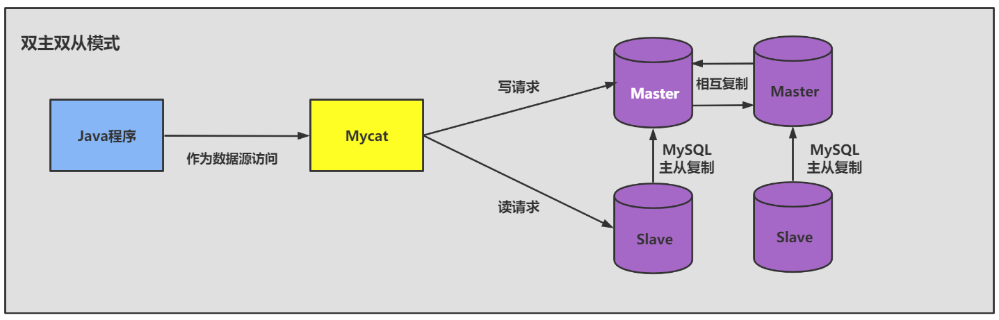

# 第12章-数据库其它调优策略

## 12.1 数据库调优的措施 

### 12.1.1 数据库调优的措施

- 尽可能节省系统资源，以便系统可以提供更大负荷的服务。（吞吐量更大）
- 合理的结构设计和参数调整，以提高用户操作响应的速度。（响应速度更快）
- 减少系统的瓶颈，提高MySQL数据库整体的性能。

### 12.1.2 如何定位调优问题

用户量增加，应用程序复杂度的提升，很难用更快调优数据库。

- 用户的反馈（主要）
- 日志分析（主要）：数据库日志和操作日志
- 服务器资源使用监控：CPU、内存、I/O使用情况等。
- 数据库内部状况监控：活动会话（Active Session）,可以查看是否处于繁忙状态，SQL是否有堆积。
- 其它：事务、锁等待监控

### 12.1.3 调优的维度和步骤

* 第1步：选择适合的 DBMS
  * 对事务处理及安全性要求高，选择商业数据库
* 第2步：优化表设计
  * 表结构尽量遵循三范式原则。
  * 查询多，多表关联是考虑反范式提高查询效率
  * 表字段数据类型选择，能用数字用数字，能段则短，固定长度用char，无法确定长度采用varchar
* 第3步：优化逻辑查询
  * 不同sql执行效率不一样，优化逻辑查询提升效果。
* 第4步：优化物理查询
  * 物理查询优化是在确定了逻辑查询优化之后，采用物理优化技术（比如索引等），通过计算代价模型对
    各种可能的访问路径进行估算，从而找到执行方式中代价最小的作为执行计划。在这个部分中，我们需
    要掌握的重点是对索引的创建和使用。
* 第5步：使用 Redis 或 Memcached 作为缓存
  * Redis 和 Memcached 都是将数据放在内存中
  * redis支持数据持久化
  * redis不仅支持key-value数据类型，还支持List,Set,Hash等数据结构。

* 第6步：库级优化

  * 分拆在提升数据库性能的同时，也会增加维护和使用成本。
  * 分拆在提升数据库性能的同时，也会增加维护和使用成本。

  * 读写分离

    

    

  * 数据分片：分库分表，可以做垂直分（分库）、水平拆分（分表）、垂直+水平拆分（分库分表）

    


## 12.2 优化MySQL服务器

优化MySQL服务器主要从两个方面优化，一个是硬件优化，一个是对服务器参数进行优化。还有可以对操作系统进行优化。

### 12.2.1 优化服务器硬件

服务器的硬件性能直接决定着MySQL数据库的性能。硬件的性能瓶颈直接决定MySQL数据库的运行速度
和效率。针对性能瓶颈提高硬件配置，可以提高MySQL数据库查询、更新的速度。

硬件优化可以：

- 配置较大的内存 ：减少磁盘I/O
- 配置高速磁盘系统 ：提升磁盘I/O性能
- 合理分布磁盘I/O：分散磁盘I/O，减少资源竞争，提高效率。
- 配置多处理器：多处理器可以多线程处理，提高处理能力。

### 12.2.2 优化MySQL的参数

* **innodb_buffer_pool_size** ：这个参数是Mysql数据库最重要的参数之一，表示InnoDB类型的表和索引的最大缓存。它不仅仅缓存索引数据，还会缓存表的数据。这个值越大，查询的速度就会越快。但是这个值太大会影响操作系统的性能。
* **key_buffer_size** ：表示索引缓冲区的大小。索引缓冲区是所有的线程共享。增加索引缓冲区可以得到更好处理的索引（对所有读和多重写）。当然，这个值不是越大越好，它的大小取决于内存的大小。如果这个值太大，就会导致操作系统频繁换页，也会降低系统性能。对于内存在4GB 左右的服务器该参数可设置为256M 或384M 。
* **table_cache** ：表示同时打开的表的个数。这个值越大，能够同时打开的表的个数越多。物理内存越大，设置就越大。默认为2402，调到512-1024最佳。这个值不是越大越好，因为同时打开的表太多会影响操作系统的性能。
* **query_cache_size** ：表示查询缓冲区的大小。可以通过在MySQL控制台观察，如果Qcache_lowmem_prunes的值非常大，则表明经常出现缓冲不够的情况，就要增加Query_cache_size的值；如果Qcache_hits的值非常大，则表明查询缓冲使用非常频繁，如果该值较小反而会影响效率，那么可以考虑不用查询缓存；Qcache_free_blocks，如果该值非常大，则表明缓冲区中碎片很多。MySQL8.0之后失效。该参数需要和query_cache_type配合使用。
* **query_cache_type** 的值是0时，所有的查询都不使用查询缓存区。但是query_cache_type=0并不
  会导致MySQL释放query_cache_size所配置的缓存区内存。
  * 当query_cache_type=1时，所有的查询都将使用查询缓存区，除非在查询语句中指定SQL_NO_CACHE ，如SELECT SQL_NO_CACHE * FROM tbl_name。
  * 当query_cache_type=2时，只有在查询语句中使用SQL_CACHE 关键字，查询才会使用查询缓存区。使用查询缓存区可以提高查询的速度，这种方式只适用于修改操作少且经常执行相同的查询操作的情况。

* **sort_buffer_size** ：表示每个需要进行排序的线程分配的缓冲区的大小。增加这个参数的值可以提高ORDER BY 或GROUP BY 操作的速度。默认数值是2 097 144字节（约2MB）。对于内存在4GB左右的服务器推荐设置为6-8M，如果有100个连接，那么实际分配的总共排序缓冲区大小为100 × 6＝ 600MB。

* **join_buffer_size = 8M** ：表示联合查询操作所能使用的缓冲区大小，和sort_buffer_size一样，该参数对应的分配内存也是每个连接独享。

* **read_buffer_size** ：表示每个线程连续扫描时为扫描的每个表分配的缓冲区的大小（字节） 。当线程从表中连续读取记录时需要用到这个缓冲区。SET SESSION read_buffer_size=n可以临时设置该参数的值。默认为64K，可以设置为4M。

* **innodb_flush_log_at_trx_commit** ：表示何时将缓冲区的数据写入日志文件，并且将日志文件写入磁盘中。该参数对于innoDB引擎非常重要。该参数有3个值，分别为0、1和2。该参数的默认值为1。

  * 值为0 时，表示每秒1次的频率将数据写入日志文件并将日志文件写入磁盘。每个事务的commit并不会触发前面的任何操作。该模式速度最快，但不太安全，mysqld进程的崩溃会导致上一秒钟所有事务数据的丢失。
  * 值为1 时，表示每次提交事务时将数据写入日志文件并将日志文件写入磁盘进行同步。该模式是最安全的，但也是最慢的一种方式。因为每次事务提交或事务外的指令都需要把日志写入（flush）硬盘。
  * 值为2 时，表示每次提交事务时将数据写入日志文件， 每隔1秒将日志文件写入磁盘。该模式速度较快，也比0安全，只有在操作系统崩溃或者系统断电的情况下，上一秒钟所有事务数据才可能丢失。

* **innodb_log_buffer_size** ：这是 InnoDB 存储引擎的事务日志所使用的缓冲区。为了提高性能，也是先将信息写入 Innodb Log Buffer 中，当满足 innodb_flush_log_trx_commit 参数所设置的相应条件（或者日志缓冲区写满）之后，才会将日志写到文件（或者同步到磁盘）中。

* **max_connections** ：表示允许连接到MySQL数据库的最大数量，默认值是 151 。如果状态变量connection_errors_max_connections 不为零，并且一直增长，则说明不断有连接请求因数据库连接数已达到允许最大值而失败，这是可以考虑增大max_connections 的值。在Linux 平台下，性能好的服务器，支持 500-1000 个连接不是难事，需要根据服务器性能进行评估设定。这个连接数不是越大越好，因为这些连接会浪费内存的资源。过多的连接可能会导致MySQL服务器僵死。

* **back_log** ：用于控制MySQL监听TCP端口时设置的积压请求栈大小。如果MySql的连接数达到max_connections时，新来的请求将会被存在堆栈中，以等待某一连接释放资源，该堆栈的数量即back_log，如果等待连接的数量超过back_log，将不被授予连接资源，将会报错。5.6.6 版本之前默认值为 50 ， 之后的版本默认为 50 + （max_connections / 5）， 对于Linux系统推荐设置为小于512的整数，但最大不超过900。
  如果需要数据库在较短的时间内处理大量连接请求， 可以考虑适当增大back_log 的值。

* **thread_cache_size** ： 线程池缓存线程数量的大小，当客户端断开连接后将当前线程缓存起来，当在接到新的连接请求时快速响应无需创建新的线程 。这尤其对那些使用短连接的应用程序来说可以极大的提高创建连接的效率。那么为了提高性能可以增大该参数的值。默认为60，可以设置为120。

  * 可以通过如下几个MySQL状态值来适当调整线程池的大小：

    ```sql
    mysql> show global status like 'Thread%';
    +-------------------+-------+
    | Variable_name | Value |
    +-------------------+-------+
    | Threads_cached | 2 |
    | Threads_connected | 1 |
    | Threads_created | 3 |
    | Threads_running | 2 |
    +-------------------+-------+
    4 rows in set (0.01 sec)
    ```

  * 当 Threads_cached 越来越少，但 Threads_connected 始终不降，且 Threads_created 持续升高，可
    适当增加 thread_cache_size 的大小。

* **wait_timeout** ：指定一个请求的最大连接时间，对于4GB左右内存的服务器可以设置为5-10。

* **interactive_timeout** ：表示服务器在关闭连接前等待行动的秒数。

* 这里给出一份my.cnf的参考配置

```
[mysqld]
port = 3306
serverid = 1
socket = /tmp/mysql.soc
skip-locking 
#避免MySQL的外部锁定，减少出错几率增强稳定性。 
skip-name-resolve 
#禁止MySQL对外部连接进行DNS解析，使用这一选项可以消除MySQL进行DNS解析的时间。但需要注意，如果开启该选项，则所有远程主机连接授权都要使用IP地址方式，否则MySQL将无法正常处理连接请求！ 
back_log = 384
key_buffer_size = 256M
max_allowed_packet = 4M
thread_stack = 256K
table_cache = 128K
sort_buffer_size = 6M
read_buffer_size = 4M
read_rnd_buffer_size=16M
join_buffer_size = 8M
myisam_sort_buffer_size =64M
table_cache = 512
thread_cache_size = 64
query_cache_size = 64M
tmp_table_size = 256M 
max_connections = 768 
max_connect_errors = 10000000
wait_timeout = 10
thread_concurrency = 8 
#该参数取值为服务器逻辑CPU数量*2，在本例中，服务器有2颗物理CPU，而每颗物理CPU又支持H.T超线程，所以实际取值为4*2=8 
skipnetworking
#开启该选项可以彻底关闭MySQL的TCP/IP连接方式，如果WEB服务器是以远程连接的方式访问MySQL数据库服务器则不要开启该选项！否则将无法正常连接！ 
table_cache=1024
innodb_additional_mem_pool_size=4M 
#默认为2M 
innodb_flush_log_at_trx_commit=1
innodb_log_buffer_size=2M 
#默认为1M 
innodb_thread_concurrency=8 
#你的服务器CPU有几个就设置为几。建议用默认一般为8 
tmp_table_size=64M 
#默认为16M，调到64-256最挂
thread_cache_size=120
query_cache_size=32M
```

## 12.3 优化数据库结构

* 拆分表：冷热数据分离
  * 把表拆成两张表，热数据放一张表，不常查询的冷数据放一张表。
  * 可以提高索引，以及缓存数量，提升查询效率。
* 增加中间表
* 增加冗余字段
* 优化数据类型
  * 对整数类型数据进行优化。遇到整数类型的字段可以用 INT 型。对于非负型的数据（如自增ID、整型IP）来说，要优先使用无符号整型UNSIGNED 来存储。因为无符号相对于有符号，同样的字节数，存储的数值范围更大。
  * 既可以使用文本类型也可以使用整数类型的字段，要选择使用整数类型。比如：ip
  * 避免使用TEXT、BLOB数据类型：如果要使用到，单独分离到一张表中
  * 避免使用ENUM类型：枚举的ORDER BY效率低，需要额外操作，使用TINYINT替换枚举类型
  * 使用TIMESTAMP存储时间：时间范围是1970-01-01 00:00:01到2023-01-19 03:14:07，TIMESTAMP是4个字节，DATETIME是8个字节。TIMESTAMP具有自动赋值和自动更新的特性
  * 用DECIMAL代替FLOAT和DOUBLE存储精确浮点数

* 优化插入记录的速度

  * myISAM引擎的表
    * 禁用索引
    * 禁用唯一性检查
    * 使用批量插入
    * 使用LOAD DATA INFILE 批量导入
  * InnoDB引擎的表
    * 禁用唯一性检查
    * 禁用外键检查
    * 禁止自动提交

* 使用非空约束

  * 在设计字段的时候，如果业务允许，建议尽量使用非空约束
  * 可以减少行格式存储空间，is not null可能无法使用索引。

* 分析表、检查表与优化表

  * MySQL中提供了ANALYZE TABLE语句分析表，ANALYZE TABLE语句的基本语法如下：

    ```sql
    ANALYZE [LOCAL | NO_WRITE_TO_BINLOG] TABLE tbl_name[,tbl_name]…
    ```

    * 默认的，MySQL服务会将 ANALYZE TABLE语句写到binlog中，以便在主从架构中，从服务能够同步数据。可以添加参数LOCAL 或者 NO_WRITE_TO_BINLOG取消将语句写到binlog中。

    * 使用ANALYZE TABLE 分析表的过程中，数据库系统会自动对表加一个只读锁。在分析期间，只能读取表中的记录，不能更新和插入记录。ANALYZE TABLE语句能够分析InnoDB和MyISAM类型的表，但是不能作用于视图。
    * ANALYZE TABLE分析后的统计结果会反应到cardinality 的值，该值统计了表中某一键所在的列不重复的值的个数。**该值越接近表中的总行数，则在表连接查询或者索引查询时，就越优先被优化器选择使用**。也就是索引列的cardinality的值与表中数据的总条数差距越大，即使查询的时候使用了该索引作为查询条件，存储引擎实际查询的时候使用的概率就越小。下面通过例子来验证下。cardinality可以通过SHOW INDEX FROM 表名查看。

  * 检查表

    * MySQL中可以使用CHECK TABLE 语句来检查表。CHECK TABLE语句能够检查InnoDB和MyISAM类型的表是否存在错误。CHECK TABLE语句在执行过程中也会给表加上只读锁。

    * 对于MyISAM类型的表，CHECK TABLE语句还会更新关键字统计数据。而且，CHECK TABLE也可以检查视图是否有错误，比如在视图定义中被引用的表已不存在。该语句的基本语法如下：

      ```sql
      CHECK TABLE tbl_name [, tbl_name] ... [option] ...
      option = {QUICK | FAST | MEDIUM | EXTENDED | CHANGED}
      ```

  * 优化表

    * MySQL中使用OPTIMIZE TABLE 语句来优化表。但是，OPTILMIZE TABLE语句只能优化表中的
      VARCHAR 、BLOB 或TEXT 类型的字段

    * 一个表使用了这些字段的数据类型，若已经删除了表的一大部分数据，或者已经对含有可变长度行的表（含有VARCHAR、BLOB或TEXT列的表）进行了很多更新，则应使用OPTIMIZE TABLE来重新利用未使用的空间，并整理数据文件的碎片

    * OPTIMIZE TABLE 语句对InnoDB和MyISAM类型的表都有效。该语句在执行过程中也会给表加上只读锁。但是提示信息可能不太一样。

      ```
      InnoDB存储引擎存储引擎会提示
      ‘numysql.SYS_APP_USER’, ‘optimize’, ‘note’, ‘Table does not support optimize, doing recreate +
      analyze instead’
      #实际已经优化，见官网
      https://dev.mysql.com/doc/refman/8.0/en/optimize-table.html
      ```

    * OPTILMIZE TABLE语句的基本语法如下：

      ```sql
      OPTIMIZE [LOCAL | NO_WRITE_TO_BINLOG] TABLE tbl_name [, tbl_name] ...
      ```

      ```sql
      #分析表
      ANALYZE TABLE user1;
      
      #检查表
      CHECK TABLE user1;
      
      #优化表
      OPTIMIZE TABLE t1;
      ```

## 12.4 大表优化

### 12.4.1 限定查询的范围

* 禁止不带任何限制数据范围条件的查询语句。

### 12.4.2 读/写分离

经典的数据库拆分方案，主库负责写，从库负责读。

一主一从模式：


双主双从模式：


### 12.4.3 垂直拆分（拆库）

当数据量级达到千万级以上时，有时候我们需要把一个数据库切成多份，放到不同的数据库服务器上，减少对单一数据库服务器的访问压力。


* 垂直拆分的优点： 可以使得列数据变小，在查询时减少读取的Block数，减少I/O次数。此外，垂直分区可以简化表的结构，易于维护。
* 垂直拆分的缺点： 主键会出现冗余，需要管理冗余列，并会引起 JOIN 操作。此外，垂直拆分会让事务变得更加复杂。

### 12.4.4 水平拆分（拆表）

* 但表数据量建议控制在1000万以内。
* 水平拆分最好分库


* 水平拆分可以支持大的数据存储，但是分片事务难以解决，跨节点Join性能较差，逻辑复杂。尽量选择客户端分片框架。

下面补充一下数据库分片的两种常见方案：

* 客户端代理： 分片逻辑在应用端，封装在jar包中，通过修改或者封装JDBC层来实现。 当当网的Sharding-JDBC 、阿里的TDDL是两种比较常用的实现。
* 中间件代理： 在应用和数据中间加了一个代理层。分片逻辑统一维护在中间件服务中。我们现在谈的 Mycat 、360的Atlas、网易的DDB等等都是这种架构的实现。

## 12.5 其它调优策略

### 12.5.1 服务器语句超时处理

* 在MySQL 8.0中可以设置服务器语句超时的限制，单位可以达到毫秒级别。当中断的执行语句超过设置的毫秒数后，服务器将终止查询影响不大的事务或连接，然后将错误报给客户端。
* 设置服务器语句超时的限制，可以通过设置系统变量MAX_EXECUTION_TIME 来实现。默认情况下，MAX_EXECUTION_TIME的值为0，代表没有时间限制。 例如：

```sql
SET GLOBAL MAX_EXECUTION_TIME=2000;
SET SESSION MAX_EXECUTION_TIME=2000; #指定该会话中SELECT语句的超时时间
```

### 12.5.2 创建全局通用表空间

* MySQL8.0使用CREATE TABLESPACE来创建一个全局通用表空间。可以被所有的数据库的表共享。
* 通过使用手动创建共享表空间可以节约元数据方面的你次次。创建表时，可以指定属于哪个表空间，可以修改表的表空间。

```sql
#创建atguigu1名的共享表空间
CREATE TABLESPACE atguigu1 ADD DATAFILE 'atguigu1.ibd' file_block_size=16k;

#指定表空间
CREATE TABLE test(id INT,NAME VARCHAR(10)) ENGINE=INNODB DEFAULT CHARSET utf8mb4 TABLESPACE atguigu1;
#修改表的表空间
ALTER TABLE test TABLESPACE atguigu1;
#删除表，去掉掉表空间与表的依赖关系
DROP TABLE test;
#删除表空间
DROP TABLESPACE atguigu1;
```

### 12.5.3 MySQL 8.0新特性：隐藏索引对调优的帮助

* 索引被隐藏时，不能被优化器使用到，但是会影响插入、更新和删除的性能。
* 没有的索引就删除掉，不要设置成invisible
* 主键不能被设置为invisible