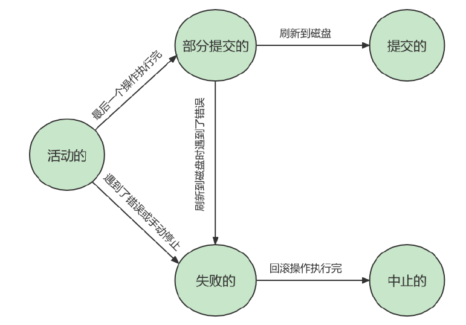
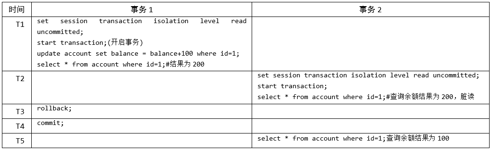
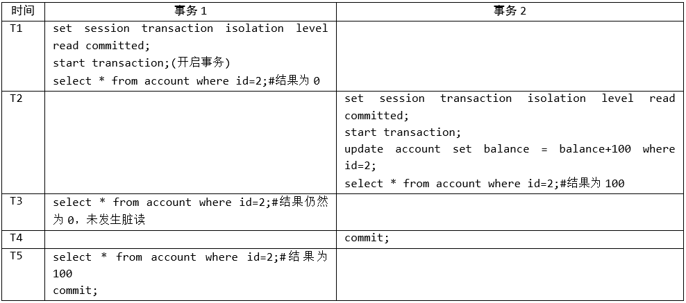
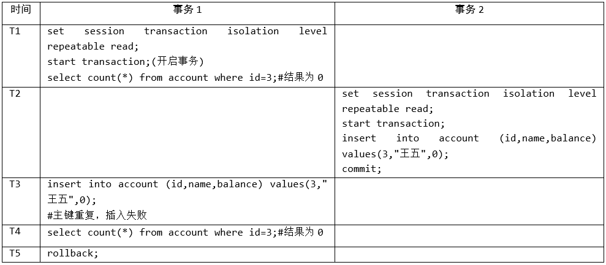

# 第13章-事务基础知识

## 13.1 数据库事务概述

事务时数据库区别于文件系统重要特征之一，有了事务会让数据库始终保持一致性，同时还能通过事务机制恢复到某个时间点，保障已提交的修改不会因为数据库崩溃而丢失。

### 13.1.1 存储引擎支持情况

SHOW ENGINES 命令来查看当前 MySQL 支持的存储引擎都有哪些，只有InnoDB 是支持事务的。

### 13.1.2 基本概念

* 事务：一组逻辑操作单元，使数据从一种状态变换到另一种状态。
* 事务处理的原则：保证所有事务都作为一个工作单元来执行，即使出现了故障，都不能改变这种执行方式。当在一个事务中执行多个操作时，要么所有的事务都被提交( commit )，那么这些修改就永久地保存下来；要么数据库管理系统将放弃所作的所有修改，整个事务回滚( rollback )到最初状态。

### 13.1.3 事务的ACID特性

* 原子性（atomicity）
  * 原子性是指事务是一个不可分割的工作单位，要么全部提交，要么全部失败回滚。
* 一致性（consistency）
  * 国内很多网站上对一致性的阐述有误，具体你可以参考 Wikipedia 对Consistency 的阐述
  * 数据从一个合法性状态变换到另外一个合法性状态
* 隔离型（isolation）
  * 事务的隔离性是指一个事务的执行不能被其他事务干扰，即一个事务内部的操作及使用的数据对并发的其他事务是隔离的，并发执行的各个事务之间不能互相干扰。
* 持久性（durability）
  * 持久性是指一个事务一旦被提交，它对数据库中数据的改变就是永久性的，接下来的其他操作和数据库故障不应该对其有任何影响。
  * 持久性是通过事务日志来保证的。日志包括了重做日志和回滚日志。当我们通过事务对数据进行修改的时候，首先会将数据库的变化信息记录到重做日志中，然后再对数据库中对应的行进行修改。这样做的好处是，即使数据库系统崩溃，数据库重启后也能找到没有更新到数据库系统中的重做日志，重新执行，从而使事务具有持久性。

### 13.1.4 事务的状态

事务的最终结局只有提交或终止的状态。

* 活动的（active）
  * 事务对应的数据库操作正在执行过程中时，我们就说该事务处在活动的状态。
* 部分提交的（partially committed）
  * 当事务中的最后一个操作执行完成，但由于操作都在内存中执行，所造成的影响并没有刷新到磁盘时，我们就说该事务处在部分提交的状态。
* 失败的（failed）
  * 当事务处在活动的或者部分提交的状态时，可能遇到了某些错误（数据库自身的错误、操作系统错误或者直接断电等）而无法继续执行，或者人为的停止当前事务的执行，我们就说该事务处在失败的状态。
* 中止的（aborted）
  * 如果事务执行了一部分而变为失败的状态，那么就需要把已经修改的事务中的操作还原到事务执行前的状态。换句话说，就是要撤销失败事务对当前数据库造成的影响。我们把这个撤销的过程称之为回滚。当回滚操作执行完毕时，也就是数据库恢复到了执行事务之前的状态，我们就说该事务处在了中止的状态。

* 提交的（committed）
  * 当一个处在部分提交的状态的事务将修改过的数据都同步到磁盘上之后，我们就可以说该事务处在了提交的状态。



总结：原子性是基础，一致性是约束条件，隔离性是手段，持久性是目的。

## 13.2 如何使用事务

* 使用事务有两种方式，分别为显式事务和隐式事务

### 13.2.1 显式事务

#### 13.2.1.1 如何开启显式事务？ 

* 使用关键字：start transaction  或 begin

* start transaction 后面可以跟：read only / read write (默认) / with consistent snapshot 
  * READ ONLY ：标识当前事务是一个只读事务，也就是属于该事务的数据库操作只能读取数据，而不能修改数据。只是对其他事务的表只读，临时表只有当前会话有效，所以只读事务，可以对临时表进行增删改。
  * READ WRITE ：标识当前事务是一个读写事务，也就是属于该事务的数据库操作既可以读取数据，也可以修改数据。
  * WITH CONSISTENT SNAPSHOT ：启动一致性读。

#### 13.2.1.2 结束事务

* Oracle默认不自动提交，需要手写commit命令，MySQL默认是自动提交。

```shell
#提交事务。当提交事务后，对数据库的修改是永久性的。主要是DML，不含DDL
mysql> COMMIT;
```

```shell
# 回滚事务。即撤销正在进行的所有没有提交的修改
mysql> ROLLBACK;
# 将事务回滚到某个保存点。
mysql> ROLLBACK TO [SAVEPOINT]
```

```shell
# 在事务中创建保存点，以便事务可以回退到保存点，一个事务可以有U盾讴歌保存点
SAVEPOINT 保存点名字；
#删除某个保存点
RELEASE SAVEPOINT 保存点名字；
```

#### 13.2.1.3 举例

简单提交回滚

```sql
CREATE TABLE user(name varchar(20), PRIMARY KEY (name)) ENGINE=InnoDB;
BEGIN;
INSERT INTO user SELECT '张三';
COMMIT;
BEGIN;
INSERT INTO user SELECT '李四';
INSERT INTO user SELECT '李四';
ROLLBACK;
SELECT * FROM user;#只有张三的数据
```

保存点使用（savepoint）

```sql
#举例3：体会savepoint

CREATE TABLE user3(NAME VARCHAR(15),balance DECIMAL(10,2));

BEGIN
INSERT INTO user3(NAME,balance) VALUES('张三',1000);
COMMIT;

SELECT * FROM user3;


BEGIN;
UPDATE user3 SET balance = balance - 100 WHERE NAME = '张三';

UPDATE user3 SET balance = balance - 100 WHERE NAME = '张三';

SAVEPOINT s1;#设置保存点

UPDATE user3 SET balance = balance + 1 WHERE NAME = '张三';

ROLLBACK TO s1; #回滚到保存点,数据会到保存点位置的数据，但是事务还未提交，需要之久化数据，也必须要使用commit。不要提交就只使用ROLLBACK即可。
```

### 13.2.2 隐式事务

#### 13.2.2.1 自动提交

* MySQL中有一个系统变量autocommit，自动提交事务，默认是开启。这个叫隐式事务。
* 当我们设置 autocommit=0 时，不论是否采用 START TRANSACTION 或者 BEGIN 的方式来开启事务，都需要用 COMMIT 进行提交，让事务生效，使用 ROLLBACK 对事务进行回滚。
* 当我们设置 autocommit=1 时，每条 SQL 语句都会自动进行提交。 不过这时，如果你采用 START
  TRANSACTION 或者 BEGIN 的方式来显式地开启事务，那么这个事务只有在 COMMIT 时才会生效，
  在 ROLLBACK 时才会回滚。

```sql
mysql> SHOW VARIABLES LIKE 'autocommit';
+---------------+-------+
| Variable_name | Value |
+---------------+-------+
| autocommit | ON |
+---------------+-------+
1 row in set (0.01 sec)
```

#### 12.2.2.2 关闭自动提交

* 关闭自动提交有两个方法

  * 显式的的使用START TRANSACTION 或者BEGIN 语句开启一个事务。

  * 把系统变量autocommit 的值设置为OFF

    ```sql
    SET autocommit = OFF;
    #或
    SET autocommit = 0;
    ```

#### 12.2.2.3 隐式提交数据的情况

* 数据定义语言（Data definition language，缩写为：DDL）
  * 数据库对象指的是数据库、表、视图、存储过程等结构，我们使用CRATE、ALTER、DROP语句修改这些对象时，就会隐式提交事务。
* 隐式使用或修改mysql数据库中的表
  * 使用ALTER USER、CRATE USER、DROP USER、GRANT、RENAME USER、REVOKE、SET PASSWORD等，也会隐式提交事务。
* 事务控制或关于锁定的语句
  * 当我们在一个事务还没提交或者回滚时就又使用START TRANSACTION 或者BEGIN 语句开启了另一个事务时，会隐式的提交上一个事务。
  * 当前的autocommit 系统变量的值为OFF ，我们手动把它调为ON 时，也会隐式的提交前边语句所属的事务。
  * 使用LOCK TABLES 、UNLOCK TABLES 等关于锁定的语句也会隐式的提交前边语句所属的事务。

* 加载数据的语句
  * 使用LOAD DATA语句来批量往数据库中导入数据时，也会隐式的提交前边语句所属的事务。
* 关于MySQL复制的一些语句
  * 使用START SLAVE、STOP SLAVE、RESET SLAVE、CHANGE MASTER TO等语句时会隐式的提交前边语句所属的事务。

* 其他的一些语句
  * 使用ANALYZE TABLE、CACHE INDEX、CHECK TABLE、FLUSH、LOAD INDEX INTO CACHE、OPTIMIZE TABLE、REPAIR TABLE、RESET等语句也会隐式的提交前边语句所属的事务。

#### 12.2.2.4 链式事务

* completion_type
  * 等于0时，默认情况。COMMIT会提交事务，下一个事务，还需要使用START TRANSCATION或者BEGIN来开启。
  * 等于1时。COMMIT提交事务，相当于执行了COMMIT AND CHAIN，开启一个链式事务，提交后会自动开启下一个事务，不用使用START TRANSCATION或者BEGIN来开启。
  * 等于2时。COMMIT提交事务，相当于COMMIT AND RELEASE，提交后，会自动与服务器断开连接。
* 链式事务设置

```sql
SET @@completion_type = 1;

#举例
CREATE TABLE user(name varchar(255), PRIMARY KEY (name)) ENGINE=InnoDB;
SET @@completion_type = 1;
BEGIN;
INSERT INTO user SELECT '张三';
COMMIT;
INSERT INTO user SELECT '李四';
INSERT INTO user SELECT '李四';
ROLLBACK;

mysql> SELECT * FROM user;
+--------+
| name |
+--------+
| 张三 |
+--------+
1 行于数据集 (0.01 秒)
```

## 12.3 事务的常见分类

从事务理论的角度来看，可以把事务分为以下几种类型：

- 扁平事务（Flat Transactions）
  - 最简单的一种，使用最频繁，所有操作处于同一层，从BEGIN开始，COMMIT或ROLLBACK结束。操作都是原子性的，要么都执行要么都回滚。
- 带有保存点的扁平事务（Flat Transactions with Savepoints）
  - 扁平事务基础上多了保存点，可以回滚到保存点后重新操作，结束再用COMMINT或ROLLBACK。
- 链事务（Chained Transactions）
  - 一个事务由多个子事务链式组成，不需要使用BEGIN开始语句，只要使用COMMIT或ROLLBAKC后就自动开启下一个事务了。
- 嵌套事务（Nested Transactions）
  - 一个层次结构框架，由一个顶层事务控制各个层次的事务，顶层事务下嵌套的事务被称为子事务。
- 分布式事务（Distributed Transactions）
  - 分布式环境下运行的扁平事务，称为分布式事务。

## 12.4  事务隔离级别

MySQL是一个客户端／服务器架构的软件，对于同一个服务器来说，可以有若干个客户端与之连接，每个客户端与服务器连接上之后，就可以称为一个会话（ Session ）。每个客户端都可以在自己的会话中向服务器发出请求语句，一个请求语句可能是某个事务的一部分，也就是对于服务器来说可能同时处理多个事务。事务有隔离性的特性，理论上在某个事务对某个数据进行访问时，其他事务应该进行排队，当该事务提交之后，其他事务才可以继续访问这个数据。但是这样对性能影响太大，我们既想保持事务的隔离性，又想让服务器在处理访问同一数据的多个事务时性能尽量高些，那就看二者如何权衡取舍了。

### 12.4.1 数据准备

```sql
CREATE TABLE student (
studentno INT,
name VARCHAR(20),
class varchar(20),
PRIMARY KEY (studentno)
) Engine=InnoDB CHARSET=utf8;

INSERT INTO student VALUES(1, '小谷', '1班');

mysql> select * from student;
+-----------+--------+-------+
| studentno | name | class |
+-----------+--------+-------+
| 1 | 小谷 | 1班 |
+-----------+--------+-------+
1 row in set (0.00 sec)
```

### 12.4.2 数据并发问题

* 脏写（ Dirty Write ）

  * 对于两个事务 Session A、Session B，如果事务Session A 修改了另一个未提交事务Session B 修改过的数据，那就意味着发生了脏写

    

* 脏读（ Dirty Read ）

  * 对于两个事务 Session A、Session B，Session A 读取了已经被 Session B 更新但还没有被提交的字段。之后若 Session B 回滚，Session A 读取的内容就是临时且无效的。

    

* 不可重复读（ Non-Repeatable Read ）

  * 对于两个事务Session A、Session B，Session A 读取了一个字段，然后 Session B （提交）更新了该字段。 之后Session A 再次读取同一个字段， 值就不同了。那就意味着发生了不可重复读。

    

* 幻读（ Phantom ）

  * 对于两个事务Session A、Session B, Session A 从一个表中读取了一个字段, 然后 Session B 在该表中插入了一些新的行。 之后, 如果 Session A 再次读取同一个表, 就会多出几行。那就意味着发生了幻读。

  * 强调是多了数据才算幻读，如果是少了数据可以理解为不可重复读。
  
  * mysql中幻读无法呈现，能通过insert方式看出存在幻读情况。
  
  * 幻读产生是因为当前事务读取了一个范围的记录，然后另外的事务向该范围内插入了新记录，当前事务再去查询时发现了新插入的记录。
  
    

### 12.4.3 SQL中的四种隔离级别

按照并发发生问题严重性来排序：脏写 > 脏读 > 不可重复读 > 幻读

* SQL标准中设立了4个隔离级别
  * READ UNCOMMITTED ：读未提交，在该隔离级别，所有事务都可以看到其他未提交事务的执行结果。不能避免脏读、不可重复读、幻读。
  * READ COMMITTED ：读已提交，它满足了隔离的简单定义：一个事务只能看见已经提交事务所做的改变。这是大多数数据库系统的默认隔离级别（但不是MySQL默认的）。可以避免脏读，但不可重复读、幻读问题仍然存在。
  * REPEATABLE READ ：可重复读，事务A在读到一条数据之后，此时事务B对该数据进行了修改并提交，那么事务A再读该数据，读到的还是原来的内容。可以避免脏读、不可重复读，但幻读问题仍然存在。这是MySQL的默认隔离级别。
  * SERIALIZABLE ：可串行化，确保事务可以从一个表中读取相同的行。在这个事务持续期间，禁止其他事务对该表执行插入、更新和删除操作。所有的并发问题都可以避免，但性能十分低下。能避免脏读、不可重复读和幻读。
  * 因为脏写这个问题太严重了，不论是哪种隔离级别，都不允许脏写的情况发生。

### 12.4.4 MySQL支持的四种隔离级别

* 查看MySQL隔离级别，默认为REPEATABLE-READ课重复读。
* Oracle默认为READ COMMITTED ：读已提交，

```sql
# 查看隔离级别，MySQL 5.7.20的版本之前：
mysql> SHOW VARIABLES LIKE 'tx_isolation';
+---------------+-----------------+
| Variable_name | Value |
+---------------+-----------------+
| tx_isolation | REPEATABLE-READ |
+---------------+-----------------+
1 row in set (0.00 sec)

# MySQL 5.7.20版本之后，引入transaction_isolation来替换tx_isolation
# 查看隔离级别，MySQL 5.7.20的版本及之后：
mysql> SHOW VARIABLES LIKE 'transaction_isolation';
+-----------------------+-----------------+
| Variable_name | Value |
+-----------------------+-----------------+
| transaction_isolation | REPEATABLE-READ |
+-----------------------+-----------------+
1 row in set (0.02 sec)
#或者不同MySQL版本中都可以使用的：
SELECT @@transaction_isolation;
```

### 12.4.5 设置事务的隔离级别

* 通过下面的语句修改事务的隔离级别：

```sql
SET [GLOBAL|SESSION] TRANSACTION ISOLATION LEVEL 隔离级别;
#其中，隔离级别格式：
> READ UNCOMMITTED
> READ COMMITTED
> REPEATABLE READ
> SERIALIZABLE

或
SET [GLOBAL|SESSION] TRANSACTION_ISOLATION = '隔离级别'
#其中，隔离级别格式：
> READ-UNCOMMITTED
> READ-COMMITTED
> REPEATABLE-READ
> SERIALIZABLE
```

* 关于设置时使用GLOBAL或SESSION的影响
  * 使用GLOBAL 关键字（在全局范围影响）：

    ```sql
    SET GLOBAL TRANSACTION ISOLATION LEVEL SERIALIZABLE;
    #或
    SET GLOBAL TRANSACTION_ISOLATION = 'SERIALIZABLE';
    ```

  * 当前已经存在的会话无效，只对执行完该语句之后产生的会话起作用

  * 使用SESSION 关键字（在会话范围影响）：

  ```sql
  SET SESSION TRANSACTION ISOLATION LEVEL SERIALIZABLE;
  #或
  SET SESSION TRANSACTION_ISOLATION = 'SERIALIZABLE';
  ```

  * 对当前会话的所有后续的事务有效
  * 如果在事务之间执行，则对后续的事务有效
  * 该语句可以在已经开启的事务中间执行，但不会影响当前正在执行的事务小

* 数据库规定了多种事务隔离级别，不同隔离级别对应不同的干扰程度，隔离级别越高，数据一致性就越好，但并发性越弱。