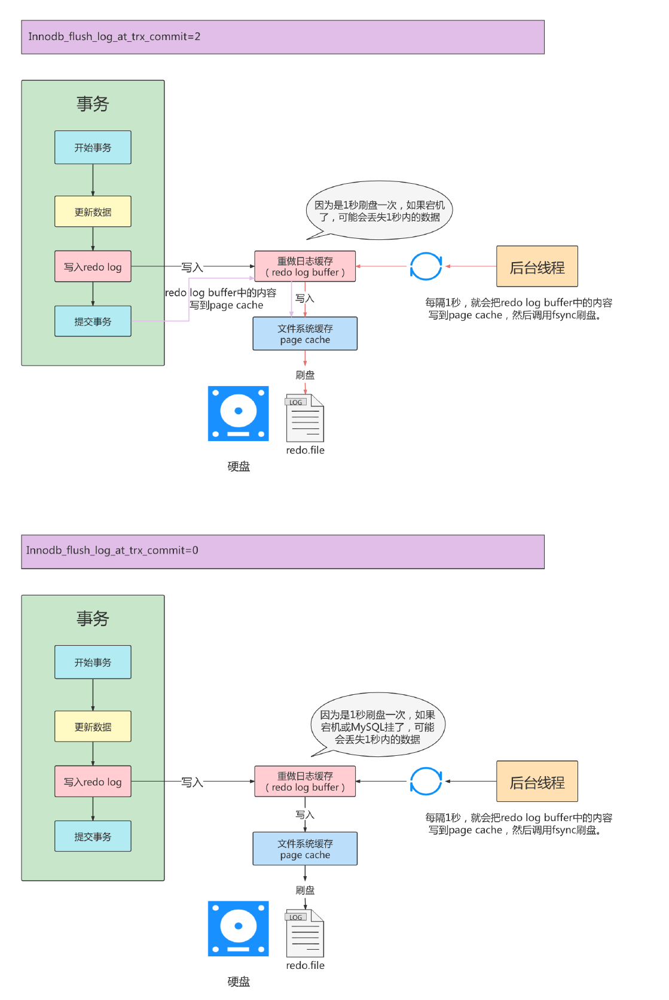

#  第14章-MySQL事务日志

事务有4种特性：原子性、一致性、隔离性和持久性。那么事务的四种特性到底是基于什么机制实现呢？

* 事务的隔离性由锁机制实现。
* 而事务的原子性、一致性和持久性由事务的 redo 日志和undo 日志来保证。
  * REDO LOG 称为重做日志，提供再写入操作，恢复提交事务修改的页操作，用来保证事务的持久性。
  * UNDO LOG 称为回滚日志，回滚行记录到某个特定版本，用来保证事务的原子性、一致性。
* 或许会认为 UNDO 是 REDO 的逆过程，其实不然。
  * REDO LOG ：存储引擎层InnoDB生成的日志，记录的是物理级别上的页修改操作，保障数据的可靠性。
  * UNDO LOG：存储引擎层InnoDB生成的日志，记录的是逻辑操作日志，比如对某一行数据进行了INSERT语句操作，UNDO LOG会记录一条与之相反的DELETE操作。主要用于事务的回滚（记录的每个修改操作的逆过程）和一致性非锁定读（回滚行记录到某种特定版的版本-MVCC，即多版本并发控制）。

### 14.1 redo日志

InnoDB存储引擎以页为单位，访问页之前，需要页从磁盘缓存到内存种的Buffer Pool才可以访问。所有变更必须更新缓冲池种的数据，然后再以一定的频率别刷入磁盘（checkPoint机制），保障整体的性能。

### 14.1.1 为什么需要REDO日志

* 一方面，缓冲池可以帮助我们消除CPU和磁盘之间的鸿沟，checkpoint机制可以保证数据的最终落盘，然而由于checkpoint 并不是每次变更的时候就触发的，而是master线程隔一段时间去处理的。所以最坏的情况就是事务提交后，刚写完缓冲池，数据库宕机了，那么这段数据就是丢失的，无法恢复。
* 另一方面，事务包含持久性的特性，就是说对于一个已经提交的事务，在事务提交后即使系统发生了崩溃，这个事务对数据库中所做的更改也不能丢失。
* InnoDB引擎采用了WAL技术（Write-Ahead Loggin），先些日志，再些磁盘，只有日志写入成功，才算事务提交，这里的日志就是redo log。当发生宕机且数据未刷到磁盘的时候，可以通过redo log来恢复，保障数据的持久性。

### 14.1.2 REDO日志的好处、特点

* 好处
  redo日志降低了刷盘频率
  redo日志占用的空间非常小

* 特点
  redo日志是顺序写入磁盘的
  事务执行过程中，redo log不断记录

### 14.1.3 redo的组成

Redo log可以简单分为以下两个部分：

* 重做日志的缓冲 (redo log buffer) ，保存在内存中，是易失的。在服务器重启时，想操作系统申请了一大片redo_log_buffer的连续内存空间，里面分成若干个连续的redo_log_block。一个redo_log_block 512字节大小，因为磁盘的扇时512字节，


参数设置：innodb_log_buffer_size：
redo log buffer 大小，默认16M ，最大值是4096M，最小值为1M。

```sql
mysql> show variables like '%innodb_log_buffer_size%';
+------------------------+----------+
| Variable_name | Value |
+------------------------+----------+
| innodb_log_buffer_size | 16777216 |
+------------------------+----------+
```

* 重做日志文件 (redo log file) ，保存在硬盘中，是持久的。
  * REDO日志文件如图，ib_logfile0和ib_logfile1即为REDO日志
  * 在/var/lib/mysql下


### 14.1.4 redo的整体流程

以一个更新事务为例，redo log 流转过程，如下图所示：


```
第1步：先将原始数据从磁盘中读入内存中来，修改数据的内存拷贝
第2步：生成一条重做日志并写入redo log buffer，记录的是数据被修改后的值
第3步：当事务commit时，将redo log buffer中的内容刷新到 redo log file，对 redo log file采用追加
写的方式
第4步：定期将内存中修改的数据刷新到磁盘中
```

### 14.1.5 redo log的刷盘策略

redo log的写入并不是直接写入磁盘的，InnoDB引擎会在写redo log的时候先写redo log buffer，之后以一
定的频率刷入到真正的redo log file 中。这就设计redo log的刷盘策略


* redo log buffer刷盘到redo log file的过程并不是真正的刷到磁盘中去，只是刷入到文件系统缓存（page cache）中去（这是现代操作系统为了提高文件写入效率做的一个优化），真正的写入会交给系统自己来决定（比如page cache足够大了）。那么对于InnoDB来说就存在一个问题，如果交给系统来同步，同样如果系统宕机，那么数据也丢失了（虽然整个系统宕机的概率还是比较小的）。

* 针对这种情况，InnoDB给出innodb_flush_log_at_trx_commit 参数，该参数控制 commit提交事务时，如何将 redo log buffer 中的日志刷新到 redo log file 中。它支持三种策略：

  * 设置为0 ：表示每次事务提交时不进行刷盘操作。（InnoDB存储引擎后台线程，系统默认master thread每隔1s进行一次，把redo log buffer的内容写到page cache种，然后调用刷盘操作）
  * 设置为1 ：表示每次事务提交时都将进行同步，刷盘操作（ 默认值）
  * 设置为2 ：表示每次事务提交时都只把 redo log buffer 内容写入 page cache，不进行同步。由os自己决定什么时候同步到磁盘文件。

  ```sql
  
  mysql> show variables like '%innodb_flush_log_at_trx_commit%';
  +--------------------------------+-------+
  | Variable_name                  | Value |
  +--------------------------------+-------+
  | innodb_flush_log_at_trx_commit | 1     |
  +--------------------------------+-------+
  1 row in set (0.40 sec)
  
  ```

  * sql优化时有设置innodb_flush_log_at_trx_commit，不同设置commit性能不一样。比如循环写入10万条数据，每条数据都开启事务提交。当为1是效率最差，但是可以保障数据完整性，为0性能最佳，2比0性能差一点。

### 14.1.6 不同刷盘策略演示




### 14.1.7 写入redo log buffer 过程

#### 14.1.7.1 补充概念：Mini-Transaction

* Mysql把对底层页面种的一次原子访问的过程称为一个Mini-Transaction,简称mtr。比如向B+树种插入一条记录就是一个mtr。一个mtr可以包含一组redo日志。这一组redo日志是不可分割的整体。

* 一个事务可以包含若干条语句，每一条语句其实是由若干个mtr 组成，每一个mtr 又可以包含若干条
  redo日志，画个图表示它们的关系就是这样：


#### 14.1.7.2 redo 日志写入log buffer

* 向log buffer种写入redo日志的过程是顺序的，写入log buffer时往哪个位置偏移量写，InnoDB提供了buf_free全局变量，表示写入log buffer的哪个位置。
* block中头尾不写数据，旨在log block body中写，写满了往下一个写。


* 每个mtr都会产生一组redo日志，用示意图来描述一下这些mtr产生的日志情况：
* 不同的事务可能有多个mtr，每个事务的mtr可以不是连续存储的，可能交替存储。只有事务中的一个mtr的redo log是连续的存储的。


#### 14.1.7.3 redo log block的结构图

* 一个redo log block有日志头、日志体、日志尾组成，总的512字节。日志头占用12字节，日志尾占用8字节。所以block真正能存储的是492字节。
* 为什么要设计成512字节，因为机械磁盘默认扇区是512，如果大于512，写入的扇区不止一个，磁盘就需要转动找下一个扇区。如果写入两个扇区，A成功，B失败，就会出现非原子性的写入。


### 14.1.8 redo log file

#### 14.1.8.1 参数设置

* innodb_log_group_home_dir ：指定 redo log 文件组所在的路径，默认值为./ ，表示在数据库的数据目录下。MySQL的默认数据目录（ var/lib/mysql ）下默认有两个名为ib_logfile0 和ib_logfile1 的文件，log  buffer中的日志默认情况下就是刷新到这两个磁盘文件中。此redo日志文件位置还可以修改。
* innodb_log_files_in_group：指明redo log file的个数，命名方式如：ib_logfile0，iblogfile1...iblogfilen。默认2个，最大100个。

```sql
mysql> show variables like 'innodb_log_files_in_group';
+---------------------------+-------+
| Variable_name | Value |
+---------------------------+-------+
| innodb_log_files_in_group | 2 |
+---------------------------+-------+
#ib_logfile0
#ib_logfile1
```

* innodb_flush_log_at_trx_commit：控制 redo log 刷新到磁盘的策略，默认为1。
* innodb_log_file_size：单个 redo log 文件设置大小，默认值为 48M 。最大值为512G，注意最大值指的是整个 redo log 系列文件之和，即（innodb_log_files_in_group * innodb_log_file_size ）不能大于最大值512G。

```sql
mysql> show variables like 'innodb_log_file_size';
+----------------------+----------+
| Variable_name | Value |
+----------------------+----------+
| innodb_log_file_size | 50331648 |
+----------------------+----------+
```

* 根据业务修改其大小，以便容纳较大的事务。编辑my.cnf文件并重启数据库生效，如下所示

```sql
[root@localhost ~]# vim /etc/my.cnf
innodb_log_file_size=200M
```

* 在数据库实例更新比较频繁的情况下，可以适当夹带redo log组数和大小，但是不推荐redo log 设置过大。在MYSQL崩溃恢复时会重新执行redo日志中的记录

#### 14.1.8.2 日志文件组

* redo日志文件不止一个，时日志文件组出现的，以ib_logfile[数字递增]命令的，大小都一样。初始化里面虽然没有数据时也有大小，是默认的日志文件大小。
* redo写日志从ib_logfile0开始，写慢往下一个写。


* 总共的redo日志文件大小其实就是： innodb_log_file_size × innodb_log_files_in_group
* 采用循环使用的方式向redo日志文件组里写数据的话，会导致后写入的redo日志覆盖掉前边写的redo日志？当然！所以InnoDB的设计者提出了checkpoint的概念。

#### 14.1.8.3 checkpoint

* 日志文件组中两个重要属性，write pos、checkpoint
  * write pos 当前记录的位置，一边写一边后移
  * checkpoint 当前要擦除的位置，也是往后推移。


* 如果 write pos 追上 checkpoint ，表示日志文件组满了，这时候不能再写入新的 redo log记录，MySQL 得停下来，清空一些记录，把 checkpoint 推进一下。


## 14.2  Undo日志

redo log是事务持久性的保证，undo log是事务原子性的保证。在事务中更新数据的前置操作其实是要先写入一个undo log ，查询不会写入undo log。

### 14.2.1 如何理解Undo日志

* 事务需要保证原子性，也就是事务中的操作要么全部完成，要么什么也不做。但有时候事务执行到一半会出现一些情况，比如：
  * 情况一：事务执行过程中可能遇到各种错误，比如服务器本身的错误， 操作系统错误，甚至是突然断电导致的错误。
  * 情况二：程序员可以在事务执行过程中手动输入ROLLBACK 语句结束当前事务的执行。以上情况出现，我们需要把数据改回原先的样子，这个过程称之为回滚，这样就可以造成一个假象：这个事务看起来什么都没做，所以符合原子性要求。
* 出现上面情况，需要把数据改回原来的样子，就成为回滚。
* 我们对记录进行增、删、改时，为了能回滚，把所需的东西记录下来，比如：
  * 插入数据时，回滚记录把主键记录下来，回滚时删除即可。
  * 删除数据时，把这条记录就下来，回滚是插入数据即可。
  * 修改时，把修改之前的旧值记录下来，回滚时更新为旧值即可。
* MySQL把这些为了回滚而记录的内容称为撤销日志或者回滚日志，即undo log。
* undo log也会产生redo log，因为undo log也需要持久性的保护。

### 14.2.2 Undo日志的作用

* 作用1：回滚数据
  * undo不是将数据库物理的恢复到执行语句或事务之前的样子，只是逻辑上恢复到原来的样子。比如插入一条数据，新开辟了一个数据页，回滚时只是将数据删除了，数据页还在，不会删除。
* 作用2：MVCC
  * MVCC多版本并发控制，InnoDB存储引擎中MVCC实现通过undo来完成。当用户读取一行记录时，若该记录被其他事务占用，当前事务可以通过undo读取之前的行版本信息，以此实现非锁定读取。

### 14.2.3 undo的存储结构

#### 14.2.3.1 回滚段与undo页

InnoDB对undo log的管理采用段的方式，也就是回滚段（rollback segment） 。每个回滚段记录了1024 个undo log segment ，而在每个undo log segment段中进行undo页的申请。

* 在InnoDB1.1版本之前（不包括1.1版本），只有一个rollback segment，因此支持同时在线的事务限制为1024 。虽然对绝大多数的应用来说都已经够用。
* 从1.1版本开始InnoDB支持最大128个rollback segment ，故其支持同时在线的事务限制提高到
  了128*1024 。

```sql
mysql> show variables like 'innodb_undo_logs';
+------------------+-------+
| Variable_name | Value |
+------------------+-------+
| innodb_undo_logs | 128 |
+------------------+-------+
```

虽然InnoDB1.1版本开始InnoDB支持最大128个rollback segment ，但是这些回滚段都存储与共享表空间ibdata中。从InnoDB1.2开始，可以通过参数对rollback segment 做进一步设置。

* innodb_undo_directory：设置rollback segment 文件坐在路径。
* innodb_undo_logs：设置rollback segment 的个数，默认为128。InnoDB1.2版本中，使用innodb_rollback_segment
* innodb_undo_tablespaces：设置构成rollback segment 的文件数量。这样rollback segment可以较为平均的分布在多个文件中。设置该参数后，会在路径innodb_undo_directory看到undo为前缀的文件。

```sql
mysql> show variables like '%undo%';
+--------------------------+------------+
| Variable_name            | Value      |
+--------------------------+------------+
| innodb_max_undo_log_size | 1073741824 |
| innodb_undo_directory    | ./         |
| innodb_undo_log_encrypt  | OFF        |
| innodb_undo_log_truncate | ON         |
| innodb_undo_tablespaces  | 2          |
+--------------------------+------------+
5 rows in set (0.00 sec)

mysql> show variables like '%innodb_rollback_segment%';
+--------------------------+-------+
| Variable_name            | Value |
+--------------------------+-------+
| innodb_rollback_segments | 128   |
+--------------------------+-------+
1 row in set (0.01 sec)
```


* undo页的重用
* 当开启一个事务需要些undo log时，先去undo segment找空间位置，有空闲位置时，去申请undo页，然后写入undo log，每个页16k。如果每个事务都去分配页，非常浪费，磁盘空间增长快，空间浪费。
* 所以undo页被设计可以被重用。事务提交时，并不会立刻删除undo页。因为重用，undo页可能和其他事务的undo log，commit后，被放到一个链表中，然后判断undo页的使用空间是否小于3/4，小于，表示当前的undo页可以被重用，因为时链表，undo log时离散的，清理对应的磁盘空间是，效率不高。

#### 14.2.3.2 回滚段与事务

- 每个事务只会使用一个回滚段，一个回滚段在同一时刻可能会服务于多个事务。
- 当一个事务开始的时候，会制定一个回滚段，在事务进行的过程中，当数据被修改时，原始的数据会被复制到回滚段。
- 在回滚段中，事务会不断填充盘区，直到事务结束或所有的空间被用完。如果当前的盘区不够用，事务会在段中请求扩展下一个盘区，如果所有已分配的盘区都被用完，事务会覆盖最初的盘区或者在回滚段允许的情况下扩展新的盘区来使用。
- 回滚段存在于undo表空间中，在数据库中可以存在多个undo表空间，但同一时刻只能使用一个undo表空间。
- 当事务提交时，InnoDB存储引擎会做以下两件事情：
  - 将undo log放入列表中，以供之后的purge操作
  - 判断undo log所在的页是否可以重用，若可以分配给下个事务使用

#### 14.2.3.3 回滚段中的数据分类

- 未提交的回滚数据(uncommitted undo information)
- 已经提交但未过期的回滚数据(committed undo information)
- 事务已经提交并过期的数据(expired undo information)

事务提交后不能马上删除undo log及undo log所在的页。因为可能还有其他事务需要通过undo log来的行记录之前的版本。所以提交时将undo log放入一个链表中，是否删除由purge线程判断。

### 14.2.4 undo的类型

在InnoDB存储引擎中，undo log分为：

* insert undo log
  * insert操作记录，因为insert操作，只对事务本身可先，其他事务不可见。
* update undo log
  * 更新和删除操作，对其他事务可见，可能需要提供MVCC机制，因此需要单独记录。

### 14.2.5 undo log的生命周期

#### 14.2.5.1 简要生成过程


只有Buffer Pool的流程：


有了Redo Log和Undo Log之后：


#### 14.2.5.2 详细生成过程

InnoDB引擎，每行记录除了记录本身数据外还有几个隐藏的列。

* DB_ROW_ID：没有显示定义主键，会自动生成row_id的隐藏列作为主键
* DB_TRX_ID：每个事务都会分配一个事务ID，当记录发生变更时，将这个事务ID写入。
* DB_ROLL_PTR：回滚指针，本质上就是指向undo log的指针

| 列名           | 是否必须 | 占用空间 | 描述                   |
| -------------- | -------- | -------- | ---------------------- |
| row_id         | 否       | 6字节    | 行ID，唯一标识一条记录 |
| transaction_id | 是       | 6字节    | 事务ID                 |
| roll_pointer   | 是       | 7字节    | 回滚指针               |


当我们执行INSERT时：

```sql
begin;
INSERT INTO user (name) VALUES ("tom");
```

插入一条记录时，undo日志记录添加之前的行为（就是删除这个主键），回滚指针指向第一个undo日志


当我们执行UPDATE时：

```sql
UPDATE user set name='Sun' WHERE id =1;
```

在插入的基础上更新一条数据时，undo日志添加一条记录为你修改之前的数据内容，回滚指针指向新的undo日志，新的undo日志下面引用第一个undo日志。


```sql
UPDATE user SET id=2 WHERE id=1;
```

再在上面操作的记录再修改为，修改的未主键。会生成undo no 2的日志，记录把id是1的记录上传，然后undo no 2再链接之前的undo日志。再生成一个id为2的记录，id为2相当于新插入，记录一个插入前的操作（就是删除该条记录）到新的undo no 3中。


#### 14.2.5.3 undo log是如何回滚的

以上面的例子来说，假设执行rollback，那么对应的流程应该是这样：
1. 通过undo no=3的日志把id=2的数据删除
2. 通过undo no=2的日志把id=1的数据的deletemark还原成0
3. 通过undo no=1的日志把id=1的数据的name还原成Tom
4. 通过undo no=0的日志把id=1的数据删除

#### 4.2.5.4 undo log的删除

* 针对于insert undo log
  * 因为insert操作的记录，只对事务本身可见，对其他事务不可见。故该undo log可以在事务提交后直接删除，不需要进行purge线程操作。
* 针对于update undo log
  * 该undo log可能需要提供MVCC机制，因此不能在事务提交时就进行删除。提交时放入undo log链表，等待purge线程进行最后的删除。
* purge线程作用：清理undo页和清除page里面带有Delete_Bit标识的数据行。InnoDB中事务的Delete操作实际上并不是真正意义上的删除掉数据，而是deletemark操作，在记录上标识Delete_Bit，最后由后台purge线程去完成。

### 4.2.6 小结


* undo log是逻辑日志，对事务回滚时，只是将数据库逻辑地恢复到原来的样子。
* redo log是物理日志，记录的是数据页的物理变化，undo log不是redo log的逆过程。