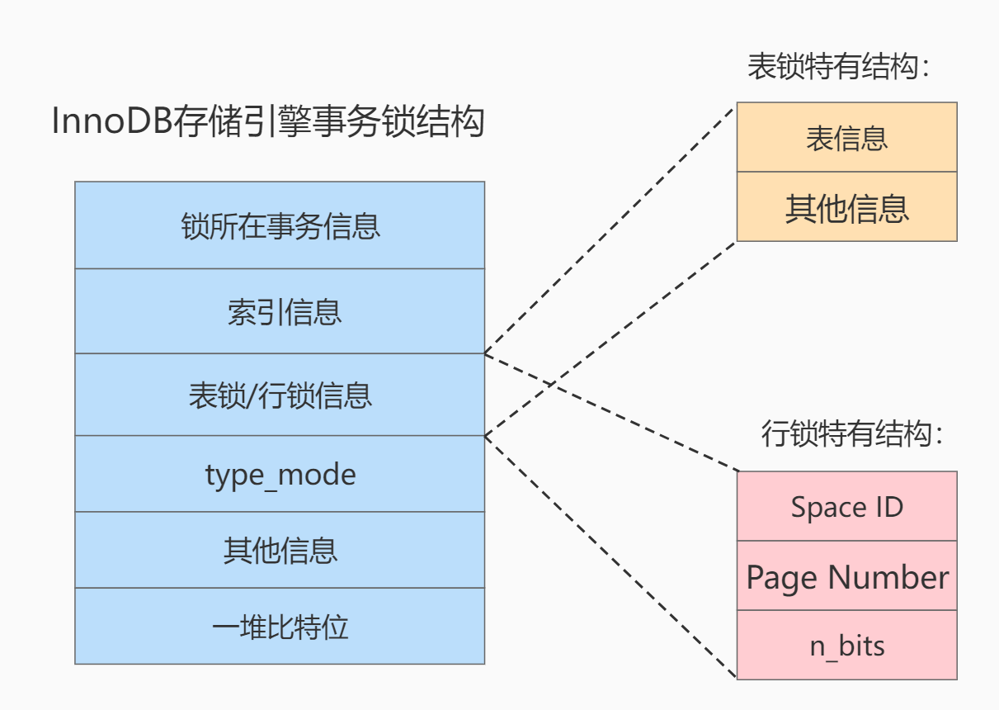

# 第15章-锁

## 15.1 概述

* 锁是多进程或多个线程并发访问某个资源的机制
* 在数据库中，除传统的计算资源（如CPU、RAM、I/O等）的争用以外，数据也是一种供许多用户共享的资源。为保证数据的一致性，需要对并发操作进行控制，因此产生了锁。同时锁机制也为实现MySQL的各个隔离级别提供了保证。锁冲突也是影响数据库并发访问性能的一个重要因素。所以锁对数据库而言显得尤其重要，也更加复杂。

## 15.2 MySQL并发事务访问相同记录

### 15.2.1 读-读情况

* 读-读情况，即并发事务相继读取相同的记录。读取操作本身不会对记录有任何影响，并不会引起什么问题，所以允许这种情况的发生。

### 15.2.2 写-写情况

* 写-写情况，即并发事务相继对相同的记录做出改动。
* 在这种情况下会发生脏写的问题，任何一种隔离级别都不允许这种问题的发生。所以在多个未提交事务相继对一条记录做改动时，需要让它们排队执行，这个排队的过程其实是通过锁来实现的。这个所谓的锁其实是一个内存中的结构，在事务执行前本来是没有锁的。
* 锁结构：
  * trx信息：代表哪个事务生成的
  * is_waiting: 代表当前事务是否等待
* 当开启一个事务写时，没有其他事务，会自动创建一个锁，这时trx信息是T1，is_waiting是false。未提交事务时，又一个事务进行写操作，发现有其他事务正在操作，自己创建一个锁，这时trx信息是T1，is_waiting是true，就处于等待状态。
* 对于锁的状态说法
  * 不加锁
    * 意思就是不需要在内存中生成对应的锁结构，可以直接执行操作。
  * 获取锁成功，或者加锁成功
    * 意思就是在内存中生成了对应的锁结构，而且锁结构的is_waiting 属性为false ，也就是事务可以继续执行操作。
  * 获取锁失败，或者加锁失败，或者没有获取到锁
    * 意思就是在内存中生成了对应的锁结构，不过锁结构的is_waiting 属性为true ，也就是事务需要等待，不可以继续执行操作。

### 15.2.3 读-写或写-读情况

* 读-写或写-读，即一个事务进行读取操作，另一个进行改动操作。这种情况下可能发生脏读、不可重复读、幻读的问题。
* 各个数据库厂商对SQL标准的支持都可能不一样。比如MySQL在REPEATABLE READ 隔离级别上就已经解决了幻读问题。

### 15.2.4 并发问题的解决方案

* 怎么解决脏读、不可重复读、幻读这些问题呢？其实有两种可选的解决方案：
  * 方案一：读操作利用多版本并发控制（ MVCC ），写操作进行加锁。
  * 方案二：读、写操作都采用枷锁方式。
* MVCC，就是生成一个ReadView，通过ReadView找到符合条件得记录版本（历史版本由undo日志构建），每次都都通过ReadView读取，读取的是生成ReadView之前已提交的记录。采用MVCC时，读-写操作不冲突。
* ReaView在不同模式下有所不同。
  * 在READ COMMITTED 隔离级别下，一个事务在执行过程中每次执行SELECT操作时都会生成一个ReadView，ReadView的存在本身就保证了事务不可以读取到未提交的事务所做的更改，也就是避免了脏读现象；
  * 在REPEATABLE READ 隔离级别下，一个事务在执行过程中只有第一次执行SELECT操作才会生成一个ReadView，之后的SELECT操作都复用这个ReadView，这样也就避免了不可重复读和幻读的问题。
* 小结对比发现：
  * 采用MVCC 方式的话， 读-写操作彼此并不冲突， 性能更高。
  * 采用加锁方式的话， 读-写操作彼此需要排队执行，影响性能。
  * 一般情况下我们当然愿意采用MVCC 来解决读-写操作并发执行的问题，但是业务在某些特殊情况下，要求必须采用加锁的方式执行。

## 15.3 锁的不同角度分类


### 15.3.1 从数据操作的类型划分：读锁、写锁

* 读锁：也称为共享锁（Shared Lock 简称S Lock）、英文用S 表示。针对同一份数据，多个事务的读操作可以同时进行而不会互相影响，相互不阻塞的。
* 写锁：也称为排他锁(Exclusive Lock简称X Lock)、英文用X 表示。当前写操作没有完成前，它会阻断其他写锁和读锁。这样就能确保在给定的时间里，只有一个事务能执行写入，并防止其他用户读取正在写入的同一资源。

* InnoDB引擎来说，读锁和写锁可以加在表上，也可以加在行上。

| 锁   | 遇到X锁                  | 遇到S锁                  |
| ---- | ------------------------ | ------------------------ |
| X锁  | 不兼容（另一个事务等待） | 不兼容（另一个事务等待） |
| S锁  | 不兼容（另一个事务等待） | 兼容（可以同时操作）     |

#### 15.3.1.1 读锁

采用加锁方式解决脏读、不可重复读、幻读时，可以用S锁，有时候又需要使用X锁

* 读取加S锁

  * 加了S锁，其他的S锁可以查询，如果是X锁，则必须等待所有的锁释放了才可。

  ```sql
  SELECT ... LOCK IN SHARE MODE;
  #或
  SELECT ... FOR SHARE;#(8.0新语法)
  ```

* 对读加X锁

  * 加了X锁，其他的所有锁都是等待的状态。

  ```sql
  SELECT ... FOR UPDATE;
  ```

* SELECT ... FOR UPDATE，如果获取不到锁，会一直等待，直到innodb_lock_wait_timeout设置的超时时间超时结束。
* 8.0版本中，SELECT ... FOR UPDATE;SELECT ... FOR SHARE;可以添加NOWAIT、SKIP LOCKED语法，不同等待或者跳过锁定的行。

举例测试

```sql
#事务1
mysql> begin;
Query OK, 0 rows affected (0.00 sec)

mysql> select * from student_test for share;
+----+--------+--------+------+---------+
| id | stuno  | name   | age  | classId |
+----+--------+--------+------+---------+
|  1 | 100001 | gRPAhj |   26 |      22 |
|  2 | 100002 | CJPWmx |   25 |     122 |
+----+--------+--------+------+---------+
2 rows in set (0.00 sec)

#事务2
mysql> begin;
Query OK, 0 rows affected (0.00 sec)
mysql> select * from student_test for share;
+----+--------+--------+------+---------+
| id | stuno  | name   | age  | classId |
+----+--------+--------+------+---------+
|  1 | 100001 | gRPAhj |   26 |      22 |
|  2 | 100002 | CJPWmx |   25 |     122 |
+----+--------+--------+------+---------+
2 rows in set (0.00 sec)

#事务3
mysql> begin;
Query OK, 0 rows affected (0.00 sec)
mysql> select * from student_test;
+----+--------+--------+------+---------+
| id | stuno  | name   | age  | classId |
+----+--------+--------+------+---------+
|  1 | 100001 | gRPAhj |   26 |      22 |
|  2 | 100002 | CJPWmx |   25 |     122 |
+----+--------+--------+------+---------+
2 rows in set (0.00 sec)
mysql> select * from student_test for update;

#事务1、2使用共享锁可以查询数据，事务3则进行等待，如果其他事务提交或回滚，等待超时后事务3回滚之前的事务，重新开启一个事务
#事务1、2都提交或回滚后，事务3则未超时情况下可以查询到。
#事务3开启X锁后，事务1、2再重新开事务，开共享锁卡住，等待事务3释放锁。
#不加锁的查询时都可以查询的
```

#### 15.3.1.2 写锁

* 写操作就是DELETE、UPDATE、INSERT三种，
  * DELETE
    * 操作过程是在B+树中定位到记录的位置，然后获取记录的X锁，再执行delete mark操作，这个过程看成获取X锁的锁定读。
  * UPDATE
    * 操作过程中未修改记录的键值（主键），且更新的列占用的存储空间在修改前后没变化，在B+树中定位到记录的位置，然后获取记录的X锁，然后再原记录的位置进行修改操作，这个过程看成获取X锁的锁定读。
    * 操作过程中未修改记录的键值（主键），但至少有一个更新列的占用存储空间修改前后发生变化。在B+树中定位到记录的位置，然后获取记录的X锁，将该记录彻底删除掉，再插入一条新记录，先获取X锁，新插入的记录有INSERT操作的隐式锁进行保护
    * 修改了键值（主键），相当于在原记录上DELETE操作后再来INSERT操作，加锁过程按照DELETE和INSERT的规则进行。 
  * INSERT
    * 不加锁，因为没有记录没有抓手来加锁，通过一种称为隐式锁的结构保护这条新插入的记录在本事事务提交前不会被别的事务访问到。

### 15.3.2 从数据操作的粒度划分：表级锁、页级锁、行锁

* 要提高数据库的并发度，每次锁定的数据范围越小越好，但是管理锁很耗资源（获取、检查、释放锁动作），所以为了并发和系统性能平衡，产生了锁粒度的概念

#### 15.3.2.1 表锁（Table Lock）

##### 15.3.2.1.1表级别的S锁、X锁

* DML操作，InnoDB存储引擎是不会主动为这个表添加表级别的S锁或者X锁的。DDL操作时，为了保障表的元数据完整性，在事务中执行DDL时，DML执行语句也会发生阻塞，同理在事务中执行DML时，其他会话中执行DDL也会阻塞。这个过程其实是通过在server层使用一种称之为元数据锁（英文名： Metadata Locks ，简称MDL ）结构来实现的。
* 一般不会在表上加S锁或X锁。在特殊情况下，比如崩溃了要恢复数据时才锁表防止数据恢复过程中写入导致恢复失败。还有在系统变量autocommit=0，innodb_table_locks = 1 时， 手动获取InnoDB存储引擎提供的表t 的S锁或者X锁可以这么写：
  * LOCK TABLES t READ ：InnoDB存储引擎会对表t 加表级别的S锁。
  * LOCK TABLES t WRITE ：InnoDB存储引擎会对表t 加表级别的X锁。
* 锁表不需要开启事务。

* 避免在使用InnoDB存储引擎的表上使用LOCK TABLES 这样的手动锁表语句，它们并不会提供什么额外的保护，只是会降低并发能力而已。InnoDB的厉害之处还是实现了更细粒度的行锁。

锁表用的的sql：

```sql
 #锁定表只读
 LOCK TABLE t READ;
 #锁定表只写
 LOCK TABLE t WRITE;
 #查看表有几个锁
 show open tables where `table`='t1';
 #解除锁定
 UNLOCK TABLES ;
```

举例：


```sql
#session 1
mysql> LOCK TABLE student_test READ;
Query OK, 0 rows affected (0.00 sec)

mysql> COMMIT;
Query OK, 0 rows affected (0.00 sec)

mysql> UNLOCK TABLE student_test;
ERROR 1064 (42000): You have an error in your SQL syntax; check the manual that corresponds to your MySQL server version for the right syntax to use near 'student_test' at line 1
mysql> UNLOCK TABLEs student_test;
ERROR 1064 (42000): You have an error in your SQL syntax; check the manual that corresponds to your MySQL server version for the right syntax to use near 'student_test' at line 1
mysql> UNLOCK TABLES student_test;
ERROR 1064 (42000): You have an error in your SQL syntax; check the manual that corresponds to your MySQL server version for the right syntax to use near 'student_test' at line 1
mysql> UNLOCK TABLES WHERE `table`='student_test';
ERROR 1064 (42000): You have an error in your SQL syntax; check the manual that corresponds to your MySQL server version for the right syntax to use near 'WHERE `table`='student_test'' at line 1
mysql> UNLOCK TABLES ;
Query OK, 0 rows affected (0.00 sec)

mysql> show open tables where `table`='student_test';
+----------+--------------+--------+-------------+
| Database | Table        | In_use | Name_locked |
+----------+--------------+--------+-------------+
| test_2   | student_test |      1 |           0 |
+----------+--------------+--------+-------------+
1 row in set (0.00 sec)

#session 2
mysql>  LOCK TABLE student_test READ;
Query OK, 0 rows affected (0.00 sec)

#session 3
mysql>  LOCK TABLE student_test WRITE;

#锁表不需要开启事务，COMMIT没有用，必须使用UNLOCKE TABLES；
#session1、2可以同时开启读锁，session3开启写锁会阻塞
#session1 解锁后，看到的是session2的锁
```

| 锁类型 | 自己可读 | 自己可写（增删改） | 自己可操作其他表 | 他人可读             | 他人可写（增删改）   |
| ------ | -------- | ------------------ | ---------------- | -------------------- | -------------------- |
| 读锁   | 是       | 否                 | 否               | 是                   | 否，等（表不锁定时） |
| 写锁   | 是       | 是                 | 否               | 否，等（表不锁定时） | 否，等（表不锁定时） |

总结：

MyISAM在执行查询语句前，会给涉及的所有表加读锁，执行增删改前，会给涉及的表加写锁，InnoDB存储引擎不会添加表级别的读锁和写锁。

##### 15.3.2.1.2 意向锁 （intention lock）

* InnoDB 支持多粒度锁（multiple granularity locking） ，它允许行级锁与表级锁共存，而意向锁就是其中的一种表锁。

  * 意向锁的存在是为了协调行锁和表锁的关系，支持多粒度（表锁和行锁）的锁并存。
  * 意向锁是一种不与行级锁冲突表级锁
  * 表示某个事务正在某些行持有了锁或该事务准备去持有锁。

* 意向锁理解

  * 比如有10万条数据，在某一行加了X锁，如果想在表上加上X锁，没有意向锁时，需要一行一行判断有没有锁，性能太差了。如果在某一行添加X锁后，在表上添加意向锁，再在表上添加X锁，只需要判断表上有没有意向锁即可，可以提高性能。

* 意向锁分为两种：

  * 意向共享锁（intention shared lock, IS）：事务有意向对表中的某些行加共享锁（S锁）

    ```sql
    -- 事务要获取某些行的 S 锁，必须先获得表的 IS 锁。
    SELECT column FROM table ... LOCK IN SHARE MODE;
    ```

  * 意向排他锁（intention exclusive lock, IX）：事务有意向对表中的某些行加排他锁（X锁）

    ```sql
    -- 事务要获取某些行的 X 锁，必须先获得表的 IX 锁。
    SELECT column FROM table ... FOR UPDATE;
    ```

* 即：意向锁是由存储引擎自己维护的，用户无法手动操作意向锁，在为数据行加共享 / 排他锁之前，InooDB 会先获取该数据行所在数据表的对应意向锁。

* 意向锁的并发性

  * 意向锁不会与行级的共享 / 排他锁互斥！正因为如此，意向锁并不会影响到多个事务对不同数据行加排他锁时的并发性。（不然我们直接用普通的表锁就行了）

* InnoDB 支持多粒度锁，特定场景下，行级锁可以与表级锁共存（行级锁与意向锁共存）。

* 意向锁之间互不排斥，但除了 IS 与表的 S 兼容外， 意向锁会与表的共享锁 / 表的排他锁互斥。

  * 意向锁之间互相不排斥举例，同一个事务中，不同id的select排他锁操作，是可以同时进行的，不同的id都会生成一个表级别的排他锁，如果互斥，就无法进行了。

    ```sql
    begin;
    #一个行级X锁，表级IX锁
    select * from student where id=1 for update;
    #一个行级X锁，表级IX锁，不冲突
    select * from student where id=2 for update;
    ```

* IX，IS是表级锁，不会和行级的X，S锁发生冲突。只会和表级的X，S发生冲突。

* 意向锁在保证并发性的前提下，实现了行锁和表锁共存且满足事务隔离性的要求。

##### 15.3.2.1.3 自增锁（AUTO-INC锁）

造数据

```sql
CREATE TABLE `teacher` (
`id` int NOT NULL AUTO_INCREMENT,
`name` varchar(255) NOT NULL,
PRIMARY KEY (`id`)
) ENGINE=InnoDB DEFAULT CHARSET=utf8mb4 COLLATE=utf8mb4_0900_ai_ci;

mysql> begin;
Query OK, 0 rows affected (0.00 sec)

mysql> INSERT INTO `teacher` (name) VALUES ('zhangsan2'), ('lisi2');
Query OK, 2 rows affected (0.00 sec)
Records: 2  Duplicates: 0  Warnings: 0

mysql> rollback;
Query OK, 0 rows affected (0.01 sec)

mysql> select * from teacher;
+----+----------+
| id | name     |
+----+----------+
|  1 | zhangsan |
|  2 | lisi     |
+----+----------+
2 rows in set (0.00 sec)


#session 2

mysql> begin;
Query OK, 0 rows affected (0.00 sec)

mysql> INSERT INTO `teacher` (name) VALUES ('zhangsan3'), ('lisi3');
Query OK, 2 rows affected (0.00 sec)
Records: 2  Duplicates: 0  Warnings: 0

mysql> select * from teacher;
+----+-----------+
| id | name      |
+----+-----------+
|  1 | zhangsan  |
|  2 | lisi      |
|  5 | zhangsan3 |
|  6 | lisi3     |
+----+-----------+
4 rows in set (0.00 sec)

mysql> commit;
Query OK, 0 rows affected (0.00 sec)

mysql> select * from teacher;
+----+-----------+
| id | name      |
+----+-----------+
|  1 | zhangsan  |
|  2 | lisi      |
|  5 | zhangsan3 |
|  6 | lisi3     |
+----+-----------+
4 rows in set (0.00 sec)

#session 3
mysql> begin;
Query OK, 0 rows affected (0.00 sec)

mysql> INSERT INTO `teacher` (name) VALUES ('zhangsan4'), ('lisi4');
Query OK, 2 rows affected (0.00 sec)
Records: 2  Duplicates: 0  Warnings: 0

mysql> select * from teacher;
+----+-----------+
| id | name      |
+----+-----------+
|  1 | zhangsan  |
|  2 | lisi      |
|  7 | zhangsan4 |
|  8 | lisi4     |
+----+-----------+
4 rows in set (0.00 sec)

mysql> select * from teacher;
+----+-----------+
| id | name      |
+----+-----------+
|  1 | zhangsan  |
|  2 | lisi      |
|  7 | zhangsan4 |
|  8 | lisi4     |
+----+-----------+
4 rows in set (0.00 sec)

mysql> commit;
Query OK, 0 rows affected (0.00 sec)

mysql> select * from teacher;
+----+-----------+
| id | name      |
+----+-----------+
|  1 | zhangsan  |
|  2 | lisi      |
|  5 | zhangsan3 |
|  6 | lisi3     |
|  7 | zhangsan4 |
|  8 | lisi4     |
+----+-----------+
6 rows in set (0.00 sec)

#可以看出不同session的事务在自增时，自增会跳过使用的主键。就算回滚后页不会再使用
```

* 插入语句分三类
  * “Simple inserts” （简单插入），预先确定要插入的行数，通过INSERT...VALUES() 和REPLACE 语句。
  * “Bulk inserts” （批量插入），事先不知道要插入的行数（和所需自动递增值的数量）的语句。比如INSERT ... SELECT ， REPLACE... SELECT 和LOAD DATA 语句，但不包括纯INSERT。
  * “Mixed-mode inserts” （混合模式插入），这些是“Simple inserts”语句但是指定部分新行的自动递增值。例如INSERT INTO teacher (id,name)VALUES (1,'a'), (NULL,'b'), (5,'c'), (NULL,'d'); 只是指定了部分id的值。另一种类型的“混合模式插入”是 INSERT ... ON DUPLICATE KEY UPDATE 。
* 在插入语句时表级别加一个AUTO-INC锁，插入语句执行结束后释放掉（不是等commit后），同时插入时没有取到锁的事务等待，虽然很快，但是每条语句都要对AUTO-INC进行竞争，并发力会下降。
* 自增锁有三种模式，innodb_autoinc_lock_mode参数控制。
  * innodb_autoinc_lock_mode = 0(“传统”锁定模式)
    * 表级锁，并发时对于AUTO-INC锁的争夺会限制并发能力。sql语句模拟不出来。
  * innodb_autoinc_lock_mode = 1(“连续”锁定模式)
    * 在 MySQL 8.0 之前，连续锁定模式是默认的。
    * 在这个模式下，因为“bulk inserts”不知道要插入多少行，所以仍然使用AUTO-INC表级锁，并保持到语句结束，才能保障主键自增。适用于所有INSERT ...SELECT，REPLACE ... SELECT和LOAD DATA语句。同一时刻只有一个语句可以持有AUTO-INC锁。
    * 对于“Simple inserts”（要插入的行数事先已知），没有获取锁时也是等待状态，如果获取了锁，则一次性申请插入的行数的自增数，然后释放锁，避免锁表。官方说法：通过在mutex（轻量锁） 的控制下获得所需数量的自动递增值来避免表级AUTO-INC锁， 它只在分配过程的持续时间内保持，而不是直到语句完成。
  * innodb_autoinc_lock_mode = 2(“交错”锁定模式)
    * 从 MySQL 8.0 开始，交错锁模式是默认设置。
    * 在此锁定模式下，自动递增值保证在所有并发执行的所有类型的insert语句中是唯一且单调递增的。但是，由于多个语句可以同时生成数字（即，跨语句交叉编号），为任何给定语句插入的行生成的值可能不是连续的。

* 修改自增锁级别方法:

  ```
  编辑/etc/my.cnf，加入如下行:
  innodb_autoinc_lock_mode=2
  
  直接通过命令修改会报错:
  mysql(mdba@localhost:(none) 09:32:19)>set global innodb_autoinc_lock_mode=2;
  ERROR 1238 (HY000): Variable 'innodb_autoinc_lock_mode' is a read only variable
  ```

##### 15.3.2.1.4 元数据锁（MDL锁）

* MySQL5.5引入了meta data lock，简称MDL锁，属于表锁范畴。MDL 的作用是，保证读写的正确性。比如，如果一个查询正在遍历一个表中的数据，而执行期间另一个线程对这个表结构做变更，增加了一列，那么查询线程拿到的结果跟表结构对不上，肯定是不行的。

测试：

```sql
#session1
mysql> begin;
Query OK, 0 rows affected (0.00 sec)
mysql> select * from teacher for update;
+----+------------+
| id | name       |
+----+------------+
|  1 | zhangsan   |
|  2 | lisi       |
|  5 | zhangsan3  |
|  6 | lisi3      |
|  7 | zhangsan4  |
|  8 | lisi4      |
|  9 | zhangsan2  |
| 10 | lisi2      |
| 13 | zhangsan22 |
| 14 | lisi22     |
| 17 | zhangsan11 |
| 18 | lisi11     |
| 19 | zhangsan11 |
| 20 | lisi11     |
| 21 | zhangsan33 |
| 22 | lisi33     |
+----+------------+
16 rows in set (0.00 sec)

#session 2
mysql> alter table teacher add age int;

#session3
mysql> select * from teacher;

#session1开启事务，开启行锁后，session2的DDL无法执行，处于等待状态。
#session2处于等待状态，间接的导致session3处于等待状态
#正常情况下session1开始后，不影响session3的查询。由此可以看出，session2对表加了一个元数据锁。
```

#### 15.3.2.2 InnoDB中的行锁

##### 15.3.2.2.1 记录锁（Record Locks）

* 锁住某一行记录，MySQL服务器层没有实现锁机制，行级锁只在存储引擎层实现，InnoDB实现了行锁，MyISAM没有。
  * 优点：锁定粒度小，发生锁冲突概率低，可以实现高并发。
  * 缺点：锁的开销大，加锁会比较慢，容易出现死锁。
* InnoDB与MyISAM的最大不同有两点：支持事务和采用了行级锁。
* 记录锁通过主键索引实现的，如果不是主键查询，会把整个表锁住。
* 记录锁也就是通过主键仅仅把一条记录锁上，官方的类型名称为：LOCK_REC_NOT_GAP 
* 仅仅是锁住了对应行的记录，对周围的数据没有影响。
* 事务中执行修改操作会自动添加行锁，也就是隐式锁。
* 有对应的主键id才能锁住数据，如果时没有的id，则是间隙锁，间隙锁之间是兼容的，部分S还是X锁。
* 记录锁是有S锁和X锁之分的，称之为S型记录锁和X型记录锁。
  * 当一个事务获取了一条记录的S型记录锁后，其他事务也可以继续获取该记录的S型记录锁，但不可以继续获取X型记录锁；
  * 当一个事务获取了一条记录的X型记录锁后，其他事务既不可以继续获取该记录的S型记录锁，也不可以继续获取X型记录锁。

测试：

```sql
#根据主键锁定情况
#session1

mysql> CREATE TABLE student_test1(id int,name varchar(20),class varchar(10),PRI                                                                                              MARY KEY (id)) Engine=InnoDB CHARSET=utf8;
Query OK, 0 rows affected, 1 warning (0.04 sec)

mysql> INSERT INTO student_test1 VALUES(1,'张三','一班'),(3,'李四','一班'),(8,'                                                                                              王五','二班'),(15,'赵六','二班'),(20,'前七','三班');
Query OK, 5 rows affected (0.02 sec)
Records: 5  Duplicates: 0  Warnings: 0

mysql> begin;
Query OK, 0 rows affected (0.00 sec)

mysql> update student_test1 set name='张三1' where id=1;
Query OK, 1 row affected (0.00 sec)
Rows matched: 1  Changed: 1  Warnings: 0

mysql> rollback;
Query OK, 0 rows affected (0.00 sec)

#session2

mysql> begin;
Query OK, 0 rows affected (0.00 sec)

mysql> select * from student_test1 where id=2 for update;
Empty set (0.00 sec)

mysql> update student_test1 set name='张三1' where id=1;
^[[D^[[D
^C^C -- query aborted
ERROR 1317 (70100): Query execution was interrupted
mysql> update student_test1 set name='李四2' where id=2;
Query OK, 0 rows affected (0.00 sec)
Rows matched: 0  Changed: 0  Warnings: 0

mysql> rollback;
Query OK, 0 rows affected (0.00 sec)

#session1 根据主键更新数据时，锁定了主键的行。
#session2 只要不锁定session1的行，就可以操作，不受影响，反之，等待session1提交。
```


```sql
#不根据主键锁定情况
#session1
mysql> begin;
Query OK, 0 rows affected (0.00 sec)
mysql> update student_test1 set name='张三1' where name='张三';
Query OK, 1 row affected (0.01 sec)
Rows matched: 1  Changed: 1  Warnings: 0

#session2
mysql> begin;
Query OK, 0 rows affected (0.00 sec)
mysql> update student_test1 set name='张三1' where name='张三';
^C^C -- query aborted
ERROR 1317 (70100): Query execution was interrupted
mysql> update student_test1 set name='张三1' where name='李四';
^C^C -- query aborted
ERROR 1317 (70100): Query execution was interrupted
mysql> update student_test1 set name='张三1' where name='王五';
^C^C -- query aborted
ERROR 1317 (70100): Query execution was interrupted
mysql> update student_test1 set name='张三1' where name='赵六';
^C^C -- query aborted
ERROR 1317 (70100): Query execution was interrupted
mysql> update student_test1 set name='张三1' where name='前七';

#session1开启事务，name非主键，还未提交，会给表加上X锁。
#session2开启事务，无法操作等待。
```

##### 15.3.2.2.2 间隙锁（Gap Locks）

* MySQL 在REPEATABLE READ 隔离级别下是可以解决幻读问题的，解决方案有两种，可以使用MVCC 方案解决，也可以采用加锁方案解决。
* 但是在使用加锁方案解决时有个大问题，就是事务在第一次执行读取操作时，那些幻影记录尚不存在，我们无法给这些幻影记录加上记录锁
* InnoDB提出了一种称之为Gap Locks 的锁，官方的类型名称为： LOCK_GAP ，我们可以简称为gap锁，也是主键才有效果。
* gap锁的提出仅仅是为了防止插入幻影记录而提出的。虽然有共享gap锁和独占gap锁，但是他们没区别。
* 建一所仅仅是保护间隙不被插入，可以开启多个间隙锁，select...from table1 where id=不存在的值for share和for update都一样，都可以执行不阻塞。
* 间隙锁的范围，是id前后的开区间，如果后面没值了，就是最大id到无穷都不能写入。
* 间隙锁会产生死锁

举例：

```sql
#session1
mysql> select * from student_test1;
+----+---------+--------+
| id | name    | class  |
+----+---------+--------+
|  1 | 张三1   | 一班   |
|  3 | 李四    | 一班   |
|  8 | 王五    | 二班   |
| 15 | 赵六    | 二班   |
| 20 | 前七    | 三班   |
+----+---------+--------+
5 rows in set (0.00 sec)

mysql> begin;
Query OK, 0 rows affected (0.00 sec)

mysql> select * from student_test1 where id=6 for update;
Empty set (0.00 sec)

#session2
mysql> select * from student_test1;
+----+---------+--------+
| id | name    | class  |
+----+---------+--------+
|  1 | 张三1   | 一班   |
|  3 | 李四    | 一班   |
|  8 | 王五    | 二班   |
| 15 | 赵六    | 二班   |
| 20 | 前七    | 三班   |
+----+---------+--------+
5 rows in set (0.00 sec)

mysql> update student_test1 set name='张三1' where name='张三';
Query OK, 0 rows affected (0.00 sec)
Rows matched: 0  Changed: 0  Warnings: 0

mysql> update student_test1 set name='张三1' where id=6;
Query OK, 0 rows affected (0.00 sec)
Rows matched: 0  Changed: 0  Warnings: 0

mysql> insert into student_test1 values(2,'二狗','一般');
Query OK, 1 row affected (0.00 sec)

mysql> insert into student_test1 values(4,'二狗','一般');
^C^C -- query aborted
ERROR 1317 (70100): Query execution was interrupted
mysql> insert into student_test1 values(7,'二狗','一般');
^C^C -- query aborted
ERROR 1317 (70100): Query execution was interrupted
mysql> insert into student_test1 values(8,'二狗','一般');
ERROR 1062 (23000): Duplicate entry '8' for key 'student_test1.PRIMARY'
mysql> ^C
mysql> insert into student_test1 values(9,'二狗','一般');
Query OK, 1 row affected (0.01 sec)

#session1 锁住不存在的id主键6，前后id就是 （3，8）
#session2 查询和更新都没问题，就是不能插入3到8中间的主键id，其他区间是可以插入的
```

```sql
#查看数据
select * from performance_schema.data_locks\G
```

```sql
#死锁问题
#session1
mysql> begin;
Query OK, 0 rows affected (0.00 sec)

mysql> select * from student_test1 where id=6;
Empty set (0.00 sec)

mysql> select * from student_test1 where id=6 for update;
Empty set (0.00 sec)

mysql>  insert into student_test1 values(5,'二狗','一般');
ERROR 1213 (40001): Deadlock found when trying to get lock; try restarting transaction

#session2

mysql> begin;
Query OK, 0 rows affected (0.00 sec)

mysql> select * from student_test1 where id=5 for update;
Empty set (0.00 sec)

mysql>  insert into student_test1 values(7,'二狗','一般');
Query OK, 1 row affected (9.98 sec)

#session1和session2都开了间隙锁，然后又插入间隙了数据。就会导致死锁。
```

##### 15.3.2.2.3 临键锁（Next-Key Locks）

* 有时候我们既想锁住某条记录，又想阻止其他事务在该记录前边的间隙插入新记录，所以InnoDB就提出了一种称之为Next-Key Locks 的锁，官方的类型名称为： LOCK_ORDINARY ，我们也可以简称为next-key锁。Next-Key Locks是在存储引擎innodb 、事务级别在可重复读的情况下使用的数据库锁，innodb默认的锁就是Next-Key locks。即：想锁住间隙，又想锁住记录锁，两个的合体。

```sql
#这样就构建了一个临建锁，范围是（3，8]，即又间隙也有行锁。
begin;
select * from student where id <=8 and id > 3 for update;
```

##### 15.3.2.2.4 插入意向锁（Insert Intention Locks）

* 我们说一个事务在插入一条记录时需要判断一下插入位置是不是被别的事务加了gap锁（ next-key锁也包含gap锁），如果有的话，插入操作需要等待，直到拥有gap锁的那个事务提交。但是InnoDB规定事务在等待的时候也需要在内存中生成一个锁结构，表明有事务想在某个间隙中插入新记录，但是现在在等待。InnoDB就把这种类型的锁命名为Insert Intention Locks ，官方的类型名称为：LOCK_INSERT_INTENTION ，我们称为插入意向锁。插入意向锁是一种Gap锁，不是意向锁，在insert操作时产生。

* 插入意向锁下之间是相互兼容的。
* 插入意向锁并不会阻止别的事务继续获取该记录上任何类型的锁。

##### 15.3.2.2.5 页锁

* 页锁就是在页的粒度上进行锁定，锁定的数据资源比行锁要多，因为一个页中可以有多个行记录。
* 页锁的开销介于表锁和行锁之间，会出现死锁。锁定粒度介于表锁和行锁之间，并发度一般。
* 每个层级的锁数量是有限制的，因为锁会占用内存空间， 锁空间的大小是有限的。当某个层级的锁数量超过了这个层级的阈值时，就会进行锁升级。锁升级就是用更大粒度的锁替代多个更小粒度的锁，比如InnoDB 中行锁升级为表锁，这样做的好处是占用的锁空间降低了，但同时数据的并发度也下降了。

### 15.3.3 从对待锁的态度划分:乐观锁、悲观锁

从对待锁的态度来看锁的话，可以将锁分成乐观锁和悲观锁，从名字中也可以看出这两种锁是两种看待数据并发的思维方式。需要注意的是，乐观锁和悲观锁并不是锁，而是锁的设计思想。

#### 15.3.3.1 悲观锁（Pessimistic Locking）

* 悲观锁是一种思想，顾名思义，就是很悲观，对数据被其他事务的修改持保守态度，会通过数据库自身的锁机制来实现，从而保证数据操作的排它性。
* 悲观锁总是假设最坏的情况，每次去拿数据的时候都认为别人会修改，所以每次在拿数据的时候都会上锁，这样别人想拿这个数据就会阻塞直到它拿到锁
* 悲观锁的开销大。

#### 15.3.3.2 乐观锁（Optimistic Locking）

* 乐观锁认为对同一数据的并发操作不会总发生，属于小概率事件，不用每次都对数据上锁，但是在更新的时候会判断一下在此期间别人有没有去更新这个数据，也就是不采用数据库自身的锁机制，而是通过程序来实现。
* 在程序上，我们可以采用版本号机制或者CAS机制实现。乐观锁适用于多读的应用类型，这样可以提高吞吐量
  * 乐观锁的版本号机制
    * 在表中设计一个版本字段 version ，第一次读的时候，会获取 version 字段的取值。然后对数据进行更新或删除操作时，会执行UPDATE ... SET version=version+1 WHERE version=version 。此时如果已经有事务对这条数据进行了更改，修改就不会成功。
  * 乐观锁的时间戳机制
    * 时间戳和版本号机制一样，也是在更新提交的时候，将当前数据的时间戳和更新之前取得的时间戳进行比较，如果两者一致则更新成功，否则就是版本冲突。

### 15.3.4 按加锁的方式划分：显式锁、隐式锁

#### 15.3.4.1 隐式锁

* 隐藏的锁，不是显示设置的锁。比如开启一个事务，插入一条数据，再开一个事务，进行查询锁定刚才那行数据时，会处于等待状态。insert并没有显示加锁，后面的查询才进行了加锁，也就是原来没有锁，但查询时出现了排他锁。插入数据时就隐式的添加了一个锁，后面的查询语句加锁，让隐式锁显现出来了。
* 隐式锁的情景
  * 对于聚簇索引记录来说，有一个trx_id 隐藏列，该隐藏列记录着最后改动该记录的事务id 。这就就称为隐式锁。事务中新插入一条记录后，该记录的trx_id 隐藏列就是当前事务的事务id，其他事务此时想对该记录添加S锁或者X锁时，会看下trx_id的事务是否活跃，如果时活跃的，其他事务就帮助当前事务生成一个锁，其他事务再自己生成一个锁状态为等待。
  * 对于二级索引记录来说，本身并没有trx_id 隐藏列，但是在二级索引页面的PageHeader 部分有一个PAGE_MAX_TRX_ID 属性，该属性代表对该页面做改动的最大的事务id，如果PAGE_MAX_TRX_ID 属性值小于当前最小的活跃事务id ，那么说明对该页面做修改的事务都已经提交了，否则就需要在页面中定位到对应的二级索引记录，然后回表找到它对应的聚簇索引记录，然后再重复情景一的做法。

```sql
#session1
mysql> begin;
Query OK, 0 rows affected (0.00 sec)
mysql> insert INTO student VALUES(34,"周八","二班");
Query OK, 1 row affected (0.00 sec)

#session2
mysql> begin;
Query OK, 0 rows affected (0.00 sec)
mysql> select * from student lock in share mode; #执行完，当前事务被阻塞

#查看锁
mysql> SELECT * FROM performance_schema.data_lock_waits\G;
*************************** 1. row ***************************
ENGINE: INNODB
REQUESTING_ENGINE_LOCK_ID: 140562531358232:7:4:9:140562535668584
REQUESTING_ENGINE_TRANSACTION_ID: 422037508068888
REQUESTING_THREAD_ID: 64
REQUESTING_EVENT_ID: 6
REQUESTING_OBJECT_INSTANCE_BEGIN: 140562535668584
BLOCKING_ENGINE_LOCK_ID: 140562531351768:7:4:9:140562535619104
BLOCKING_ENGINE_TRANSACTION_ID: 15902
BLOCKING_THREAD_ID: 64
BLOCKING_EVENT_ID: 6
BLOCKING_OBJECT_INSTANCE_BEGIN: 140562535619104
1 row in set (0.00 sec)

#session1没有显示加锁，session2锁表会给session1的隐式锁添加一个锁。
```

15.3.4.1 显式锁

通过特定的语句进行加锁，我们一般称之为显示加锁，例如：

显示加共享锁：

```sql
select .... lock in share mode
select .... lock for share
```

显示加排它锁：

```sql
select .... for update
```

### 15.3.5 其它锁之：全局锁

全局锁就是对整个数据库实例加锁。当你需要让整个库处于只读状态的时候，可以使用这个命令，之后其他线程的以下语句会被阻塞：数据更新语句（数据的增删改）、数据定义语句（包括建表、修改表结构等）和更新类事务的提交语句。全局锁的典型使用场景是：做全库逻辑备份。

全局锁的命令：

```
Flush tables with read lock
```

### 15.3.6 其它锁之：死锁

* 死锁是指两个或多个事务在同一资源上相互占用，并请求锁定对方占用的资源，从而导致恶性循环

* 当出现死锁以后，有两种策略：
  * 一种策略是，直接进入等待，直到超时。这个超时时间可以通过参数innodb_lock_wait_timeout 来设置。
  * 另一种策略是，发起死锁检测，发现死锁后，主动回滚死锁链条中的某一个事务（将持有最少行级排他锁的事务进行回滚），让其他事务得以继续执行。将参数innodb_deadlock_detect 设置为on ，表示开启这个逻辑。

* 主动的死锁检测机制如何实现，通过warit-for graph算法主动进行死锁检测。


* 检测到回路、有死锁，Innodb存储引擎会选择回滚undo量最小的事务，让其他事务执行。
* 自动检测的缺点：每个新的阻塞线程，都要判断是不是由于自己加入导致了死锁，操作时间复杂度为O(n)，100个并发改同一行，需要检测100*100=1万次。
* 如何解决自动检测的判断
  * 控制并发数
  * 减少锁冲突
* 如何避免死锁
  * 合理设计索引，尽可能通过索引定位更少的行，减少锁竞争。
  * 调整SQL执行顺序，不免update/delete长时间持有锁的SQL事务前面。
  * 避免大事务，把大事务拆分成小事务。
  * 并发高的系统，不显式加锁。
  * 降低隔离级别

## 15.4 锁的内存结构

InnoDB 存储引擎中的锁结构如下：



**结构解析：**

* 锁所在的事务信息：
  * 不论是表锁还是行锁，都是在事务执行过程中生成的，哪个事务生成了这个锁结构，这里就记录这个事务的信息。
  * 此锁所在的事务信息在内存结构中只是一个指针，通过指针可以找到内存中关于该事务的更多信息，比方说事务id等。

**索引信息**

* 对于行锁来说，需要记录一下加锁的记录是属于哪个索引的。这里也是一个指针。

**表锁／行锁信息**

* 表锁结构和行锁结构在这个位置的内容是不同的：
  * 表锁：
    * 记载着是对哪个表加的锁，还有其他的一些信息。
  * 行锁：
    * 记载了三个重要的信息：
    * Space ID ：记录所在表空间。
    * Page Number ：记录所在页号。
    * n_bits ：对于行锁来说，一条记录就对应着一个比特位，一个页面中包含很多记录，用不同的比特位来区分到底是哪一条记录加了锁。为此在行锁结构的末尾放置了一堆比特位，这个n_bits 属性代表使用了多少比特位。
    * n_bits的值一般都比页面中记录条数多一些。主要是为了之后在页面中插入了新记录后也不至于重新分配锁结构

**type_mode ：**

* 这是一个32位的数，被分成了lock_mode 、lock_type 和rec_lock_type 三个部分，如图所示：


* 锁的模式（ lock_mode ），占用低4位，可选的值如下：
  * LOCK_IS （十进制的0 ）：表示共享意向锁，也就是IS锁。
  * LOCK_IX （十进制的1 ）：表示独占意向锁，也就是IX锁。
  * LOCK_S （十进制的2 ）：表示共享锁，也就是S锁。
  * LOCK_X （十进制的3 ）：表示独占锁，也就是X锁。
  * LOCK_AUTO_INC （十进制的4 ）：表示AUTO-INC锁。
  * 在InnoDB存储引擎中，LOCK_IS，LOCK_IX，LOCK_AUTO_INC都算是表级锁的模式，LOCK_S和LOCK_X既可以算是表级锁的模式，也可以是行级锁的模式。
* 锁的类型（ lock_type ），占用第5～8位(从右往左数)，不过现阶段只有第5位和第6位被使用：
  * LOCK_TABLE （十进制的16 ），也就是当第5个比特位置为1时，表示表级锁。
  * LOCK_REC （十进制的32 ），也就是当第6个比特位置为1时，表示行级锁。
* 行锁的具体类型（ rec_lock_type ），使用其余的位来表示。只有在lock_type 的值为LOCK_REC 时，也就是只有在该锁为行级锁时，才会被细分为更多的类型：
  * LOCK_ORDINARY （十进制的0 ）：表示next-key锁。
  * LOCK_GAP （十进制的512 ）：也就是当第10个比特位置为1时，表示gap锁。
  * LOCK_REC_NOT_GAP （十进制的1024 ）：也就是当第11个比特位置为1时，表示正经记录锁。
  * LOCK_INSERT_INTENTION （十进制的2048 ）：也就是当第12个比特位置为1时，表示插入意向锁。其他的类型：还有一些不常用的类型我们就不多说了。
* is_waiting 属性呢？基于内存空间的节省，所以把is_waiting 属性放到了type_mode 这个32位的数字中：
  * LOCK_WAIT （十进制的256 ） ：当第9个比特位置为1 时，表示is_waiting 为true ，也就是当前事务尚未获取到锁，处在等待状态；当这个比特位为0 时，表示is_waiting 为false ，也就是当前事务获取锁成功。

**其他信息：**

* 为了更好的管理系统运行过程中生成的各种锁结构而设计了各种哈希表和链表。

**一堆比特位：**

* 如果是行锁结构的话，在该结构末尾还放置了一堆比特位，比特位的数量是由上边提到的n_bits 属性表示的。InnoDB数据页中的每条记录在记录头信息中都包含一个heap_no 属性，伪记录Infimum 的heap_no 值为0 ， Supremum 的heap_no 值为1 ，之后每插入一条记录， heap_no 值就增1。锁结构最后的一堆比特位就对应着一个页面中的记录，一个比特位映射一个heap_no ，即一个比特位映射到页内的一条记录。

## 15.5 锁监控

* 关于MySQL锁的监控，我们一般可以通过检查InnoDB_row_lock 等状态变量来分析系统上的行锁的争夺情况

```sql
mysql> show status like 'innodb_row_lock%';
+-------------------------------+-------+
| Variable_name | Value |
+-------------------------------+-------+
| Innodb_row_lock_current_waits | 0 |
| Innodb_row_lock_time | 0 |
| Innodb_row_lock_time_avg | 0 |
| Innodb_row_lock_time_max | 0 |
| Innodb_row_lock_waits | 0 |
+-------------------------------+-------+
5 rows in set (0.01 sec)
```

* 对各个状态量的说明如下：
  * Innodb_row_lock_current_waits：当前正在等待锁定的数量；
  * Innodb_row_lock_time ：从系统启动到现在锁定总时间长度；（等待总时长）
  * Innodb_row_lock_time_avg ：每次等待所花平均时间；（等待平均时长）
  * Innodb_row_lock_time_max：从系统启动到现在等待最常的一次所花的时间；
  * Innodb_row_lock_waits ：系统启动后到现在总共等待的次数；（等待总次数）

* 其他监控方法：
  * MySQL把事务和锁的信息记录在了information_schema 库中，涉及到的三张表分别是INNODB_TRX 、INNODB_LOCKS 和INNODB_LOCK_WAITS 。
  * MySQL5.7及之前，可以通过information_schema.INNODB_LOCKS查看事务的锁情况，但只能看到阻塞事务的锁；如果事务并未被阻塞，则在该表中看不到该事务的锁情况。
  * MySQL8.0删除了information_schema.INNODB_LOCKS，添加了performance_schema.data_locks ，可以通过performance_schema.data_locks查看事务的锁情况，和MySQL5.7及之前不同，performance_schema.data_locks不但可以看到阻塞该事务的锁，还可以看到该事务所持有的锁。同时，information_schema.INNODB_LOCK_WAITS也被performance_schema.data_lock_waits 所代替。

```sql
#查询正在被锁阻塞的sql语句。
SELECT * FROM information_schema.INNODB_TRX;

#查询锁等待情况
SELECT * FROM performance_schema.data_lock_waits;

#查询锁的情况
SELECT * from performance_schema.data_locks;
```

