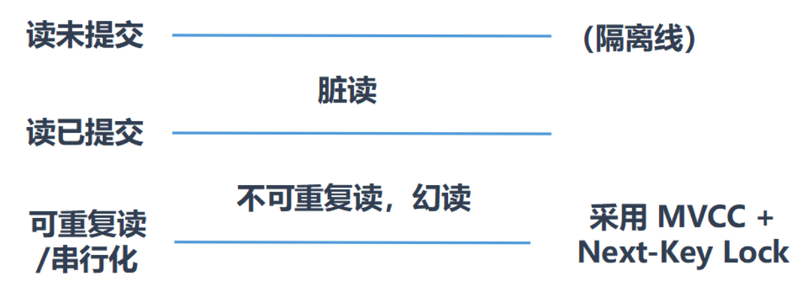

# 第16章-多版本并发控制

## 16.1 什么是MVCC

* MVCC （Multiversion Concurrency Control），多版本并发控制。顾名思义，MVCC 是通过数据行的多个版本管理来实现数据库的并发控制。这项技术使得在InnoDB的事务隔离级别下执行一致性读操作有了保证.换言之，就是为了查询一些正在被另一个事务更新的行，并且可以看到它们被更新之前的值，这样在做查询的时候就不用等待另一个事务释放锁。
* MVCC没有正式的标准。MYSQL也只有InnoDB实现了。

## 16.2 快照读与当前读

* MVCC在MySQL InnoDB中的实现主要是为了提高数据库并发性能，用更好的方式去处理读-写冲突，做到即使有读写冲突时，也能做到不加锁， 非阻塞并发读，而这个读指的就是快照读, 而非当前读。当前读实际上是一种加锁的操作，是悲观锁的实现。而MVCC本质是采用乐观锁思想的一种方式。

### 16.2.1 快照读

快照读又叫一致性读，读取的是快照数据。不加锁的简单的 SELECT 都属于快照读，即不加锁的非阻塞读；比如这样：

```sql
SELECT * FROM player WHERE ...
```

### 16.2.2 当前读

当前读读取的是记录的最新版本（最新数据，而不是历史版本的数据），读取时还要保证其他并发事务不能修改当前记录，会对读取的记录进行加锁。加锁的 SELECT，或者对数据进行增删改都会进行当前读。比如：

```sql
SELECT * FROM student LOCK IN SHARE MODE; # 共享锁
SELECT * FROM student FOR UPDATE; # 排他锁
INSERT INTO student values ... # 排他锁
DELETE FROM student WHERE ... # 排他锁
UPDATE student SET ... # 排他锁
```

## 16.3  复习

### 16.3.1 再谈隔离级别

* MYSQL可重复读解决了幻读问题，就是采用了MVCC。



### 16.3.2 隐藏字段、Undo Log版本链

* undo日志的版本链，对于使用InnoDB 存储引擎的表来说，它的聚簇索引记录中都包含两个必要的隐藏列。
  * trx_id ：每次一个事务对某条聚簇索引记录进行改动时，都会把该事务的事务id 赋值给trx_id 隐藏列。
  * roll_pointer ：每次对某条聚簇索引记录进行改动时，都会把旧的版本写入到undo日志中，然后这个隐藏列就相当于一个指针，可以通过它来找到该记录修改前的信息。

## 16.4 MVCC实现原理之ReadView

MVCC 的实现依赖于：隐藏字段、Undo Log、Read View。

### 16.4.1 什么是ReadView

* ReadView是事务在使用MVCC机制进行快照读操作时产生的读试图。事务启动时，会生成数据库系统当前的一个快照，InnoDB每个事务构造了一个数组，用来记录并维护系统当前活跃的事务（启动还未提交的事务）的ID。

###  16.4.2 设计思路

* 使用READ UNCOMMITTED 隔离级别的事务，由于可以读到未提交事务修改过的记录，所以直接读取记录的最新版本就好了，不需要使用快照。

* 使用SERIALIZABLE 隔离级别的事务，InnoDB规定使用加锁的方式来访问记录，所以不需要使用快照。

* 使用READ COMMITTED 和REPEATABLE READ 隔离级别的事务，都必须保证读到已经提交了的事务修改过的记录。假如另一个事务已经修改了记录但是尚未提交，是不能直接读取最新版本的记录的，核心问题就是需要判断一下版本链中的哪个版本是当前事务可见的，这是ReadView解决的问题，所以ReadView体现在这两个事务隔离级别。

* 这个ReadView中主要包含4个比较重要的内容，分别如下：

  * creator_trx_id ，创建这个 Read View 的事务 ID。

    ```
    说明：只有在对表中的记录做改动时（执行INSERT、DELETE、UPDATE这些语句时）才会为事务分配事务id，否则在一个只读事务中的事务id值都默认为0。
    ```

  * trx_ids ，表示在生成ReadView时当前系统中活跃的读写事务的事务id列表。

  * up_limit_id ，活跃的事务中最小的事务 ID。

  * low_limit_id ，表示生成ReadView时系统中应该分配给下一个事务的id 值。low_limit_id 是系统最大的事务id值，这里要注意是系统中的事务id，需要区别于正在活跃的事务ID。

    ```
    注意：low_limit_id并不是trx_ids中的最大值，事务id是递增分配的。比如，现在有id为1，
    2，3这三个事务，之后id为3的事务提交了。那么一个新的读事务在生成ReadView时，
    trx_ids就包括1和2，up_limit_id的值就是1，low_limit_id的值就是4。
    ```

### 16.4.3 ReadView的规则

* 有了这个ReadView，这样在访问某条记录时，只需要按照下边的步骤判断记录的某个版本是否可见。
  * 如果被访问版本的trx_id属性值与ReadView中的creator_trx_id 值相同，意味着当前事务在访问它自己修改过的记录，所以该版本可以被当前事务访问。
  * 如果被访问版本的trx_id属性值小于ReadView中的up_limit_id 值，表明生成该版本的事务在当前事务生成ReadView前已经提交，所以该版本可以被当前事务访问。
  * 如果被访问版本的trx_id属性值大于或等于ReadView中的low_limit_id 值，表明生成该版本的事务在当前事务生成ReadView后才开启，所以该版本不可以被当前事务访问。
  * 如果被访问版本的trx_id属性值在ReadView的up_limit_id 和low_limit_id 之间，那就需要判断一下trx_id属性值是不是在trx_ids 列表中。
    * 如果在，说明创建ReadView时生成该版本的事务还是活跃的，该版本不可以被访问。
    * 如果不在，说明创建ReadView时生成该版本的事务已经被提交，该版本可以被访问。

### 16.4.4 MVCC整体操作流程

* 了解了这些概念之后，我们来看下当查询一条记录的时候，系统如何通过MVCC找到它：
  * 首先获取事务自己的版本号，也就是事务 ID；
  2. 获取 ReadView；
  3. 查询得到的数据，然后与 ReadView 中的事务版本号进行比较；
  4. 如果不符合 ReadView 规则，就需要从 Undo Log 中获取历史快照；
  5. 最后返回符合规则的数据。
* Read View生成过程：
  5. 当前事务查询时，根据需求是否生成，如果需要生成，则creator_trx_id 时当前事务id
  5. 判断当前是否还有事务在执行表，有的话加入到trx_ids事务中。
  5. up_limit_id 是trx_ids中的最小值。
  5. low_limit_id 是全局事务最大值+1。

* 在隔离级别为读已提交（Read Committed）时，一个事务中的每一次 SELECT 查询都会重新获取一次Read View。

* 当隔离级别为可重复读（REPEATABLE READ）的时候，就避免了不可重复读，这是因为一个事务只在第一次 SELECT 的时候会获取一次 Read View，而后面所有的 SELECT 都会复用这个 Read View