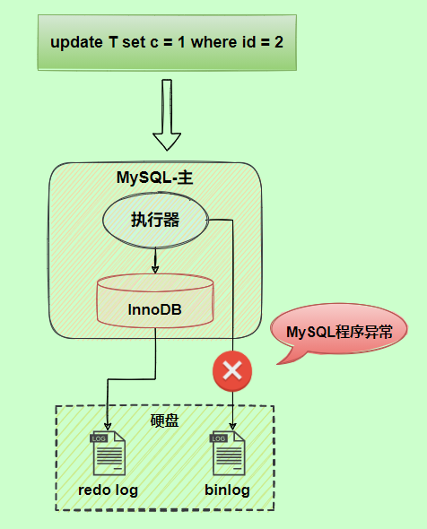
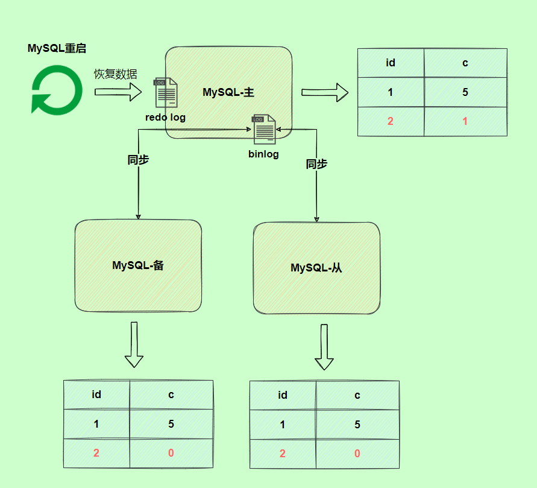
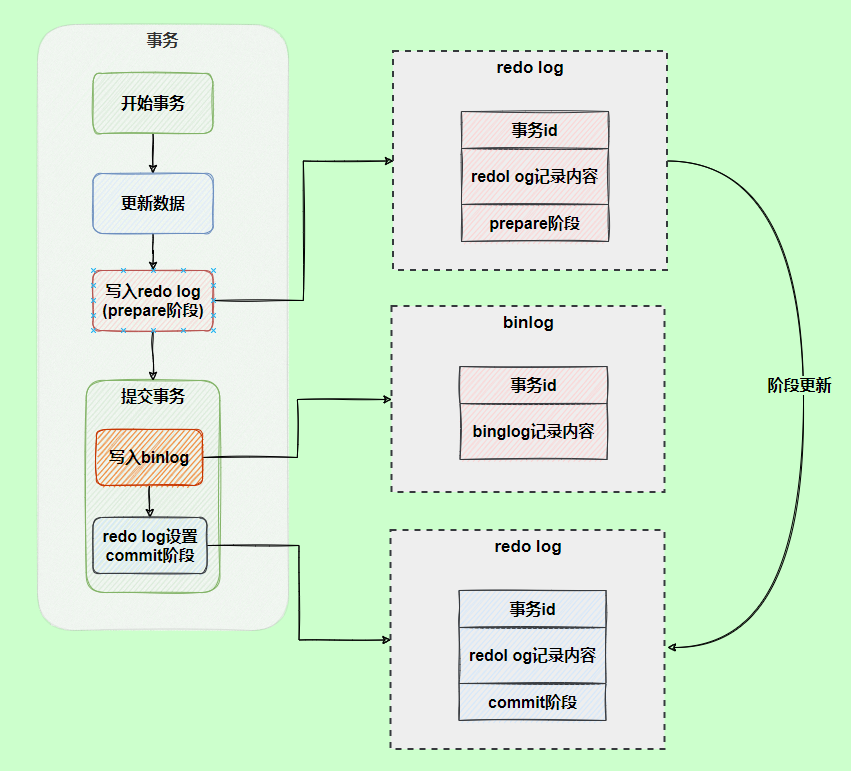
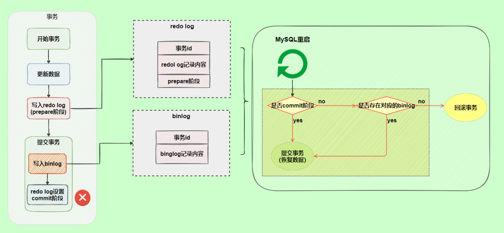

# 第17章-其他数据库日志

MySQL8.0 官网日志地址：“ https://dev.mysql.com/doc/refman/8.0/en/server-logs.html ”

## 17.1 MySQL支持的日志

### 17.1.1 日志类型

MySQL有不同类型的日志文件，用来存储不同类型的日志，分为二进制日志、错误日志、通用查询日志和慢查询日志，这也是常用的4种。MySQL 8又新增两种支持的日志： 中继日志和数据定义语句日志。使用这些日志文件，可以查看MySQL内部发生的事情。

这6类日志分别为：

* 慢查询日志：记录所有执行时间超过long_query_time的所有查询，方便我们对查询进行优化。
* 通用查询日志：记录所有连接的起始时间和终止时间，以及连接发送给数据库服务器的所有指令，对我们复原操作的实际场景、发现问题，甚至是对数据库操作的审计都有很大的帮助。
* 错误日志：记录MySQL服务的启动、运行或停止MySQL服务时出现的问题，方便我们了解服务器的状态，从而对服务器进行维护。
* 二进制日志：记录所有更改数据的语句，可以用于主从服务器之间的数据同步，以及服务器遇到故障时数据的无损失恢复。
* 中继日志：用于主从服务器架构中，从服务器用来存放主服务器二进制日志内容的一个中间文件。从服务器通过读取中继日志的内容，来同步主服务器上的操作。
* 数据定义语句日志：记录数据定义语句执行的元数据操作。

除二进制日志外，其他日志都是文本文件。默认情况下，所有日志创建于MySQL数据目录中。

### 17.1.2 日志的弊端

* 日志功能会降低MySQL数据库的性能。
* 日志会占用大量的磁盘空间。

## 17.2 慢查询日志(slow query log)

前面章节《第09章-性能分析工具的使用》已经详细讲述。

### 17.3 通用查询日志(general query log)

* 通用查询日志用来记录用户的所有操作，包括启动和关闭MySQL服务、所有用户的连接开始时间和截止时间、发给 MySQL 数据库服务器的所有 SQL 指令等。当我们的数据发生异常时，查看通用查询日志，还原操作时的具体场景，可以帮助我们准确定位问题。

### 17.3.1 查看通用查询日志配置

* 默认情况general_log是关闭的
* general_log_file日志路径

```sql
mysql> SHOW VARIABLES LIKE '%general%';
+------------------+------------------------+
| Variable_name    | Value                  |
+------------------+------------------------+
| general_log      | OFF                    |
| general_log_file | /var/lib/mysql/192.log |
+------------------+------------------------+
2 rows in set (0.44 sec)

```

### 17.3.2 启动日志

* 方式1：永久性方式
  * 如果不指定目录和文件名，通用查询日志将默认存储在MySQL数据目录中的hostname.log文件中，hostname表示主机名。
  * 修改my.cnf或者my.ini配置文件来设置。在[mysqld]组下加入log选项，并重启MySQL服务。格式如下：

```properties
[mysqld]
general_log=ON
general_log_file=[path[filename]] #日志
```

* 方式2：临时性方式

```sql
SET GLOBAL general_log=on; # 开启通用查询日志
SET GLOBAL general_log_file=’path/filename’; # 设置日志文件保存位置
```

### 17.3.3 查看日志

* 通用查询日志是以文本文件的形式存储在文件系统中的，可以使用文本编辑器直接打开日志文件。
* 找到服务器目录 SHOW VARIABLES LIKE '%general%'中的general_log_file，直接打开即可。
* 日志格式如下

```
/usr/sbin/mysqld, Version: 8.0.25 (MySQL Community Server - GPL). started with:
Tcp port: 3306  Unix socket: /var/lib/mysql/mysql.sock
Time                 Id Command    Argument
2023-08-23T15:26:18.285125Z         8 Query     SHOW VARIABLES LIKE '%general%'
2023-08-23T15:26:32.324480Z         8 Query     show databases
2023-08-23T15:26:39.165878Z         8 Query     SELECT DATABASE()
2023-08-23T15:26:39.166330Z         8 Init DB   test_2
2023-08-23T15:26:39.167627Z         8 Query     show databases
2023-08-23T15:26:39.168383Z         8 Query     show tables
2023-08-23T15:26:39.174125Z         8 Field List        class
2023-08-23T15:26:39.291298Z         8 Field List        student
2023-08-23T15:26:39.292472Z         8 Field List        student_test
2023-08-23T15:26:39.293387Z         8 Field List        student_test1
2023-08-23T15:26:39.294264Z         8 Field List        teacher
2023-08-23T15:26:42.925548Z         8 Query     show tables
2023-08-23T15:27:12.308872Z         8 Query     select * from  class limit 100
```

### 17.3.4 停止日志

* 方式1：永久性方式
  * 修改my.cnf 或者my.ini 文件，把[mysqld]组下的general_log 值设置为OFF 或者把general_log一项注释掉。修改保存后，再重启MySQL服务，即可生效。

```properties
[mysqld]
general_log=OFF
#或
[mysqld]
#general_log=ON
```

* 方式2：临时性方式

```sql
SET GLOBAL general_log=off;
```

### 17.3.5 删除\刷新日志

* 如果数据的使用非常频繁，那么通用查询日志会占用服务器非常大的磁盘空间。数据管理员可以删除很长时间之前的查询日志，以保证MySQL服务器上的硬盘空间。

* 手动删除文件，直接找到对应的服务器目录 （SHOW VARIABLES LIKE '%general%'中的general_log_file）文件删除，删除后通用日志不会再记录到日志文件中，只有重新生成文件之后才会重新记录到文件中。
* 手动删除清理掉通用查询日志之后，在通用日志查询是打开状态下，可以使用下面命令重新生成对应的空的日志文件。

```shell
#重新生成日志文件
mysqladmin -uroot -p flush-logs
```

## 17.4 错误日志(error log)

### 17.4.1 启动日志

* 在MySQL数据库中，错误日志功能是默认开启的。而且，错误日志无法被禁止。
* 默认情况下，错误日志存储在MySQL数据库的数据文件夹下，名称默认为mysqld.log （Linux系统）或hostname.err （mac系统）。如果需要制定文件名，则需要在my.cnf或者my.ini中做如下配置：

```properties
[mysqld]
log-error=[path/[filename]] #path为日志文件所在的目录路径，filename为日志文件名
```

* 修改配置项后，需要重启MySQL服务以生效。

### 17.4.2 查看日志

* MySQL错误日志是以文本文件形式存储的，可以使用文本编辑器直接查看。

```sql
mysql> SHOW VARIABLES LIKE 'log_err%';
+----------------------------+----------------------------------------+
| Variable_name              | Value                                  |
+----------------------------+----------------------------------------+
| log_error                  | /var/log/mysqld.log                    |
| log_error_services         | log_filter_internal; log_sink_internal |
| log_error_suppression_list |                                        |
| log_error_verbosity        | 2                                      |
+----------------------------+----------------------------------------+
4 rows in set (0.00 sec)
```

### 17.4.3 删除\刷新日志

* 对于很久以前的错误日志，数据库管理员查看这些错误日志的可能性不大，可以将这些错误日志删除，以保证MySQL服务器上的硬盘空间。MySQL的错误日志是以文本文件的形式存储在文件系统中的，可以直接删除。

```
#重新生成日志文件
mysqladmin -uroot -p flush-logs
```

```sql
#刷新报错
[root@192 log]# mysqladmin -uroot -p flush-logs
Enter password:
mysqladmin: refresh failed; error: 'Could not open file '/var/log/mysqld.log' for error logging.'

#需要补充操作，之后再刷新日志文件。install就是创建一个mysqld.log文件
install -omysql -gmysql -m0644 /dev/null /var/log/mysqld.log
mysqladmin -uroot -p flush-logs
```

* flush-logs指令操作：
  * 5.5.7以前的版本，flush-logs将错误日志文件重命名为filename.err_old，并创建新的日志文件。
  * 5.5.7开始，flush-logs只是重新打开日志文件，并不做日志备份和创建操作。
  * 如果日志文件不存在，MySQL启动或则执行flush-logs时会自动创建新的日志文件。重新创建错误日志，大小为0字节。

## 17.5 二进制日志(bin log)

* inlog可以说是MySQL中比较重要的日志了，在日常开发及运维过程中，经常会遇到。

* binlog即binary log，二进制日志文件，也叫作变更日志（update log）。它记录了数据库所有执行的DDL 和DML 等数据库更新事件的语句，但是不包含没有修改任何数据的语句（如数据查询语句select、show等）。
* binlog主要应用场景
  * 一是用于数据恢复
  * 二是用于数据复制

### 17.5.1 查看默认情况

* 默认是开启，里面记录的是二进制内容，记录的是事件。
* 每次重启服务器都会生成一个binlog文件，且超过binlog最大存储空间时，也会生成一个新的binlog日志文件。
* 相关参数说明：
  * log_bin开关
  * log_bin_basename生成binlog的基础文件名，会生成多个binlog，是再基础文件名后面加001叠加起来
  * log_bin_index是binlog的索引
  * log_bin_trust_function_creators是否信任存储过程，涉及到主从复制文件，比如NOW()，在主从复制时如果存储过程中写了这个，会导致事件不一致。
  * log_bin_use_v1_row_events只读系统变量已启用。ON表示使用版本1二进制日志行，OFF表示使用版本2二进制日志行（5.6的默认值为2）
  * sql_log_bin

```
mysql> show variables like '%log_bin%';
+---------------------------------+-----------------------------+
| Variable_name                   | Value                       |
+---------------------------------+-----------------------------+
| log_bin                         | ON                          |
| log_bin_basename                | /var/lib/mysql/binlog       |
| log_bin_index                   | /var/lib/mysql/binlog.index |
| log_bin_trust_function_creators | OFF                         |
| log_bin_use_v1_row_events       | OFF                         |
| sql_log_bin                     | ON                          |
+---------------------------------+-----------------------------+
6 rows in set (0.01 sec)
```

### 17.5.2 日志参数设置

* 方式1：永久性方式
  * 修改MySQL的my.cnf 或my.ini 文件可以设置二进制日志的相关参数：

```properties
[mysqld]
#启用二进制日志
log-bin=test-bin
binlog_expire_logs_seconds=600
#最大文件大小，默认不设置是1GB，不是严格的1GB
max_binlog_size=100M
```

设置带文件夹的bin-log日志存放目录

如果想改变日志文件的目录和名称，可以对my.cnf或my.ini中的log_bin参数修改如下：

```sql
[mysqld]
log-bin="/var/lib/mysql/binlog/test-bin"
```

* 方式2：临时性方式
  * 如果不希望通过修改配置文件并重启的方式设置二进制日志的话，还可以使用如下指令，需要注意的是在mysql8中只有会话级别的设置，没有了global级别的设置。

```sql
# global 级别
mysql> set global sql_log_bin=0;
ERROR 1228 (HY000): Variable 'sql_log_bin' is a SESSION variable and can`t be used
with SET GLOBAL
# session级别
mysql> SET sql_log_bin=0;
Query OK, 0 rows affected (0.01 秒)
```

### 17.5.3 查看日志

* 当MySQL创建二进制日志文件时，先创建一个以“filename”为名称、以“.index”为后缀的文件，再创建一个以“filename”为名称、以“.000001”为后缀的文件。
* MySQL服务重新启动一次，以“.000001”为后缀的文件就会增加一个，并且后缀名按1递增。即日志文件的个数与MySQL服务启动的次数相同；如果日志长度超过了max_binlog_size 的上限（默认是1GB），就会创建一个新的日志文件。
* 查看当前的二进制日志文件列表及大小。指令如下：

```sql
mysql> SHOW BINARY LOGS;
+---------------+-----------+-----------+
| Log_name      | File_size | Encrypted |
+---------------+-----------+-----------+
| binlog.000010 |       156 | No        |
| binlog.000011 |   3583842 | No        |
| binlog.000012 |       156 | No        |
| binlog.000013 |       179 | No        |
| binlog.000014 | 265595200 | No        |
| binlog.000015 |       156 | No        |
| binlog.000016 |      4409 | No        |
| binlog.000017 |      4675 | No        |
| binlog.000018 |       156 | No        |
| binlog.000019 |       200 | No        |
| binlog.000020 |       200 | No        |
| binlog.000021 |       200 | No        |
| binlog.000022 |       179 | No        |
| binlog.000023 |       156 | No        |
+---------------+-----------+-----------+
14 rows in set (0.39 sec)
```

* 查看binlog日志内容

  * 使用mysqlbinlog命令

    * -v参数表示呈现执行的sql，命令将行事件以伪SQL的形式表现出来

    ```sql
    [root@192 mysql]# mysqlbinlog -v "/var/lib/mysql/binlog.000011"
    BINLOG '
    1XvKZBMBAAAATAAAANyuNgAAAGgAAAAAAAEACmF0Z3VpZ3VkYjEAAnMyAAgDDwMPDw8PDwwsASwB
    LAEsASwBLAH+AQEAAgEhc/yWKw==
    1XvKZB4BAAAAZwAAAEOvNgAAAGgAAAAAAAEAAgAI/wAhTgAABgBIVklDTmv2ugQABgBKUFh1ZGkK
    AEVBTGVwbW5KdFcFAENXYnF6CgBCZ2ViV0JVU0pBCgBMZW1XWmVBb1VG/eU2cg==
    '/*!*/;
    ### INSERT INTO `atguigudb1`.`s2`
    ### SET
    ###   @1=20001
    ###   @2='HVICNk'
    ###   @3=310006
    ###   @4='JPXudi'
    ###   @5='EALepmnJtW'
    ###   @6='CWbqz'
    ###   @7='BgebWBUSJA'
    ###   @8='LemWZeAoUF'
    # at 3583811
    #230802 11:52:53 server id 1  end_log_pos 3583842 CRC32 0x47b3806b      Xid = 1740121
    COMMIT/*!*/;
    SET @@SESSION.GTID_NEXT= 'AUTOMATIC' /* added by mysqlbinlog */ /*!*/;
    DELIMITER ;
    # End of log file
    /*!50003 SET COMPLETION_TYPE=@OLD_COMPLETION_TYPE*/;
    /*!50530 SET @@SESSION.PSEUDO_SLAVE_MODE=0*/;
    
    ```

    * 前面的命令同时显示binlog格式的语句（base64字符串），使用如下命令不显示它

      ```shell
      mysqlbinlog -v --base64-output=DECODE-ROWS "/var/lib/mysql/binlog.000011"
      
      # at 1074397
      #230802 11:52:48 server id 1  end_log_pos 1074473 CRC32 0x8e118c22      Table_map: `atguigudb1`.`s1` mapped to number 103
      # at 1074473
      #230802 11:52:48 server id 1  end_log_pos 1074576 CRC32 0x9ddd8577      Write_rows: table id 103 flags: STMT_END_F
      ### INSERT INTO `atguigudb1`.`s1`
      ### SET
      ###   @1=15984
      ###   @2='ULWzHO'
      ###   @3=189496
      ###   @4='YzBjri'
      ###   @5='OuHcnklzNt'
      ###   @6='DLUra'
      ###   @7='dmcByPBoOd'
      ###   @8='YIvflSErYP'
      ```

    * 关于mysqlbinlog工具的使用技巧还有很多，例如只解析对某个库的操作或者某个时间段内的操作等。简单分享几个常用的语句，更多操作可以参考官方文档。

      ```shell
      # 可查看参数帮助
      mysqlbinlog --no-defaults --help
      # 查看最后100行
      mysqlbinlog --no-defaults --base64-output=decode-rows -vv binlog.000011 |tail -100
      # 根据position查找
      mysqlbinlog --no-defaults --base64-output=decode-rows -vv binlog.000011 |grep -A 20 '4939002'
      ```

  * 数据库中show binlog events方式查看：

    ```sql
    mysql> show binlog events [IN 'log_name'] [FROM pos] [LIMIT [offset,] row_count];
    ```

    * IN 'log_name' ：指定要查询的binlog文件名（不指定就是第一个binlog文件）
    * FROM pos ：指定从哪个pos起始点开始查起（不指定就是从整个文件首个pos点开始算）
    * LIMIT [offset] ：偏移量(不指定就是0)
    * row_count :查询总条数（不指定就是所有行）

  * 查询结果分析

    * Pos表示恢复时使用的id
    * xid表示事件id，一个事件一个id
    * Info表示操作信息
    * begin表示事务开始，恢复时需要从begin的pos到下一个pos的数字。

    ```sql
    mysql> show binlog events in 'binlog.000011' limit 10;
    +---------------+------+----------------+-----------+-------------+---------------------------------------------------------------------------------------------------------------------------------------------------------------------------------------------------------------------------------------------------------------------------------------------------------------------------------------------------------------------------------------------------------------------------------------------------------------------------------------------+
    | Log_name      | Pos  | Event_type     | Server_id | End_log_pos | Info                                                                                                                                                                                                                                                                                                                                                                                                                                                                                        |
    +---------------+------+----------------+-----------+-------------+---------------------------------------------------------------------------------------------------------------------------------------------------------------------------------------------------------------------------------------------------------------------------------------------------------------------------------------------------------------------------------------------------------------------------------------------------------------------------------------------+
    | binlog.000011 |    4 | Format_desc    |         1 |         125 | Server ver: 8.0.25, Binlog ver: 4                                                                                                                                                                                                                                                                                                                                                                                                                                                           |
    | binlog.000011 |  125 | Previous_gtids |         1 |         156 |                                                                                                                                                                                                                                                                                                                                                                                                                                                                                             |
    | binlog.000011 |  156 | Anonymous_Gtid |         1 |         235 | SET @@SESSION.GTID_NEXT= 'ANONYMOUS'                                                                                                                                                                                                                                                                                                                                                                                                                                                        |
    | binlog.000011 |  235 | Query          |         1 |         470 | /* ApplicationName=DBeaver 21.3.4 - Main */ CREATE SCHEMA `atguigudb1`
    DEFAULT CHARACTER SET utf8mb4
    DEFAULT COLLATE utf8mb4_0900_ai_ci /* xid=49 */                                                                                                                                                                                                                                                                                                                                        |
    | binlog.000011 |  470 | Anonymous_Gtid |         1 |         549 | SET @@SESSION.GTID_NEXT= 'ANONYMOUS'                                                                                                                                                                                                                                                                                                                                                                                                                                                        |
    | binlog.000011 |  549 | Query          |         1 |        1089 | use `atguigudb1`; /* ApplicationName=DBeaver 21.3.4 - SQLEditor <Script-7.sql> */ CREATE TABLE s1 (
    id INT AUTO_INCREMENT,
    key1 VARCHAR(100),
    key2 INT,
    key3 VARCHAR(100),
    key_part1 VARCHAR(100),
    key_part2 VARCHAR(100),
    key_part3 VARCHAR(100),
    common_field VARCHAR(100),
    PRIMARY KEY (id),
    INDEX idx_key1 (key1),
    UNIQUE INDEX idx_key2 (key2),
    INDEX idx_key3 (key3),
    INDEX idx_key_part(key_part1, key_part2, key_part3)
    ) ENGINE=INNODB CHARSET=utf8 /* xid=63 */     |
    | binlog.000011 | 1089 | Anonymous_Gtid |         1 |        1168 | SET @@SESSION.GTID_NEXT= 'ANONYMOUS'                                                                                                                                                                                                                                                                                                                                                                                                                                                        |
    | binlog.000011 | 1168 | Query          |         1 |        1712 | use `atguigudb1`; /* ApplicationName=DBeaver 21.3.4 - SQLEditor <Script-7.sql> */ CREATE TABLE s2 (
    id INT AUTO_INCREMENT,
    key1 VARCHAR(100),
    key2 INT,
    key3 VARCHAR(100),
    key_part1 VARCHAR(100),
    key_part2 VARCHAR(100),
    key_part3 VARCHAR(100),
    common_field VARCHAR(100),
    PRIMARY KEY (id),
    INDEX idx_key1 (key1),
    UNIQUE INDEX idx_key2 (key2),
        INDEX idx_key3 (key3),
    INDEX idx_key_part(key_part1, key_part2, key_part3)
    ) ENGINE=INNODB CHARSET=utf8 /* xid=66 */ |
    | binlog.000011 | 1712 | Anonymous_Gtid |         1 |        1791 | SET @@SESSION.GTID_NEXT= 'ANONYMOUS'                                                                                                                                                                                                                                                                                                                                                                                                                                                        |
    | binlog.000011 | 1791 | Query          |         1 |        2312 | use `atguigudb1`; CREATE DEFINER=`root`@`%` FUNCTION `rand_string1`(n INT) RETURNS varchar(255) CHARSET utf8mb4
    BEGIN
    DECLARE chars_str VARCHAR(100) DEFAULT
    'abcdefghijklmnopqrstuvwxyzABCDEFJHIJKLMNOPQRSTUVWXYZ';
    DECLARE return_str VARCHAR(255) DEFAULT '';
    DECLARE i INT DEFAULT 0;
    WHILE i < n DO
    SET return_str =CONCAT(return_str,SUBSTRING(chars_str,FLOOR(1+RAND()*52),1));
    SET i = i + 1;
    END WHILE;
    RETURN return_str;
    END /* xid=85 */                              |
    +---------------+------+----------------+-----------+-------------+---------------------------------------------------------------------------------------------------------------------------------------------------------------------------------------------------------------------------------------------------------------------------------------------------------------------------------------------------------------------------------------------------------------------------------------------------------------------------------------------+
    10 rows in set (0.00 sec)
    
    ```

* binlog格式查看

  * 除ROW之外，binlog还有2种格式，分别是Statement和Mixed
  * Statement
    * 每一条会修改数据的sql都会记录在binlog中。优点：不需要记录每一行的变化，减少了binlog日志量，节约了IO，提高性能。
  * Row
    * 5.1.5版本的MySQL才开始支持row level 的复制，它不记录sql语句上下文相关信息，仅保存哪条记录被修改。
    * 优点：row level 的日志内容会非常清楚的记录下每一行数据修改的细节。而且不会出现某些特定情况下的存储过程，或function，以及trigger的调用和触发无法被正确复制的问题。
  * Mixed
    * 从5.1.8版本开始，MySQL提供了Mixed格式，实际上就是Statement与Row的结合。

```sql
mysql> show variables like 'binlog_format';
+---------------+-------+
| Variable_name | Value |
+---------------+-------+
| binlog_format | ROW |
+---------------+-------+
1 行于数据集 (0.02 秒)
```

### 17.5.4 使用日志恢复数据

* mysqlbinlog命令可以根据binlog进行数据恢复。语法如下：

  ```sql
  mysqlbinlog [option] filename|mysql –uuser -ppass;
  ```

* 这个命令可以这样理解：使用mysqlbinlog命令来读取filename中的内容，然后使用mysql命令将这些内容恢复到数据库中。

  * filename ：是日志文件名。
  * option ：可选项，比较重要的两对option参数是--start-date、--stop-date 和 --start-position、--stop-position。
    * --start-date 和 --stop-date ：可以指定恢复数据库的起始时间点和结束时间点。
    * --start-position和--stop-position ：可以指定恢复数据的开始位置和结束位置。

```
注意：使用mysqlbinlog命令进行恢复操作时，必须是编号小的先恢复，binlog.000001必
须在binlog.000002之前恢复。
```

```shell
#恢复数据，从binlog.000011中的pos的464到1308恢复数据到test_2数据库中。
#通过show binlog events可以查看pos
mysqlbinlog -start-position=464 --stop-position=1308 --database=test_2  /var/lib/mysql/binlog.000011|mysql –uroot -ppwd -v test_2;

#恢复数据，从binlog.000011中的时间段恢复数据到test_2数据库中。
#通过mysqlbinlog可以查看时间戳
mysqlbinlog -start-date="2023-08-23 15:58:36" --stop-date ="2023-08-23 18:58:36" --database=test_2  /var/lib/mysql/binlog.000011|mysql –uroot -ppwd -v test_2;
```

### 17.5.5 删除二进制日志

* MySQL的二进制文件可以配置自动删除，同时MySQL也提供了安全的手动删除二进制文件的方法。
* PURGE MASTER LOGS 只删除指定部分的二进制日志文件， RESET MASTER 删除所有的二进制日志文

* PURGE MASTER LOGS：删除指定日志文件

```sql
PURGE {MASTER | BINARY} LOGS TO ‘指定日志文件名’
PURGE {MASTER | BINARY} LOGS BEFORE ‘指定日期’
```

* 举例删除某个之前的文件

```sql
#查看binlog日志文件
mysql> SHOW BINARY LOGS;
+---------------+-----------+-----------+
| Log_name      | File_size | Encrypted |
+---------------+-----------+-----------+
| binlog.000010 |       156 | No        |
| binlog.000011 |   3583842 | No        |
| binlog.000012 |       156 | No        |
| binlog.000013 |       179 | No        |
| binlog.000014 | 265595200 | No        |
| binlog.000015 |       156 | No        |
| binlog.000016 |      4409 | No        |
| binlog.000017 |      4675 | No        |
| binlog.000018 |       156 | No        |
| binlog.000019 |       200 | No        |
| binlog.000020 |       200 | No        |
| binlog.000021 |       200 | No        |
| binlog.000022 |       179 | No        |
| binlog.000023 |       156 | No        |
+---------------+-----------+-----------+
14 rows in set (0.01 sec)

#删除binlog.000012之前的文件，不包含binlog.000012
mysql> PURGE MASTER LOGS TO 'binlog.000012';
Query OK, 0 rows affected (0.01 sec)

#查看binlog日志文件
mysql> SHOW BINARY LOGS;
+---------------+-----------+-----------+
| Log_name      | File_size | Encrypted |
+---------------+-----------+-----------+
| binlog.000012 |       156 | No        |
| binlog.000013 |       179 | No        |
| binlog.000014 | 265595200 | No        |
| binlog.000015 |       156 | No        |
| binlog.000016 |      4409 | No        |
| binlog.000017 |      4675 | No        |
| binlog.000018 |       156 | No        |
| binlog.000019 |       200 | No        |
| binlog.000020 |       200 | No        |
| binlog.000021 |       200 | No        |
| binlog.000022 |       179 | No        |
| binlog.000023 |       156 | No        |
+---------------+-----------+-----------+
12 rows in set (0.00 sec)
```

* RESET MASTER：删除掉所有二进制日志文件。

```sql
RESET MASTER;
```

### 17.5.6 其它场景

* 二进制日志可以通过数据库的全量备份和二进制日志中保存的增量信息，完成数据库的无损失恢复。
* 如果遇到数据量大、数据库和数据表很多（比如分库分表的应用）的场景，用二进制日志进行数据恢复，是很有挑战性的，因为起止位置不容易管理。
* 在这种情况下，一个有效的解决办法是配置主从数据库服务器，甚至是一主多从的架构，把二进制日志文件的内容通过中继日志，同步到从数据库服务器中，这样就可以有效避免数据库故障导致的数据异常等问题。

## 17.6 再谈二进制日志(binlog)

### 17.6.1 写入机制

* binlog的写入时机也非常简单，事务执行过程中，先把日志写到binlog cache ，事务提交的时候，再把binlog cache写到binlog文件中。因为一个事务的binlog不能被拆开，无论这个事务多大，也要确保一次性写入，所以系统会给每个线程分配一个块内存作为binlog cache。
* write和fsync的时机，可以由参数sync_binlog 控制，默认是0 。为0的时候，表示每次提交事务都只write，由系统自行判断什么时候执行fsync。虽然性能得到提升，但是机器宕机，page cache里面的binglog 会丢失。
* 为了安全起见，可以设置为1 ，表示每次提交事务都会执行fsync，就如同redo log 刷盘流程一样。最后还有一种折中方式，可以设置为N(N>1)，表示每次提交事务都write，但累积N个事务后才fsync。
* 在出现IO瓶颈的场景里，将sync_binlog设置成一个比较大的值，可以提升性能。同样的，如果机器宕机，会丢失最近N个事务的binlog日志。


****


### 17.6.2 binlog与redolog对比

* redo log 它是物理日志，记录内容是“在某个数据页上做了什么修改”，属于 InnoDB 存储引擎层产生的。让InnoDB 存储引擎拥有崩溃恢复能力。
* 而 binlog 是逻辑日志，记录内容是语句的原始逻辑，类似于“给 ID=2 这一行的 c 字段加 1”，属于MySQL Server 层。恢复数据，以及保证了MYSQL集群架构的数据一致性。

### 17.6.3 两阶段提交

* 在执行更新语句过程，会记录redo log与binlog两块日志，以基本的事务为单位，redo log在事务执行过程中可以不断写入，而binlog只有在提交事务时才写入，所以redo log与binlog的写入时机不一样。


* redo log与binlog两份日志之间的逻辑不一致，会出现什么问题？
  * 看下图中，由于binlog没写完就异常，这时候binlog里面没有对应的修改记录。重启后，binlog中没有记录，如果有集群，从机则同步的是旧数据，因为从机读的主机binlog日志，不读redo log。





* 为了解决两份日志之间的逻辑一致问题，InnoDB存储引擎使用两阶段提交方案。
  * 数据恢复时，先从redo日志中读取，预先写入，然后提交到binlog日志中，binlog写入成功，redo日志再设置数据为commit状态。这样写入binlog异常时，事务不会提交。




* 另一个场景，redo log设置commit阶段发生异常，那会不会回滚事务呢？
  * 并不会回滚事务，它会执行下图框住的逻辑，虽然redo log是处于prepare阶段，但是能通过事务id找到对应的binlog日志，所以MySQL认为是完整的，就会提交事务恢复数据。



## 17.7 中继日志(relay log)

### 17.7.1 介绍

* 中继日志只在主从服务器架构的从服务器上存在。
* 从服务器为了与主服务器保持一致，要从主服务器读取二进制日志的内容，并且把读取到的信息写入本地的日志文件中，这个从服务器本地的日志文件就叫中继日志。然后，从服务器读取中继日志，并根据中继日志的内容对从服务器的数据进行更新，完成主从服务器的数据同步。
* 搭建好主从服务器之后，中继日志默认会保存在从服务器的数据目录下。
* 文件名的格式是： 从服务器名 -relay-bin.序号。中继日志还有一个索引文件： 从服务器名 -relaybin.index ，用来定位当前正在使用的中继日志。

### 17.7.2 查看中继日志

* 中继日志与二进制日志的格式相同，可以用 mysqlbinlog 工具进行查看。下面是中继日志的一个片段：

```sql
SET TIMESTAMP=1618558728/*!*/;
BEGIN
/*!*/;
# at 950
#210416 15:38:48 server id 1 end_log_pos 832 CRC32 0xcc16d651 Table_map:
`test_2`.`test` mapped to number 91
# at 1000
#210416 15:38:48 server id 1 end_log_pos 872 CRC32 0x07e4047c Delete_rows: table id
91 flags: STMT_END_F -- server id 1 是主服务器，意思是主服务器删了一行数据
BINLOG '
CD95YBMBAAAAMgAAAEADAAAAAFsAAAAAAAEABGRlbW8ABHRlc3QAAQMAAQEBAFHWFsw=
CD95YCABAAAAKAAAAGgDAAAAAFsAAAAAAAEAAgAB/wABAAAAfATkBw==
'/*!*/;
# at 1040
```

* 这一段的意思是，主服务器（“server id 1”）对表 test_2.test 进行了 2 步操作：

```
定位到表 test_2.test 编号是 91 的记录，日志位置是 832；
删除编号是 91 的记录，日志位置是 872。
```

### 17.7.3 恢复的典型错误

* 如果从服务器宕机，有的时候为了系统恢复，要重装操作系统，这样就可能会导致你的服务器名称与之
  前不同。而中继日志里是包含从服务器名的。在这种情况下，就可能导致你恢复从服务器的时候，无法
  从宕机前的中继日志里读取数据，以为是日志文件损坏了，其实是名称不对了。
* 解决的方法也很简单，把从服务器的名称改回之前的名称。