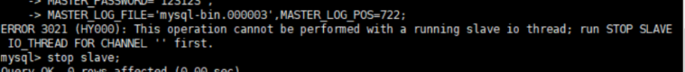

# 第18章-主从复制

## 18.1 主从复制概述

### 18.1.1 如何提升数据库并发能力

* 使用Redis作为缓存与MySQL配合来使用，请求时，先从缓存中查找，存在直接取出，如果不存在再访问MYSQL，查询到后放入Redis缓存中，减少对MySQL数据库的访问压力。


* 一般应用对数据库而言都是“ 读多写少”，可以考虑做主从架构、进行读写分离。
* 想提升数据库高并发访问的效率，首先考虑的是如何优化SQL和索引，简单有效；其次才是采用缓存的策略，比如使用 Redis将热点数据保存在内存数据库中，提升读取的效率；最后才是对数据库采用主从架构，进行读写分离。

### 18.1.2 主从复制的作用

* 主从同步设计不仅可以提高数据库的吞吐量，还有以下 3 个方面的作用。
  * 读写分离
  * 是数据备份
  * 高可用性


## 18.2 主从复制的原理

* Slave 会从Master 读取binlog 来进行数据同步。

### 18.2.1 原理剖析

* 三个线程进行主从数据的同步


* 二进制日志转储线程（Binlog dump thread）是一个主库线程。当从库线程连接的时候， 主库可以将二进制日志发送给从库，当主库读取事件（Event）的时候，会在 Binlog 上加锁，读取完成之后，再将锁释放掉。
* 从库 I/O 线程会连接到主库，向主库发送请求更新 Binlog。这时从库的 I/O 线程就可以读取到主库的二进制日志转储线程发送的 Binlog 更新部分，并且拷贝到本地的中继日志 （Relay log）。
* 从库 SQL 线程会读取从库中的中继日志，并且执行日志中的事件，将从库中的数据与主库保持同步。
* 复制三步骤
  * 步骤1： Master 将写操作记录到二进制日志（ binlog ）。
  * 步骤2： Slave 将Master 的binary log events拷贝到它的中继日志（ relay log ）；
  * 步骤3： Slave 重做中继日志中的事件，将改变应用到自己的数据库中。 MySQL复制是异步的且串行化的，而且重启后从接入点开始复制。
* 复制的问题
  * 复制的最大问题： 延时，数据不通及时更新，从从库读取数据是有一定延时。

### 18.2.2 复制的基本原则

- 每个Slave 只有一个Master
- 每个Slave 只能有一个唯一的服务器ID，用于master节点识别
- 每个Master 可以有多个Slave

## 18.3 一主一从架构搭建

* 一台主机用于处理所有写请求，一台从机负责所有读请求，架构图如下：


### 18.3.1 准备工作

1、准备2台CentOS 虚拟机

2、每台虚拟机上需要安装好MySQL (可以是MySQL8.0 )

说明：前面我们讲过如何克隆一台CentOS。大家可以在一台CentOS上安装好MySQL，进而通过克隆的方式复制出1台包含MySQL的虚拟机。

注意：克隆的方式需要修改新克隆出来主机的：① MAC地址 ② hostname ③ IP 地址 ④ UUID 。

此外，克隆的方式生成的虚拟机（包含MySQL Server），则克隆的虚拟机MySQL Server的UUID相同，必须修改，否则在有些场景会报错。比如： show slave status\G ，报如下的错误：

```
Last_IO_Error: Fatal error: The slave I/O thread stops because master and slave have
equal MySQL server UUIDs; these UUIDs must be different for replication to work.
```

* 修改MySQL Server 的UUID方式：

```
vim /var/lib/mysql/auto.cnf
systemctl restart mysqld
```

### 18.3.2 配置主从配置文件

* linux环境下的/etc/my.cnf的msyqld下添加配置
* 配置好后重启数据库（命令：systemctl restart mysqld）

主节点配置：

```
#[必须]主服务器唯一ID
server-id=1
#[必须]启用二进制日志,指名路径。比如：自己本地的路径/log/mysqlbin
log-bin=test-bin

#[可选] 0（默认）表示读写（主机），1表示只读（从机）
read-only=0
#设置日志文件保留的时长，单位是秒
binlog_expire_logs_seconds=6000
#控制单个二进制日志大小。此参数的最大和默认值是1GB
max_binlog_size=200M
#[可选]设置不要复制的数据库
binlog-ignore-db=test
#[可选]设置需要复制的数据库,默认全部记录。比如：binlog-do-db=atguigu_master_slave
binlog-do-db=需要复制的主数据库名字
#[可选]设置binlog格式
binlog_format=STATEMENT
```

从点配置：

```
#[必须]从服务器唯一ID
server-id=2

#[可选]启用中继日志
relay-log=mysql-relay
```

### 18.3.2 主节点创建用户并授权

* 8.0之前的版本按下面操作即可

```sql
#在主机MySQL里执行授权主从复制的命令
GRANT REPLICATION SLAVE ON *.* TO 'slave1'@'从机器数据库IP' IDENTIFIED BY 'abc123';
#5.5,5.7
```

* 8.0的版本按下面操作

```sql
#创建登录用户，并设置密码
USER 'slave1'@'%' IDENTIFIED BY '123456';
#授权复制权限
GRANT REPLICATION SLAVE ON *.* TO 'slave1'@'%';
#如果密码是弱密码，执行下面这个。否则报错
ALTER USER 'slave1'@'%' IDENTIFIED WITH mysql_native_password BY '123456';
#刷新配置
flush privileges;
```

```wiki
注意：在从机执行show slave status\G时报错：
Last_IO_Error: error connecting to master 'slave1@192.168.1.150:3306' - retry-time: 60 retries: 1
message: Authentication plugin 'caching_sha2_password' reported error: Authentication requires
secure connection.
```

* 查询Master的状态，并记录下File和Position的值。
*  Binlog_Do_DB表示需要同步的数据库

```sql
show master status;
```


* 执行完此步骤后不要再操作主服务器MySQL，防止主服务器状态值变化。

### 18.3.3 从机配置主机

* 配置的命名，登录到从机的mysql执行下面命令

```sql
CHANGE MASTER TO
MASTER_HOST='主机的IP地址',
MASTER_USER='主机用户名',
MASTER_PASSWORD='主机用户名的密码',
MASTER_LOG_FILE='mysql-bin.具体数字',
MASTER_LOG_POS=具体值;

#MASTER_HOST主节点的ip地址
#MASTER_USER上面设置的登录用户名
#MASTER_PASSWORD上面设置的登录用户名密码
#MASTER_LOG_FILE主节点上show master status查询出的file
#MASTER_LOG_POS主节点上show master status查询出的position
```

```sql
#举例
CHANGE MASTER TO
MASTER_HOST='192.168.1.150',MASTER_USER='slave1',MASTER_PASSWORD='123456',MASTER_LOG_F
ILE='log-bin.000007',MASTER_LOG_POS=154;
```

* 启动slave同步

```sql
#启动slave同步
START SLAVE;
```

如果报错：


可以执行如下操作，删除之前的relay_log信息。然后重新执行 CHANGE MASTER TO ...语句即可。

```sql
mysql> reset slave; #删除SLAVE数据库的relaylog日志文件，并重新启用新的relaylog文件
```

* 查看同步状态：

```sql
SHOW SLAVE STATUS;
```


* 显式如下的情况，就是不正确的。
* 可能错误的原因有：

```
1. 网络不通
2. 账户密码错误
3. 防火墙
4. mysql配置文件问题
5. 连接服务器时语法
6. 主服务器mysql权限
```

### 18.3.4 停止主从同步

* 停止主从同步命令：

```
stop slave;
```

* 如果停止从服务器复制功能，再使用需要重新配置主从。否则会报错如下



* 重新配置主从，需要在从机上执行：

```sql
stop slave;
reset master; #删除Master中所有的binglog文件，并将日志索引文件清空，重新开始所有新的日志文件(慎用)
```

## 18.4 binlog格式

### 18.4.1 STATEMENT格式

* 格式1： STATEMENT模式（基于SQL语句的复制(statement-based replication, SBR)）

```properties
#/etc/my.cnf的mysqld下面配置
binlog_format=STATEMENT
```

* 每一条会修改数据的sql语句会记录到binlog中。这是默认的binlog格式。

* 优点
  * 历史悠久，技术成熟
  * 不需要记录每一行的变化，减少了binlog日志量，文件较小
  * binlog中包含了所有数据库更改信息，可以据此来审核数据库的安全等情况
  * binlog可以用于实时的还原，而不仅仅用于复制
  * 主从版本可以不一样，从服务器版本可以比主服务器版本高
* 缺点
  * 不是所有的UPDATE语句都能被复制，尤其是包含不确定操作的时候
* 使用以下函数的语句也无法被复制：LOAD_FILE()、UUID()、USER()、FOUND_ROWS()、SYSDATE()(除非启动时启用了 --sysdate-is-now 选项)
  * INSERT ... SELECT 会产生比 RBR 更多的行级锁
  * 复制需要进行全表扫描(WHERE 语句中没有使用到索引)的 UPDATE 时，需要比 RBR 请求更多的行级锁
  * 对于有 AUTO_INCREMENT 字段的 InnoDB表而言，INSERT 语句会阻塞其他 INSERT 语句
  * 对于一些复杂的语句，在从服务器上的耗资源情况会更严重，而 RBR 模式下，只会对那个发生变化的记录产生影响
  * 执行复杂语句如果出错的话，会消耗更多资源
  * 数据表必须几乎和主服务器保持一致才行，否则可能会导致复制出错

### 18.4.2 ROW格式

* ROW模式（基于行的复制(row-based replication, RBR)）
* 8.0的默认格式

```properties
#/etc/my.cnf的mysqld下面配置
binlog_format=ROW
```

* 5.1.5版本的MySQL才开始支持，不记录每条sql语句的上下文信息，仅记录哪条数据被修改了，修改成什么样了。

* 优点
  * 任何情况都可以被复制，这对复制来说是最安全可靠的。（比如：不会出现某些特定情况下的存储过程、function、trigger的调用和触发无法被正确复制的问题）
  * 多数情况下，从服务器上的表如果有主键的话，复制就会快了很多
  * 复制以下几种语句时的行锁更少：INSERT ... SELECT、包含 AUTO_INCREMENT 字段的 INSERT、没有附带条件或者并没有修改很多记录的 UPDATE 或 DELETE 语句
  * 执行 INSERT，UPDATE，DELETE 语句时锁更少
  * 从服务器上采用多线程来执行复制成为可能
* 缺点
  * binlog 大了很多
  * 复杂的回滚时 binlog 中会包含大量的数据
  * 主服务器上执行 UPDATE 语句时，所有发生变化的记录都会写到 binlog 中，而 SBR 只会写一次，这会导致频繁发生 binlog 的并发写问题
  * 无法从 binlog 中看到都复制了些什么语句

### 18.4.3 MIXED

* MIXED模式（混合模式复制(mixed-based replication, MBR)）

```properties
#/etc/my.cnf的mysqld下面配置
binlog_format=MIXED
```

* 从5.1.8版本开始，MySQL提供了Mixed格式，实际上就是Statement与Row的结合。
* 在Mixed模式下，一般的语句修改使用statment格式保存binlog。如一些函数，statement无法完成主从复制的操作，则采用row格式保存binlog。
* MySQL会根据执行的每一条具体的sql语句来区分对待记录的日志形式，也就是在Statement和Row之间选择一种。

## 18.5 同步数据一致性问题

* 主从同步的要求：
  * 读库和写库的数据一致(最终一致)；
  * 写数据必须写到写库；
  * 读数据必须到读库(不一定)；

* 进行主从同步的内容是二进制日志，它是一个文件，在进行网络传输的过程中就一定会存在主从延迟（比如 500ms），这样就可能造成用户在从库上读取的数据不是最新的数据，也就是主从同步中的数据不一致性问题。

* 在网络正常的时候，日志从主库传给从库所需的时间是很短的，主备延迟的主要来源是备库接收完binlog和执行完这个事务之间的时间差。

* 主备延迟最直接的表现是，从库消费中继日志（relay log）的速度，比主库生产binlog的速度要慢。造成原因：

  * 从库的机器性能比主库要差
  * 从库的压力大
  * 大事务的执行

* 如何减少主从延迟

  * 降低多线程大事务并发的概率，优化业务逻辑
  * 优化SQL，避免慢SQL， 减少批量操作，建议写脚本以update-sleep这样的形式完成。
  * 提高从库机器的配置，减少主库写binlog和从库读binlog的效率差。
  * 尽量采用短的链路，也就是主库和从库服务器的距离尽量要短，提升端口带宽，减少binlog传输的网络延时。
  * 实时性要求的业务读强制走主库，从库只做灾备，备份。

* 如何解决一致性问题

  * 异步复制
    * 客户端提交COMMIT之后不需要等从库返回任何结果，然后主节点直接返回给客户端，不影响主节点的写效率。主库宕机，Binlog还没同步到从库，然后从从库中选一个作为新的主库，则主库宕机的提交的事务，在从库中没有，这种模式下的数据一致性是最弱的。

  

  * 半同步复制

    * MYSQL5.5版本之后开始支持半同步复制方式。客户端提交COMMIT之后不直接将结果返回给客户端，而是至少等待一个从库接收到Binlog，并写入到中继日志中，再返回给客户端。
    * MySQL5.7中增加了rel_semi_sync_master_wait_for_slave_count参数，可以对从库的数量进行设置，默认是1，表示需要等待1个从库响应后，再返回给客户端。

    

  * 组复制

    * 异步复制和半同步复制都无法最终保证数据的一致性问题，半同步复制是通过判断从库响应的个数来决定是否返回给客户端，虽然数据一致性相比于异步复制有提升，但仍然无法满足对数据一致性要求高的场景，比如金融领域。MGR 很好地弥补了这两种复制模式的不足。

    * 组复制技术，简称 MGR（MySQL Group Replication）。是 MySQL 在 5.7.17 版本中推出的一种新的数据复制技术，这种复制技术是基于 Paxos 协议的状态机复制。

    * MGR 是如何工作的

      * 首先我们将多个节点共同组成一个复制组，在执行读写（RW）事务的时候，需要通过一致性协议层（Consensus 层）的同意，也就是读写事务想要进行提交，必须要经过组里“大多数人”（对应 Node 节点）的同意，大多数指的是同意的节点数量需要大于 （N/2+1），这样才可以进行提交，而不是原发起方一个说了算。而针对只读（RO）事务则不需要经过组内同意，直接COMMIT 即可。
      * 在一个复制组内有多个节点组成，它们各自维护了自己的数据副本，并且在一致性协议层实现了原子消息和全局有序消息，从而保证组内数据的一致性。

      

    * MGR 将 MySQL 带入了数据强一致性的时代，是一个划时代的创新，其中一个重要的原因就是MGR 是基于 Paxos 协议的。Paxos 算法是由 2013 年的图灵奖获得者 Leslie Lamport 于 1990 年提出的，有关这个算法的决策机制可以搜一下。事实上，Paxos 算法提出来之后就作为分布式一致性算法被广泛应用，比如Apache 的 ZooKeeper 也是基于 Paxos 实现的。

## 18.6 知识延伸

* 在主从架构的配置中，如果想要采取读写分离的策略，我们可以自己编写程序，也可以通过第三方的中间件来实现。
* 自己编写程序的好处就在于比较自主，我们可以自己判断哪些查询在从库上来执行，针对实时性要求高的需求，我们还可以考虑哪些查询可以在主库上执行。同时，程序直接连接数据库，减少了中间件层，相当于减少了性能损耗。
* 采用中间件的方法有很明显的优势， 功能强大， 使用简单。但因为在客户端和数据库之间增加了中间件层会有一些性能损耗，同时商业中间件也是有使用成本的。我们也可以考虑采取一些优秀的开源工具。

