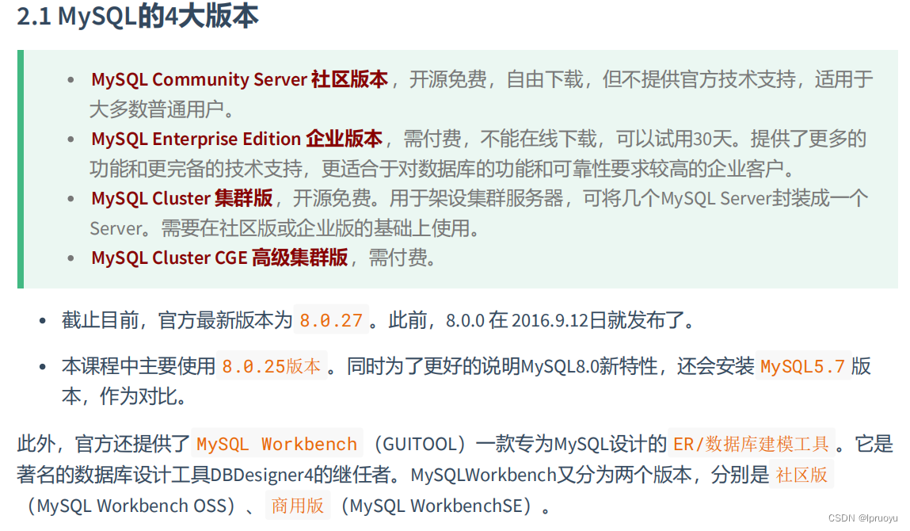
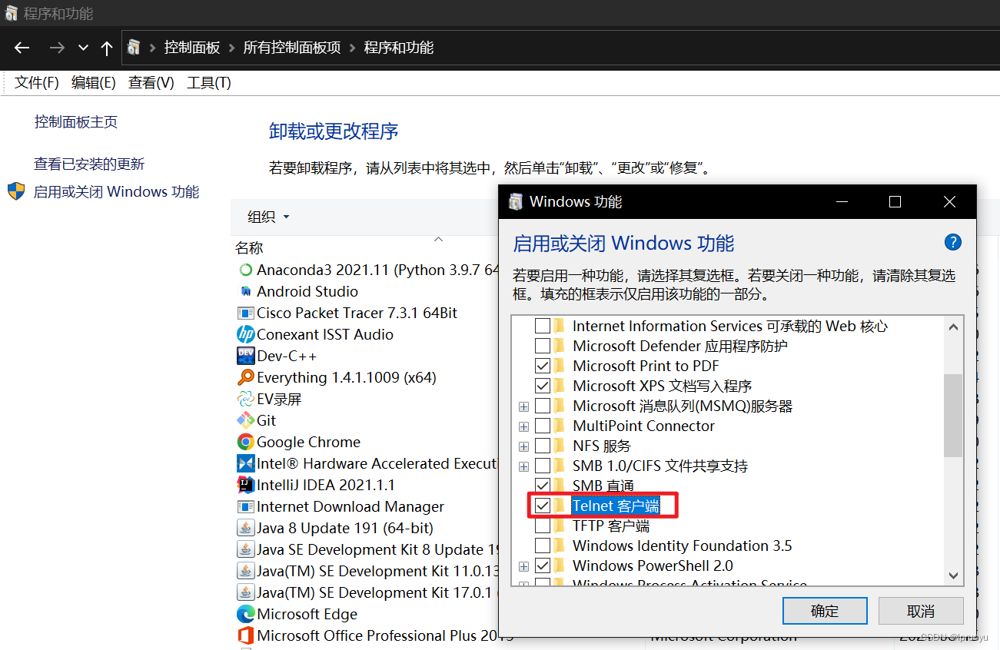

# 第1章-CentOS7下MySQL的安装与使用

## 1.1 Linux下卸载MySQL数据库

* 查看MySQL服务运行状态

```shell
service mysql status
或者
systemctl status mysqld.service
```

* 停止MySQL服务

```shell
service mysql stop
或者
systemctl stop mysqld.service
```

* 查询安装了的MySQL组件

```
rpm -qa | grep -i mysql
或者
yum list installed | grep mysql
```

* 输出：

```
mysql-community-common-5.7.22-1.el7.x86_64
mysql-community-client-5.7.22-1.el7.x86_64
mysql-community-libs-5.7.22-1.el7.x86_64
mysql-community-server-5.7.22-1.el7.x86_64
```

* 卸载并删除MySQL安装的组键服务（如果使用rpm删除不了使用yum删除：yum remove -y mysqlxxxx）

```
rpm -ev --nodeps mysql-community-common-5.7.22-1.el7.x86_64
rpm -ev --nodeps mysql-community-client-5.7.22-1.el7.x86_64
rpm -ev --nodeps mysql-community-libs-5.7.22-1.el7.x86_64
rpm -ev --nodeps mysql-community-server-5.7.22-1.el7.x86_64
```

* 查看MySQL使用的文件夹

```
find / -name mysql
```

* 输出

```
/etc/logrotate.d/mysql
/etc/selinux/targeted/active/modules/100/mysql
/var/lib/mysql
/var/lib/mysql/mysql
/usr/bin/mysql
/usr/lib64/mysql
/usr/share/mysql
```

* 接下来使用rm -rf命令直接删除它们

* 删除my.cnf：

  ```
  rm -rf /etc/my.cnf
  ```

* 删除之后，使用rpm -qa | grep -i mysql检查是否卸载成功，如果没有东西，代表卸载成功。

## 1.2 MySQL的四大版本



* 离线安装MySQL8
  * 从官网上下载好MySQL压缩包提取出必要文件的rpm文件后，上传至Linux：
  * 

```
#  rpm`是Redhat Package Manage缩写，通过RPM的管理，用户可以把源代码包装成以rpm为扩展名的文件形式，易于安装。

# `-i`, --install 安装软件包

# `-v`, --verbose 提供更多的详细信息输出

# `-h`, --hash 软件包安装的时候列出哈希标记 (和 -v 一起使用效果更好)，展示进度条
```

* CentOS7下检查/tmp临时目录权限（必不可少），由于mysql安装过程中，会通过mysql用户在/tmp目录下新建tmp_db文件，所以请给/tmp较大的权限。执行：

```
chmod -R 777 /tmp
```

* 安装前，检查依赖：（如果不存在需要到centos安装盘里进行rpm安装或者使用yum安装：rpm -e postfix mariadb-libs、yum -y install net-tools perl）

```
rpm -qa|grep libaio
rpm -qa|grep net-tools
rpm -qa|grep perl

#安装
yum install -y libaio
yum install -y net-tools
yum install -y perl
```

* 安装ssh

```
#安装 centeros7 可能需要安装的东西
#查看是否安装ssh 连接
rpm -qa|grep openssh
 
yum list installed |grep openssh

#如果显示没有安装可以使用yum install -y openssh-server或yum install -y openssh-clients进行安装 
#编辑配置
vi /etc/ssh/sshd_config

#打开这些内容
Port 22
ListenAddrres 0.0.0.0
PermitRootLogin yes
PasswordAuthentication yes

#然后开启sshd服务，查看ssh进程和端口号
sudo service sshd start   #开启sshd服务
 
ps -ef |grep sshd         #检查sshd进程
 
netstat -an |grep 22      #检查22端口号是否开启监听
 
systemctl status sshd     #查看ssh服务状态是否开启

#设置开机自启动ssh服务
systemctl enable sshd.service    #设置开机自启动服务
 
systemctl list-unit-files |grep sshd    #查看是否开启sshd服务自启动
 
chkconfig sshd on  #设置ssh服务为开机启动命令

#设置ssh服务禁止开机自启动命令
chkconfig sshd off  
 
service sshd stop   #停止ssh服务命令

#查看主机ip，可以用ifconfig命令，但有可能ifconfig命令没装。
ip add

```

* 网络ip分配

```
#输入命令: 
ip addr
#没有看到ens33 intent

#进入到
cd /etc/sysconfig/network-scripts

#编辑，centeros 没有vim命令，就用vi
vi /etc/sysconfig/network-scripts/ifcfg-ens33

#修改 ONBOOT=yes

#重启网络
sudo service network restart

#再查看
ip addr

#ens33 中有intent 就是ip地址

```

* 关闭防火墙

```
#防火墙操作
1、命令行界面输入命令“systemctl status firewalld.service”并按下回车键。

2、然后在下方可度以查看得到“active（running）”，此时说明防火墙已经被打开了。

3、在命令行中输入systemctl stop firewalld.service命令，进行关闭防火墙。

4、然后再使用命令systemctl status firewalld.service，在下方出现disavtive（dead），这权样就说明防火墙已经关闭。

5、再在命令行中输入命令“systemctl disable firewalld.service”命令，即可永久关闭防火墙。
```

* 在mysql的安装文件目录下执行：（必须按照顺序执行，5.7的版本不执行client-plugins）

```
rpm -ivh mysql-community-common-8.0.25-1.el7.x86_64.rpm
rpm -ivh mysql-community-libs-8.0.25-1.el7.x86_64.rpm
rpm -ivh mysql-community-client-plugins-8.0.25-1.el7.x86_64.rpm
rpm -ivh mysql-community-client-8.0.25-1.el7.x86_64.rpm
rpm -ivh mysql-community-server-8.0.25-1.el7.x86_64.rpm

#mysql5.7执行，也是需要一出mysql-libs,yum remove mysql-libs   16  yum remove mysql-libs
yum remove mysql-libs
rpm -ivh mysql-community-common-5.7.28-1.el7.x86_64.rpm
rpm -ivh mysql-community-libs-5.7.28-1.el7.x86_64.rpm
rpm -ivh mysql-community-client-5.7.28-1.el7.x86_64.rpm
rpm -ivh mysql-community-server-5.7.28-1.el7.x86_64.rpm
```

* 注意：若存在mariadb-libs问题，则执行yum remove mysql-libs即可

* 查看MySQL版本：

  ```
  mysql --version 
  #或
  mysqladmin --version
  ```

启动MySQL服务：systemctl start mysqld

* 初始化MySQL服务：

* ```
  mysqld --initialize --user=mysql
  
  
  #mysql5.7初始化报错
  #2020-06-17T09:34:22.743103Z 0 [ERROR] --initialize specified but the data directory has files in it.Aborting.
  #2020-06-17T09:34:22.743171Z 0 [ERROR] Aborting
  #因为数据文件目录有其他的文件，这个data目录应该是一个空目录。
  #解决方案：我们查看下 /etc/my.cnf 文件里面的datadir目录是哪个，然后把目录下的文件删除。
  datadir=/var/lib/mysql
  #把这个目录下的文件全部删除，然后再初始化。
  
  说明： –initialize 选项默认以“安全”模式来初始化，则会为 root 用户生成一个密码并将该密码标记为过期，登录后你需要设置一个新的密码。生成的临时密码会往日志中记录一份。
  ```

* 启动MySQL服务：

  ```
  systemctl start mysqld
  
  #查看mysql状态
  systemctl status mysqld
  ```

* 设置数据库开机启动：

  ```
  systemctl enable mysqld
  
  #查看是否开启自启动
  systemctl list-unit-files|grep mysqld.service
  ```

* 查看临时密码：

  ```
  grep 'temporary password' /var/log/mysqld.log
  ```

* 登录账户修改密码：mysql -uroot -p'临时密码'、ALTER USER 'root'@'localhost' IDENTIFIED BY '密码'
  PS：mysql5.7增加了安全级别，密码必须包含：大小写字母、数字和特殊符号，并且长度不能少于8位。（例如：$MySQL8_01）

  ```
  #mysql5.7如果初始化密码报错
  #ERROR 1819 (HY000): Your password does not satisfy the current policy requirements
  #可以执行语句
  set global validate_password_policy=LOW;
  set global validate_password_length=6;
  #进行修改后再设置密码
  
  #mysql8.0如果初始化密码报错
  #需要先修改一个密码登陆进去之后，再修改
  set global validate_password.policy=LOW;
  set global validate_password.length=6;
  #设置完后再修改密码
  ```

* 修改后，输入quit或者exit退出，使用新密码即可登录。一般不重启MySQL服务systemctl restart mysqld，重启后设置的全局变量就没有了，要么持久化全局变量。

## 1.3 MySQL服务命令

* 查看进程

```
netstat -ntlp
或者
ps -ef | grep -i mysql
```

* 启动MySQL，查看状态

```
#加不加.service后缀都可以 
启动：systemctl start mysqld.service 
关闭：systemctl stop mysqld.service 
重启：systemctl restart mysqld.service 
查看状态：systemctl status mysqld.service
```

* 查看MySQL服务是否自启动

```
systemctl list-unit-files|grep mysqld.service
```

* 如不是enabled可以运行如下命令设置自启动

```
systemctl enable mysqld.service
```

* 如果希望不进行自启动，运行如下命令设置

```
systemctl disable mysqld.service
```

## 1.4 设置远程登录MySQL

**确保网络连接**

* 在装有Navicat的机器上使用ping 装有MySQL的机器的ip地址保证网络畅通

* 在装有Navicat的机器上使用telnet 装有MySQL的机器的ip地址 端口号命令保证端口号开放访问

* Windows开启telnet命令：

  

**方式一：关闭防火墙**

* CentOS6 ：

```
service iptables stop
```

* CentOS7：

```
#加不加.service都行
#开启防火墙
systemctl start firewalld.service
#查看防火墙状态
systemctl status firewalld.service
#关闭防火墙
systemctl stop firewalld.service
#设置开机启用防火墙 
systemctl enable firewalld.service 
#设置开机禁用防火墙 
systemctl disable firewalld.service
```

**方式二：开放端口**

* 查看开放的端口号

```
firewall-cmd --list-all
```

* 设置开放的端口号

```
firewall-cmd --add-service=http --permanent
firewall-cmd --add-port=3306/tcp --permanent
```

* 重启防火墙

```
firewall-cmd --reload
```

* 开放远程登录权限

```
use mysql;
select Host,User from user;
update user set host = '%' where user ='root';
flush privileges;
```

* %是个通配符 ，如果Host=192.168.1.%，那么就表示只要是IP地址前缀为“192.168.1.”的客户端都可以连接。如果Host=%，表示所有IP都有连接权限。

* 注意：在生产环境下不能为了省事将host设置为%，这样做会存在安全问题，具体的设置可以根据生产环境的IP进行设置。

* 远程登录出错

* 如果出现配置新连接报错：错误号码 2058，那么就应该是 MySQL 密码加密方法变了。
* 解决方法一：升级远程连接工具版本
* 解决方法二：

```
ALTER USER 'root'@'%' IDENTIFIED WITH mysql_native_password BY '密码';
```

* 报密码强度错误，#ERROR 1819 (HY000): Your password does not satisfy the current policy requirements

  ```
  #安装密码强度校验,此方法也会注册到元数据，也就是mysql.plugin表中，所以不用担心MySQL重启后插件会失效。
  INSTALL PLUGIN validate_password SONAME 'validate_password.so';
  
  #卸载密码强度校验
  UNINSTALL PLUGIN validate_password;
  ```
```

* MySQL 8.0，引入了服务器组件（Components）这个特性，validate_password插件已用服务器组件重新实现。8.0.25版本的数据库中，默认自动安装validate_password组件。

如果没有安装执行这个命令

​```sql
mysql> show variables like 'validate_password%';
Empty set (0.04 sec)
mysql> SELECT * FROM mysql.component;
ERROR 1146 (42S02): Table 'mysql.component' doesn't exist
```

安装插件后执行命令结果

```sql
mysql> SELECT * FROM mysql.component;
+--------------+--------------------+------------------------------------+
| component_id | component_group_id | component_urn |
+--------------+--------------------+------------------------------------+
| 1 | 1 | file://component_validate_password |
+--------------+--------------------+------------------------------------+
1 row in set (0.00 sec)

mysql> show variables like 'validate_password%';
+--------------------------------------+--------+
| Variable_name | Value |
+--------------------------------------+--------+
| validate_password.check_user_name | ON |
| validate_password.dictionary_file | |
| validate_password.length | 8 |
| validate_password.mixed_case_count | 1 |
| validate_password.number_count | 1 |
| validate_password.policy | MEDIUM |
| validate_password.special_char_count | 1 |
+--------------------------------------+--------+
7 rows in set (0.01 sec)
```

## 1.5 字符集的相关操作

### 1.5.1 修改MySQL5.7字符集

* 在MySQL 8.0版本之前，默认字符集为latin1 ，utf8字符集指向的是utf8mb3 。网站开发人员在数据库设计的时候往往会将编码修改为utf8字符集。如果遗忘修改默认的编码，就会出现乱码的问题。从MySQL8.0开始，数据库的默认编码将改为utf8mb4 ，从而避免上述乱码的问题。

* 查看默认字符集

```sql
show variables like 'character%';
#或
show variables like '%char%';
```

* MySQL 5.7 默认的客户端和服务器都用了latin1 ，不支持中文，保存中文会报错。

* 修改字符集

```shell
vim /etc/my.cnf
#在MySQL5.7或之前的版本中，在文件最后加上中文字符集配置：
character_set_server=utf8

#重新启动MySQL服务
systemctl restart mysqld
#但是原库、原表的设定不会发生变化，参数修改只对新建的数据库生效。
```

* 修改已有库&表字符集的变更

```sql
#修改已创建数据库的字符集
alter database test1 character set 'latin1';

#修改已创建表的字符集
alter table t_emp convert to character set 'utf8';
#原有的数据如果是用非'utf8'编码的话，数据本身编码不会发生改变。已有数据需要导出或删除，然后重新插入。
```

### 1.5.2 各级别的字符集

* MySQL有4个级别的字符集和比较规则，分别是：
  * 服务器级别
  * 数据库级别
  * 表级别
  * 列级别
* 执行如下SQL语句：show variables like 'character%';展示的数据
  * character_set_server：服务器级别的字符集
  * character_set_database：当前数据库的字符集
  * character_set_client：服务器解码请求时使用的字符集
  * character_set_connection：服务器处理请求时会把请求字符串从character_set_client转为character_set_connection
  * character_set_results：服务器向客户端返回数据时使用的字符集

#### 1.5.2.1 服务器级别

* character_set_server ：服务器级别的字符集。

* 我们可以在启动服务器程序时通过启动选项或者在服务器程序运行过程中使用SET 语句修改这两个变量
  的值。比如我们可以在配置文件中这样写：

  ```
  [server]
  character_set_server=gbk # 默认字符集
  collation_server=gbk_chinese_ci #对应的默认的比较规则
  ```

  当服务器启动的时候读取这个配置文件后这两个系统变量的值便修改了。

#### 1.5.2.2 数据库级别

* character_set_database ：当前数据库的字符集
* 我们在创建和修改数据库的时候可以指定该数据库的字符集和比较规则，具体语法如下：

```sql
CREATE DATABASE 数据库名
[[DEFAULT] CHARACTER SET 字符集名称]
[[DEFAULT] COLLATE 比较规则名称];

ALTER DATABASE 数据库名
[[DEFAULT] CHARACTER SET 字符集名称]
[[DEFAULT] COLLATE 比较规则名称];

#如

mysql> create database test2 character set 'latin1';
Query OK, 1 row affected (0.00 sec)

mysql> show create database test2;
+----------+------------------------------------------------------------------+
| Database | Create Database                                                  |
+----------+------------------------------------------------------------------+
| test2    | CREATE DATABASE `test2` /*!40100 DEFAULT CHARACTER SET latin1 */ |
+----------+------------------------------------------------------------------+
1 row in set (0.00 sec)

```

#### 1.5.2.3 表级别

语法如下：

```sql
CREATE TABLE 表名 (列的信息)
[[DEFAULT] CHARACTER SET 字符集名称]
[COLLATE 比较规则名称]]

ALTER TABLE 表名
[[DEFAULT] CHARACTER SET 字符集名称]
[COLLATE 比较规则名称]
```

#### 1.5.2.4 列级别

语法如下：

```sql
CREATE TABLE 表名(
列名 字符串类型 [CHARACTER SET 字符集名称] [COLLATE 比较规则名称],
其他列...
);

ALTER TABLE 表名 MODIFY 列名 字符串类型 [CHARACTER SET 字符集名称] [COLLATE 比较规则名称];
```

**小结：**

- 如果创建或修改列时没有显式的指定字符集和比较规则，则该列默认用表的字符集和比较规则
- 如果创建表时没有显式的指定字符集和比较规则，则该表默认用数据库的字符集和比较规则
- 如果创建数据库时没有显式的指定字符集和比较规则，则该数据库默认用服务器的字符集和比较规则

### 1.5.3 字符集与比较规则

* utf8 与 utf8mb4：MySQL的设计者偷偷的定义了两个概念：
  * utf8mb3 ：阉割过的utf8 字符集，只使用1～3个字节表示字符。
  * utf8mb4 ：正宗的utf8 字符集，使用1～4个字节表示字符。
* 比较规则：
  * MySQL版本一共支持41种字符集，其中的Default collation 列表示这种字符集中一种默认的比较规则，里面包含着该比较规则主要作用于哪种语言，比如utf8_polish_ci 表示以波兰语的规则比较， utf8_spanish_ci 是以西班牙语的规则比较， utf8_general_ci 是一种通用的比较规则。

| 后缀 | 英文释义           | 描述             |
| ---- | ------------------ | ---------------- |
| _ai  | accent insensitive | 不区分重音       |
| _as  | accent sensitive   | 区分重音         |
| _ci  | case insensitive   | 不区分大小写     |
| _cs  | case sensitive     | 区分大小写       |
| _bin | binary             | 以二进制方式比较 |

```sql
#查看GBK字符集的比较规则
SHOW COLLATION LIKE 'gbk%';
#查看UTF-8字符集的比较规则
SHOW COLLATION LIKE 'utf8%';

#查看服务器的字符集和比较规则
SHOW VARIABLES LIKE '%_server';
#查看数据库的字符集和比较规则
SHOW VARIABLES LIKE '%_database';
#查看具体数据库的字符集
SHOW CREATE DATABASE dbtest1;
#修改具体数据库的字符集
ALTER DATABASE dbtest1 DEFAULT CHARACTER SET 'utf8' COLLATE 'utf8_general_ci';

#查看表的字符集
show create table employees;
#查看表的比较规则
show table status from atguigudb like 'employees';
#修改表的字符集和比较规则
ALTER TABLE emp1 DEFAULT CHARACTER SET 'utf8' COLLATE 'utf8_general_ci';
```

### 1.5.4 请求到响应过程中字符集的变化

| 系统变量                 | 描述                                                         |
| ------------------------ | ------------------------------------------------------------ |
| character_set_client     | 服务器解码请求时使用的字符集                                 |
| character_set_connection | 服务器处理请求时会把请求字符串从character_set_client转为character_set_connection |
| character_set_results    | 服务器向客户端返回数据时使用的字符集                         |

## 1.6 SQL大小写规范

### 1.6.1 Windows和Linux平台区别

* 在 SQL 中，关键字和函数名是不用区分字母大小写的，比如 SELECT、WHERE、ORDER、GROUP BY 等关键字，以及 ABS、MOD、ROUND、MAX 等函数名。
* windows系统默认大小写不敏感，但是linux系统是大小写敏感的。

```sql

mysql> SHOW VARIABLES LIKE '%lower_case_table_names%';
+------------------------+-------+
| Variable_name          | Value |
+------------------------+-------+
| lower_case_table_names | 0     |
+------------------------+-------+
1 row in set (0.00 sec)

```

* lower_case_table_names参数值的设置：默认为0，大小写敏感；设置1，大小写不敏感。设置2，创建的表和数据库依据语句上格式存放，凡是查找都是转换为小写进行。

```
MySQL在Linux下数据库名、表名、列名、别名大小写规则是这样的：
1、数据库名、表名、表的别名、变量名是严格区分大小写的；
2、关键字、函数名称在 SQL 中不区分大小写；
3、列名（或字段名）与列的别名（或字段别名）在所有的情况下均是忽略大小写的；
MySQL在Windows的环境下全部不区分大小写
```

### 1.6.2 Linux下大小写规则设置

* 当想设置为大小写不敏感时，要在my.cnf 这个配置文件 [mysqld] 中加入lower_case_table_names=1 ，然后重启服务器。适用于MySQL5.7。
* 但是要在重启数据库实例之前就需要将原来的数据库和表转换为小写，否则将找不到数据库名。
* MySQL8设置为大小写不敏感

```
1、停止MySQL服务
2、删除数据目录，即删除 /var/lib/mysql 目录
3、在MySQL配置文件（ /etc/my.cnf ）中添加 lower_case_table_names=1
4、启动MySQL服务
```

### 1.6.3 SQL编写建议

```
1. 关键字和函数名称全部大写；
2. 数据库名、表名、表别名、字段名、字段别名等全部小写；
3. SQL 语句必须以分号结尾。
```

* 数据库名、表名和字段名在 Linux MySQL 环境下是区分大小写的，因此建议你统一这些字段的命名规则，比如全部采用小写的方式。
* 虽然关键字和函数名称在 SQL 中不区分大小写，也就是如果小写的话同样可以执行。但是同时将关键词和函数名称全部大写，以便于区分数据库名、表名、字段名。

## 1.7 sql_mode的合理设置

* 宽松模式：如果设置的是宽松模式，那么我们在插入数据的时候，即便是给了一个错误的数据，也可能会被接受，并且不报错。比如：name字段为char(10)，插入数据超过10了，例如'1234567890abc'，那么就会截取10位，最后数据是'1234567890'
  * 应用场景：通过设置sql mode为宽松模式，来保证大多数sql符合标准的sql语法，这样应用在不同数据
    库之间进行迁移时，则不需要对业务sql 进行较大的修改。

* 严格模式：数据错误应该报错才对。所以MySQL5.7版本就将sql_mode默认值改为了严格模式。所以在生产等环境中，我们必须采用的是严格模式。

* 查看模式

```sql
select @@session.sql_mode
select @@global.sql_mode
#或者
show variables like 'sql_mode';
```

* 临时设置方式：设置当前窗口中设置sql_mode

```sql
SET GLOBAL sql_mode = 'modes...'; #全局
SET SESSION sql_mode = 'modes...'; #当前会话

#改为严格模式。此方法只在当前会话中生效，关闭当前会话就不生效了。
set SESSION sql_mode='STRICT_TRANS_TABLES';
#改为严格模式。此方法在当前服务中生效，重启MySQL服务后失效。
set GLOBAL sql_mode='STRICT_TRANS_TABLES';
```

* 永久设置方式：在/etc/my.cnf中配置sql_mode，然后重启mysql服务

```
在my.cnf文件(windows系统是my.ini文件)，新增：
[mysqld]
sql_mode=ONLY_FULL_GROUP_BY,STRICT_TRANS_TABLES,NO_ZERO_IN_DATE,NO_ZERO_DATE,ERROR_FOR
_DIVISION_BY_ZERO,NO_ENGINE_SUBSTITUTION
```

* sql_mode常用值


