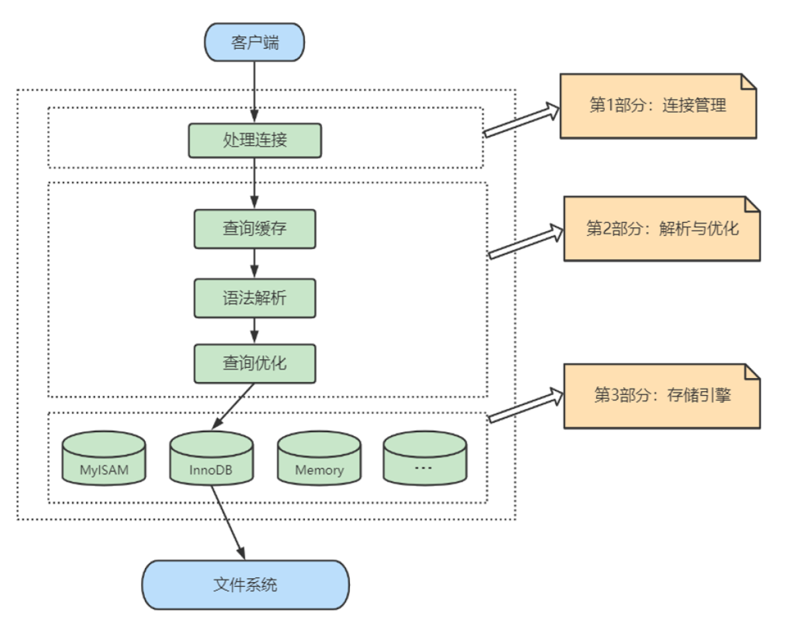
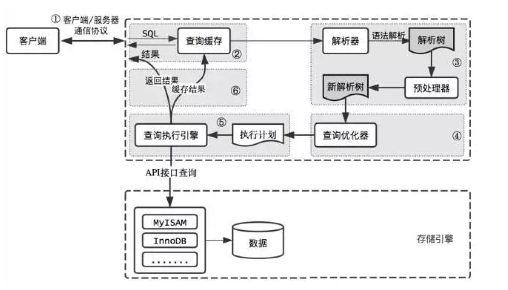
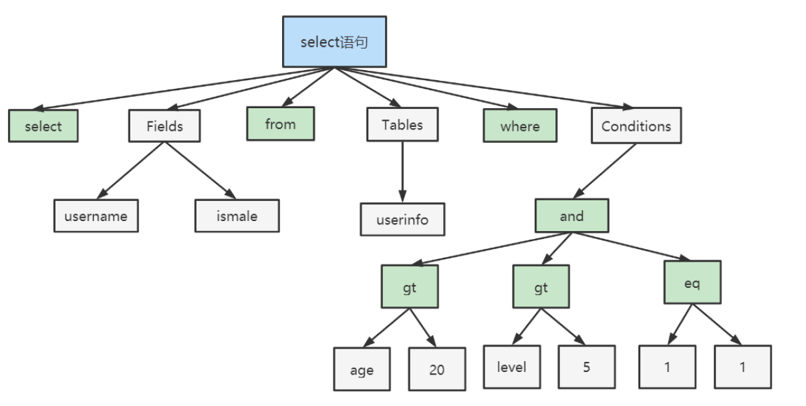
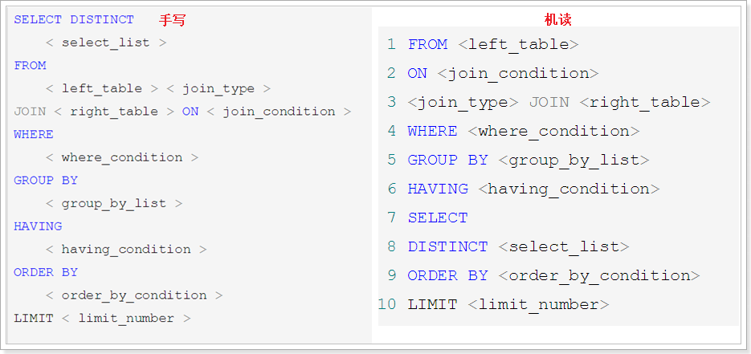
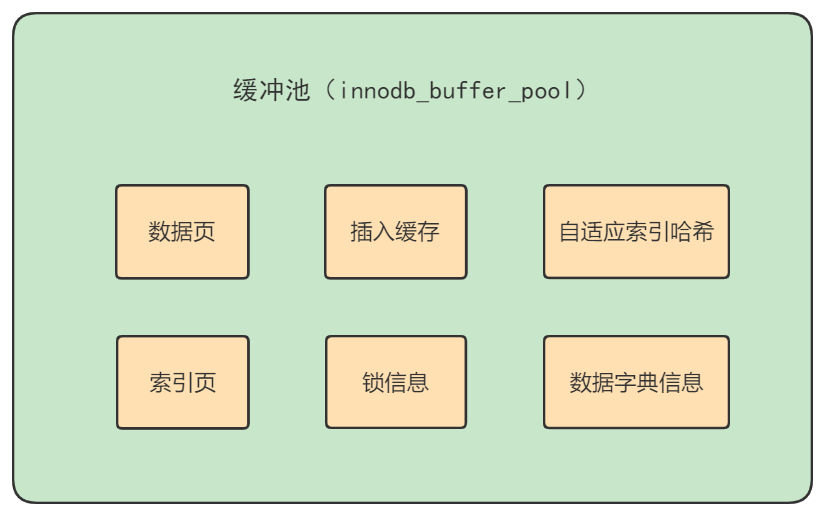
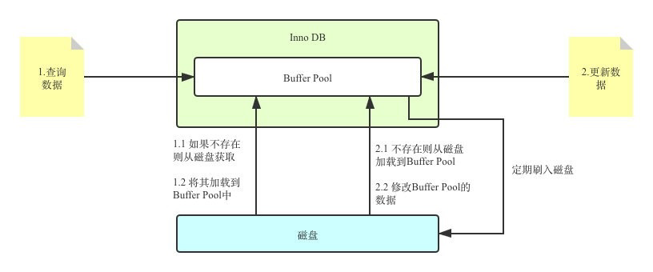

# 第4章-逻辑架构

## 4.1 逻辑架构剖析

### 4.1.1 服务器处理客户端请求

* mysql是c/s架构（Client/Server），服务器程序使用的mysqld。
* 服务器对进程处理流程，查询示例



* 具体的架构图与执行顺序，Caches在8.0中没有了（因为命中太低了）


### 4.1.2 Connectors

* Connectors指的是不同语言中与SQL的交互。不同语言通过SDK访问mysql，本质都是TCP链接，通过mysql协议与MySQL进行交互。

### 4.1.3 连接层

* 系统（客户端）访问MySQL 服务器前，做的第一件事就是建立TCP 连接。
* 经过三次握手建立连接成功后， MySQL 服务器对TCP 传输过来的账号密码做身份认证、权限获取。
  * 用户名或密码不对，会收到一个Access denied for user错误，客户端程序结束执行
  * 用户名密码认证通过，会从权限表查出账号拥有的权限与连接关联，之后的权限判断逻辑，都将依赖于此时读到的权限
* TCP 连接收到请求后，必须要分配给一个线程专门与这个客户端的交互。所以还会有个线程池，去走后面的流程。每一个连接从线程池中获取线程，省去了创建和销毁线程的开销。
* 服务器会维护连接池，以及线程池，线程池用来处理链接发送的请求。

### 4.1.4 服务层

* SQL Interface: SQL接口

  * 接收用户的SQL命令，并且返回用户需要查询的结果。比如SELECT ... FROM就是调用SQL Interface
  * MySQL支持DML（数据操作语言）、DDL（数据定义语言）、存储过程、视图、触发器、自定义函数等多种SQL语言接口

* Parser: 解析器

  * 在解析器中对 SQL 语句进行语法分析、语义分析。将SQL语句分解成数据结构，并将这个结构传递到后续步骤，以后SQL语句的传递和处理就是基于这个结构的。如果在分解构成中遇到错误，那么就说明这个SQL语句是不合理的。
  * 在SQL命令传递到解析器的时候会被解析器验证和解析，并为其创建语法树，并根据数据字典丰富查询语法树，会验证该客户端是否具有执行该查询的权限。创建好语法树后，MySQL还会对SQl查询进行语法上的优化，进行查询重写。

* Optimizer: 查询优化器

  * SQL语句在语法解析之后、查询之前会使用查询优化器确定 SQL 语句的执行路径，生成一个执行计划。
  * 这个执行计划表明应该使用哪些索引进行查询（全表检索还是使用索引检索），表之间的连接顺序如何，最后会按照执行计划中的步骤调用存储引擎提供的方法来真正的执行查询，并将查询结果返回给用户。
  * 它使用“ 选取-投影-连接”策略进行查询。例如：

  ```sql
  SELECT id,name FROM student WHERE gender = '女';
  ```

  * 这个SELECT查询先根据WHERE语句进行选取，而不是将表全部查询出来以后再进行gender过滤。 这个SELECT查询先根据id和name进行属性投影，而不是将属性全部取出以后再进行过滤，将这两个查询条件连接起来生成最终查询结果。

* Caches & Buffers： 查询缓存组件

  * MySQL内部维持着一些Cache和Buffer，比如Query Cache用来缓存一条SELECT语句的执行结果，如果能够在其中找到对应的查询结果，那么就不必再进行查询解析、优化和执行的整个过程了，直接将结果反馈给客户端。
  * 这个缓存机制是由一系列小缓存组成的。比如表缓存，记录缓存，key缓存，权限缓存等 。
  * 这个查询缓存可以在不同客户端之间共享。
  * 从MySQL 5.7.20开始，不推荐使用查询缓存，并在MySQL 8.0中删除。

### 4.1.5 引擎层

* 插件式存储引擎层（ Storage Engines），真正的负责了MySQL中数据的存储和提取，对物理服务器级别维护的底层数据执行操作，服务器通过API与存储引擎进行通信。不同的存储引擎具有的功能不同，这样我们可以根据自己的实际需要进行选取。

* 开源的MySQL允许开发人员设置自己的存储引擎。
* MySQL 8.0.25默认支持的存储引擎

### 4.1.6 存储层

* 所有的数据，数据库、表的定义，表的每一行的内容，索引，都是存在文件系统上，以文件的方式存在的，并完成与存储引擎的交互。当然有些存储引擎比如InnoDB，也支持不使用文件系统直接管理裸设备，但现代文件系统的实现使得这样做没有必要了。在文件系统之下，可以使用本地磁盘，可以使用DAS、NAS、SAN等各种存储系统。

## 4.2 SQL执行流程

### 4.2.1 MySQL中的SQL执行流程



* 查询缓存：Server 如果在查询缓存中发现了这条 SQL 语句，就会直接将结果返回给客户端；如果没有，就进入到解析器阶段。需要说明的是，因为查询缓存往往效率不高，所以在 MySQL8.0 之后就抛弃了这个功能。
  * MySQL 中的查询缓存，不是缓存查询计划，而是查询对应的结果
  * 两个查询请求在任何字符上的不同（例如：空格、注释、大小写），都会导致缓存不会命中。因此MySQL 的查询缓存命中率不高。
  * 查询请求中包含某些系统函数、用户自定义变量和函数、一些系统表，如 mysql 、information_schema、 performance_schema 数据库中的表，那这个请求就不会被缓存。因为每次查询的可能不一样，比如NOW函数。
  * 缓存有失效时候，如果表结果或者数据修改都会导致缓存失效，所以mysql的查询缓存命中率会很低。
  * 一般静态表才使用静态缓存，极少更新的数据。

```sql
#mysql5.7中需要开启缓存，设置query_cache_type，0表示关闭，1表示开启，2表示DEMAND，SQL语句中是SQL_CACHE关键字缓存。
#mysql5.7默认也是关闭的，mysql8.0执行没有数据。
mysql>  show variables like '%query_cache_type%';
+------------------+-------+
| Variable_name    | Value |
+------------------+-------+
| query_cache_type | OFF   |
+------------------+-------+
1 row in set (0.14 sec)

#使用sql缓存,会存储到缓存中，取的时候优先从缓存中取。
select SQL_CACHE * FROM test WHERE ID=5;
#不使用sql缓存
select SQL_NO_CACHE * FROM test WHERE ID=5;

#查询缓存命中率
mysql> show status like '%Qcache%';
+-------------------------+---------+
| Variable_name           | Value   |
+-------------------------+---------+
| Qcache_free_blocks      | 1       |
| Qcache_free_memory      | 1031832 |
| Qcache_hits             | 0       |
| Qcache_inserts          | 0       |
| Qcache_lowmem_prunes    | 0       |
| Qcache_not_cached       | 1       |
| Qcache_queries_in_cache | 0       |
| Qcache_total_blocks     | 1       |
+-------------------------+---------+
#Qcache_free_blocks：表示查询缓存中还有多少剩余的blocks，值越大，则内存碎片过多了，可能在一定时间进行整理
#Qcache_free_memory：查询缓存的空闲内存大小，值越大，利用率越低。
#Qcache_hits ：多少次命中缓存
#Qcache_inserts：添加到缓存中的查询数据。
#Qcache_lowmem_prunes：有多少次查询是因为内存不足一处掉的。
#Qcache_not_cached：没有被缓存的查询数量。
#Qcache_queries_in_cache ：当前缓存中有多少查询缓存。
#Qcache_total_blocks：总的缓存blocks大小
```


* 解析器：在解析器中对 SQL 语句进行语法分析、语义分析。
  * 分析器先做“ 词法分析”。标识字符串分别是什么代表什么。
  * 接着做“ 语法分析”。根据词法分析的结果，语法分析器（比如：Bison）会根据语法规则，判断你输入的这个 SQL 语句是否满足 MySQL 语法。
  * 如果SQL语句正确，则生成语法树



* 优化器：在优化器中会确定 SQL 语句的执行路径，比如是根据全表检索，还是根据索引检索等。
  * 在查询优化器中，可以分为逻辑查询优化阶段和物理查询优化阶段。
  * 物理查询优化通过索引和表链接方式进行优化，这是重点内容。
  * 逻辑优化是通过SQL等价变换提升查询效率，即换一种写法执行效率可能更高。
* 执行器：上面的结果产生执行计划，到这里才真正的需要执行。
  * 在执行之前需要判断该用户是否具备权限。如果没有，就会返回权限错误。如果具备权限，就执行 SQL查询并返回结果。在 MySQL8.0 以下的版本，如果设置了查询缓存，这时会将查询结果进行缓存。
  * 有权限，执行器根据表的引擎定义，调用存储引擎API进行读写。

### 4.2.2 MySQL8中SQL执行原理

#### 4.2.2.1 确认profiling 是否开启

* profile原型轮廓的意思：第三人称单数：profiles 复数：profiles 现在分词：profiling 过去式：profiled 过去分词：profiled

* 了解查询语句底层执行过程，需要开启执行过程。

```sql
#查询是否开启执行计划,三个语句都行
#查询全局变量，没有再找session变量
select @@profiling;
#执行查找session变量
select @@session.profiling;
#显示全局变量
show variables like 'profiling';

#开启执行过程
set profiling =1;
#执行两次查询语句
select * from employees;

#显示所有执行过程
mysql> show profiles;
+----------+------------+-------------------------+
| Query_ID | Duration   | Query                   |
+----------+------------+-------------------------+
|        1 | 0.00015750 | select * from employees |
|        2 | 0.00097800 | show databses           |
|        3 | 0.00062075 | show databases          |
|        4 | 0.00010450 | SELECT DATABASE()       |
|        5 | 0.00012950 | SELECT DATABASE()       |
|        6 | 0.00021050 | show databases          |
|        7 | 0.00046950 | show tables             |
|        8 | 0.00031425 | select * from employees |
|        9 | 0.00039125 | select * from employees |
+----------+------------+-------------------------+
9 rows in set, 1 warning (0.00 sec)

#显示最后一条执行过程
mysql> show profile;
+----------------------+----------+
| Status               | Duration |
+----------------------+----------+
| starting             | 0.000101 |#开始
| checking permissions | 0.000006 |#检查权限
| Opening tables       | 0.000033 |#打开表
| init                 | 0.000016 |#初始化
| System lock          | 0.000007 |#系统锁
| optimizing           | 0.000003 |
| statistics           | 0.000009 |
| preparing            | 0.000007 |
| executing            | 0.000002 |
| Sending data         | 0.000176 |
| end                  | 0.000003 |
| query end            | 0.000005 |
| closing tables       | 0.000005 |
| freeing items        | 0.000012 |
| cleaning up          | 0.000008 |
+----------------------+----------+
15 rows in set, 1 warning (0.00 sec)


#根据queryid查询指定执行计划
mysql> show profile for query 8;
+----------------------+----------+
| Status               | Duration |
+----------------------+----------+
| starting             | 0.000059 |
| checking permissions | 0.000006 |
| Opening tables       | 0.000014 |
| init                 | 0.000017 |
| System lock          | 0.000006 |
| optimizing           | 0.000003 |
| statistics           | 0.000008 |
| preparing            | 0.000007 |
| executing            | 0.000002 |
| Sending data         | 0.000156 |
| end                  | 0.000004 |
| query end            | 0.000006 |
| closing tables       | 0.000005 |
| freeing items        | 0.000013 |
| cleaning up          | 0.000010 |
+----------------------+----------+
15 rows in set, 1 warning (0.00 sec)

#还可以显示cpu使用扫描block数


mysql> show profile cpu,block io for query 8;
+----------------------+----------+----------+------------+--------------+---------------+
| Status               | Duration | CPU_user | CPU_system | Block_ops_in | Block_ops_out |
+----------------------+----------+----------+------------+--------------+---------------+
| starting             | 0.000059 | 0.000015 |   0.000040 |            0 |             0 |
| checking permissions | 0.000006 | 0.000001 |   0.000004 |            0 |             0 |
| Opening tables       | 0.000014 | 0.000004 |   0.000010 |            0 |             0 |
| init                 | 0.000017 | 0.000004 |   0.000012 |            0 |             0 |
| System lock          | 0.000006 | 0.000002 |   0.000005 |            0 |             0 |
| optimizing           | 0.000003 | 0.000001 |   0.000002 |            0 |             0 |
| statistics           | 0.000008 | 0.000002 |   0.000006 |            0 |             0 |
| preparing            | 0.000007 | 0.000002 |   0.000005 |            0 |             0 |
| executing            | 0.000002 | 0.000000 |   0.000001 |            0 |             0 |
| Sending data         | 0.000156 | 0.000042 |   0.000116 |            0 |             0 |
| end                  | 0.000004 | 0.000001 |   0.000002 |            0 |             0 |
| query end            | 0.000006 | 0.000001 |   0.000004 |            0 |             0 |
| closing tables       | 0.000005 | 0.000001 |   0.000004 |            0 |             0 |
| freeing items        | 0.000013 | 0.000004 |   0.000009 |            0 |             0 |
| cleaning up          | 0.000010 | 0.000002 |   0.000007 |            0 |             0 |
+----------------------+----------+----------+------------+--------------+---------------+
15 rows in set, 1 warning (0.00 sec)

```

#### 4.2.2.2 查看profile

格式：

```sql
SHOW PROFILE [type,type1,..] [FOR QUERY n] [LIMIT rou_count [OFFSET offset]]

type值有：
ALL 显示所有参数的开销信息
BLOCK IO 显示IO的开销
CONTEXT SWITHCES 上下文切换开销
CPU cpu开销
IPC 发送和接受开销
MEMORY 内存开销
PAGE FAULTS 页面错误开销
SOURCE 显示和Source_function,Source_file，Source_line相关的开销信息
SWAPS 显示交换次数相关的开销信息
```

### 4.2.3 MySQL5.7中SQL执行原理

* 配置文件中开启查询缓存

```
#在 /etc/my.cnf 中新增一行：
query_cache_type=1
#重启mysql服务
systemctl restart mysqld
```

* 开启查询执行计划

```
mysql> set profiling=1;
```

* 执行语句两次

```
select * from employees;
select * from employees;
```

* 查询执行过程

```sql
mysql> show profiles;
+----------+------------+-------------------------+
| Query_ID | Duration   | Query                   |
+----------+------------+-------------------------+
|        1 | 0.00047650 | select * from employees |
|        2 | 0.00031725 | select * from employees |
+----------+------------+-------------------------+
2 rows in set, 1 warning (0.00 sec)

mysql> show profile for query 1;
+--------------------------------+----------+
| Status                         | Duration |
+--------------------------------+----------+
| starting                       | 0.000024 |
| Waiting for query cache lock   | 0.000003 |
| starting                       | 0.000002 |
| checking query cache for query | 0.000037 |
| checking permissions           | 0.000007 |
| Opening tables                 | 0.000097 |
| init                           | 0.000036 |
| System lock                    | 0.000008 |
| Waiting for query cache lock   | 0.000002 |
| System lock                    | 0.000034 |
| optimizing                     | 0.000003 |
| statistics                     | 0.000008 |
| preparing                      | 0.000008 |
| executing                      | 0.000002 |
| Sending data                   | 0.000157 |
| end                            | 0.000003 |
| query end                      | 0.000005 |
| closing tables                 | 0.000005 |
| freeing items                  | 0.000005 |
| Waiting for query cache lock   | 0.000002 |
| freeing items                  | 0.000016 |
| Waiting for query cache lock   | 0.000002 |
| freeing items                  | 0.000002 |
| storing result in query cache  | 0.000002 |
| cleaning up                    | 0.000009 |
+--------------------------------+----------+
25 rows in set, 1 warning (0.00 sec)

mysql> show profile for query 2;
+--------------------------------+----------+
| Status                         | Duration |
+--------------------------------+----------+
| starting                       | 0.000019 |
| Waiting for query cache lock   | 0.000003 |
| starting                       | 0.000002 |
| checking query cache for query | 0.000193 |
| checking privileges on cached  | 0.000013 |
| checking permissions           | 0.000048 |
| sending cached result to clien | 0.000034 |
| cleaning up                    | 0.000006 |
+--------------------------------+----------+
8 rows in set, 1 warning (0.00 sec)

```

* 命中了缓存效率提升

### 4.2.4 QL语法顺序



### 4.2.5 Oracle中的SQL执行流程

* Oracle 中采用了共享池来判断 SQL 语句是否存在缓存和执行计划，通过这一步骤我们可以知道应该采用硬解析还是软解析。
* SQL执行步骤
  * 语法检查：检查 SQL 拼写是否正确，如果不正确，Oracle 会报语法错误。
  * 语义检查：检查 SQL 中的访问对象是否存在。比如我们在写 SELECT 语句的时候，列名写错了，系统就会提示错误。语法检查和语义检查的作用是保证 SQL 语句没有错误。
  * 权限检查：看用户是否具备访问该数据的权限。
  * 共享池检查：共享池（Shared Pool）是一块内存池，最主要的作用是缓存 SQL 语句和该语句的执行计划。Oracle 通过检查共享池是否存在 SQL 语句的执行计划，来判断进行软解析，还是硬解析。
    * 首先对 SQL 语句进行 Hash 运算，然后根据 Hash 值在库缓存（Library Cache）中查找，如果存在 SQL 语句的执行计划，就直接拿来执行，直接进入“执行器”的环节，这就是软解析。
    * 如果没有找到 SQL 语句和执行计划，Oracle 就需要创建解析树进行解析，生成执行计划，进入“优化器”这个步骤，这就是硬解析。
  * 共享池是 Oracle 中的术语，包括了库缓存，数据字典缓冲区等。
    * 库缓存区，它主要缓存 SQL 语句和执行计划。
    * 数据字典缓冲区存储的是 Oracle 中的对象定义，比如表、视图、索引等对象
  * Oracle可以使用绑定变量来减少硬解析，减少 Oracle 的解析工作量。这种方式使用动态 SQL 的方式，因为参数不同，会导致 SQL 的执行效率不同，同时 SQL 优化也会比较困难。

## 4.3 数据库缓冲池（buffer pool）

* 数据库占用内存来作为数据缓冲池，访问数据时需要把磁盘的的数据缓存到buffer pool才可以访问。
* 可以减少与磁盘直接进行I/0时间。

### 4.3.1 缓冲池 vs 查询缓存

* 缓冲池和查询缓存不是一个东西。

#### 4.3.1.1缓冲池

* InnoDB 缓冲池包括了数据页、索引页、插入缓冲、锁信息、自适应 Hash 和数据字典信息等。



* 缓存池的重要性：省去磁盘IO，提升效率。
* 缓存原则：“ 位置 * 频次”这个原则，优先对使用频次高的热数据进行加载。
* 缓冲池的预读特性：读取数据时存在局部性原来，有些数据大概率会使用它周围的一些数据，采用预读机制提前加载，可以减少未来可能的磁盘I/O操作。 

#### 4.3.1.2 查询缓存

* 查询缓存是提前把查询结果缓存起来，这样下次不需要执行就可以直接拿到结果。
* mysql8.0去掉了查询缓存。

###  4.3.2 缓冲池如何读取数据

* 缓冲池管理器会尽量将经常使用的数据保存起来，在数据库进行页面读操作的时候，首先会判断该页面是否在缓冲池中，如果存在就直接读取，如果不存在，就会通过内存或磁盘将页面存放到缓冲池中再进行读取。
* 缓存在数据库中的结构和作用如下图所示：


* 数据更新时，先更新缓冲池中的数据，然后再以一定频率刷新到磁盘中。

### 4.3.3 查看/设置缓冲池的大小

* 查看缓冲池大小
* InnoDB 的缓冲池大小只有 134217728/1024/1024=128MB。

```sql
mysql> show variables like 'innodb_buffer_pool_size';
+-------------------------+-----------+
| Variable_name           | Value     |
+-------------------------+-----------+
| innodb_buffer_pool_size | 134217728 |
+-------------------------+-----------+
1 row in set (0.00 sec)

```

* 设置缓冲池大小

```sql
set global innodb_buffer_pool_size = 268435456;

#或修改etc/my.cnf文件
[server]
innodb_buffer_pool_size = 268435456
```

### 4.3.4 多个Buffer Pool实例

* 并发访问单个Buffer Pool效率低，因为访问Buffer Pool需要加锁操作。拆分成多个可以提高效率。
* Buffer Pool不是越多越好，管理Buffer Pool也需要性能开销，InnoDB规定，innodb_buffer_pool_size小于1G时设置多个实例无效。只有大于等于1G时设置多个Buffer Pool实例。

```sql
#修改etc/my.cnf文件，表示创建两个Buffer Pool 实例
[server]
innodb_buffer_pool_instances = 2

#查询Buffer Pool 实例
show variables like 'innodb_buffer_pool_instances';
```

* 每个Buffer Pool 实例时间占用空间=innodb_buffer_pool_size/innodb_buffer_pool_instances

### 4.3.5 Buffer Pool数据刷新问题

* 数据更新到一半突然发生错误了，缓存和磁盘数据不一致，还未刷新到磁盘，需要回滚到更新之前的版本，使用Redo Log & Undo Log进行操作。
* 黑盒下的更新数据流程


