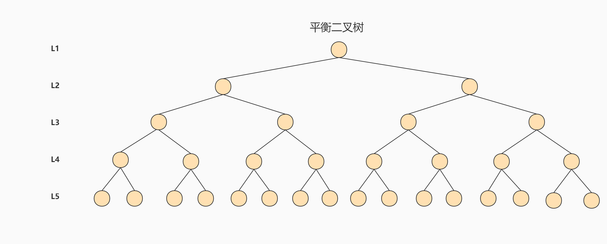

# 第6章-索引的数据结构

## 6.1为什么使用索引

* 索引时存储引擎用于快速找到数据记录的一种数据结构。
* 没有索引的情况下，数据分布再磁盘不同位置，读取时非常消耗时间，如果数据量大，会进行很多次磁盘I/0。
* 数据不规则-->顺序排列-->二叉树，这样根据数据进化，可以提升查询效率。
* 二叉树数据结构简化模型


## 6.2 索引及其优缺点

### 6.2.1 索引概述

* MySQL官方对索引的定义为：索引（Index）是帮助MySQL高效获取数据的数据结构。
* 索引的本质：索引是数据结构。
* 索引时存储引擎中实现的，每种存储引擎索引不一定完全相同。存储引擎可以定义每个表的最大所引数和最大索引长度。所有存储引擎支持每个表至少16个索引，总索引长度至少256字节。

### 6.2.2 优点

* 提高数据检索的效率，降低数据库的IO成本。
* 创建唯一索引，可以保证数据库表中每一行数据的唯一性。
* 在实现数据的参考完整性方面，可以加速表和表之间的连接。即：有依赖关系的子表和父表联合查询时，可以提高查询速度。
* 在使用分组和排序子句进行数据查询时，可以显著减少查询中分组和排序的时间，降低了CPU的消耗。（因为排好序了分组和排序都容易查询）

### 6.2.3 缺点

* 创建索引和维护索引要耗费时间，并且随着数据量的增加，所耗费的时间也会增加。
* 索引需要占磁盘空间，除了数据表占数据空间之外，每一个索引还要占一定的物理空间， 存储在磁盘上，如果有大量的索引，索引文件就可能比数据文件更快达到最大文件尺寸。
* 虽然索引大大提高了查询速度，同时却会降低更新表的速度。

小技巧：当数据需要大量的更新或删除、插入时，可以先删除索引，写完数据后，再创建索引。

## 6.3 InnoDB中索引的推演

### 6.3.1 数据查找

```sql
SELECT [列名列表] FROM 表名 WHERE 列名 = xxx;
```

* 数据存储在磁盘上时一页一页的
  * 数据量少时，在一个页中的查找
    * 以主键为搜索条件，通过页二分法查找，快速找到数据。
    * 其他列为搜索条件，只能一条一条数据遍历。
  * 数据量大时，在很多页中查找
    * 定位到记录所在的页
    * 从所在的页中查找相应的记录。
* 在没有索引的情况下，不论是根据主键列或者其他列的值进行查找，由于我们并不能快速的定位到记录所在的页，所以只能从第一个页沿着双向链表一直往下找，在每一个页中根据我们上面的查找方式去查找指定的记录。因为要遍历所有的数据页，所以这种方式显然是超级耗时的。如果一个表有一亿条记录呢？此时索引应运而生。

### 6.3.2 设计索引

* 建一个表

```sql
mysql> CREATE TABLE index_demo(
-> c1 INT,
-> c2 INT,
-> c3 CHAR(1),
-> PRIMARY KEY(c1)
-> ) ROW_FORMAT = Compact;
```

* InnoDB中使用Compact 行格式来实际存储记录的。简化示意图
  * record_type记录类型，0表示普通，2表示最小记录，3表示最大记录，
  * next_record下一条记录的地址
  * c1、c2、c3是数据库字段。
  * 其他信息：额外的信息


* 数据按照C1主键顺序存入页中


* 当页中数据存不下时，就要分页。分页时需要挪动页中数据，保证数据页中时递增的关系。多个数据页再抽取数据页中最小值与数据页的关系作为目录页，目录页也按照顺序排列。这个简易的目录页就是索引。


**InnoDB中的索引方案**

* 迭代1次：目录项记录的页
  * 只有一个目录页-->页30
  * 目录页与数据页不同：目录项记录的record_type 值是1，而数据页记录的record_type 值是0。目录项记录只有主键值和页的编号两个列，而数据页可能有多个列。如下图所示
  * 因为目录页和数据页存储了主键，所以使用二分法查找主键可以加快速度查找。


* 迭代2次：多个目录项记录的页
  * 单个目录页存不下时，会生再生成一条目录页。
  * 目录页只存储最小的主键ID和数据页编号。
  * 多个目录页按主键顺序排列


* 迭代3次：目录项记录页的目录页
  * 当一个目录页存不下目录数据时，会再次抽取更上层的目录页。


* 最后得到的结果，这种数据结构就是B+树
  * 一个B+树的节点其实可以分成好多层，规定最下边的那层，也就是存放我们用户记录的那层为第0 层。
  * 用到的B+树都不会超过4层
    * 假如用户数据页只能存储100条记录。目录页只存储主键和页目录，存储能力更好，所以假设目录页存储1000条记录
    * 2层数据存储的记录就是100X1000=10万条记录
    * 3层数据存储的记录就是100X1000X1000=1亿条记录
    * 4层数据存储的记录就是100X1000x1000X1000=1000亿条记录
  * B+树目录一般不会超过4层，所以用二分法查找一般只在4个目录中查找，每个页再用二分法查找，速度很快。


### 6.3.3 常见索引概念

索引按照物理实现方式，索引可以分为 2 种：

* 聚簇（聚集）

* 非聚簇（非聚集）索引。我们也把非聚集索引称为二级索引或者辅助索引。

#### 6.3.3.1聚簇索引

* （目录页和数据页中的记录）页内的记录是按照主键的大小顺序排成一个单向链表。
* （页与页之间）各个存放用户记录的页也是根据页中用户记录的主键大小顺序排成一个双向链表。
* （同一个层级页与页之间）存放目录项记录的页分为不同的层次，在同一层次中的页也是根据页中目录项记录的主键大小顺序排成一个双向链表。
* **B+树的叶子节点存储的是完整的用户记录。**

* 优点
  * 数据访问更快，因为数据就在叶子节点中，无需额外再去查找数据。
  * 主键的排序查找和范围查找速度非常快。
  * 节省了大量的io操作，数据都是紧密相连，数据库不用从多个数据块中提取数据。
* 缺点
  * 插入速度严重依赖于插入顺序。所以对于InnoDB表，我们一般都会定义一个自增的ID列为主键
  * 更新主键的代价很高，因为需要修改索引排序。
  * 二级索引访问需要两次索引查找，第一次找到主键值，第二次根据主键值找到行数据。

#### 6.3.3.2 二级索引（辅助索引、非聚簇索引）

* 回表：我们根据一个非聚簇索引列大小排序的B+树只能确定我们要查找记录的主键值，所以如果我们想根据这个列的值查找到完整的用户记录的话，仍然需要到聚簇索引中再查一遍，这个过程称为回表。
* 为什么我们还需要一次回表操作呢？直接把完整的用户记录放到叶子节点不OK吗？这会造成数据冗余，数据量增大，也不方便更新。

#### 6.3.3.3 联合索引

* 按照多列进行排序，如果第一列时一样，就用后面的列进行排序，以此类推。
* 联合索引也只会创建1棵B+树。

### 6.3.4 InnoDB的B+树索引的注意事项

- 根页面位置万年不动。有新数据就往下复制数据，创建新的节点。根节点相当于升级加薪。
- 内节点中目录项记录的唯一性，才能保证数据添加往哪个位置添加，一般使用索引列+主键方式确保唯一。
- 一个页面最少存储2条记录。这才是能是分叉树。

## 6.4 MyISAM中的索引方案

| 索引 / 存储引 | MyISAM | InnoDB | Memory |
| ------------- | ------ | ------ | ------ |
| B-Tree索引    | 支持   | 支持   | 支持   |

* 即使多个存储引擎支持同一种类型的索引，但是他们的实现原理也是不同的。Innodb和MyISAM默认的索引是B+tree索引；而Memory默认的索引是Hash索引
* MyISAM引擎使用B+Tree 作为索引结构，叶子节点的data域存放的是数据记录的地址值。
* MyISAM的索引都是二级索引，没有聚簇索引。

**MyISAM与InnoDB对比**

* InnoDB通过主键查找时，可以直接找到数据。而MyISAM存储的时地址值，都需要回表操作。
* InnoDB主键索引就是数据，MyISAM数据与索引是分离的
* InnoDB的二级索引（非聚簇索引）都是存储的主键值，回表时是去查主键索引，MyISAM所有的索引都是存储的地址值。
* InnoDB的回表是查主键索引不慢，但是比不上MyISAM回表，MyISAM回表是地址偏移值所以很快。
* InnoDB必须要主键，如果没有显示指定，会默认生成一个。MyISAM可以没有主键。

**小结**

* InnoDB主键会存储到二级索引中，所以主键最好是单一的，存储量不要太大。
* 索引维护消耗很大，所以一般建议主键使用自增字段。

## 6.5 索引的代价

* 空间上的代价：索引需要占用大量的存储空间。每个索引就是一个B+树，每个B+数由N多个16K的页组成。
* 时间上的代价：每次对表中的数据进行增、删、改操作时，都需要去修改各个B+树索引。增、删、改操作可能会对节点和记录的排序造成破坏，所以存储引擎需要额外的时间进行一些记录移位， 页面分裂、页面回收等操作来维护好节点和记录的排序。

## 6.6 MySQL数据结构选择的合理性

* 主要考虑与磁盘IO的操作次数。主要耗时都在加载磁盘IO上。
* 加速查找的数据结构常见两类：树-->平衡二叉树，查找、插入、删除、修改的时间复杂度都是O(log2N)；哈希，查找、插入、删除、修改的时间复杂度都是O(1)。

### 6.6.1 全表遍历

查询慢，不用说

### 6.6.2 Hash结构

* Hash本身是一个函数，叫散列函数，可以提高检索数据效率。相同的输入永远得到相同的输出。
* 哈希函数有可能将两个不同的关键字映射到相同的位置，这叫做碰撞，在数据库中一般采用链接法来解决
* hash结构效率高，复杂度的O(1)，那为什么索引结构要设计成树型呢？
  * 等值判断效率高（= <> IN）是O(1)级别，如果范围查找退化为O(n)级别，树形结构可以保证O(log2N)级别。
  * 存储没有顺序，ORDER BY需要重新排序。
  * 联合索引时无能为力，需要查询好多次。
  * 数据碰撞太多，会导致查询效率降低。比如年龄、性别等字段。
* Hash索引适用存储引擎如表所示：

| 索引 / 存储引 | MyISAM | InnoDB | Memory |
| ------------- | ------ | ------ | ------ |
| HASH索引      | 不支持 | 不支持 | 支持   |

* InnoDB可以采用自适应 Hash 索引目的是方便根据 SQL 的查询条件加速定位到叶子节点，特别是当 B+ 树比较深的时候，通过自适应 Hash 索引可以明显提高数据的检索效率。默认开启。

```sql
#以通过innodb_adaptive_hash_index 变量来查看是否开启了自适应 Hash，
show variables like '%adaptive_hash_index';
```

### 6.6.3 二叉搜索树

* 如果我们利用二叉树作为索引结构，那么磁盘的IO次数和索引树的高度是相关的。
* 二叉树采用左边小，右边大的模式存储，所有的节点都按照左小右大方式存储。查找时就会减少遍历次数。
* 极端情况，所有的都是小数据或者大数据，形成了一个链表。这样深度与顺序查找一样。所以我们需要把树扁平化，更多的树杈，把树压扁，树的每层越多越好。

二叉数模型：


极端情况的二叉树：


### 6.6.4 AVL树

*  AVL树叫做平衡二叉树、平衡二叉查找树、高度平衡树，根据它的发明者G.M. **A**delson-**V**elsky和E.M. **L**andis命名的。
* 特点：每个结点的左右子树的高度之差的绝对值（平衡因子）最多为1。左右节点的子节点只相差一层。
* 时间复杂度是O(log2n)



AVL树升级，平衡三叉树。针对同样的数据，如果我们把二叉树改成 M 叉树（M>2）呢？当 M=3 时，同样的 31个节点可以由下面的三叉树来进行存储


### 6.6.5 B树

* Balance Tree的意思，多路平衡树。

B 树（三阶B树）的结构如下图所示


* 一个 M 阶的 B 树（M>2）有以下的特性：
  * 根节点的儿子数的范围是 [2,M]。至少右2个节点，否则构不成树。
  * 关键字就是data数据（图中26这个数据），每个中间节点包含 k-1 个关键字和 k 个孩子，孩子的数量 = 关键字的数量 +1，k 的取值范围为[ceil(M/2),M]。
  * 叶子节点包括 k-1 个关键字（叶子节点没有孩子），k 的取值范围为 [ceil(M/2), M]。
  * 所有叶子节点位于同一层。

* 节点中存储了数据，与B+树不同。
* 数据结构分析：P1是小于26的子节点的地址值，26是数据的数据，P2是26到25之间子节点的地址值，35是数据的数据，P3是大于35的子节点的地址值。
* B树在插入和删除节点的时候，导致树不平衡了，通过自动调整节点的位置保持树的平衡。
* 叶子节点和非叶子节点都存放数据，搜索可能到非叶子节点就结束了。

### 6.6.6 B+树

* 多路搜索树，基于B树做出了改进。B+树更适合文件系统。
* B+ 树和 B 树的差异：
  * 有 k 个孩子的节点就有 k 个关键字（可以理解为索引值）。也就是孩子数量 = 关键字数，而 B 树中，孩子数量 = 关键字数+1。
  * 非叶子节点的关键字也在子节点中，存储的是子节点中中关键字的最大（或最小）值。
  * 非叶子节点仅用于索引，不保存数据记录，跟记录有关的信息都放在叶子节点中。而 B 树中， 非叶子节点既保存索引，也保存数据记录。
  * 所有关键字都在叶子节点出现，叶子节点构成本身按照关键字的大小从小到大顺序链接的顺序链表。B树中则没有形成链表
* B+ 树相对B 树优点：
  * 查询更稳定。因为B+树的数据都在叶子节点中，所以都需要去叶子节点中查数据。
  * 查询效率更高。因为B+树非叶子节点不存储数据，非叶子节点存储的记录数就更多些，形成的树更矮胖，磁盘IO的次数就更少。
  * 范围查找更有优势。因为B+树叶子节点都是顺序排列的有序链表。

```
B 树和 B+ 树都可以作为索引的数据结构，在 MySQL 中采用的是 B+ 树。
但B树和B+树各有自己的应用场景，不能说B+树完全比B树好，反之亦然。
```

思考题：为了减少IO，索引树会一次性加载吗？

* 数据索引存储在磁盘上，数据量大，索引页会很大，不可能一次性加载到内存中。我们能做的是：逐一加载每一个磁盘页，因为磁盘页对应的是索引树节点。

思考题：B+树的存储能力如何？为何说一般查找行记录，最多只需1~3次磁盘IO

* 如果按16k一页进行计算，主键为int或bigint，大概可以存储1K个主键，数据页中存储100条数据，三层结构可以存储1亿条数据。
* 实际情况中，每个节点可能不能填充满，高度一在2-4层。根节点常驻内存中，所以一般只需要1~3次磁盘IO。

思考题：为什么说B+树比B-树更适合实际应用中操作系统的文件索引和数据库索引？

* B+树的磁盘读写代价更低。因为存储的只有关键字不存储数据，存储数据更多，查找时磁盘的IO就更少。
* B+树的查询效率更稳定

思考题：Hash 索引与 B+ 树索引的区别

* Hash不能进行范围查找
* Hash不支持联合索引的最左侧原则
* Hash不支持ORDER BY
* Hash不能模糊查找

## 6.7 R树

R-Tree在MySQL很少使用，仅支持geometry数据类型，支持该类型的存储引擎只有myisam、bdb、innodb、ndb、archive几种。它把B树的思想很好的扩展到了多维空间，采用了B树分割空间的思想，并在添加、删除操作时采用合并、分解结点的方法，保证树的平衡性。因此，R树就是一棵用来存储高维数据的平衡树。相对于B-Tree，R-Tree的优势在于范围查找。

| 索引 / 存储引 | MyISAM | InnoDB | Memory |
| ------------- | ------ | ------ | ------ |
| R-Tree索引    | 支持   | 支持   | 不支持 |

附录：算法的时间复杂度
同一问题可用不同算法解决，而一个算法的质量优劣将影响到算法乃至程序的效率。算法分析的目的在于选择合适算法和改进算法。


