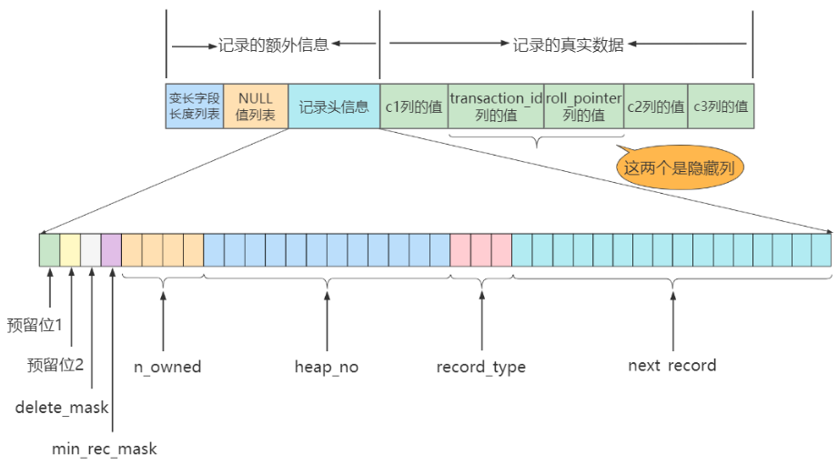

# 第7章-InnoDB数据存储结构

## 7.1数据存储结构：页

索引数据记录存储在页结构中，存储引擎负责对表中的数据读取和写入，不同存储引擎存储方式不同。InnoDB是MySQL的默认引擎，所以主要分析InnoDB的存储结构。

### 7.1.1 磁盘与内存交互基本带单：页

InnoDB把数据划分为若干页，页的大小默认为16KB。页作为磁盘与内存交互的基本单位，一次最少从磁盘中读取16kb的内容到存储，或刷新数据到磁盘。即不管是一行还是多行数据，都是以页（一个页可以存储多个记录）进行加载。

### 7.1.2 页结构 概述

* 物理结构上也不相连，是通过双向链表关联的。
* 页中数据记录按照主键值小到大组成单项链表。
* 每个数据会有页目录，记录存储在页中的数据记录。
* 通过主键查询某条记录时，通过二分法快速定位页目录中的槽，再遍历槽对应分组的记录就可以快速找到指定的数据记录。

### 7.1.3 页的大小

* InnoDB默认页大小16kb
* 不同的数据库管理系统的页大小不同，SQL Server大小为8KB，oracle用块代表页，块大小为2kb、4kb、8kb、16kb、32kb、64kb。

```sql
show variables like '%innodb_page_size%';
#结果
innodb_page_size	16384
```

### 7.1.4 页的上层结构

页上面还有区(Extent)、段(Segment)、表空间(Tablespace)。

* 区：一个区分配64个连续的页，是一个连续分配的空间，页大小默认是16KB，64个页一个分区刚好1M。
* 段：一个或多个区组成，段不要求区与区之间是相邻的。段是数据库中的分配单位，不同类型的数据库对象以不同的段形式存在。创建数据表、索引时，就会创建对应的段。如：创建一个表时会创建一个表段，创建一个索引时会创建一个索引段。
* 表空间：是一个逻辑容器，表空间存储的是段，在表空间中可以有一个或多个段。一个段只属于一个表空间。
* 数据库：由一个或多个表空间组成，表空间从管理上可以划分为系统表空间、用户表空间、撤销表空间、临时表空间等。


## 7.2 页的内部结构

* 页按类型划分，常见的有：数据页、系统页、Undo页和事务数据页等。
* 最常使用的是数据页，分为七个部分：文件头（File Header）、页头(Page Header)、最大最小记录（Infimum<上确界>+supermum<下确界>）、用户记录(User Records)、空闲空间(Free Space)、页目录(Page Directory)和文件尾(File Tailer)。

| 名称                             | 占用大小 | 说明                                 |
| -------------------------------- | -------- | ------------------------------------ |
| File Header                      | 38字节   | 文件头，描述页的信息                 |
| Page Header                      | 56字节   | 页头，页的状态信息                   |
| Infimum<上确界>+supermum<下确界> | 26字节   | 最大和最小记录，这是两个虚拟的行记录 |
| User Records                     | 不确定   | 用户记录，存储行记录内容             |
| Free Space                       | 不确定   | 空闲记录，页中还有没有被使用的空间   |
| Page Directory                   | 不确定   | 页目录，存储用户记录的相对位置       |
| File Tailer                      | 8字节    | 文件尾，检验也是否完整               |

### 7.2.1 文件通用部分File Header和File Tailer

* 文件通用部分：文件头File Heade和文件尾File Tailer

#### 7.2.1.1 文件头File Header

* 不同类型的页都会已File Header作为第一组成部分，描述了一些针对各种页都通用的信息。
* 组成结构

| 名称                              | 占用空间大小 | 描述                                                         |
| --------------------------------- | ------------ | ------------------------------------------------------------ |
| FIL_PAGE_SPACE_OR_CHKSUM          | 4字节        | 页的校验和checksum值                                         |
| FIL_PAGE_OFFSET                   | 4字节        | 页号                                                         |
| FIL_PAGE_PREV                     | 4字节        | 上一页的页号                                                 |
| FIL_PAGE_NEXT                     | 4字节        | 下一页的页号                                                 |
| FIL_PAGE_LSN                      | 8字节        | 页面被最后修改时对应的日志序列位置                           |
| FIL_PAGE_TYPE                     | 2字节        | 该页的类型                                                   |
| FILE_PAGE_FILE_FLUSH_LSN          | 8字节        | 仅在系统表空间的一个页中定义，代表文件至少被刷新到了对应的LSN值 |
| FILE_PAGE_ARCH_LOG_NO_OR_SPACE_ID | 4字节        | 页属于哪个表空间                                             |

* FIL_PAGE_OFFSET：每一个页都有一个单独的页号，就跟你的身份证号码一样，InnoDB通过页号可以唯一定位一个页。

* FIL_PAGE_TYPE：这个代表当前页的类型。

  | 类型名称                 | 十六进制 | 描述                         |
  | ------------------------ | -------- | ---------------------------- |
  | FILE_PAGE_TYPE_ALLOCATED | 0x0000   | 最新分配，还没使用           |
  | FILE_PAGE_UNDO_LOG       | 0x0002   | Undo日志页                   |
  | FILE_PAGE_INODE          | 0x0003   | 段信息节点                   |
  | FILE_PAGE_IBUF_FREE_LIST | 0x0004   | Insert Buffer空闲列表        |
  | FILE_PAGE_IBUF_BITMAP    | 0x0005   | Insert Buffer位图            |
  | FILE_PAGE_TYPE_SYS       | 0x0006   | 系统页                       |
  | FILE_PAGE_TYPE_TRX_SYS   | 0x0007   | 事务系统数据                 |
  | FILE_PAGE_TYPE_FSP_HDR   | 0x0008   | 表空间头部信息               |
  | FILE_PAGE_TYPE_XDES      | 0x0009   | 扩展描述页                   |
  | FILE_PAGE_TYPE_BLOB      | 0x000A   | 溢出页                       |
  | FILE_PAGE_INDEX          | 0x45BF   | 索引页，也就是我们说的数据页 |

  

* FIL_PAGE_PREV和FIL_PAGE_NEXT：InnoDB都是以页为单位存放数据的，如果数据分散到多个不连续的页中存储的话需要把这些页关联起来，FIL_PAGE_PREV和FIL_PAGE_NEXT就分别代表本页的上一个和下一个页的页号。这样通过建立一个双向链表把许许多多的页就都串联起来了，保证这些页之间不需要是物理上的连续，而是逻辑上的连续。

* FIL_PAGE_SPACE_OR_CHKSUM：代表当前页面的校验和（checksum），也得独立算法，保证页的唯一性，比如MD5，hash算法，页面的校验和是hash校验。文件头部和文件尾部都有属性FIL_PAGE_SPACE_OR_CHKSUM。作用：是保证数据刷新到磁盘校验数据完整性，避免断电或者其他情况，刷新到一般时数据丢失，通过文件头和文件尾的校验和进行比对可以确保整个数据页刷新完成。

* FIL_PAGE_LSN：页面被最后修改时对应的日志序列位置（英文名是：Log Sequence Number）

#### 7.2.1.2 文件尾File Tailer

* 前4个字节代表页的校验和：与文件头的文件和对应，用于校验数据的完整性。
* 后4个字节代表页面被最后修改时对应的日志序列位置（LSN）：这个部分也是为了校验页的完整性的，如果首部和尾部的LSN值校验不成功的话，就说明同步过程出现了问题。

### 7.2.2 记录部分User Records、Free Space、Infimum和supermum

* 页的主要作用是存储记录，所以“最大和最小记录”和“用户记录”部分占了页结构的主要空间。

#### 7.2.2.1 空闲空间Free Space

* 存储的记录会按照指定的行格式存储到User Records部分。但是在一开始生成页的时候，其实并没有User Records这个部分，每当我们插入一条记录，都会从Free Space部分，也就是尚未使用的存储空间中申请一个记录大小的空间划分到User Records部分，当Free Space部分的空间全部被User Records部分替代掉之后，也就意味着这个页使用完了，如果还有新的记录插入的话，就需要去申请新的页了。

#### 7.2.2.2 用户记录User Records

* User Records中的这些记录按照指定的行格式一条一条摆在User Records部分，相互之间形成单链表。
* 用户记录按照<行格式>进行存储。

#### 7.2.2.3 最小最大记录 Infimum + Supremum

* 比较记录的大小就是比较主键的大小。
* InnoDB规定的最小记录与最大记录这两条记录的构造十分简单，都是由5字节大小的记录头信息和8字节大小的一个固定的部分组成的，


* 这两条记录不是我们自己定义的记录，所以它们并不存放在页的User Records部分，他们被单独放在一个称为Infimum + Supremum的部分


### 7.2.3 页部分Page Header和Page Directory

#### 7.2.3.1 页头Page Header

* 为了能得到一个数据页中存储的记录的状态信息，比如本页中已经存储了多少条记录，第一条记录的地址是什么，页目录中存储了多少个槽等等，特意在页中定义了一个叫Page Header的部分，这个部分占用固定的56个字节，专门存储各种状态信息。


| 名称              | 占用空间大小 | 描述                                                         |
| ----------------- | ------------ | ------------------------------------------------------------ |
| PAGE_N_DIR_SLOTS  | 2字节        | 在页目录中的槽数量，方便二分法查找时计算。                   |
| PAGE_HEAP_TOP     | 2字节        | 还未使用的空间最小地址，也就是说从该地址之后就是`Free Space` |
| PAGE_N_HEAP       | 2字节        | 本页中的记录的数量（包括最小和最大记录以及标记为删除的记录） |
| PAGE_FREE         | 2字节        | 第一个已经标记为删除的记录的记录地址（各个已删除的记录通过`next_record`也会组成一个单链表，这个单链表中的记录可以被重新利用） |
| PAGE_GARBAGE      | 2字节        | 已删除记录占用的字节数                                       |
| PAGE_LAST_INSERT  | 2字节        | 最后插入记录的位置                                           |
| PAGE_DIRECTION    | 2字节        | 记录插入的方向。假如新插入的一条记录的主键值比上一条记录的主键值大，我们说这条记录的插入方向是右边，反之则是左边。用来表示最后一条记录插入方向的状态就是PAGE_DIRECTION。 |
| PAGE_N_DIRECTION  | 2字节        | 一个方向连续插入的记录数量。假设连续几次插入新记录的方向都是一致的，InnoDB会把沿着同一个方向插入记录的条数记下来，这个条数就用PAGE_N_DIRECTION这个状态表示。当然，如果最后一条记录的插入方向改变了的话，这个状态的值会被清零重新统计。 |
| PAGE_N_RECS       | 2字节        | 该页中记录的数量（不包括最小和最大记录以及被标记为删除的记录） |
| PAGE_MAX_TRX_ID   | 8字节        | 修改当前页的最大事务ID，该值仅在二级索引中定义               |
| PAGE_LEVEL        | 2字节        | 当前页在B+树中所处的层级                                     |
| PAGE_INDEX_ID     | 8字节        | 索引ID，表示当前页属于哪个索引                               |
| PAGE_BTR_SEG_LEAF | 10字节       | B+树叶子段的头部信息，仅在B+树的Root页定义                   |
| PAGE_BTR_SEG_TOP  | 10字节       | B+树非叶子段的头部信息，仅在B+树的Root页定义                 |

#### 7.2.3.2 页目录Page Directory

* 在页中，记录是以单向链表的形式进行存储的。单向链表的特点就是插入、删除非常方便，但是检索效率不高，最差的情况下需要遍历链表上的所有节点才能完成检索。因此在页结构中专门设计了页目录这个模块，专门给记录做一个目录，通过二分查找法的方式进行检索，提升效率。
* 顺序查找链表数据量性能查，为了提高查询效率，设计了页目录，用户二分法查找数据，避免了遍历所有的链表。
* 设计思想：
  * 将用户数据记录分成几组，不包括标记为删除的数据。
  * 第1组的值只有一条记录，就是最小值，页目录存储了组中的最小值。
  * 其他的组记录在4-8条之间，页目录存储了组中的最大值。
  * 最后一组记录在1-8条之间，页目录存储了组中的最大值。
  * 每组中最后一条记录的行格式的头信息中存储了该组有多少条记录，就是n_owned字段的值。
* 页目录用来存储每组的最后一条记录的地址偏移量，这个就成为槽（slot）,偏移量按照顺序存储起来。
* 为了保证数据均分，每组中最多只能有8条记录，超过8条，达到第9条时，为了保证数据均分，就分成4+5两个组。
* 二分法查找时，根据页目录值进行查找，找到数据区间值的小值那头，然后通过小值那头遍历单链表。

## 7.3 B+数如何进行记录检查

* B+树根节点开，逐层检索，直到找到叶子节点，页加载到内存中，通过页目录中的槽（slot）二分法查找到粗略分组，然后通过分组链表遍历方式查到数据。
* 普通索引与唯一索引效率不同：唯一索引找到关键字后就停止了，普通索引需要判断下一条记录，但页的大小是16KB，可能存储上千个记录，所以一般也就在内存中多判断下下一条记录。对于cpu来说消耗时间基本不多，所以检索效率上没太大差别。

## 7.4 行格式

* 数据以行为单位来向表中插入数据，这些记录在磁盘上的存放方式也被称为`行格式`或者`记录格式`。

* InnoDB存储引擎设计了4种不同类型的`行格式`，分别是`Compact`、`Redundant`、`Dynamic`和`Compressed`行格式。

* 查看MySQL8的默认行格式：

  ```sql
  mysql> SELECT @@innodb_default_row_format;
  +-------------------------------------+
  | @@innodb_default_row_format |
  +-------------------------------------+
  | dynamic                                   |
  +-------------------------------------+
  1 row in set (0.00 sec)
  
  也可以使用如下语法查看具体表使用的行格式：
  SHOW TABLE STATUS like '表名'\G
  #如
  SHOW TABLE STATUS like 't_test_table';
  ```

* 指定行格式语法

  ```sql
  #在创建或修改表的语句中指定行格式：
  CREATE TABLE 表名 (列的信息) ROW_FORMAT=行格式名称
  ALTER TABLE 表名 ROW_FORMAT=行格式名称
  
  举例：
  mysql> CREATE TABLE record_test_table (
      ->     col1 VARCHAR(8),
      ->     col2 VARCHAR(8) NOT NULL,
      ->     col3 CHAR(8),
      ->     col4 VARCHAR(8)
      -> ) CHARSET=ascii ROW_FORMAT=COMPACT;
  Query OK, 0 rows affected (0.03 sec)
  ```

### 7.4.1  Compact行格式

* 在MySQL 5.1版本中，默认设置为Compact行格式，后面的版本默认行格式为dynamic。一条完整的记录其实可以被分为记录的额外信息和记录的真实数据两大部分。
* Compact行格式分为：变长字段长度列表、NULL值列表、记录头信息（5字节）、记录的真实数据。



#### 7.4.1.1 变长字段长度列表

* MySQL支持一些变长的数据类型，比如VARCHAR(M)、VARBINARY(M)、TEXT类型，BLOB类型，这些数据类型修饰列称为变长字段，变长字段中存储多少字节的数据不是固定的，所以我们在存储真实数据的时候需要顺便把这些数据占用的字节数也存起来。
* 在Compact行格式中，把所有变长字段的真实数据占用的字节长度都存放在记录的开头部位，从而形成一个变长字段长度列表。
* 这里面存储的变长长度和字段顺序是反过来的。比如两个varchar字段在表结构的顺序是a(10)，b(15)。那么在变长字段长度列表中存储的长度顺序就是15，10，是反过来的。

#### 7.4.1.2 NULL值列表

* Compact行格式会把可以为NULL的列统一管理起来，存在一个标记为NULL值列表中。如果表中没有允许存储 NULL 的列，则 NULL值列表也不存在了。
* 没有标注出来NULL值的位置，就有可能在查询数据的时候出现混乱。如果使用一个特定的符号放到相应的数据位表示空置的话，虽然能达到效果，但是这样很浪费空间。所以采用NULL列表来表示。
* 二进制位的值为1时，代表该列的值为NULL。
2. 二进制位的值为0时，代表该列的值不为NULL。
2. 非空字段的列不存储NULL值列，比如主键列、非空列。

#### 7.4.1.3 记录头信息

| 名称         | 占用空间（bit） | 描述                                                         |
| ------------ | --------------- | ------------------------------------------------------------ |
| 预留位1      | 1               | 没有使用                                                     |
| 预留位2      | 1               | 没有使用                                                     |
| delete_mask  | 1               | 标记该记录是否被删除                                         |
| min_rec_mask | 1               | B+树的每层非叶子节点中的最小记录都会添加该标记               |
| n_owned      | 4               | 表示当前记录拥有的记录数                                     |
| heap_no      | 13              | 表示当前记录在记录堆的位置信息                               |
| record_type  | 3               | 表示当前记录的类型，0表示普通记录，1表示B+树非叶节点记录，2表示最小记录，3表示最大记录 |
| next_record  | 16              | 表示下一条记录的相对位置                                     |

* delete_mask：这个属性标记着当前记录是否被删除，占用1个二进制位。
  * 1代表删除，0代表未删除。
  * 如果真实删除数据，磁盘上需要重新排列，导致性能消耗，所以只是打标记。
  * 标记后的数据形成一个垃圾链表，链表中的记录占用的空间称之为可重用空间，新插入数据时，可能把这些被删除的记录占用的存储空间覆盖掉。
* min_rec_mask：B+树的每层非叶子节点中的最小记录都会添加该标记，min_rec_mask值为1。即非数据节点的中最小值记录存储的是1，其他都是0。
* record_type：这个属性表示当前记录的类型，一共有4种类型的记录：
  * 0：表示普通记录
  * 1：表示B+树非叶节点记录
  * 2：表示最小记录
  * 3：表示最大记录
  * 我们自己插入的记录就是普通记录，它们的record_type值都是0，而最小记录和最大记录的record_type值分别为2和3。非叶子节点的record_type是1
* heap_no：表示当前记录在本页中的位置
  * MySQL会自动给每个页里加了两个记录，由于这两个记录并不是我们自己插入的，所以有时候也称为伪记录或者虚拟记录。这两个伪记录一个代表最小记录，一个代表最大记录。最小记录和最大记录的heap_no值分别是0和1，也就是说它们的位置最靠前。
  * 因为有两条伪记录，所以我们自己插入的行数据都是从2开始的。
* n_owned：页目录中每个组中最后一条记录的头信息中会存储该组一共有多少条记录，作为 n_owned 字段。详情见page directory。
* next_record：从当前记录的真实数据到下一条记录的真实数据的地址偏移量，因为存储是在一个文件中，所以下一条记录就是当前数据的偏移量。
  * 下一条记录指得并不是按照我们插入顺序的下一条记录，而是按照主键值由小到大的顺序的下一条记录。
  * 规定Infimum记录（也就是最小记录）的下一条记录就是本页中主键值最小的用户记录，而本页中主键值最大的用户记录的下一条记录就是 Supremum记录（也就是最大记录）。


#### 7.4.1.4 记录的真实数据

| 列名           | 是否必须 | 占用空间 | 描述                   |
| -------------- | -------- | -------- | ---------------------- |
| row_id         | 否       | 6字节    | 行ID，唯一标识一条记录 |
| transaction_id | 是       | 6字节    | 事务ID                 |
| roll_pointer   | 是       | 7字节    | 回滚指针               |

* 实际上这几个列的真正名称其实是：DB_ROW_ID、DB_TRX_ID、DB_ROLL_PTR。
* 一个表没有手动定义主键，则会选取一个Unique键作为主键，如果连Unique键都没有定义的话，则会为表默认添加一个名为row_id的隐藏列作为主键。所以row_id是在没有自定义主键以及Unique键的情况下才会存在的。
  事务ID和回滚指针在后面的章节中。
* 真实数据分析

创建表，写入数据

```sql
CREATE TABLE mytest(
col1 VARCHAR(10),
col2 VARCHAR(10),
col3 CHAR(10),
col4 VARCHAR(10)
)ENGINE=INNODB CHARSET=LATIN1 ROW_FORMAT=COMPACT;
 
 
INSERT INTO mytest
VALUES('a','bb','bb','ccc');
 
INSERT INTO mytest
VALUES('d','ee','ee','fff');
 
INSERT INTO mytest
VALUES('d',NULL,NULL,'fff');
```

在Windows操作系统下，可以选择通过程序UltraEdit打开表空间文件mytest.ibd这个二进制文件，16进制展示。内容如下

```
0000c070 73 75 70 72 65 6d 75 6d 03 02 01 00 00 00 10 00|supremum........|
0000c080 2c 00 00 00 2b 68 00 00 00 00 00 06 05 80 00 00|,...+h..........|
0000c090 00 32 01 10 61 62 62 62 62 20 20 20 20 20 20 20|.2..abbbb|<--第一条数据>
0000c0a0 20 63 63 63 03 02 01 00 00 00 18 00 2b 00 00 00|ccc........+...|
0000c0b0 2b 68 01 00 00 00 00 06 06 80 00 00 00 32 01 10|+h...........2..|
0000c0c0 64 65 65 65 65 20 20 20 20 20 20 20 20 66 66 66|deeeefff|<--第二条数据>
0000c0d0 03 01 06 00 00 20 ff 98 00 00 00 2b 68 02 00 00|..........+h...|
0000c0e0 00 00 06 07 80 00 00 00 32 01 10 64 66 66 66 00|........2..dfff.|<--第三条数据>
```

* supermum是用户记录的开始
* 固定长度CHAR字段在未能完全占用其长度空间时，会用0x20来进行填充。
* 第一条记录：
  * 03 02 01 ：变长长字段长度列表，03是col4字段实际值长度3个字符，02是col2字段实际值长度2个字符，01是col1字段实际值长度1个字符
  * 00 :NULL标志位，第一行没有NULL值
  * 00 00 10 00 2c：Record Header，固定5字节长度。2c是下一条记录偏移量44个字节，往下数44个字节就是下一条记录。44=6+6+7+16+3+1+5=RowID6个字节长度+TransactionID6个字节+Roll Pointe7个字节+用户记录长度16个字节+下一条记录的变长长字段3字节+NULL标志位1个字节+Record Header 5个字节长度
  * 00 00 00 2b 68 00 ：RowID InnoDB自动创建，6字节
  * 00 00 00 00 06 05：TransactionID，6字节
  * 80 00 00 00 32 01 10：Roll Pointe，7字节
  * 61 62 62 62 62 20 20 20 20 20 20 20 20 63 63 63：第一条数据，abb是变长字段，62 62 20 20 20 20 20 20 20 20 是固定字段10个长度，总共占用16个字节。
* 第二条记录：
  * 03 02 01 ：变长长字段长度列表
  * 00 :NULL标志位，第一行没有NULL值
  * 00 00 18 00 2b：Record Header，固定5字节长度。下个偏移2b是43个字节
  * 00 00 00 2b 68 01：RowID InnoDB自动创建，6字节
  * 00 00 00 00 06 06：TransactionID，6字节
  * 80 00 00 00 32 01 10：Roll Pointe，7字节
  * 64 65 65 65 65 20 20 20 20 20 20 20 20 66 66 66：第二条记录值。16个字节。
* 第三条记录：
  * 03 01 ：变长长字段长度列表
  * 06：转换成二进制为00000110，为1的值代表第2列和第3列的数据为NULL，在其后存储列数据的部分，用户会发现没有存储NULL列，而只存储了第1列和第4列非NULL的值。
  * 00 00 20 ff 98：Record Header，固定5字节长度。
  * 00 00 00 2b 68 02：RowID InnoDB自动创建，6字节。
  * 00 00 00 00 06 07：TransactionID，6字节
  * 80 00 00 00 32 01 10：Roll Pointe，7字节
  * 64 66 66 66：第三条记录值，4个字节
* 从第三条记录中可以看出，不管是CHAR类型还是VARCHAR类型，在compact格式下NULL值都不占用任何存储空间。
* null值列超过8个时，会根据可为空列计算存储空间。可为空列为1-8占用一个字节，8-16时占用两个字节。
* 数据字段值超过大于等于255，会占用两个空间存储，255存储为ff 80。80默认为可变长度0值，这样却跟后面跟着的是可变长度值。1111 1111 1000 0000。算法比如e0 90 第一个字节算全，第二个字节减去80，倒装回去，结果就是 10 e0，长度就是4320。

### 7.4.2 Dynamic和Compressed行格式

* 一个页的大小一般是16KB，也就是16384字节，而一个VARCHAR(M)类型的列就最多可以存储65533个字节，这样就可能出现一个页存放不了一条记录，这种现象称为`行溢出`。
* VARCHAR(M)类型行数据
  * VARCHAR(M)类型，M表示字符数，而数据最大可存放65535字节，字符需要进行换算。
  * 如果使用ASCII码，65535表示65535个字节。如果使用utf8mb3，则存储的最大为65535/3=21845。
  * MySQL对一条记录占用的最大存储空间是有限制的，除BLOB或者TEXT类型的列之外， 其他所有的列（不包括隐藏列和记录头信息）占用的字节长度加起来不能超过65535个字节。
  * 这个65535个字节除了列本身的数据之外，还包括一些其他的数据，以Compact行格式为例，比如说我们为了存储一个VARCHAR(M)类型的列，除了真实数据占有空间以外，还需要记录的额外信息。
  * 如果该VARCHAR类型的列没有NOT NULL属性，那最多只能存储65532个字节的数据，因为变长字段的长度占用 2个字节，NULL值标识需要占用1个字节。
  * 如果有not null属性，那么就不需要NULL值标识，也就可以多存储一个字节，即65533个字节

```sql
65535=2个字节的变成字段的长度+1个字节NULL值标识。
#如果该VARCHAR类型的列没有NOT NULL属性，那最多只能存储65532个字节的数据，因为变长字段的长度占用 2个字节，NULL值标识需要占用1个字节。
CREATE  TABLE  varchar_size_demo(
    c  VARCHAR(65532)
) default charset=ascii ROW_FORMAT=Compact;
#如果有not null属性，那么就不需要NULL值标识，也就可以多存储一个字节，即65533个字节
CREATE  TABLE  varchar_size_demo( 
  c  VARCHAR(65533)  not  null
)default charset=ascii  ROW_FORMAT=Compact; 
```


* 在Compact和Reduntant行格式中，对于占用存储空间非常大的列，在记录的真实数据处只会存储该列的一部分数据，把剩余的数据分散存储在几个其他的页中进行`分页存储`，然后记录的真实数据处用20个字节存储指向这些页的地址（当然这20个字节中还包括这些分散在其他页面中的数据的占用的字节数），从而可以找到剩余数据所在的页。这称为`页的扩展`。
* 在MySQL 8.0中，默认行格式就是Dynamic，Dynamic、Compressed行格式和Compact行格式挺像，只不过在处理行溢出数据时有分歧。
  * Compressed和Dynamic两种记录格式对于存放在BLOB中的数据采用了完全的行溢出的方式。如图，在数据页中只存放20个字节的指针（溢出页的地址），实际的数据都存放在Off Page（溢出页）中。
  * Compact和Redundant两种格式会在记录的真实数据处存储一部分数据（存放768个前缀字节）。
* Compressed行记录格式的另一个功能就是，存储在其中的行数据会以zlib的算法进行压缩，因此对于BLOB、TEXT、VARCHAR这类大长度类型的数据能够进行非常有效的存储。

### 7.4.3 Redundant格式

* Redundant是MySQL 5.0版本之前InnoDB的行记录存储方式，MySQL 5.0支持Redundant是为了兼容之前版本的页格式。

```sql
现在我们把表record_test_table的行格式修改为Redundant：
ALTER TABLE record_test_table ROW_FORMAT=Redundant;
Query OK, 0 rows affected (0.05 sec)
Records: 0  Duplicates: 0  Warnings: 0
```

* Redundant行格式的首部是一个字段长度偏移列表，同样是逆序放置的。Compact放的是变长字段长度列表和NULL值列表。
* Redundant记录了所有列，包括隐藏列的长度信息都按照逆序存储到字段长度偏移列表。
* 计算各列长度不像Compact那么直观，需要采用两个相邻数值查计算各列值的长度。
* 记录头信息与Compact比较
  * Redundant中没有record_type属性。
  * 增加了n_field和1byte_offs_flag属性，分别占用10个bit和1个bit大小。
  * 总的文件头多了1个字节，为6字节。

## 7.5 区、段和碎片区


### 7.5.1 区

* 一个区就是物理位置上连续的`64个页`。因为InnoDB中的页的大小默认是16KB，所以一个区的大小是64*16KB=`1MB`。
* 以`页为单位`来分配存储空间，双向链表相邻的两个页之间的`物理位置可能离得非常远`，查找下一个页时的随机IO就非常慢。所以相邻链表之间，可以使用顺序I/0，增加速度，就引入了区的概念。
* 造成`一点点空间的浪费`，但是效率提升了。
* 区大体上可以分为4种类型：
  * `空闲的区(FREE)`：现在还没有用到这个区中的任何页面。
  * `有剩余空间的碎片区(FREE_FRAG)`：表示碎片区中还有可用的页面。
  * `没有剩余空间的碎片区(FULL_FRAG)`：表示碎片区中的所有页面都被使用，没有空闲页面
  * `附属于某个段的区(FSEG)`：每一索引都可以分为叶子节点段和非叶子节点段
* 处于`FREE`、`FREE_FRAG`以及`FULL_FRAG`这三种状态的区都是独立的，直属于表空间。而处于`FSEG`状态的区是附属于某个段的。

### 7.5.2 段

* 范围查询只需要对叶子节点记录进行顺序扫描，如果把叶子节点和非叶子节点的页都当成一个区查询就非常慢。
* 为了区分叶子节点和非叶子节点，存放叶子节点的集合就是一个段，非叶子节点也是一个段（segment）。
* 常见的段有：数据段（叶子节点）、索引段（非叶子节点）、回滚段。
* 在InnoDB存储引擎中，对段的管理都是由引擎自身所完成，DBA不能也没有必要对其进行控制。
* 段不对应表空间中的某一个连续的物理区域，而是一个逻辑上的概念，由若干个零散的页（碎片区为了不浪费空间，碎片区的某些页属于某个段）以及一些完整的区组成。

### 7.5.3 碎片区

* 默认情况下，一个使用InnoDB存储引擎的表只有一个聚簇索引，一个索引会生成2个段，而段是以区为单位申请存储空间的。一个区是1M，2个段就需要2M的空间，如果数据量比较小，存储根本用不了2M空间，这个空间就浪费。且如果每次创建一个索引就申请2M的存储空间，这样太浪费了。
* 为了解决数据量较小的表浪费存储空间，InnoDB提出了一个`碎片（fragment）区`的概念。
* 在一个碎片（fragment）区中，并不是所有的页都是为了存储同一个段的数据而存在的，而是碎片区中的页可以用于不同的目的。比如碎片区中有些页属于数据段，有些页属于索引段，而不是独立的数据区和索引区。
* `碎片区直属于表空间`，并不属于任何一个段，它属于表空间。
* 某个段分配存储空间的策略是这样的：
  * 在刚开始向表中插入数据的时候，段是从某个碎片区以单个页为单位来分配存储空间的。
  * 当某个段已经占用了`32个碎片区`（规范）页面之后，就会申请以完整的区为单位来分配存储空间

## 7.6 表空间

* 表空间是InnoDB存储引擎逻辑结构的最高层，所有数据都存放在表空间中，是一个逻辑容器。
* 从管理上划分为：
  * 系统表空间(System tablespace)
  * 独立表空间(File-per-table tablespace)
  * 撤销表空间(Undo tablespace)
  * 临时表空间(Temporary tablespace)
  * 等

### 7.5.1 独立表空间

* 每张表一个独立的表空间，数据都存放在自己的表空间中，便于数据库之间迁移。
* DROP TABLE后可自动回收表空间，其他情况表空间不能自己回收。
* 删除大量数据后，比如统计分析或日志表，使用alter table TableName engine=innodb;回收不用的空间，清理碎片。
* 新建表.idb文件96k，只有6个页面大小（mysql5.7中），Mysql8.0中是112k，因为把元数据合到了.idb中，里面存储数据记录初始化也只有6个页面大小。相当于初始化大小，.idb文件自扩的，随着数据增加，表空间对应的文件也增加。

### 7.5.2 系统表空间

* 整个MySQL进程只有一个系统表空间。
* 系统表空间中会额外记录一些有关整个系统信息的页，独立表空间中没有。
* InnoDB数据字典，插入数据时，MySQL会进行一系列校验。
* 插入数据时，为了更好的管理数据，会额外进入一些数据，这就是元数据。内部系统表SYS_开头的表用来记录这些元数据。这些系统表也称为数据字典。
* 用户不能直接访问InnoDB的这些内部系统表，所以系统数据库提供了information_schema以innodb_sys开头的表来查询这个数据。但不是真正的内部系统表，并不完全一样，仅供参考而已。

