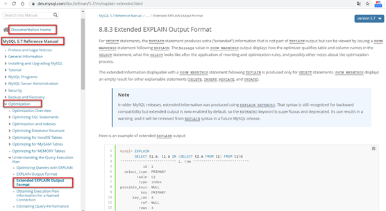
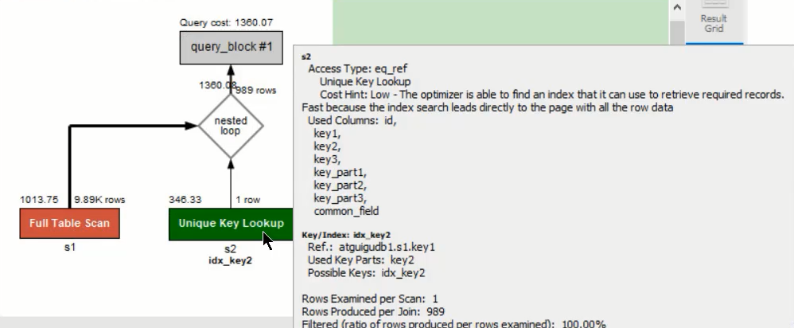

# 第9章-性能分析工具的使用

## 9.1 数据库服务器的优化步骤


## 9.2.查看系统性能参数

* 在MySQL中，可以使用SHOW STATUS 语句查询一些MySQL数据库服务器的性能参数、执行频率。

```sql
SHOW [GLOBAL|SESSION] STATUS LIKE '参数';
#例如
SHOW  STATUS LIKE 'Innodb_rows%';

#结果
Innodb_rows_deleted	0
Innodb_rows_inserted	1000375
Innodb_rows_read	21397044
Innodb_rows_updated	0
```

一些常用的性能参数如下：

- Connections：连接MySQL服务器的次数。 
- Uptime：MySQL服务器的上线时间。
- Slow_queries：慢查询的次数。
- Innodb_rows_read：Select查询返回的行数 
- Innodb_rows_inserted：执行INSERT操作插入的行数 
- Innodb_rows_updated：执行UPDATE操作更新的行数
- Innodb_rows_deleted：执行DELETE操作删除的行数
- Com_select：查询操作的次数。
- Com_insert：插入操作的次数。对于批量插入的 INSERT 操作，只累加一次。
- Com_update：更新操作的次数。 
- Com_delete：删除操作的次数。

## 9.3 统计SQL的查询成本：last_query_cost

* 查询数据在多少个页中检索。
* show session STATUS LIKE 'last_query_cost' 在mysql命令行执行有效。在DBeaver中结果为0，可能因为session的问题。
* 使用场景：它对于比较开销是非常有用的，特别是我们有好几种查询方式可选的时候。

```sql
 select * from student_info where id >999990;
 
 show session STATUS LIKE 'last_query_cost';
 +-----------------+----------+
| Variable_name   | Value    |
+-----------------+----------+
| Last_query_cost | 2.891077 |
+-----------------+----------+
```

## 9.4 定位执行慢的 SQL：慢查询日志

### 9.4.1 开启慢查询日志参数

```sql
set global slow_query_log='ON';

#查看慢查询是否开启
show variables like '%slow_query_log%';
+---------------------+--------------------------+
| Variable_name       | Value                    |
+---------------------+--------------------------+
| slow_query_log      | ON                       |
| slow_query_log_file | DESKTOP-UPTV06G-slow.log |
+---------------------+--------------------------+

#修改long_query_time阈值
show variables like '%long_query_time%';

#测试发现：设置global的方式对当前session的long_query_time失效。对新连接的客户端有效。所以可以一并
#执行下述语句,单位是秒
mysql > set global long_query_time = 1;
mysql> show global variables like '%long_query_time%';
mysql> set long_query_time=1;
mysql> show variables like '%long_query_time%';

#查询慢查询条数
mysql> SHOW GLOBAL STATUS LIKE '%Slow_queries%';
+---------------+-------+
| Variable_name | Value |
+---------------+-------+
| Slow_queries  | 11    |
+---------------+-------+
1 row in set (0.00 sec)

#min_examined_row_limit，查询扫描过的最少记录数，默认是0。表示即使扫描的数据是0条，有慢查询也会记录。
SHOW GLOBAL STATUS LIKE 'min_examined_row_limit';
```

### 9.4.2 慢查询日志分析工具：mysqldumpslow

* linux环境下，直接在命令行查询，mysqldumpslow --help
* mysqldumpslow 命令的具体参数如下：

-a: 不将数字抽象成N，字符串抽象成S

-s: 是表示按照何种方式排序：

​	c: 访问次数

​	l: 锁定时间

​	r: 返回记录

​	t: 查询时间

​	al:平均锁定时间

​	ar:平均返回记录数

​	at:平均查询时间 （默认方式）

​	ac:平均查询次数

-t: 即为返回前面多少条的数据；

-g: 后边搭配一个正则匹配模式，大小写不敏感的；

* 举例：我们想要按照查询时间排序，查看前五条 SQL 语句，这样写即可：

```shell
mysqldumpslow -s t -t 5 /var/lib/mysql/atguigu01-slow.log

[root@bogon ~]# mysqldumpslow -s t -t 5 /var/lib/mysql/atguigu01-slow.log
Reading mysql slow query log from /var/lib/mysql/atguigu01-slow.log
Count: 1 Time=2.39s (2s) Lock=0.00s (0s) Rows=13.0 (13), root[root]@localhost
SELECT * FROM student WHERE name = 'S'
Count: 1 Time=2.09s (2s) Lock=0.00s (0s) Rows=2.0 (2), root[root]@localhost
SELECT * FROM student WHERE stuno = N
Died at /usr/bin/mysqldumpslow line 162, <> chunk 2.

#常用参考
#得到返回记录集最多的10个SQL
mysqldumpslow -s r -t 10 /var/lib/mysql/atguigu-slow.log
#得到访问次数最多的10个SQL
mysqldumpslow -s c -t 10 /var/lib/mysql/atguigu-slow.log
#得到按照时间排序的前10条里面含有左连接的查询语句
mysqldumpslow -s t -t 10 -g "left join" /var/lib/mysql/atguigu-slow.log
#另外建议在使用这些命令时结合 | 和more 使用 ，否则有可能出现爆屏情况
mysqldumpslow -s r -t 10 /var/lib/mysql/atguigu-slow.log | more
```

* windows下需要先安装perl脚本，ActivePerl_5.16.2.3010812913.msi。
* 安装好之后进入安装目录，执行perl mysqldumpslow.pl。slow日志目录不能包含空格，否则无法进行分析。可以拷贝出到另外一个不含空格的目录。

```perl
E:\Program Files\MySQL\MySQL Server 8.0\bin>perl mysqldumpslow.pl -s t -t 5 E:\DESKTOP-UPTV06G-slow.log

Reading mysql slow query log from E:\DESKTOP-UPTV06G-slow.log
Count: 4  Time=403.95s (1615s)  Lock=0.00s (0s)  Rows=50.0 (200), root[root]@localhost
  /* ApplicationName=DBeaver N.N.N - SQLEditor <Script-N.sql> */ select student_id,count(*) as num from student_info  group by student_id order by create_time desc  limit N

Count: 1  Time=49.84s (49s)  Lock=0.00s (0s)  Rows=0.0 (0), root[root]@localhost
  /* ApplicationName=DBeaver N.N.N - SQLEditor <Script-N.sql> */ SELECT student_info.course_id, name, student_info.student_id, course_name
  FROM student_info JOIN course
  ON student_info.course_id = course.course_id
  WHERE name = 'S'
  LIMIT N, N

Count: 2  Time=15.16s (30s)  Lock=0.00s (0s)  Rows=1.0 (2), root[root]@localhost
  /* ApplicationName=DBeaver N.N.N - SQLEditor <Script-N.sql> */ select count(id) from student_info
  LIMIT N, N

Count: 1  Time=15.63s (15s)  Lock=0.10s (0s)  Rows=1.0 (1), root[root]@localhost
  /* ApplicationName=DBeaver N.N.N - SQLEditor <Script-N.sql> */
  select count(N) from student_info
  LIMIT N, N

Count: 1  Time=14.04s (14s)  Lock=0.00s (0s)  Rows=1.0 (1), root[root]@localhost
  /* ApplicationName=DBeaver N.N.N - SQLEditor <Script-N.sql> */
  select count(*) from student_info
  LIMIT N, N
```


### 9.4.3 关闭慢查询日志

* 查询慢查询开关

```sql
SHOW VARIABLES LIKE '%slow%'; #查询慢查询日志所在目录
SHOW VARIABLES LIKE '%long_query_time%'; #查询超时时长
```

* 永久性

```sql
[mysqld]
slow_query_log=OFF
或
[mysqld]
#slow_query_log =OFF
```

* 临时性方式

```sql
SET GLOBAL slow_query_log=off;
```

### 9.4.4 删除慢查询日志

* 找到对应的slow_query_log_file日志文件，默认在数据目录中，可以删除掉

```sql
#查看慢查询是否开启
show variables like '%slow_query_log%';
+---------------------+--------------------------+
| Variable_name       | Value                    |
+---------------------+--------------------------+
| slow_query_log      | ON                       |
| slow_query_log_file | DESKTOP-UPTV06G-slow.log |
+---------------------+--------------------------+
```

* 使用mysqladmin -uroot -p flush-logs slow 可以重建日志。是删除原来的重新创建一个新的，只存储新的慢查询，旧的会被清理掉。

## 9.5 查看 SQL 执行成本：SHOW PROFILE


```sql
#查看开启 show profile：
show variables like 'profiling';

#开启 show profile：
set profiling = 'ON';

#查看执行成本，查询的是最近一条的sql的执行成本
show profiles;

#查询第二条执行语句的执行时间
show profile cpu,block io for query 2;
```

show profile的常用查询参数：
① ALL：显示所有的开销信息。 

② BLOCK IO：显示块IO开销。 

③ CONTEXT SWITCHES：上下文切换开销。

④ CPU：显示CPU开销信息。

⑤ IPC：显示发送和接收开销信息。 

⑥ MEMORY：显示内存开销信息。

⑦ PAGE FAULTS：显示页面错误开销信息。 

⑧ SOURCE：显示和Source_function，Source_file，Source_line相关的开销信息。 

⑨ SWAPS：显示交换次数开销信息。

* 出现一下诊断结果，则sql语句需要优化。
  * converting HEAP to MyISAM：查询结果太大，内存不够，数据往磁盘上搬了。
  * Creating tmp table：创建临时表。先拷贝数据到临时表，用完后再删除临时表。
  * Copying to tmp table on disk：把内存中临时表复制到磁盘上，警惕。
  * locked
* show profiles命令将被弃用，我们可以从information_schema中profiling数据表进行查看。

## 9.6 分析查询语句：EXPLAIN

### 9.6.1概述

* 通过上面操作定位到慢查询SQL，可以使用EXPLAIN或DESCRIBE工具做针对性的分析查询语句。

* MySQL中有负责优化SELECT语句的优化器块，为查询提供最优的执行计划。但不一定是最优的检索方式。

* EXPLAIN可以做什么

  * 表的读取顺序
  * 数据读取操作的操作类型
  * 哪些索引可以使用
  * 表之间的引用
  * 每张表有多少行被优化器查询

* 官网介绍

  * https://dev.mysql.com/doc/refman/5.7/en/explain-output.html

  * https://dev.mysql.com/doc/refman/8.0/en/explain-output.html

    

* 版本介绍

  * MySQL 5.6.3以前只能EXPLAIN SELECT ；MYSQL 5.6.3以后就可以EXPLAIN SELECT，UPDATE，DELETE
  * 在5.7以前的版本中，想要显示partitions 需要使用explain partitions 命令；想要显示filtered 需要使用explain extended 命令。在5.7版本后，默认explain直接显示partitions和filtered中的信息。

### 9.6.2 基本语法

EXPLAIN 或 DESCRIBE语句的语法形式如下：

```sql
EXPLAIN SELECT select_options
或者
DESCRIBE SELECT select_options
```

如果我们想看看某个查询的执行计划的话，可以在具体的查询语句前边加一个EXPLAIN ，就像这样：

```sql
mysql> EXPLAIN SELECT 1;
```

EXPLAIN 语句输出的各个列的作用如下：

| 列名          | 描述                                                   |
| ------------- | ------------------------------------------------------ |
| id            | 在一个大的查询语句中每个SELECT关键字都对应一个唯一的id |
| select_type   | SELECT关键字对应的那个查询的类型                       |
| table         | 表名                                                   |
| partitions    | 匹配的分区信息                                         |
| type          | 针对单表的访问方法                                     |
| possible_keys | 可能用到的索引                                         |
| key           | 实际上使用的索引                                       |
| key_len       | 实际使用到的索引长度                                   |
| ref           | 当使用索引列等值查询时，与索引列进行等值匹配的对象信息 |
| rows          | 预估的需要读取的记录条数                               |
| filtered      | 某个表经过搜索条件过滤后剩余记录条数的百分比           |
| Extra         | 一些额外的信息                                         |

### 9.6.3 数据准备

```sql
#1. 建表
CREATE TABLE s1 (
id INT AUTO_INCREMENT,
key1 VARCHAR(100),
key2 INT,
key3 VARCHAR(100),
key_part1 VARCHAR(100),
key_part2 VARCHAR(100),
key_part3 VARCHAR(100),
common_field VARCHAR(100),
PRIMARY KEY (id),
INDEX idx_key1 (key1),
UNIQUE INDEX idx_key2 (key2),
INDEX idx_key3 (key3),
INDEX idx_key_part(key_part1, key_part2, key_part3)
) ENGINE=INNODB CHARSET=utf8;

CREATE TABLE s2 (
id INT AUTO_INCREMENT,
key1 VARCHAR(100),
key2 INT,
key3 VARCHAR(100),
key_part1 VARCHAR(100),
key_part2 VARCHAR(100),
key_part3 VARCHAR(100),
common_field VARCHAR(100),
PRIMARY KEY (id),
INDEX idx_key1 (key1),
UNIQUE INDEX idx_key2 (key2),
    INDEX idx_key3 (key3),
INDEX idx_key_part(key_part1, key_part2, key_part3)
) ENGINE=INNODB CHARSET=utf8;

#2. 设置参数 log_bin_trust_function_creators
#创建函数，假如报错，需开启如下命令：允许创建函数设置：
set global log_bin_trust_function_creators=1; # 不加global只是当前窗口有效。

#3. 创建函数
DELIMITER //
CREATE FUNCTION rand_string1(n INT)
RETURNS VARCHAR(255) #该函数会返回一个字符串
BEGIN
DECLARE chars_str VARCHAR(100) DEFAULT
'abcdefghijklmnopqrstuvwxyzABCDEFJHIJKLMNOPQRSTUVWXYZ';
DECLARE return_str VARCHAR(255) DEFAULT '';
DECLARE i INT DEFAULT 0;
WHILE i < n DO
SET return_str =CONCAT(return_str,SUBSTRING(chars_str,FLOOR(1+RAND()*52),1));
SET i = i + 1;
END WHILE;
RETURN return_str;
END //
DELIMITER ;

#4. 创建存储过程
#创建往s1表中插入数据的存储过程：
DELIMITER //
CREATE PROCEDURE insert_s1 (IN min_num INT (10),IN max_num INT (10))
BEGIN
DECLARE i INT DEFAULT 0;
SET autocommit = 0;
REPEAT
SET i = i + 1;
INSERT INTO s1 VALUES(
(min_num + i),
rand_string1(6),
(min_num + 30 * i + 5),
rand_string1(6),
rand_string1(10),
rand_string1(5),
rand_string1(10),
rand_string1(10));
UNTIL i = max_num
END REPEAT;
COMMIT;
END //
DELIMITER ;

#创建往s2表中插入数据的存储过程：
DELIMITER //
CREATE PROCEDURE insert_s2 (IN min_num INT (10),IN max_num INT (10))
BEGIN
DECLARE i INT DEFAULT 0;
SET autocommit = 0;
REPEAT
SET i = i + 1;
INSERT INTO s2 VALUES(
(min_num + i),
rand_string1(6),
(min_num + 30 * i + 5),
rand_string1(6),
rand_string1(10),
rand_string1(5),
rand_string1(10),
rand_string1(10));
UNTIL i = max_num
END REPEAT;
COMMIT;
END //
DELIMITER ;

#5. 调用存储过程
#s1表数据的添加：加入1万条记录：
CALL insert_s1(10001,10000);
#s2表数据的添加：加入1万条记录：
CALL insert_s2(10001,10000);
```

### 9.6.4 EXPLAIN各列作用

#### 9.6.4.1 table

不论我们的查询语句有多复杂，里边儿包含了多少个表，到最后也是需要对每个表进行单表访问的，所以MySQL规定EXPLAIN语句输出的每条记录都对应着某个单表的访问方法，该条记录的table列代表着该表的表名（有时不是真实的表名字，可能是简称)

```sql
#table字段就是表名
#查询的每一行记录都对应一个表名
EXPLAIN SELECT * FROM s1 ;
#结果集
+----+-------------+-------+------------+------+---------------+------+---------+------+------+----------+-------+
| id | select_type | table | partitions | type | possible_keys | key  | key_len | ref  | rows | filtered | Extra |
+----+-------------+-------+------------+------+---------------+------+---------+------+------+----------+-------+
|  1 | SIMPLE      | s1    | NULL       | ALL  | NULL          | NULL | NULL    | NULL | 9895 |   100.00 | NULL  |
+----+-------------+-------+------------+------+---------------+------+---------+------+------+----------+-------+

#s1驱动表，s2被驱动表
EXPLAIN SELECT * FROM s1 INNER JOIN s2;
#结果集

+----+-------------+-------+------------+------+---------------+------+---------+------+------+----------+-------------------------------+
| id | select_type | table | partitions | type | possible_keys | key  | key_len | ref  | rows | filtered | Extra                         |
+----+-------------+-------+------------+------+---------------+------+---------+------+------+----------+-------------------------------+
|  1 | SIMPLE      | s1    | NULL       | ALL  | NULL          | NULL | NULL    | NULL | 9895 |   100.00 | NULL                          |
|  1 | SIMPLE      | s2    | NULL       | ALL  | NULL          | NULL | NULL    | NULL | 9895 |   100.00 | Using join buffer (hash join) |
+----+-------------+-------+------------+------+---------------+------+---------+------+------+----------+-------------------------------+

```

#### 9.6.4.2 id

* 在一个大的查询语句中，每个SELECT关键字对应一个唯一的id。
* 有些子查询会转换为多表查询，这样就会导致虽然有多个SELECT，但id只有一个。
* 当有连接查询取并集时，会有一个去重的临时表，id为null，因为不是实际的查询的id。
* id如果相同，可以认为是一组，从上往下顺序执行
* 在所有组中，id值越大，优先级越高，越先执行
* id号每个号码，表示一趟独立的查询, 一个sql的查询趟数越少越好，表示没有签到循环。

```sql
#单表查询
mysql> EXPLAIN SELECT * FROM s1 WHERE key1 = 'a';
+----+-------------+-------+------------+------+---------------+----------+---------+-------+------+----------+-------+
| id | select_type | table | partitions | type | possible_keys | key      | key_len | ref   | rows | filtered | Extra |
+----+-------------+-------+------------+------+---------------+----------+---------+-------+------+----------+-------+
|  1 | SIMPLE      | s1    | NULL       | ref  | idx_key1      | idx_key1 | 303     | const |    1 |   100.00 | NULL  |
+----+-------------+-------+------------+------+---------------+----------+---------+-------+------+----------+-------+
1 row in set, 1 warning (0.00 sec)

#联合查询
mysql> EXPLAIN SELECT * FROM s1 INNER JOIN s2;
+----+-------------+-------+------------+------+---------------+------+---------+------+------+----------+-------------------------------+
| id | select_type | table | partitions | type | possible_keys | key  | key_len | ref  | rows | filtered | Extra                         |
+----+-------------+-------+------------+------+---------------+------+---------+------+------+----------+-------------------------------+
|  1 | SIMPLE      | s1    | NULL       | ALL  | NULL          | NULL | NULL    | NULL | 9895 |   100.00 | NULL                          |
|  1 | SIMPLE      | s2    | NULL       | ALL  | NULL          | NULL | NULL    | NULL | 9895 |   100.00 | Using join buffer (hash join) |
+----+-------------+-------+------------+------+---------------+------+---------+------+------+----------+-------------------------------+
2 rows in set, 1 warning (0.00 sec)

#多查询，不会转化为多表查询，所id是两个
mysql> EXPLAIN SELECT * FROM s1 WHERE key1 IN (SELECT key1 FROM s2) OR key3 = 'a';
+----+-------------+-------+------------+-------+---------------+----------+---------+------+------+----------+-------------+
| id | select_type | table | partitions | type  | possible_keys | key      | key_len | ref  | rows | filtered | Extra       |
+----+-------------+-------+------------+-------+---------------+----------+---------+------+------+----------+-------------+
|  1 | PRIMARY     | s1    | NULL       | ALL   | idx_key3      | NULL     | NULL    | NULL | 9895 |   100.00 | Using where |
|  2 | SUBQUERY    | s2    | NULL       | index | idx_key1      | idx_key1 | 303     | NULL | 9895 |   100.00 | Using index |
+----+-------------+-------+------------+-------+---------------+----------+---------+------+------+----------+-------------+


#虽然是多个查询，但是执行优化器会转化为多表查询，所以id只有1个
mysql> EXPLAIN SELECT * FROM s1 WHERE key1 IN (SELECT key2 FROM s2 WHERE common_field = 'a');
+----+-------------+-------+------------+--------+---------------+----------+---------+--------------------+------+----------+------------------------------------+
| id | select_type | table | partitions | type   | possible_keys | key      | key_len | ref                | rows | filtered | Extra                              |
+----+-------------+-------+------------+--------+---------------+----------+---------+--------------------+------+----------+------------------------------------+
|  1 | SIMPLE      | s1    | NULL       | ALL    | idx_key1      | NULL     | NULL    | NULL               | 9895 |   100.00 | Using where                        |
|  1 | SIMPLE      | s2    | NULL       | eq_ref | idx_key2      | idx_key2 | 5       | atguigudb1.s1.key1 |    1 |    10.00 | Using index condition; Using where |
+----+-------------+-------+------------+--------+---------------+----------+---------+--------------------+------+----------+------------------------------------+
2 rows in set, 2 warnings (0.00 sec)

#UNION取并集，连接后需要去重，所以会生成一个临时表。有三条记录。通过table字段可以看出时联合了1，2的查询，extra也是写的temporary。id为空
mysql> EXPLAIN SELECT * FROM s1 UNION SELECT * FROM s2;
+----+--------------+------------+------------+------+---------------+------+---------+------+------+----------+-----------------+
| id | select_type  | table      | partitions | type | possible_keys | key  | key_len | ref  | rows | filtered | Extra           |
+----+--------------+------------+------------+------+---------------+------+---------+------+------+----------+-----------------+
|  1 | PRIMARY      | s1         | NULL       | ALL  | NULL          | NULL | NULL    | NULL | 9895 |   100.00 | NULL            |
|  2 | UNION        | s2         | NULL       | ALL  | NULL          | NULL | NULL    | NULL | 9895 |   100.00 | NULL            |
| NULL | UNION RESULT | <union1,2> | NULL       | ALL  | NULL          | NULL | NULL    | NULL | NULL |     NULL | Using temporary |
+----+--------------+------------+------------+------+---------------+------+---------+------+------+----------+-----------------+
3 rows in set, 1 warning (0.00 sec)

#连接后不需要去重，所以不会生成临时表，只有两条记录。
mysql> EXPLAIN SELECT * FROM s1 UNION ALL SELECT * FROM s2;
+----+-------------+-------+------------+------+---------------+------+---------+------+------+----------+-------+
| id | select_type | table | partitions | type | possible_keys | key  | key_len | ref  | rows | filtered | Extra |
+----+-------------+-------+------------+------+---------------+------+---------+------+------+----------+-------+
|  1 | PRIMARY     | s1    | NULL       | ALL  | NULL          | NULL | NULL    | NULL | 9895 |   100.00 | NULL  |
|  2 | UNION       | s2    | NULL       | ALL  | NULL          | NULL | NULL    | NULL | 9895 |   100.00 | NULL  |
+----+-------------+-------+------------+------+---------------+------+---------+------+------+----------+-------+
2 rows in set, 1 warning (0.00 sec)


```

#### 9.6.4.3 select_type

* 每个执行计划中的记录都有一个select_type，表示一个小查询，这个类型表示小查询在整个查询语句中扮演什么角色

| 名称                   | 描述               |
| ---------------------- | ------------------ |
| SIMPLE                 | 表示简单的查询语句 |
| PRIMARY                |                    |
| UNION                  |                    |
| UNION RESULT           |                    |
| SUBQUERY               |                    |
| DEPENDENT  SUBQUERY    |                    |
| DEPENDENT   UNION      |                    |
| DERIVED                |                    |
| MATERIALIZED           |                    |
| UNCACHEABLE   SUBQUERY |                    |
| UNCACHEABLE   UNION    |                    |

* SIMPLE

  * 查询中不包含UNION或者子查询的都算在SIMPLE

  * 连接查询也算作简单查询

```sql
mysql> EXPLAIN SELECT * FROM s1;
+----+-------------+-------+------------+------+---------------+------+---------+------+------+----------+-------+
| id | select_type | table | partitions | type | possible_keys | key  | key_len | ref  | rows | filtered | Extra |
+----+-------------+-------+------------+------+---------------+------+---------+------+------+----------+-------+
|  1 | SIMPLE      | s1    | NULL       | ALL  | NULL          | NULL | NULL    | NULL | 9895 |   100.00 | NULL  |
+----+-------------+-------+------------+------+---------------+------+---------+------+------+----------+-------+
1 row in set, 1 warning (0.00 sec)

mysql> EXPLAIN SELECT * FROM s1 INNER JOIN s2;
+----+-------------+-------+------------+------+---------------+------+---------+------+------+----------+-------------------------------+
| id | select_type | table | partitions | type | possible_keys | key  | key_len | ref  | rows | filtered | Extra                         |
+----+-------------+-------+------------+------+---------------+------+---------+------+------+----------+-------------------------------+
|  1 | SIMPLE      | s1    | NULL       | ALL  | NULL          | NULL | NULL    | NULL | 9895 |   100.00 | NULL                          |
|  1 | SIMPLE      | s2    | NULL       | ALL  | NULL          | NULL | NULL    | NULL | 9895 |   100.00 | Using join buffer (hash join) |
+----+-------------+-------+------------+------+---------------+------+---------+------+------+----------+-------------------------------+
2 rows in set, 1 warning (0.01 sec)

```

* PRIMARY
  * 包含UNION或者UNION ALL或者子查询的大查询来说，最左边的查询select_type就是PRIMARY

```sql
#UNION
mysql> EXPLAIN SELECT * FROM s1 UNION SELECT * FROM s2;
+----+--------------+------------+------------+------+---------------+------+---------+------+------+----------+-----------------+
| id | select_type  | table      | partitions | type | possible_keys | key  | key_len | ref  | rows | filtered | Extra           |
+----+--------------+------------+------------+------+---------------+------+---------+------+------+----------+-----------------+
|  1 | PRIMARY      | s1         | NULL       | ALL  | NULL          | NULL | NULL    | NULL | 9895 |   100.00 | NULL            |
|  2 | UNION        | s2         | NULL       | ALL  | NULL          | NULL | NULL    | NULL | 9895 |   100.00 | NULL            |
| NULL | UNION RESULT | <union1,2> | NULL       | ALL  | NULL          | NULL | NULL    | NULL | NULL |     NULL | Using temporary |
+----+--------------+------------+------------+------+---------------+------+---------+------+------+----------+-----------------+
3 rows in set, 1 warning (0.00 sec)

#UNION ALL
mysql> EXPLAIN SELECT * FROM s1 UNION ALL SELECT * FROM s2;
+----+-------------+-------+------------+------+---------------+------+---------+------+------+----------+-------+
| id | select_type | table | partitions | type | possible_keys | key  | key_len | ref  | rows | filtered | Extra |
+----+-------------+-------+------------+------+---------------+------+---------+------+------+----------+-------+
|  1 | PRIMARY     | s1    | NULL       | ALL  | NULL          | NULL | NULL    | NULL | 9895 |   100.00 | NULL  |
|  2 | UNION       | s2    | NULL       | ALL  | NULL          | NULL | NULL    | NULL | 9895 |   100.00 | NULL  |
+----+-------------+-------+------------+------+---------------+------+---------+------+------+----------+-------+
2 rows in set, 1 warning (0.00 sec)

#子查询
mysql> EXPLAIN SELECT * FROM s1 WHERE key1 IN (SELECT key1 FROM s2) OR key3 = 'a';
+----+-------------+-------+------------+-------+---------------+----------+---------+------+------+----------+-------------+
| id | select_type | table | partitions | type  | possible_keys | key      | key_len | ref  | rows | filtered | Extra       |
+----+-------------+-------+------------+-------+---------------+----------+---------+------+------+----------+-------------+
|  1 | PRIMARY     | s1    | NULL       | ALL   | idx_key3      | NULL     | NULL    | NULL | 9895 |   100.00 | Using where |
|  2 | SUBQUERY    | s2    | NULL       | index | idx_key1      | idx_key1 | 303     | NULL | 9895 |   100.00 | Using index |
+----+-------------+-------+------------+-------+---------------+----------+---------+------+------+----------+-------------+
```

* UNION
  * 包含UNION或者UNION ALL，除了最左边的查询，其余查询就是UNION。
* UNION RESULT
  * 通过UNION查询去重的临时表，就是UNION RESULT
* SUBQUERY
  * 子查询不能转化为对应的semi-join(多表查询)的形式，并且该子查询是不相关子查询（子查询有没有用到外部表的条件称为相关子查询）。该子查询的第一个SELECT的select_type就是SUBQUERY

```sql
#子查询
mysql> EXPLAIN SELECT * FROM s1 WHERE key1 IN (SELECT key1 FROM s2) OR key3 = 'a';
+----+-------------+-------+------------+-------+---------------+----------+---------+------+------+----------+-------------+
| id | select_type | table | partitions | type  | possible_keys | key      | key_len | ref  | rows | filtered | Extra       |
+----+-------------+-------+------------+-------+---------------+----------+---------+------+------+----------+-------------+
|  1 | PRIMARY     | s1    | NULL       | ALL   | idx_key3      | NULL     | NULL    | NULL | 9895 |   100.00 | Using where |
|  2 | SUBQUERY    | s2    | NULL       | index | idx_key1      | idx_key1 | 303     | NULL | 9895 |   100.00 | Using index |
+----+-------------+-------+------------+-------+---------------+----------+---------+------+------+----------+-------------+
```

* DEPENDENT  SUBQUERY
  * 子查询不能转化为对应的semi-join(多表查询)的形式，且该子查询是相关子查询。该子查询的第一个SELECT的select_type就是DEPENDENT  SUBQUERY
  * select_type是DEPENDENT  SUBQUERY的查询可能会被执行多次。详见相关子查询。

```sql
mysql> EXPLAIN SELECT * FROM s1 WHERE key1 IN (SELECT key1 FROM s2 WHERE s1.key2=s2.key2) OR key3='a';
+----+--------------------+-------+------------+--------+-------------------+----------+---------+--------------------+------+----------+-------------+
| id | select_type        | table | partitions | type   | possible_keys     | key      | key_len | ref                | rows | filtered | Extra       |
+----+--------------------+-------+------------+--------+-------------------+----------+---------+--------------------+------+----------+-------------+
|  1 | PRIMARY            | s1    | NULL       | ALL    | idx_key3          | NULL     | NULL    | NULL               | 9895 |   100.00 | Using where |
|  2 | DEPENDENT SUBQUERY | s2    | NULL       | eq_ref | idx_key2,idx_key1 | idx_key2 | 5       | atguigudb1.s1.key2 |    1 |    10.00 | Using where |
+----+--------------------+-------+------------+--------+-------------------+----------+---------+--------------------+------+----------+-------------+
2 rows in set, 2 warnings (0.00 sec)

```

* DEPENDENT   UNION
  * 包含UNION或者UNION ALL或者子查询的大查询中，如果各个小查询都以来外层查询的话，那除了最左边的小查询外，其余的小查询select_type只就是DEPENDENT   UNION

```sql
mysql> EXPLAIN SELECT * FROM s1 WHERE key1 IN (SELECT key1 FROM s2 WHERE key1='a' UNION SELECT key1 FROM s1 WHERE key1='b');
+----+--------------------+------------+------------+------+---------------+----------+---------+-------+------+----------+--------------------------+
| id | select_type        | table      | partitions | type | possible_keys | key      | key_len | ref   | rows | filtered | Extra                    |
+----+--------------------+------------+------------+------+---------------+----------+---------+-------+------+----------+--------------------------+
|  1 | PRIMARY            | s1         | NULL       | ALL  | NULL          | NULL     | NULL    | NULL  | 9895 |   100.00 | Using where              |
|  2 | DEPENDENT SUBQUERY | s2         | NULL       | ref  | idx_key1      | idx_key1 | 303     | const |    1 |   100.00 | Using where; Using index |
|  3 | DEPENDENT UNION    | s1         | NULL       | ref  | idx_key1      | idx_key1 | 303     | const |    1 |   100.00 | Using where; Using index |
| NULL | UNION RESULT       | <union2,3> | NULL       | ALL  | NULL          | NULL     | NULL    | NULL  | NULL |     NULL | Using temporary          |
+----+--------------------+------------+------------+------+---------------+----------+---------+-------+------+----------+--------------------------+
4 rows in set, 1 warning (0.00 sec)

```

* DERIVED
  * 多余包含派生表的查询，该派生表对应的子查询select_type只就是DERIVED

```sql

mysql> EXPLAIN SELECT * FROM (SELECT key1,COUNT(*) AS c FROM s1 GROUP BY key1) AS derived_s1 WHERE c>1;
+----+-------------+------------+------------+-------+---------------+----------+---------+------+------+----------+-------------+
| id | select_type | table      | partitions | type  | possible_keys | key      | key_len | ref  | rows | filtered | Extra       |
+----+-------------+------------+------------+-------+---------------+----------+---------+------+------+----------+-------------+
|  1 | PRIMARY     | <derived2> | NULL       | ALL   | NULL          | NULL     | NULL    | NULL | 9895 |   100.00 | NULL        |
|  2 | DERIVED     | s1         | NULL       | index | idx_key1      | idx_key1 | 303     | NULL | 9895 |   100.00 | Using index |
+----+-------------+------------+------------+-------+---------------+----------+---------+------+------+----------+-------------+
2 rows in set, 1 warning (0.00 sec)

```

* MATERIALIZED
  * 当查询优化器子在执行包含子查询的语句时，选择将子查询物化之后与外层查询进行连接查询时，该子查询对应的select_type就是MATERIALIZED

```sql

mysql> EXPLAIN SELECT * FROM s1 WHERE key1 IN (SELECT key1 FROM s2);
+----+--------------+-------------+------------+--------+---------------------+---------------------+---------+--------------------+------+----------+-------------+
| id | select_type  | table       | partitions | type   | possible_keys       | key                 | key_len | ref                | rows | filtered | Extra       |
+----+--------------+-------------+------------+--------+---------------------+---------------------+---------+--------------------+------+----------+-------------+
|  1 | SIMPLE       | s1          | NULL       | ALL    | idx_key1            | NULL                | NULL    | NULL               | 9895 |   100.00 | Using where |
|  1 | SIMPLE       | <subquery2> | NULL       | eq_ref | <auto_distinct_key> | <auto_distinct_key> | 303     | atguigudb1.s1.key1 |    1 |   100.00 | NULL        |
|  2 | MATERIALIZED | s2          | NULL       | index  | idx_key1            | idx_key1            | 303     | NULL               | 9895 |   100.00 | Using index |
+----+--------------+-------------+------------+--------+---------------------+---------------------+---------+--------------------+------+----------+-------------+
3 rows in set, 1 warning (0.00 sec)

```

* UNCACHEABLE SUBQUERY 不常用
* UNCACHEABLE UNION 不常用

#### 9.6.4.4. partitions (可略)

* 表示分区位置

* 如果想详细了解，可以如下方式测试。创建分区表：

```
-- 创建分区表，
-- 按照id分区，id<100 p0分区，其他p1分区
CREATE TABLE user_partitions (id INT auto_increment,
NAME VARCHAR(12),PRIMARY KEY(id))
PARTITION BY RANGE(id)(
PARTITION p0 VALUES less than(100),
PARTITION p1 VALUES less than MAXVALUE
);

DESC SELECT * FROM user_partitions WHERE id>200;
```

#### 9.6.4.5 type

* 执行计划的重要指标，代表执行查询时访问方法，又表示访问类型。

* 完整的访问方法如下： system,const,eq_ref,ref,fulltext,ref_or_null，index_merge,unique_subquery,index_subquery,range,index,ALL。
* system：系统表，少量数据，往往不需要进行磁盘IO
  * 当表中只有一条记录并且该表使用的存储引擎统计数据是精确的，比如MyISAM、Memory，访问时就是system的。但是Innodb不是system。

```sql
mysql> CREATE TABLE t(i int) Engine=MyISAM;
Query OK, 0 rows affected (0.01 sec)

mysql> INSERT INTO t VALUES(1);
Query OK, 1 row affected (0.02 sec)

#只有一条数据type就是system，有两条数据就变成ALL
mysql> EXPLAIN SELECT * FROM t;
+----+-------------+-------+------------+--------+---------------+------+---------+------+------+----------+-------+
| id | select_type | table | partitions | type   | possible_keys | key  | key_len | ref  | rows | filtered | Extra |
+----+-------------+-------+------------+--------+---------------+------+---------+------+------+----------+-------+
|  1 | SIMPLE      | t     | NULL       | system | NULL          | NULL | NULL    | NULL |    1 |   100.00 | NULL  |
+----+-------------+-------+------------+--------+---------------+------+---------+------+------+----------+-------+
1 row in set, 1 warning (0.00 sec)
```

* const常量连接
  * 当根据主键或则唯一索引(二级索引，不是唯一索引不行)与常数(数字或则字符串都行)进行等值匹配时，对单表的访问是const

```sql
mysql> EXPLAIN SELECT * FROM s1 WHERE id = 10005;
+----+-------------+-------+------------+-------+---------------+---------+---------+-------+------+----------+-------+
| id | select_type | table | partitions | type  | possible_keys | key     | key_len | ref   | rows | filtered | Extra |
+----+-------------+-------+------------+-------+---------------+---------+---------+-------+------+----------+-------+
|  1 | SIMPLE      | s1    | NULL       | const | PRIMARY       | PRIMARY | 4       | const |    1 |   100.00 | NULL  |
+----+-------------+-------+------------+-------+---------------+---------+---------+-------+------+----------+-------+
1 row in set, 1 warning (0.00 sec)

mysql> EXPLAIN SELECT * FROM s1 WHERE key2 = 10066;
+----+-------------+-------+------------+-------+---------------+----------+---------+-------+------+----------+-------+
| id | select_type | table | partitions | type  | possible_keys | key      | key_len | ref   | rows | filtered | Extra |
+----+-------------+-------+------------+-------+---------------+----------+---------+-------+------+----------+-------+
|  1 | SIMPLE      | s1    | NULL       | const | idx_key2      | idx_key2 | 5       | const |    1 |   100.00 | NULL  |
+----+-------------+-------+------------+-------+---------------+----------+---------+-------+------+----------+-------+
1 row in set, 1 warning (0.00 sec)

```

* eq_ref:主键索引(primary key)或者非空唯一索引(unique not null)等值扫描
  * 在连接查询时，如果被驱动表是通过主键或唯一索引(二级索引，不是唯一索引不行)等值匹配的方式访问的，如果主键或唯一索引是联合索引的话，必须所有列进行等值比较。则被驱动表的访问方法就是eq_ref

```sql
 EXPLAIN SELECT * FROM s1 INNER JOIN s2 ON s1.id = s2.id;

+----+-------------+-------+------------+--------+---------------+---------+---------+--------------------+------+----------+-------+
| id | select_type | table | partitions | type   | possible_keys | key     | key_len | ref                | rows | filtered | Extra |
+----+-------------+-------+------------+--------+---------------+---------+---------+--------------------+------+----------+-------+
|  1 | SIMPLE      | s1    | NULL       | ALL    | PRIMARY       | NULL    | NULL    | NULL               | 9895 |   100.00 | NULL  |
|  1 | SIMPLE      | s2    | NULL       | eq_ref | PRIMARY       | PRIMARY | 4       | test_explain.s1.id |    1 |   100.00 | NULL  |
+----+-------------+-------+------------+--------+---------------+---------+---------+--------------------+------+----------+-------+
2 rows in set, 1 warning (0.01 sec)
```

* ref：非主键非唯一索引等值扫描
  * 当通过普通的耳机索引列与常量进行等值匹配来查询某个表，那对这个表的访问就是ref

```sql
mysql>  EXPLAIN SELECT * FROM s1 WHERE key1 = 'a';
+----+-------------+-------+------------+------+---------------+----------+---------+-------+------+----------+-------+
| id | select_type | table | partitions | type | possible_keys | key      | key_len | ref   | rows | filtered | Extra |
+----+-------------+-------+------------+------+---------------+----------+---------+-------+------+----------+-------+
|  1 | SIMPLE      | s1    | NULL       | ref  | idx_key1      | idx_key1 | 303     | const |    1 |   100.00 | NULL  |
+----+-------------+-------+------------+------+---------------+----------+---------+-------+------+----------+-------+
1 row in set, 1 warning (0.01 sec)

```

* fulltext：全文索引
* ref_or_null：普通索引含null的扫描
  * 当对普通耳机索引进行等值匹配时，该索引值也可以是NULL时，那么对该表的访问就有可能是ref_or_null

```
mysql> EXPLAIN SELECT * FROM s1 WHERE key1 = 'a' OR key1 IS NULL;
+----+-------------+-------+------------+-------------+---------------+----------+---------+-------+------+----------+-----------------------+
| id | select_type | table | partitions | type        | possible_keys | key      | key_len | ref   | rows | filtered | Extra                 |
+----+-------------+-------+------------+-------------+---------------+----------+---------+-------+------+----------+-----------------------+
|  1 | SIMPLE      | s1    | NULL       | ref_or_null | idx_key1      | idx_key1 | 303     | const |    2 |   100.00 | Using index condition |
+----+-------------+-------+------------+-------------+---------------+----------+---------+-------+------+----------+-----------------------+
1 row in set, 1 warning (0.00 sec)

```

* index_merge：索引合并
  * 单表访问索引组合执行查询，type就是index_merge

```sql
mysql> EXPLAIN SELECT * FROM s1 WHERE key1 = 'a' OR key3 = 'a';
+----+-------------+-------+------------+-------------+-------------------+-------------------+---------+------+------+----------+---------------------------------------------+
| id | select_type | table | partitions | type        | possible_keys     | key               | key_len | ref  | rows | filtered | Extra                                       |
+----+-------------+-------+------------+-------------+-------------------+-------------------+---------+------+------+----------+---------------------------------------------+
|  1 | SIMPLE      | s1    | NULL       | index_merge | idx_key1,idx_key3 | idx_key1,idx_key3 | 303,303 | NULL |    2 |   100.00 | Using union(idx_key1,idx_key3); Using where |
+----+-------------+-------+------------+-------------+-------------------+-------------------+---------+------+------+----------+---------------------------------------------+
1 row in set, 1 warning (0.00 sec)

```

* unique_subquery：主键子查询
  * 针对包含IN子查询的查询中，如果查询优化器决定将IN子查询转化为EXISTS子查询，而且子查询可以使用到主键进行等值匹配的，那么子查询执行计划的type就是unique_subquery

```sql

mysql> EXPLAIN SELECT * FROM s1 WHERE key2 IN (SELECT id FROM s2 where s1.key1 =s2.key1) OR key3 = 'a';
+----+--------------------+-------+------------+-----------------+------------------+---------+---------+------+------+----------+-------------+
| id | select_type        | table | partitions | type            | possible_keys    | key     | key_len | ref  | rows | filtered | Extra       |
+----+--------------------+-------+------------+-----------------+------------------+---------+---------+------+------+----------+-------------+
|  1 | PRIMARY            | s1    | NULL       | ALL             | idx_key3         | NULL    | NULL    | NULL | 9895 |   100.00 | Using where |
|  2 | DEPENDENT SUBQUERY | s2    | NULL       | unique_subquery | PRIMARY,idx_key1 | PRIMARY | 4       | func |    1 |    10.00 | Using where |
+----+--------------------+-------+------------+-----------------+------------------+---------+---------+------+------+----------+-------------+
2 rows in set, 2 warnings (0.01 sec)

```

* index_subquery：普通索引子查询
  * 针对包含IN子查询的查询中，如果查询优化器决定将IN子查询转化为EXISTS子查询，而且子查询可以使用到普通索引进行等值匹配的，那么子查询执行计划的type就是index_subquery

```sql
mysql> EXPLAIN SELECT * FROM s1 WHERE common_field IN (SELECT key3 FROM s2 where s1.key1 = s2.key1 OR key3='a') OR key3 = 'a';
+----+--------------------+-------+------------+----------------+-------------------+----------+---------+------+------+----------+-------------+
| id | select_type        | table | partitions | type           | possible_keys     | key      | key_len | ref  | rows | filtered | Extra       |
+----+--------------------+-------+------------+----------------+-------------------+----------+---------+------+------+----------+-------------+
|  1 | PRIMARY            | s1    | NULL       | ALL            | idx_key3          | NULL     | NULL    | NULL | 9895 |   100.00 | Using where |
|  2 | DEPENDENT SUBQUERY | s2    | NULL       | index_subquery | idx_key1,idx_key3 | idx_key3 | 303     | func |    1 |   100.00 | Using where |
+----+--------------------+-------+------------+----------------+-------------------+----------+---------+------+------+----------+-------------+
2 rows in set, 2 warnings (0.00 sec)

```

* range：范围
  * 如果索引获取某些范围区间记录，那么type就是range.

```sql
mysql> EXPLAIN SELECT * FROM s1 WHERE key1 IN ('a', 'b', 'c');
+----+-------------+-------+------------+-------+---------------+----------+---------+------+------+----------+-----------------------+
| id | select_type | table | partitions | type  | possible_keys | key      | key_len | ref  | rows | filtered | Extra                 |
+----+-------------+-------+------------+-------+---------------+----------+---------+------+------+----------+-----------------------+
|  1 | SIMPLE      | s1    | NULL       | range | idx_key1      | idx_key1 | 303     | NULL |    3 |   100.00 | Using index condition |
+----+-------------+-------+------------+-------+---------------+----------+---------+------+------+----------+-----------------------+
1 row in set, 1 warning (0.10 sec)

mysql> EXPLAIN SELECT * FROM s1 WHERE key1 > 'a' AND key1 < 'b';
+----+-------------+-------+------------+-------+---------------+----------+---------+------+------+----------+-----------------------+
| id | select_type | table | partitions | type  | possible_keys | key      | key_len | ref  | rows | filtered | Extra                 |
+----+-------------+-------+------------+-------+---------------+----------+---------+------+------+----------+-----------------------+
|  1 | SIMPLE      | s1    | NULL       | range | idx_key1      | idx_key1 | 303     | NULL |  390 |   100.00 | Using index condition |
+----+-------------+-------+------------+-------+---------------+----------+---------+------+------+----------+-----------------------+
1 row in set, 1 warning (0.00 sec)

mysql>

```

* index：联合索引才有
  * 当我们可以使用索引覆盖，查询条件是联合索引的一部分，查询的列是联合索引列，但条件需要扫描全部的索引记录时，该表的访问就是index。
  * 索引覆盖：联合索引查询列和条件列都是联合索引的列，不需要回表的就是索引覆盖。

```sql
#s1表的 key_part1、key_part2、key_part3是联合索引

mysql> EXPLAIN SELECT key_part1 FROM s1 WHERE key_part2='bjPwNzkBcH';
+----+-------------+-------+------------+-------+---------------+--------------+---------+------+------+----------+--------------------------+
| id | select_type | table | partitions | type  | possible_keys | key          | key_len | ref  | rows | filtered | Extra                    |
+----+-------------+-------+------------+-------+---------------+--------------+---------+------+------+----------+--------------------------+
|  1 | SIMPLE      | s1    | NULL       | index | idx_key_part  | idx_key_part | 909     | NULL | 9895 |    10.00 | Using where; Using index |
+----+-------------+-------+------------+-------+---------------+--------------+---------+------+------+----------+--------------------------+
1 row in set, 1 warning (0.00 sec)

mysql> EXPLAIN SELECT key_part2 FROM s1 WHERE key_part2='bjPwNzkBcH';
+----+-------------+-------+------------+-------+---------------+--------------+---------+------+------+----------+--------------------------+
| id | select_type | table | partitions | type  | possible_keys | key          | key_len | ref  | rows | filtered | Extra                    |
+----+-------------+-------+------------+-------+---------------+--------------+---------+------+------+----------+--------------------------+
|  1 | SIMPLE      | s1    | NULL       | index | idx_key_part  | idx_key_part | 909     | NULL | 9895 |    10.00 | Using where; Using index |
+----+-------------+-------+------------+-------+---------------+--------------+---------+------+------+----------+--------------------------+
1 row in set, 1 warning (0.00 sec)

mysql> EXPLAIN SELECT key_part1,key_part2 FROM s1 WHERE key_part2='bjPwNzkBcH';
+----+-------------+-------+------------+-------+---------------+--------------+---------+------+------+----------+--------------------------+
| id | select_type | table | partitions | type  | possible_keys | key          | key_len | ref  | rows | filtered | Extra                    |
+----+-------------+-------+------------+-------+---------------+--------------+---------+------+------+----------+--------------------------+
|  1 | SIMPLE      | s1    | NULL       | index | idx_key_part  | idx_key_part | 909     | NULL | 9895 |    10.00 | Using where; Using index |
+----+-------------+-------+------------+-------+---------------+--------------+---------+------+------+----------+--------------------------+
1 row in set, 1 warning (0.00 sec)


#只要查询字段不是联合索引的列就走的全表扫描
mysql> EXPLAIN SELECT key1,key_part1 FROM s1 WHERE key_part2='bjPwNzkBcH';
+----+-------------+-------+------------+------+---------------+------+---------+------+------+----------+-------------+
| id | select_type | table | partitions | type | possible_keys | key  | key_len | ref  | rows | filtered | Extra       |
+----+-------------+-------+------------+------+---------------+------+---------+------+------+----------+-------------+
|  1 | SIMPLE      | s1    | NULL       | ALL  | NULL          | NULL | NULL    | NULL | 9895 |    10.00 | Using where |
+----+-------------+-------+------------+------+---------------+------+---------+------+------+----------+-------------+
1 row in set, 1 warning (0.01 sec)

```

* ALL：全表扫描

* 小结：结果值从最好到最坏依次是： **system > const > eq_ref > ref** > fulltext > ref_or_null > index_merge >unique_subquery > index_subquery > **range > index > ALL** 其中比较重要的几个提取出来（见上图中的加粗）。SQL 性能优化的目标：至少要达到 range 级别，要求是 ref 级别，最好是 consts级别。（阿里巴巴开发手册要求）

#### 9.6.4.6 possible_keys和key

* possible_keys某个查询中，单表查询可能用到的索引。
* key实际用到的索引。

```sql
mysql> EXPLAIN SELECT * FROM s1 WHERE key1 > 'z' AND key3 = 'a';
+----+-------------+-------+------------+------+-------------------+----------+---------+-------+------+----------+-------------+
| id | select_type | table | partitions | type | possible_keys     | key      | key_len | ref   | rows | filtered | Extra       |
+----+-------------+-------+------------+------+-------------------+----------+---------+-------+------+----------+-------------+
|  1 | SIMPLE      | s1    | NULL       | ref  | idx_key1,idx_key3 | idx_key3 | 303     | const |    1 |     5.00 | Using where |
+----+-------------+-------+------------+------+-------------------+----------+---------+-------+------+----------+-------------+
1 row in set, 1 warning (0.01 sec)
```

#### 9.6.4.7 key_len

* 实际使用到的索引长度（即：字节数）
* 可以帮助检查是否充分的利用上了索引，值越大越好（自己的索引比越大越好，不是和别的索引比），索引越精准，主要针对联合索引有参考意义。
* varchar(10)变长字段且允许为NULL=10*（编码字符长度：utf-8=3，gbk=2，latin=1）+1（表示NULL字字段）+2（变成字段长度）
* varchar(10)变长字段且不允许为NULL=10*（编码字符长度：utf-8=3，gbk=2，latin=1）+2（变成字段长度）
* char(10)固定长字段且不允许为NULL=10*（编码字符长度：utf-8=3，gbk=2，latin=1）++1（表示NULL字字段）
* char(10)固定长字段且不允许为NULL=10*（编码字符长度：utf-8=3，gbk=2，latin=1）

```sql
#1. 建表
CREATE TABLE s1 (
    id INT AUTO_INCREMENT,
    key1 VARCHAR(100),
    key2 INT,
    key3 VARCHAR(100),
    key_part1 VARCHAR(100),
    key_part2 VARCHAR(100),
    key_part3 VARCHAR(100),
    common_field VARCHAR(100),
    PRIMARY KEY (id),
    INDEX idx_key1 (key1),
    UNIQUE INDEX idx_key2 (key2),
    INDEX idx_key3 (key3),
    INDEX idx_key_part(key_part1, key_part2, key_part3)
) ENGINE=INNODB CHARSET=utf8;
```

```sql
#主键int 4个字节长度
mysql> EXPLAIN SELECT * FROM s1 WHERE id = 10005;
+----+-------------+-------+------------+-------+---------------+---------+---------+-------+------+----------+-------+
| id | select_type | table | partitions | type  | possible_keys | key     | key_len | ref   | rows | filtered | Extra |
+----+-------------+-------+------------+-------+---------------+---------+---------+-------+------+----------+-------+
|  1 | SIMPLE      | s1    | NULL       | const | PRIMARY       | PRIMARY | 4       | const |    1 |   100.00 | NULL  |
+----+-------------+-------+------------+-------+---------------+---------+---------+-------+------+----------+-------+
1 row in set, 1 warning (0.01 sec)

#key1是可变类型字节是100，utf-8占用三个字节就是100*3，可变占用2个字节，为null占用1个字节，所以索引长度是303，可以参考类型章节。
mysql> EXPLAIN SELECT * FROM s1 WHERE key1 = 'a';
+----+-------------+-------+------------+------+---------------+----------+---------+-------+------+----------+-------+
| id | select_type | table | partitions | type | possible_keys | key      | key_len | ref   | rows | filtered | Extra |
+----+-------------+-------+------------+------+---------------+----------+---------+-------+------+----------+-------+
|  1 | SIMPLE      | s1    | NULL       | ref  | idx_key1      | idx_key1 | 303     | const |    1 |   100.00 | NULL  |
+----+-------------+-------+------------+------+---------------+----------+---------+-------+------+----------+-------+
1 row in set, 1 warning (0.00 sec)

#key2是int,占用4个字节，但是可以为空，需要1个字节表示，所以是5个字节
mysql> EXPLAIN SELECT * FROM s1 WHERE key2 = 10126;
+----+-------------+-------+------------+-------+---------------+----------+---------+-------+------+----------+-------+
| id | select_type | table | partitions | type  | possible_keys | key      | key_len | ref   | rows | filtered | Extra |
+----+-------------+-------+------------+-------+---------------+----------+---------+-------+------+----------+-------+
|  1 | SIMPLE      | s1    | NULL       | const | idx_key2      | idx_key2 | 5       | const |    1 |   100.00 | NULL  |
+----+-------------+-------+------------+-------+---------------+----------+---------+-------+------+----------+-------+
1 row in set, 1 warning (0.00 sec)

#联合索引根据字段个数长度确认索引长度
mysql> EXPLAIN SELECT * FROM s1 WHERE key_part1 = 'a' AND key_part2 = 'b';
+----+-------------+-------+------------+------+---------------+--------------+---------+-------------+------+----------+-------+
| id | select_type | table | partitions | type | possible_keys | key          | key_len | ref         | rows | filtered | Extra |
+----+-------------+-------+------------+------+---------------+--------------+---------+-------------+------+----------+-------+
|  1 | SIMPLE      | s1    | NULL       | ref  | idx_key_part  | idx_key_part | 606     | const,const |    1 |   100.00 | NULL  |
+----+-------------+-------+------------+------+---------------+--------------+---------+-------------+------+----------+-------+
1 row in set, 1 warning (0.01 sec)

mysql> EXPLAIN SELECT * FROM s1 WHERE key_part1 = 'a' AND key_part2 = 'b' and key_part3='c';
+----+-------------+-------+------------+------+---------------+--------------+---------+-------------------+------+----------+-------+
| id | select_type | table | partitions | type | possible_keys | key          | key_len | ref               | rows | filtered | Extra |
+----+-------------+-------+------------+------+---------------+--------------+---------+-------------------+------+----------+-------+
|  1 | SIMPLE      | s1    | NULL       | ref  | idx_key_part  | idx_key_part | 909     | const,const,const |    1 |   100.00 | NULL  |
+----+-------------+-------+------------+------+---------------+--------------+---------+-------------------+------+----------+-------+
1 row in set, 1 warning (0.00 sec)

```

#### 9.6.4.8 ref

* 当索引列等值查询时，与索引列进行等职匹配的对象信息。
* 就是条件的类型
* 比如等值条件时常量，则ref是const。
* 条件语句时，ref是条件值
* 函数时，ref时func

```sql
mysql> EXPLAIN SELECT * FROM s1 WHERE key1 = 'a';
+----+-------------+-------+------------+------+---------------+----------+---------+-------+------+----------+-------+
| id | select_type | table | partitions | type | possible_keys | key      | key_len | ref   | rows | filtered | Extra |
+----+-------------+-------+------------+------+---------------+----------+---------+-------+------+----------+-------+
|  1 | SIMPLE      | s1    | NULL       | ref  | idx_key1      | idx_key1 | 303     | const |    1 |   100.00 | NULL  |
+----+-------------+-------+------------+------+---------------+----------+---------+-------+------+----------+-------+
1 row in set, 1 warning (0.00 sec)

mysql> EXPLAIN SELECT * FROM s1 INNER JOIN s2 ON s1.id = s2.id;
+----+-------------+-------+------------+--------+---------------+---------+---------+------------------+------+----------+-------+
| id | select_type | table | partitions | type   | possible_keys | key     | key_len | ref              | rows | filtered | Extra |
+----+-------------+-------+------------+--------+---------------+---------+---------+------------------+------+----------+-------+
|  1 | SIMPLE      | s2    | NULL       | ALL    | PRIMARY       | NULL    | NULL    | NULL             | 9895 |   100.00 | NULL  |
|  1 | SIMPLE      | s1    | NULL       | eq_ref | PRIMARY       | PRIMARY | 4       | atguigudb1.s2.id |    1 |   100.00 | NULL  |
+----+-------------+-------+------------+--------+---------------+---------+---------+------------------+------+----------+-------+
2 rows in set, 1 warning (0.00 sec)

mysql>
mysql> EXPLAIN SELECT * FROM s1 INNER JOIN s2 ON s2.key1 = UPPER(s1.key1);
+----+-------------+-------+------------+------+---------------+----------+---------+------+------+----------+-----------------------+
| id | select_type | table | partitions | type | possible_keys | key      | key_len | ref  | rows | filtered | Extra                 |
+----+-------------+-------+------------+------+---------------+----------+---------+------+------+----------+-----------------------+
|  1 | SIMPLE      | s1    | NULL       | ALL  | NULL          | NULL     | NULL    | NULL | 9895 |   100.00 | NULL                  |
|  1 | SIMPLE      | s2    | NULL       | ref  | idx_key1      | idx_key1 | 303     | func |    1 |   100.00 | Using index condition |
+----+-------------+-------+------------+------+---------------+----------+---------+------+------+----------+-----------------------+
2 rows in set, 1 warning (0.01 sec)
```

#### 9.6.4.9 rows

* 预估读取的记录条数，值越少越好。

```sql
mysql> EXPLAIN SELECT * FROM s1 WHERE key1 > 'z';
+----+-------------+-------+------------+-------+---------------+----------+---------+------+------+----------+-----------------------+
| id | select_type | table | partitions | type  | possible_keys | key      | key_len | ref  | rows | filtered | Extra                 |
+----+-------------+-------+------------+-------+---------------+----------+---------+------+------+----------+-----------------------+
|  1 | SIMPLE      | s1    | NULL       | range | idx_key1      | idx_key1 | 303     | NULL |  355 |   100.00 | Using index condition |
+----+-------------+-------+------------+-------+---------------+----------+---------+------+------+----------+-----------------------+
1 row in set, 1 warning (0.00 sec)

```

#### 9.6.4.10 filtered

* 经过搜索条件过滤后剩余记录条数的百分比。

* 单表查询意义不大，更关注连接查询驱动表对应的执行计划记录的filtered值，他决定被驱动表要执行的次数（即rows*filtered）。

```sql

mysql> EXPLAIN SELECT * FROM s1 WHERE key1 > 'z' AND common_field = 'a';
+----+-------------+-------+------------+-------+---------------+----------+---------+------+------+----------+------------------------------------+
| id | select_type | table | partitions | type  | possible_keys | key      | key_len | ref  | rows | filtered | Extra                              |
+----+-------------+-------+------------+-------+---------------+----------+---------+------+------+----------+------------------------------------+
|  1 | SIMPLE      | s1    | NULL       | range | idx_key1      | idx_key1 | 303     | NULL |  355 |    10.00 | Using index condition; Using where |
+----+-------------+-------+------------+-------+---------------+----------+---------+------+------+----------+------------------------------------+
1 row in set, 1 warning (0.00 sec)


#s2会执行9895*10%这么多次
mysql> EXPLAIN SELECT * FROM s1 INNER JOIN s2 ON s1.key1 = s2.key1 WHERE
    -> s1.common_field = 'a';
+----+-------------+-------+------------+------+---------------+----------+---------+--------------------+------+----------+-------------+
| id | select_type | table | partitions | type | possible_keys | key      | key_len | ref                | rows | filtered | Extra       |
+----+-------------+-------+------------+------+---------------+----------+---------+--------------------+------+----------+-------------+
|  1 | SIMPLE      | s1    | NULL       | ALL  | idx_key1      | NULL     | NULL    | NULL               | 9895 |    10.00 | Using where |
|  1 | SIMPLE      | s2    | NULL       | ref  | idx_key1      | idx_key1 | 303     | atguigudb1.s1.key1 |    1 |   100.00 | NULL        |
+----+-------------+-------+------------+------+---------------+----------+---------+--------------------+------+----------+-------------+
2 rows in set, 1 warning (0.00 sec)

```

#### 9.6.4.11 Extra

* 额外的信息，可以通过额外信息更准确的理解MySQL到底将如何执行给定的查询语句。
* 额外信息有好几十个，介绍重要的信息就行。
* No table used
  * 没有FROM子句时会提示这个信息

```sql
mysql> EXPLAIN SELECT 1;
+----+-------------+-------+------------+------+---------------+------+---------+------+------+----------+----------------+
| id | select_type | table | partitions | type | possible_keys | key  | key_len | ref  | rows | filtered | Extra          |
+----+-------------+-------+------------+------+---------------+------+---------+------+------+----------+----------------+
|  1 | SIMPLE      | NULL  | NULL       | NULL | NULL          | NULL | NULL    | NULL | NULL |     NULL | No tables used |
+----+-------------+-------+------------+------+---------------+------+---------+------+------+----------+----------------+
1 row in set, 1 warning (0.00 sec)

```

* Impossible WHERE
  * where子句永远为FLASE时额外的信息就是Impossible WHERE

```sql

mysql> EXPLAIN SELECT * FROM s1 WHERE 1 != 1;
+----+-------------+-------+------------+------+---------------+------+---------+------+------+----------+------------------+
| id | select_type | table | partitions | type | possible_keys | key  | key_len | ref  | rows | filtered | Extra            |
+----+-------------+-------+------------+------+---------------+------+---------+------+------+----------+------------------+
|  1 | SIMPLE      | NULL  | NULL       | NULL | NULL          | NULL | NULL    | NULL | NULL |     NULL | Impossible WHERE |
+----+-------------+-------+------------+------+---------------+------+---------+------+------+----------+------------------+
1 row in set, 1 warning (0.00 sec)

```

* Using where
  *  当使用全表扫描查询时，WHERE子句中有除了索引以外的搜索条件时额外的信息就是Using where。

```sql
mysql> EXPLAIN SELECT * FROM s1 WHERE common_field = 'a';
+----+-------------+-------+------------+------+---------------+------+---------+------+------+----------+-------------+
| id | select_type | table | partitions | type | possible_keys | key  | key_len | ref  | rows | filtered | Extra       |
+----+-------------+-------+------------+------+---------------+------+---------+------+------+----------+-------------+
|  1 | SIMPLE      | s1    | NULL       | ALL  | NULL          | NULL | NULL    | NULL | 9895 |    10.00 | Using where |
+----+-------------+-------+------------+------+---------------+------+---------+------+------+----------+-------------+
1 row in set, 1 warning (0.00 sec)

mysql> EXPLAIN SELECT * FROM s1 WHERE key1 = 'a' AND common_field = 'a';
+----+-------------+-------+------------+------+---------------+----------+---------+-------+------+----------+-------------+
| id | select_type | table | partitions | type | possible_keys | key      | key_len | ref   | rows | filtered | Extra       |
+----+-------------+-------+------------+------+---------------+----------+---------+-------+------+----------+-------------+
|  1 | SIMPLE      | s1    | NULL       | ref  | idx_key1      | idx_key1 | 303     | const |    1 |    10.00 | Using where |
+----+-------------+-------+------------+------+---------------+----------+---------+-------+------+----------+-------------+
1 row in set, 1 warning (0.01 sec)

```

* No matching min/max row
  * 当查询列有MIN和MAX聚合函数，但是没有符合where子句中的搜索条件记录时（即根据条件结果差不出数据时），额外的信息就是No matching min/max row。

```
mysql> EXPLAIN SELECT MIN(key1) FROM s1 WHERE key1 = 'abcdefg';
+----+-------------+-------+------------+------+---------------+------+---------+------+------+----------+-------------------------+
| id | select_type | table | partitions | type | possible_keys | key  | key_len | ref  | rows | filtered | Extra                   |
+----+-------------+-------+------------+------+---------------+------+---------+------+------+----------+-------------------------+
|  1 | SIMPLE      | NULL  | NULL       | NULL | NULL          | NULL | NULL    | NULL | NULL |     NULL | No matching min/max row |
+----+-------------+-------+------------+------+---------------+------+---------+------+------+----------+-------------------------+
1 row in set, 1 warning (0.09 sec)


mysql> EXPLAIN SELECT MIN(key1) FROM s1 WHERE key1 = 'ZJgMsD';
+----+-------------+-------+------------+------+---------------+------+---------+------+------+----------+------------------------------+
| id | select_type | table | partitions | type | possible_keys | key  | key_len | ref  | rows | filtered | Extra                        |
+----+-------------+-------+------------+------+---------------+------+---------+------+------+----------+------------------------------+
|  1 | SIMPLE      | NULL  | NULL       | NULL | NULL          | NULL | NULL    | NULL | NULL |     NULL | Select tables optimized away |
+----+-------------+-------+------------+------+---------------+------+---------+------+------+----------+------------------------------+
1 row in set, 1 warning (0.00 sec)

```

* Using index
  * 查询条件与查询列是索引时，会提示这个信息，不需要回表的操作。
  * 查询列包含主键列时，因为二级索引包含了自身的列外，还包含了主键索引，所以查询主键字段时，额外的信息就是Using index。
  * 查询列是二级索引列和主键索引列以外的列，额外的信息是NULL。

```sql

mysql> EXPLAIN SELECT key1 FROM s1 WHERE key1 = 'a';
+----+-------------+-------+------------+------+---------------+----------+---------+-------+------+----------+-------------+
| id | select_type | table | partitions | type | possible_keys | key      | key_len | ref   | rows | filtered | Extra       |
+----+-------------+-------+------------+------+---------------+----------+---------+-------+------+----------+-------------+
|  1 | SIMPLE      | s1    | NULL       | ref  | idx_key1      | idx_key1 | 303     | const |    1 |   100.00 | Using index |
+----+-------------+-------+------------+------+---------------+----------+---------+-------+------+----------+-------------+
1 row in set, 1 warning (0.00 sec)

mysql>
mysql> EXPLAIN SELECT id FROM s1 WHERE key1 = 'a';
+----+-------------+-------+------------+------+---------------+----------+---------+-------+------+----------+-------------+
| id | select_type | table | partitions | type | possible_keys | key      | key_len | ref   | rows | filtered | Extra       |
+----+-------------+-------+------------+------+---------------+----------+---------+-------+------+----------+-------------+
|  1 | SIMPLE      | s1    | NULL       | ref  | idx_key1      | idx_key1 | 303     | const |    1 |   100.00 | Using index |
+----+-------------+-------+------------+------+---------------+----------+---------+-------+------+----------+-------------+
1 row in set, 1 warning (0.00 sec)

mysql> EXPLAIN SELECT key1,key2 FROM s1 WHERE key1 = 'a';
+----+-------------+-------+------------+------+---------------+----------+---------+-------+------+----------+-------+
| id | select_type | table | partitions | type | possible_keys | key      | key_len | ref   | rows | filtered | Extra |
+----+-------------+-------+------------+------+---------------+----------+---------+-------+------+----------+-------+
|  1 | SIMPLE      | s1    | NULL       | ref  | idx_key1      | idx_key1 | 303     | const |    1 |   100.00 | NULL  |
+----+-------------+-------+------------+------+---------------+----------+---------+-------+------+----------+-------+
1 row in set, 1 warning (0.00 sec)

```

* Using index condition
  * 查询条件中虽然出现了索引列，但是不能使用到索引。
  * 满足索引下推的特性，额外的信息就是Using index condition。

```
分析下面sql执行
1、key1 > 'z'可以使用到索引 key1 LIKE '%b';不能使用索引
2、先根据key1 > 'z' 定位到二级索引记录
3、找到二级记录，不着急回表，先检测下记录是否满足key1 LIKE '%b'，不满足就没必要回表。
4、如果满足，进行回表操作。
5、回表操作时一个随机IO，比较耗时，通过上面的判断，可以省区很多回表操作成本，这种改进称为索引条件下推（Index Condition Pushdown）
```

```sql

mysql> EXPLAIN SELECT * FROM s1 WHERE key1 > 'z' AND key1 LIKE '%b';
+----+-------------+-------+------------+-------+---------------+----------+---------+------+------+----------+-----------------------+
| id | select_type | table | partitions | type  | possible_keys | key      | key_len | ref  | rows | filtered | Extra                 |
+----+-------------+-------+------------+-------+---------------+----------+---------+------+------+----------+-----------------------+
|  1 | SIMPLE      | s1    | NULL       | range | idx_key1      | idx_key1 | 303     | NULL |  355 |   100.00 | Using index condition |
+----+-------------+-------+------------+-------+---------------+----------+---------+------+------+----------+-----------------------+
1 row in set, 1 warning (0.00 sec)

```

* Using join buffer (Block Nested Loop)
  * 在连接查询执行过程中，当被驱动表不能有效的利用索引加快访问速度，MySQL一般会为其分配一块名叫join buffer的内存块来加速查询速度，也就是基于块的嵌套循环算法。
  * 也就是条件没有索引列，加快访问的一种方法时，额外的信息就是Using join buffer (Block Nested Loop)。

```sql
mysql> EXPLAIN SELECT * FROM s1 INNER JOIN s2 ON s1.common_field =
    -> s2.common_field;
+----+-------------+-------+------------+------+---------------+------+---------+------+------+----------+--------------------------------------------+
| id | select_type | table | partitions | type | possible_keys | key  | key_len | ref  | rows | filtered | Extra                                      |
+----+-------------+-------+------------+------+---------------+------+---------+------+------+----------+--------------------------------------------+
|  1 | SIMPLE      | s1    | NULL       | ALL  | NULL          | NULL | NULL    | NULL | 9895 |   100.00 | NULL                                       |
|  1 | SIMPLE      | s2    | NULL       | ALL  | NULL          | NULL | NULL    | NULL | 9895 |    10.00 | Using where; Using join buffer (hash join) |
+----+-------------+-------+------------+------+---------------+------+---------+------+------+----------+--------------------------------------------+
2 rows in set, 1 warning (0.00 sec)

```

* Not exists
  * 当使用左外连接时，WHERE子句包含被驱动表的某个列等于NULL值的搜素条件，且那个列又不允许为NULL时，该表的额外的信息就是Not exists
  * 即连接条件时非NULL，但是查询条件是NULL时，表示数据不存在。

```sql
mysql> EXPLAIN SELECT * FROM s1 LEFT JOIN s2 ON s1.key1 = s2.key1 WHERE s2.id IS NULL;
+----+-------------+-------+------------+------+---------------+----------+---------+--------------------+------+----------+-------------------------+
| id | select_type | table | partitions | type | possible_keys | key      | key_len | ref                | rows | filtered | Extra                   |
+----+-------------+-------+------------+------+---------------+----------+---------+--------------------+------+----------+-------------------------+
|  1 | SIMPLE      | s1    | NULL       | ALL  | NULL          | NULL     | NULL    | NULL               | 9895 |   100.00 | NULL                    |
|  1 | SIMPLE      | s2    | NULL       | ref  | idx_key1      | idx_key1 | 303     | atguigudb1.s1.key1 |    1 |    10.00 | Using where; Not exists |
+----+-------------+-------+------------+------+---------------+----------+---------+--------------------+------+----------+-------------------------+
2 rows in set, 1 warning (0.00 sec)

```

* Using intersect(...) 、Using union(...) 和Using sort_union(...)
  * 合并索引查询，即条件中有多个索引值。

```sql
mysql> EXPLAIN SELECT * FROM s1 WHERE key1 = 'a' OR key3 = 'a';
+----+-------------+-------+------------+-------------+-------------------+-------------------+---------+------+------+----------+---------------------------------------------+
| id | select_type | table | partitions | type        | possible_keys     | key               | key_len | ref  | rows | filtered | Extra                                       |
+----+-------------+-------+------------+-------------+-------------------+-------------------+---------+------+------+----------+---------------------------------------------+
|  1 | SIMPLE      | s1    | NULL       | index_merge | idx_key1,idx_key3 | idx_key1,idx_key3 | 303,303 | NULL |    2 |   100.00 | Using union(idx_key1,idx_key3); Using where |
+----+-------------+-------+------------+-------------+-------------------+-------------------+---------+------+------+----------+---------------------------------------------+
1 row in set, 1 warning (0.00 sec)

```


* Zero limit
  * 条件中limit 0时

```sql
mysql> EXPLAIN SELECT * FROM s1 LIMIT 0;
+----+-------------+-------+------------+------+---------------+------+---------+------+------+----------+------------+
| id | select_type | table | partitions | type | possible_keys | key  | key_len | ref  | rows | filtered | Extra      |
+----+-------------+-------+------------+------+---------------+------+---------+------+------+----------+------------+
|  1 | SIMPLE      | NULL  | NULL       | NULL | NULL          | NULL | NULL    | NULL | NULL |     NULL | Zero limit |
+----+-------------+-------+------------+------+---------------+------+---------+------+------+----------+------------+
1 row in set, 1 warning (0.01 sec)

```

* Using filesort
  *  结果集中的排序没有用到索引时，把内存或磁盘上进行文件排序称为filesort，没有用到索引的排序就使用filesort排序。额外的信息就是Using filesort。
  * 尽量规避这个

```sql
#使用到了索引排序Extra为NULL
mysql> EXPLAIN SELECT * FROM s1 ORDER BY key1 LIMIT 10;
+----+-------------+-------+------------+-------+---------------+----------+---------+------+------+----------+-------+
| id | select_type | table | partitions | type  | possible_keys | key      | key_len | ref  | rows | filtered | Extra |
+----+-------------+-------+------------+-------+---------------+----------+---------+------+------+----------+-------+
|  1 | SIMPLE      | s1    | NULL       | index | NULL          | idx_key1 | 303     | NULL |   10 |   100.00 | NULL  |
+----+-------------+-------+------------+-------+---------------+----------+---------+------+------+----------+-------+
1 row in set, 1 warning (0.00 sec)

#未使用到索引排序，Extra为Using filesort
mysql> EXPLAIN SELECT * FROM s1 ORDER BY common_field LIMIT 10;
+----+-------------+-------+------------+------+---------------+------+---------+------+------+----------+----------------+
| id | select_type | table | partitions | type | possible_keys | key  | key_len | ref  | rows | filtered | Extra          |
+----+-------------+-------+------------+------+---------------+------+---------+------+------+----------+----------------+
|  1 | SIMPLE      | s1    | NULL       | ALL  | NULL          | NULL | NULL    | NULL | 9895 |   100.00 | Using filesort |
+----+-------------+-------+------------+------+---------------+------+---------+------+------+----------+----------------+
1 row in set, 1 warning (0.00 sec)

```

* Using temporary
  * 去重、排序之类的，执行中包含DISTINCT、GROUP BY、UNION等子句的查询，不能有效利用索引完成查询，MYSQL可能通过建立内部的临时表来执行查询。这时额外的信息就是Using temporary
  * 尽量规避这个，使用索引列进行规避这种情况。

```sql
#没有索引列
mysql> EXPLAIN SELECT DISTINCT common_field FROM s1;
+----+-------------+-------+------------+------+---------------+------+---------+------+------+----------+-----------------+
| id | select_type | table | partitions | type | possible_keys | key  | key_len | ref  | rows | filtered | Extra           |
+----+-------------+-------+------------+------+---------------+------+---------+------+------+----------+-----------------+
|  1 | SIMPLE      | s1    | NULL       | ALL  | NULL          | NULL | NULL    | NULL | 9895 |   100.00 | Using temporary |
+----+-------------+-------+------------+------+---------------+------+---------+------+------+----------+-----------------+
1 row in set, 1 warning (0.00 sec)

#没有索引列
mysql> EXPLAIN SELECT common_field, COUNT(*) AS amount FROM s1 GROUP BY
    -> common_field;
+----+-------------+-------+------------+------+---------------+------+---------+------+------+----------+-----------------+
| id | select_type | table | partitions | type | possible_keys | key  | key_len | ref  | rows | filtered | Extra           |
+----+-------------+-------+------------+------+---------------+------+---------+------+------+----------+-----------------+
|  1 | SIMPLE      | s1    | NULL       | ALL  | NULL          | NULL | NULL    | NULL | 9895 |   100.00 | Using temporary |
+----+-------------+-------+------------+------+---------------+------+---------+------+------+----------+-----------------+
1 row in set, 1 warning (0.00 sec)

#有索引列
mysql> EXPLAIN SELECT key1, COUNT(*) AS amount FROM s1 GROUP BY key1;
+----+-------------+-------+------------+-------+---------------+----------+---------+------+------+----------+-------------+
| id | select_type | table | partitions | type  | possible_keys | key      | key_len | ref  | rows | filtered | Extra       |
+----+-------------+-------+------------+-------+---------------+----------+---------+------+------+----------+-------------+
|  1 | SIMPLE      | s1    | NULL       | index | idx_key1      | idx_key1 | 303     | NULL | 9895 |   100.00 | Using index |
+----+-------------+-------+------------+-------+---------------+----------+---------+------+------+----------+-------------+
1 row in set, 1 warning (0.01 sec)

```

#### 9.6.4.12 小结

* EXPLAIN不考虑各种Cache
* EXPLAIN不能显示MySQL在执行查询时所作的优化工作
* EXPLAIN不会告诉你关于触发器、存储过程的信息或用户自定义函数对查询的影响情况
* 部分统计信息是估算的，并非精确值

## 9.7 EXPLAIN的进一步使用

### 9.7.1 EXPLAIN四种输出格式

* EXPLAIN可以输出四种格式： 传统格式， JSON格式， TREE格式以及可视化输出。用户可以根据需要选择适用于自己的格式。

#### 9.7.1.1 传统格式

传统格式简单明了，输出是一个表格形式，概要说明查询计划。

```sql
mysql> EXPLAIN SELECT s1.key1, s2.key1 FROM s1 LEFT JOIN s2 ON s1.key1 = s2.key1 WHERE
s2.common_field IS NOT NULL;
```

#### 9.7.1.2 JSON格式

* json格式可以查询执行成本

* JSON格式：在EXPLAIN单词和真正的查询语句中间加上FORMAT=JSON 。
* JSON格式与传统格式的列有区别，对应关系如下

| 传统格式列    | JSON格式列    |
| ------------- | ------------- |
| id            | select_id     |
| select_type   | None          |
| table         | table_name    |
| partions      | partions      |
| type          | access_type   |
| possible_keys | possible_keys |
| key           | key           |
| key_len       | key_length    |
| ref           | ref           |
| rows          | rows          |
| filtered      | filtered      |
| Extra         | None          |

* JSON格式查询语句

```sql
EXPLAIN FORMAT=JSON SELECT s1.key1, s2.key1 FROM s1 LEFT JOIN s2 ON s1.key1 = s2.key1 WHERE
s2.common_field IS NOT NULL;
--使用控制台/G可以格式化，使用；就是普通展示格式。
```

```json
EXPLAIN: {
  "query_block": {
    "select_id": 1,
    "cost_info": {//查询成本信息
      "query_cost": "4130.67"//查询成本花费
    },
    "nested_loop": [
      {
        "table": {
          "table_name": "s2",//对应传统的table
          "access_type": "ALL",//对应传统的type
          "possible_keys": [//可能用到的索引
            "idx_key1"
          ],
          "rows_examined_per_scan": 9895,//扫描行数
          "rows_produced_per_join": 8905,//联合扫描行数
          "filtered": "90.00",//过滤百分比
          "cost_info": {//查询成本信息
            "read_cost": "123.20",
            "eval_cost": "890.55",
            "prefix_cost": "1013.75",//成本=read_cost+eval_cost
            "data_read_per_join": "15M"//需要读取的数据量
          },
          "used_columns": [//用到的字段
            "key1",
            "common_field"
          ],
          "attached_condition": "((`test_explain`.`s2`.`common_field` is not null) and (`test_explain`.`s2`.`key1` is not null))"//查询条件
        }
      },
      {
        "table": {
          "table_name": "s1",
          "access_type": "ref",
          "possible_keys": [
            "idx_key1"
          ],
          "key": "idx_key1",
          "used_key_parts": [
            "key1"
          ],
          "key_length": "303",
          "ref": [
            "test_explain.s2.key1"
          ],
          "rows_examined_per_scan": 1,
          "rows_produced_per_join": 8905,
          "filtered": "100.00",
          "using_index": true,
          "cost_info": {
            "read_cost": "2226.37",
            "eval_cost": "890.55",
            "prefix_cost": "4130.67",//成本=read_cost+eval_cost+上面的prefix_cost成本
            "data_read_per_join": "15M"
          },
          "used_columns": [
            "key1"
          ]
        }
      }
    ]
  }
}
```

* read_cost由下边这两部分组成
  * IO成本
  * 检测rows*(1-filter)条记录的CPU成本

```
rows和filter都是我们前边介绍执行计划的输出列，在JSON格式的执行计划中，rows相当于rows_examined_per_scan，filtered名称不变。
```

* eval_cost
  * 检测 rows × filter 条记录的成本
* prefix_cost
  * 就是单独查询s1 表的成本=read_cost + eval_cost

* data_read_per_join
  * 表示在此次查询中需要读取的数据

由于s2 表是被驱动表，所以可能被读取多次，这里的read_cost 和eval_cost 是访问多次s2 表后累加起来的值，大家主要关注里边儿的prefix_cost 的值代表的是整个连接查询预计的成本，也就是单次查询s1 表和多次查询s2 表后的成本的和，也就是：

```
968.80 + 193.76 + 2034.60 = 3197.16
```

#### 9.7.1.3 TREE格式

* TREE格式是8.0.16版本之后引入的新格式，主要根据查询的各个部分之间的关系和各部分的执行顺序来描述如何查询。

```sql
mysql> EXPLAIN FORMAT=tree SELECT * FROM s1 INNER JOIN s2 ON s1.key1 = s2.key2 WHERE
    -> s1.common_field = 'a'\G
*************************** 1. row ***************************
EXPLAIN: -> Nested loop inner join  (cost=1360.08 rows=990)
    -> Filter: ((s1.common_field = 'a') and (s1.key1 is not null))  (cost=1013.75 rows=990)
        -> Table scan on s1  (cost=1013.75 rows=9895)
    -> Single-row index lookup on s2 using idx_key2 (key2=s1.key1), with index condition: (cast(s1.key1 as double) = cast(s2.key2 as double))  (cost=0.25 rows=1)

```

#### 9.7.1.4 可视化

* 可视化输出，可以通过MySQL Workbench可视化查看MySQL的执行计划。通过点击Workbench的放大镜图标，即可生成可视化的查询计划。

* 红色框表示全表扫描，而绿色框表示使用索引查找。对于每个表，显示使用的索引。还要注意的是，每个表格的框上方是每个表访问所发现的行数的估计值以及访问该表的成本。

* ```sql
  SELECT * FROM s1 INNER JOIN s2 ON s1.key1 = s2.key2 WHERE s1.common_field = 'a'
  ```



### 9.7.2 SHOW WARNINGS的使用

* 查看warning信息
* 先执行了EXPLAIN之后紧接着执行SHOW WARNINGS查看执行计划的一些扩展信息。

```sql
--结果是s2是驱动表，s1是被驱动表，执行器任务s2为驱动表，消耗更低。
mysql> EXPLAIN SELECT s1.key1, s2.key1 FROM s1 LEFT JOIN s2 ON s1.key1 = s2.key1 WHERE s2.common_field IS NOT NULL;
+----+-------------+-------+------------+------+---------------+----------+---------+----------------------+------+----------+-------------+
| id | select_type | table | partitions | type | possible_keys | key      | key_len | ref                  | rows | filtered | Extra       |
+----+-------------+-------+------------+------+---------------+----------+---------+----------------------+------+----------+-------------+
|  1 | SIMPLE      | s2    | NULL       | ALL  | idx_key1      | NULL     | NULL    | NULL                 | 9895 |    90.00 | Using where |
|  1 | SIMPLE      | s1    | NULL       | ref  | idx_key1      | idx_key1 | 303     | test_explain.s2.key1 |    1 |   100.00 | Using index |
+----+-------------+-------+------------+------+---------------+----------+---------+----------------------+------+----------+-------------+
2 rows in set, 1 warning (0.00 sec)

#重写为内连接了，s2为驱动表
mysql> SHOW WARNINGS\G
*************************** 1. row ***************************
  Level: Note
   Code: 1003
Message: /* select#1 */ select `test_explain`.`s1`.`key1` AS `key1`,`test_explain`.`s2`.`key1` AS `key1` from `test_explain`.`s1` join `test_explain`.`s2` where ((`test_explain`.`s1`.`key1` = `test_explain`.`s2`.`key1`) and (`test_explain`.`s2`.`common_field` is not null))
1 row in set (0.00 sec)

```

* SHOW WARNINGS展示三个字段，分别是leven、Code、Message 
* Message 是执行器重写后的sql

## 9.8 分析优化器执行计划：trace

* optimizer_trace是5.6版本后引入的跟踪功能，可以跟踪优化器做出的各种决策，比如访问表的方法、各种开销计算、各种转化等。并将跟踪结果记录到information_schema.optimizer_trace表中。
* 默认是关闭的，如需开启，需要设置格式为json格式，同时设置trace最大能够使用的内存大小，避免解析过程中json太大，内存不够存储，展示不完整json内容。

```sql
SET optimizer_trace="enabled=on",end_markers_in_json=on;
set optimizer_trace_max_mem_size=1000000;
```

* 开启后，可分析如下语句：

  * SELECT
  * INSERT
  * REPLACE

  * UPDATE
  * DELETE
  * EXPLAIN
  * SET
  * DECLARE
  * CASE
  * IF
  * RETURN
  * CALL

```sql
--测试语句
select * from s1 where id < 10010;

--查看trace
 select * from information_schema.optimizer_trace\G
 
*************************** 1. row ***************************
--第1部分：查询语句
 QUERY: select * from s1 where id < 10010
--第2部分：QUERY字段对应语句的跟踪信息
 TRACE: {
  "steps": [
    {
      "join_preparation": {//预备工作
        "select#": 1,
        "steps": [
          {
            "expanded_query": "/* select#1 */ select `s1`.`id` AS `id`,`s1`.`key1` AS `key1`,`s1`.`key2` AS `key2`,`s1`.`key3` AS `key3`,`s1`.`key_part1` AS `key_part1`,`s1`.`key_part2` AS `key_part2`,`s1`.`key_part3` AS `key_part3`,`s1`.`common_field` AS `common_field` from `s1` where (`s1`.`id` < 10010)"
          }
        ] /* steps */
      } /* join_preparation */
    },
    {
      "join_optimization": {//进行优化
        "select#": 1,
        "steps": [
          {
            "condition_processing": {//条件处理
              "condition": "WHERE",
              "original_condition": "(`s1`.`id` < 10010)",
              "steps": [
                {
                  "transformation": "equality_propagation",
                  "resulting_condition": "(`s1`.`id` < 10010)"
                },
                {
                  "transformation": "constant_propagation",
                  "resulting_condition": "(`s1`.`id` < 10010)"
                },
                {
                  "transformation": "trivial_condition_removal",
                  "resulting_condition": "(`s1`.`id` < 10010)"
                }
              ] /* steps */
            } /* condition_processing */
          },
          {
            "substitute_generated_columns": {//替换生成的列
            } /* substitute_generated_columns */
          },
          {
            "table_dependencies": [//表的依赖关系
              {
                "table": "`s1`",
                "row_may_be_null": false,
                "map_bit": 0,
                "depends_on_map_bits": [
                ] /* depends_on_map_bits */
              }
            ] /* table_dependencies */
          },
          {
            "ref_optimizer_key_uses": [//使用键
            ] /* ref_optimizer_key_uses */
          },
          {
            "rows_estimation": [//行判断
              {
                "table": "`s1`",
                "range_analysis": {
                  "table_scan": {
                    "rows": 9895,
                    "cost": 1015.85
                  } /* table_scan */,//扫描表
                  "potential_range_indexes": [//潜在的范围索引
                    {
                      "index": "PRIMARY",
                      "usable": true,
                      "key_parts": [
                        "id"
                      ] /* key_parts */
                    },
                    {
                      "index": "idx_key2",
                      "usable": true,
                      "key_parts": [
                        "key2"
                      ] /* key_parts */
                    },
                    {
                      "index": "idx_key1",
                      "usable": true,
                      "key_parts": [
                        "key1",
                        "id"
                      ] /* key_parts */
                    },
                    {
                      "index": "idx_key3",
                      "usable": true,
                      "key_parts": [
                        "key3",
                        "id"
                      ] /* key_parts */
                    },
                    {
                      "index": "idx_key_part",
                      "usable": true,
                      "key_parts": [
                        "key_part1",
                        "key_part2",
                        "key_part3",
                        "id"
                      ] /* key_parts */
                    }
                  ] /* potential_range_indexes */,
                  "setup_range_conditions": [//设置范围条件
                  ] /* setup_range_conditions */,
                  "group_index_range": {
                    "chosen": false,
                    "cause": "not_group_by_or_distinct"
                  } /* group_index_range */,
                  "skip_scan_range": {
                    "potential_skip_scan_indexes": [
                      {
                        "index": "PRIMARY",
                        "usable": false,
                        "cause": "query_references_nonkey_column"
                      },
                      {
                        "index": "idx_key2",
                        "usable": false,
                        "cause": "query_references_nonkey_column"
                      },
                      {
                        "index": "idx_key1",
                        "usable": false,
                        "cause": "query_references_nonkey_column"
                      },
                      {
                        "index": "idx_key3",
                        "usable": false,
                        "cause": "query_references_nonkey_column"
                      },
                      {
                        "index": "idx_key_part",
                        "usable": false,
                        "cause": "query_references_nonkey_column"
                      }
                    ] /* potential_skip_scan_indexes */
                  } /* skip_scan_range */,
                  "analyzing_range_alternatives": {/分析范围选项
                    "range_scan_alternatives": [
                      {
                        "index": "PRIMARY",
                        "ranges": [
                          "id < 10010"
                        ] /* ranges */,
                        "index_dives_for_eq_ranges": true,
                        "rowid_ordered": true,
                        "using_mrr": false,
                        "index_only": false,
                        "rows": 8,
                        "cost": 1.06428,
                        "chosen": true
                      },
                      {
                        "index": "idx_key1",
                        "chosen": false,
                        "cause": "no_valid_range_for_this_index"
                      },
                      {
                        "index": "idx_key3",
                        "chosen": false,
                        "cause": "no_valid_range_for_this_index"
                      },
                      {
                        "index": "idx_key_part",
                        "chosen": false,
                        "cause": "no_valid_range_for_this_index"
                      }
                    ] /* range_scan_alternatives */,
                    "analyzing_roworder_intersect": {
                      "usable": false,
                      "cause": "too_few_roworder_scans"
                    } /* analyzing_roworder_intersect */
                  } /* analyzing_range_alternatives */,
                  "chosen_range_access_summary": {//选择范围访问摘要
                    "range_access_plan": {
                      "type": "range_scan",
                      "index": "PRIMARY",
                      "rows": 8,
                      "ranges": [
                        "id < 10010"
                      ] /* ranges */
                    } /* range_access_plan */,
                    "rows_for_plan": 8,
                    "cost_for_plan": 1.06428,
                    "chosen": true
                  } /* chosen_range_access_summary */
                } /* range_analysis */
              }
            ] /* rows_estimation */
          },
          {
            "considered_execution_plans": [//考虑执行计划
              {
                "plan_prefix": [
                ] /* plan_prefix */,
                "table": "`s1`",
                "best_access_path": {//最佳访问路径
                  "considered_access_paths": [
                    {
                      "rows_to_scan": 8,
                      "access_type": "range",
                      "range_details": {
                        "used_index": "PRIMARY"
                      } /* range_details */,
                      "resulting_rows": 8,
                      "cost": 1.86428,
                      "chosen": true
                    }
                  ] /* considered_access_paths */
                } /* best_access_path */,
                "condition_filtering_pct": 100,//行过滤百分比
                "rows_for_plan": 8,
                "cost_for_plan": 1.86428,
                "chosen": true
              }
            ] /* considered_execution_plans */
          },
          {
            "attaching_conditions_to_tables": {//将条件附加到表上
              "original_condition": "(`s1`.`id` < 10010)",
              "attached_conditions_computation": [
              ] /* attached_conditions_computation */,
              "attached_conditions_summary": [//附加条件概要
                {
                  "table": "`s1`",
                  "attached": "(`s1`.`id` < 10010)"
                }
              ] /* attached_conditions_summary */
            } /* attaching_conditions_to_tables */
          },
          {
            "finalizing_table_conditions": [
              {
                "table": "`s1`",
                "original_table_condition": "(`s1`.`id` < 10010)",
                "final_table_condition   ": "(`s1`.`id` < 10010)"
              }
            ] /* finalizing_table_conditions */
          },
          {
            "refine_plan": [//精简计划
              {
                "table": "`s1`"
              }
            ] /* refine_plan */
          }
        ] /* steps */
      } /* join_optimization */
    },
    {
      "join_execution": {//执行
        "select#": 1,
        "steps": [
        ] /* steps */
      } /* join_execution */
    }
  ] /* steps */
}
--第3部分：跟踪信息过长时，被截断的跟踪信息的字节数。
MISSING_BYTES_BEYOND_MAX_MEM_SIZE: 0
--第4部分：执行跟踪语句的用户是否有查看对象的权限。当不具有权限时，该列信息为1且TRACE字段为空，一般在调用带有SQL SECURITY DEFINER的视图或者是存储过程的情况下，会出现此问题。
INSUFFICIENT_PRIVILEGES: 0

```

## 9.9 MySQL监控分析视图-sys schema

* performance_schema中获取MySQL的性能监控和问题诊断。
* 5.7.7版本后新增sys schema，它将performance_schema和information_schema中的数据以更容易理解的方式归纳为仕途，降低查询performance_schema的复杂度。

### 9.9.1 Sys schema视图摘要

1. 主机相关：以host_summary开头，主要汇总了IO延迟的信息。
2. Innodb相关：以innodb开头，汇总了innodb buffer信息和事务等待innodb锁的信息。
3. I/o相关：以io开头，汇总了等待I/O、I/O使用量情况。
4. 内存使用情况：以memory开头，从主机、线程、事件等角度展示内存的使用情况
5. 连接与会话信息：processlist和session相关视图，总结了会话相关信息。
6. 表相关：以schema_table开头的视图，展示了表的统计信息。
7. 索引信息：统计了索引的使用情况，包含冗余索引和未使用的索引情况。
8. 语句相关：以statement开头，包含执行全表扫描、使用临时表、排序等的语句信息。
9. 用户相关：以user开头的视图，统计了用户使用的文件I/O、执行语句统计信息。
10. 等待事件相关信息：以wait开头，展示等待事件的延迟情况。

### 9.9.2 Sys schema视图使用场景

索引情况

```sql
#1. 查询冗余索引
select * from sys.schema_redundant_indexes;
#2. 查询未使用过的索引
select * from sys.schema_unused_indexes;
#3. 查询索引的使用情况
select index_name,rows_selected,rows_inserted,rows_updated,rows_deleted
from sys.schema_index_statistics where table_schema='dbname' ;
```

表相关

```sql
# 1. 查询表的访问量
select table_schema,table_name,sum(io_read_requests+io_write_requests) as io from
sys.schema_table_statistics group by table_schema,table_name order by io desc;
# 2. 查询占用bufferpool较多的表
select object_schema,object_name,allocated,data
from sys.innodb_buffer_stats_by_table order by allocated limit 10;
# 3. 查看表的全表扫描情况
select * from sys.statements_with_full_table_scans where db='dbname';
```

语句相关

```sql
#1. 监控SQL执行的频率
select db,exec_count,query from sys.statement_analysis
order by exec_count desc;
#2. 监控使用了排序的SQL
select db,exec_count,first_seen,last_seen,query
from sys.statements_with_sorting limit 1;
#3. 监控使用了临时表或者磁盘临时表的SQL
select db,exec_count,tmp_tables,tmp_disk_tables,query
from sys.statement_analysis where tmp_tables>0 or tmp_disk_tables >0
order by (tmp_tables+tmp_disk_tables) desc;
```

IO相关

```sql
#1. 查看消耗磁盘IO的文件
select file,avg_read,avg_write,avg_read+avg_write as avg_io
from sys.io_global_by_file_by_bytes order by avg_read limit 10;
```

Innodb 相关

```sql
#1. 行锁阻塞情况
select * from sys.innodb_lock_waits;
```

