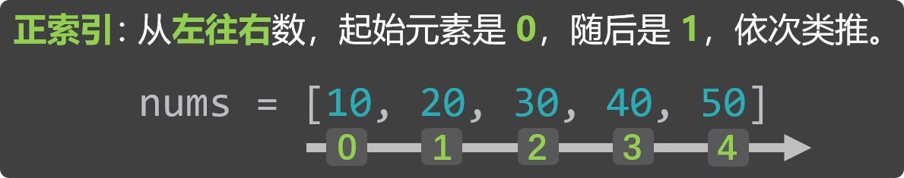
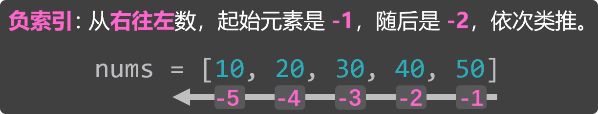
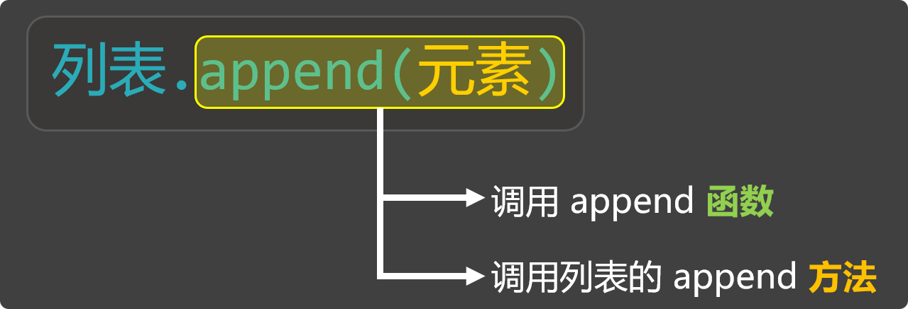
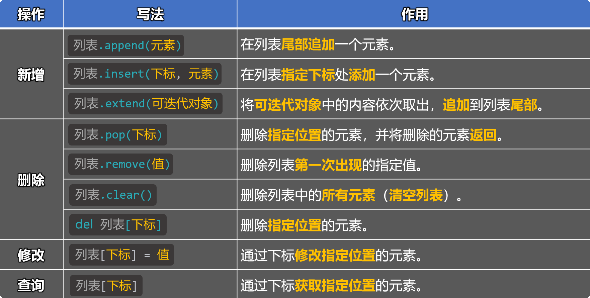
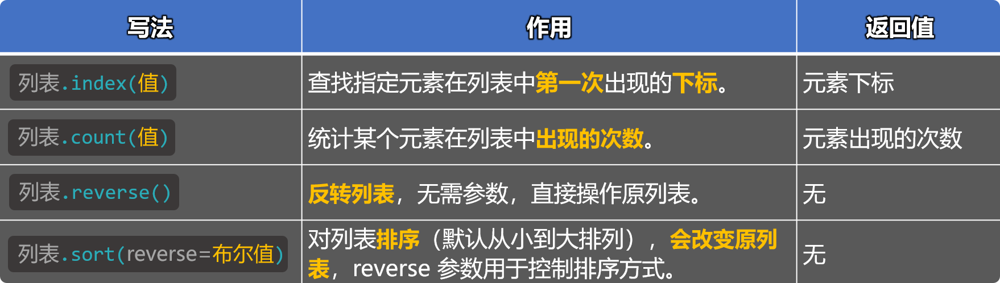
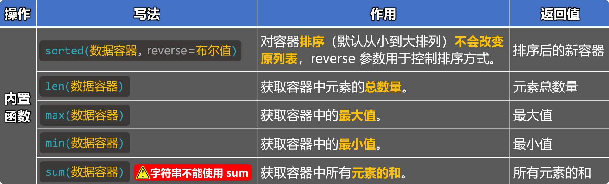
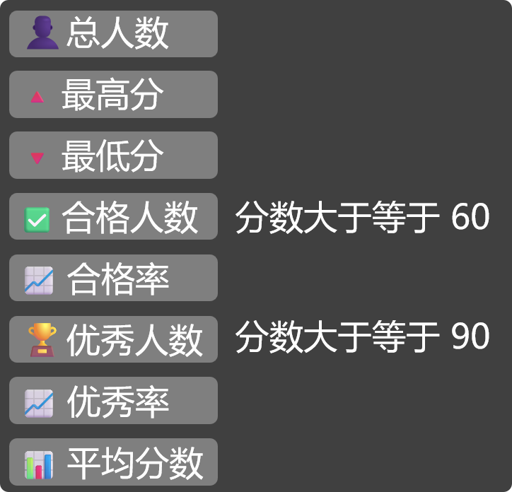
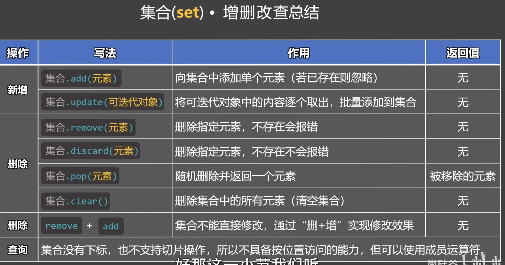

# 第 6 章 数据容器

## 6.1 概述

在编程中，我们经常需要一次保存多个数据，比如：多个学生的名字、一组商品的价格、或一串测量数据等等，如果把一条数据看作一个“物品”，那这些物品需要被放进“容器”里统一管理，在 Python 中，这种用来存放多个数据的东西，就叫做『数据容器』。


### 6.1.1 数据容器的特点：

1. 数据容器，有时也简称为**容器**。
2. 数据容器可以存放**多个数据**，每个数据也被称为一个**元素**。
3. 数据容器中的元素可以是**任意类型**。
4. 数据容器会给我们提供多种**操作元素**的方法。


### 6.1.2 Python 中常用的数据容器:

1. 列表（List）
2. 元组（tuple）
3. 字符串（str）
4. 集合（set）
5. 字典（dict）


## 6.2 列表

### 6.2.1 概述

**列表：**用来存放一组**有序的数据**，并且可以对其中的数据进行：增删改查。

列表就像一个长度可变的收纳盒，能按顺序装下多个元素，还可以随时添加、拿出、替换里面的元素。


### 6.2.2 定义列表

使用方括号`[]`来定义一个列表，不同元素之间用`,`去分隔。


```python
# 定义有内容的列表
list1 = [34, 56, 21, 56, 11]
list2 = ['北京', '尚硅谷', '你好啊']
list3 = [23, '尚硅谷', True, None]
list4 = [23, '尚硅谷', True, None, [100, 200, 300]] # list4 是一个嵌套列表

# 定义空列表（列表中的数据，后期会通过特定写法填充）
list5 = []
list6 = list()

print(list1, type(list1))  # [34, 56, 21, 56, 11] <class 'list'>
print(list2, type(list2))  # ['北京', '尚硅谷', '你好啊'] <class 'list'>
print(list3, type(list3))  # [23, '尚硅谷', True, None] <class 'list'>
print(list4, type(list4))  # [23, '尚硅谷', True, None, [100, 200, 300]] <class 'list'>
print(list5, type(list5))  # [] <class 'list'>
print(list6, type(list6))  # [] <class 'list'>
```

### 6.2.3 下标（索引值）

下标又叫索引值，其实就是元素在列表中的“位置编号”，分为：『正索引』、『负索引』。



 

下标最直接的用途就是：从列表中读取元素。

```python
# 定义一个列表
nums = [10, 20, 30, 40, 50]

# 测试正索引
print(nums[0])  # 10
print(nums[1])  # 20
print(nums[2])  # 30
print(nums[3])  # 40
print(nums[4])  # 50

# 测试负索引
print(nums[-1])  # 50
print(nums[-2])  # 40
print(nums[-3])  # 30
print(nums[-4])  # 20
print(nums[-5])  # 10

# 测试错误索引
print(nums[5]) 

# 定义一个嵌套列表
nums2 = [10, 20, ['你好啊','尚硅谷'], 40, 50]
# 取出“尚硅谷”
print(nums2[2][1])  # 尚硅谷
```

📢**注意：**通过下标取值时，下标不要超出范围，否则会报错。


### 6.2.4 列表的增删改查

我们先来认识一个名词 —— 『方法』，先来看如下的这种写法：


在上述写法中，如果只看`append(元素)`，这就是在调用`append`函数，但`append`前面还有`列表.`这种形式，所以也可以换一个说法，叫：调用列表的`append`方法。



那方法和函数之间是什么关系呢？从更正式的角度来说：当一个函数隶属于某个对象时，这个函数就被称为该对象的方法。不过对于初学者来说，这句话可能一时还不好理解，因为我们尚未学习“类”和“对象”等相关内容。所以这里大家暂时不必纠结方法的严格定义，只要先理解下面这种写法的含义即可：

- `b()`：这叫调用`b`函数。
- `a.b()`：这叫调用`a`的`b`方法。


📢**注意：**`a.b()`的形式不是随便写的，`a`如果是数字`100`，那就不可以写`a.b()`，因为这么写的前提是`a`的身上，得确实有`b`方法才可以。


列表的增删改查方法概览：



#### 6.2.4.1 新增

列表的新增指的是：向列表中添加元素，主要有如下三种添加方式：

**方式1**：使用：`列表.append(元素)`，在列表尾部追加一个元素。

```python
# 方式一：通过列表的append方法，在列表尾部追加一个元素
nums = [10, 20, 30, 40]
nums.append(50)
print(nums)  # [10, 20, 30, 40, 50]
```

**方式2**：使用：`列表.insert(元素)`，在指定下标处添加一个元素。

```python
# 方式二：通过列表的insert方法，在列表的指定下标处添加一个元素
nums = [10, 20, 30, 40]
nums.insert(2, 666)
print(nums)  # [10, 20, 666, 30, 40]
```

**方式3**：使用：`列表.extend(可迭代对象)`，将可迭代对象中的内容依次取出，追加到列表尾部。

```python
# 方式三：通过列表的extend方法，将可迭代对象中的内容依次取出，追加到列表尾部
nums = [10, 20, 30, 40]
nums.extend('尚硅谷')
nums.extend(range(1, 4))
nums.extend([70, 80, 90])
print(nums)  # [10, 20, 30, 40, '尚', '硅', '谷', 1, 2, 3, 70, 80, 90]
```

#### 6.2.4.2 删除

主要有如下四种删除方式：

**方式1：**使用：`列表.pop(下标)`，删除指定位置的元素，并将删除的元素返回。

```python
# 方式一：通过列表的pop方法，删除指定位置的元素，并返回该元素
nums = [10, 20, 10, 40, 50]
result = nums.pop(1)
print(nums)   # [10, 10, 40, 50]
print(result) # 20
```

**方式2：**使用：`列表.remove(值)`，删除列表中第一次出现的指定值。

```python
# 方式二：通过列表的remove方法，删除列表中第一次出现的指定值
nums = [10, 20, 10, 40, 50]
nums.remove(10)
print(nums)
```

**方式3：**使用：`列表.clear()`，删除列表中所有的元素（变成一个空列表）。

```python
# 方式三：通过列表的clear方法，删除列表中所有的元素（清空列表）
nums = [10, 20, 10, 40, 50]
nums.clear()
print(nums)  # [20, 10, 40, 50]
```

**方式4：**使用：`del 列表[下标]`，删除指定位置的元素。

```python
# 方式四：通过del关键字，删除指定元素
nums = [10, 20, 10, 40, 50]
del nums[3]
print(nums)  # [10, 20, 10, 50]
```

#### 6.2.4.3 修改

修改操作比较简单，主要是通过下标进行修改，语法为：`列表[下标] = 值`

```python
# 修改操作
nums = [10, 20, 10, 40, 50]
nums[2] = 66
print(nums)  # [10, 20, 66, 40, 50]
```

#### 6.2.4.4 查询

查询我们之前已经用过了，就是通过下标进行读取元素，语法为：`列表[下标]`

```python
# 查询操作
nums = [10, 20, 10, 40, 50]
print(nums[3]) # 40
```

### 6.2.5 列表的常用方法

除了上述的增删改查方法，列表中还有很多其他常用的方法：



1. 使用：`列表.index(值)`，查找指定元素在列表中第一次出现的下标，返回值是元素下标，匹配不到报错，不会找子数组

```python
fruits = ['香蕉', '苹果', '橙子', '香蕉']
result = fruits.index('香蕉')
print(result)  # 0
```

2. 使用：`列表.count(值)`，统计某个元素在列表中出现的次数，返回值是：元素出现的次数。

```python
nums = [10, 20, 10, 30, 10, 40, [10, 10, 10]]
result = nums.count(10)
print(result)  # 3
```

3. 使用：`列表.reverse()`，反转列表（会改变原列表），无需参数，无返回值。

```python
nums = [23, 11, 32, 30, 17, [6, 4, 8, 9]]
nums.reverse()
print(nums)  # [[6, 4, 8, 9], 17, 30, 32, 11, 23]
```

4. 使用：`列表.sort(reverse=布尔值)`，对列表排序（从小到大，会改变原列表），`reverse` 用于控制排序方式，无返回值。

```python
# 4.使用 sort 方法，对列表排序（默认从小到大），若想从大到小，可以将 reverse 参数设为True。
# 4.1 若列表中的元素：都是数字，则按照数字的大小顺序进行排序。
nums = [23, 11, 32, 30, 17]
nums.sort(reverse=True)
print(nums)  # [32, 30, 23, 17, 11]

# 4.2 若列表中的元素：既有数字，又有字符串，那就会报错。
nums = [23, 11, 32, 30, 17, '尚硅谷']
nums.sort()
print(nums) # [23, 11, 32, 30, 17, '尚硅谷']

# 4.3 若列表中的元素：都是字符串，则按照字符串的 Unicode 编码大小进行排序
msg_list = ['北京', '北硅谷', '北好']
msg_list.sort()
print(msg_list)  # ['北京', '北好', '北硅谷']
print(ord('京'), ord('好'), ord('硅'))  # ['北京', '北好', '北硅谷']

# 备注：所有的列表方法，都只作用于“当前层”的元素（浅层操作），不会自动进入嵌套的“里层”结构中。
```

### 6.2.6 列表的常用内置函数

Python 中有一些内置函数，可以用来处理列表，常用的几个如下：



📢**注意：**✅️上述内置函数，不仅适用于列表，而是适用于：所有的数据容器。


1. `sorted(数据容器, reverse=布尔值)`，对容器排序（从小到大，不会改变原容器），返回值：经过排序的新容器。

```python
# 1.使用内置的 sorted 函数，返回一个排序后的新容器（不改变原容器，默认顺序：从小到大）
# 1.1 若列容器中的元素：都是数字，则按照数字的大小顺序进行排序。
nums = [23, 11, 32, 30, 17]
result = sorted(nums, reverse=True)
print(nums)   # [23, 11, 32, 30, 17]
print(result) # [32, 30, 23, 17, 11]

# 1.2 若列容器中的元素：既有数字，又有字符串，那就会报错。
nums = [23, 11, 32, 30, 17, '尚硅谷']
sorted(nums)

# 1.3 若列容器中的元素：都是字符串，则按照字符串的 Unicode 编码大小进行排序。
msg_list = ['北京', '尚硅谷', '你好']
result = sorted(msg_list)
print(msg_list)  # ['北京', '尚硅谷', '你好']
print(result) # ['你好', '北京', '尚硅谷']
```

2. `len(数据容器)`，获取容器中元素的个数，返回值：元素个数。

```python
# 2.使用内置的 len 函数，获取容器中元素的总数量，返回值是：元素总数量。
nums = [10, 20, 10, 30, 10, 40, [50, 60, 70]]
result = len(nums)
print(result) # 7
```

3. `max(数据容器)`，返回容器中 或 多个值中的最大值，返回值：容器中的最大值。

```python
# 3.使用内置的 max 函数，获取容器中的最大值，返回值是：最大值。
# 3.1 如果容器中的元素：都是数字，那 max 返回的是最大的数。
nums = [23, 11, 32, 30, 17]
result = max(nums)
print(nums) # [23, 11, 32, 30, 17]
print(result) # 32

# 3.2 如果容器中的元素：既有数字又有字符串，那 max 会报错。
nums = [23, 11, 32, 30, 17, '尚硅谷']
max(nums)

# 3.3 如果容器中的元素：都是字符串，那 max 会返回：Unicode 编码最大的字符。
msg_list = ['北京', '尚硅谷', '你好']
result = max(msg_list)
print(msg_list)  # ['北京', '尚硅谷', '你好']
print(result)  # 尚硅谷

# 3.4 max 函数也可以接收多个值，并筛选出最大值
result = max(33, 45, 12, 78, 99)
print(result) # 99
```

4. `min(数据容器)`，返回容器中 或 多个值中的最小值，返回值：容器中的最小值。

```python
# 4.使用内置的 min 函数，获取容器中的最小值，返回值是：最小值。
# 备注：min 函数的使用方式与注意点与 max 函数一样，只不过 min 函数返回的是最小值
nums = [23, 11, 32, 30, 17]
result = min(nums)
print(result) # 11
```

5. `sum(数据容器)`，对容器中所有元素求和（只能是数值类型），返回值：所有元素的和。

```python
# 5.使用内置的 sum 函数，对容器中的数据进行求和（元素只能是数值）。
nums = [10, 20, 30, 40, 50]
result = sum(nums)
print(result) # 150
```

### 6.2.7 列表的循环遍历

所谓遍历，就是将列表的每个元素依次取出进行处理，代码如下：

```python
# 定义一个成绩列表
score_list = [62, 50, 60, 48, 80, 20, 95]

# 使用while循环遍历列表
index = 0
while index < len(score_list):
    print(score_list[index])
    index += 1
# 使用for循环遍历列表
for item in score_list:
    print(item)

# 使用for循环遍历列表（通过range函数 和 len函数按照索引遍历）
for index in range(len(score_list)):
    print(score_list[index])
```

1. 在上述遍历中，`while`循环需要结束条件，所以我们定义了`index`变量，所以打印时，就可以方便的借助`index`输出当前元素是第几个。
2. 而`for`循环的遍历，不需要`index`，那如果也想打印元素是第几个，但又不想去定义`index`的话，可以借助`enumerate`这个内置函数，它可以在遍历时**获取索引和值**，代码如下：

```python
# 使用for循环遍历列表（通过enumerate函数，同时获取下标（索引值）和元素）
# enumerate 的 start 参数，可以让计数从指定值开始（改变的是循环时的“编号”，不是真正的索引值,也不会减少循环的次数，仅仅是改变index的起始值）
for index, item in enumerate(score_list, start=5):
    print(index, item, score_list[0])
print('最后的打印', score_list[0])
```

### 6.2.8 列表特点总结

1. 可存放不同类型的元素。
2. 元素是有序存储的（正索引、负索引）。
3. 列表中的元素允许重复。
4. 元素是允许修改的（增、删、改、查、其他操作）。
5. 长度不固定，可以随着操作自动调整大小。

一句话总结：列表是最常用的数据容器，当遇到要“存储一批数据”的场景时，首选列表。


### 6.2.9 列表小练习

**需求：**实现一个成绩统计程序，可以对多名学生的成绩，进行统计和分析。具体统计的项目如下图：



**📋备注**：用户可以连续输入学生成绩，直到用户输入“结束”字符串。


```python
print('请输入学生成绩，输入“结束”停止录入')
score_list = []

# 持续循环，让用户输入学生成绩
while True:
    data = input('📝请输入成绩：')
    if data == '结束':
        break
    else:
        score_list.append(int(data))

# 如果score_list中有数据，则开始统计
if score_list:
    # 统计平均分
    avg = sum(score_list) / len(score_list)
    # 合格人数
    pass_count = 0
    # 优秀人数
    excellent_count = 0
    # 遍历列表，开始统计
    for item in score_list:
        if item >= 60:
            pass_count += 1
        if item >= 90:
            excellent_count += 1
    # 合格率
    pass_rate = pass_count / len(score_list) * 100
    # 优秀率
    excellent_rate = excellent_count / len(score_list) * 100
    # 打印信息
    print('⬇️统计信息如下⬇️')
    print(f'🧑‍🎓总人数为：{len(score_list)}')
    print(f'🔺最高分为：{max(score_list)}')
    print(f'🔻最低分为：{min(score_list)}')
    print(f'✅合格人数：{pass_count}人')
    print(f'📈合格率为：{pass_rate:.1f}%')
    print(f'🏆优秀人数：{excellent_count}人')
    print(f'📈优秀率为：{excellent_rate:.1f}%')
    print(f'📊平均分数：{avg:.1f}')
else:
    print('您没有输入任何成绩！')
```

## 6.2 元组

### 6.2.1 概述

**元组：**用来存放一组有序的数据，但其中的内容一旦创建就**不可修改**（不能增、删、改，只能查）。

由于元组不可变，所以元组不能使用append()，insert()这些方法，它里面的元素也不能被重新赋值。


### 6.2.2 定义元组

使用方括号`()`来定义一个列表，用`,`去分隔不同的元素：

```python
# 定义有内容的元组
t1 = (28, 67, 21, 67, 11)
t2 = ('北京', '尚硅谷', '你好')
t3 = (100, True, '你好', None)
t4 = (100, True, '你好', None, (50, 60, 70))
print(type(t1), t1)  # <class 'tuple'> (28, 67, 21, 67, 11)
print(type(t2), t2)  # <class 'tuple'> ('北京', '尚硅谷', '你好')
print(type(t3), t3)  # <class 'tuple'> (100, True, '你好', None)
print(type(t4), t4)  # <class 'tuple'> (100, True, '你好', None, (50, 60, 70))

# 定义空元组
t1 = ()
t2 = tuple()
print(type(t1), t1)  # <class 'tuple'> ()
print(type(t2), t2)  # <class 'tuple'> ()
```

当元组中只有一个元素时，末尾必须写上`,`

```python
# 定义只有一个元素的元组
t1 = ('你好',)
t2 = (18,)
print(type(t1), t1)  # <class 'tuple'> ('你好',)
print(type(t2), t2)  # <class 'tuple'> (18,)
```

实际开发中的元组，不一定是我们自己定义的，比如函数的可变参数`*args`就是一个元组

```python
# 实际开发中的元组，不一定是我们自己定义的，比如函数的可变参数*args就是一个元组
def demo(*args):
    return sum(args)
result = demo(100, 200, 300)
print(result)  # 600
```

### 6.2.3 读取数据

元组也支持下标，所以使用`元组名[索引值]`的方式来读取值。

```python
# 元组的下标
t1 = (28, 67, 21, 67, 11)
print(t1[3])  # 67
print(t1[-1]) # 11
```

### 6.2.4 元组不可修改

元组中的元素，不可修改，但元组中如果存放了可变类型（如：列表），那可变类型中的内容仍可修改。

```python
# 元组中的元素，不可修改
t1 = (28, 67, 21, 67, 11)
t1[0] = 100

# 元组中的元素，不可修改，但元组中如果存放了可变类型（列表），那可变类型中的内容仍可修改
t2 = (28, 67, 21, 67, 11, [100, 200, 300, ('你好', '尚硅谷')])
t2[5] = 400
t2[5][2] = 400
t2[5][3][0] = 'hello'
print(t2)
```

### 6.2.5 元组的常用方法

由于元组不可修改，所以它的常用方法只有两个：

1. 使用`元组.index(元素)`，获取指定元素在元组中第一次出现的下标。

```python
# index 方法：获取指定元素在元组中第一次出现的下标。
t1 = (28, 67, 21, 67, 11)
result = t1.index(67)
print(result)  # 1
```

2. 使用`元组.count(元组)`，统计指定元素在元组中出现的次数。

```python
# count 方法：统计指定元素在元组中出现的次数。
t1 = (28, 67, 21, 67, 11)
result = t1.count(67)
print(result)  # 2
```

### 6.2.6 元组的常用内置函数

元组的常用内置函数和列表一样，依然是这几个：`max`、`min`、`len`、`sorted`、`sum`。

```python
# 常用内置函数
# max 函数，返回元组中的最大值
t1 = (23, 11, 32, 30, 17)
result = max(t1)
print(result)  # 32

# min 函数，返回元组中的最小值
t1 = (23, 11, 32, 30, 17)
result = min(t1)
print(result)  # 11

# len 函数，返回元组中元素的个数（元组长度）
t1 = (23, 11, 32, 30, 17)
result = len(t1)
print(result)  # 5

# sorted 函数，对元组进行排序（不修改原元组，返回一个新的列表）
t1 = (23, 11, 32, 30, 17)
result = sorted(t1, reverse=True)
print(tuple(result)) # (32, 30, 23, 17, 11)

# sum 函数，统计元组中所有元素的和（元素必须是纯数字）
t1 = (23, 11, 32, 30, 17)
result = sum(t1)
print(result) # 113
```

### 6.2.7 元组的循环遍历

元组的遍历与列表一样，可以使用`while`循环遍历，或`for`循环遍历。

```python
# 元组的循环遍历
t1 = (23, 11, 32, 30, 17)

# while循环遍历
index = 0
while index < len(t1):
    print(t1[index])
    index += 1
# 元组的循环遍历
t1 = (23, 11, 32, 30, 17)

# for循环遍历
for item in t1:
    print(item)

for index,item in enumerate(t1,start=5):
    print(f'{index},{item}')
```

### 6.2.8 解包列表或元组传参

解包列表、解包元组传参，就是把其中的元素依次取出，作为多个独立的参数传入函数。

```python
# 定义函数时，使用*args（变量不一定非要用args，比如写：*data也行），将收到的多个参数，打包成一个元组
def test(*args):
    print(f'我是test函数，我收到的参数是：{args}，参数类型是：{type(args)}')

list1 = [100, 200, 300, 400]
tuple1 = ('你好', '北京', '尚硅谷')

# 函数调用时，正常传递：列表 或 元组
# test(list1)
# test(tuple1)

# 函数调用时，使用*对：列表 或 元组进行解包后，再传递参数
test(*list1)  # 此种写法相当于：test(100, 200, 300, 400)
test(*tuple1)  # 此种写法相当于：test('你好', '北京', '尚硅谷')
```

### 6.2.9 元组特点总结

1. 可存放不同类型的元素。
2. 元素是有序存储的（正索引、负索引）。
3. 元组中的元素允许重复。
4. 元素不允许修改（不能：增、删、改、只能：查）。
5. 长度固定定（一旦创建，元素个数不能增减）。

一句话总结：元组是一种“只读”的数据容器，想保存一批“不会变的数据”时，首选元组。


### 6.2.10 元组 VS 列表

|    区别点    |      列表（list）      |        元组（tuple）         |
| :----------: | :--------------------: | :--------------------------: |
| **是否可变** |          可变          |            不可变            |
| **使用场景** |      可变数据集合      | 不变的结构化数据，安全性更高 |
|   **语义**   | 表示一组可能变化的数据 |    表示一组固定结构的数据    |

注意：元组不是用来替代列表的，而是用来在数据不需要修改的情况下，作为列表的补充选择。  


## 6.3 字符串

### 6.3.1 概述

**字符串（str）**：用来存放一组有序的字符数据，但其中的内容不可修改（只能查，不能增删改）， 我们之前讲解了一部分字符串的相关知识，如：字符串的定义方式、字符串的格式化输出等，这些内容就不在本小节重复讲解了。

### 6.3.2 字符串的特点

1. 字符串和列表、元组一样，也支持下标

```python
# 字符串的下标
msg = 'welcome to atguigu'
print(msg[3])  # c
print(msg[-1]) # u
```

2. 字符串不可修改，不可嵌套

```python
# 字符串中的字符，不可修改
msg = 'welcome to atguigu'
msg[0] = 'a'

# 字符串不能嵌套
msg = 'welcome to'hello' atguigu'
msg = 'welcome to"hello" atguigu'
msg = 'welcome to\'hello\' atguigu'
```

### 6.3.3 字符串常用方法

1. 使用`字符串.index(字符)`，获取『指定字符』在字符串中『第一次』出现的下标，返回值：下标。

```python
# index 方法：获取指定字符，在字符串中第一次出现的下标，没找到旧报错
msg = 'welcome to atguigu'
result = msg.index('t')
print(result)  # 8
```

2. 使用`字符串.split(字符)`，将字符串按照『指定字符』进行分隔，返回值：列表。

```python
# split 方法：将字符串按照指定字符进行分隔，并将分隔后的内容存入一个列表
msg  = '尚硅谷@atguigu@你好'
result = msg.split('@')
print(msg)  # 尚硅谷@atguigu@你好
print(result)  # ['尚硅谷', 'atguigu', '你好']
```

3. 使用`字符串.replace(字符串片段)`，将字符串中的某个字符串片段，替换成目标字符串，不会修改原字符串，返回新字符串。

```python
# replace 方法：将字符串中的某个字符片段，替换成目标字符串（不修改原字符串，返回新字符串）
msg = 'welcome to atguigu'
result = msg.replace('atguigu', '尚硅谷')
print(msg)    # welcome to atguigu
print(result) # welcome to 尚硅谷
```

4. 使用`字符串.count(字符)`，统计『指定字符』在字符串中出现的次数，返回值：下标。

```python
# count 方法：统计指定字符，在字符串中出现的次数
msg = 'welcome to atguigu'
result = msg.count('g')
print(result)  # 2
```

5. 使用`字符串.strip()`，从某个字符串中删除指定字符串中的任意字符，不会修改原字符串，返回值：新字符串。

```python
# strip 方法：从某个字符串中删除：指定字符串中的任意字符
# 规则：从字符串两端开始删除，直到遇到第一个不在字符串中的字符就停下
msg = '666尚6硅6谷666'
result = msg.strip('6')
print(msg)    # 666尚6硅6谷666
print(result) # 尚6硅6谷 

msg = '1234尚12硅34谷4321'
result = msg.strip('1324')
print(msg)     # 1234尚12硅34谷4321
print(result)  # 尚12硅34谷

msg = '34215尚12硅34谷4132'
result = msg.strip('5432')
print(msg)   # 34215尚12硅34谷4132
print(result)# 15尚12硅34谷41

msg = '  尚硅谷  '
result = msg.strip()
print(msg)   #   尚硅谷  
print(result)# 尚硅谷
```

### 6.3.4 字符串常用内置函数

字符串也可以使用：`max`、`min`、`len`、`sorted`、`sum`函数，但实际开发中`len`函数最常用。

```python
# len 函数：统计字符串中字符的个数（字符串长度）
msg = 'welcome to atguigu'
result = len(msg)
print(result) # 18
```

### 6.3.5 遍历字符串

字符串的遍历，与列表一样，可以使用`while`循环遍历，或`for`循环遍历。

```python
msg = 'welcome to atguigu'
# while循环遍历
index = 0
while index < len(msg):
    print(msg[index])
    index += 1
msg = 'welcome to atguigu'

# for循环遍历
for item in msg:
    print(item)

# for循环遍历
for index,item in enumerate(msg):
    print(f'{index},{item}')
```

## 6.4 序列的切片操作

### 6.4.1 概述

**何为序列？**—— 能连续存放元素的数据容器，而且元素有**先后顺序**，而且可以通过**下标访问**，所以我们学过的：列表、元组、字符串，都是序列。

**何为切片？**—— 从序列中按照指定范围，取出一部分元素，形成一个新的序列的操作。

### 6.4.2 基本语法

语法格式为：序列[起始索引:结束索引:步长]

相关注意点如下：

1. 切片操作的区间是**左闭右开**的，即：截取时包含起始位置，但不包含结束位置。
2. 步长是指取出元素时的间隔，例如：
   - 步长为 1，就是一个一个取出。
   - 步长为 2，就是每次越过 1 个元素取出。
   - 步长为 3，就是每次越过 2 个元素取出。
   - 步长为 n，就是每次越过 n-1 个元素取出。
3. 起始索引默认值为 0，结束索引默认截取到末尾，步长默认值为 1。
4. 当起始索引大于结束索引时，步长必须为负数，否则结果是空列表。


测试代码：

```python
# 对列表进行切片
list1 = [10, 20, 30, 40, 50, 60, 70, 80, 90, 100]
list2 = list1[0:5:1]
print(list2)  # [10, 20, 30, 40, 50]

list1 = [10, 20, 30, 40, 50, 60, 70, 80, 90, 100]
list2 = list1[1:8:2]
print(list2)  # [20, 40, 60, 80]

list1 = [10, 20, 30, 40, 50, 60, 70, 80, 90, 100]
list2 = list1[1:8:3]
print(list2)  # [20, 40, 60, 80]

list1 = [10, 20, 30, 40, 50, 60, 70, 80, 90, 100]
list2 = list1[::]  # [10, 20, 30, 40, 50, 60, 70, 80, 90, 100]
print(list2)

list1 = [10, 20, 30, 40, 50, 60, 70, 80, 90, 100]
list2 = list1[:999:] 
print(list2) # [10, 20, 30, 40, 50, 60, 70, 80, 90, 100]

list1 = [10, 20, 30, 40, 50, 60, 70, 80, 90, 100]
list2 = list1[3::]  
print(list2)  # [40, 50, 60, 70, 80, 90, 100]

list1 = [10, 20, 30, 40, 50, 60, 70, 80, 90, 100]
list2 = list1[:5:]
print(list2)  # [10, 20, 30, 40, 50]

list1 = [10, 20, 30, 40, 50, 60, 70, 80, 90, 100]
list2 = list1[::4]
print(list2)  # [10, 50, 90]

# 当起始索引大于结束索引时，步长必须为负数，否则结果是空列表。
list1 = [10, 20, 30, 40, 50, 60, 70, 80, 90, 100]
list2 = list1[7:2:-1]
print(list2)  # [80, 70, 60, 50, 40]

# 一个特殊情况：当同时省略起始索引和结束索引时，如果步长为负数，那Python会自动对调：起始位置和结束位置
list1 = [10, 20, 30, 40, 50, 60, 70, 80, 90, 100]
list2 = list1[::-1]
print(list2)  # [100, 90, 80, 70, 60, 50, 40, 30, 20, 10]

# 对元组进行切片
tuple1 = (10, 20, 30, 40, 50, 60, 70, 80, 90, 100)
tuple2 = tuple1[0:5:1]
print(tuple2)  # (10, 20, 30, 40, 50)

# 对字符串进行切片
msg1 = 'welcome to atguigu'
msg2 = msg1[2:9:2]
print(msg2)  # (10, 20, 30, 40, 50)
```

## 6.5 序列的其他操作

1. 序列相加： 把两个序列拼接在一起。

📢**注意：**只有同类型的序列才能相加（字符串+字符串、列表+列表、元组+元组）


```python
# 列表相加
list1 = [10, 20, 30, 40]
list2 = [50, 60, 70, 80]
list3 = list1 + list2
print(list3)  # [10, 20, 30, 40, 50, 60, 70, 80]

# 元组相加
tuple1 = (10, 20, 30, 40)
tuple2 = (50, 60, 70, 80)
tuple3 = tuple1 + tuple2
print(tuple3)  # (10, 20, 30, 40, 50, 60, 70, 80)

# 字符换相加
str1 = 'hello'
str2 = 'atguigu'
str3 = str1 + str2
print(str3) # helloatguigu

# 错误示例
list1 = [10, 20, 30, 40]
str1 = 'hello'
print(list1 + str1) # 报错
```

2. 序列相乘（重复）：把序列重复指定的次数。

```python
# 序列相乘（重复）
list1 = [10, 20, 30, 40]
list2 = list1 * 3
print(list2)  # [10, 20, 30, 40, 10, 20, 30, 40, 10, 20, 30, 40]

tuple1 = (10, 20, 30, 40)
tuple2 = tuple1 * 3
print(tuple2)  # (10, 20, 30, 40, 10, 20, 30, 40, 10, 20, 30, 40)

str1 = 'hello'
str2 = str1 * 6
print(str2)  # hellohellohellohellohellohello
```

## 6.6 集合

### 6.6.1 概述

集合是一种：**无序**、**元素唯一**的容器类型。

📋**备注：**无序是指从集合中取出元素的顺序，与定义集合时存入的顺序不一定一致。

集合分为两种，分别是：

1. **可变集合（set）**：内部的元素无序（不保证顺序）、不能通过下标访问元素、会自动去除重复元素。
2. **不可变集合（forzenset）**：特点和可变集合一样，唯一的区别就是：其中的元素不可修改。

### 6.6.2 定义集合

1. 可变集合的定义方式：使用花括号`{}`包裹，不同的数据项之间，用`,`做分隔。

```python
# 定义有内容的【可变集合】
s1 = {10, 20, 20, 30, 40, 40, 50, 60, 60, 70, 80, 90, 100}
s2 = {'你好', 'hello', '你好', 'atguigu', '北京'}
s3 = {10, '你好', True, 1, 12.4}
print(type(s1), s1)  # <class 'set'> {100, 70, 40, 10, 80, 50, 20, 90, 60, 30}
print(type(s2), s2)  # <class 'set'> {'atguigu', 'hello', '你好', '北京'}
print(type(s3), s3)  # <class 'set'> {True, 10, '你好', 12.4}

# 定义空集合（可变集合）
s1 = set()
print(type(s1), s1)  # <class 'set'> set()
```

**📢注意：**不能直接写`{}`来定义空集合，因为直接写`{}`定义的是：空字典。

```python
# 不能直接写{}来定义空集合，因为直接写{}定义的是：空字典
s2 = {}
print(type(s2), s2)  # <class 'dict'> {}
```

2. 不可变集合的定义方式：借助内置的`forzenset`函数。

```python
# 定义有内容的【不可变集合】
s1 = frozenset({10, 20, 20, 30, 40, 40, 50, 60, 60, 70, 80, 90, 100})
s2 = frozenset({'你好', 'hello', '你好', 'atguigu', '北京'})
s3 = frozenset({10, '你好', True, 1, 12.4})
print(type(s1), s1)
print(type(s2), s2)
print(type(s3), s3)

# frozenset 接收的参数，可以是任意可迭代对象，但最终返回的一定是【不可变集合】
s1 = frozenset([10, 20, 30, 40, 50])
s2 = frozenset((10, 20, 30, 40, 50))
s3 = frozenset('hello')
print(type(s1), s1)
print(type(s2), s2)
print(type(s3), s3)

# 定义空集合（不可变集合）
s3 = frozenset()
print(type(s3), s3)
```

3. 集合中不能嵌套【可变集合】，但可以嵌套【不可变集合】

> 为什么会这样？—— 只有“不可变”的东西，才能安全的放进集合里。因为SET通过hashCode来定位和查找，是通过整个元素的hash值定位的，如果元素可变，那查找hash值时会丢失

```python
# 集合中不能嵌套【可变集合】，但可以嵌套【不可变集合】
# 通俗理解：只有“不可变”的东西，才能安全的放进集合里
s1 = {10, 20, 30, 40, 50}
s2 = frozenset({100, 200, 300, 400, 500})
l1 = [666, 777, 888]
t1 = ('hello', 'atguigu', '北京')

s3 = {11, 22, 33, s1}  # 报错
s3 = {11, 22, 33, s2}  # 没问题
s3 = {11, 22, 33, l1}  # 报错
s3 = {11, 22, 33, t1}  # 没问题
print(s3)
```

### 6.2.3 增删改查

1.新增

**方式1：**使用`集合.add(元素)`，向集合中添加元素，无返回值。

```python
# add方法：向集合中添加元素
s1 = {10, 20, 30, 40, 50}
s1.add(60)
print(s1)
```

**方式2：**使用`集合.update(元素)`，向集合中批量添加元素（接收可迭代对象），无返回值。不是更新元素

```python
# update方法：向集合中添加元素（必须传递可迭代对象，例如：列表、元组、集合等）
s1 = {10, 20, 30, 40, 50}
s1.update([60, 70])
s1.update((80, 90))
s1.update({100, 200})
s1.update(range(300, 308))
print(s1)
```

2. 删除

**方式1：**使用`集合.remove(元素)`，从集合中移除指定元素（若元素不存在，会报错），无返回值。

```python
# remove方法：从集合中移除元素（移除不存在的元素，会报错）
s1 = {10, 20, 30, 40, 50}
s1.remove(20)
print(s1)
```

**方式2：**使用`集合.discard(元素)`，从集合中移除指定元素（若元素不存在，不会报错），无返回值。

```python
# discard方法：从集合中移除元素（移除不存在的元素，不会报错）
s1 = {10, 20, 30, 40, 50}
s1.discard(80)
print(s1)
```

**方式3：**使用`集合.pop()`，从集合中移除一个任意元素，返回值：移除的那个元素。

```python
# pop方法：从集合中移除一个任意元素，返回值是移除的那个元素
s1 = {10, 20, 30, 40, 50}
s2 = {'你好', '北京', '尚硅谷', 'hello'}
result = s1.pop()
print(s1)
print(result)
```

**方式4：**使用`集合.clear()`，清空集合，无返回值。

```python
# clear方法：清空集合
s1 = {10, 20, 30, 40, 50}
s1.clear()
print(s1)
```

3. 修改

**📢注意：**集合没有下标，也不支持`replace`方法，所以集合没有专门用于“改”的方法，但可以使用：`remove`+`add`的组合，来达到“修改”的效果。


```python
# 改
# 使用 add + remove 的组合，来实现修改的效果
s1 = {10, 20, 30, 40, 50}
s1.remove(20)
s1.add(66)
print(s1)
```

4. 查询

**📢注意：**由于集合没有下标，也不支持切片操作，所以集合不具备按位置访问的能力。虽然不能通过下标读取元素，但可以使用【成员运算符】来判断：某个元素是否在集合中，成员运算符我们会放在后面讲，不过大家可以提前感受一下：


```python
# 查：集合不能通过下标去读取元素，但能通过 【成员运算符】去查看集合中是否包含指定元素
# 由于成员运算符适用于所有数据容器，所以我们会等所有数据容器都讲完以后，再说成员运算符
s1 = {10, 20, 30, 40, 50}
# s1[0] # 此行报错，因为集合不能通过下标访问元素

# 先提前感受一下成员运算符
result = 20 not in s1
print(result)
```



### 6.2.4 常用方法

集合常用的方法有如下几个：

1. 使用`集合A.difference(集合B)`，找出集合A中，不同于集合B的元素。

```
# 集合A.difference(集合B)：
# 作用：找出集合A中，不同于集合B的元素（集合A 与 集合B 都不变，返回的是一个新的集合）
s1 = {10, 20, 30, 40, 50}
s2 = {30, 40, 50, 60, 70}
result = s1.difference(s2)
print(s1)
print(s2)
print(result)
```

2. 使用`集合A.difference_update(集合B)`，从集合A中，删除集合B中存在的元素。

```
# 集合A.difference_update(集合B)：
# 作用：从集合A中，删除集合B中存在的元素（集合A会被修改，集合B不会）
s1 = {10, 20, 30, 40, 50}
s2 = {30, 40, 50, 60, 70}
s1.difference_update(s2)
print(s1)
print(s2)
```

3. 使用`集合A.union(集合B)`，合并两个集合，集合A 和 集合B 都不变，返回的是一个新的集合。

```
# 集合A.union(集合B)：
# 作用：合并两个集合，集合A 和 集合B 都不变，返回的是一个新的集合
s1 = {10, 20, 30, 40, 50}
s2 = {30, 40, 50, 60, 70}
result = s2.union(s1)
print(s1)
print(s2)
print(result)
```

4️⃣使用`集合A.issubset(集合B)`，判断集合A是否为集合B的子集，返回值为布尔值。

```
# 集合A.issubset(集合B)：
# 作用：判断集合A是否为集合B的子集
# 如果 集合A的所有元素都在集合B中，那就返回True，否则返回False
s1 = {10, 20, 30, 40, 50}
s2 = {30, 40, 50, 60, 70}
s3 = {30, 40, 50}
result = s3.issubset(s1)
print(result)
```

5️⃣使用`集合A.issuperset(集合B)`，判断集合A是否是集合B的超集，返回值为布尔值。

```
# 集合A.issuperset(集合B)：
# 作用：判断集合A是否是集合B的超集
# 如果集合A中，包含了集合B中的所有元素，那就返回True，否则返回False
s1 = {10, 20, 30, 40, 50}
s2 = {30, 40, 50, 60, 70}
s3 = {30, 40, 50}
result = s1.issuperset(s3)
print(result)
```

6️⃣使用`集合A.isdisjoint(集合B)`，判断集合A和集合B是否没有交集，返回值为布尔值。

```
# 集合A.isdisjoint(集合B)：
# 作用：
# 如果没有交集，返回True；只要有一个公共元素，就返回False
s1 = {10, 20, 30, 40, 50}
s2 = {30, 40, 50, 60, 70}
s3 = {80, 90}
result = s1.isdisjoint(s2)
print(result)
```

### 集合的数学运算

集合的数学运算如下：

```
s1 = {10, 20, 30, 40, 50, 60}
s2 = {40, 50, 60, 70, 80, 90}

# 并集
result = s1 | s2
print(result)

# 交集
result = s1 & s2
print(result)

# 差集
result = s1 - s2
print(result)

# 对称差集
result = s1 ^ s2
print(result)
```

### 集合的循环遍历

由于集合不支持下标，所以集合不能使用 while 循环遍历。

```
s1 = {10, 20, 30, 40, 50, 60}

# 集合不能使用while循环遍历（以下是错误示例）
# index = 0
# while index < len(s1):
#     print(s1[index])
#     index += 1

# 集合可以使用for循环遍历
for item in s1:
    print(item)
```

### 集合特点总结

1. 无序：集合中的元素没有固定顺序，无法通过下标访问。
2. 不重复：集合会自动去重，同一个元素只会保留一份。
3. 分为两种：可变集合合（set）和不可变集合（forzenset）。
4. 集合中的元素必须是不可变类型（如：数字、字符串、元组）。
5. 集合支持：并集、交集、差集、对称差集等数学操作。

**📍一句话总结：**集合是可以去重的数据容器，当只关心元素是否存在，而不在乎顺序的时，首选集合。


## 字典

### 概述

**字典：**用来存放一组『键值对』数据，可通过『键(key)』对『值(value)』进行：增、删、改、查操作。

> 字典就像一个带标签的收纳盒，你贴上标签（键），然后放进东西（值） 。

### 定义字典

用大括号`{}`包裹，每个元素之间用逗号`,`分隔，每个元素的格式为`key:value`

```
# 定义有内容的字典
d1 = {'张三': 72, '李四': 60, '王五': 85}
print(type(d1), d1)
```

字典中的 key 不能重复，若出现重复，则后写的会覆盖之前写的。

```
# 字典中的key不能重复，若出现重复，则后写的会覆盖之前写的
d1 = {'张三': 72, '李四': 60, '王五': 85, '张三': 99}
print(d1)
```

定义空字典

```
# 定义空字典
d1 = {}
d2 = dict()
print(type(d1), d1)
print(type(d2), d2)
```

字典中的 key 必须是不可变类型，但 value 可以是任意类型。

```
# 字典中的key必须是不可变类型，但value可以是任意类型
# 通俗理解：只有不可变的东西，才能作为key
d1 = {250: 72, '李四': 60, '王五': 85}
d2 = {('抽烟', '喝酒'): 72, '李四': 60, '王五': 85}
# print(d1)
# print(d2)

# 错误示例：将列表作为key，是不行的
# d2 = {['抽烟', '喝酒']: 72, '李四': 60, '王五': 85}
```

字典可以嵌套

```
# 字典可以嵌套
student_dict = {
    2025001: {
        '姓名': '张三',
        '年龄': 18,
        '成绩': 72,
        '爱好': ['抽烟', '喝酒', '烫头']
    },
    2025002: {
        '姓名': '李四',
        '年龄': 19,
        '成绩': 60,
        '爱好': ['唱歌', '跳舞', '打台球']
    },
    2025003: {
        '姓名': '王五',
        '年龄': 20,
        '成绩': 85,
        '爱好': ['学习', '看书', '打太极']
    }
}
print(student_dict)
```

### 字典的增删改查

1️⃣**新增**

新增语法：`字典[key] = 值`

```
# 新增
d1 = {'张三': 72, '李四': 60, '王五': 85}
d1['赵六'] = 100
print(d1)
```

**2️⃣删除**

```
# 删除
d1 = {'张三': 72, '李四': 60, '王五': 85}

# 删除指定key所对应的那组键值对
del d1['张三']
print(d1)

# 删除指定key所对应的那组键值对，并返回这个key所对应的值
result = d1.pop('张三')
print(d1)
print(result)

# pop方法可以设置默认值
# 默认值可以保证：当要删除的key不存在的情况下，程序不会报错，并且返回这个默认值
result = d1.pop('奥特曼', '删除失败！')
print(d1)
print(result)

# 清空字典
d1.clear()
print(d1)
```

**3️⃣修改**

```
d1 = {'张三': 72, '李四': 60, '王五': 85}

# 修改的写法，与新增的写法一样，若字典中有对应的key，就是修改；若没有，就是新增
d1['张三'] = 97
print(d1)

# 批量修改
d1.update({'李四': 40, '王五': 67})
print(d1)
```

**4️⃣查询**

```
# 查询
d1 = {'张三': 72, '李四': 60, '王五': 85}

# 直接取值，若键（key）不存在，会报错
result = d1['张三']

# 安全取值，若键（key）不存在，会返回默认值（若没有设置默认值，则会返回None）
result = d1.get('奥特曼', '抱歉，key不存在！')
print(result)
```

### 字典的常用方法

1️⃣使用`keys`方法，获取字典中所有的键。

```
# keys方法：用于获取字典中所有的键
d1 = {'张三': 72, '李四': 60, '王五': 85}

# keys方法的返回值不是list，而是一种叫做dict_keys的类型
result = d1.keys()
print(result)
print(type(result))

# dict_keys和列表类似，可以被遍历，但要注意的是：它不能通过下标访问元素
for item in result:
    print(item)
print(result[0])

# 借助内置的list函数，可以将dict_keys转换成list
l1 = list(result)
print(l1)
print(type(l1))
```

2️⃣使用`values`方法，获取字典中所有的值。

```
# values方法：获取字典中所有的值
d1 = {'张三': 72, '李四': 60, '王五': 85}
# values方法的返回值类型是：dict_values，它的特点和dict_keys一样
result = d1.values()
print(result)
print(type(result))
```

3️⃣使用`items`方法，获取字典中所有的键值对（每组键值对以元组的形式呈现）

```
# items方法：获取字典中所有的键值对（每组键值对以元组的形式呈现）
d1 = {'张三': 72, '李四': 60, '王五': 85}

# items方法返回的类型是：dict_items，它的特点也和dict_keys一样
result = d1.items()
print(result)
print(type(result))
```

### 字典的循环遍历

字典不能使用while循环遍历，但可以使用for循环遍历

```
# 字典不能使用while循环遍历，但可以使用for循环遍历
d1 = {'张三': 72, '李四': 60, '王五': 85}

for key in d1:
    print(f'{key}的成绩是{d1[key]}')

for key in d1.keys():
    print(f'{key}的成绩是{d1[key]}')
```

### 字典总结

1. 键值对结构：字典中的数据以`key:value`的形式存在，每个键都对应一个值。
2. 键唯一：字典中的键（key）不能重复，若重复则后写的会覆盖前写的。
3. 键不可变：：键必须是不可变类型（如数字、字符串、元组等），而值可以是任意类型。
4. 不支持下标：字典中的元素不能通过下标取值。
5. 支持增删改查，支持for循环遍历。

**📍一句话总结**：字典是一种以“键”找“值”的映射型容器，当需要`唯一标识 → 对应信息`的结构时，首选字典。


## 数据容器_通用操作

我们之前在讲解【列表常用函数时】给大家总结过如下这些函数，这些函数也同样适用于其它数据容器

<!-- 这是一张图片，ocr 内容为： --> 

除了上述这些内置函数以外，数据容器都可以进行如下通用操作

- `list`函数：  1.定义空列表；2.将【可迭代对象】转换为列表。
- `tuple`函数：1.定义空元组；2.将【可迭代对象】转换为元组。
- `set`函数：    1.定义空集合；2.将【可迭代对象】转换为集合。
- `str`函数：    1.定义空字符串；2.将【任意类型】转换为字符串。
- `dict`函数：  1.定义空字典；2.将【可迭代对象】转换为字典。
- 所有的数据容器，都支持【成员运算符】 `in / not in`  作用：判断某个元素是否在于容器中。

```
# 以下这五个函数：既能定义对应的【空容器】，又能将【其他类型】转换为对应的数据类型

# 1.list 函数：1.定义空列表。2.将【可迭代对象】转换为列表
res1 = list(range(8))
res2 = list('欢迎来到尚硅谷')
res3 = list({10, 20, 30, 40, 50})
res4 = list({'张三': 75, '李四': 60, '王五':85}.items())
print(type(res1), res1)
print(type(res2), res2)
print(type(res3), res3)
print(type(res4), res4)

# 2.tuple 函数：1.定义空元组。2.将【可迭代对象】转换为元组
res1 = tuple(range(8))
res2 = tuple('欢迎来到尚硅谷')
res3 = tuple({10, 20, 30, 40, 50})
res4 = tuple({'张三': 75, '李四': 60, '王五':85})
print(type(res1), res1)
print(type(res2), res2)
print(type(res3), res3)
print(type(res4), res4)

# 3.set 函数：1.定义空集合。2.将【可迭代对象】转换为集合
res1 = set(range(8))
res2 = set('欢迎来到尚硅谷')
res3 = set({10, 20, 30, 40, 50})
res4 = set({'张三': 75, '李四': 60, '王五':85})
print(type(res1), res1)
print(type(res2), res2)
print(type(res3), res3)
print(type(res4), res4)


# 4.str 函数：1.定义空字符串。2.将【任意类型】转换为字符串
res1 = str(range(8))
res2 = str('欢迎来到尚硅谷')
res3 = str({10, 20, 30, 40, 50})
res4 = str({'张三': 75, '李四': 60, '王五':85})
res5 = str(False)
res6 = str(None)
res7 = str(100)
print(type(res1), res1)
print(type(res2), res2)
print(type(res3), res3)
print(type(res4), res4)
print(type(res5), res5)
print(type(res6), res6)
print(type(res6), res6)
print(type(res7), res7)

# 5.dict 函数：1.定义空字典。2.将【可迭代对象】转换为字典
# 备注：交给dict函数的内容必须是键值对才可以，否则就会报错
res1 = dict({'张三': 75, '李四': 60, '王五':85})
res2 = dict([('张三', 75), ('李四', 60), ('王五', 85)])
res3 = dict((('张三', 75), ('李四', 60), ('王五', 85)))
res4 = dict({('张三', 75), ('李四', 60), ('王五', 85)})
print(type(res1), res1)
print(type(res2), res2)
print(type(res3), res3)
print(type(res4), res4)

# 所有的数据容器，都支持【成员运算符】： in / not in  作用：判断某个“元素”是否在于容器中。
hobby = ['抽烟', '喝酒', '烫头']
nums = (10, 20, 30, 40, 50)
message = 'hello,atgiugu'
citys = {'北京', '天津', '上海', '重庆'}
score = {'张三': 75, '李四': 60, '王五':85}

print('喝酒' not in hobby)
print(20 not in nums)
print('hel' not in message)
print('上海' not in citys)
print('李华' not in score)
```

## 数据容器_小练习

## 数据容器_总结

**有序与无序：**

- 有序：列表(list)、元组(tuple)、字符串(str)—— 元素有顺序，可通过下标访问元素。
- 无序：集合(set)、字典(dict) —— 元素没有固定位置，不能用下标访问。


**可修改：**

- 可变：列表(list)、集合(set)、字典(dict) —— 可以对内容进行增、删、改操作。
- 不可变：元组(tuple) 、字符串(str) —— 内容固定，创建后无法修改。


**可重复：**

- 允许重复：列表(list) 、元组(tuple) 、字符串(str)
- 不允许重复：集合(set) 、字典(dict)   备注：字典的 key 是唯一的，但 value 可重复 


<!-- 这是一张图片，ocr 内容为：元组(TUPLE) 字符串(STR) 集合(SET) 字典(DICT) 列表(LIST) 对比项 是 是 是 是 是否支持多个元素 任意 KEY:不可变类型 任意 任意 元素类型 仅字符 VALUE:任意的类型 (元素应为不可变类型) KEY:不能重复 是否支持重复元素 是是是 是 否 是 VALUE:可以重复 是 是 否 是否有序 是 (可以通过 KEY 访问 VALUE) 是否支持下标 否 是 否 是否可修改 或"" 定义符号 {KEY:VALUE] 可增删改查,可重 不可修改,可重 去重,集合运算 通过KEY查找VALUE 的映射数据 使用场景 文本处理 复的多个数据 复的多个数据 --> 

