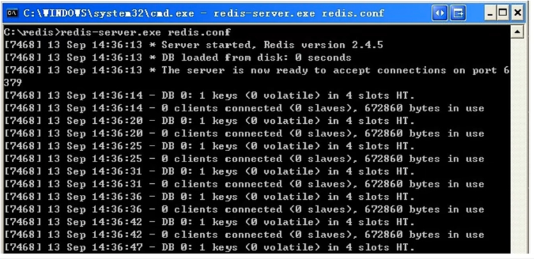
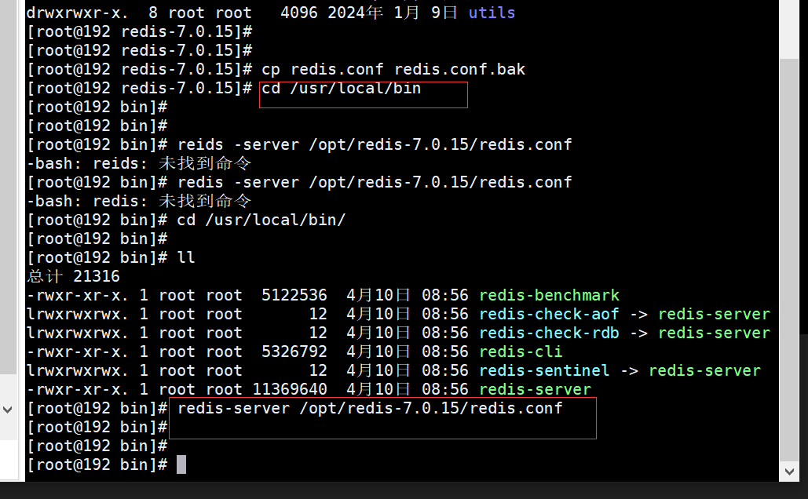
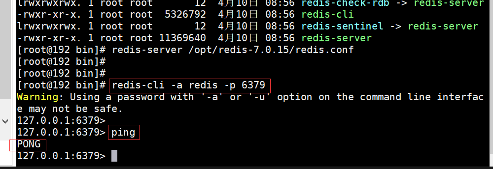
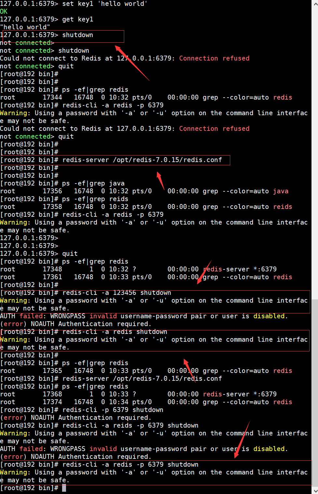

# 第2章-安装配置

## 2.1 Redis安装配置

### 2.1.1 自行购买云服务器

自己购买阿里云、青牛云、腾讯云或华为云服务器，自带centoOS或者Ubuntu环境，直接开干

### 2.1.2 VMware本地虚拟机

通过命令 getconf LONG_BIT查看，它返回结果是多少就是多少位

### 2.1.3 redis的安装

#### 2.1.3.1 日常用什么系统安装redis

由于企业里面做Redis开发，99%都是Linux版本的运用和安装，几乎不会涉及到Windows版，所以一般指安装Linxu版本的。


#### 2.1.3.2 window版安装：

下载地址：https://github.com/zkteco-home/redis-windows

下载地址：https://github.com/dmajkic/redis/downloads

下载到的Redis支持32bit和64bit.根据自己实际情况选择，将64bit的内容cp到自定义盘符安装目录取名redis.如C:\\reids
打开一个cmd窗口 使用cd命令切换目录到C:\\redis 运行 redis-server.exe redis.conf。
如果想方便的话，可以把redis的路径加到系统的环境变量里，这样就省得再输路径了，后面的那个redis.conf可以省略，
如果省略，会启用默认的。输入之后，会显示如下界面：



#### 2.1.3.3 linux版安装：

**Linux环境安装Redis必须先具备gcc编译环境**

**什么是gcc?**

gcc是linux下的一个编译程序，是C程序的编译工具。
GCC(GNU Compiler Collection)是 GNU(GNU's Not Unix) 计划提供的编译器家族，它能够支持 C,C++, Objective-C, Fortran, Java 和Ada 等等程序设计语言前端，同时能路运在 X86，X86-64，IA-64，PowerPC，SPARC和Alpha 等等几乎目前所有的硬件平台上。鉴于这些特征，以及 GCC 编译代码的高效性，使得 GCC 成为绝大多数自由软件开发编译的首选工具。虽然对于程序员们来说，编译器只是一个工具，除了开发和维护人员，很少有人关注编译器的发展，但是 GCC 的影响力是如此之大，它的性能提升甚至有望改善所有的自由软件的运行效率，同时它的内部结构的变化也体现出现代编译器发展的新特征。

**查看gcc版本**

gcc -v

**安装**

- 安装redis之前需要具备c++库环境

- yum -y install gcc

- 命令案例


**版本选择**

- 查看自己redis版本的命令：redis -server -v
- 安全Bug按照官网提示，升级成为6.0.8及以上

- 目前建议都需要升级到6.0.8版本以上
- 本次使用redis7.0

#### 2.1.3.4 docker版的redis安装配置参考

## 2.2 安装步骤

1.下载获取redis-7.0.0.tar.gz后将它放入我们的Linux目录/opt

2./opt目录下解压redis，tar -zxvf redis-7.0.0.tar.gz，解压后会多一个redis-7.0.0的文件夹

```shell
tar -xzvf edis-7.0.0.tar.gz
```

3.进入目录，cd redis-7.0.0

4.在redis-7.0.0目录下执行make && make install命令


5.查看默认安装目录：/usr/local/bin

- Linux下的/usr/local类似我们Windows系统的C:\Program Files，安装完成后，去/usr/local/bin下查看

- redis-benchmark:性能测试工具，服务启动后运行该命令，看看自己电脑性能如何

- redis-check-aof:修复有问题的AOF文件，RDB和AOF后续学习

- redis-check-dump(redis-check-rdb):修复有问题的dump.rdb文件

- <font color='red'>redis-cli:客户端操作入口</font>

- redis-sentinel:redis集群使用

- <font color='red'>reids-server:redis服务器启动命令</font>

6.将默认的redis.conf拷贝到自己定义好的一个路径下，比如/myredis  ，cp redis.conf  /myredis/redis7.conf

7.修改/myredis目录下redis.conf配置文件做初始化设置

- redis.conf 配置文件，改完后确保生效，记得重启

- 默认daemonize no		改为 daemonize yes (开始守护线程，后台运行)
- 默认protected-mode yes	改为 protected-mode no (关闭保护模式)
- 默认bind 127.0.0.1		改为 直接注释掉(默认bind 127.0.0.1只能本机访问)或改成本机IP，否则影响远程IP连接

- 添加redis密码 			添加requirepass 自己设定的密码

8.启动服务

- /usr/local/bin目录下运行redis-server命令，启用/myredis目录下的redis.conf配置文件

- 执行命令：redis-server /myredis/redis7.conf

  

9.连接服务

- redis-cli -a 123456 -p 6379(-a 后面是redis设置的密码)
- 链接后输入ping，会返回pong，如果错误，则不返回pong
- 




**备注说明：**

Warning: Using a password with '-a' or '-u' option on the command line interface may not be safe.这段警告看着不舒服怎么办?

warning 这串输出并不是普通输出，shell的标准输出包含两种：

1（标准输出）

2（标准错误）我们的命令，即包含1也包含2，2即是我们想要除去的提示

解决办法将标准错误去除即可，追加2>/dev/null，将标准错误丢弃即可，就没有烦人的警告了。


10.Redis端口为什么是6379？

- Redis的默认端口是6379，是由手机键盘字母MERZ的位置决定的。MERZ在Antirez的朋友圈语言中是"愚蠢和傻B"的代名词，源于意大利广告女郎Alessia Merz在电视节目上说了一堆愚蠢的话，redis之父对她有"特殊"印象，就给她弄成端口号了

11.退出redis

* 使用quit命令退出redis

  

11.关闭Redis服务器

- 单实例关闭：在Redis服务器外面关闭命令：redis-cli -a 123456 shutdown，如果在Redis命令行服务器里面可以直接使用shutdown命令

- 多实例关闭，指定端口关闭：redis-cli -p 6379 shutdown



## 2.3 卸载Redis步骤

### 2.3.1 停止redis-server服务


### 2.3.2 删除/usr/local/bin目录下与redis相关的文件

ls -l /usr/local/bin/redis-*

rm -rf /usr/local/bin/redis-*


