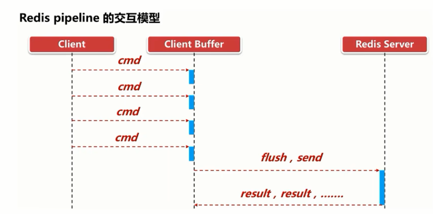

# 第6章-redis管道

## 6.1 面试题

* 如何优化频繁命令往返造成的性能瓶颈？
* 问题由来
  * Redis是一种基于**客户端-服务端模型**以及请求/响应协议的TCP服务。一个请求会遵循以下步骤:
  * 1客户端向服务端发送命令分四步(发送命令→命令排队→命令执行-返回结果)，并监听Socket返回，通常以阻塞模式等待服务端响应。
  * 2服务端处理命令，并将结果返回给客户端。
  * 上述两步称为: Round Trip Time(简称RTT,数据包往返于两端的时间)。

如果同时需要执行大量的命令，那么就要等待上一条命令应答后再执行，这中间不仅仅多了RTT (Round Time Trip) ，而且还频繁调用系统IO， 发送网络请求，同时需要redis调用多次read()和write()系统方法， 系统方法会将数据从用户态转移到内核态，这样就会对进程上下文有比较大的影响了，性能不太好，0(π_ π)0。这时候Redis管道就出现了。

## 6.2 是什么

### 6.2.1 上述问题的解决思路

管道(pipeline)可以一次性发送多条命令给服务端，**服务端依次处理完毕后，通过一 条响应一次性将结果返回，通过减少客户端与redis的通信次数来实现降低往返延时时间**。pipeline实现的原理是队列，先进先出特性就保证数据的顺序性。

### 6.2.2 官网

https://redis.io/docs/manual/pipelining/

### 6.2.3 定义

pipeline是为了解决RTT往返时，仅仅是将命令打包一次性发送，对整个Redis的执行不造成其他任何影响

### 6.2.4 一句话

批处理命令变种优化措施，类似Redis的原生批命令(mget和mset)

## 6.3 案例演示

* 将命令写道一个文件中，使用cat  命令文件| redis-cli -a 密码 -p端口 --pipe

## 6.4 小总结

- pipeline与原生批量命令对比
  1. 原生批量命令是原子性(例如：mset、mget)，pipeline是非原子性的
  2. 原生批量命令一次只能执行一种命令，pipeline支持批量执行不同命令
  3. 原生批量命令是服务端实现，而pipeline需要服务端与客户端共同完成

- pipeline与事务对比
  1. 事务具有原子性，管道不具有原子性
  2. 管道一次性将多条命令发送到服务器，事务是一条一条的发，事务只有在接收到exec命令后才会执行，管道不会
  3. 执行事务时(执行时才)会阻塞其他命令的执行，而执行管道中的命令时不会
- 使用pipeline注意事项
  1. pipeline缓冲的指令只是会依次执行，不保证原子性，如果执行中指令发生异常，将会继续执行后续的指令
  2. 使用pipeline组装的命令个数不能太多，不然数量过大客户端阻塞的时间可能过久，同时服务端此时也被迫回复一个队列答复，占用很多内存

