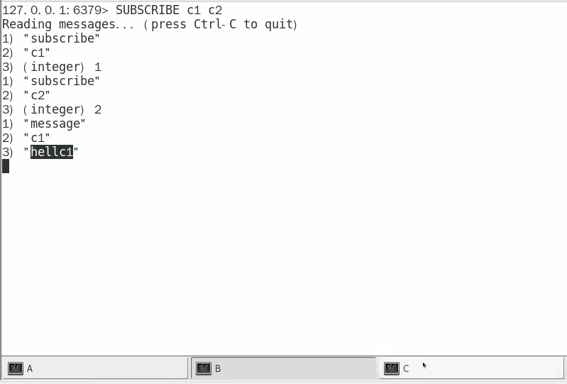

# 第7章-redis发布订阅

## 7.1 学习定位

了解即可

## 7.2 是什么

**定义：**是一种消息通信模式：发送者(PUBLISH)发送消息，订阅者(SUBSCRIBE)接收消息，可以实现进程间的消息传递

**官网：**https://redis.io/docs/manual/pubsub/

**一句话：**Redis可以实现消息中间件MQ的功能，通过发布订阅实现消息的引导和分流。但是目前不推荐使用该功能，专业的事情交给专业的中间件处理，redis就做好分布式缓存功能

## 7.3 能干嘛

Redis客户端可以订阅任意数量的频道，类似我们微信关注多个公众号

当有新消息通过publish命令发送给频道channel1时，订阅客户端都会收到消息

小总结

## 7.4 常用命令：

- SUBSCRIBE channel [channel ...]

  订阅给定的一个或多个频道的信息

  推荐先执行订阅然后在发布，订阅成功之前发布的消息是收不到的

  订阅的客户端每次可以收到一个3个参数的消息

  1. 消息种类
  2. 始发频道的名称
  3. 实际的消息内容

- PUBLISH channel message

  发布消息到指定的频道

- PSUBSCRIBE pattern [pattern ...]

  按照模式批量订阅，订阅一个或多个符合给定模式(支持*号？号之类的)的频道

- PUBSUB subcommand [argument [argument ...]]

  查看订阅与发布系统

  PUBSUB CHANNELS

  ​	由活跃频道组成的列表

  

  PUBSUB NUMSUB [channel [channel ...]]

  ​	某个频道有几个订阅者

  

  PUBSUB NUMPAT

  ​	只统计使用PSUBSCRIBE命令执行的返回客户端订阅的唯一模式的数量

  

- UNSUBSCRIBE [channel [channel ...]]

  退订给定的频道

- PUNSUBSCRIBE [pattern [pattern ...]]

  退订所有给定模式的频道

## 7.5 案例演示

1. 开启3个客户端，演示客户端A、B订阅消息，客户端C发布消息

   

2. 演示批量订阅和发布

   

3. 取消订阅

小总结

可以实现消息中间件MQ的功能，通过发布订阅实现消息的引导和分流。但是不推荐使用该功能，专业的事情交给专业的中间件处理，redis就做好分布式缓存功能

PUB/SUB缺点

1. 发布的消息在Redis系统中不能持久化，因此，必须先执行订阅，在等待消息发布。如果先发布了消息，那么该消息由于没有订阅者，消息将被直接丢弃
2. 消息只管发送，对于发布者而言消息是即发即失，不管接受，也没有ACK机制，无法保证消息的消费成功
3. 以上的缺点导致Redis的Pub/Sub模式就像个小玩具，在生产环境中几乎无用武之地，为此Redis5.0版本新增了Stream数据结构，不但支持多播，还支持数据持久化，相比Pub/Sub更加的强大

