# 第9章-redis哨兵(sentinel)

## 9.1 是什么

* 吹哨人巡查监控后台master主机是否故障，如果故障了根据投票数自动将某一个从库转换为新主库，继续对外服务

* 作用：俗称无人值守运维

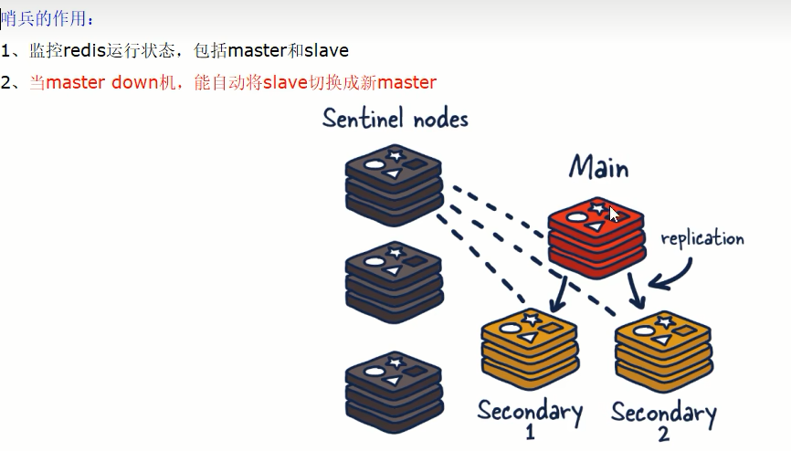

* 官网理论：https://redis.io/docs/management/sentinel/

## 9.2 能干嘛

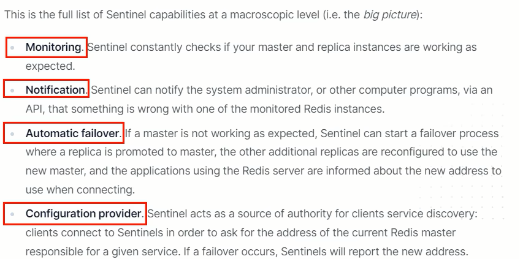

**主从监控**：监控主从redis库运行是否正常

**消息通知**：哨兵可以将故障转移的结果发送给客户端

**故障转移**：如果master异常，则会进行主从切换，将其中一个slave作为新master

**配置中心**：客户端通过连接哨兵来获得当前Redis服务的主节点地址

## 9.3 怎么玩（案例演示实战步骤）

### 9.3.1 Redis Sentinel架构，前提说明

- 3个哨兵：自动监控和维护集群，不存放数据，只是吹哨人
- 1主2从：用于数据读取和存放

### 9.3.2 操作步骤

1. /myredis目录下新建或者拷贝sentinel.conf文件按，名字绝对不能错

2. 先看看/opt目录下默认的sentinel.conf文件的内容

   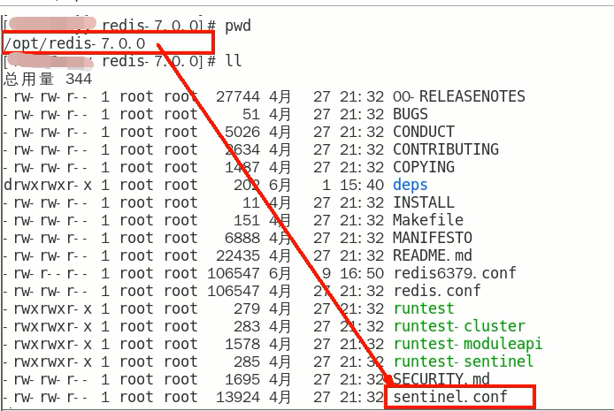

3. 重要参数项说明

   - bind：服务监听地址，用于客户端连接，默认本机地址，不写127.0.0.1（写了只能本机通信，无法选择网络通信了），可以不写，或直接写本机ip。

   - daemonize：是否以后台daemon方式运行

   - protected-mode：安全保护模式

   - port：端口

   - logfile：日志文件路径

   - pidfile：pid文件路径

   - dir：工作目录（必须创建好目录，没有目录无法启动）

   - sentinel monitor <master-name> <ip> <redis-port> <quorum>

     * 设置要监控的master服务器

     * quorum表示最少有几个哨兵认可客观下线，同意故障迁移的法定票数

     * 

     * 网络是不可靠的有时候一个sentinel会因为网络堵塞而误以为master redis已经死掉，在sentinel集群环境下需要多个sentinel互相沟通来确认某个master是否真的死掉了，quorum这个参数是进行客观下线的一个依据，意思是至少有quorum个sentinel认为这个master有故障，才会对这个master进行下线以及故障转移。因为有的时候，某个sentinel节点可能因为自身网络原因，导致无法连接master，而此时master并没有出现故障，所以，这就需要多个sentinel都一致认为改master有问题，才可以进行下一步操作，这就保证了公平性和高可用。
     
   - sentinel auth-pass <master-name> <password>
   
     - master设置了密码，连接master服务的密码
   
   - 其他

| 配置                                                         | 说明                                                         |
| ------------------------------------------------------------ | ------------------------------------------------------------ |
| sentinel down-after-milliseconds <master-name>  <milliseconds> | 指定多少毫秒之后，主节点没有应答哨兵，此时哨兵主观上认为主节点下线 |
| sentinel parallel-syncs <master-name> <nums>                 | 表示允许并行同步的slave个数，当Master挂了后，哨兵会选出新的Master，此时，剩余的slave会向新的master发起同步数据 |
| sentinel failover-timeout <master-name> <milliseconds>       | 故障转移的超时时间，进行故障转移时，如果超过设置的毫秒，表示故障转移失败 |
| sentinel notification-script <master-name> <script-path>     | 配置当某一事件发生时所需要执行的脚本                         |
| sentinel client-reconfig-script <master-name> <script-path>  | 客户端重新配置主节点参数脚本                                 |

4. sentinel通用配置及主从配置

sentinel26379.conf、sentinel26380.conf、sentinel26381.conf

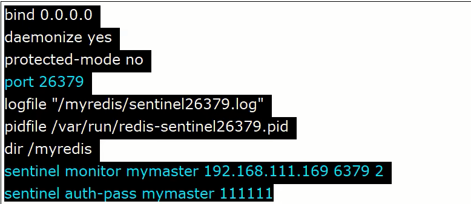

最终配置

master主机配置文件说明

理论上sentinel配置文件应该部署在不同的服务器上，做成集群，但是本次演示将其放到一台机器上

5. 先启动一主二从3个redis实例，测试正常的主从复制

- 架构说明

  

- 主机6379配置修改

  

  6379后续可能会变成从机，需要设置访问新主机的密码，所以此处会设置masterauth，不然后续可能会报错 master_link_status:down

- 3台不同的虚拟机实例，启动三台真是机器实例并连接

  redis-server redis6379.conf

  redis-server redis6380.conf

  redis-server redis6381.conf

  redis-cli -a 123456 -p 6379

  redis-cli -a 123456 -p 6380

  redis-cli -a 123456 -p 6381

6. 以下是哨兵内容部分
7. 在启动3个哨兵，完成监控

- sentinel的两种启动方式

  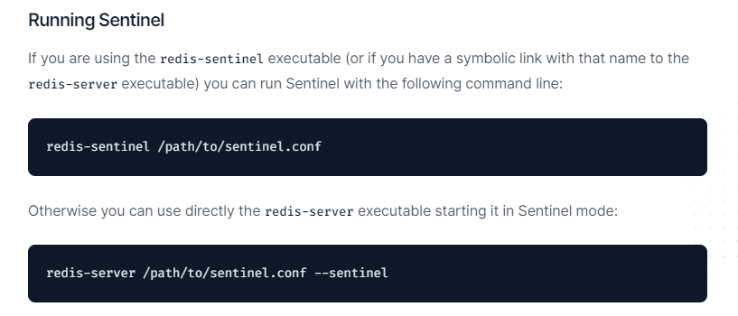

8. 再启动3个哨兵监控后再测试一次主从复制

redis-server sentinel26379.conf --sentinel

redis-server sentinel26380.conf --sentinel

redis-server sentinel26381.conf --sentinel

启动后我们会发现sentinel配置文件会自动在配置文件中加上部分配置

9. 原有的master挂了

- 我们自己手动关闭6379服务器，模拟master挂了

- 问题思考

  1. 两台从机数据是否OK
  2. 是否会从剩下的2台机器上选出新的master
  3. 之前down机的master机器重启回来，谁将会是新老大？会不会双master冲突

- 揭晓答案

  1. 两台从机数据OK

     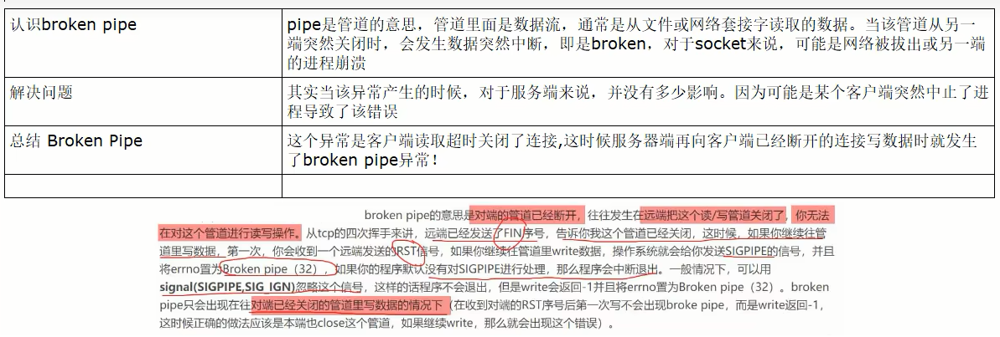

  2. 会投票选出新的master主机

     

  3. 谁是master，限本次案例

     * 本案例中6381被选举为新的master，上位成功

     * 重启6379之后，它会从原来的master降级为slave

     * 6380还是slave，只不过是换了一个新老大6381(从跟随6379变成跟随6381)

10. 对比配置文件

老master的redis6379.conf文件

新master的redis6381.conf文件

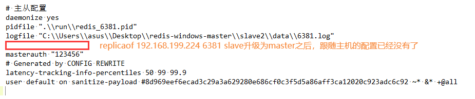

结论

文件的内容，在运行期间会被sentinel动态进行更改

Master-Slave切换后，master_redis.conf、slave_redis.conf、sentinel.conf的内容都会发生改\变，即master_redis.conf中会多一行slaveof的配置，而升级为master的主机会去掉原来的slaveof配置，sentinel.conf的监控目标会随之调换

### 9.3.3 其他备注

* 生产上都是不同机房不同服务器，很少出现3个哨兵全部挂掉的情况

* 可以同时监控多个master，一行一个

## 9.4 哨兵运行流程和选举原理

当一个主从配置中master失效后，sentinel可以选举出一个新的master用于自动接替原master的工作，主从配置中的其他redis服务器自动指向新的master同步数据，一般建议sentinel采取奇数台，防止某一台sentinel无法连接到master导致误切换

### 9.4.1 运行流程，故障切换

- 三个哨兵监控一主二从，正常运行中

  

- SDown主观下线(Subjectively Down)

  1. SDOWN（主观不可用）是**单个sentinel自己主观上**检测到的关于master的状态，从sentinel的角度来看，如果发送了PING心跳后，在一定时间内没有收到合法的回复，就达到了SDOWN的条件。

  2. sentinel配置文件中的down-after-milliseconds设置了判断主观下线的时间长度

  3. 说明

     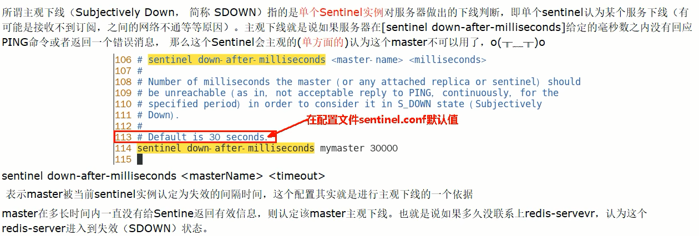

- ODown客观下线(Objectively Down)

  1. ODOWN需要一定数量的sentinel，多个哨兵达成一致意见才能认为一个master客观上已经宕机

  2. 说明

     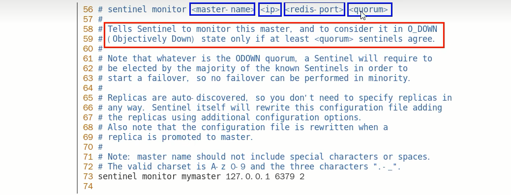

     quorum这个参数是进行客观下线的一个依据，法定人数/法定票数
     
     意思是至少有quorum个sentinel认为这个master有故障才会对这个master进行下线以及故障转移。因为有的时候，某个sentinel节点可能因为自身网络原因导致无法连接master，而此时master并没有出现故障，所以这就需要多个sentinel都一致认为该master有问题，才可以进行下一步操作，这就保证了公平性和高可用。

- 选举出领导者哨兵(哨兵中选出兵王)

  

  1. 当主节点被判断客观下线后，各个哨兵节点会进行协商，先选举出一个领导者哨兵节点（兵王）并由该领导者也即被选举出的兵王进行failover（故障转移）。

     哨兵日志文件解读分析

     

  2. 哨兵领导者，兵王如何选出来的？-> Raft算法

     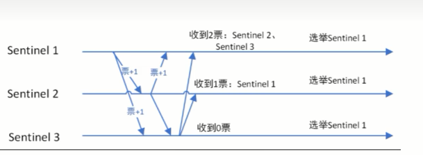

     监视该主节点的所有哨兵都有可能被选为领导者，选举使用的算法是Raft算法;Raft算法的基本思路是先到先得:即在一轮选举中，哨兵A向B发送成为领导者的申请、如果B没有同意过其他哨兵，则会同意A成为领导者。

- 由兵王开始推动故障切换流程并选出新的master

  1. 新主登基

     - 某个Slave被选中成为新Master

     - 选出新master的规则，剩余Slave节点健康前提下，会按下图规则进行选举

       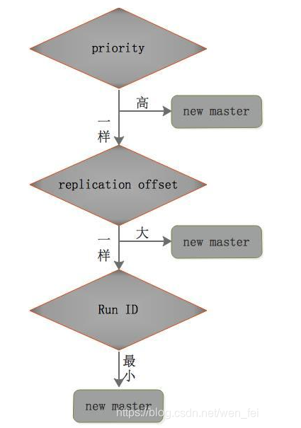

       1. redis.conf文件中，优先级slave-priority或者replica-priority最高的从节点(数字越大优先级越高)

       

       2. 复制偏移位置offset最大的从节点(也就是在master还没有宕机时，复制到数据比其他Slave要多)
       
       3. 最小Run ID的从节点-->字典顺序，ASCII码

  2. 群臣俯首

     - 一朝天子一朝臣，换个码头重新拜
     - 执行slaveof no one命令让选出来的从节点成为新的主节点，并通过slaveof命令让其他节点成为其从节点
     - sentinel leader会对选举出的新master执行slaveof on one操作，将其提升为master节点
     - sentinel leader向其他slave发送命令，让剩余的slave成为新的master节点的slave

  3. 旧主拜服

     - 老master回来也认怂，会被降级为slave
     - 老master重新上线后，会将它设置为新选出的master的从节点
     - sentinel leader会让原来的master降级为slave并恢复正常工作

  4. 小总结

     上述的failover操作均由sentinel自己独自完成，完全不需要人工干预

     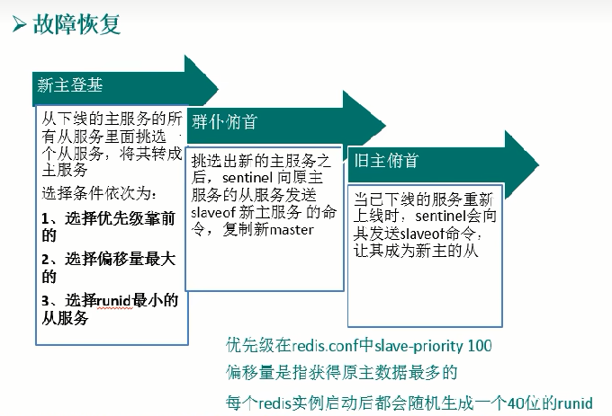

## 9.5 哨兵使用建议

1. 哨兵节点的数量应为多个，哨兵本身应该集群，保证高可用
2. 哨兵节点的数量应该是奇数
3. 各个哨兵节点的配置应一致
4. 如果哨兵节点部署在Docker等容器里面，尤其要注意端口的正确映射
5. 哨兵集群+主从复制，并不能保证数据零丢失，所以需要使用集群

