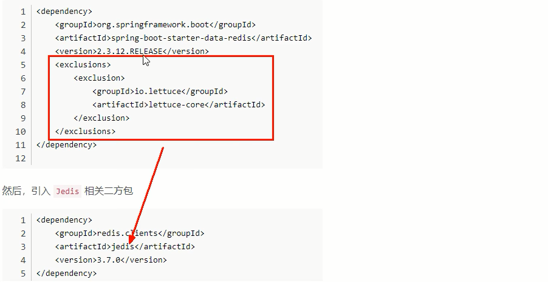

# 第11章-springboot集成redis

## 11.1 总体概述

jedis-lettuce-RedisTemplate三者的联系。jedis是早期版本，lettuce是后起之秀，RedisTemplate集成了lettuce。

## 11.2 本地Java连接Redis常见问题，小白注意

1. bind配置请注释掉
2. 保护模式设置为no
3. Linux系统的防火墙设置
4. Redis服务器的IP地址和密码是否正确
5. 忘记写访问redis的服务端口号和auth密码

## 11.3 集成Jedis

是什么：Jedis Client是Redis官网推荐的一个面向Java客户端，库文件实现了对各类API进行封装调用

步骤：

1. 建module

2. 改pom

   ```xml
   <?xml version="1.0" encoding="UTF-8"?>
   <project xmlns="http://maven.apache.org/POM/4.0.0"
            xmlns:xsi="http://www.w3.org/2001/XMLSchema-instance"
            xsi:schemaLocation="http://maven.apache.org/POM/4.0.0 http://maven.apache.org/xsd/maven-4.0.0.xsd">
       <parent>
           <artifactId>learn_code</artifactId>
           <groupId>org.example</groupId>
           <version>1.0</version>
       </parent>
       <modelVersion>4.0.0</modelVersion>
   
       <artifactId>redis7_jedis</artifactId>
   
   
       <properties>
           <maven.compiler.source>8</maven.compiler.source>
           <maven.compiler.target>8</maven.compiler.target>
           <junit.version>4.12</junit.version>
           <log4j.version>1.2.17</log4j.version>
           <lombok.version>1.16.18</lombok.version>
       </properties>
   
       <dependencies>
           <!--SpringBoot 通用依赖模块-->
           <dependency>
               <groupId>org.springframework.boot</groupId>
               <artifactId>spring-boot-starter-web</artifactId>
               <version>2.7.11</version>
           </dependency>
           <!-- jedis -->
           <dependency>
               <groupId>redis.clients</groupId>
               <artifactId>jedis</artifactId>
               <version>4.3.1</version>
           </dependency>
           <!-- 通用基础配置 -->
           <dependency>
               <groupId>junit</groupId>
               <artifactId>junit</artifactId>
               <version>${junit.version}</version>
           </dependency>
           <dependency>
               <groupId>log4j</groupId>
               <artifactId>log4j</artifactId>
               <version>${log4j.version}</version>
           </dependency>
           <dependency>
               <groupId>org.projectlombok</groupId>
               <artifactId>lombok</artifactId>
               <version>${lombok.version}</version>
           </dependency>
   
           <dependency>
               <groupId>org.springframework.boot</groupId>
               <artifactId>spring-boot-starter-test</artifactId>
               <scope>test</scope>
           </dependency>
       </dependencies>
   
       <build>
           <plugins>
               <plugin>
                   <groupId>org.springframework.boot</groupId>
                   <artifactId>spring-boot-maven-plugin</artifactId>
               </plugin>
           </plugins>
       </build>
   
   </project>
   ```

3. 写YML

   ```yaml
   server.port=7777
   spring.application.name=redis7_study
   ```

4. 主启动

   ```java
   import redis.clients.jedis.Jedis;
   
   public class JedisTest {
       public static void main(String[] args) {
           Jedis jedis = new Jedis("192.168.197.136",6379);
           jedis.auth("redis");
           jedis.set("key1","value1");
           jedis.set("key2","value2");
   
           String key1 = jedis.get("key1");
           System.out.println(key1);
   
           String key2 = jedis.get("key2");
           System.out.println(key2);
       }
   }
   ```

5. 业务类

## 11.4 集成letter

1. 是什么

   Lettuce是一个Redis的Java驱动包，Lettuce翻译为生菜，就是吃的那种生成，所以它的logo如下：


2. lettuce VS Jedis

   

3. pom.xml

   ```xml
   <?xml version="1.0" encoding="UTF-8"?>
   <project xmlns="http://maven.apache.org/POM/4.0.0"
            xmlns:xsi="http://www.w3.org/2001/XMLSchema-instance"
            xsi:schemaLocation="http://maven.apache.org/POM/4.0.0 http://maven.apache.org/xsd/maven-4.0.0.xsd">
       <parent>
           <artifactId>learn_code</artifactId>
           <groupId>org.example</groupId>
           <version>1.0</version>
       </parent>
       <modelVersion>4.0.0</modelVersion>
   
       <artifactId>redis7_jedis</artifactId>
   
   
       <properties>
           <maven.compiler.source>8</maven.compiler.source>
           <maven.compiler.target>8</maven.compiler.target>
           <junit.version>4.12</junit.version>
           <log4j.version>1.2.17</log4j.version>
           <lombok.version>1.16.18</lombok.version>
       </properties>
   
       <dependencies>
           <!--SpringBoot 通用依赖模块-->
           <dependency>
               <groupId>org.springframework.boot</groupId>
               <artifactId>spring-boot-starter-web</artifactId>
               <version>2.7.11</version>
           </dependency>
           <!-- jedis -->
           <dependency>
               <groupId>redis.clients</groupId>
               <artifactId>jedis</artifactId>
               <version>4.3.1</version>
           </dependency>
           <!-- 通用基础配置 -->
           <dependency>
               <groupId>junit</groupId>
               <artifactId>junit</artifactId>
               <version>${junit.version}</version>
           </dependency>
           <dependency>
               <groupId>log4j</groupId>
               <artifactId>log4j</artifactId>
               <version>${log4j.version}</version>
           </dependency>
           <dependency>
               <groupId>org.projectlombok</groupId>
               <artifactId>lombok</artifactId>
               <version>${lombok.version}</version>
           </dependency>
   
           <dependency>
               <groupId>org.springframework.boot</groupId>
               <artifactId>spring-boot-starter-test</artifactId>
               <scope>test</scope>
           </dependency>
       </dependencies>
   
       <build>
           <plugins>
               <plugin>
                   <groupId>org.springframework.boot</groupId>
                   <artifactId>spring-boot-maven-plugin</artifactId>
               </plugin>
           </plugins>
       </build>
   
   </project>
   ```

4. 代码

   ```java
   import io.lettuce.core.RedisClient;
   import io.lettuce.core.RedisURI;
   import io.lettuce.core.api.StatefulRedisConnection;
   import io.lettuce.core.api.sync.RedisCommands;
   
   import java.util.HashMap;
   import java.util.List;
   import java.util.Map;
   import java.util.Set;
   
   public class RedisLettuceTest {
       public static void main(String[] args) {
           RedisURI redisURI = RedisURI.builder()
                   .withHost("192.168.197.136")
                   .withPort(6379)
                   .withAuthentication("default","redis")
                   .build();
           RedisClient redisClient = RedisClient.create(redisURI);
           StatefulRedisConnection<String, String> connect = redisClient.connect();
           RedisCommands<String, String> redisCommands = connect.sync();
           redisCommands.auth("redis");
           redisCommands.set("key1","value1");
           redisCommands.set("key2","value2");
   
           String key1 = redisCommands.get("key1");
           System.out.println(key1);
   
           String key2 = redisCommands.get("key2");
           System.out.println(key2);
   
           Map<String,String> map = new HashMap<>();
           map.put("age","1");
           map.put("name","zhangsan");
           redisCommands.hset("user",map);
           String hget = redisCommands.hget("user", "age");
           System.out.println(hget);
           String agee = redisCommands.hget("user", "agee");
           System.out.println(agee);
   
           redisCommands.lpush("list1","1","2","3","3");
           List<String> list1 = redisCommands.lrange("list1", 0, -1);
           System.out.println(list1);
   
           redisCommands.sadd("set1","1","2","3","3");
           Set<String> set1 = redisCommands.smembers("set1");
           System.out.println(set1);
   
           redisCommands.zadd("zset1",0.1,"1");
           redisCommands.zadd("zset1",0.2,"3");
           redisCommands.zadd("zset1",0.01,"2");
           List<String> zset1 = redisCommands.zrange("zset1",0,-1);
           System.out.println(zset1);
   
           connect.close();
           redisClient.shutdown();
       }
   }
   ```

   

## 14.5 RedisTemplate-推荐使用

### 14.5.1连接单机

#### 14.5.1.1 boot整合Redis基础演示

建module

改pom

```xml
<?xml version="1.0" encoding="UTF-8"?>
<project xmlns="http://maven.apache.org/POM/4.0.0"
         xmlns:xsi="http://www.w3.org/2001/XMLSchema-instance"
         xsi:schemaLocation="http://maven.apache.org/POM/4.0.0 http://maven.apache.org/xsd/maven-4.0.0.xsd">
    <parent>
        <artifactId>learn_code</artifactId>
        <groupId>org.example</groupId>
        <version>1.0</version>
    </parent>
    <modelVersion>4.0.0</modelVersion>

    <artifactId>redis7_RedisTemplate</artifactId>

    <properties>
        <maven.compiler.source>8</maven.compiler.source>
        <maven.compiler.target>8</maven.compiler.target>
        <junit.version>4.12</junit.version>
        <log4j.version>1.2.17</log4j.version>
        <lombok.version>1.16.18</lombok.version>
    </properties>

    <dependencies>
        <!--SpringBoot 通用依赖模块-->
        <dependency>
            <groupId>org.springframework.boot</groupId>
            <artifactId>spring-boot-starter-web</artifactId>
            <version>2.7.11</version>
        </dependency>
        <!-- SpringBoot 与Redis整合依赖 -->
        <dependency>
            <groupId>org.springframework.boot</groupId>
            <artifactId>spring-boot-starter-data-redis</artifactId>
        </dependency>
        <dependency>
            <groupId>org.apache.commons</groupId>
            <artifactId>commons-pool2</artifactId>
        </dependency>
        <!-- swagger2 -->
        <dependency>
            <groupId>io.springfox</groupId>
            <artifactId>springfox-swagger2</artifactId>
            <version>2.9.2</version>
        </dependency>
        <dependency>
            <groupId>io.springfox</groupId>
            <artifactId>springfox-swagger-ui</artifactId>
            <version>2.9.2</version>
        </dependency>
        <!-- 通用基础配置 -->
        <dependency>
            <groupId>junit</groupId>
            <artifactId>junit</artifactId>
            <version>${junit.version}</version>
        </dependency>
        <dependency>
            <groupId>log4j</groupId>
            <artifactId>log4j</artifactId>
            <version>${log4j.version}</version>
        </dependency>
        <dependency>
            <groupId>org.projectlombok</groupId>
            <artifactId>lombok</artifactId>
            <version>${lombok.version}</version>
        </dependency>

        <dependency>
            <groupId>org.springframework.boot</groupId>
            <artifactId>spring-boot-starter-test</artifactId>
            <scope>test</scope>
        </dependency>
    </dependencies>

    <build>
        <plugins>
            <plugin>
                <groupId>org.springframework.boot</groupId>
                <artifactId>spring-boot-maven-plugin</artifactId>
            </plugin>
        </plugins>
    </build>

</project>
```

写YML

```yam
server.port=7777

spring.application.name=redis7_study

# ===========================logging===========================
logging.level.root=info
logging.1evel.com.luojia.redis7_study.redis7=info
1ogging.pattern.console=%d{yyyy-MM-dd HH:m:ss.SSS} [%thread] %-5level %1ogger- %msg%n

1ogging.file.name=F:\workspace\数据结构和算法\Learning-in-practice\Redis\redis7-study
1ogging.pattern.fi1e=%d{yyyy-MM-dd HH:mm:ss.SSS} [%thread] %-5level %logger- %msg%n

# ===========================swagge===========================
spring.swagger2.enabled=true
#在springboot2.6.X结合swagger2.9.X会提示documentationPluginsBootstrapper空指针异常，
#原因是在springboot2.6.X中将SpringMVC默认路径匹配策略MAntPathMatcher更改为athPatternParser,
#导致出错，解决办法是matching-strategy 切换回之前ant_path_matcher
spring.mvc.pathmatch.matching-strategy=ant_path_matcher

# ===========================redis单机===========================
spring.redis.database=0
#修改为自己真实IP
spring.redis.host=127.0.0.1
spring.redis.port=6379
spring.redis.password=123456
spring.redis.lettuce.pool.max-active=8
spring.redis.1ettuce.pool.max-wait=-1ms
spring.redis.1ettuce.pool.max-idle=8
spring.redis.lettuce.pool.min-idle=0
```

主启动

业务类

- 配置类

  ```java
  package com.luojia.redis7_study.config;
  
  import org.springframework.context.annotation.Bean;
  import org.springframework.context.annotation.Configuration;
  import org.springframework.data.redis.connection.lettuce.LettuceConnectionFactory;
  import org.springframework.data.redis.core.RedisTemplate;
  import org.springframework.data.redis.serializer.GenericJackson2JsonRedisSerializer;
  import org.springframework.data.redis.serializer.StringRedisSerializer;
  
  @Configuration
  public class RedisConfig {
  
      /**
       * *redis序列化的工具定置类，下面这个请一定开启配置
       * *127.0.0.1:6379> keys *
       * *1) “ord:102” 序列化过
       * *2)“\xaclxedlxeelx05tixeelaord:102” 野生，没有序列化过
       * *this.redisTemplate.opsForValue(); //提供了操作string类型的所有方法
       * *this.redisTemplate.opsForList();// 提供了操作List类型的所有方法
       * *this.redisTemplate.opsForset(); //提供了操作set类型的所有方法
       * *this.redisTemplate.opsForHash(); //提供了操作hash类型的所有方认
       * *this.redisTemplate.opsForZSet(); //提供了操作zset类型的所有方法
       * param LettuceConnectionFactory
       * return
       */
      @Bean
      public RedisTemplate<String, Object> redisTemplate(LettuceConnectionFactory lettuceConnectionFactory) {
          RedisTemplate<String,Object> redisTemplate = new RedisTemplate<>();
          redisTemplate.setConnectionFactory(lettuceConnectionFactory);
          // 设置key序列化方式string
          redisTemplate.setKeySerializer(new StringRedisSerializer());
          // 设置value的序列化方式json，使用GenericJackson2JsonRedisSerializer替换默认序列化
          redisTemplate.setValueSerializer(new GenericJackson2JsonRedisSerializer());
  
          redisTemplate.setHashKeySerializer(new StringRedisSerializer());
          redisTemplate.setHashValueSerializer(new GenericJackson2JsonRedisSerializer());
          redisTemplate.afterPropertiesSet();
          return redisTemplate;
      }
  }
  ```

  ```java
  package com.luojia.redis7_study.config;
  
  import org.springframework.beans.factory.annotation.Value;
  import org.springframework.context.annotation.Bean;
  import org.springframework.context.annotation.Configuration;
  import springfox.documentation.builders.ApiInfoBuilder;
  import springfox.documentation.builders.PathSelectors;
  import springfox.documentation.builders.RequestHandlerSelectors;
  import springfox.documentation.service.ApiInfo;
  import springfox.documentation.spi.DocumentationType;
  import springfox.documentation.spring.web.plugins.Docket;
  import springfox.documentation.swagger2.annotations.EnableSwagger2;
  
  import java.time.LocalDate;
  import java.time.format.DateTimeFormatter;
  
  @Configuration
  @EnableSwagger2
  public class SwaggerConfig {
  
      @Value("${spring.swagger2.enabled}")
      private Boolean enabled;
  
      @Bean
      public Docket createRestApi() {
          return new Docket (DocumentationType.SWAGGER_2)
                  .apiInfo(apiInfo())
                  .enable(enabled)
                  .select()
                  .apis(RequestHandlerSelectors.basePackage("com.luojia.redis7_study.config")) //你自己的package
                  .paths (PathSelectors.any())
                  .build();
  
      }
  
      public ApiInfo apiInfo() {
          return new ApiInfoBuilder()
                  .title("springboot利用swagger2构建api接口文档 "+"\t"
                          + DateTimeFormatter.ofPattern("yyyy-MM-dd").format(LocalDate.now()))
                  .description( "springboot+redis整合" )
                  .version("1.0")
                  .termsOfServiceUrl("https://github.com/Romantic-Lei")
                  .build();
      }
  
  }
  ```

- service

  ```java
  package com.luojia.redis7_study.service;
  
  import lombok.extern.slf4j.Slf4j;
  import org.springframework.beans.factory.annotation.Autowired;
  import org.springframework.data.redis.core.RedisTemplate;
  import org.springframework.stereotype.Service;
  
  import java.util.UUID;
  import java.util.concurrent.ThreadLocalRandom;
  
  @Service
  @Slf4j
  public class OrderService {
  
      @Autowired
      private RedisTemplate redisTemplate;
  
      public static final String ORDER_KEY="ord:";
  
      public void addOrder() {
          int keyId = ThreadLocalRandom.current().nextInt(1000) + 1;
          String serialNo = UUID.randomUUID().toString();
          String key = ORDER_KEY+keyId;
          String value = "JD" + serialNo;
          redisTemplate.opsForValue().set(key, value);
          log.info("***key:{}", key);
          log.info("***value:{}", value);
  
      }
  
      public String getOrderById(Integer keyId) {
          return (String)redisTemplate.opsForValue().get(ORDER_KEY+keyId);
      }
  }
  ```

- controller

  ```java
  package com.luojia.redis7_study.controller;
  
  import com.luojia.redis7_study.service.OrderService;
  import io.swagger.annotations.Api;
  import io.swagger.annotations.ApiOperation;
  import io.swagger.models.auth.In;
  import lombok.extern.slf4j.Slf4j;
  import org.springframework.beans.factory.annotation.Autowired;
  import org.springframework.web.bind.annotation.GetMapping;
  import org.springframework.web.bind.annotation.PostMapping;
  import org.springframework.web.bind.annotation.RestController;
  
  @RestController
  @Slf4j
  @Api(tags="订单接口")
  public class OrderController {
  
      @Autowired
      private OrderService orderService;
  
      @ApiOperation("新增订单")
      @PostMapping("/order/add")
      public void addOrder() {
          orderService.addOrder();
      }
  
      @ApiOperation("根据keyId查询订单")
      @GetMapping("/order/query")
      public String queryOrder(Integer keyId) {
          return orderService.getOrderById(keyId);
      }
  
  }
  ```

#### 14.5.1.2 测试

项目启动，连接swagger：http://localhost:7777/swagger-ui.html

 序列化问题：

为什么会这样？


RedisTemplate使用的是JDK序列化方式（默认）惹的祸


### 14.5.2 RedisTemplate连接集群

#### 14.5.2.1 启动Redis集群6台实例

#### 14.5.2.2 第一次改写YML

```yaml
# ===========================redis集群===========================
spring.redis.password=123456
# 获取失败 最大重定向次数
spring.redis.cluster.max-redirects=3
spring.redis.lettuce.pool.max-active=8
spring.redis.1ettuce.pool.max-wait=-1ms
spring.redis.1ettuce.pool.max-idle=8
spring.redis.lettuce.pool.min-idle=0
spring.redis.cluster.nodes=192.168.111.175:6381,192.168.111.175:6382,192.168.111.176:6383,192.168.111.176:6384
```

#### 14.5.2.3 直接通过微服务访问Redis集群

一切正常 （http://localhost:7777/swagger-ui.html）

####  14.5.2.4 问题来了

1. 人为模拟，master-6381机器意外宕机，手动shutdown

2. 先对redis集群用命令的方式，手动验证各种读写命令，看看6384是否上位

3. Redis Cluster集群能自动感知并自动完成主备切换，对应的slave6384会被选举为新的master节点

4. 通过redis客户端连接6384可以正常进行读写操作

5.  微服务客户端再次读写访问试试

   - 故障现象

     SpringBoot客户端没有动态感知RedisCluster的最新集群信息

     金典故障 

     【故障演练】 Redis Cluster集群部署采用了3主3从拓扑结构，数据读写访问master节点，slave节点负责备份。 当master宕机主从切换成功，redis手动OK，but 2个经典故障

     

   - 导致原因
     SpringBoot 2.X版本，Redis默认的连接池采用Lettuce，当Redis集群节点发生变化后，Letture默认是不会刷新节点拓扑

   - 解决方案

     1. 排除lettuce采用Jedis（不推荐）

        

     2. 重写连接工厂实例（极度不推荐）

     3. 刷新节点集群拓扑动态感应

        

        解决方法：

        - 调用 RedisClusterClient.reloadPartitions
        - 后台基于时间间隔的周期刷新
        - 后台基于持续的 **断开** 和 **移动**、**重定向** 的自适应更新

     * springboot可以修改配置
   
       ```properties
       #支持集群动态感应刷新，自适应刷新是否有使用所有可用的更新，默认flase关闭
       spring.redis.lettuce.cluster.refresh.adaptive=true
       #定时刷新
       spring.redis.lettuce.cluster.refresh.period=2000
   #spring.redis.lettuce.cluster.refresh.dynamic-refresh-sources=true
       ```
     
     * redis-cluster下Lettuce 配置详解
       为了实现高效的故障转移，我们需要利用 Lettuce 提供的一些集群相关的配置选项：
       * 动态刷新源 (dynamicRefreshSources) ：允许 Lettuce 动态选择用于拓扑刷新请求的源节点，增强恢复的灵活性。
       * 刷新周期 (refresh.period) ：设置集群拓扑刷新之间的间隔时间，建议配置为较小值以便于快速检测变化。
       * 自适应刷新 (adaptive) ：启用后，Lettuce 会在探测到连接问题时更加频繁地刷新拓扑。
       * 命令超时 (command-timeout) ：缩短命令执行的超时时间以便快速响应网络问题。

```
spring:
  redis:
    lettuce:
      cluster:
        refresh:
          dynamic-refresh-sources: true
          period: 3000
          adaptive: true
```


