# 第3章-10大数据类型

## 3.1 which 10

官网:https://redis.io/docs/data-types/


### 3.1.1 一图


### 3.1.2 提前声明

这里说的数据类型是value的数据类型，key的类型都是字符串

### 3.1.3 分别是

- Redis字符串(String)

  - String是redis最基本的数据类型，一个key对应一个value。
  - string类型是<font color='red'>二进制安全的</font>，意思是redis的string可以包含任何数据，比如jpg图片或者序列化的对象。
  - string类型是Redis最基本的数据类型，一个redis中字符串value最多可以是512M

- Redis列表(List)

  - Redis列表是最简单的字符串列表，按照插入顺序排序。你可以添加一个元素到列表的头部（左边）或者尾部（右边），它的底层实际是个双端链表，最多可以包含2^32-1个元素（4294967295，每个列表超过40亿个元素）

- Redis哈希(Hash)

  - Redis Hash是一个string类型的field（字段）和value（值）的映射表，Hash特别适合用户存储对象。
  - Redis中每个Hash可以存储2^32-1个键值对（40多亿）

- Redis集合(Set)

  - Redis的Set是string类型的无序集合。集合成员是唯一的，这就意味着集合中不能出现重复的数据，集合对象的编码可以是intset或者Hashtable。
  - Redis中Set集合是通过哈希表实现的，所以添加，删除，查找的复杂度都是O(1)。
  - 集合中最大的成员数为2^32-1（4294967295，每个集合可存储40多亿个成员）

- Redis有序集合Zset(sorted set)

  - zset(sorted set：有序集合)
  - Redis zset和Set一样也是string类型元素的集合，且不允许重复的成员。
  - 不同的是每个元素都会关联一个double类型的分数，redis正是通过分数来为集合中的成员进行从小到大的排序。
  - zset的成员是唯一的，但是分数（score）却可以重复。
  - zset集合是通过哈希表实现的，所以添加，删除，查找的复杂度都是O(1)。集合中最大的成员数是2^.32-1

- Redis地理空间(GEO)

  - Redis GEO主要用于存储地理位置信息，并对存储的信息进行操作，包括：
  - 添加地理位置的坐标。
  - 获取地理位置的坐标。
  - 计算两个位置之间的距离。
  - 根据用户给定的经纬度坐标来获取指定范围内的地址位置集合。

- Redis基数统计(HyperLogLog)

  - HyperLogLog是用来做基数统计的算法，HyperLogLog的优点是，在输入元素的数量或者体积非常非常大时，计算基数所需要的空间总是固定且是很小的。
  - 在Redis里面，每个HyperLogLog键只需要花费12KB内存，就可以计算接近2^64个不同元素的基数。这和计算基数时，元素越多耗费内存就越多的集合形成鲜明对比。
  - 但是，因为HyperLogLog只会根据输入元素来计算基数，而不会存储输入元素本身，所以HyperLogLog不能像集合那样，返回输入的各个元素。

- Redis位图(bitmap)

  - 

    由0和1状态表现的二进制位的bit数组

- Redis位域(bitfield)

  - 通过bitfield命令可以一次性操作多个比特位域(指的是连续的多个比特位)，它会执行一系列操作并返回一个响应数组，这个数组中的元素对应参数列表中的相应的执行结果。
  - 说白了就是通过bitfield命令我们可以一次性对多个比特位域进行操作。

- Redis流(Stream)

  - Redis Stream是Redis5.0版本新增加的数据结构。
  - Redis Stream主要用于消息队列（MQ，Message Queue），Redis本身就是一个Redis发布订阅（pub/sub）来实现消息队列的功能，但它有个缺点就是消息无法持久化，如果出现网络断开、Redis宕机等，消息就会被丢弃。
  - 简单来说发布订阅（pub/sub）可以分发消息，但无法记录历史消息。
  - 而Redis Stream提供了消息的持久化和主备复制功能，可以让任何客户端访问任何时刻的数据，并且能记住每一个客户端的访问位置，还能保证消息不丢失。

## 3.2 哪里去获得redis常见数据类型操作命令

官网英文： https://redis.io/commands/

中文：http://www.redis.com.cn/commands.html

## 3.3 Redis建（Key）

### 3.3.1 案例

#### 1.keys *

查看当前库所有的key

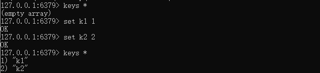

#### 2.exists key

判断某个key是否存在

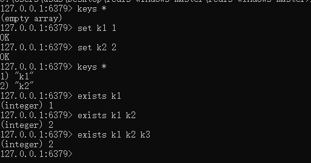

#### 3.type key

查看你的key是什么类型


#### 4.del key

删除指定的key数据


#### 5.unlink key

非阻塞删除，仅仅将keys从keyspace元数据中删除，真正的删除会在后续异步中操作。

del key 是原子的删除，只有删除成功了才会返回删除结果，如果是删除大key用del会将后面的操作都阻塞，而unlink key 不会阻塞，它会在后台异步删除数据。

#### 6.ttl key

查看还有多少秒过期，-1表示永不过期，-2表示已过期

#### 7.expire key 秒钟

为给定的key设置过期时间


#### 8.move key dbindex[0-15]

将当前数据库的key移动到给定的数据库DB当中


#### 9.select dbindex

切换数据库【0-15】，默认为0

#### 10.dbsize

查看当前数据库key的数量

#### 11.flushdb

清空当前库

#### 12.flushall

通杀全部库


## 3.4 数据类型命令及落地运用

英文：https://redis.io/commands/

中文：http://www.redis.cn/commands.html

**备注：**

1.命令不区分大小写，而key是区分大小写的


2.永远的帮助命令，help @类型

help @string

help @list

help @hash

help @hyperloglog


### 3.4.1 Redis字符串(String)

* 官网：https://redis.io/docs/data-types/strings/


* 单值单value

案例：

#### 1.最 常 用：set key value   |  get key

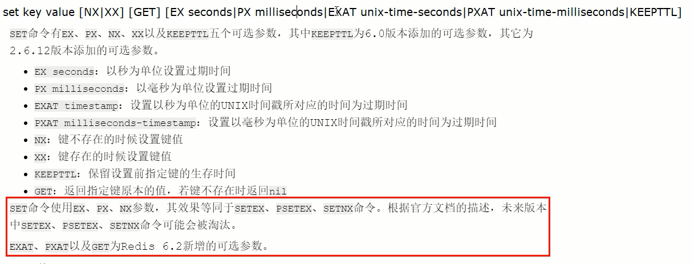

**返回值：**

设置成功则返回OK，返回nil为未执行Set命令，如不满足NX，XX条件等。

若使用GET参数，则返回该键原来的值，或在键不存在时nil。


如何获得设置指定的key过期的Unix时间，单位为秒

```java
System.out.println(Long.toString(System.currentTimeMillis()/1000L));
```


#### 2.同时设置/获取多个键值

MSET key value [key value...]

MGET key [key ...]

mset/mget/msetnx

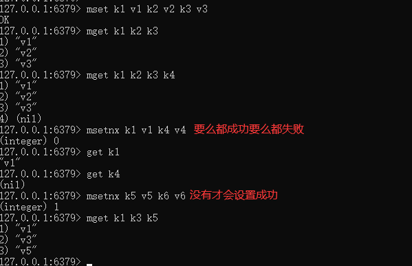

#### 3.获取指定区间范围内的值

getrange/setrange


#### 4.数值增减

一定要是数据才能进行加减

递增数字：INCR key

增加指定的整数：INCRBY key increment

递减数值：DECR key

减少指定的整数：DECRBY key decrement


#### 5.获取字符串长度和内容追加

获取字符串长度：strlen key

字符串内容追加：append key value


#### 6.分布式锁

setnx key value

setex(set with expire)键秒值/setnx(set if not exist)


#### 7.getset(先get再set)

getset：将给定key的值设为value，并返回key的旧值(old value)。

简单一句话：先get然后立即set


#### 8.应用场景

* 比如痘印无限点赞某个视频或商品，点一下加一次
* 是否喜欢的文章

### 3.4.2 Redis列表(List)

#### 1.常用


#### 2.单key多value

#### 3.简单说明

一个双端链表的结构，容量是2的32次方减1个元素大概40多亿，主要功能有push/pop等，一般用在栈、队列、消息队列等场景。left、right都可以插入添加；

如果键不存在，创建新的链表；

如果键已存在，新增内容；

如果值全移除，对应的键也就消失了

它的底层实际上就是个双向链表，对两端的作性能很高，通过索引下标的操作中间的节点性能会较差


#### 4.案例：

##### 1.lpush/rpush/lrange      注：**没有rrange**


##### 2.lpop/rpop


##### 3.lindex，按照索引下标获得元素（从上到下）


##### 4.llen,获取List列表中元素的个数


##### 5.lrem key 数字N 给定值v1

解释：删除N个值等于v1的元素

从left往right删除2个值等于v1的元素，返回的值为实际删除的数量

LREM list3 0 值，表示删除全部给定的值，零个就是全部值

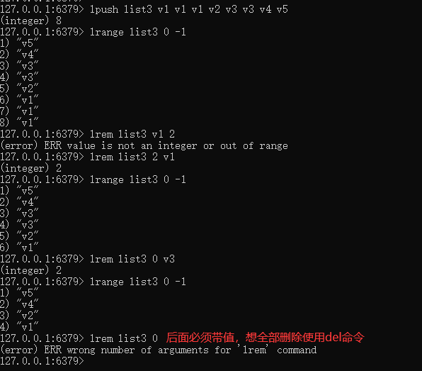

##### 6.ltrim key 开始index 结束index

截取指定范围的值后在赋值给key

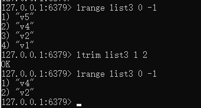

##### 7.rpoplpush 源列表  目的列表

移除列表的最后一个元素，并将该元素添加到另一个列表并返回


##### 8.lset key index value

让指定数组集合的小标位置值替换成新值


##### 9.linsert key before/after 已有值 插入的新值


##### 10.使用场景

微信公众号订阅的消息


### 3.4.3 Redis哈希(Hash)

#### 1.常用

#### 2.KV模式不变，但V是一个键值对 

​	Map<String, Map<Object, Object>>

#### 3.案例：

##### 1.hset/hget/hmset/hmget/hgetall/hdel


##### 2.hlen

获取某个key内的全部数量


##### 3.hexists key 在key里面的某个值的key


##### 4.hkeys/hvals

hkeys key 查询出所有key对应的子key值

hvals key 查询出所有key对应的子key的value值


##### 5.hincrby/hincrbyfloat


##### 6.hsetnx

不存在赋值，存在了无效

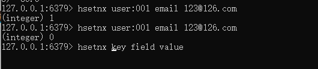

##### 7.应用场景

购物车

### 3.4.4 Redis集合(Set)

#### 1.常用

#### 2.单值多value，且无重复

#### 3.案例：

##### 1.SADD key member [member ...] 

添加元素，可以多次向同一个key中设置不同值，不会覆盖之前的值

##### 2.SMEMBERS key 

遍历集合中的所有元素

##### 3.SISMEMBER key member

判断元素是否在集合中


##### 4.SREM key member [member ...]

删除元素


##### 5.scard

获取集合里面的元素个数


##### 6.SRANDMEMBER key [数字]

从集合中随机展现设置的数字个数元素，元素不删除


##### 7.SPOP key [数字] 

从集合中随机弹出一个元素，出一个删除一个


##### 8. smove key1 key2

将key1里已存在的某个值赋给key2


##### 9.集合运算-集合的差集运算A-B

属于A但是不属于B的元素构成的集合

SDIFF key [key ...]，可以计算多个元素的差集


##### 10.集合运算-集合的并集运算A∪B

属于A或者属于B的元素构成的集合

SUNION key [key ...]


##### 11.集合运算-集合的交集运算A∩B

属于A同时也属于B的共同拥有的元素构成的集合

SINTER key [key ...]


**SINTERCARD numkeys key 【key ...】【LIMIT limit】**

numkeys 的具体值由输入的key个数决定

SINTERCARD 为redis7新命令，它不返回结果集，而是返回结果的基数。返回由所有给定集合的交集产生的集合的基数

基数的词语解释: 用于表示事物个数的数


##### 12.应用场景

微信抽奖小程序

微信朋友圈点赞查看同赞朋友

QQ内推可能认识的人

### 3.4.5Redis有序集合Zset(sorted set)

在set基础上，每个val值前加一个score分数值。之前set是k1 v1 v2 v3，现在zset是 k1 score1 v1 score2 v2

#### 1.案例：

向有序集合中加入一个元素和该元素的分数

##### 1.ZADD key score member [score member ...] 

添加元素

##### 2.ZRANGE key start stop [WITHSCORES]

按照元素分数从小到大的顺序返回索引从start到stop之间的所有元素


##### 3.zrevrange key start stop [WITHSCORES]

反转集合，按照元素分数从大到小的顺序返回索引从start到stop之间的所有元素


##### 4.ZRANGEBYSCORE key min max 【WITHSCORES】【LIMIT offset count】

获取指定分数范围的元素，可以在min和max前面加个(，表示不包含

limit作用是返回限制，limit开始下标步，一共多少步


##### 5.ZSCORE key member

获取元素的分数

##### 6.ZCARD key

获取集合中元素的数量


##### 7. zrem key member [member ...]

某个score对应的value值，作用是删除元素

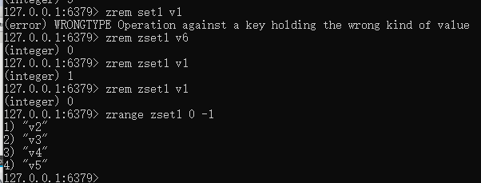

##### 8.ZINCRBY key increment member

增加某个元素的分数


##### 9.ZCOUNT key min max

获得指定分数内的元素个数


##### 10.ZMPOP numkeys key [key ...] MIN|MAX [COUNT count]

从键名列表中的**第一个非空排序集中弹出一个或多个元素**，他们是成员分数对


##### 11.zrank key member [withscore]

作用是通过子value获得下标值

##### 12.zrevrank key member [withscore]

作用是通过子value逆序获得下标值


##### 13.应用场景

根据商品销售对商品进行排序显示

### 3.4.6Redis位图(bitmap)

#### 1.一句话：

由0和1状态表现的二进制位的bit数组

#### 2.看需求：

1. 用户是否登陆过Y、N，比如软件的每日签到功能
2. 电影、广告是否被点击播放过
3. 钉钉打卡上下班，签到统计

#### 3.是什么?


说明：用String类型作为底层数据结构实现的一种统计二值状态的数据类型

位图本质是数组，它是基于String数据类型的按位的操作。该数组由多个二进制位组成，每个二进制位都对应一个偏移量（我们称之为一个索引）。

Bitmap支持的最大位数是2^32位，它可以极大的节约存储空间，使用512M内存就可以存储多达42.9亿的字节信息(2^32=4294967296)

#### 4.能干嘛？

用于状态统计，Y、N类似AtomicBoolean

#### 5.基本命令


##### 1.setbit key offset value

setbit 键偏移位 只能零或者1

**Bitmap的偏移量从零开始计算的**

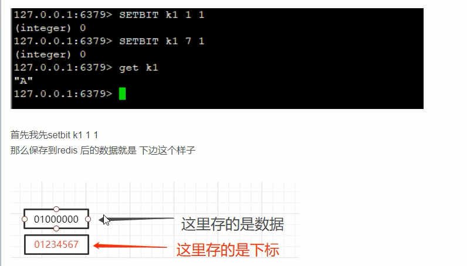


##### 2.getbit key offset

获取键偏移位的值

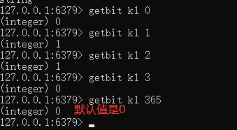

##### 3.strlen key

统计字节数占用多少


不是字符串长度而是占据几个字节，超过8位后自己按照8位一组**一byte**再扩容

##### 4.bitcount key [start end [byte|bit]] 

全部键里面包含有1的有多少个


##### 5.bitop operation(AND|OR|XOR|NOT) destkey key [key ...]

案例：连续2天都签到的用户数量

假如某个网站或者系统，它的用户有1000W，我们可以使用redis的HASH结构和bitmap结构做个用户id和位置的映射


##### 6.应用场景

一年365天，全年天天登录占用多少字节

按照年：365/8约等于46Byte,1000W用户一年也只需要44MB就足够了。

### 3.4.7 Redis基数统计(HyperLogLog)

#### 1.看需求：

- 统计某个网站的UV、统计某个文章的UV

- 什么是UV？
  - Unique Visitor，独立访客，一般理解为客户端IP
  - 需要去重考虑
- 用户搜索网站关键词的数量
- 统计用户每天搜索不同词条个数

#### 2.是什么

* 去重复统计功能的基数估计算法-就是HyperLogLog
  * Redis在2.8.9版本添加了HyperLogLog 结构。
  * Redis HyperLogLog是用来做基数统计的算法，HyperLogLog 的优点是，在输入元素的数量或者体积非常非常大时，计算基数所需的空间总是固定的、并且是很小的。
  * 在Redis里面，每个 HyperLogLog键只需要花费12KB内存，就可以计算接近2^64个不同元素的基数。这和计算基数时，元素越多耗费内存就越多的集合形成鲜明对比。但是，因为HyperLogLog只会根据输入元素来计算基数，而不会储存输入元素本身，所以HyperLogLog不能像集合那样，返回输入的各个元素。
  * 但是，因为HyperLogLog只会根据输入元素来计算基数，而不会储存输入元素本身，所以HyperLogLog不能像集合那样，返回输入的各个元素。
  * HyperLogLog提供的是一个近似的计数，而不是精确的计数。误差率通常很低（例如，标准误差率约为0.81%）

* **基数**：是一种数据集，去重复后的真实个数

```tex
(全集)={2,4,6,8,77,39,4,8,10}
去掉重复的内容
基数={2,4,6,8,77,39,10} = 7
```

* 基数统计：用于统计一个集合中不重复的元素个数，就是对集合去重复后剩余元素的计算。

* 一句话：去重脱水后的真实数据

#### 3.基本命令：


#### 4.应用场景

天猫网站首页亿级UV的Redis统计方案。可以实现的方案：将每段时间的ip输入进去，然后合并这每段时间的ip，合并后计算元素个数，就是UV。

### 3.4.8 Redis地理空间(GEO)

#### 1.简介：

- 移动互联网时代LBS应用越来越多，交友软件中附近的小姐姐、外卖软件中附近的美食店铺、高德地图附近的核酸检查点等等，那这种附近各种形形色色的XXX地址位置选择是如何实现的?
- 地球上的地理位置是使用二维的经纬度表示，经度范围(-180,180]，纬度范围(-90，90]，只要我们确定一个点的经纬度就可以取得他在地球的位置。
- 例如滴滴打车，最直观的操作就是实时记录更新各个车的位置，
- 然后当我们要找车时，在数据库中查找距离我们(坐标x0,y0)附近r公里范围内部的车辆
  使用如下SQL即可:

```sql
select taxi from position where x0-r< X < x0 + r and y0-r< y < y0+r
```

但是这样会有什么问题呢?
1.查询性能问题，如果并发高，数据量大这种查询是要搞垮数据库的
2.这个查询的是一个矩形访问，而不是以我为中心r公里为半径的圆形访问。
3.精准度的问题，我们知道地球不是平面坐标系，而是一个圆球，这种矩形计算在长距离计算时会有很大误差

#### 2.原理


#### 3.redis在3.2版本以后增加了地址位置的处理

#### 4.命令

##### 1.GEOADD 多个经度(longitude)、纬度(latitude)、位置名称(member)添加到指定的key中

##### 2.GEOPOS 从键里面返回所有指定名称(member )元素的位置（经度和纬度）

##### 3.GEODIST 返回两个给定位置之间的距离（distance）

##### 4.GEORADIUS 以给定的经纬度为中心，返回与中心的距离不超过给定最大距离的所有元素位置

##### 5.GEORADIUSBYMEMBER 跟GEORADIUS类似

##### 6.GEOHASH 返回一个或多个位置元素的GEOhash表示

#### 5.命令实操

获取经纬度：https://api.map.baidu.com/lbsapi/getpoint/index.html

##### 1.GEOADD key longitude latitude member [longitude latitude member]

多个经度(longitude)、纬度(latitude)、位置名称(member)添加到指定的key中

命令：GEOADD city 116.403963 39.915119 "天安门" 116.403414 39.924091 "故宫" 116.024067 40.362639 "长城"

geo类型实际上是zset，可以使用zset相关的命令对其进行遍历，如果遍历出现中文乱码可以使用如下命令：redis-cli  最后加--raw


##### 2.GEOPOS key member [member]

从键里面返回所有指定名称(member )元素的位置（经度和纬度），不存在返回nil

GEOPOS city 天安门 故宫 长城


##### 3.GEODIST key member1 member2 [M|KM|FT|MI]

返回两个给定位置之间的距离

命令：GEODIST city 天安门 故宫 KM

m-米

km-千米

ft-英寸

mi-英里


##### 4.GEORADIUS key longitude latitude radius M|KM|FT|MI \[WITHCOORD] \[WITHDIST] \[WITHHASH] [COUNT count [ANY]

命令：georadius city 116.418017 39.914402 10 km withdist withcoord count 10 withhash desc

以给定的经纬度为中心，返回与中心的距离不超过给定最大距离的所有元素位置

WITHDIST: 在返回位置元素的同时， 将位置元素与中心之间的距离也一并返回。 距离的单位和用户给定的范围单位保持一致。
WITHCOORD: 将位置元素的经度和维度也一并返回。
WITHHASH:以 52 位有符号整数的形式， 返回位置元素经过原始 geohash 编码的有序集合分值。 这个选项主要用于底层应用或者调试，实际中的作用并不大
COUNT 限定返回的记录数。


##### 5.GEORADIUSBYMEMBER

跟GEORADIUS类似

命令： GEORADIUSBYMEMBER city 天安门 10 km   count 1 withhash desc


##### 6.GEOHASH

返回一个或多个位置元素的GEOhash表示

geohash 算法生成的base32编码值，3维变2维变1维


#### 6.应用场景

​	编码实战案例见高级篇

### 3.4.9 Redis流(Stream)

#### 1.是什么

* Redis5.0 之前的痛点
  * Redis消息队列的2种方案：

1. List实现消息队列，List实现方式其实就是点对点的模式

   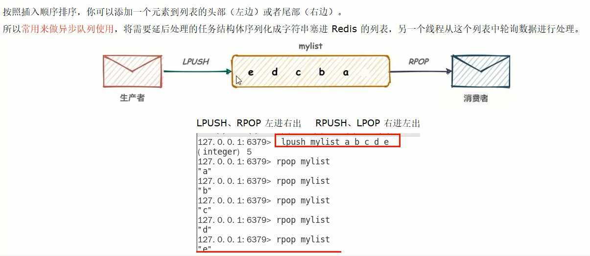

2. Pub/Sub


* Redis5.0版本新增了一个更强大的数据结构---Stream

* 一句话：Stream流就是Redis版的MQ消息中间件+阻塞队列

#### 2.能干嘛

* 实现消息队列，它支持消息的持久化、支持自动生成全局唯一ID、支持ack确认消息的模式、支持消费组模式等，让消息队列更加的稳定和可靠

#### 3.底层结构和原理说明


一个消息链表，将所有加入的消息都串起来，每个消息都有一个唯一的ID和对应的内容


#### 4.基本命令理论简介

##### 1.队列相关指令

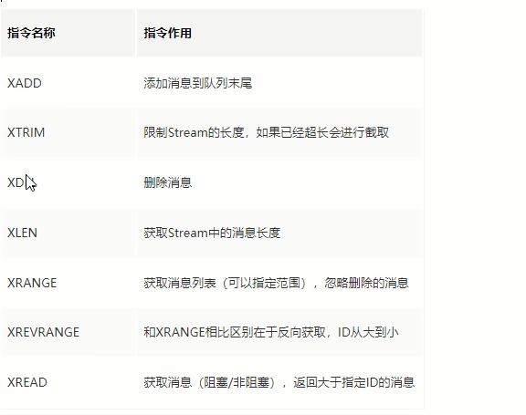

##### 2.消费组相关指令


XINFO GROUPS    打印消费组的详细信息

XINFO STREAM     打印stream的详细信息

##### 3.四个特殊符号

| - +  | 最小和最大可能出现的Id                                       |
| ---- | ------------------------------------------------------------ |
| $    | $表示只消费新的消息，当前流中最大的Id，可用于将要到来的信息  |
| >    | 用于XREADGROUP命令，表示迄今还没有发送给组中使用者的信息，会更新消费者组的最后Id |
| *    | 用于XADD命令，让系统自动生成Id                               |

#### 5.基本命令代码实操

##### Redis流实例演示

###### 1.队列相关命令

* XADD，添加消息到队列末尾

```shell
xadd test_stream * name 名字 age 18
```

消息ID必须要比上一个ID大，默认用星号表示自动生成ID；* 用于XADD命令中，让系统自动生成ID；

XADD用于向Stream队列中添加消息，如果指定的Stream队列不存在，则该命令执行时会新建一个Stream队列


生成的消息ID，有两部分组成，毫秒时间戳-该毫秒内产生的第一条消息

// * 表示服务器自动生成MessageID(类似MySQL里面主键auto_increment)，后面顺序跟着一堆业务key/value

| 信息条目指的是序列号，在相同的毫秒下序列号从0开始递增，序列号是64位长度，理论上在同一毫秒内生成的数据量无法到达这个级别，因此不用担心序列号会不够用。milisecondsTime指的是Redis节点服务器的本地时间，如果存在当前的毫秒时间截比以前已经存在的数据的时间戳小的话(本地时间钟后跳)，那么系统将会采用以前相同的毫秒创建新的ID，也即redis 在增加信息条目时会检查当前 id 与上一条目的 id，自动纠正错误的情况，一定要保证后面的 id 比前面大，.个流中信息条目的ID必须是单调增的，这是流的基础。 |
| ------------------------------------------------------------ |
| 客户端显示传入规则:<br />Redis对于ID有强制要求，格式必须是**时间戳-自增Id**这样的方式，且后续ID不能小于前一个ID |
| Stream的消息内容，也就是图中的Messaget它的结构类似Hash结构，以kev-value的形式存在 |

* XRANGE

```
XRANGE key start end [COUNT count]
```

用于获取消息列表（可以指定范围），忽略删除的消息

start 表示开始值(开始的id)，-代表最小值

end 表示结束值(结束的id)，+代表最大值

count 表示最多获取多少个值

```shell
127.0.0.1:6379> xrange test_stream 1747703646688-0 1747703646688-1 count 1
1) 1) "1747703646688-0"
   2) 1) "name"
      2) "\xe5\x90\x8d\xe5\xad\x97"
      3) "age"
      4) "18"

```


* XREVRANGE

```
XREVRANGE key end start [COUNT count]
```

根据ID降序输出


* XDEL

```
XDEL key id [id ...]
```

```
127.0.0.1:6379> xdel test_stream 1747703646688-0
(integer) 1
127.0.0.1:6379> xrange test_stream 1747703646688-0 1747703646688-1 count 1

```

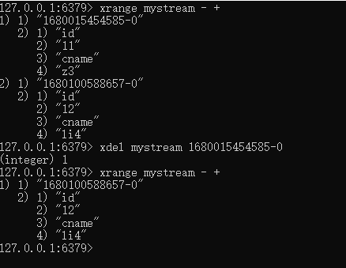

* XLEN

```
XLEN key
```


* XTRIM

```
XTRIM key MAXLEN|MINID
```

用于对Stream的长度进行截取，如超长会进行截取

MAXLEN 允许的最大长度，对流进行修剪限制长度

MINID 允许的最小id，从某个id值开始比该id值小的将会被抛弃

```
127.0.0.1:6379> xtrim test_stream maxlen 2
(integer) 2
127.0.0.1:6379> xrange test_stream - +
1) 1) "1747704580494-0"
   2) 1) "name"
      2) "\xe5\x90\x8d\xe5\xad\x97"
      3) "age"
      4) "19"
2) 1) "1747704581835-0"
   2) 1) "name"
      2) "\xe5\x90\x8d\xe5\xad\x97"
      3) "age"
      4) "19"

```


* XREAD

```
XREAD [COUNT count] [BLOCK milliseconds] STREAMS key [key ...] id [id ...]
```

可以读取多个key

**用于获取消息(阻塞/非阻塞)**

​	只会返回大于指定ID的消息，COUNT最多读取多少条消息；BLOCK是否以阻塞的方式读取消息，默认不阻塞，如果milliseconds设置为0，表示永远阻塞

**非阻塞**

- $表特殊ID，表示以当前Stream已经存储的最大的ID作为最后一个ID，当前Stream中不存在大于当前最大ID的消息，因此此时返回nil

- 0-0代表从最小的ID开始获取Stream中的消息，当不指定count，将会返回Stream中的所有消息，注意也可以使用0 (00/000也都是可以的)

  

```
127.0.0.1:6379> xread count 1
(error) ERR wrong number of arguments for 'xread' command
127.0.0.1:6379> xread count 1
(error) ERR wrong number of arguments for 'xread' command
127.0.0.1:6379> xread count 1 test_stream
(error) ERR syntax error
127.0.0.1:6379> xread count 1 streams test_stream
(error) ERR Unbalanced XREAD list of streams: for each stream key an ID or '$' must be specified.
127.0.0.1:6379> xread count 1 streams test_stream $
(nil)
127.0.0.1:6379> xread count 1 streams test_stream 0-1
1) 1) "test_stream"
   2) 1) 1) "1747704580494-0"
         2) 1) "name"
            2) "\xe5\x90\x8d\xe5\xad\x97"
            3) "age"
            4) "19"

```

**阻塞**


小总结（类似Java里面的阻塞队列）

Stream的基础方法，使用XADD存入消息和XREAD循环阻塞读取消息的方式可以实现简易版的消息队列


---

###### 2.消费组相关指令

* XGROUP CREATE 用于创建消费组

```
XGROUP CREATE key group id|$
```

xgroup create mystream group $

xgroup create mystream groupB 0

$表示从Stream尾部开始消费

0表示从Stream头部开始消费

创建消费组的时候必须指定ID，ID为0表示从头开始消费，为$表示只消费新消息

''

* XREADGROUP GROUP

```
XREADGROUP GROUP group  \[COUNT count] [BLOCK milliseconds] STREAMS key id 
```

">"，表示从第一条尚未被消费的消息开始读取


消费组groupA内的消费者consumer1从mystream消息队列中读取所有消息

但是，**不同消费组**的消费者可以消费同一条消息


消费组的目的？

让组内的多个消费者共同分担读取消息，所以，我们通常会让每个消费者读取部分消息，从而实现消息读取负载在多个消费者间是均衡分部的


* 重点问题

基于 Stream 实现的消息队列，如何保证消费者在发生故障或宕机再次重启后，仍然可以读取未处理完的消息?

Streams 会自动使用内部队列(也称为 PENDING List)留存消费组里每个消费者读取的消息保底措施，直到消费者使用 XACK命令通知 Streams"消息已经处理完成”。
消费确认增加了消息的可靠性，一般在业务处理完成之后，需要执行 XACK 命令确认消息已经被消费完成


* XPENDING 

查询每个消费组内所有消费组[已读取、但尚未确认]的消息


查看某个消费组具体读取了那些数据


* XACK

```
XACK key group id [id...]
```

向消息队列确认消息处理已完成

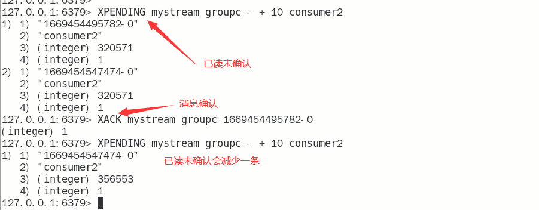

```
127.0.0.1:6379> xpending test_stream groupa
1) (integer) 1
2) "1747704581835-0"
3) "1747704581835-0"
4) 1) 1) "consumer1"
      2) "1"
127.0.0.1:6379> xpending test_stream groupa
1) (integer) 1
2) "1747704581835-0"
3) "1747704581835-0"
4) 1) 1) "consumer1"
      2) "1"
127.0.0.1:6379>
127.0.0.1:6379> xack test_stream groupa 1747704581835-0
(integer) 1
127.0.0.1:6379> xpending test_stream groupa
1) (integer) 0
2) (nil)
3) (nil)
4) (nil)

```


###### 3.XINFO

用于打印Stream\Consumer\Group的详细信息 


#### 6.使用建议

* Stream还是不能100%等价于Kafka、RabbitMQ来使用的，生产案例少，慎用

### 3.4.10 Redis位域(bitfield)

#### 1.了解即可

#### 2.是什么

Redis的Bitfields（位域）与Bitmaps一样，在Redis中并不是一种独立的数据类型，而是一种基于字符串的数据结构，用于处理位级别的操作。允许用户将一个Redis字符串视作由一系列二进制位组成的数组，并对这些位进行高效的访问和操作。通过Bitfield，开发者可以将多个小的整数存储到一个较大的位图中，或者将一个庞大的键分割为多个较小的键进行存储，从而极大地提高了内存的使用效率。

https://redis.com.cn/commands/bitfield.html

#### 3.能干嘛


位域修改、溢出控制

#### 4.一句话

将一个redis字符串看作是**一个由二进制位组成的数组**并能对变长位宽和任意没有字节对齐的指定整型位域进行寻址和修改

#### 5.命令基本语法


#### 6.案例

Ascii码表：https://ascii.org.cn

##### 1.BITFIELD key [GET type offset]


##### 2.BITFIELD key set type offstet value


##### 3.BITFIELD key [INCRBY type offset increment]


如果偏移量后面的值发生溢出（大于127），redis对此也有对应的溢出控制，默认情况下，INCRBY使用WRAP参数

##### 4.溢出控制 OVERFLOW [WRAP|SAT|FAIL]

WRAP:使用回绕(wrap around)方法处理有符号整数和无符号整数溢出情况

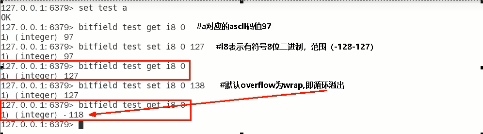

SAT:使用饱和计算(saturation arithmetic)方法处理溢出，下溢计算的结果为最小的整数值，而上溢计算的结果为最大的整数值


fail:命令将拒绝执行那些会导致上溢或者下溢情况出现的计算，并向用户返回空值表示计算未被执行


