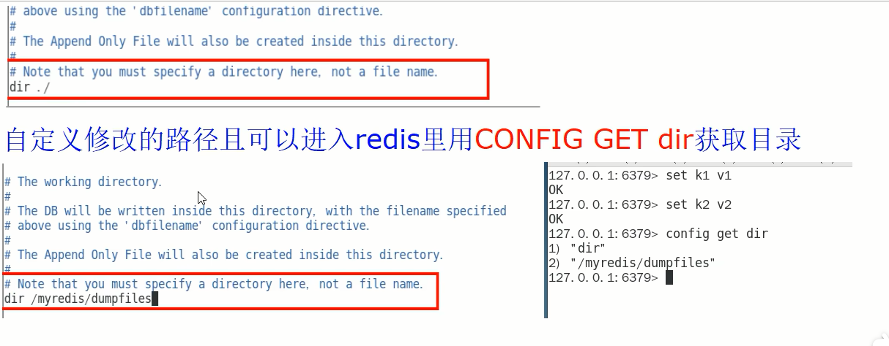
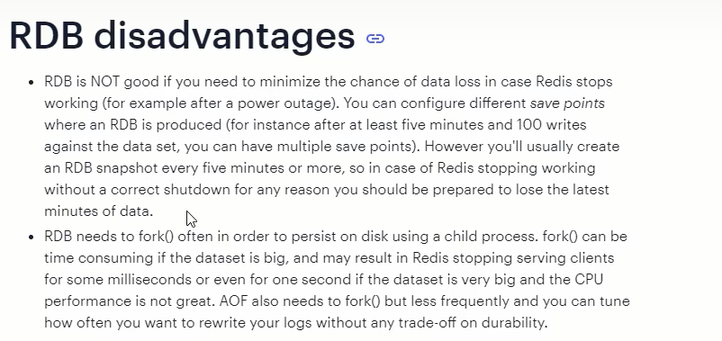
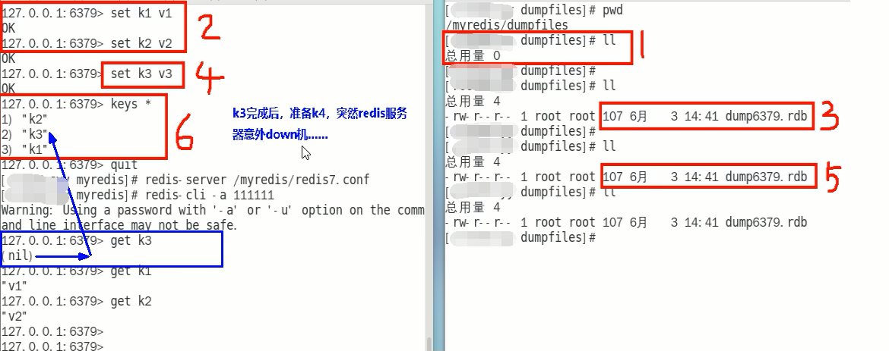
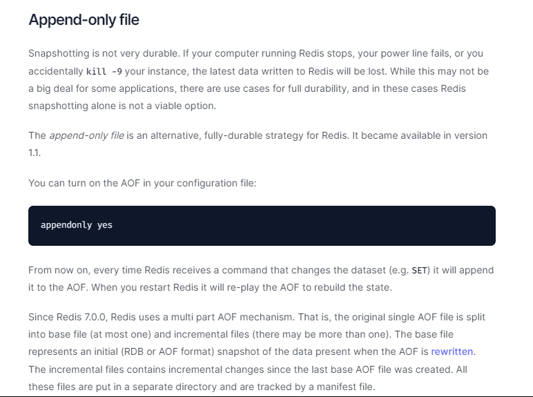
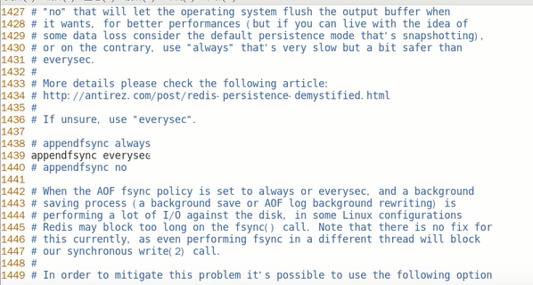
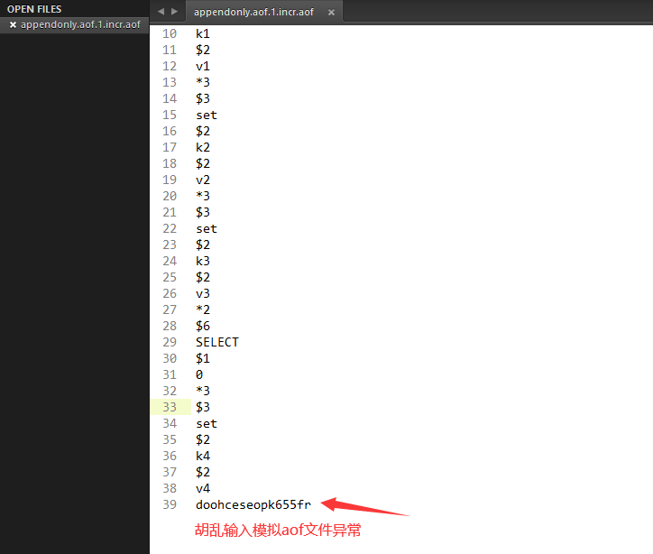
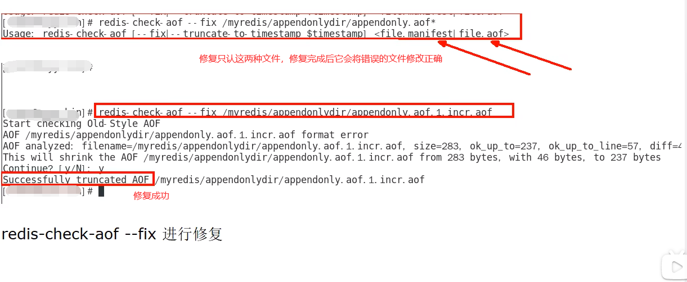
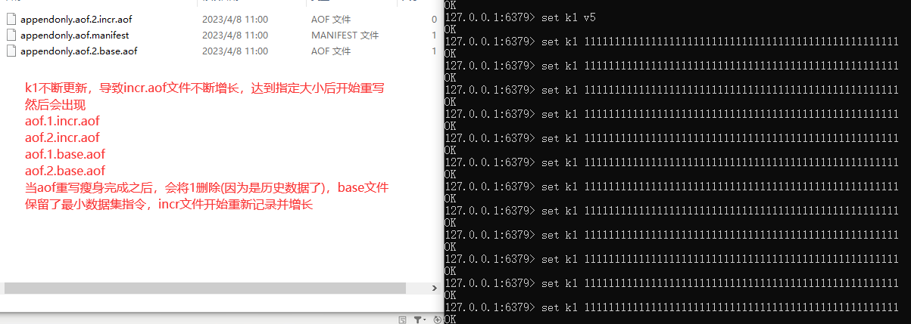
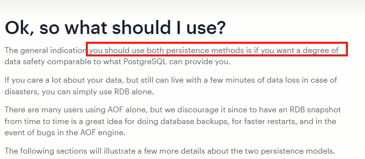

# 第4章-redis持久化.md

## 4.1总体介绍

* 官网地址：https://redis.io/docs/manual/persistence/


* 为什么需要持久化

## 4.2 持久化双雄

### 4.2.1 一图


### 4.2.2  RDB(Redis DataBase)

#### 4.2.2.1 官网介绍


RDB(Redis 数据库)：RDB持久化以指定的时间间隔执行数据集的时间点快照

#### 4.2.2.2 是什么

- 在指定的时间间隔，执行数据集的时间点快照

- 实现类似照片记录效果的方式，就是把某一时刻的数据和状态以文件的形式写到磁盘上，也就是快照。这样一来即使故障宕机，快照文件也不会丢失，数据的可靠性也就得到了保证。

- 这个快照文件就称为RDB文件(dump.rdb)其中，RDB就是Redis DataBase的缩写。


#### 4.2.2.3 能干嘛

- 在指定的时间间隔内将内存中的数据集快照写入磁盘，也就是行话讲的snapshot内存快照，它恢复时再将硬盘快照文件直接读回到内存里。

- Redis的数据都在内存中，保存备份时它执行的是全量快照，也就是说，把内存中的所有数据都记录到磁盘中，一锅端。

- RDB保存的是dump.rdb文件。


#### 4.2.2.4 RDB案例演示

##### 4.2.2.4.1 需求说明


##### 4.2.2.4.2 配置文件

* Redis6.0.16及以下


* Redis6.2以及Redis-7.0.0


##### 4.2.2.4.3 操作步骤


* 自动触发
  * Redis7版本，按照redis.conf里配置的 save \<seconds> \<changes>

  * 本次案例5秒2次修改

    

  * 修改dump文件保存路径，设置的路径必须创建好

    ```sh
    [root@localhost ~]# redis-server /opt/redis-7.0.15/redis.conf
    
    *** FATAL CONFIG FILE ERROR (Redis 7.0.15) ***
    Reading the configuration file, at line 504
    >>> 'dir /opt/redis-7.0.15/dumpFiles/'
    No such file or directory
    [root@localhost ~]#
    [root@localhost ~]# redis-server /opt/redis-7.0.15/redis.conf
    [root@localhost ~]#
    [root@localhost ~]#
    [root@localhost ~]# redis-cli -a redis -p 6379
    Warning: Using a password with '-a' or '-u' option on the command line interface may not be safe.
    127.0.0.1:6379> ping
    PONG
    127.0.0.1:6379> config get dir
    1) "dir"
    2) "/opt/redis-7.0.15/dumpFiles"
    127.0.0.1:6379> confgi get dbfileNAME
    (error) ERR unknown command 'confgi', with args beginning with: 'get' 'dbfileNAME'
    127.0.0.1:6379> confgi get dbfilename
    (error) ERR unknown command 'confgi', with args beginning with: 'get' 'dbfilename'
    127.0.0.1:6379> config get dbfilename
    1) "dbfilename"
    2) "dump6379.rdb"
    
    ```

    

  * 修改dump文件名称

    

  * 触发备份

    第一种情况，5秒内保存2次

    

    第二种情况，两次保存间隔超过5秒

    
      注：RDB 持久化是 Redis 的一种持久化机制，它会在 Redis 数据发生修改时对内存中的数据进行快照，然后保存到磁盘，以保证数据的持久性。通常情况下，RDB 保存快照的时间间隔由配置文件中的参数 save 决定，格式为 save \<seconds> \<changes>，表示在 \<seconds> 秒内，如果数据有 \<changes> 次修改，则会进行一次快照。

    在题目描述的情况下，RDB 设置了每 5 秒进行一次快照，但是如果在 5 秒内修改次数超过了 2 次，也会进行快照。这是因为在 Redis 中，保存快照并不是在规定的时间到达后才进行，而是在修改数据时和时间间隔条件的双重限制下才进行的。

    如果限制只按时间间隔来进行保存快照，则会出现两个问题：

    如果时间间隔太大，那么 Redis 持久化的数据可能会丢失，并且故障恢复时的数据可能会受到影响。

    如果时间间隔太小，那么数据的保存成本就会过高，并可能导致 Redis 运行效率下降。

    因此，Redis 引入了按时间和数据修改次数双重限制的快照保存机制，以在灵活性和效率之间取得平衡。如果在 5 秒内修改的次数超过 2 次，则说明数据的变化较快，在此情况下保存快照并不会带来明显的性能问题。因此，Redis 将其纳入保存快照的范围，以保证数据的安全和一致性

  * 如何恢复

    将备份文件(dump.rdb)移动到 Redis 安装目录并启动服务即可。最好是移除当前目录测试，避免影响。

    备份成功后故意用flushdb清空redis，看看是否可以恢复数据

    * 执行flushall/flushdb命令也会产生dump.rdb文件，但里面是空的，无意义

    物理恢复，一定要将服务产生的RDB文件备份一份，然后分机隔离，避免生产上物理损坏后备份文件也挂了。

* 手动触发
  * redis提供了两个命令来生成RDB文件，分别是save和bgsave

    

  * save：在主程序中执行会阻塞当前redis服务器，直到持久化工作完成执行save命令期间，Redis不能处理其他命令，线上禁止使用

  * bgsave(默认)：

    * redis会在后台异步进行快照操作，**不阻塞**快照同时还可以相应客户端请求，该触发方式会fork一个子进程由子进程复制持久化过程

    * 官网说明

      

    * Redis会使用bgsave对当前内存中的所有数据做快照，这个操作是子进程在后台完成的，这就允许主进程同时可以修改数据。

    * fork是什么？
      在Linux程序中，fork()会产生一个和父进程完全相同的子进程，但子进程在此后会exec系统调用，处于效率考虑，尽量避免膨胀

    * LASTSAVE

      可以通过lastsave命令获取最后一次成功执行快照的时间

      


#### 4.2.2.5 优势

官网说明：


- RDB是Redis 数据的一个非常紧凑的单文件时间点表示。RDB文件非常适合备份。例如，您可能希望在最近的24小时内每小时归档一次RDB文件，并在30天内每天保存一个RDB快照。这使您可以在发生灾难时轻松恢复不同版本的数据集。
- RDB非常适合灾难恢复，它是一个可以传输到远程数据中心或Amazon S3(可能已加密）的压缩文件。
- RDB最大限度地提高了Redis 的性能，因为Redis 父进程为了持久化而需要做的唯一工作就是派生一个将完成所有其余工作的子进程。父进程永远不会执行磁盘I/О或类似操作。
- 与AOF 相比，RDB允许使用大数据集更快地重启。
- 在副本上，RDB支持重启和故障转移后的部分重新同步。

小总结：

- 适合大规模的数据恢复
- 按照业务定时备份
- 对数据完整性和一致性要求不高
- RDB文件在内存中的加载速度要比AOF快很多

#### 4.2.2.6 劣势

官网说明：



- 如果您需要在Redis停止工作时（例如断电后）将数据丢失的可能性降到最低，那么RDB并不好。您可以配置生成RDB的不同保存点（例如，在对数据集至少5分钟和100次写入之后，您可以有多个保存点)。但是，您通常会每五分钟或更长时间创建一次RDB快照，因此，如果Redis由于任何原因在没有正确关闭的情况下停止工作，您应该准备好丢失最新分钟的数据。
- RDB需要经常fork()以便使用子进程在磁盘上持久化。如果数据集很大，fork()可能会很耗时，并且如果数据集很大并且CPU性能不是很好，可能会导致Redis停止为客户端服务几毫秒甚至一秒钟。AOF也需要fork()但频率较低，您可以调整要重写日志的频率，而不需要对持久性进行任何权衡。

小总结：

- 在一定间隔时间做一次备份，所以如果redis意外down掉的话，就会丢失从当前至最近一次快照期间的数据，**快照之间的数据会丢失**
- 内存数据的全量同步，如果数据量太大会导致IO严重影响服务器性能
- RDB依赖于主进程的fork，在更大的数据集中，这可能会导致服务请求的瞬间延迟。fork的时候内存中的数据被克隆了一份，大致2倍的膨胀性，需要考虑

模拟数据丢失：



#### 4.2.2.7 如何检查修复dump.rdb文件？

进入到redis安装目录，执行redis-check-rdb命令 redis-check-rdb ./redisconfig/dump.rdb

#### 4.2.2.8 哪些情况会触发RDB快照

1. 配置文件中默认的快照配置
2. 手动save/bgsave命令
3. 执行flushdb/fulshall命令也会产生dump.rdb文件，但是也会将命令记录到dump.rdb文件中，恢复后依旧是空，无意义
4. 执行shutdown且没有设置开启AOF持久化
5. 主从复制时，主节点自动触发

#### 4.2.2.9 如何禁用快照

1. 动态所有停止RDB保存规则的方法：redis-cli config set value ""
2. 手动修改配置文件


#### 4.2.2.10 RDB优化配置项详解

配置文件SNAPSHOTTING模块

- save \<seconds> \<changes>：配置快照保存条件

- dir：配置快照保存目录地址

- dbfilename：配置快照的文件名

- stop-writes-on-bgsave-error：

  

  默认yes，如果配置成no，表示不在乎数据不一致或者有其他的手段发现和控制这种不一致，那么在快照写入失败时，也能确保redis继续接受新的请求

- rdbcompression：

  

  默认yes，对于存储到磁盘中的快照，可以设置是否进行压缩存储。如果是的话，Redis会采用LZF算法进行压缩。如果你不想消耗CPU来进行压缩的话，可以设置为关闭此功能

- rdbchecksum：

  

  默认yes，在存储快照后，还可以让redis使用CRC64算法来进行数据校验，但是这样做会增加大约10%的性能消耗，如果希望获取到最大的性能提升，可以关闭此功能

- rdb-del-sync-files：


在没有持久化的情况下删除复制中使用的RDB文件。默认情况下no，此选项是禁用的。

#### 4.2.2.11 小总结


### 4.2.3 AOF(Append Only File)

#### 4.2.3.1 官网介绍


#### 4.2.3.2 是什么

- 以日志的形式来记录每个写操作，将Redis执行过的所有写指令记录下来(读操作不记录)，只许追加文件但是不可以改写文件，redis启动之初会读取该文件重新构建数据，换言之，redis重启的话就根据日志文件的内容将写指令从前到后执行一次以完成数据的恢复工作

- 默认情况下，redis是没有开启AOF的。开启AOF功能需要设置配置：appendonly yes


#### 4.2.3.3 能干嘛



#### 4.2.3.4 AOF保存的是appendonly.aof文件

#### 4.2.3.5 AOF持久化工作流程


1.Client作为命令的来源，会有多个源头以及源源不断的请求命令。

2.在这些命令到达Redis Server 以后并不是直接写入AOF文件，会将其这些命令先放入AOF缓存中进行保存。这里的AOF缓冲区实际上是内存中的一片区域，存在的目的是当这些命令达到一定量以后再写入磁盘，避免频繁的磁盘IO操作。

3.AOF缓冲会根据AOF缓冲区**同步文件的三种写回策略**将命令写入磁盘上的AOF文件。

4.随着写入AOF内容的增加为避免文件膨胀，会根据规则进行命令的合并(**又称AOF重写**)，从而起到AOF文件压缩的目的。

5.当Redis Server服务器重启的时候会队AOF文件载入数据。

#### 4.2.3.6 AOF缓冲区三种写回策略


Always：同步写回，每个写命令执行完立刻同步地将日志写会磁盘

everysec：每秒写回，每个写命令执行完，只是先把日志写到AOF文件的内存缓冲区，每隔1秒把缓冲区中的内容写入到磁盘

no：操作系统控制的写回，每个写命令执行完，只是先把日志写到AOF文件的内存缓冲区，由操作系统决定何时将缓冲区内容写回磁盘

小总结：


#### 4.2.3.7 AOF案例演示和说明，AOF配置/启动/修复/恢复

##### 4.2.3.7.1 配置文件说明 (6 VS 7)

* 如何开启aof


* 使用默认写回策略



* aof文件-保存路径
  * redis6及以前

    AOF保存文件的位置和RDB保存文件的位置一样，都是通过redis.conf配置文件的dir配置

    .jpg)

  * redis7最新

    .jpg)

  * 一句话：

    

* aof文件-保存名称
  * redis6及以前 ，有且仅有一个

    .jpg)


- Redis7 Multi Part AOF的设计

  - 从1个文件到3个文件

    .jpg)

**MP-AOF实现**
**方案概述**
顾名思义，MP-AOF就是将原来的单个AOF文件拆分成多个AOF文件。在MP-AOF中，我们将AOF分为三种类型,
分别为:

- **BASE: 表示基础AOF**，它一般由子进程通过重写产生，该文件最多只有一个。


- **INCR:表示增量AOF**，它一般会在AOFRW开始执行时被创建，该文件可能存在多个。


- **HISTORY**:表示历史AOF，它由BASE和INCR AOF变化而来，每次AOFRW成功完成时，本次AOFRW之前对应的BASE和INCR AOF都将变为HISTORY，HISTORY类型的AOF会被Redis自动删除。

为了管理这些AOF文件，我们引入了一个manifest (清单)文件来跟踪、管理这些AOF。同时，为了便于AOF备份和拷贝，我们将所有的AOF文件和manifest文件放入一个单独的文件目录中，目录名由appenddirname配置(Redis 7.0新增配置项)决定。

Redis7.0config 中对应的配置项


##### 4.2.3.7.2 正常恢复

1. 修改默认的appendonly no，改为yes
2. 写操作继续，生成aof文件到指定目录（然后将appendonly文件备份，使用flushdb+shutdown服务器来模拟redis宕机数据丢失，删除生成的新aof文件，将备份文件恢复）
   
3. 恢复：重启redis然后重新加载，结果OK，将数据重新写入到了redis

##### 4.2.3.7.3 异常恢复

1. 故意胡乱改动正常的AOF文件，模拟网络闪断文件写入不完整等其他异常情况
   
2. 重启Redis之后就会进行AOF文件的载入
   
3. 异常修复命令：redis-check-aof --fix进行修复
   
4. 启动后OK

#### 4.2.3.8 优势

更好的保护数据不丢失、性能高、可做紧急恢复


- 使用AOF Redis 更加持久: 您可以有不同的fsync 策略: 根本不fsync、每秒 fsync、每次查询时fsync。使用每秒fsync的默认策略，写入性能仍然很棒。fsync 是使用后台线程执行的，当没有fsync正在进行时，主线程将努力执行写入，因此您只能丢失一秒钟的写入。
- AOF 日志是一个仅附加日志，因此不会出现寻道问题，也不会在断电时出现损坏问题。即使由于某种原因(磁盘已满或其他原因) 日志以写一半的命令结尾，redis-check-aof 工具也能够轻松修复它。
- 当AOF 变得太大时，Redis 能够在后台自动重写AOF。重写是完全安全的，因为当 Redis继续附加到旧文件时，会使用创建当前数据集所需的最少操作集生成一个全新的文件，一旦第二个文件准备就绪，Redis 就会切换两者并开始附加到新的那一个。
- AOF以易于理解和解析的格式依次包含所有操作的日志。您甚至可以轻松导出AOF文件。例如，即使您不小心使用孩FLUSHALL命令刷新了所有内容，只要在此期间没有执行日志重写，您仍然可以通过停止服务器、删除最新命令并重新启动 Redis 来保存您的数据集。

#### 4.2.3.9 劣势

- 相同数据集的数据而言AOF文件要远大于RDB文件，恢复速度慢于RDB

- AOF运行效率要慢于RDB，每秒同步策略效率较好，不同步效率和RDB相同


- AOF文件通常比相同数据集的等效 RDB 文件大。
- 根据确切的 fsync策略，AOF可能比 RDB 慢。一般来说，将fsync 设置为每秒性能仍然非常高，并且在禁用 fsync的情况下，即使在高负载下它也应该与 RDB 一样快。即使在巨大的写入负载的情况下，RDB仍然能够提供关于最大延迟的更多保证。

#### 4.2.3.10 AOF重写机制

##### 4.2.3.10.1 是什么？

由于AOF持久化是Redis不断将写命令记录到 AOF 文件中，随着Redis不断的进行，AOF 的文件会越来越大,文件越大，占用服务器内存越大以及 AOF 恢复要求时间越长。
为了解决这个问题，Redis新增了重写机制，当AOF文件的大小超过所设定的峰值时，Redis就会自动启动AOF文件的内容压缩.只保留可以恢复数据的最小指令集或者可以手动使用命令 bgrewriteaof 来重新。


一句话：启动AOF文件的内容压缩，只保留可以恢复数据的最小指令集。

##### 4.2.3.10.2 触发机制

- **官网默认配置**


- **自动触发**

满足配置文件中的选项后，Redis会记录上次重写时的AOF大小，默认配置是当AOF文件大小是上次rewrite后大小的一倍且文件大于64M时

- **手动触发**

客户端向服务器发送bgrewriteaof命令

##### 4.2.3.10.3 案例说明

**需求说明：**

启动AOF文件的内容压缩，只保留可以恢复数据的最小指令集。
举个例子: 比如有个key
开始你 set k1 v1
然后改成 set k1 v2
最后改成 set k1 v3
如果不重写，那么这3条语句都在aof文件中，内容占空间不说启动的时候都要执行一遍，共计3条命令但是，我们实际效果只需要set k1 v3这一条，所以，
开启重写后，只需要保存set k1 3就可以了只需要保留最后一次修改值，相当于给aof文件瘦身减肥，性能更好。
AOF重写不仅降低了文件的占用空间，同时更小的AOF也可以更快地被Redis加载。

**需求验证：**

启动AOF文件的内容压缩，只保留可以恢复数据的最小指令集。

**步骤：**

- 前期配置准备：

  1. 开启aof，appendonly yes，设置aof持久化开启

  2. 重写峰值修改为1k

     

  3. 关闭混合，设置为no

     

  4. 删除执勤啊的全部aof和rdb，清除干扰项


- 自动触发案例01

  1. 完成上述正确配置，重启redis服务器，执行 set k1 v1 查看aof文件是否正常

     

  2. 查看aof三大 配置文件

     appendonly.aof.1.base.aof；appendonly.aof.1.incr.aof；appendonly.aof.manifest

  3. k1不停的更新值

     

  4. 重写触发


- 手动触发案例02

  客户端向服务器发送bgrewriteaof命令


- 结论

  - 也就是说AOF文件重写并不是对原文件进行重新整理，而是直接读取服务器现有的键值对，然后用一条命令去代替之前记录这个键值对的多条命令，生成一个新的文件后去替换原来的AOF文件。
  - AOF文件重写触发机制:通过 redis.conf配置文件中的 auto-aof-rewrite-percentage:默认值为100，以及auto-aof-rewrite-min-size: 64mb配置，也就是说默认Redis会记录上次重写时的AOF大小，默认配置是当AOF文件大小是上次rewrite后大小的一倍且文件大于64M时触发。

##### 4.2.3.10.4 重写原理

1. 在重写开始前，redis会创建一个“重写子进程”，这个子进程会读取现有的AOF文件，并将其包含的指令进行分析压缩并写入到一个临时文件中。
2. 与此同时，主进程会将新接收到的写指令一边累积到内存缓冲区中，一边继续写入到原有的AOF文件中，这样做是保证原有的AOF文件的可用性，避免在重写过程中出现意外。
3. 当“重写子进程”完成重写工作后，它会给父进程发一个信号，父进程收到信号后就会将内存中缓存的写指令追加到新AOF文件中
4. 当追加结束后，redis就会用新AOF文件来代替旧AOF文件，之后再有新的写指令，就都会追加到新的AOF文件中
5. 重写aof文件的操作，并没有读取旧的aof文件，而是将整个内存中的数据库内容用命令的方式重写了一个新的aof文件，这点和快照有点类似

#### 4.2.3.11 AOF 优化配置项详解

配置文件 APPEND ONLY MODE模块


#### 4.2.3.12 小总结


## 4.3 RDB-AOF混合持久化

### 4.3.1 官网建议



### 4.3.2 RDB VS AOF

**问题：**

可否共存？

如果共存听谁的？

**Redis配置文档解答：RDB和AOF共存时会优先加载AOF文件**


**数据恢复顺序和加载流程**


### 4.3.3 你怎么选？用哪个？

- RDB持久化方式能够在指定的时间间隔对你的数据进行快照存储。
- AOF持久化方式记录每次对服务器写的操作，当服务器重启的时候会重新执行这些命令来恢复原始的数据，AOF命令以redis协议追加保存每次写的操作到文件末尾。

### 4.3.4 同时开启两种持久化方式

- 在这种情况下，当redis重启的时候会优先载入AOF文件来恢复原始的数据，因为在通常情况下AOF文件保存的数据集要比RDB文件保存的数据集要完整。
- RDB的数据不实时，同时使用两者时服务器重启也只会找AOF文件。但是作者也不建议只使用AOF方式备份，因为RDB更适合用于备份数据库（AOF在不断的变化不好备份），留着RDB作为一个万一的手段。

### 4.3.5 推荐方式

RDB+AOF混合方式

* 开启混合方式设置
  * 设置aof-use-rdb-preamble的值为yes， yes表示开启，设置为no表示禁用
* RDB+AOF的混合方式
  * 结论:RDB镜像做全量持久化，AOF做增量持久化
  * 先使用RDB进行快照存储，然后使用AOF持久化记录所有的写操作，当重写策略满足或手动触发重写的时候，将最新的数据存储为新的RDB记录。这样的话，重启服务的时候会从RDB和AOF两部分恢复数据，既保证了数据完整性，又提高了恢复数据的性能。简单来说:混合持久化方式产生的文件一部分是RDB格式，一部分是AOF格式。----》AOF包括了RDB头部+AOF混写


## 4.4 纯缓存模式

### 4.4.1 同时关闭RDB+AOF

1. save ""  -- 禁用RDB

   禁用RDB持久化模式下，我们仍然可以使用命令save、bgsave生成RDB文件

2. appendonly no  -- 禁用AOF

   禁用AOF持久化模式下，我们仍然可以使用命令bgrewriteaof生成AOF文件


