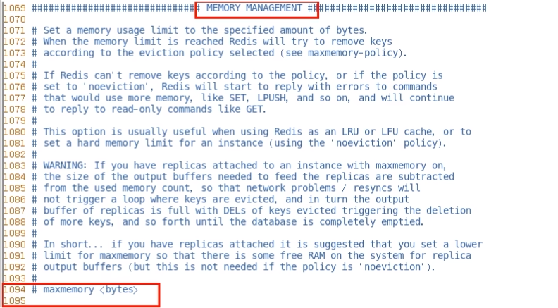
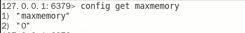
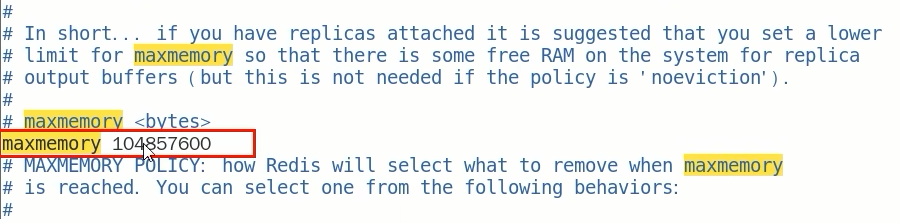
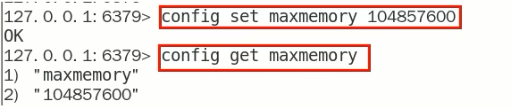
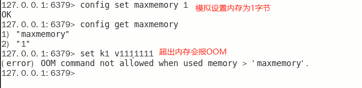
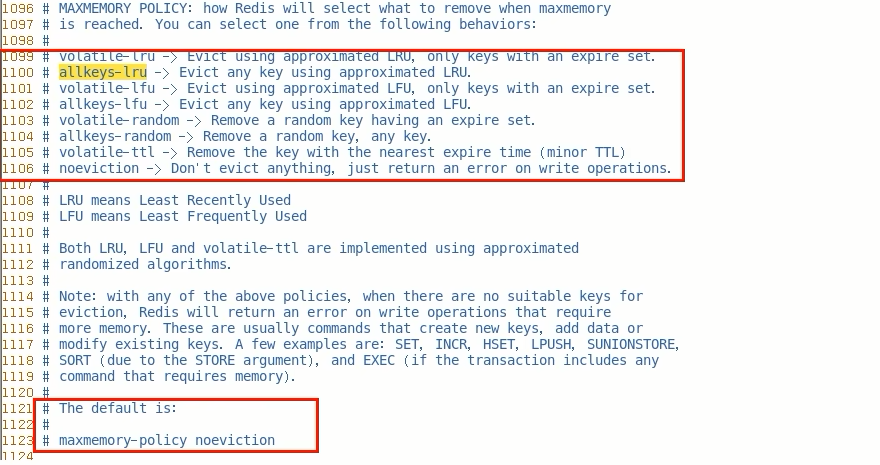
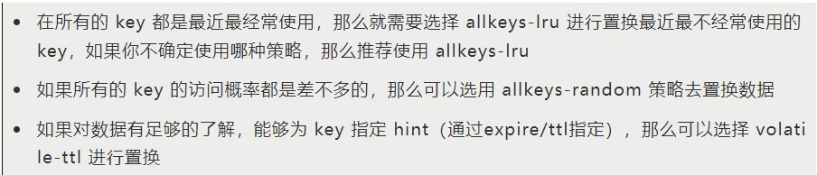

# 第10章-Redis的缓存过期淘汰策略
### 总结

### 生产上你们redis内存设置多少

### 如何配置、修改redis的内存大小

### 如果内存满了怎么办

### redis清理内存的方式？定期删除和惰性删除了解过吗？

### redis缓存淘汰策略有哪些？分别是什么？用过那个？

### redis的LRU了解过吗？请手写LRU

### LRU和LFU算法的区别是什么？

LRU means Least Recently Used 最近最少使用

LFU means Least Frequently Used 最不常用

### redis默认内存是多少？在哪查看？如何设置修改？

- **查看Redis最大占用内存**

  

  打开redis配置文件，设置maxmemory参数，maxmemory是bytes字节类型，注意类型转换。

  通过命令查看默认的内存大小

  

  默认内存大小为0吗？那我们之前的数据是怎么保存进去的？

- **redis默认内存多少可用？**

  如果不设置最大内存或者设置最大内存大小为0，在64位操作系统下不限制内存大小，在32位操作系统下最多使用3GB内存

  注意：在64bit系统下，maxmemory设置为0表示不限制redis内存使用

- **一般生产上你如何配置**

  一般推荐Redis设置内存为最大物理内存的3/4

- **如何修改redis内存设置**

  通过修改文件配置

  

  通过命令修改，但是redis重启后会失效

  

- 什么命令查看redis内存使用情况

  info memory

  config get maxmemory

### 内存打满了，超出了设置的最大值会怎么样？

### 结论

设置了maxmemory的选项，假如redis内存使用达到了上限，没有加上过期时间就会导致数据写满maxmemory，为了避免类似情况，需要使用内存淘汰策略

### redis过期键的删除策略

如果一个键是过期的，那它到了过期时间之后是不是马上就从内存中被删除了呢？

如果不是，那过期后到底什么时候被删除呢？是什么操作？

### redis三种删除策略

1. #### 立即删除/定时删除

   立即删除能保证内存中数据的最大新鲜度，因为它保证过期键值会在过期后马上被删除，其所占用的内存也会随之释放。但是立即删除对cpu是最不友好的。因为删除操作会占用cpu的时间，如果刚好碰上了cpu很忙的时候，比如正在做交集或排序等计算的时候，就会给cpu造成额外的压力，让CPU心累，时时需要删除，忙死。

   这会产生大量的性能消耗，同时也会影响数据的读取操作

   **总结：**对CPU不友好，用处理器性能换取存储空间（拿时间换空间）

2. #### 惰性删除

   数据到达过期时间，不做处理。等下次访问该数据时，如果未过期，返回数据 ;发现已过期，删除，返回不存在。

   惰性删除策略的缺点是，它对内存是最不友好的。

   如果一个键已经过期，而这个键又仍然保留在redis中，那么只要这个过期键不被访问，它所占用的内存就不会释放。在使用惰性删除策略时，如果数据库中有非常多的过期键，而这些过期键又恰好没有被访问到的话，那么它们也许永远也不会被删除(除非用户手动执行FLUSHDB)，我们甚至可以将这种情况看作是一种内存泄漏  - 无用的垃圾数据占用了大量的内存。而服务器却不会自己去释放它们，这对于运行状态非常依赖于内存的Redis服务器来说,肯定不是一个好消息

   **总结：**对内存不友好，用存储空间换取处理器性能（拿空间换时间），开启惰性删除淘汰，lazyfree-lazy-eviction=yes

3. #### 上面两种方案都走极端

   **定期删除**策略是前两种策略的折中：
   定期删除策略每隔一段时间执行一次删除过期键操作并通过限制删除操作执行时长和频率来减少删除操作对CPU时间的影响。

   周期性轮询redis库中的时效性数据，采用随机抽取的策略，利用过期数据占比的方式控制删除频度

   特点1：CPU性能占用设置有峰值，检测频度可自定义设置

   特点2：内存压力不是很大，长期占用内存的冷数据会被持续清理

   总结：周期性抽查存储空间 (随机抽查，重点抽查)
   **举例:**
   redis默认每隔100ms检查是否有过期的key，有过期key则删除。注意: redis不是每隔100ms将所有的key检查一次而是随机抽取进行检查(如果每隔100ms.全部key进行检查，redis直接进去ICU)。因此，如果只采用定期删除策略，会导致很多key到时间没有删除。

   定期删除策略的难点是确定删除操作执行的时长和频率：如果删除操作执行得太频繁或者执行的时间太长，定期删除策略就会退化成立即删除策略，以至于将CPU时间过多地消耗在删除过期键上面。如果删除操作执行得太少，或者执行的时间太短，定期删除策略又会和惰性删除束略一样，出现浪费内存的情况。因此，如果采用定期删除策略的话，服务器必须根据情况，合理地设置删除操作的执行时长和执行频率。

### 上述步骤都过堂了，还有漏洞吗？

1 定期删除时，从来没有被抽查到

2 惰性删除时，也从来没有被点中使用过

上述两个步骤 ======> 大量过期的key堆积在内存中，导致redis内存空间紧张或者很快耗尽
必须要有一个更好的兜底方案......

### redis配置文件

在MEMORY MANAGEMENT中

### LRU和LFU算法的区别是什么

LRU：最近最少使用页面置换算法，淘汰最长时间未被使用的页面，看页面最后一次被使用到发生调度的时间长短，首先淘汰最长时间未被使用的页面。

LFU：最近最不常用页面置换算法，淘汰一定时期内被访问次数最少的页面，看一定时间段内页面被使用的频率，淘汰一定时期内被访问次数最少的页

举个栗子

某次时期Time为10分钟，如果每分钟进行一次调页，主存块为3（即只能保存3个页面），若所需页面走向为2 1 2 1 2 3 4，假设到页面4时会发生缺页中断（装不下导致的缓存淘汰）

若按LRU算法，应换页面1(1页面最久未被使用)，但按LFU算法应换页面3(十分钟内,页面3只使用了一次)

可见LRU关键是看页面最后一次被使用到发生调度的时间长短，而LFU关键是看一定时间段内页面被使用的频率

### 淘汰策略有哪些(Redis7版本)

1. noeviction：不会驱逐任何key，表示即使内存达到上限也不进行置换，所有能引起内存增加的命令都会返回error
2. allkeys-lru：对所有key使用LRU算法进行删除，优先删除掉最近最不经常使用的key，用以保存新数据
3. volatile-lru：对所有设置了过期时间的key使用LRU算法进行删除
4. allkeys-random：对所有key随机删除
5. volatile-random：对所有设置了过期时间的key随机删除
6. volatile-ttl：删除马山要过期的key
7. allkeys-lfu：对所有key使用LFU算法进行删除
8. volatile-lfu：对所有设置了过期时间的key使用LFU算法进行删除

### 对上面淘汰策略的总结

2个维度：过期键中筛选；所有键中筛选

4个方面：LRU	LFU	random	ttl

8个选项

### 淘汰策略怎么选

### 如何配置？如何修改？

- 直接使用config命令
- 直接redis.conf配置文件

### redis缓存淘汰策略配置性能建议

- 避免存储BigKey
- 开启惰性删除，lazyfree-lazy-eviction=yes

