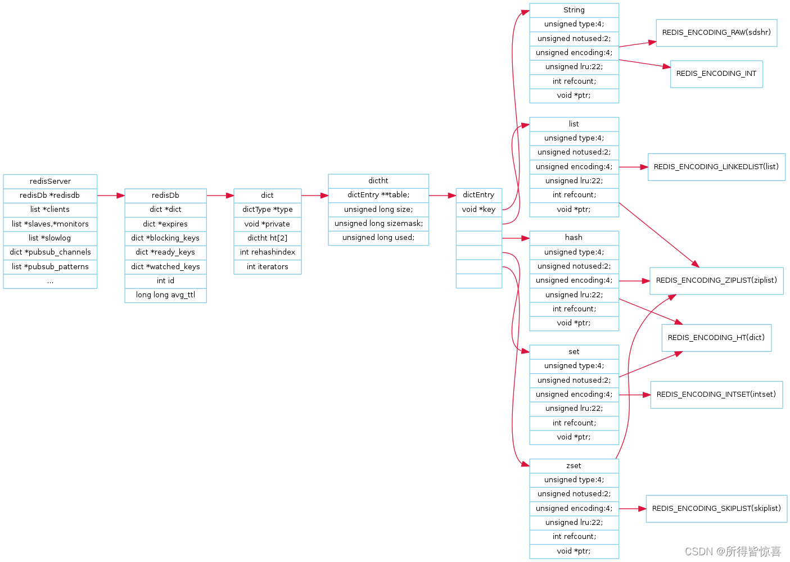
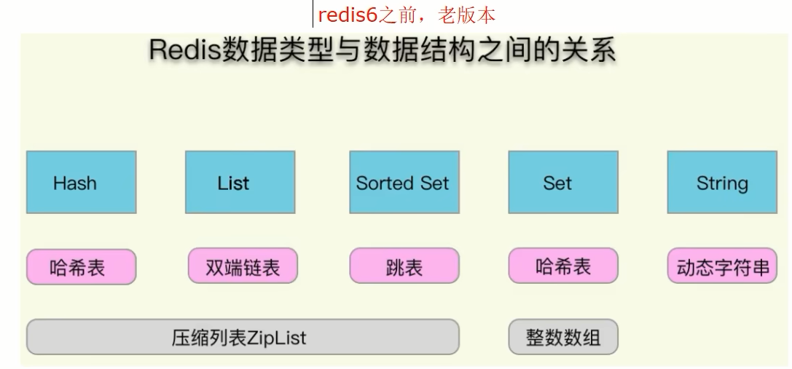
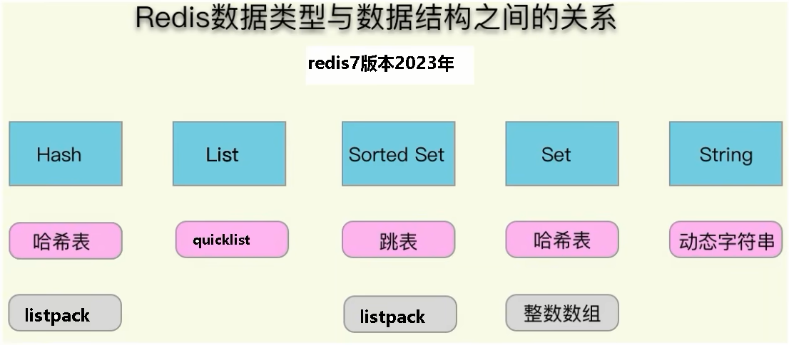
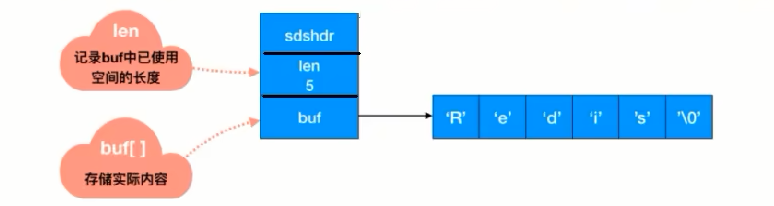
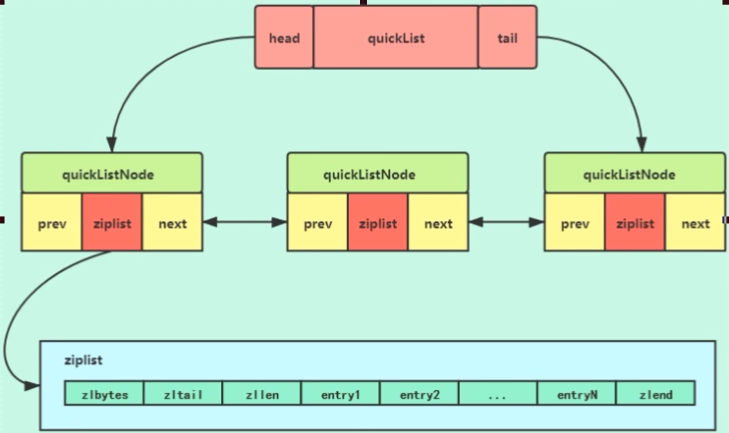

# 第11章-Redis经典五大类型源码及底层实现
### Redis数据类型的底层数据结构

- SDS动态字符串
- 双向链表
- 压缩列表ziplist
- 哈希表Hashtable
- 跳表skiplist
- 整数集合intset
- 快速列表quicklist
- 紧凑列表listpack

### 本章节意义

90%是没有太大意义的，更多的是为了面试

但是如果是大厂，会内部重构redis，比如阿里云redis，美团tair，滴滴kedis等

### Set的两种编码格式

intset

hashtable

Redis用intset或hashtable存储set。如果元素都是整数类型，就用intset存储。

如果不是整数类型，就用hashtable(数组+链表的存来储结构)。key就是元素的值，value为null。

### Redis6

ziplist

skiplist

当有序集合中包含的元素数量超过服务器属性 server.zset_max_ziplist_entries 的值(默认值为 128 )，或者有序集合中新添加元素的 member 的长度大于服务器属性 server.zset_max_ziplist_value 的值(默认值为 64 )时，redis会使用跳跃表作为有序集合的底层实现。
否则会使用ziplist作为有序集合的底层实现

1.png)

2.png)

### Redis7

listpack

skiplist

1.png)
### redis6数据类型对应的底层数据结构

1.字符串

int:8个字节的长整型。
embstr:小于等于44个字节的字符串。
raw:大于44个字节的字符串。
Redis会根据当前值的类型和长度决定使用哪种内部编码实现。

2.哈希
ziplist(压缩列表):当哈希类型元素个数小于hash-max-ziplist-entries 配置(默认512)、同时所有值都小于hash-max-ziplist-value配置(默认64 字节)时，Redis会使用ziplist作为哈希的内部实现，ziplist使用更加紧凑的 结构实现多个元素的连续存储，所以在节省内存方面比hashtable更加优秀。

hashtable(哈希表):当哈希类型无法满足 ziplist的条件时，Redis会 用hashtable为哈希的内部实现。因为此时ziplist的读写效率会下降，而hashtahe的读写时间复度为O(1)。

3.列表
ziplist(压列表):当列表的元素个数小于list-max-ziplist-entries配置 默认512)，同时列表中每元素的值都小于list-max-ziplist-value配置时(默认64字节)Redis会选用ziplist来作为列表的内部实现来减少内存的使用。
inkedlist(链表):当列表类型无法满足ziplist的条件时，Redis会使用 linkedlist作为列表的内部实现。quicklist ziplist和linkedlist的结合以ziplist为节点的链表。

4.集合
intset(需数集合):当集合中的元素都是整数且元素个数小于set-max-ntset-entries置(默认512)时，Redis会用intset来为集合的内部实现，从而减少内存的使用hashtable(哈希表):当集合类型无法满足intset的条件时，Redis会使用hashtable作为集合的内部实现。

5.有序集合
ziplist(压缩列表):当有序集合的元素个数小于zset-max-ziplist- entres配置(默认128)，同时每元素的值都小于et-max-ziplist-value配 置(默认64字节)时Redis会用ziplist来作为有序集合的内部实现，ziplist 可以有效减少内存的使用。skiplist(跳跃表):当ziplist条件不满足时，有序集合会使用skiplist作 为内部实现，因为此时ziplist的读写效率会下降。

### redis6数据类型以及数据结构的关系

### redis7数据类型以及数据结构的关系

### redis数据类型以及数据结构的时间复杂度

### 为什么引出跳表

- 先从一个单链表来说
  对于一个单链表来讲，即便链表中存储的数据是有序的，如果我们要想在其中查找某个数据，也只能从头到尾遍历链表。这样查找效率就会很低，时间复杂度会很高O(N)

  

- 痛点

  

  解决方法：升维，也即空间换时间

- 优化

  

- 案例：画一个包含64个节点的链表，按前面思路，建立五级索引

  

###  是什么

跳表是可以实现二分查找的有序链表

skiplist是一种以空间换取时间的结构。由于链表，无法进行二分查找，因此借鉴数据库索引的思想，提取出链表中关键节点(索引)，先在关键节点上查找，再进入下层链表查找，提取多层关键节点，就形成了跳跃表。

但是，由于索引也要占据一定空间的，所以，索引添加的越多，空间占用的越多

总结来说，跳表=链表+多级索引

### 跳表时间和空间复杂度介绍

1. 跳表的时间复杂度，O(logN)

   跳表查询的时间复杂度分析，如果链表里有N个结点，会有多少级索引呢？

   按照我们前面笔记，两两取首。每两个结点会抽出一个结点作为上一级索引的结点，以此估算:

   第一级索引的结点个数大约就是n/2

   第二级索引的结点个数大约就是n/4.

   第三级索引的结点个数大约就是n/8，依次类推......

   也就是说，第k级索引的结点个数是第k-1级索引的结点个数的1/2，那第k级索引结点的个数就是n/(2^k)

   假设索引有h级，最高级的索引有2个结点。通过上面的公式，

   我们可以得到n/(2^h)=2，从而求得h=log2n-1(log以2为底，n的对数)

   如果包含原始链表这一层，整个跳表的高度就是log2n(log以2为底，n的对数)

   

2. 跳表空间复杂度

   跳表查询的空间复杂度分析

   比起单纯的单链表，跳表需要存储多级索引，肯定要消耗更多的存储空间。那到底需要消耗多少额外的存储空间呢?

   我们来分析一下跳表的空间复杂度。

   第一步：首先原始链表长度为n，

   第二步：两两取首，每层索引的结点数: n/2,n/4,n/8 ...,8,4,2 每上升一级就减少一半，直到剩下2个结点,以此类推，如果我们把每层索引的结点数写出来，就是一个等比数列。

   

   这几级索引的结点总和就是n/2+n/4+/8.+8+4+2=n-2。所以，跳表的空间复杂度是O(n)。也就是说，如果将包含n个结点的单链表构造成跳表，我们需要额外再用接近n个结点的存储空间。

### 优缺点

优点：

跳表是一个最典型的空间换时间解决方案，而且只有在数据量较大的情况下才能体现出来优势。而且应该是读多写少的情况下才能使用，所以它的适用范围应该还是比较有限的

缺点：

维护成本相对要高，
在单链表中，一旦定位好要插入的位置，插入结点的时间复杂度是很低的，就是O(1)but
新增或者删除时需要把所有索引都更新一遍，为了保证原始链表中数据的有序性，我们需要先找到要动作的位置，这个查找操作就会比较耗时最后在新增和删除的过程中的更新，时间复杂度也是o(log n)

# src源码包下面该如何看？

### 源码在哪

\redis-7.0.5\src

https://github.com/redis/redis/tree/7.0/src

### 源码分析思路

工作和面试中需要什么，就看什么

### Redis基本的数据结构(骨架)

- github官网说明

  

  - Redis对象object.c
  - 字符串t_string.c
  - 列表t_list.c
  - 字典t_hash.c
  - 集合及有序集合t_set.c和t_zset.c
  - 数据流t_stream.c：Streams的底层实现结构listpack.c和rax.c；了解即可

- 简单动态字符串sds.c

- 整数集合intset.c

- 压缩列表ziplist.c

- 快速链表quicklist.c

- listpack

- 字典dict.c

### Redis数据库的实现

数据库的底层实现db.c

持久化rdb.c和aof.c

### Redis服务端和客户端实现

事件驱动ae.c和ae_epoll.c

网络连接anet.c和networking.c

服务端程序server.c

客户端程序redis-cli.c

### 其他

主从复制replication.c

哨兵sentinel.c

集群cluster.c

其他数据结构，如hyperLogLog.c、geo.c等

其他功能，如pub/sub、LUA脚本

### 如何实现键值对（Key-Value）数据库的

redis 是 key-value 存储系统，其中key类型一般为字符串，value 类型则为redis对象(redisObject)

图说

### 10大类型说明（粗分）

传统的5大类型

- String
- List
- Hash
- Set
- ZSet

新介绍的5大类型

- bitmap -> 实质String
- HyperLogLog -> 实质String
- GEO -> 实质ZSet
- Stream -> 实质Stream
- bitfield -> 看具体key

上帝视角：

### Redis定义了redisObject结构体来表示string、hash、list、set、zset等数据类型

- C语言struct结构体语法简介

  

  

- Redis中每个对象都是一个redisObject结构

- 字典、KV是什么（重点）

  每个键值对都会有一个dictEntry：

  源码位置：dict.h

  

  重点：从dictEntry到redisObject
  

- redisObject +Redis数据类型+Redis 所有编码方式(底层实现)三者之间的关系

  

  

### 重点：redis数据类型与数据结构总纲图

1. 源码分析总体数据结构大纲

   - SDS动态字符串
   - 双向链表
   - 压缩列表ziplist
   - 哈希表Hashtable
   - 跳表skiplist
   - 整数集合intset
   - 快速列表quicklist
   - 紧凑列表listpack

2. redis6.0.5

   

   string = SDS

   Set = intset + hashtabLe

   ZSet = skiplist + ziplist

   List = quicklist + ziplist

   Hash = hashtable + ziplist

3. 2021.11.29之后，Redis7
   

   string = SDS

   Set = intset + hashtabLe

   ZSet = skiplist + listpack紧凑列表

   List = quicklist

   Hash = hashtable + listpack

### 从set hello world说起

每个键值对都会有一个dictEntry

set hello word为例，因为Redis是KV键值对的数据库，每个键值对都会有一个dictEntry(源码位置:dict.h)，里面指向了key和value的指针,next 指向下一个dictEntry。

key是字符串，但是 Redis没有直接使用C的字符数组，而是存储在redis自定义的SDS中。

value 既不是直接作为字符串存储，也不是直接存储在 SDs中，而是存储在redisobject中。

实际上五种常用的数据类型的任何一种，都是通过 redisobject来存储的。

看看类型：type 键

看看编码：object encoding hello

### redisObject结构的作用

为了便于操作，Redis采用redisObjec结构来统一五种不同的数据类型，这样所有的数据类型就都可以以相同的形式在函数间传递而不用使用特定的类型结构。同时，为了识别不同的数据类型，redisObjec中定义了type和encoding字段对不同的数据类型加以区别。简单地说，redisObjec就是string、hash、list、set、zset的父类，可以在函数间传递时隐藏具体的类型信息，所以作者抽象了redisObjec结构来到达同样的目的。

- redisObject各字段的含义

  

  1 4位的type表示具体的数据类型
  2 4位的encoding表示该类型的物理编码方式见下表，同一种数据类型可能有不同的编码方式。(比如String就提供了3种:int embstr raw)

  

  3 lru字段表示当内存超限时采用LRU算法清除内存中的对象。

  4 refcount表示对象的引用计数。
  5 ptr指针指向真正的底层数据结构的指针。

- 案例

  set age 17

  

  

| type     | leixing                       |
| -------- | ----------------------------- |
| encoding | 编码，本案例是数值类型        |
| lru      | 最近被访问的时间              |
| refcount | 等于1，表示当前对象引用的次数 |
| ptr      | value值是多少，当前就是17     |

### 各个类型的数据结构的编码映射和定义

### Debug Object key 

- 命令：debug object key

  

  开启前：

  

  开启后：

  

  

  Value at：内存地址
  refcount：引用次数
  encoding：物理编码类型
  serializedlength：序列化后的长度（注意这里的长度是序列化后的长度，保存为rdb文件时使用了该算法，不是真正存储在内存的大小)，会对字串做一些可能的压缩以便底层优化
  lru：记录最近使用时间戳
  lru_seconds_idle：空闲时间（每get一次，最近使用时间戳和空闲时间都会刷新）

### 3大物理编码格式

**RedisObject内部对应三大物理编码**

1. 整数 int

   - 保存long 型（长整型）的64位（8个字节）有符号整数

     

   - 上面数字最多19位

   - 只有整数才会使用int，如果是浮点数，Redis内部其实先将浮点数转化为字符串值，然后再保存。

2. 嵌入式 embstr

   代表embstr格式的SDS(Simple Dynamic String简单动态字符串)，保存长度小于44字节的字符串

   EMBSTR顾名思义即：embedded string，表示嵌入式的String

3. 未加工数据 raw

   保存长度大于44字节的字符串

### 3大物理编码案例

- 案例演示

  

- C语言中字符串的展现

  

  Redis没有直接复用C语言的字符串，而是新建了属于自己的结构-----SDS
  在Redis数据库里，包含字符串值的键值对都是由SDS实现的(Redis中所有的键都是由字符串对象实现的即底层是由SDS实现，Redis中所有的值对象中包含的字符串对象底层也是由SDS实现)。

  

- SDS简单动态字符串

  - sds.h源码分析

    

  - 说明

    

    Redis中字符串的实现,SDS有多种结构( sds.h) :
    sdshdr5、(2^5=32byte)，但是不会使用，是redis团队内部测试使用
    sdshdr8、(2^8=256byte)
    sdshdr16、(2^16=65536byte=64KB)
    sdshdr32、(2 ^32byte=4GB)
    sdshdr64，2的64次方byte=17179869184G用于存储不同的长度的字符串。

    len表示SDS的长度，使我们在获取字符串长度的时候可以在o(1)情况下拿到，而不是像C那样需要遍历一遍字符串。

    alloc可以用来计算 free就是字符串已经分配的未使用的空间，有了这个值就可以引入预分配空间的算法了，而不用去考虑内存分配的问题。

    buf表示字符串数组，真实存数据的。

  - 官网

- Redis为什么要重新设计一个SDS数据结构？

  

  |                | C语言                                                        | SDS                                                          |
  | -------------- | ------------------------------------------------------------ | ------------------------------------------------------------ |
  | 字符串长度处理 | 需要从头开始遍历,直到遇到'\O'为止，时间复杂度O(N)            | 记录当前字符串的长度，直接读取即可，时间复杂度O(1)           |
  | 内存重新分配   | 分配内存空间超过后，会导致数组下标越级或者内存分配溢出       | 空间预分配 SDS修改后，len长度小于1M，那么将会额外分配与 len相同长度的未使用空间。如果修改后长度大于1M，那么将分配1M的使用空间。 惰性空间释放 有空间分配对应的就有空间释放。SDS缩短时并不会回收多余的内存空间,而是使用free字段将多出来的空间记录下来。如果后续有变更操作，直接使用free中记录的空间，减少了内存的分配。 |
  | 二进制安全     | 二进制数据并不是规则的字符串格式，可能会包含一些特殊的字符，比如 '\0'等。前面提到过，C中字符串遇到'\0'会结束,那'\0'之后的数据就读取不上了 | 根据len长度来判断字符串结束的，二进制安全的问题就解决了      |

- 源码分析

  用户API

  set k1 v1 底层发生了什么？调用关系？

  

  3大物理编码方式

  

  INT编码格式

  命令示例: set k1 123

  当字符串键值的内容可以用一个64位有符号整形来表示时，Redis会将键值转化为long型来进行存储，此时即对应 OB_ENCODING_INT 编码类型。内部的内存结构表示如下:

  

  EMBSTR编码格式

  

  对于长度小于 44的字符串，Redis 对键值采用OBJ_ENCODING_EMBSTR 方式，EMBSTR 顾名思义即: embedded string，表示嵌入式的String。从内存结构上来讲 即字符串 sds结构体与其对应的 redisObject 对象分配在同一块连续的内存空间，字符串sds嵌入在redisObiect对象之中一样。

- RAW编码格式

  当字符串的键值为长度大于44的超长字符串时，Redis 则会将键值的内部编码方式改为OBJ_ENCODING_RAW格式，这与OBJ_ENCODING_EMBSTR编码方式的不同之处在于，此时动态字符sds的内存与其依赖的redisobiect的内存不再连续了

- 明明没有超过阈值，为什么变成raw了

  

### 案例结论

只有整数才会使用int,如果是浮点数, Redis内部其实先将浮点数转化为字符串值,然后再保存

embstr与raw类型底层的数据结构其实都是SDS(简单动态字符串，Redis内部定义sdshdr一种结构)

| int    | Long类型整数时，RedisObiect中的ptr指针直接赋值为整数数据，不再额外的指针再指向整数了，节省了指针的空间开销。 |
| ------ | ------------------------------------------------------------ |
| embstr | 当保存的是字符串数据且字符串小于等于44字节时，emstr类型将会调用内存分配函数，只分配一块连续的内存空间，空间中依次包含 redisObject 与 sdshdr 两个数据结构，让元数据、指针和SDS是一块连续的内存区域，这样就可以避免内存碎片 |
| raw    | 当字符串大于44字节时，SDS的数据量变多变大了，SDS和RedisObject布局分家各自过，会给SDS分配多的空间并用指针指SDS结构，raw 类型将会调用两次内存分配函数，分配两块内存空间，一块用于包含 redisObject结构，而另一块用于包含sdshdr 结构 |

### Hash的两种编码格式

Redis6以前：ziplist、Hashtable

Redis7：listpack、Hashtable

## Redis6

hash-max-ziplist-entries：使用压缩列表保存时哈希集合中的最大元素个数。

hash-max-ziplist-value：使用压缩列表保存时哈希集合中单个元素的最人长度。

Hash类型键的字段个数 小于 hash-max-ziplist-entries 并且每个字段名和字段值的长度 小于 hash-max-ziplist-value 时，Redis才会使用 OBJ_ENCODING_ZIPLIST来存该键，前述条件任意一个不满足则会转换为 OBJ_ENCODING_HT的编码方式

.png)

.png)

### 结论

1. 哈希对象保存的键值对数量小于 512个；
2. 所有的键值对的健和值的字符串长度都小于等于 64byte (一个英文字母一个字节)时用ziplist，反之用hashtable；
3. ziplist升级到hashtable可以，反过来降级不可以；即一旦从压缩列表转为了哈希表，Hash类型就会一直用哈希表进行保存而不会再转回压缩列表了。在节省内存空间方面哈希表就没有压缩列表高效了。

## Redis7

hash-max-listpack-entries：使用压缩列表保存时哈希集合中的最大元素个数。

hash-max-listpack-value：使用压缩列表保存时哈希集合中单个元素的最人长度。

Hash类型键的字段个数 小于  hash-max-listpack-entries且每个字段名和字段值的长度 小于  hash-max-listpack-value 时，Redis才会使用OBJ_ENCODING_LISTPACK来存储该键，前述条件任意一个不满足则会转换为 OBI_ENCODING_HT的编码方式

.png)

.png)

.png)

### 结论

1. 哈希对象保存的键值对数量小于 512个；
2. 所有的键值对的健和值的字符串长度都小于等于 64byte (一个英文字母一个字节时用listpack，反之用hashtable
3. listpack升级到Hashtable可以，反过来降级不可以

## Redis6

(1) ziplist压缩配置: list-compress-depth 0

表示一个quicklist两端不被压缩的节点个数。这里的节点是指quicklist双向链表的节点，而不是指ziplist里面的数据项个数参数list-compress-depth的取值含义如下:
0：是个特殊值，表示都不压缩。这是Redis的默认值。
1：表示quicklist两端各有1个节点不压缩，中间的节点压缩
2：表示quicklist两端各有2个节点不压缩，中间的节点压缩

以此类推... ...

(2) ziplist中entry配置：list-max-ziplist-size   -2

当取正值的时候，表示按照数据项个数来限定每个quicklist节点上的ziplist长度。比如，当这个参数配置成5的时候，表示每个quicklist节点的ziplist最多包含5个数据项。当取负值的时候，表示按照占用字节数来限定每个quicklist节点上的ziplist长度。这时，它只能取-1到-5这五个值，每个值含义如下：

-5：每个quicklist节点上的zlplist大小不能超过64 Kb。(注;：1kb => 1024 bytes)

-4：每个quicklist节点上的ziplist大小不能超过32 Kb。

-3：每个qulcklist节点上的zlplist大小不能超过16 Kb。

-2：每个quicklist节点上的ziplist大小不能超过8 Kb。(-2是Redis给出的默认值)

-1：每个quicklist节点上的ziplist大小不能超过4 Kb。

quicklist 实际上是 zipList 和 linkedList 的混合体，它将 linkedList按段切分，每一段使用 zipList 来紧凑存储，多个 zipList 之间使用双向指针串接起来。

## Redis7

.png)

listpack紧凑列表

是用来替代 ziplist 的新数据结构，在 7.0 版本已经没有 ziplist 的配置了(6.0版本仅部分数据类型作为过渡阶段在使用)

