# 第2章-BigKey
# 面试题

阿里广告平台，海量数据里查询某一个固定前缀的key


小红书，你如何生产上限制 keys* /flushdb/flushall等危险命令以防止阻塞或误删数据？


美团，memory usage命令你用过吗？


BigKey问题，多大算big？你如何发现？如何删除？如何处理？


BigKey你做过调优吗？惰性释放lazyfree了解过吗？


morekey问题，生产上redis数据库有1000W记录，你如何遍历数据？ keys *可以吗？

# MoreKey案例

- 大批量往redis里面插入2000W测试数据key

  Linux Bash下面执行，插入100W数据

  ​	生成100W条redis批量设置kv的语句(key=kn,value=vn)写入到/tmp目录下的redisTest.txt文件中

  ```	shell
  	for((i=1;i<=100*10000;i++)); do echo "set ksi v$i" >> /tmp/redisTest.txt ;done;
  ```

  ​	通过redis提供的管道-pipe命令插入100W大批量数据

  ```shell
  	cat /tmp/redisTest.txt | /opt/redis-7.0.0/src/redis-cli -h 127.0.0.1 -p 6379-a 111111 --pipe
  ```

  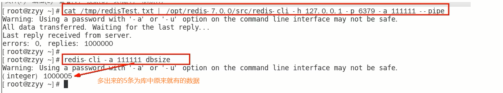

- 某快递巨头真实生产案例新闻

  - 新闻

    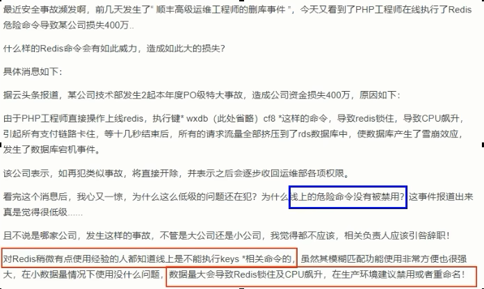

  - keys * 试试100W花费多少秒遍历查询

    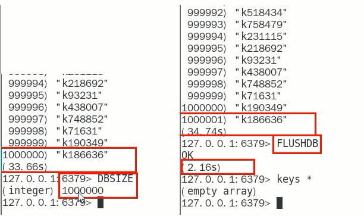

    <font color = blue>keys * 这个指令有致命的弊端，在实际环境中最好不要使用</font>

    ```tex
    这个指令没有offset、limit 参数，是要一次性吐出所有满足条件的key，由于redis,是单线程的，其所有操作都是原子的，而keys算法是遍历算法，复杂度是O(n)，如果实例中有千万级以上的 key，这个指令就会导致Redis服务卡顿，所有读写Redis 的其它的指令都会被延后甚至会超时报错，可能会引起缓存雪崩甚至数据库宕机。
    ```

  - <font color = red>生产上限制 keys * /flushdb/flushall等危险命令以防止误删误用？</font>

    通过配置设置禁用这些命令，redis.conf在SECURITY这一项中

    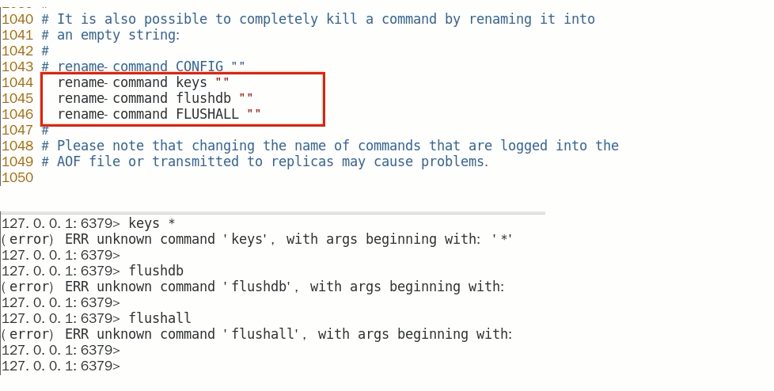

- 不用keys *避免卡顿，那该用什么

  Scan命令登场

  - https://redis.io/commands/scan/

  - https://redis.com.cn/commands/scan.html

  - 一句话，类似MySQL limit，**但是不完全相同**

    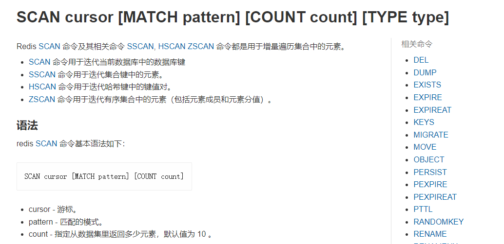

  Scan命令用于迭代数据库中的数据库键

  - 语法

    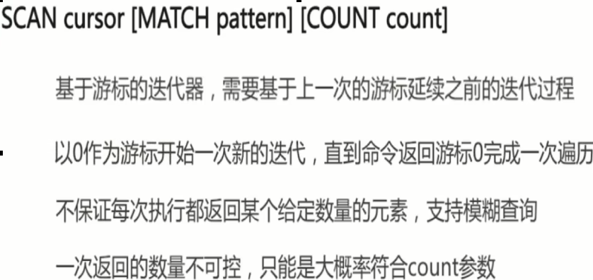

  - 特点

    SCAN命令是一个基于游标的迭代器，每次被调用之后，都会向用户返回一个新的游标，<font color = red>用户在下次迭代时需要使用这个新游标作为SCAN命令的游标参数</font>，以此来延续之前的迭代过程。
    SCAN返回一个包含<font color = blue>两个元素的数组</font>，

    第一个元素是用于进行下一次迭代的新游标，
    第二个元素则是一个数组，这个数组中包含了所有被迭代的元素。<font color = red>如果新游标返回零表示迭代已结束。</font>
    SCAN的遍历顺序
    <font color = red>非常特别，它不是从第一维数组的第零位一直遍历到末尾，而是采用了高位进位加法来遍历。之所以使用这样特殊的方式进行遍历，是考虑到字典的扩容和缩容时避免槽位的遍历重复和遗漏。</font>

    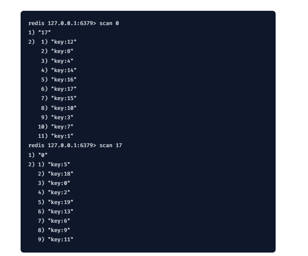

  - 使用

    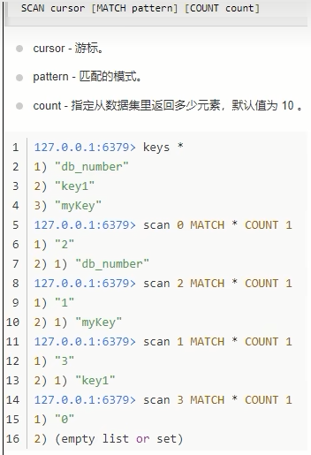


# 多大算BigKey

通常我们说的BigKey，不是在值的Key很大，而是指的Key对应的value很大

### 参考《阿里云Redis开发规范》

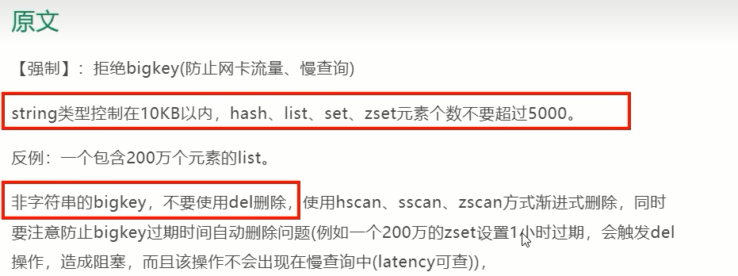

### string和二级结构

- string是value，最大512MB但是≥10KB就是bigkey

- list、hash、set和zset，value个数超过5000就是bigkey

  list：一个列表最多可以包含2^32-1个元素(4294967295，每个列表超过40亿个元素)。

  hash：Redis中每个hash可以存储2^32-1个键值对(40多亿)

  set：集合中最大的成员数为2^32-1(4294967295，每个集合可存储40多亿个成员)


# Bigkey危害、产生与发现

### bigkey的危害

内存不均，集群迁移困难

超时删除，大key删除作梗

网络流量阻塞

### 如何产生

- 社交类

  明星粉丝列表，典型案例粉丝逐步递增

- 汇总统计

  某个报表，日月年经年累计

### 如何发现

- redis-cli --bigkey

  <font color = blue>好处，见最下面总结</font>
  给出每种数据结构Top 1 bigkey。同时给出每种数据类型的键值个数＋平均大小

  <font color = blue>不足</font>
  想查询大于10kb的所有key，--bigkeys参数就无能为力了，<font color = red>需要用到memory usage来计算每个键值的字节数</font>

  <font color = red>redis-cli --bigkeys -a 111111</font>
  <font color = red>redis-cli -h 127.0.0.1 -p 6379 -a 111111 --bigkeys</font>

  ```java
  加上 -i 参数，每隔100 条 scan指令就会休眠0.1s.ops就不会剧烈抬升，但是扫描的时间会变长
  redis-cli -h 127.0.0.1 -p 7001 --bigkeys -i 0.1
  ```

  

- memory usage 键

  英文官网：https://redis.io/commands/memory-usage/

  中文官网：https://redis.io/commands/memory-usage/

  计算每个键值的字节数

  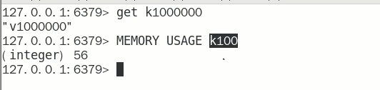


# 大key如何删除

### 参考《阿里云Redis开发规范》

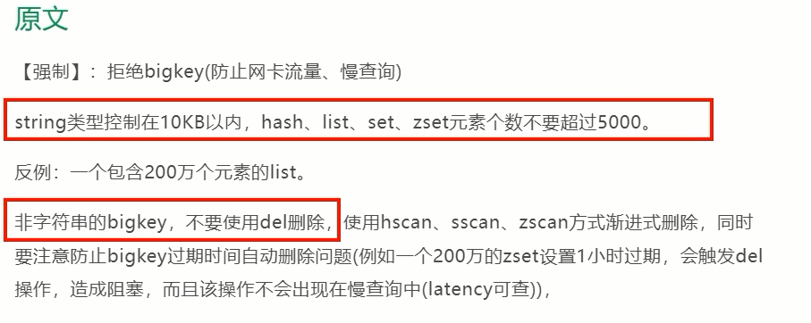

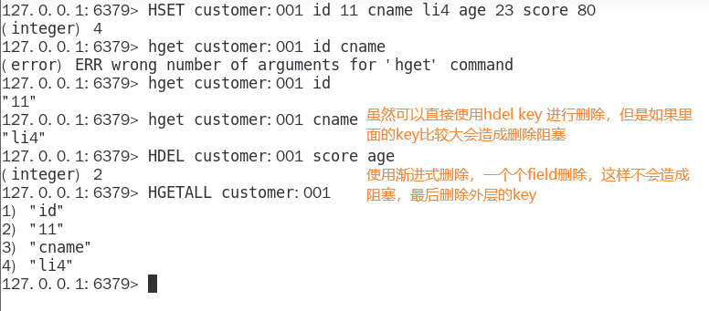

### scan官网说明

- https://redis.io/commands/scan/
- https://redis.com.cn/commands/scan.html

### 普通命令

- String

  一般用del，如果过于庞大使用unlink key 删除

- hash

  - 使用hscan每次获取少量field-value，再使用hdel删除每个field

  - 命令

    

  - 阿里手册

    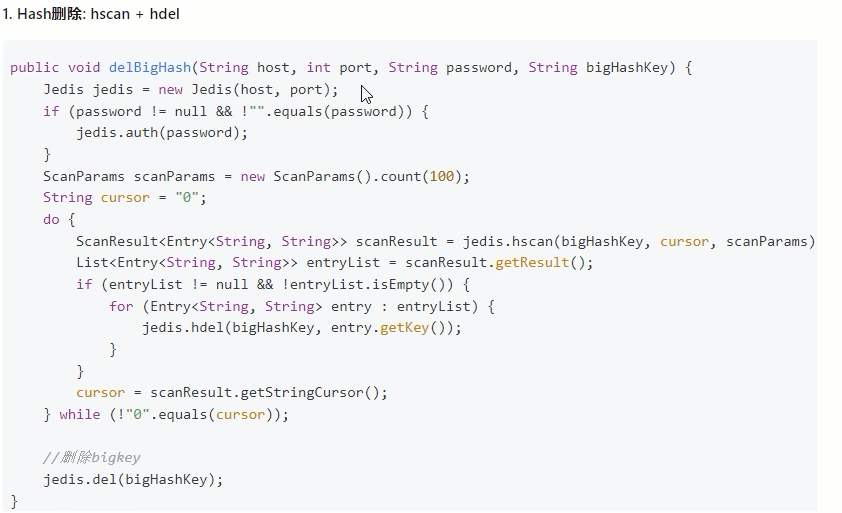

- list

  - 使用ltrim渐进式逐步删除，直到全部删除完成

  - 命令

    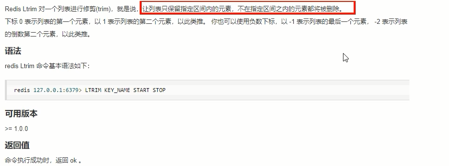

    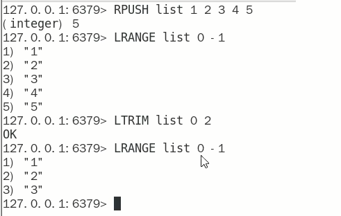

  - 阿里手册

    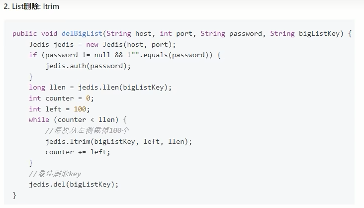

- set

  - 使用sscan每次获取部分元素，在使用srem命令删除每个元素

  - 命令

    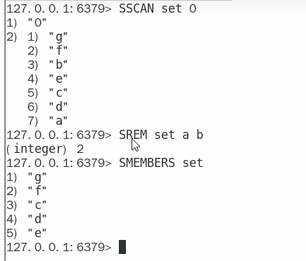

  - 阿里手册

    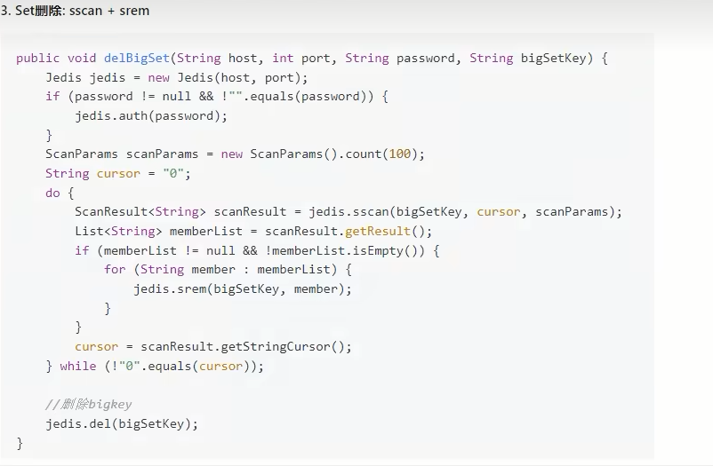

- zset

  - 使用zscan每次获取部分元素，在使用zremrangebyrank命令删除每个元素

  - 命令

    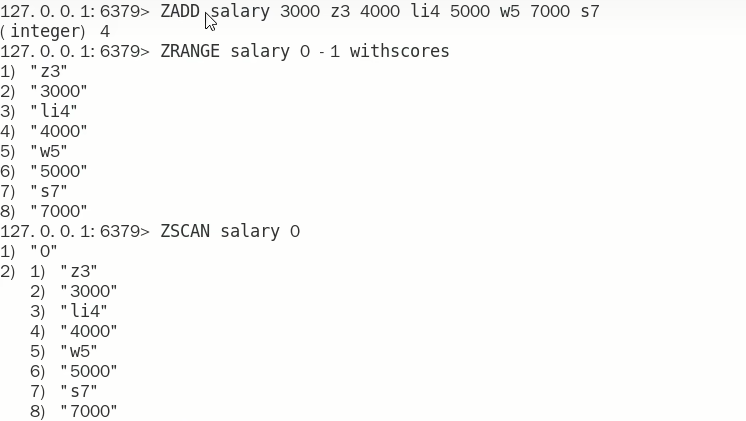

    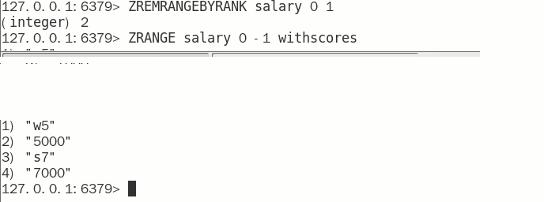

  - 阿里手册

    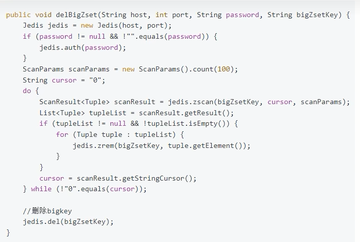

    

# BigKey生产调优

1. redis.conf配置文件 LAZY FREEING相关说明

   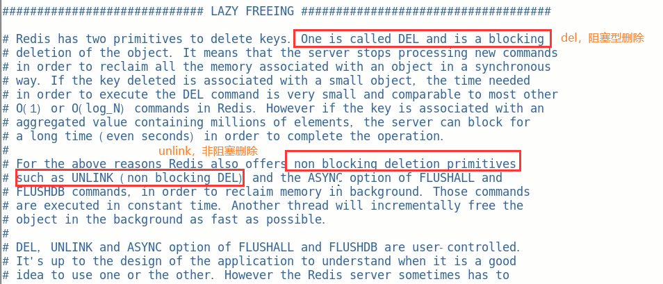

2. 阻塞和非阻塞删除命令

   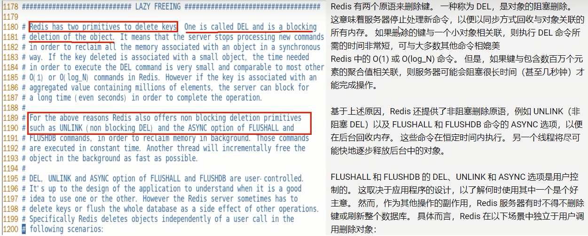

3. 优化配置

   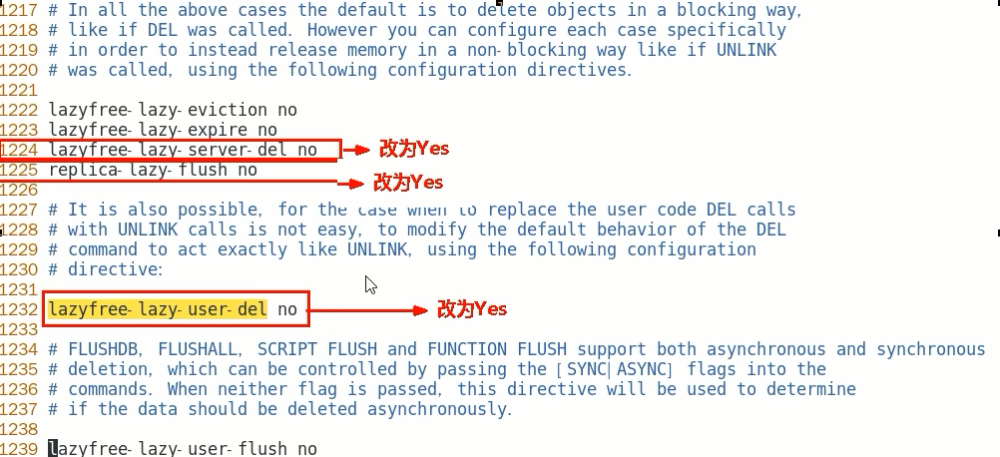


