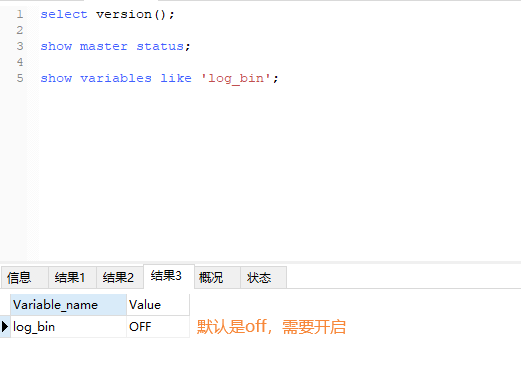
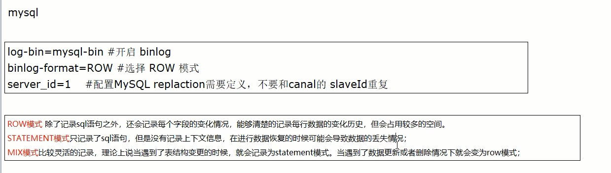

# 第4章-Redis和MySQL数据双写一致性工程落地案例
# 复习+面试


# canal介绍

### 是什么

官网地址：https://github.com/alibaba/canal/wiki

canal [ka'nael]，中文翻译为水道/管道/沟渠/运河，主要用途是于MySQL数据库增量日志数据的订阅、消费和解析，是阿里巴巴开发并开源的，采用Java语言开发;

历史背景是早期阿里巴巴因为杭州和美国双机房部署，存在跨机房数据同步的业务需求，实现方式主要是基于业务trigger (触发器)获取增量变更。从2010年开始，阿里巴巴逐步尝试采用解析数据库日志获取增量变更进行同步，由此衍生出了canal项目;

### 能干嘛

基于日志增量订阅和消费的业务包括

- 数据库镜像
- 数据库实时备份
- 索引构建和实时维护(拆分异构索引、倒排索引等)
- 业务 cache 刷新
- 带业务逻辑的增量数据处理

### 去哪下

下载地址：https://github.com/alibaba/canal/releases/tag/canal-1.1.6


### 工作原理，面试回答

- 传统的MySQL主从复制工作原理


MySQL的主从复制将经过如下步骤:
1、当master主服务器上的数据发生改变时，则将其改变写入二进制事件日志文件中；
2、salve 从服务器会在一定时间间隔内对master主服务器上的二进制日志进行探测，探测其是否发生过改变；
如果探测到master主服务器的二进制事件日志发生了改变,则开始一个I/O Thread请求master二进制事件日志；
3、同时master主服务器为每个I/0 Thread启动一个dump Thread, 用于向其发送二进制事件日志；
4、slave 从服务器将接收到的二进制事件日志保存至自己本地的中继日志文件中；
5、salve 从服务器将启动SQL Thread从中继日志中读取二进制日志，在本地重放，使得其数据和主服务器保持一致；
6、后I/O Thread和SQL Thread将进入睡眠状态，等待下一次被唤醒。

- canal工作原理


工作原理

- canal 模拟MySQL slave的交互协议，伪装自己为MySQL slave，向MySQL master发送dump协议
- MySQL master收到dump请求，开始推送binary log给slave (即canal )canal 解析binary log对象(原始为byte流)


# 双写一致性-MySQL

### Java案例，来源出处

https://github.com/alibaba/canal/wiki/ClientExample

- 查看MySQL版本

  select version(); // 5.7.17

- 当前的主机二进制日志

  show master status;

- 查看 show variables like 'log_bin';

  默认未开启

- 开启MySQL的binlog写入功能

  修改配置文件，win环境下修改my.ini文件

  ```ini
  log-bin=mysql-bin
  binlog-format=Row
  server_id=1
  ```

  

- 重启MySQL

- 再次查看 show variables like 'log_bin';

  

- 授权canal链接MySQL账号

  - MySQL默认的用户在MySQL库的user表里面

    

  - 默认没有canal账户，此处新建+授权

    ```sql
    DROP USER IF EXISTS 'canal'@'%' ;
    CREATE USER 'canal'@'%' IDENTIFIED BY 'canal' ;
    GRANT ALL PRIVILEGES ON *.* TO 'canal'@'%' IDENTIFIED BY 'canal' ;
    FLUSH PRIVILEGES;
    SELECT * FROM mysql .user;
    ```

    


# canal服务端

### 下载

官网地址：https://github.com/alibaba/canal/releases/tag/canal-1.1.6


### 解压

解压后整体放入到/mycanal路径下

### 配置

修改 /mycanal/conf/example路径下instance.properties文件

<font color = 'red'>换成自己的MySQL主机master的IP地址</font>


换成自己的在MySQL新建的canal账户


### 启动

在/mycanal/bin路径下执行 -> ./startup.sh

### 查看

判断canal是否启动成功

- 查看server日志

  

- 查看样例 example的日志

  


# 双写一致性 coding-canal客户端(Java编写业务程序)

### SQL脚本

选中一个库，执行下面建表语句

```sql
CREATE TABLE `t_user`(
`id` bigint(20)NOT NULL AUTO_INCREMENT,
`userName` varchar(100)NOT NULL,
PRIMARY KEY (`id`)
)ENGINE=InnoDB AUTO_INCREMENT=10 DEFAULT CHARSET=utf8mb4
```

## 建module

### 改POM

```xml
<?xml version="1.0" encoding="UTF-8"?>
<project xmlns="http://maven.apache.org/POM/4.0.0" xmlns:xsi="http://www.w3.org/2001/XMLSchema-instance"
         xsi:schemaLocation="http://maven.apache.org/POM/4.0.0 https://maven.apache.org/xsd/maven-4.0.0.xsd">
    <modelVersion>4.0.0</modelVersion>
    <parent>
        <groupId>org.springframework.boot</groupId>
        <artifactId>spring-boot-starter-parent</artifactId>
        <version>2.5.14</version>
        <relativePath/> <!-- lookup parent from repository -->
    </parent>
    <groupId>com.luojia</groupId>
    <artifactId>canaldemo</artifactId>
    <version>0.0.1-SNAPSHOT</version>
    <name>canaldemo</name>
    <description>Demo project for Spring Boot</description>
    <properties>
        <project.build.sourceEncoding>UTF-8</project.build.sourceEncoding>
        <maven.compiler.source>1.8</maven.compiler.source>
        <maven.compiler.target>1.8</maven.compiler.target>
        <junit.version>4.12</junit.version>
        <log4j.version>1.2.17</log4j.version>
        <lombok.version>1.16.18</lombok.version>
        <mysql.version>5.1.47</mysql.version>
        <druid.version>1.1.16</druid.version>
        <mapper.version>4.1.5</mapper.version>
        <mybatis.spring.boot.version>1.3.0</mybatis.spring.boot.version>
    </properties>

    <dependencies>
        <!-- canal -->
        <dependency>
            <groupId>com.alibaba.otter</groupId>
            <artifactId>canal.client</artifactId>
            <version>1.1.0</version>
        </dependency>
        <!--SpringBoot 通用依赖模块-->
        <dependency>
            <groupId>org.springframework.boot</groupId>
            <artifactId>spring-boot-starter-web</artifactId>
        </dependency>
        <dependency>
            <groupId>org.springframework.boot</groupId>
            <artifactId>spring-boot-starter-actuator</artifactId>
        </dependency>
        <dependency>
            <groupId>org.springframework.boot</groupId>
            <artifactId>spring-boot-starter-data-redis</artifactId>
        </dependency>
        <dependency>
            <groupId>org.apache.commons</groupId>
            <artifactId>commons-pool2</artifactId>
        </dependency>
        <!-- springboot 与 AOP -->
        <dependency>
            <groupId>org.springframework.boot</groupId>
            <artifactId>spring-boot-starter-aop</artifactId>
        </dependency>
        <dependency>
            <groupId>org.aspectj</groupId>
            <artifactId>aspectjweaver</artifactId>
        </dependency>
        <!-- Mysql 数据库驱动 -->
        <dependency>
            <groupId>mysql</groupId>
            <artifactId>mysql-connector-java</artifactId>
            <version>${mysql.version}</version>
        </dependency>
        <!-- springboot集成druid连接池-->
        <dependency>
            <groupId>com.alibaba</groupId>
            <artifactId>druid-spring-boot-starter</artifactId>
            <version>1.1.10</version>
        </dependency>
        <dependency>
            <groupId>com.alibaba</groupId>
            <artifactId>druid</artifactId>
            <version>${druid.version}</version>
        </dependency>
        <!-- mybatis和SpringBoot整合 -->
        <dependency>
            <groupId>org.mybatis.spring.boot</groupId>
            <artifactId>mybatis-spring-boot-starter</artifactId>
            <version>${mybatis.spring.boot.version}</version>
        </dependency>
        <!-- persistence -->
        <dependency>
            <groupId>javax.persistence</groupId>
            <artifactId>persistence-api</artifactId>
            <version>1.0.2</version>
        </dependency>
        <!-- 通过Mapper -->
        <dependency>
            <groupId>tk.mybatis</groupId>
            <artifactId>mapper</artifactId>
            <version>${mapper.version}</version>
        </dependency>
        <dependency>
            <groupId>org.springframework.boot</groupId>
            <artifactId>spring-boot-autoconfigure</artifactId>
        </dependency>
        <!-- jedis -->
        <dependency>
            <groupId>redis.clients</groupId>
            <artifactId>jedis</artifactId>
            <version>3.8.0</version>
        </dependency>
<!--        &lt;!&ndash; lettuce &ndash;&gt;-->
<!--        <dependency>-->
<!--            <groupId>io.lettuce</groupId>-->
<!--            <artifactId>lettuce-core</artifactId>-->
<!--            <version>6.2.1.RELEASE</version>-->
<!--        </dependency>-->

        <!-- SpringBoot 与Redis整合依赖 -->
        <dependency>
            <groupId>org.springframework.boot</groupId>
            <artifactId>spring-boot-starter-data-redis</artifactId>
        </dependency>
        <dependency>
            <groupId>org.apache.commons</groupId>
            <artifactId>commons-pool2</artifactId>
        </dependency>
        <!-- swagger2 -->
        <dependency>
            <groupId>io.springfox</groupId>
            <artifactId>springfox-swagger2</artifactId>
            <version>2.9.2</version>
        </dependency>
        <dependency>
            <groupId>io.springfox</groupId>
            <artifactId>springfox-swagger-ui</artifactId>
            <version>2.9.2</version>
        </dependency>

        <!-- 通用基础配置 -->
        <dependency>
            <groupId>cn.hutool</groupId>
            <artifactId>hutool-all</artifactId>
            <version>5.2.3</version>
        </dependency>
        <dependency>
            <groupId>junit</groupId>
            <artifactId>junit</artifactId>
            <version>${junit.version}</version>
        </dependency>
        <dependency>
            <groupId>log4j</groupId>
            <artifactId>log4j</artifactId>
            <version>${log4j.version}</version>
        </dependency>
        <dependency>
            <groupId>org.slf4j</groupId>
            <artifactId>slf4j-api</artifactId>
            <version>1.7.26</version>
        </dependency>
        <dependency>
            <groupId>org.slf4j</groupId>
            <artifactId>slf4j-log4j12</artifactId>
            <version>1.7.26</version>
        </dependency>
        <dependency>
            <groupId>org.projectlombok</groupId>
            <artifactId>lombok</artifactId>
            <version>${lombok.version}</version>
        </dependency>

        <dependency>
            <groupId>org.springframework.boot</groupId>
            <artifactId>spring-boot-starter-test</artifactId>
            <scope>test</scope>
        </dependency>
    </dependencies>

    <build>
        <plugins>
            <plugin>
                <groupId>org.springframework.boot</groupId>
                <artifactId>spring-boot-maven-plugin</artifactId>
                <configuration>
                    <excludes>
                        <exclude>
                            <groupId>org.projectlombok</groupId>
                            <artifactId>lombok</artifactId>
                        </exclude>
                    </excludes>
                </configuration>
            </plugin>
        </plugins>
    </build>
</project>
```

### 写YML

```yaml
server.port=8000

# ====================== alibaba.druid ======================
spring.datasource.type=com.alibaba.druid.pool.DruidDataSource
spring.datasource.driver-class-name=com.mysql.jdbc.Driver
spring.datasource.url=jdbc:mysql://127.0.0.1:3306/jmall?useUnicode=true&characterEncoding=utf-8&useSSL=true&serverTimezone=UTC
spring.datasource.username=root
spring.datasource.password=root
spring.datasource.druid.test-while-idle=fasle

```

### 业务类

RedisUtils

```java
package com.luojia.canaldemo.utils;

import redis.clients.jedis.Jedis;
import redis.clients.jedis.JedisPool;
import redis.clients.jedis.JedisPoolConfig;

public class RedisUtils {

    public static final String REDIS_IP_ADDR = "127.0.0.1";

    public static final String REDIS_PWD = "123456";

    public static JedisPool jedisPool;

    static {
        JedisPoolConfig jedisPoolConfig = new JedisPoolConfig();
        jedisPoolConfig.setMaxTotal(20);
        jedisPoolConfig.setMaxIdle(10);
        jedisPool = new JedisPool(jedisPoolConfig, REDIS_IP_ADDR, 6379, 10000, REDIS_PWD);
    }

    public static Jedis getJedis() throws Exception {
        if (null != jedisPool) {
            return jedisPool.getResource();
        }
        throw new Exception("Jedispoll is not ok");
    }
}
```

RedisCanalClientExample

```java
package com.luojia.canaldemo.biz;


import com.alibaba.fastjson.JSONObject;
import com.alibaba.otter.canal.client.CanalConnector;
import com.alibaba.otter.canal.client.CanalConnectors;
import com.alibaba.otter.canal.common.utils.AddressUtils;
import com.alibaba.otter.canal.protocol.CanalEntry.*;
import com.alibaba.otter.canal.protocol.Message;
import com.luojia.canaldemo.utils.RedisUtils;
import io.lettuce.core.RedisClient;
import redis.clients.jedis.Jedis;

import java.net.InetSocketAddress;
import java.util.List;
import java.util.UUID;

public class RedisCanalClientExample {

    public static final Integer _60SECONDS = 60;
    public static final String REDIS_IP_ADDR = "127.0.0.1";

    public static void redisInsert(List<Column> columns) {

        JSONObject jsonObject = new JSONObject();
        for (Column column : columns) {
            System.out.println(column.getName() + ": " + column.getValue() + " insert = " + column.getUpdated());
            jsonObject.put(column.getName(), column.getValue());
        }

        if (columns.size() > 0) {
            try (Jedis jedis = RedisUtils.getJedis()) {
                jedis.set(columns.get(0).getValue(), jsonObject.toJSONString());
            } catch (Exception e) {
                e.printStackTrace();
            }
        }
    }

    public static void redisDelete(List<Column> columns) {
        JSONObject jsonObject = new JSONObject();
        for (Column column : columns) {
            System.out.println(column.getName() + ": " + column.getValue() + " delete = " + column.getUpdated());
            jsonObject.put(column.getName(), column.getValue());
        }

        if (columns.size() > 0) {
            try (Jedis jedis = RedisUtils.getJedis()) {
                jedis.del(columns.get(0).getValue());
            } catch (Exception e) {
                e.printStackTrace();
            }
        }
    }

    public static void redisUpdate(List<Column> columns) {

        JSONObject jsonObject = new JSONObject();
        for (Column column : columns) {
            System.out.println(column.getName() + ": " + column.getValue() + " update = " + column.getUpdated());
            jsonObject.put(column.getName(), column.getValue());
        }

        if (columns.size() > 0) {
            try (Jedis jedis = RedisUtils.getJedis()) {
                jedis.set(columns.get(0).getValue(), jsonObject.toJSONString());
            } catch (Exception e) {
                e.printStackTrace();
            }
        }
    }

    public static void printEntry(List<Entry> entrys) {
        for (Entry entry : entrys) {
            if (entry.getEntryType() == EntryType.TRANSACTIONBEGIN || entry.getEntryType() == EntryType.TRANSACTIONEND) {
                continue;
            }

            RowChange rowChage = null;
            try {
                rowChage = RowChange.parseFrom(entry.getStoreValue());
            } catch (Exception e) {
                throw new RuntimeException("ERROR ## parser of eromanga-event has an error , data:" + entry.toString(),
                        e);
            }

            EventType eventType = rowChage.getEventType();
            System.out.println(String.format("================&gt; binlog[%s:%s] , name[%s,%s] , eventType : %s",
                    entry.getHeader().getLogfileName(), entry.getHeader().getLogfileOffset(),
                    entry.getHeader().getSchemaName(), entry.getHeader().getTableName(),
                    eventType));

            for (RowData rowData : rowChage.getRowDatasList()) {
                if (eventType == EventType.DELETE) {
                    redisDelete(rowData.getBeforeColumnsList());
                } else if (eventType == EventType.INSERT) {
                    redisInsert(rowData.getAfterColumnsList());
                } else {
                    System.out.println("-------&gt; before");
                    redisUpdate(rowData.getBeforeColumnsList());
                    System.out.println("-------&gt; after");
                }
            }
        }
    }

    public static void main(String[] args) {
        // 创建链接
        CanalConnector connector = CanalConnectors.newSingleConnector(new InetSocketAddress(AddressUtils.getHostIp(),
                11111), "example", "", "");
        int batchSize = 1000;
        int emptyCount = 0;
        try {
            connector.connect();
            // 监听当前库的所有表
            // connector.subscribe(".*\\..*");
            connector.subscribe("jmall.t_user");
            connector.rollback();
            int totalEmptyCount = 10 * _60SECONDS;
            while (emptyCount < totalEmptyCount) {
                System.out.println("我是canal，每秒监听一次：" + UUID.randomUUID().toString());
                Message message = connector.getWithoutAck(batchSize); // 获取指定数量的数据
                long batchId = message.getId();
                int size = message.getEntries().size();
                if (batchId == -1 || size == 0) {
                    // MySQL数据没有变动
                    emptyCount++;
                    System.out.println("empty count : " + emptyCount);
                    try {
                        Thread.sleep(1000);
                    } catch (InterruptedException e) {
                    }
                } else {
                    emptyCount = 0;
                    // System.out.printf("message[batchId=%s,size=%s] \n", batchId, size);
                    printEntry(message.getEntries());
                }

                connector.ack(batchId); // 提交确认
                // connector.rollback(batchId); // 处理失败, 回滚数据
            }

            System.out.println("empty too many times, exit");
        } finally {
            connector.disconnect();
        }
    }
}
```

### <font color = 'red'> 题外话 </font>

java程序下 connector.subscribe配置的过滤正则


